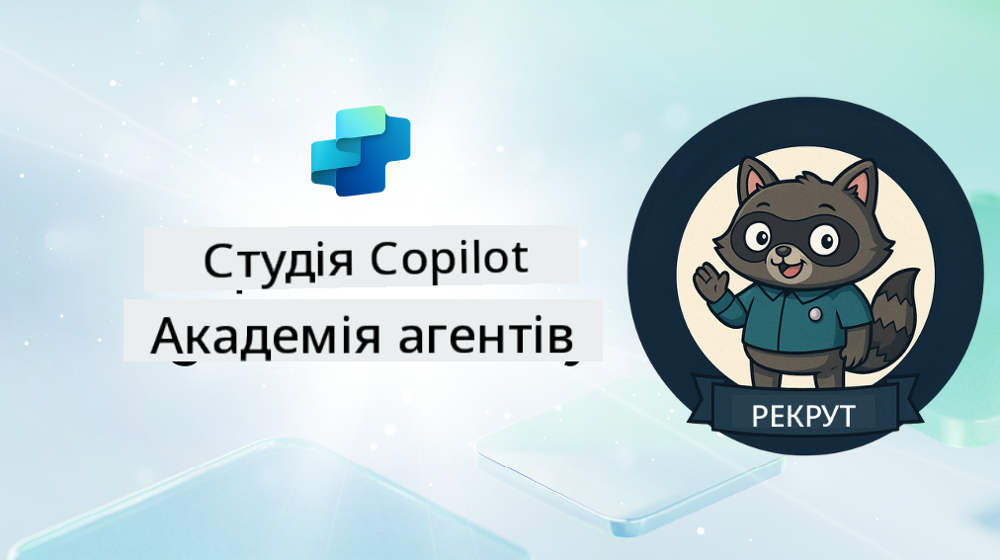

<!--
CO_OP_TRANSLATOR_METADATA:
{
  "original_hash": "8b5ecad9d5d073ea3f4c2b844e80f2e5",
  "translation_date": "2025-10-21T18:15:12+00:00",
  "source_file": "docs/recruit/README.md",
  "language_code": "uk"
}
-->
# Ласкаво просимо, Рекруте

**Ласкаво просимо, Рекруте.**  
Ваша місія—якщо ви вирішите її прийняти—опанувати мистецтво створення агентів за допомогою **Microsoft Copilot Studio**.

Це практичне навчання стане вашим стартом у **світі агентів**: від створення запитів до адаптивних карток і потоків агентів, ви навчитеся створювати, масштабувати та впроваджувати інтелектуальних агентів, використовуючи реальні інструменти та приклади.

---

## 🎯 Мета Місії

Після завершення Академії Агентів ви зможете:

- Зрозуміти, що таке агенти в контексті Microsoft Copilot Studio
- Дослідити, як великі мовні моделі (LLMs), генерація з доповненням даних (RAG) та оркестрація об'єднуються в агенті
- Створювати як **декларативних**, так і **кастомних агентів**
- Покращувати агентів за допомогою **Тем**, **Адаптивних карток** та **Потоків агентів**
- Впроваджувати агентів у **Microsoft Teams** та **Microsoft 365 Copilot**

---

## 🧪 Попередні умови

Для виконання всіх місій вам знадобиться:

- Тенант розробника Microsoft 365 (з увімкненим SharePoint)
- Доступ до **Microsoft Copilot Studio** (тестовий або ліцензований)
- Опціонально: базові знання SharePoint, Power Platform або Power Fx

---

## 🧬 Для кого цей курс

Цей курс ідеально підходить для:

- Творців і розробників, які досліджують **Copilot Studio**
- IT-фахівців, які створюють **розширення Microsoft 365 Copilot**
- Ентузіастів Power Platform, які хочуть **підвищити рівень** за допомогою інтелектуальних агентів
- Усіх, хто віддає перевагу навчанню через **практику**

---

## 🧭 Огляд навчальної програми

Академія складається з прогресивних уроків—кожен з яких розроблений як польова місія для підвищення ваших навичок створення агентів.

| Урок | Назва | Короткий опис місії |
|------|-------|---------------------|
| `00` | 🧰 [Налаштування курсу](./00-course-setup/README.md) | Налаштуйте середовище розробки, тестову версію Copilot Studio та сайт SharePoint |
| `01` | 🧠 [Вступ до агентів](./01-introduction-to-agents/README.md) | Зрозумійте концепції розмовного AI, LLMs та автономних vs декларативних агентів |
| `02` | 🛠️ [Основи Copilot Studio](./02-copilot-studio-fundamentals/README.md) | Вивчіть основні елементи: знання, навички, автономність |
| `03` | 👩‍💻 [Створення декларативного агента](./03-create-a-declarative-agent-for-M365Copilot/README.md) | Додайте власного агента до Microsoft 365 Copilot, заснованого на запиті |
| `04` | 🧩 [Створення рішення](./04-creating-a-solution/README.md) | Упакуйте вашого агента в багаторазове рішення для управління середовищем |
| `05` | 🚀 [Початок роботи з готовими агентами](./05-using-prebuilt-agents/README.md) | Використовуйте та налаштовуйте шаблон агента для прискорення налаштування |
| `06` | ✍️ [Створення кастомного агента](./06-create-agent-from-conversation/README.md) | Створіть нового Copilot, заснованого на джерелах знань |
| `07` | 🧠 [Додавання теми з тригерами](./07-add-new-topic-with-trigger/README.md) | Використовуйте Теми для визначення шляхів запитання/відповіді |
| `08` | 🪪 [Покращення за допомогою адаптивних карток](./08-add-adaptive-card/README.md) | Створіть адаптивну картку за допомогою Power Fx та SharePoint |
| `09` | 🔁 [Автоматизація за допомогою потоків агентів](./09-add-an-agent-flow/README.md) | Використовуйте введення адаптивної картки для запуску бекенд-потоків |
| `10` | 🧭 [Додавання тригерів подій](./10-add-event-triggers/README.md) | Дозвольте вашому агенту діяти автономно, використовуючи логіку на основі подій |
| `11` | 📢 [Публікація вашого агента](./11-publish-your-agent/README.md) | Впровадьте вашого агента у Microsoft Teams та Microsoft 365 Copilot |
| `12` | 🪪 [Розуміння ліцензування](./12-understanding-licensing/README.md) | Дізнайтеся, як працює ліцензування та оплата у Copilot Studio |
| `13` | 🚨 [Отримання значка рекрута](./course-completion-badges-recruit/README.md) | Отримайте ваш значок та відзначте своє досягнення! |

!!! note
    ✅ Завершення цієї програми дає вам значок **Рекрут**.  
    🔓 **Оперативник** та **Командир** будуть доступні у майбутніх фазах.

<!-- markdownlint-disable-next-line MD033 -->

---

**Відмова від відповідальності**:  
Цей документ був перекладений за допомогою сервісу автоматичного перекладу [Co-op Translator](https://github.com/Azure/co-op-translator). Хоча ми прагнемо до точності, будь ласка, майте на увазі, що автоматичні переклади можуть містити помилки або неточності. Оригінальний документ на його рідній мові слід вважати авторитетним джерелом. Для критичної інформації рекомендується професійний людський переклад. Ми не несемо відповідальності за будь-які непорозуміння або неправильні тлумачення, що виникають внаслідок використання цього перекладу.