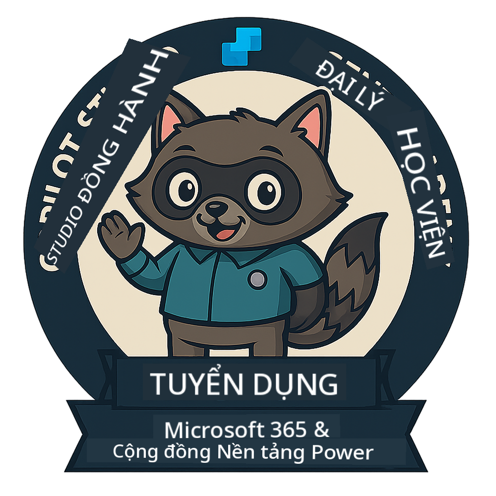

<!--
CO_OP_TRANSLATOR_METADATA:
{
  "original_hash": "15e57e059ce7689d602d7853187235cd",
  "translation_date": "2025-10-20T00:29:54+00:00",
  "source_file": "docs/index.md",
  "language_code": "vi"
}
-->
---
hide:
- navigation
---

# Học viện Đại lý Copilot Studio

**Chào mừng bạn đến với Học viện Đại lý Copilot Studio.**  

Nhiệm vụ của bạn—nếu bạn chọn chấp nhận—là làm chủ nghệ thuật xây dựng các đại lý bằng **Microsoft Copilot Studio**.

Khóa đào tạo thực hành này là điểm khởi đầu của bạn vào **thế giới đại lý**: từ các lời nhắc cơ bản đến Adaptive Cards và luồng đại lý, bạn sẽ học cách xây dựng, mở rộng và triển khai các đại lý thông minh bằng các công cụ và trường hợp sử dụng thực tế.

---

## 🏅 Tiến trình cấp bậc

**Học viện Đại lý Copilot Studio** là chương trình đào tạo nhiều giai đoạn được thiết kế để nâng cao kỹ năng của bạn qua ba cấp bậc đại lý. Mỗi cấp độ bao gồm một huy hiệu và trách nhiệm ngày càng tăng:

| Cấp bậc          | Mức độ | Hình ảnh |
|------------------|:-----:|--------|
| 🟢 **Tân binh**  [🚀 Bắt đầu](https://aka.ms/agent-academy-recruit){ .md-button .md-button--primary }     | •     | { width="300" }     |
| 🔵 **Điệp viên** (Sắp ra mắt)   | ••    | { width="300" } |
| 🟡 **Chỉ huy** (Sắp ra mắt)    | •••   | { width="300" } |

Mỗi cấp độ sẽ xây dựng dựa trên cấp độ trước đó. Hoàn thành nhiệm vụ Tân binh của bạn và theo dõi để nâng cấp chứng chỉ đại lý của bạn.

---

## 🎒 Các khóa học khác

Khám phá các khóa học khác để tiếp tục học về AI và Đại lý:

- [Microsoft Copilot Studio <3 MCP Lab](https://aka.ms/mcsmcplab)
- [Trại huấn luyện Nhà phát triển Copilot](https://microsoft.github.io/copilot-camp/)
- [Đại lý AI cho người mới bắt đầu](https://microsoft.github.io/ai-agents-for-beginners/)
- [Giao thức Ngữ cảnh Mô hình (MCP) cho người mới bắt đầu](https://github.com/microsoft/mcp-for-beginners)

---

## 🚑 Vấn đề

Chúng tôi rất trân trọng phản hồi của bạn! Vui lòng sử dụng [danh sách vấn đề](https://github.com/microsoft/agent-academy/issues) để chia sẻ ý kiến và các vấn đề của bạn. Cảm ơn!

---

## 📜 Quy tắc ứng xử

Dự án này đã áp dụng [Quy tắc ứng xử mã nguồn mở của Microsoft](https://opensource.microsoft.com/codeofconduct/).

!!! info "Tài nguyên:"

    - [Quy tắc ứng xử mã nguồn mở của Microsoft](https://opensource.microsoft.com/codeofconduct/)
    - [Câu hỏi thường gặp về Quy tắc ứng xử của Microsoft](https://opensource.microsoft.com/codeofconduct/faq/)
    - Liên hệ [opencode@microsoft.com](mailto:opencode@microsoft.com) nếu có câu hỏi hoặc thắc mắc

---

[⭐️ Đánh giá kho lưu trữ của chúng tôi](https://github.com/microsoft/agent-academy){ .md-button .md-button--primary }

<!-- markdownlint-disable-next-line MD033 -->

---

**Tuyên bố miễn trừ trách nhiệm**:  
Tài liệu này đã được dịch bằng dịch vụ dịch thuật AI [Co-op Translator](https://github.com/Azure/co-op-translator). Mặc dù chúng tôi cố gắng đảm bảo độ chính xác, xin lưu ý rằng các bản dịch tự động có thể chứa lỗi hoặc không chính xác. Tài liệu gốc bằng ngôn ngữ bản địa nên được coi là nguồn thông tin chính thức. Đối với thông tin quan trọng, chúng tôi khuyến nghị sử dụng dịch vụ dịch thuật chuyên nghiệp bởi con người. Chúng tôi không chịu trách nhiệm cho bất kỳ sự hiểu lầm hoặc diễn giải sai nào phát sinh từ việc sử dụng bản dịch này.