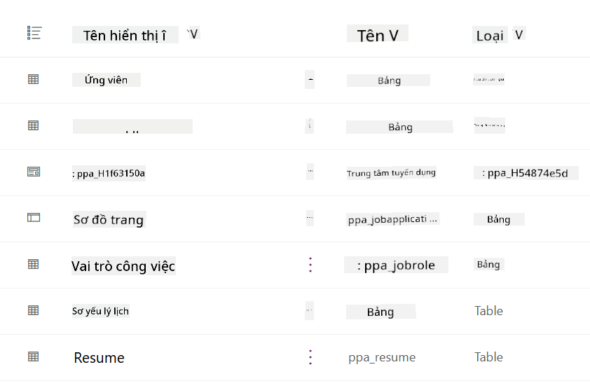
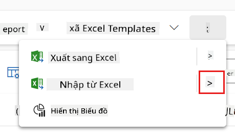
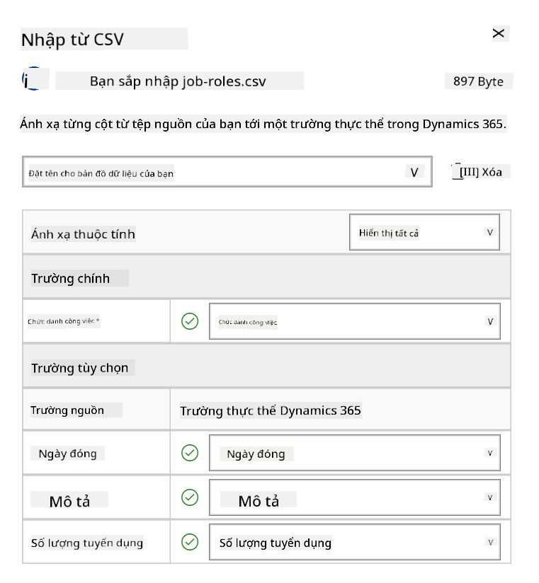
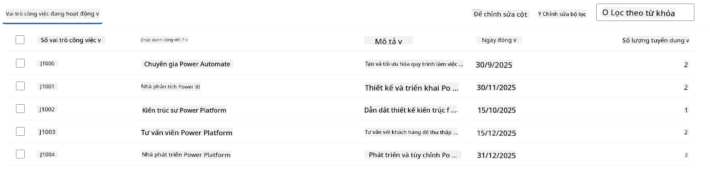
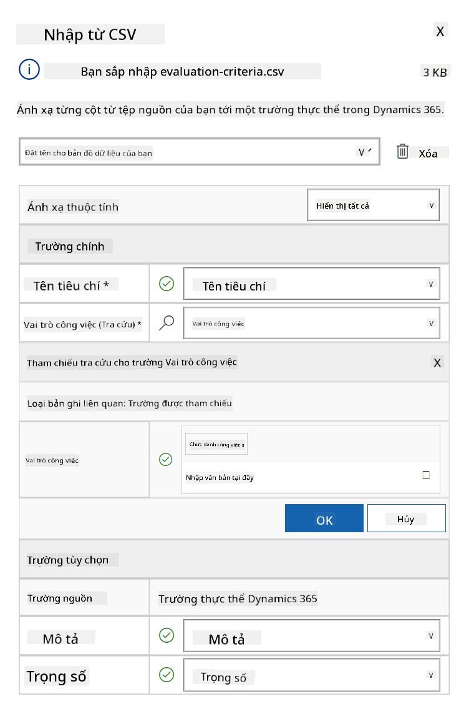
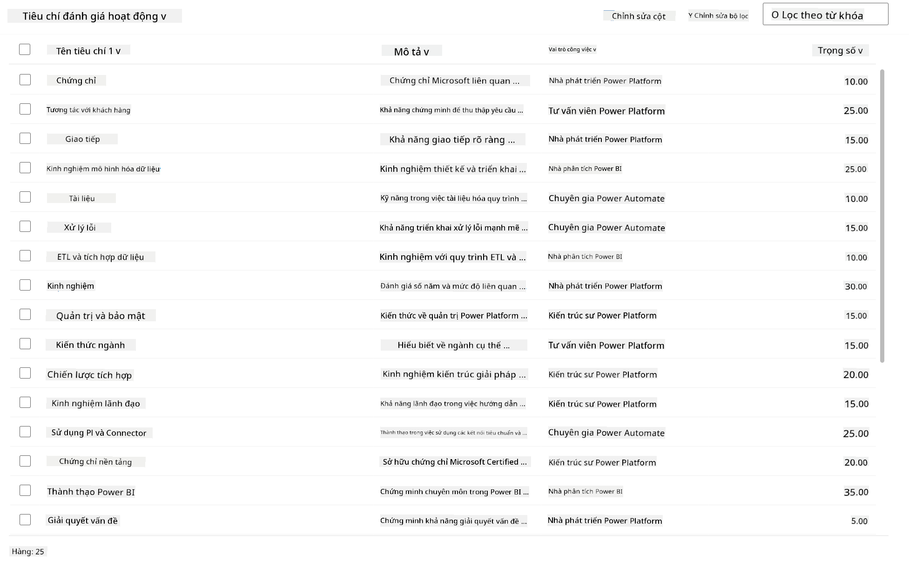

<!--
CO_OP_TRANSLATOR_METADATA:
{
  "original_hash": "2620cf9eaf09a3fc6be7fa31a3a62956",
  "translation_date": "2025-10-20T01:04:42+00:00",
  "source_file": "docs/operative-preview/01-get-started/README.md",
  "language_code": "vi"
}
-->
# 🚨 Nhiệm vụ 01: Bắt đầu với Hiring Agent

--8<-- "disclaimer.md"

## 🕵️‍♂️ MẬT DANH: `OPERATION TALENT SCOUT`

> **⏱️ Thời gian thực hiện nhiệm vụ:** `~45 phút`

## 🎯 Tóm tắt nhiệm vụ

Chào mừng, Đặc vụ. Nhiệm vụ đầu tiên của bạn là **Operation Talent Scout** - thiết lập cơ sở hạ tầng nền tảng cho hệ thống tuyển dụng dựa trên AI, nhằm cách mạng hóa cách các tổ chức xác định và tuyển dụng nhân tài hàng đầu.

Nhiệm vụ của bạn, nếu bạn chọn thực hiện, là triển khai và cấu hình một hệ thống quản lý tuyển dụng toàn diện bằng Microsoft Copilot Studio. Bạn sẽ nhập một giải pháp được xây dựng sẵn chứa tất cả các cấu trúc dữ liệu cần thiết, sau đó tạo AI agent đầu tiên của mình - **Hiring Agent** - sẽ đóng vai trò là trung tâm điều phối cho tất cả các hoạt động tuyển dụng trong tương lai.

Việc triển khai ban đầu này sẽ thiết lập trung tâm chỉ huy mà bạn sẽ phát triển trong suốt chương trình đào tạo của Agent Academy Operative. Hãy coi đây là cơ sở hoạt động của bạn - nền tảng mà bạn sẽ xây dựng một mạng lưới các agent chuyên biệt trong các nhiệm vụ tiếp theo.

---

## 🔎 Mục tiêu

Hoàn thành nhiệm vụ này, bạn sẽ:

- **Hiểu kịch bản**: Nắm vững kiến thức về các thách thức và giải pháp tự động hóa tuyển dụng  
- **Triển khai giải pháp**: Nhập và cấu hình thành công các yếu tố cơ bản của hệ thống quản lý tuyển dụng  
- **Tạo Agent**: Xây dựng một Hiring Agent, là bước khởi đầu cho kịch bản mà bạn sẽ phát triển như một Agent Academy Operative  

---

## 🔍 Yêu cầu trước khi bắt đầu

Trước khi bắt đầu nhiệm vụ này, hãy đảm bảo bạn đã:

- Có giấy phép Copilot Studio  
- Truy cập vào môi trường Microsoft Power Platform  
- Quyền quản trị để tạo giải pháp và agent  

---

## 🏢 Hiểu kịch bản tự động hóa tuyển dụng

Kịch bản này minh họa cách một công ty có thể sử dụng Microsoft Copilot Studio để cải thiện và tự động hóa quy trình tuyển dụng. Nó giới thiệu một hệ thống các agent làm việc cùng nhau để xử lý các nhiệm vụ như xem xét hồ sơ, đề xuất vị trí công việc, chuẩn bị tài liệu phỏng vấn và đánh giá ứng viên.

### Giá trị kinh doanh

Giải pháp giúp các nhóm nhân sự tiết kiệm thời gian và đưa ra quyết định tốt hơn bằng cách:

- Tự động xử lý hồ sơ nhận được qua email.  
- Đề xuất các vị trí công việc phù hợp dựa trên hồ sơ ứng viên.  
- Tạo đơn ứng tuyển và hướng dẫn phỏng vấn phù hợp với từng ứng viên.  
- Đảm bảo các quy trình tuyển dụng công bằng và tuân thủ thông qua các tính năng an toàn và kiểm duyệt tích hợp.  
- Thu thập phản hồi để cải thiện giải pháp.  

### Cách hoạt động

- Một **Hiring Agent** trung tâm điều phối quy trình và lưu trữ dữ liệu trong Microsoft Dataverse.  
- Một **Application Intake Agent** đọc hồ sơ và tạo đơn ứng tuyển.  
- Một **Interview Prep Agent** tạo câu hỏi phỏng vấn và tài liệu dựa trên nền tảng của ứng viên.  
- Hệ thống có thể được xuất bản lên một trang web demo, cho phép các bên liên quan tương tác với nó.  

Kịch bản này lý tưởng cho các tổ chức muốn hiện đại hóa quy trình tuyển dụng bằng tự động hóa dựa trên AI, đồng thời duy trì tính minh bạch, công bằng và hiệu quả.

---

## 🧪 Phòng thí nghiệm: Thiết lập Hiring Agent

Trong phòng thí nghiệm thực hành này, bạn sẽ thiết lập nền tảng cho hệ thống tự động hóa tuyển dụng của mình. Bạn sẽ bắt đầu bằng cách nhập một giải pháp được cấu hình sẵn chứa tất cả các bảng Dataverse và cấu trúc dữ liệu cần thiết để quản lý ứng viên, vị trí công việc và quy trình tuyển dụng. Tiếp theo, bạn sẽ điền dữ liệu mẫu vào các bảng này để hỗ trợ việc học của bạn trong suốt module này và cung cấp các kịch bản thực tế để thử nghiệm. Cuối cùng, bạn sẽ tạo Hiring Agent trong Copilot Studio, thiết lập giao diện hội thoại cơ bản sẽ là nền tảng cho tất cả các tính năng khác mà bạn sẽ thêm vào trong các nhiệm vụ tương lai.

### 🧪 Phòng thí nghiệm 1.1: Nhập giải pháp

1. Truy cập **[Copilot Studio](https://copilotstudio.microsoft.com)**  
1. Chọn **...** trong thanh điều hướng bên trái và chọn **Solutions**  
1. Chọn nút **Import Solution** ở trên cùng  
1. **[Tải xuống](https://raw.githubusercontent.com/microsoft/agent-academy/refs/heads/main/docs/operative-preview/01-get-started/assets/Operative_1_0_0_0.zip)** giải pháp đã chuẩn bị  
1. Chọn **Browse** và chọn giải pháp đã tải xuống từ bước trước  
1. Chọn **Next**  
1. Chọn **Import**  

!!! success
    Khi thành công, bạn sẽ thấy thanh thông báo màu xanh với thông báo sau khi hoàn tất:  
    "Solution "Operative" imported successfully."

Khi giải pháp được nhập, hãy xem những gì bạn đã nhập bằng cách chọn tên hiển thị của giải pháp (`Operative`).



Các thành phần sau được nhập:

| Tên hiển thị | Loại | Mô tả |
|--------------|------|-------|
| Candidate | Bảng | Thông tin ứng viên |
| Evaluation Criteria | Bảng | Tiêu chí đánh giá cho vị trí |
| Hiring Hub | Ứng dụng Model-Driven | Ứng dụng quản lý quy trình tuyển dụng |
| Hiring Hub | Sơ đồ trang web | Cấu trúc điều hướng cho ứng dụng Hiring Hub |
| Job Application | Bảng | Đơn ứng tuyển |
| Job Role | Bảng | Vị trí công việc |
| Resume | Bảng | Hồ sơ ứng viên |

Là nhiệm vụ cuối cùng của phòng thí nghiệm này, hãy chọn nút **Publish all customizations** ở trên cùng của trang.

### 🧪 Phòng thí nghiệm 1.2: Nhập dữ liệu mẫu

Trong phòng thí nghiệm này, bạn sẽ thêm dữ liệu mẫu vào một số bảng mà bạn đã nhập trong phòng thí nghiệm 1.1.

#### Tải xuống các tệp để nhập

1. **[Tải xuống](https://raw.githubusercontent.com/microsoft/agent-academy/refs/heads/main/docs/operative-preview/01-get-started/assets/evaluation-criteria.csv)** tệp CSV chứa tiêu chí đánh giá  
1. **[Tải xuống](https://raw.githubusercontent.com/microsoft/agent-academy/refs/heads/main/docs/operative-preview/01-get-started/assets/job-roles.csv)** tệp CSV chứa các vị trí công việc  

#### Nhập dữ liệu mẫu vị trí công việc

1. Quay lại giải pháp bạn vừa nhập trong phòng thí nghiệm trước  
1. Chọn ứng dụng Model-Driven **Hiring Hub** bằng cách chọn dấu kiểm trước hàng  
1. Chọn nút **Play** ở trên cùng  

    !!! warning
        Bạn có thể được yêu cầu đăng nhập lại. Hãy chắc chắn thực hiện điều đó. Sau khi đăng nhập, bạn sẽ thấy ứng dụng Hiring Hub.

1. Chọn **Job Roles** trong thanh điều hướng bên trái  
1. Chọn biểu tượng **More** (ba dấu chấm xếp chồng lên nhau) trong thanh lệnh  
1. Chọn **mũi tên phải** bên cạnh *Import from Excel*  

    

1. Chọn **Import from CSV**  

    

1. Chọn nút **Choose File**, chọn tệp **job-roles.csv** bạn vừa tải xuống và sau đó chọn **Open**  
1. Chọn **Next**  
1. Để bước tiếp theo như hiện tại và chọn **Review Mapping**  

    

1. Đảm bảo ánh xạ chính xác và chọn **Finish Import**  

    !!! info
        Điều này sẽ bắt đầu quá trình nhập và bạn có thể theo dõi tiến trình hoặc hoàn tất quá trình ngay lập tức bằng cách chọn **Done**

1. Chọn **Done**

Quá trình này có thể mất một chút thời gian, nhưng bạn có thể nhấn nút **Refresh** để xem liệu việc nhập đã thành công chưa.



#### Nhập dữ liệu mẫu tiêu chí đánh giá

1. Chọn **Evaluation Criteria** trong thanh điều hướng bên trái  
1. Chọn biểu tượng **More** (ba dấu chấm xếp chồng lên nhau) trong thanh lệnh  
1. Chọn **mũi tên phải** bên cạnh *Import from Excel*  

    

1. Chọn **Import from CSV**  

    

1. Chọn nút **Choose File**, chọn tệp **evaluation-criteria.csv** bạn vừa tải xuống và sau đó chọn **Open**  
1. Chọn **Next**  
1. Để bước tiếp theo như hiện tại và chọn **Review Mapping**  

    

1. Bây giờ chúng ta cần làm thêm một chút để ánh xạ. Chọn kính lúp (biểu tượng 🔎) bên cạnh trường Job Role  
1. Đảm bảo **Job Title** được chọn ở đây, nếu không - hãy thêm vào  
1. Chọn **OK**  
1. Đảm bảo các ánh xạ còn lại cũng chính xác và chọn **Finish Import**  

    !!! info
        Điều này sẽ bắt đầu quá trình nhập lại và bạn có thể theo dõi tiến trình hoặc hoàn tất quá trình ngay lập tức bằng cách chọn **Done**

1. Chọn **Done**

Quá trình này có thể mất một chút thời gian, nhưng bạn có thể nhấn nút **Refresh** để xem liệu việc nhập đã thành công chưa.



### 🧪 Phòng thí nghiệm 1.3: Tạo Hiring Agent

Bây giờ bạn đã hoàn thành việc thiết lập các yêu cầu trước, đã đến lúc thực hiện công việc chính! Hãy thêm Hiring Agent của chúng ta trước!

1. Truy cập **[Copilot Studio](https://copilotstudio.microsoft.com)** và đảm bảo bạn đang ở trong cùng môi trường nơi bạn đã nhập giải pháp và dữ liệu  
1. Chọn **Agents** trong thanh điều hướng bên trái  
1. Chọn **New Agent**  
1. Chọn **Configure**  
1. Trong **Name**, nhập:

    ```text
    Hiring Agent
    ```

1. Trong **Description**, nhập:

    ```text
    Central orchestrator for all hiring activities
    ```

1. Chọn **...** bên cạnh nút *Create* ở góc trên bên phải  
1. Chọn **Update advanced settings**  
1. Trong **Solution**, chọn `Operative`  
1. Chọn **Update**  
1. Chọn **Create** ở góc trên bên phải  

Điều này sẽ tạo Hiring Agent cho bạn, mà bạn sẽ sử dụng trong suốt khóa học Operative.

---

## 🎉 Hoàn thành nhiệm vụ

Nhiệm vụ 01 đã hoàn thành! Bạn đã nắm vững các kỹ năng sau:

✅ **Hiểu kịch bản**: Kiến thức toàn diện về các thách thức và giải pháp tự động hóa tuyển dụng  
✅ **Triển khai giải pháp**: Nhập và cấu hình thành công các yếu tố cơ bản của hệ thống quản lý tuyển dụng  
✅ **Tạo Agent**: Xây dựng một Hiring Agent, là bước khởi đầu cho kịch bản bạn sẽ phát triển như một Agent Academy Operative  

Tiếp theo là [Nhiệm vụ 02](../02-multi-agent/README.md): Chuẩn bị cho agent của bạn hoạt động đa agent với các agent được kết nối.

---

## 📚 Tài nguyên chiến thuật

📖 [Microsoft Copilot Studio - Tạo một agent](https://learn.microsoft.com/microsoft-copilot-studio/authoring-first-bot)  
📖 [Tài liệu Microsoft Dataverse](https://learn.microsoft.com/power-apps/maker/data-platform)  

---

**Tuyên bố miễn trừ trách nhiệm**:  
Tài liệu này đã được dịch bằng dịch vụ dịch thuật AI [Co-op Translator](https://github.com/Azure/co-op-translator). Mặc dù chúng tôi cố gắng đảm bảo độ chính xác, xin lưu ý rằng các bản dịch tự động có thể chứa lỗi hoặc không chính xác. Tài liệu gốc bằng ngôn ngữ bản địa nên được coi là nguồn thông tin chính thức. Đối với thông tin quan trọng, nên sử dụng dịch vụ dịch thuật chuyên nghiệp bởi con người. Chúng tôi không chịu trách nhiệm cho bất kỳ sự hiểu lầm hoặc diễn giải sai nào phát sinh từ việc sử dụng bản dịch này.