<!--
CO_OP_TRANSLATOR_METADATA:
{
  "original_hash": "75efaf515d5694d4fd549bfd6518901a",
  "translation_date": "2025-10-20T01:11:21+00:00",
  "source_file": "docs/operative-preview/03-automate-triggers/README.md",
  "language_code": "vi"
}
-->
# Nhiệm vụ 03: Thêm Trình Kích Hoạt Sự Kiện để hoạt động tự động

--8<-- "disclaimer.md"

## 🕵️‍♂️ MẬT DANH: `CHIẾN DỊCH ĐIỂM TÍN HIỆU`

> **⏱️ Thời gian thực hiện chiến dịch:** `~45 phút`

## 🎯 Tóm tắt nhiệm vụ

Chào mừng trở lại, Đặc vụ. Trong [Nhiệm vụ 02](../02-multi-agent/README.md) - bạn đã học cách xây dựng một tác nhân con Tiếp nhận Hồ sơ và một tác nhân Kết nối Chuẩn bị Phỏng vấn để mở rộng khả năng của Tác nhân Tuyển dụng chính.

Nhiệm vụ của bạn, nếu bạn chọn thực hiện, là **Chiến dịch Điểm Tín Hiệu** - đi sâu vào **trình kích hoạt sự kiện** - nâng cấp hệ thống tác nhân của bạn từ phản ứng sang **hoạt động tự động**. Bạn sẽ biến các tác nhân của mình từ việc chờ đợi đầu vào của con người sang chủ động phản hồi các sự kiện bên ngoài và thực hiện hành động thông minh mà không cần giám sát.

Hãy nghĩ về điều này như việc nâng cấp từ các tác nhân _trả lời câu hỏi_ sang các tác nhân _dự đoán nhu cầu_ và _hành động độc lập_. Thông qua trình kích hoạt sự kiện và quy trình làm việc tự động, Tác nhân Tuyển dụng của bạn sẽ phát hiện email hồ sơ đến, xử lý tệp đính kèm tự động, lưu dữ liệu vào Dataverse và thông báo cho nhóm tuyển dụng nhân sự của bạn qua Microsoft Teams - tất cả trong khi bạn tập trung vào các nhiệm vụ có giá trị cao hơn.

Chào mừng bạn đến với thế giới nơi tự động hóa gặp gỡ trí tuệ.

## 🔎 Mục tiêu

Trong nhiệm vụ này, bạn sẽ học:

1. Cách trình kích hoạt sự kiện cho phép hành vi tự động của tác nhân mà không cần tương tác của người dùng
1. Sự khác biệt giữa tác nhân tương tác và tác nhân tự động trong Copilot Studio
1. Cách tạo trình kích hoạt sự kiện để tự động xử lý tệp đính kèm email và tải tệp lên Dataverse
1. Cách xây dựng luồng tác nhân đăng thẻ thích ứng lên các kênh Teams để thông báo
1. Cách truyền dữ liệu giữa trình kích hoạt sự kiện và luồng tác nhân để tự động hóa từ đầu đến cuối

## 🤔 Trình kích hoạt sự kiện là gì?

Trước đây trong [Recruit](../../recruit/10-add-event-triggers/README.md), chúng ta đã học về trình kích hoạt sự kiện. Hãy cùng ôn lại nhanh điều này trong trường hợp bạn đã bỏ lỡ.

**Trình kích hoạt sự kiện** cho phép một tác nhân _hành động_ tự động khi có điều gì đó xảy ra trong hệ thống khác - không cần tin nhắn từ người dùng. Khi sự kiện được cấu hình xảy ra - chẳng hạn như “mục mới trong SharePoint,” “email mới,” “nhiệm vụ Planner được giao,” hoặc thậm chí là sự kiện lặp lại theo thời gian, một trình kết nối sẽ gửi một tải trọng kích hoạt đến tác nhân của bạn. Sau đó, tác nhân sẽ làm theo hướng dẫn của bạn để quyết định hành động hoặc chủ đề nào cần gọi.

### Đặc điểm chính

- **Kích hoạt tự động:**
      - Không giống như trình kích hoạt chủ đề bắt đầu khi người dùng nhập vào tác nhân, trình kích hoạt sự kiện được kích hoạt từ các sự kiện bên ngoài, cho phép hành vi chủ động.

- **Dựa trên tải trọng:**
      - Mỗi sự kiện cung cấp một tải trọng (biến + hướng dẫn tùy chọn) thông qua trình kết nối. Tác nhân sử dụng hướng dẫn bạn đã định nghĩa và tải trọng để chọn hành động tiếp theo.
      - Ví dụ _gọi một chủ đề_ hoặc _thực hiện các hành động được định nghĩa bởi Công cụ_.

- **Ví dụ có sẵn:**
      - Tệp hoặc mục được tạo trong SharePoint/OneDrive
      - Nhiệm vụ Planner được hoàn thành/được giao
      - Phản hồi Microsoft Forms được gửi
      - Lặp lại/lịch trình

    Tính khả dụng phụ thuộc vào chính sách dữ liệu của tổ chức bạn được cấu hình trong Power Automate.

- **Yêu cầu điều phối sinh tạo:**
      - Trình kích hoạt sự kiện chỉ khả dụng khi điều phối sinh tạo được kích hoạt cho tác nhân.

- **Chi phí/sử dụng:**
      - Mỗi lần kích hoạt được tính là một tin nhắn trong dung lượng của Copilot Studio.
      - Ví dụ, một sự kiện lặp lại 10 phút sẽ gửi một tin nhắn mỗi 10 phút.

- **Mô hình xác thực và thiết lập:**
      - Bạn thêm trình kích hoạt trong phần Tổng quan của tác nhân, dưới _Triggers_. Xác thực cho trình kết nối kích hoạt sử dụng tài khoản của người tạo tác nhân (“xác thực người tạo tác nhân”).
      - Bạn có thể chỉnh sửa các tham số và tải trọng của trình kích hoạt trong cổng tạo Power Automate.

- **Kiểm tra & quan sát:**
      - Bạn có thể kiểm tra trình kích hoạt từ bảng kiểm tra của tác nhân và kiểm tra hành vi với bản đồ hoạt động trước khi xuất bản.

!!! info "Tóm tắt nhanh cho nhà phát triển"

    Hãy nghĩ về trình kích hoạt sự kiện như **tín hiệu giống webhook** đẩy một tải trọng có cấu trúc vào tác nhân của bạn, cho phép nó _khởi động_ công việc và chuỗi hành động qua các hệ thống - mà không cần chờ người dùng yêu cầu.

### Trình kích hoạt chủ đề - sự khác biệt

Trước đây bạn đã học về trình kích hoạt chủ đề trong [Recruit](../../recruit/07-add-new-topic-with-trigger/README.md), tuy nhiên bạn có thể vẫn đang tự hỏi sự khác biệt giữa trình kích hoạt _chủ đề_ và trình kích hoạt _sự kiện_, và tại sao sự khác biệt này lại quan trọng để hiểu điều gì làm cho một tác nhân tự động.

Trình kích hoạt chủ đề kiểm soát _khi nào một chủ đề chạy_, thường là để phản hồi tin nhắn của người dùng.

- Trong điều phối sinh tạo, trình kích hoạt mặc định là **By agent** - trình lập kế hoạch chọn một chủ đề có tên/mô tả phù hợp nhất với tin nhắn của người dùng.
- Trong điều phối cổ điển, trình kích hoạt mặc định là **Phrases** - trình lập kế hoạch chọn một chủ đề khi một hoặc nhiều cụm từ kích hoạt phù hợp nhất với tin nhắn của người dùng.

Các loại trình kích hoạt khác bao gồm `Message received`, `Event received`, `Activity received`, `Conversation update`, `Invoke received`, `On redirect`, `Inactivity`, và `Plan complete`.

!!! info "Sự khác biệt cốt lõi"

    Trình kích hoạt chủ đề là _hoạt động hội thoại_ bắt đầu bên trong cuộc trò chuyện.
    
    Trình kích hoạt sự kiện là _sự kiện hệ thống_ bắt đầu được gửi qua các trình kết nối có thể chạy tác nhân mà không cần bất kỳ cuộc trò chuyện nào.

### Hướng dẫn nhanh về Trình kích hoạt chủ đề vs Trình kích hoạt sự kiện

- **Trình kích hoạt chủ đề:** Người dùng (hoặc hoạt động trò chuyện) nói/làm X ➡️ chạy Chủ đề T.
- **Trình kích hoạt sự kiện:** SharePoint/Planner/Email/Timer kích hoạt với tải trọng P ➡️ tác nhân đánh giá hướng dẫn ➡️ gọi Hành động/Chủ đề tương ứng.

## 🏓 Tác nhân tương tác vs Tác nhân tự động - so sánh

Bây giờ bạn đã biết sự khác biệt giữa trình kích hoạt sự kiện và trình kích hoạt chủ đề, hãy tiếp tục tìm hiểu sự khác biệt giữa tác nhân tương tác và tác nhân tự động.

Trong Copilot Studio, "tương tác" ám chỉ các tác nhân chủ yếu hoạt động qua **chủ đề** trong cuộc trò chuyện hoặc kênh. "Tự động" ám chỉ các tác nhân cũng sử dụng **trình kích hoạt sự kiện** để hoạt động mà không cần đầu vào của người dùng.

Bảng sau đây tóm tắt sự khác biệt và điểm tương đồng của chúng.

| Khía cạnh                           | Tác nhân tương tác     | Tác nhân tự động                                                                                              |
|-------------------------------------|-----------------------|---------------------------------------------------------------------------------------------------------------|
| Cách bắt đầu                        | Người dùng (hoặc hoạt động trò chuyện) kích hoạt một chủ đề. Ví dụ: By agent, Phrases, Message received.   | Trình kích hoạt sự kiện gửi tải trọng qua trình kết nối đến tác nhân. Ví dụ: SharePoint, Planner, email, lịch trình, v.v. |
| Sử dụng chính                       | Hỏi đáp, quy trình hướng dẫn, hành động theo yêu cầu trong trò chuyện - Teams, web, v.v.  | Hoạt động chủ động và tự động hóa nền - phản ứng với thay đổi hệ thống và sau đó thông báo, lưu trữ, hoặc điều phối nhiệm vụ. |
| Bề mặt kích hoạt                    | Trình kích hoạt chủ đề: By agent / Phrases / Message received / Activity types / Invoke / Inactivity / Plan complete | Thư viện trình kích hoạt sự kiện qua các trình kết nối; tải trọng bao gồm dữ liệu sự kiện + hướng dẫn tùy chọn. |
| Trình lập kế hoạch (điều phối sinh tạo) | Được sử dụng mạnh mẽ cho các trình kích hoạt By agent và Plan complete để chọn/chuỗi chủ đề. | Yêu cầu cho trình kích hoạt sự kiện; tác nhân sử dụng hướng dẫn + tải trọng để quyết định hành động/chủ đề nào cần gọi. |
| Ví dụ điển hình                     | Người dùng hỏi "Chính sách hoàn tiền của chúng tôi là gì?" → Chủ đề chạy, truy vấn kiến thức, phản hồi. | Nhiệm vụ Planner mới được giao → Trình kích hoạt sự kiện kích hoạt → Tác nhân đăng tin nhắn Teams, cập nhật bản ghi, hoặc gọi một chủ đề. |
| Đường dẫn thiết lập                 | Tạo chủ đề, định nghĩa loại trình kích hoạt, tạo hội thoại/hành động; xuất bản lên các kênh. | Thêm trình kích hoạt sự kiện (Overview → Triggers), xác thực trình kết nối với thông tin đăng nhập của người tạo tác nhân, cấu hình tải trọng/hướng dẫn; kiểm tra qua bảng kiểm tra; xuất bản. |
| Xác thực và quản lý                 | Chạy dưới ngữ cảnh kênh/xác thực; trình kích hoạt chủ đề phản hồi các hoạt động trò chuyện trong các kênh được phép. | Tính khả dụng của trình kích hoạt phụ thuộc vào chính sách dữ liệu Power Automate; trình kết nối chạy dưới tài khoản của người tạo tác nhân. |
| Quan sát                            | Kiểm tra chủ đề trong Copilot Studio, kiểm tra bản ghi hội thoại/hoạt động. | Sử dụng Test trigger và bản đồ hoạt động để xác nhận thực thi trước khi xuất bản, giám sát hoạt động sau khi xuất bản. |
| Tác động dung lượng                 | Mỗi tin nhắn của người dùng/phản hồi của tác nhân là một tin nhắn tiêu thụ dung lượng. | Mỗi lần kích hoạt sự kiện cũng là một tin nhắn, cộng với bất kỳ hành động tiếp theo nào. Ví dụ: một sự kiện lặp lại 10 phút = 6 tin nhắn/giờ |

### Khi nào sử dụng loại nào?

- Chọn **trình kích hoạt chủ đề (tương tác)** khi người dùng khởi động cuộc trò chuyện với tác nhân - FAQ, tiếp nhận hướng dẫn, hoặc nhiệm vụ kiểu lệnh trong trò chuyện. Trình kích hoạt By agent của trình lập kế hoạch giảm việc tạo cụm từ thủ công.
- Thêm **trình kích hoạt sự kiện (tự động)** khi tác nhân nên bắt đầu cuộc trò chuyện hoặc tự thực hiện hành động - khi có cập nhật trong SharePoint/Dataverse, email đến, hoặc theo lịch trình. Điều này chuyển bạn từ hoạt động phản ứng sang hoạt động chủ động.

## Mẹo & lưu ý cho nhà phát triển

1. **Kích hoạt điều phối sinh tạo** cho bất kỳ tác nhân nào bạn muốn làm tự động. Trình kích hoạt sự kiện sẽ không xuất hiện nếu không có điều này.

1. **Mô hình hóa tải trọng sớm.** Quyết định các trường tối thiểu mà tác nhân của bạn cần từ trình kích hoạt như `itemId`, `assignedTo`, `dueDate` và thêm hướng dẫn ngắn gọn để chỉ cho tác nhân hành động/chủ đề nào cần gọi dựa trên giá trị tải trọng.

1. **Phạm vi xác thực quan trọng.** Trình kích hoạt xác thực bằng tài khoản của người tạo tác nhân. Đảm bảo tài khoản đó có quyền trình kết nối phù hợp và tuân thủ chính sách dữ liệu Power Automate.

1. **Kiểm soát chi phí và tiếng ồn.** Các sự kiện lặp lại tần suất cao hoặc nguồn quá nhiều tin nhắn có thể tiêu thụ dung lượng nhanh chóng - điều chỉnh nếu có thể hoặc thêm điều kiện trong trình kích hoạt để lọc sự kiện.

1. **Kiểm tra trước khi xuất bản.** Sử dụng **Test trigger** và bản đồ hoạt động để theo dõi kế hoạch và các hành động được gọi - lặp lại hướng dẫn/tải trọng cho đến khi hành vi ổn định.

## 🧪 Phòng thí nghiệm 03 - Tự động hóa email ứng tuyển của ứng viên

Tiếp theo, chúng ta sẽ thêm một trình kích hoạt sự kiện vào **Tác nhân Tuyển dụng** và xây dựng một luồng tác nhân trong **Tác nhân Tiếp nhận Hồ sơ** con để xử lý thêm cho tính tự động.

### ✨ Kịch bản sử dụng

!!! info ""

    **Là một** Nhân viên Tuyển dụng Nhân sự

    **Tôi muốn** được thông báo khi một email với hồ sơ ứng tuyển đến hộp thư của tôi và được tự động tải lên Dataverse

    **Để tôi có thể** luôn được thông báo về các hồ sơ gửi qua email cho các ứng tuyển được tự động tải lên Dataverse

Chúng ta sẽ đạt được điều này bằng hai kỹ thuật

1. Một trình kích hoạt sự kiện khi email đến,
    1. Kiểm tra `contentType` của tệp bằng `PDF` làm loại định dạng.
    1. Trích xuất tệp và tải lên Dataverse bằng các hành động thông qua trình kết nối Dataverse.
    1. Sau đó gửi một lời nhắc đến tác nhân để xử lý thêm bằng cách truyền các tham số đầu vào từ các hành động Dataverse.

1. Một luồng tác nhân sẽ được thêm vào **Tác nhân Tiếp nhận Hồ sơ** con được gọi bởi lời nhắc trong trình kích hoạt sự kiện.
    1. Sử dụng các tham số đầu vào được truyền từ lời nhắc của trình kích hoạt sự kiện trong một thẻ thích ứng được đăng lên một kênh trong Microsoft Teams để thông báo cho nhóm Tuyển dụng Nhân sự. Thẻ thích ứng sẽ có liên kết đến hàng trong Dataverse sẽ được xem trong **Tác nhân Tuyển dụng**.

Hãy bắt đầu!

### ✨ Điều kiện tiên quyết để hoàn thành nhiệm vụ này

Bạn cần **một trong hai**:

- **Hoàn thành Nhiệm vụ 01 và Nhiệm vụ 02** và có Tác nhân Tuyển dụng sẵn sàng, **HOẶC**
- **Nhập giải pháp khởi đầu Nhiệm vụ 03** nếu bạn bắt đầu từ đầu hoặc cần bắt kịp. [Tải xuống Giải pháp Khởi đầu Nhiệm vụ 03](https://aka.ms/agent-academy)

!!! note "Nhập giải pháp và dữ liệu mẫu"
    Nếu bạn sử dụng giải pháp khởi đầu, hãy tham khảo [Nhiệm vụ 01](../01-get-started/README.md) để biết hướng dẫn chi tiết về cách nhập giải pháp và dữ liệu mẫu vào môi trường của bạn.

Bạn cũng cần quyền truy cập vào **Microsoft Teams** để hoàn thành bài tập phòng thí nghiệm thứ hai về việc đăng thẻ thích ứng lên Microsoft Teams.

### Phòng thí nghiệm 3.1 - Tự động tải hồ sơ lên Dataverse nhận qua email

1. Trong Tác nhân Tuyển dụng, cuộn xuống trong **tab Tổng quan** và chọn **+ Thêm trình kích hoạt**.

       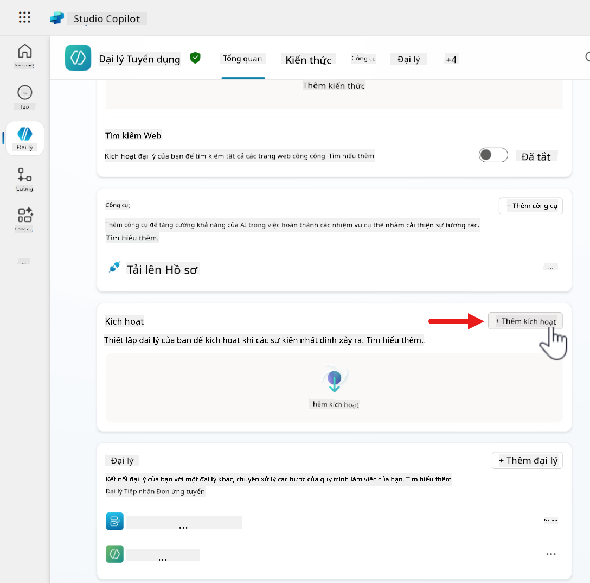

1. Một danh sách các trình kích hoạt sẽ xuất hiện. Chọn **Khi một email mới đến (V3)** và chọn **Tiếp theo**.

       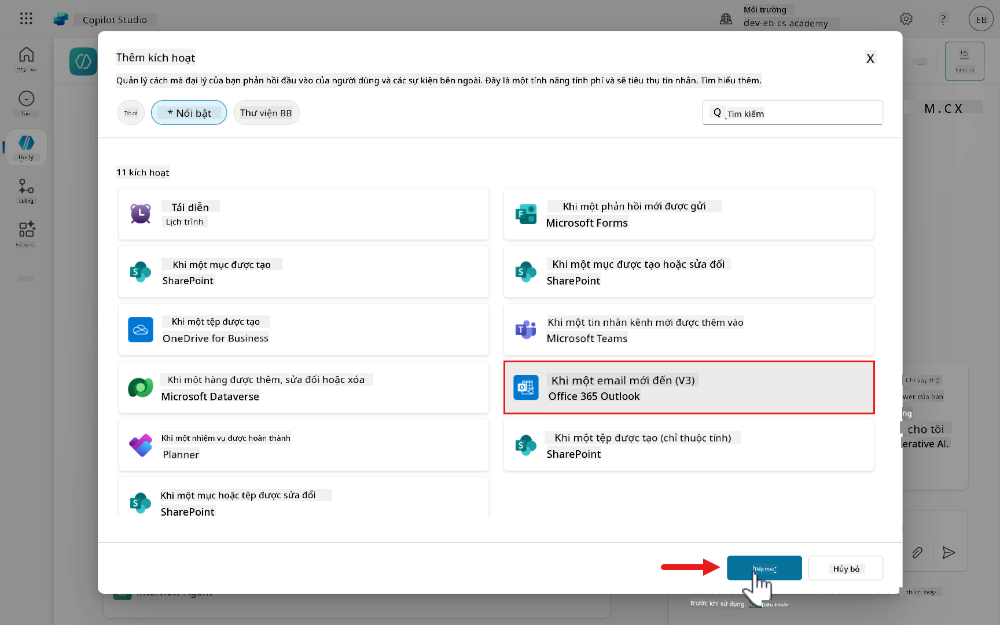

1. Bây giờ chúng ta sẽ thấy **Tên trình kích hoạt** và các tham chiếu kết nối **Đăng nhập** cho các ứng dụng được liệt kê.

       Đổi tên trình kích hoạt thành,
    
       ```text
       Khi một email mới đến từ ứng viên
       ```

       Đảm bảo bạn thấy dấu kiểm màu xanh lá cây bên cạnh mỗi tham chiếu kết nối của các ứng dụng được liệt kê. Nếu bạn không thấy dấu kiểm màu xanh lá cây, hãy đăng nhập qua dấu ba chấm (...) và chọn **+ Tham chiếu kết nối mới** để tạo một tham chiếu kết nối mới.

       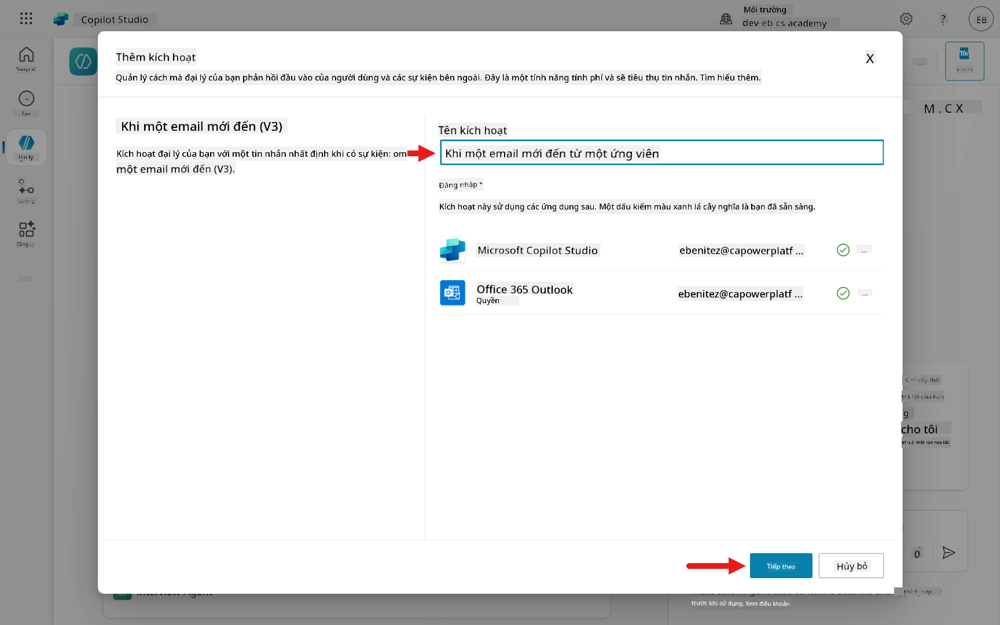

1. Bước cuối cùng là thiết lập các thuộc tính đầu vào của trình kích hoạt. Cập nhật các thuộc tính sau đây như sau,

     | Thuộc tính | Cách thiết lập | Chi tiết |
     |------------|----------------|----------|
     | **Bao gồm tệp đính kèm (Tùy chọn)** | Dropdown | Có |
     | **Bộ lọc tiêu đề (Tùy chọn)** | Nhập bằng bàn phím | Application |
     | **Chỉ với tệp đính kèm (Tùy chọn)** | Dropdown | Có |

       Chọn **Tạo trình kích hoạt**.

       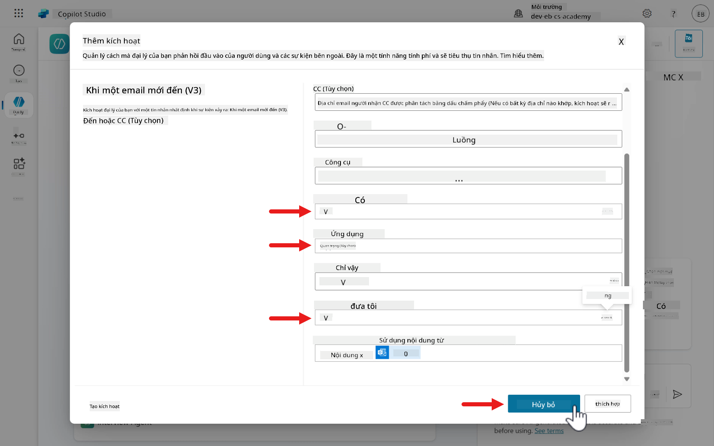

1. Sau khi tạo, một thông báo xác nhận sẽ xuất hiện rằng trình kích hoạt đã được thêm vào tác nhân. Chọn **Đóng** và trình kích hoạt sẽ được liệt kê trong phần **Triggers**.
Chúng ta sẽ cập nhật trình kích hoạt sự kiện để thêm một số khả năng tự động hóa. Chọn **dấu ba chấm (...)** bên cạnh trình kích hoạt và chọn **Chỉnh sửa trong Power Automate**.

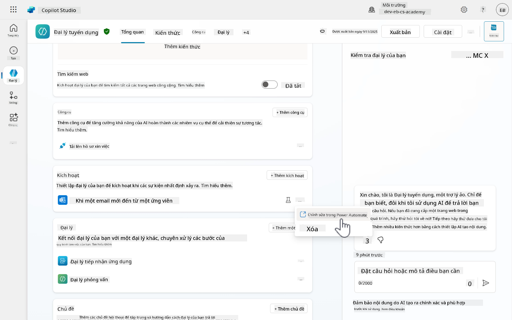

1. Trình kích hoạt sau đó sẽ được tải dưới dạng luồng trong cổng tạo Power Automate. Những gì bạn đang thấy là trình thiết kế luồng trong cổng tạo Power Automate. Đây là nơi chúng ta có thể thêm logic và hành động để tự động hóa thêm. Trình kích hoạt sẽ xuất hiện ở đầu, tiếp theo là **Gửi một lời nhắc đến copilot được chỉ định để xử lý** như hành động cuối cùng trong luồng.

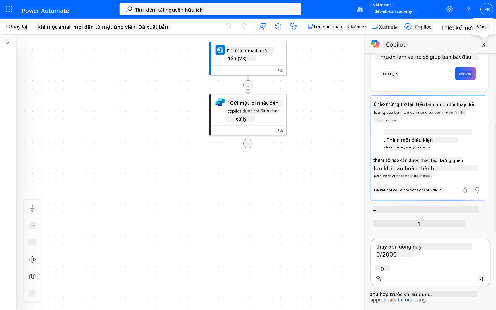

1. Theo mặc định, trình kích hoạt **Khi một email mới đến** trong Power Automate có thể xử lý nhiều email cùng lúc nếu có nhiều email đến, chỉ chạy luồng một lần cho cả nhóm.

Để đảm bảo luồng chạy riêng lẻ cho từng email, hãy bật cài đặt **Split On** trong cài đặt của trình kích hoạt và chọn `@triggerOutputs()?['body/value']` trong trường mảng thả xuống.

Khi **Split On** được bật và trường mảng được đặt thành `@triggerOutputs()?['body/value']`, luồng sẽ chạy riêng lẻ cho từng tin nhắn, ngay cả khi có nhiều tin nhắn đến cùng lúc.

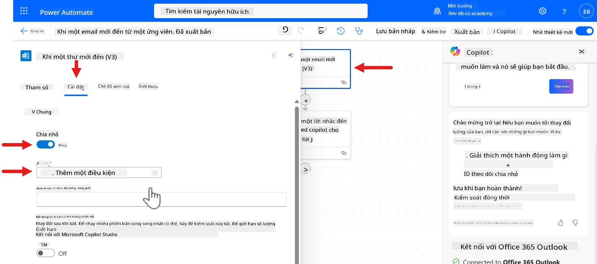

1. Tiếp theo, chúng ta sẽ thêm một số logic để kiểm tra loại tệp đính kèm, chúng ta chỉ muốn tải lên các tệp đính kèm định dạng .PDF và không phải hình ảnh (có thể đến từ chữ ký email). Chọn biểu tượng **+** bên dưới trình kích hoạt và chọn **Control** trong phần **Công cụ tích hợp sẵn**.

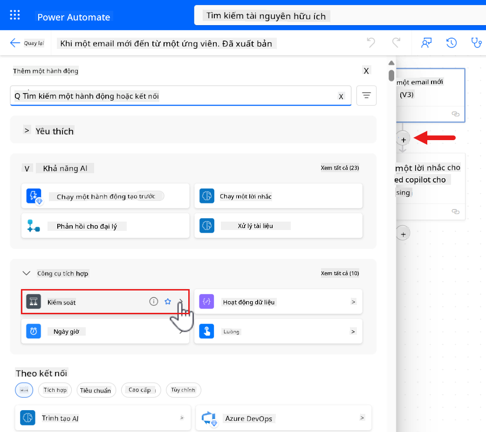

1. Chọn hành động **Condition**.

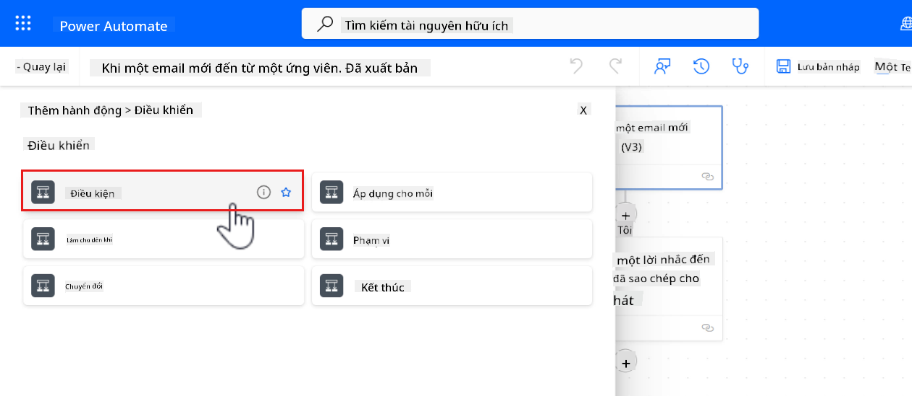

1. Bây giờ chúng ta sẽ cấu hình điều kiện để kiểm tra xem loại tệp đính kèm có phải là .PDF hay không. Trong trường **Chọn một giá trị**, chọn biểu tượng **tia sét** hoặc biểu tượng **fx** ở bên phải.

1. Trong trường **Tìm kiếm**, nhập nội dung sau,

```text
content type
```

1. Sau đó chọn tham số **Attachments Content-Type** từ trình kích hoạt.

1. Tiếp theo, chọn **Thêm** để thêm đầu vào nội dung động vào tham số **Id** của hành động.

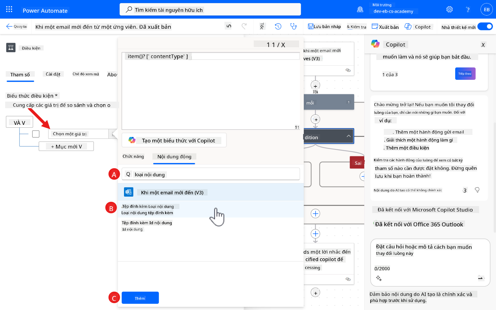

1. Hãy tạm dừng ở đây một chút, bạn có thể đã nhận thấy rằng hành động **For each** tự động xuất hiện.

Chọn hành động **For each**. Hành động này đại diện cho việc lặp qua từng tệp đính kèm trong email, vì tham số **Attachments Content-Type** từ trình kích hoạt được liên kết với từng tệp đính kèm.

Bên dưới, nó là một mảng và đó là lý do tại sao hành động **For each** được tự động thêm vào khi chúng ta chọn tham số **Attachments Content-Type** trong hành động **Condition**.

Để tìm hiểu thêm về điều này, hãy mở rộng khối học bổ sung sau.

??? info "Học bổ sung: Hành động For each tự động xuất hiện"

🤔 **Tại sao "Apply to each" hoặc "For each" tự động xuất hiện?**

Khi bạn chọn một tham số (nội dung động) đại diện cho danh sách hoặc mảng các mục - ví dụ, danh sách tệp đính kèm, email hoặc hàng - Power Automate nhận ra rằng bạn có thể muốn xử lý từng mục riêng lẻ.

Để giúp bạn làm điều này, Power Automate tự động thêm một vòng lặp **“Apply to each”** (hoặc **For each**) xung quanh hành động của bạn. Điều này đảm bảo rằng hành động của bạn sẽ chạy một lần cho mỗi mục trong danh sách, thay vì cố gắng xử lý toàn bộ danh sách cùng một lúc (có thể gây ra lỗi).

🦋 **Ví dụ**

- Nếu bạn chọn "Attachments" từ một hành động trước đó (là một mảng), và cố gắng sử dụng nó trong một hành động yêu cầu một tệp đơn lẻ, Power Automate sẽ bao quanh hành động của bạn bằng một vòng lặp **"Apply to each"** (hoặc **For each**). 
- Bằng cách này, hành động của bạn sẽ chạy cho **mỗi tệp đính kèm** - từng cái một.

💡 **Điểm chính**

- **Tự động:** Vòng lặp xuất hiện tự động để giúp bạn xử lý từng mục trong một tập hợp.
- **Ngăn chặn lỗi:** Nếu không có vòng lặp, hành động của bạn có thể thất bại vì không thể xử lý nhiều mục cùng một lúc.
- **Gợi ý trực quan:** Đây là cách trực quan để hiển thị rằng luồng của bạn sẽ lặp lại hành động cho mỗi mục trong danh sách.


1. Tiếp theo, trong trường **Chọn một giá trị** khác, nhập nội dung sau,

```text
application/pdf
```

Điều này sẽ đảm bảo rằng đối với mỗi tệp đính kèm, nó sẽ kiểm tra định dạng phần mở rộng tệp là .PDF.

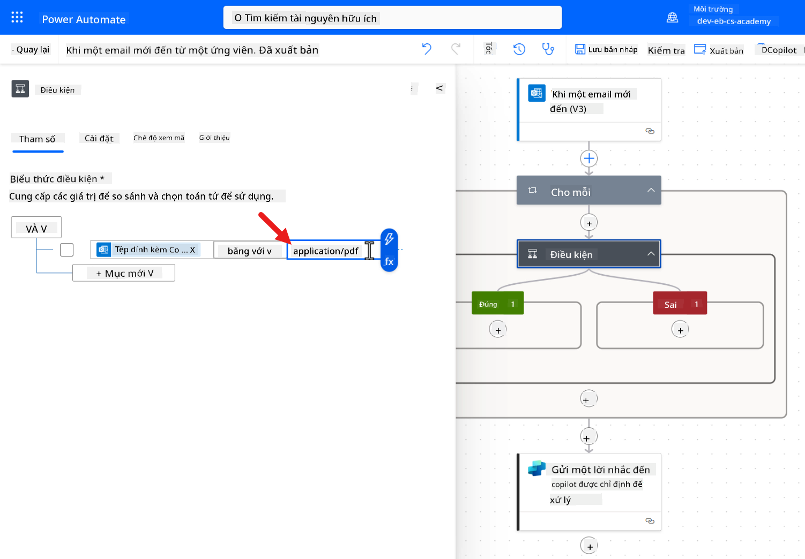

1. Bây giờ chúng ta sẽ cấu hình đường dẫn **True** để trích xuất tệp từ email và tải nó lên bảng Dataverse **Resume**.

Thêm một hành động mới bên dưới trong đường dẫn **True** và tìm kiếm `html to text`. Chọn hành động **Html to text**.

Để tìm hiểu thêm về hành động **Html to text**, hãy mở rộng khối học bổ sung sau.

??? info "Học bổ sung: Hành động Html to text"

🤔 **Hành động "HTML to text" là gì?**

Hành động **HTML to text** trong Power Automate được sử dụng để chuyển đổi nội dung định dạng HTML thành văn bản thuần túy. Điều này đặc biệt hữu ích khi bạn nhận được dữ liệu (như email, nội dung web hoặc phản hồi API) chứa các thẻ HTML, và bạn muốn trích xuất chỉ văn bản có thể đọc được mà không có bất kỳ định dạng hoặc mã nào.

⚙️ **Nó hoạt động như thế nào?**

- **Đầu vào:** Bạn cung cấp một chuỗi nội dung HTML (ví dụ, nội dung email).
- **Đầu ra:** Hành động loại bỏ tất cả các thẻ HTML và chỉ trả về văn bản thuần túy.

👍🏻 **Khi nào bạn nên sử dụng nó?**

- Khi bạn muốn trích xuất văn bản có thể đọc từ email, trang web hoặc phản hồi API chứa HTML.
- Trước khi gửi nội dung đến các hệ thống không hỗ trợ định dạng HTML (như SMS, tin nhắn Teams hoặc cơ sở dữ liệu).
- Để làm sạch dữ liệu cho việc xử lý hoặc phân tích thêm.

🔭 **Nơi tìm thấy nó?**

- Trong Power Automate cho các luồng Agent, tìm kiếm hành động có tên `HTML to text`. Nó nằm trong trình kết nối **Data Operations**.

💡 **Điểm chính**

- Nó loại bỏ tất cả các thẻ HTML và chỉ để lại văn bản.
- Nó không giải thích hoặc thực thi các script/style - chỉ loại bỏ các thẻ.
- Hữu ích cho việc làm sạch dữ liệu và chuẩn bị nội dung cho các đầu ra văn bản thuần túy.

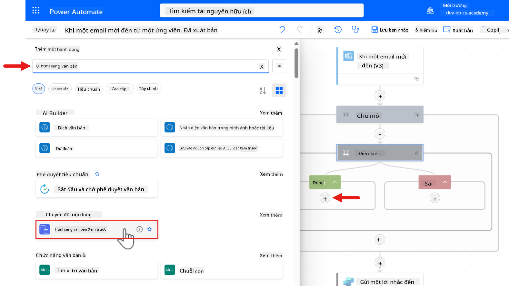

1. Tiếp theo, chúng ta cần tạo một tham chiếu kết nối mới cho hành động **Html to text** bằng cách chọn **Thêm mới**.

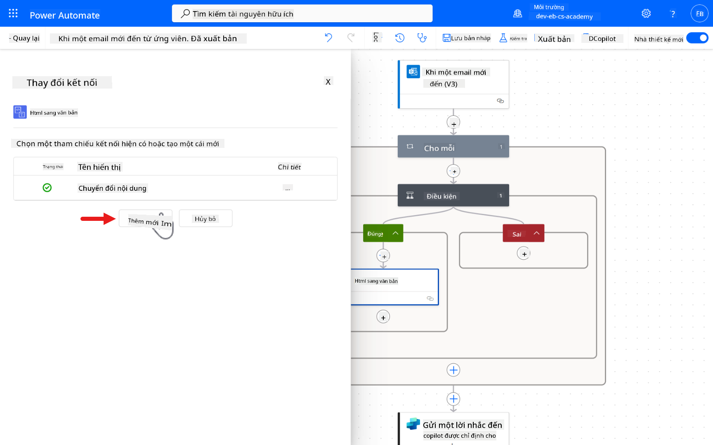

1. Hành động bây giờ có thể được cấu hình. Hãy thêm tham số **Body** từ trình kích hoạt. Trong trường **Content**, chọn biểu tượng **tia sét** hoặc **fx icon** ở bên phải.

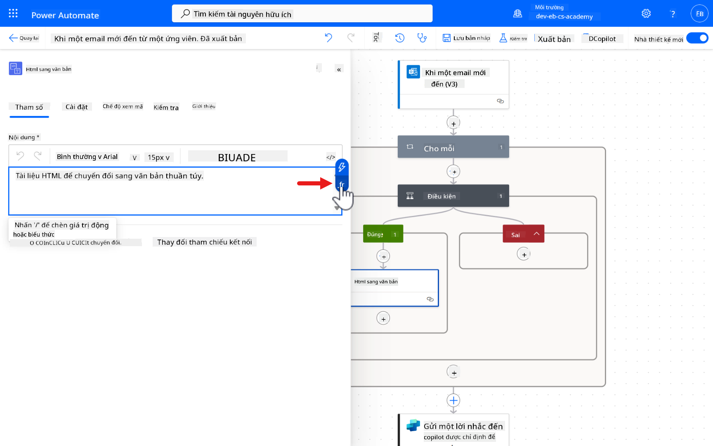

1. Trong tab **Nội dung động**, tìm kiếm `body` và chọn tham số **Body**, sau đó chọn **Thêm**.

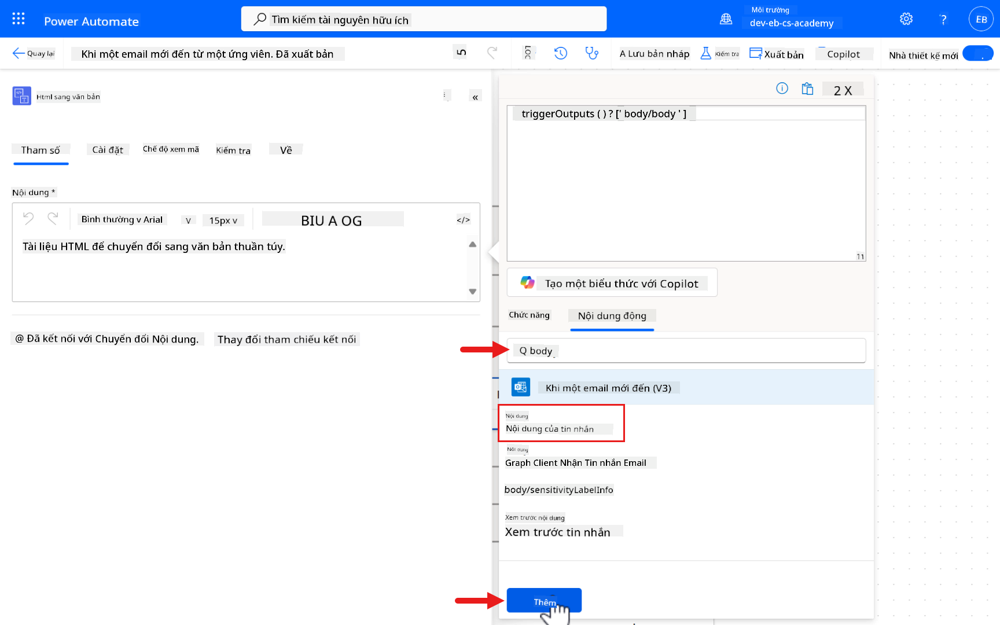

1. Chúng ta đã hoàn thành việc cấu hình hành động này, hãy thoát khỏi hành động bằng cách chọn hai dấu ngoặc kép («) chỉ về bên trái để thu nhỏ bảng điều khiển.

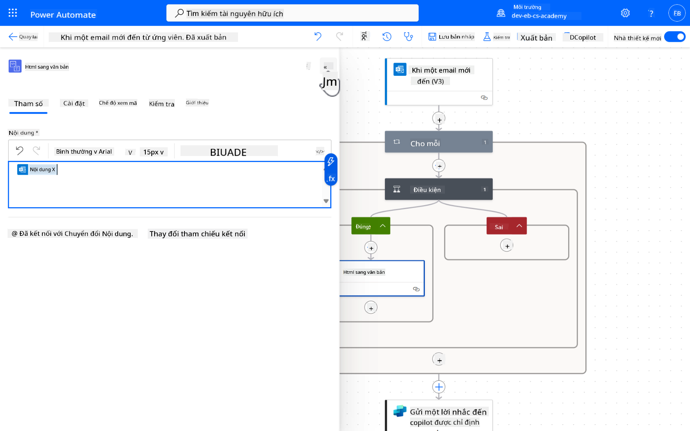

1. Chúng ta sẽ thêm một hành động mới bằng cách chọn biểu tượng **+** bên dưới hành động **Html to text**, điều này sẽ tải bảng điều khiển để thêm các hành động. Chọn trình kết nối **Microsoft Dataverse**.

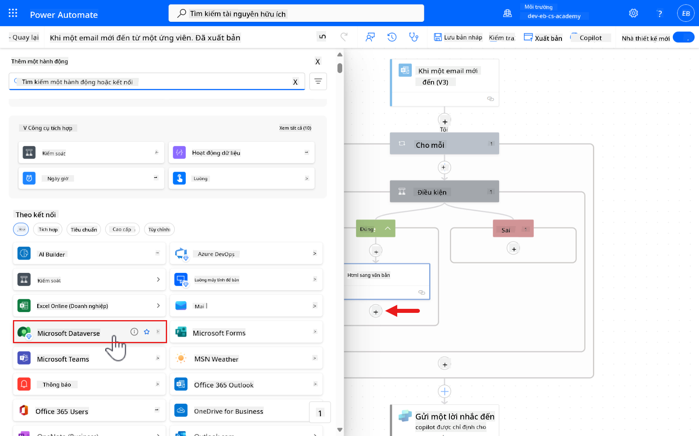

1. Chọn hành động **Thêm một hàng mới**.

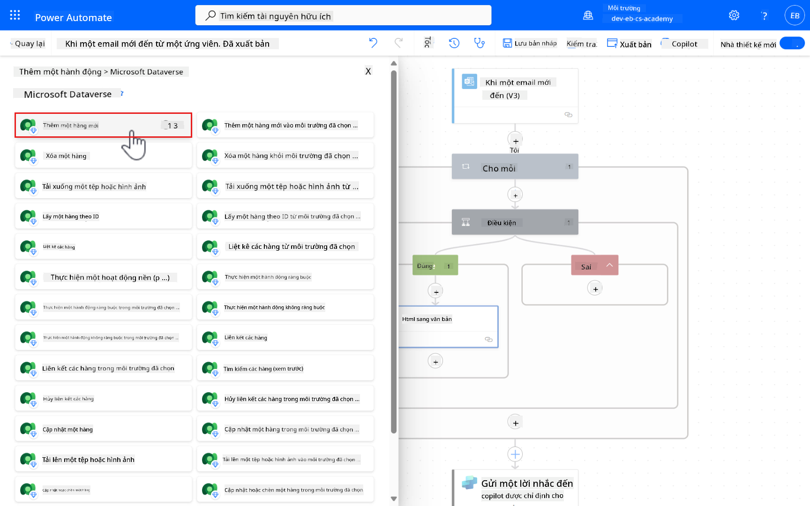

1. Đổi tên hành động bằng cách chọn **Dấu ba chấm (...)**, sao chép và dán nội dung sau làm tên,

```text
Thêm một hàng Resume mới
```

Đối với tham số **Tên bảng**, tìm kiếm `res` và chọn bảng **Resumes**.

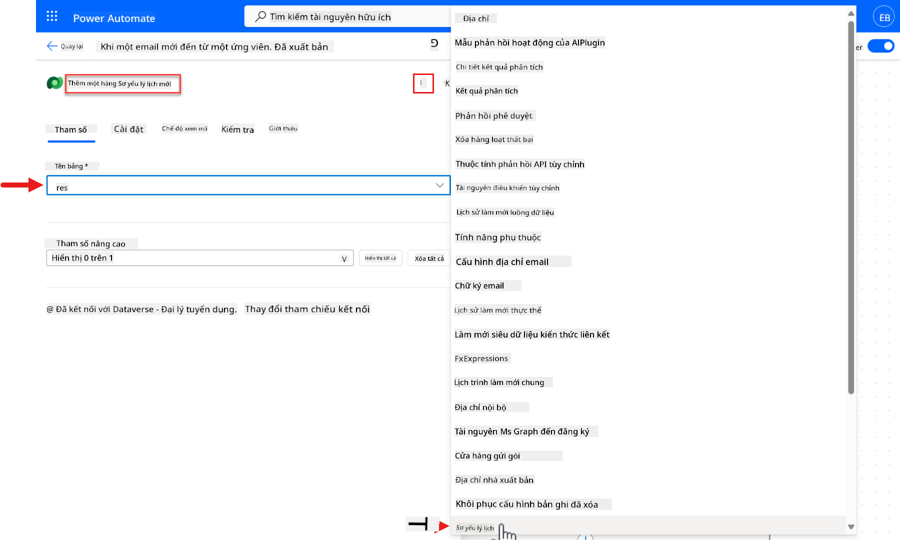

1. Tiếp theo, chọn trường **Tiêu đề Resume** và chọn biểu tượng **tia sét** hoặc **fx icon** ở bên phải.

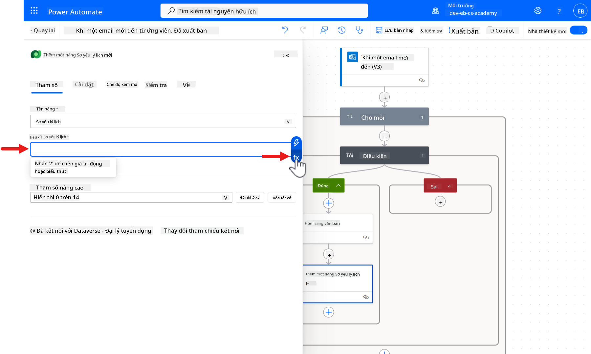

1. Trong tab **Hàm**, nhập biểu thức sau sử dụng hàm `item()`.

```text
item()?['name']
```

Để tìm hiểu thêm về hàm `item ()`, hãy mở rộng khối học bổ sung sau.

??? info "Học bổ sung: Hàm `item()`"

🤔 **Hàm `item()` là gì?**

- Khi bạn sử dụng hành động **Apply to each**, Power Automate sẽ đi qua từng phần tử trong một tập hợp (mảng).
- Nó thường được sử dụng bên trong các hành động như **Apply to each** (hoặc **For each**), **Select**, hoặc **Filter array**.

⚙️ **Nó hoạt động như thế nào?**

- `item()` là một hàm trả về phần tử hiện tại đang được xử lý trong một vòng lặp hoặc thao tác mảng.
- Bên trong vòng lặp đó, `item()` đề cập đến _phần tử hiện tại_ đang được xử lý.

📌 **Nơi bạn sử dụng nó?**

- **Apply to each:** để truy cập các thuộc tính của phần tử hiện tại.
- **Select:** để chuyển đổi từng phần tử trong một mảng.
- **Filter array:** để tham chiếu phần tử hiện tại đang được đánh giá.

🦋 **Ví dụ**

- Biểu thức bên trong vòng lặp:
       -  `item()?['Email']`
- Điều này lấy thuộc tính `Email` của phần tử hiện tại.

💡 **Điểm chính**

- `item()` là _nhạy cảm với ngữ cảnh_: nó luôn đề cập đến phần tử hiện tại trong vòng lặp hoặc thao tác mảng mà bạn đang thực hiện.
- Nếu bạn lồng các vòng lặp, bạn có thể sử dụng `items('LoopName')` để tham chiếu đến các phần tử trong một vòng lặp cụ thể.

Chọn **Thêm** để thêm biểu thức vào tham số **Tiêu đề Resume**.

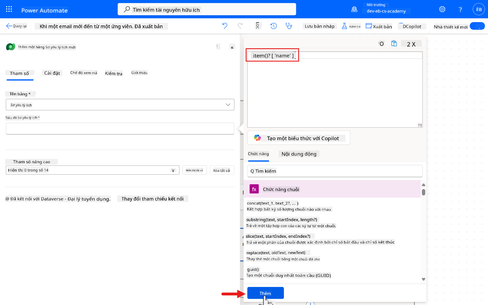

1. Chúng ta vẫn cần cấu hình thêm một số tham số, chọn **Hiển thị tất cả** và trong trường **Thư giới thiệu**, chọn biểu tượng **tia sét** hoặc **fx icon** ở bên phải.

Trong tab **Hàm**, nhập biểu thức sau sử dụng cùng biểu thức trong [nhiệm vụ trước](../02-multi-agent/README.md).

```text
if(greater(length(body('Html_to_text')), 2000), substring(body('Html_to_text'), 0, 2000), body('Html_to_text'))
```

Biểu thức này kiểm tra xem _văn bản_ từ hành động **Html to text** có dài hơn 2000 ký tự hay không, và nếu có, chỉ trả về 2000 ký tự đầu tiên; nếu không, nó sẽ trả về toàn bộ văn bản.

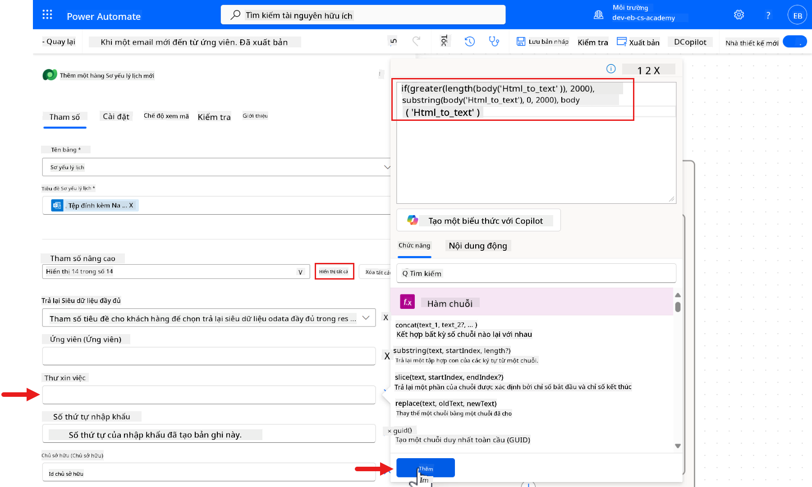

1. Biểu thức bây giờ sẽ được thêm vào trường **Thư giới thiệu**.


1. Đối với trường **Địa chỉ email nguồn**, tìm kiếm `from` và chọn tham số **From** từ trình kích hoạt vì nó chứa giá trị địa chỉ email.

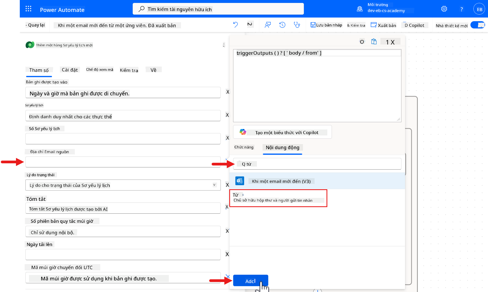

1. Đối với trường **Ngày tải lên**, chọn biểu tượng **tia sét** hoặc **fx icon** ở bên phải. Trong tab **Hàm**, nhập biểu thức sau sử dụng hàm `utcNow()`.

```text
utcNow()
```

Để tìm hiểu thêm về hàm `utcNow`, hãy mở rộng khối học bổ sung sau.

??? info "Học bổ sung: Hàm `utcNow`"

🤔 **Hàm `utcNow()` là gì?**

- Hàm utcnow() trong Power Automate trả về ngày và giờ hiện tại theo Giờ Phối hợp Quốc tế (UTC) trong định dạng ISO 8601, như: `2025-09-23T04:32:14Z`

🦋 **Ví dụ**

- Biểu thức:
       -  `concat('Báo cáo được tạo vào ', utcnow())`
- Kết quả là:
       - Báo cáo được tạo vào `2025-09-23T04:32:14Z`

💡 **Điểm chính**
- **Không cần đối số (tham số đầu vào):** luôn cung cấp dấu thời gian UTC hiện tại.
   - **Trường hợp sử dụng**
       - Thêm dấu thời gian vào nhật ký hoặc tên tệp
       - So sánh thời gian hiện tại với các ngày khác
       - Lập lịch hoặc điều kiện dựa trên thời gian

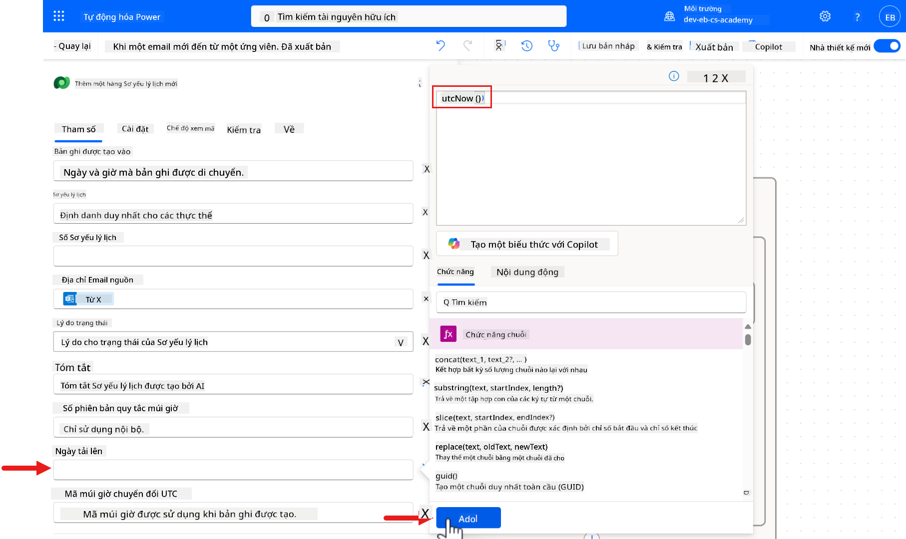

1. Chúng ta đã hoàn tất cấu hình hành động **Thêm một hàng Sơ yếu lý lịch mới**, giờ hãy thoát khỏi bảng điều khiển bằng cách thu gọn nó.

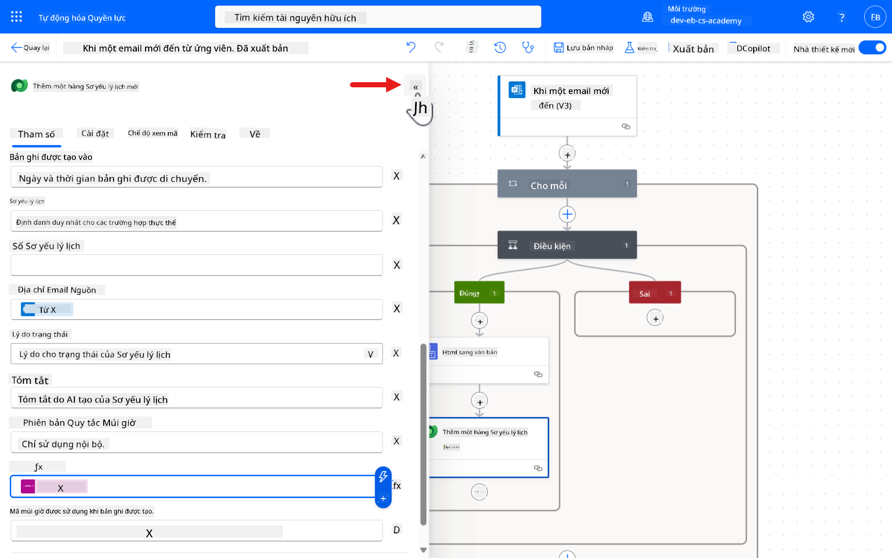

1. Chúng ta sẽ thêm một hành động mới bằng cách chọn **biểu tượng +** bên dưới hành động **Thêm một hàng Sơ yếu lý lịch mới**, điều này sẽ tải bảng điều khiển để thêm hành động. Chọn lại trình kết nối **Microsoft Dataverse**.

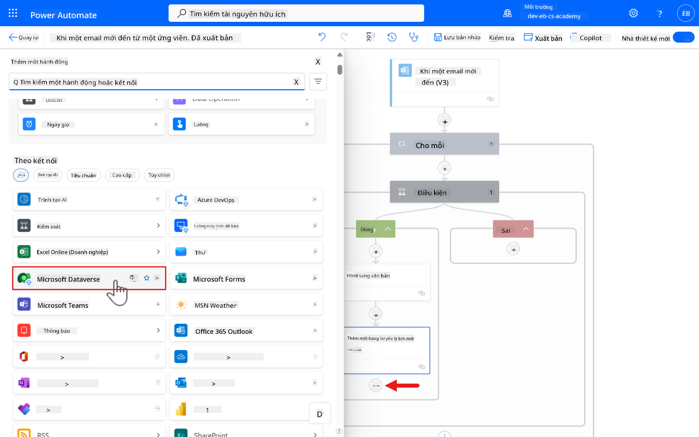

1. Chọn hành động **Tải lên một tệp hoặc hình ảnh**.

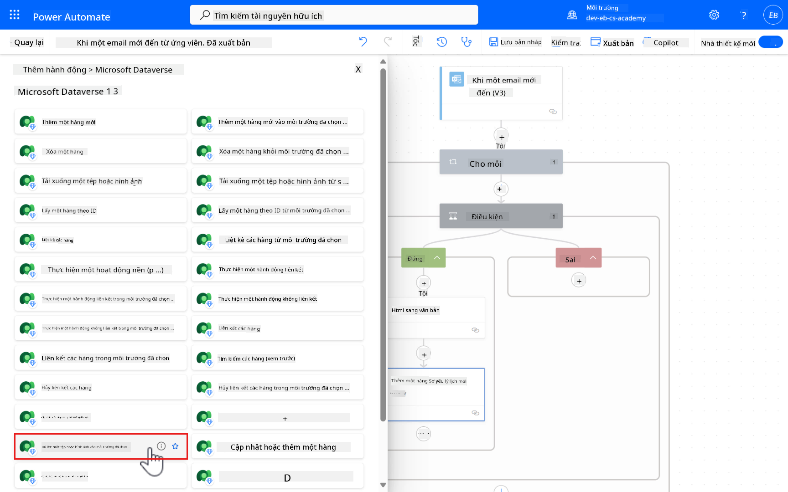

1. Đổi tên hành động bằng cách chọn **Dấu ba chấm (...)**, sao chép và dán tên sau đây,

```text
Upload Resume File
```

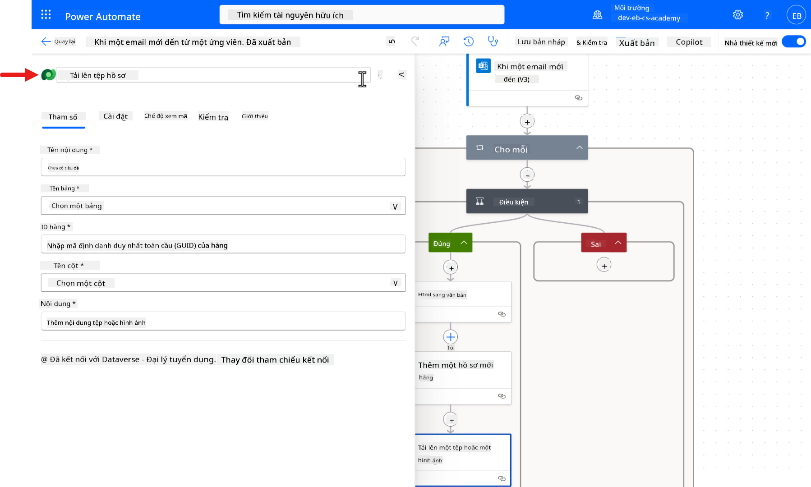

1. Tiếp theo, chọn trường **Tên nội dung** và chọn **biểu tượng tia chớp** hoặc **biểu tượng fx** ở bên phải.

Trong **tab Hàm**, nhập biểu thức sau sử dụng hàm `item ()`. Điều này lấy thuộc tính `name` của mục hiện tại (tệp đính kèm).

```text
item()?['name']
```

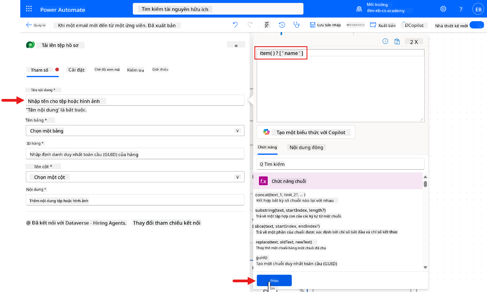

1. Đối với tham số **Tên bảng**, tìm kiếm `res` và chọn bảng **Resumes**.

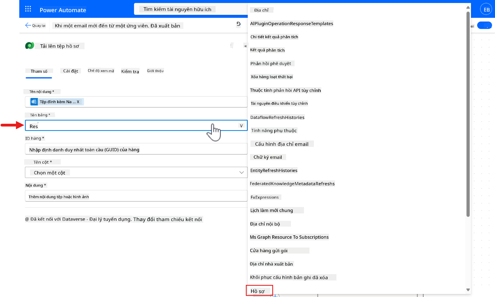

1. Tiếp theo, chọn trường **ID hàng** và chọn **biểu tượng tia chớp** hoặc **biểu tượng fx** ở bên phải.

Tìm kiếm `ID` và chọn tham số **Resume** từ hành động _Thêm một hàng mới_ Dataverse vì nó chứa giá trị ID của hàng để tải lên tệp PDF.

Chọn **Thêm**.

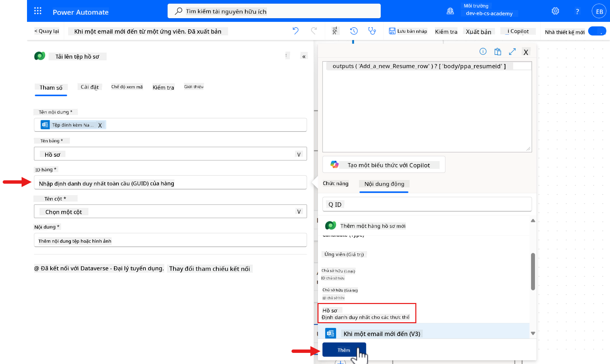

1. Chọn trường **Tên cột** và chọn tùy chọn **Resume PDF**.

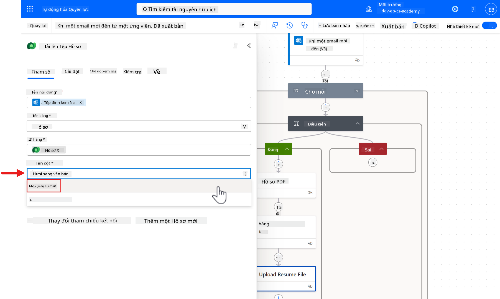

1. Chọn trường **Nội dung** và chọn **biểu tượng tia chớp** hoặc **biểu tượng fx** ở bên phải.

Trong **tab Hàm**, nhập biểu thức sau sử dụng hàm `item ()`. Điều này lấy thuộc tính `contentBytes` của mục hiện tại (tệp đính kèm). `contentBytes` đề cập đến dữ liệu nhị phân thô của tệp hoặc tệp đính kèm, được mã hóa dưới dạng chuỗi Base64.

```text
item()?['contentBytes']
```

1. Chúng ta đã hoàn tất cấu hình hành động này, giờ hãy thoát khỏi hành động bằng cách chọn hai dấu ngoặc kép («) chỉ sang trái để thu gọn bảng điều khiển.

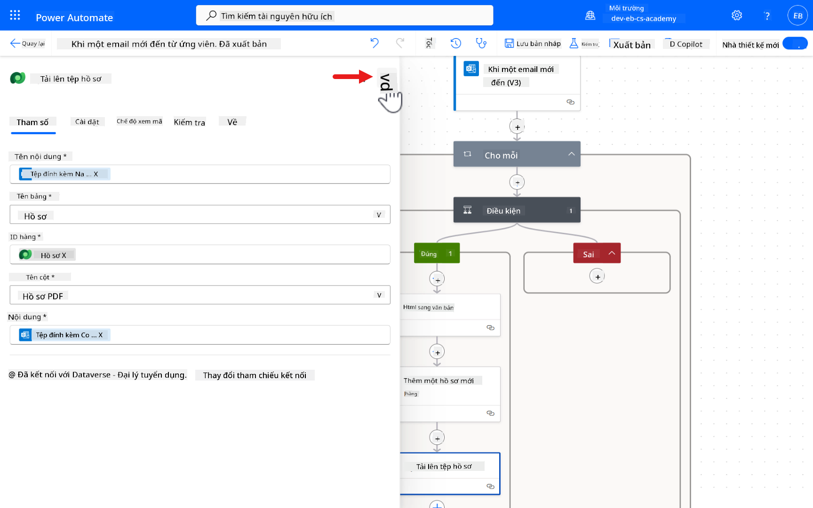

1. Tiếp theo, chọn **Gửi một lời nhắc đến copilot được chỉ định để xử lý**, sau đó kéo và thả hành động này xuống dưới hành động **Upload Resume File** trong đường dẫn _True_ của điều kiện.

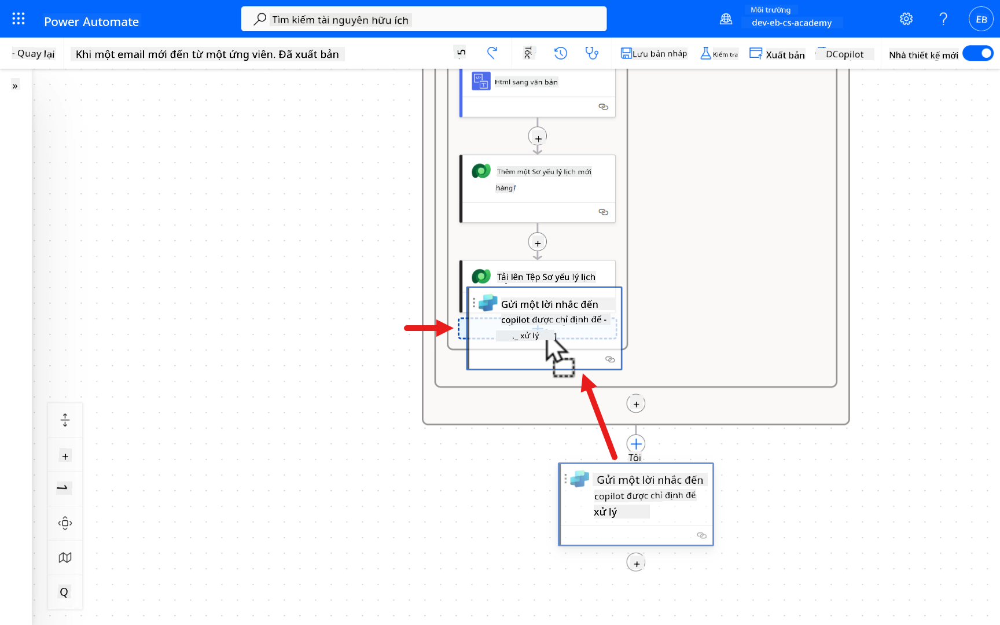

1. Chọn **Gửi một lời nhắc đến copilot được chỉ định để xử lý** để cấu hình nó.

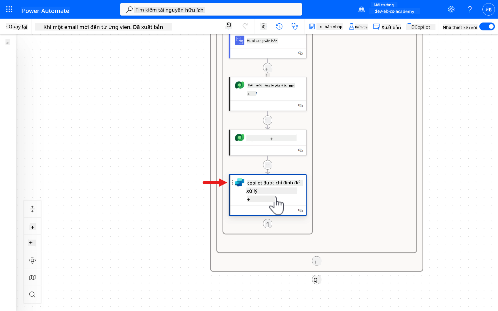

1. Trong trường **Nội dung/Tin nhắn**, chọn toàn bộ nội dung trường và xóa/xóa nó.

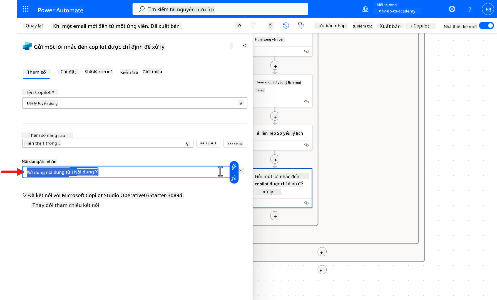

1. Sao chép và dán văn bản sau vào trường **Nội dung/Tin nhắn** và làm nổi bật `RESUME ID PLACEHOLDER`.

```text
Send [ResumeId (text)] = "RESUME ID PLACEHOLDER" and [ResumeTitle (text_1)] = "RESUME TITLE PLACEHOLDER" and [ResumeNumber (text_2)]= "RESUME NUMBER PLACEHOLDER" to the Tool "Notify Teams Applicant channel" in the child agent "Application Intake Agent"
```

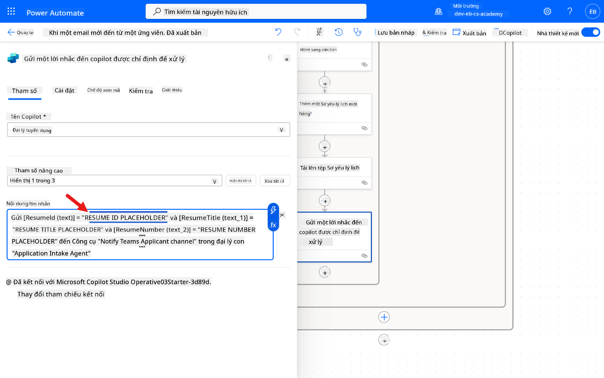

1. Chọn **biểu tượng tia chớp** hoặc **biểu tượng fx** ở bên phải.

Tìm kiếm `resume` và chọn tham số **Resume** từ hành động _Thêm một hàng mới Dataverse_ vì nó chứa giá trị `ID` của hàng Sơ yếu lý lịch được tạo.

Chọn **Thêm**.

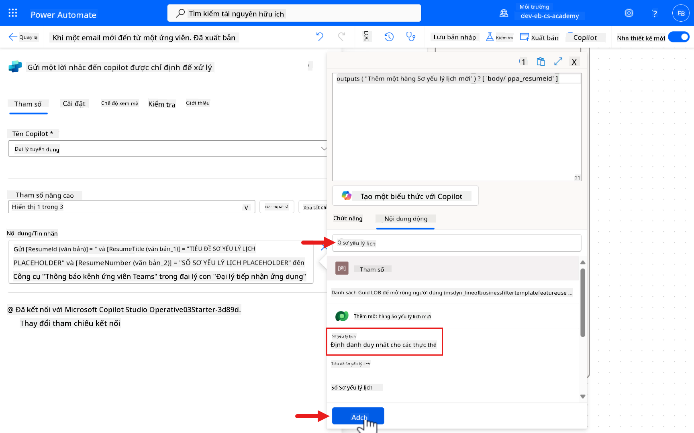

1. Làm nổi bật `RESUME TITLE PLACEHOLDER`. Chọn **biểu tượng tia chớp** hoặc **biểu tượng fx** ở bên phải.

Tìm kiếm `title` và chọn tham số **Resume Title** từ hành động _Thêm một hàng mới Dataverse_ vì nó chứa giá trị `resume title` của hàng Sơ yếu lý lịch được tạo.

Chọn **Thêm**.

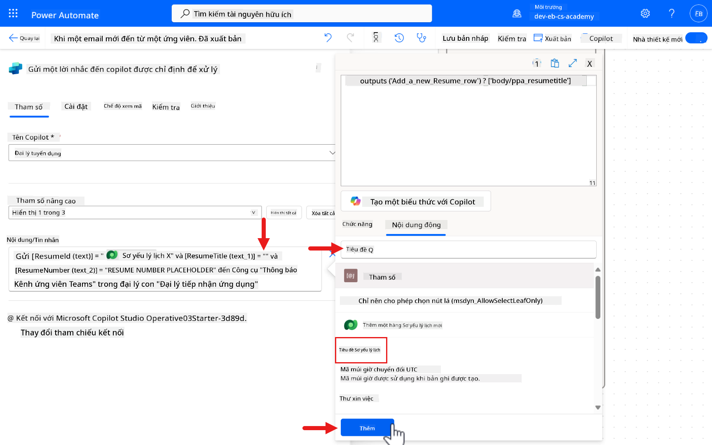

1. Làm nổi bật `RESUME NUMBER PLACEHOLDER`. Chọn **biểu tượng tia chớp** hoặc **biểu tượng fx** ở bên phải.

Tìm kiếm `resume number` và chọn tham số **Resume Number** từ hành động _Thêm một hàng mới Dataverse_ vì nó chứa giá trị `Resume Number` của hàng Sơ yếu lý lịch được tạo.

Chọn **Thêm**.

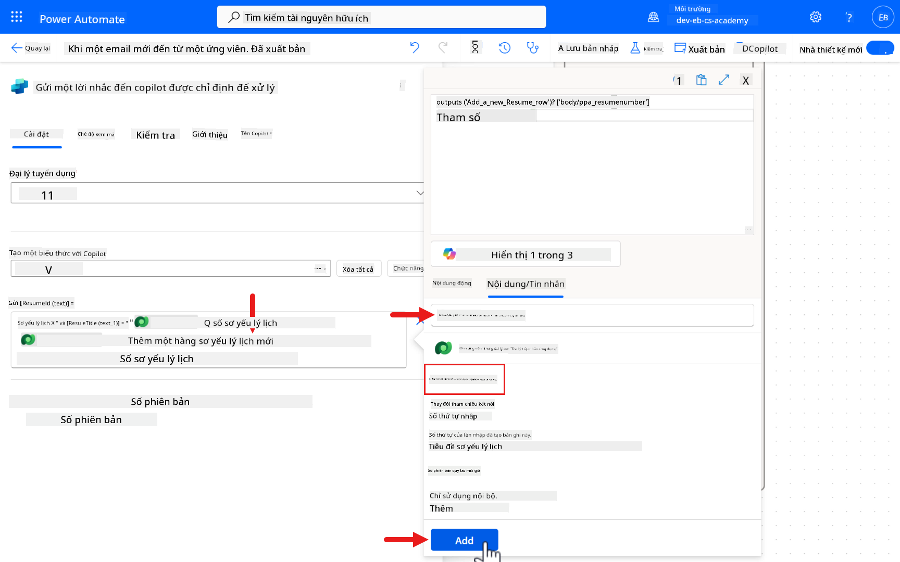

1. Chúng ta đã hoàn tất cấu hình hành động này và luồng tác nhân của chúng ta 🙌🏻 Bạn đang làm rất tốt! Bây giờ hãy lưu luồng kích hoạt sự kiện của chúng ta bằng cách chọn **Lưu bản nháp**.

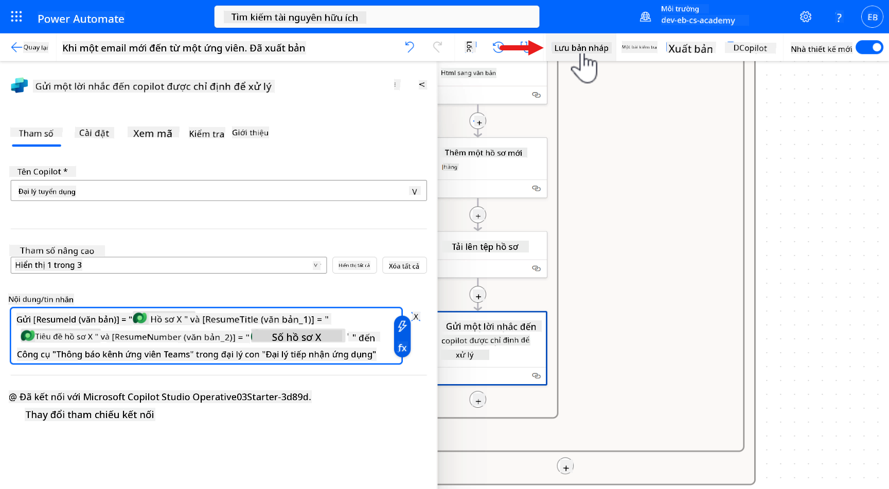

1. Bây giờ chúng ta cần chỉnh sửa chi tiết của luồng tác nhân, chọn **Quay lại**.

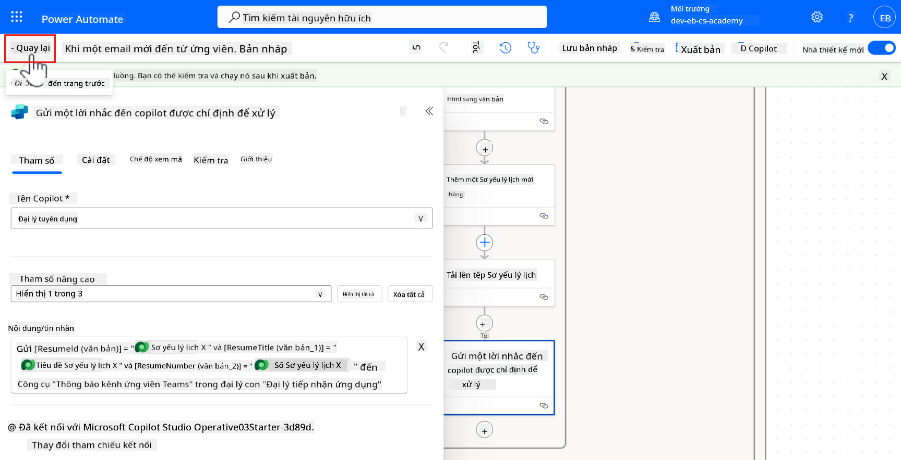

1. Chọn **Chỉnh sửa** trong phần **Chi tiết** và cập nhật **Kế hoạch** thành tùy chọn **Copilot Studio**.

Chọn **Lưu**.

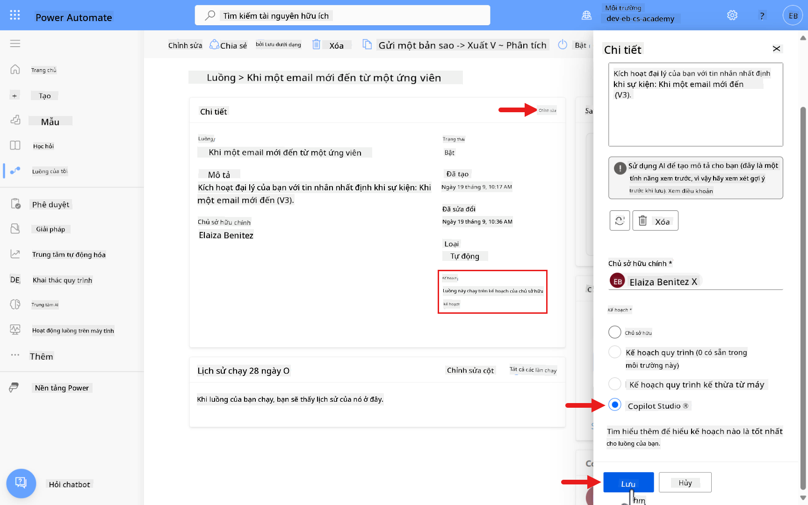

1. Một hộp thoại sẽ xuất hiện yêu cầu bạn xác nhận chuyển sang kế hoạch Copilot Studio. Chọn **Xác nhận**.

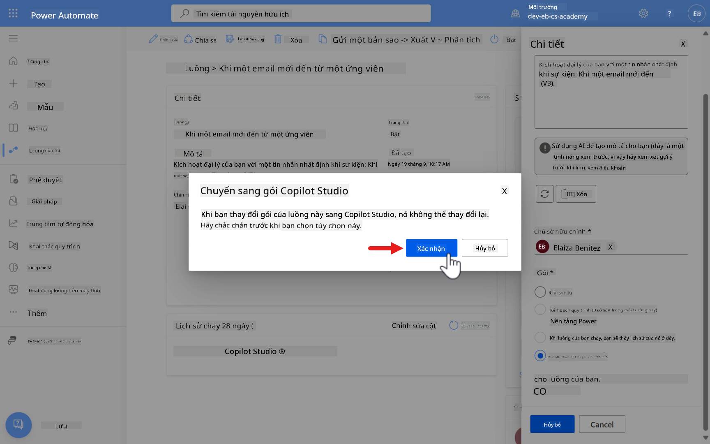

1. Kế hoạch hiện đã được cập nhật thành **Copilot Studio**. Chọn **Chỉnh sửa** vì chúng ta cần xuất bản luồng kích hoạt sự kiện cho tác nhân của chúng ta.

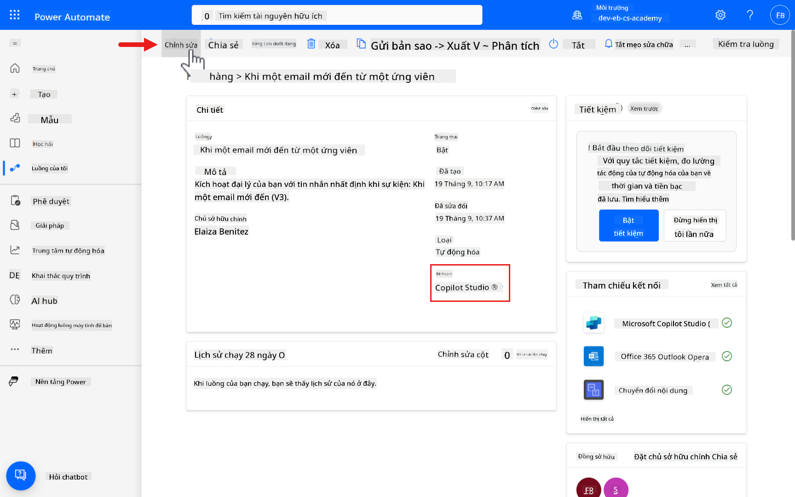

1. Chọn **Xuất bản**.

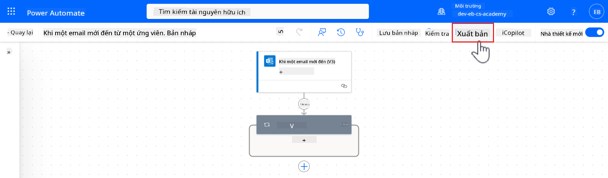

Hoan hô! Luồng kích hoạt sự kiện hiện đã được xuất bản 😃


Hãy tiếp tục tạo một luồng tác nhân mới sẽ được gọi bởi **Intake Application Agent** con.

### Bài thực hành 3.2 - Thông báo một kênh Teams bằng thẻ thích ứng

Bây giờ chúng ta sẽ tạo một luồng tác nhân mới cho **Intake Application Agent** con sử dụng các giá trị được truyền bởi kích hoạt sự kiện, để đăng một thẻ thích ứng lên kênh Teams. Thẻ thích ứng này sẽ thông báo cho nhóm tuyển dụng HR về tệp PDF đã được tải lên tự động để họ có thể xem xét.

Hãy bắt đầu!

1. Trong **Hiring Agent**, chọn tab **Agents** và chọn **Application Intake Agent**.

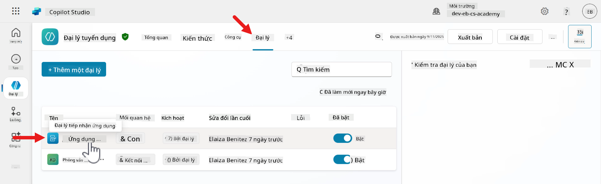

1. Cuộn xuống **Tools** và chọn **+ Thêm**.

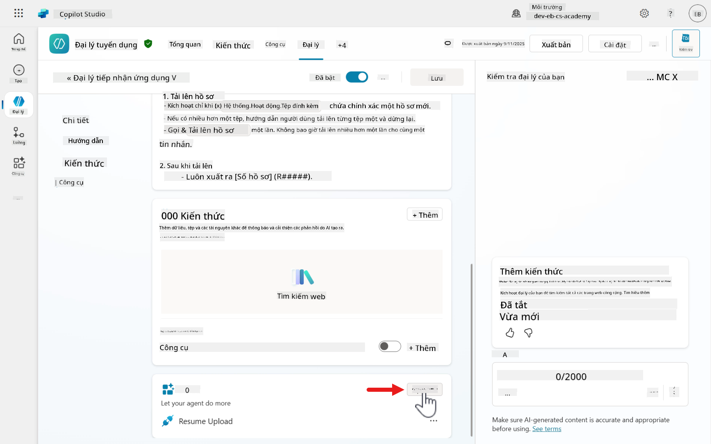

1. Hộp thoại **Thêm công cụ** sẽ xuất hiện. Chọn **+ Công cụ mới**.

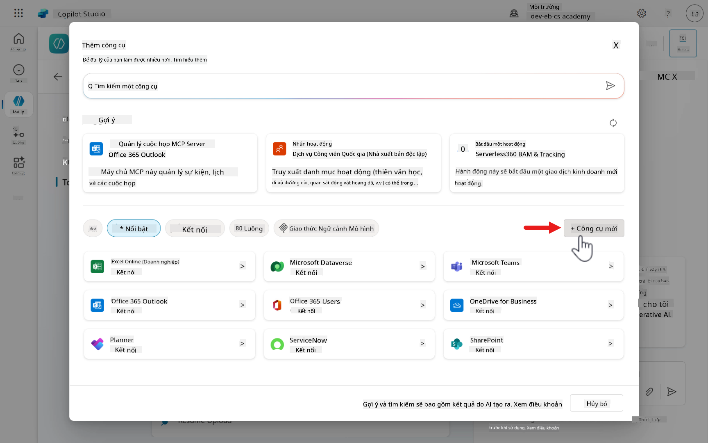

1. Chọn **Luồng tác nhân**.

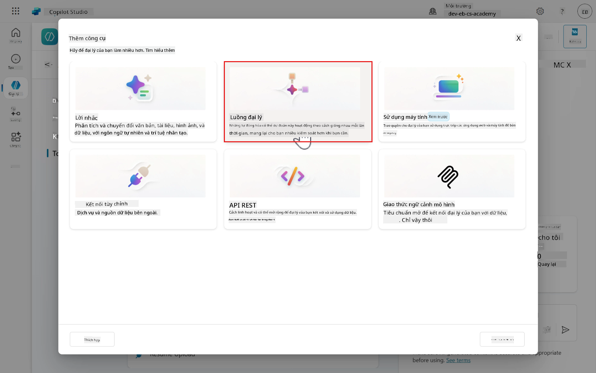

1. **Trình thiết kế luồng tác nhân** sẽ tải tiếp theo. Trong kích hoạt **Khi một tác nhân gọi luồng**, chọn **+ Thêm đầu vào**.


1. Chọn **Văn bản** làm loại đầu vào của người dùng.


1. Trong trường văn bản đầu vào, sao chép và dán tên tham số đầu vào sau đây.

```text
ResumeId
```


1. Lặp lại các bước tương tự để thêm đầu vào văn bản thứ hai. Sao chép và dán tên tham số đầu vào sau đây.

```text
ResumeTitle
```


1. Lặp lại các bước tương tự để thêm đầu vào văn bản thứ ba. Sao chép và dán tên tham số đầu vào sau đây.

```text
ResumeNumber
```


1. Nhớ lại cách chúng ta đã thêm một thẻ thích ứng trong [Recruit](../../recruit/08-add-adaptive-card/README.md#81-create-a-new-topic-with-an-adaptive-card-for-user-to-submit-their-request) trong một Chủ đề cho tác nhân của chúng ta? Lần này, chúng ta sẽ thêm một thẻ thích ứng trong luồng tác nhân. Bây giờ chúng ta sẽ thêm một hành động khác vào luồng tác nhân của mình để đăng một thẻ thích ứng lên kênh Teams.

Chọn **biểu tượng +** bên dưới kích hoạt.


1. Chọn hành động **Đăng thẻ trong trò chuyện hoặc kênh**.


1. Một tham chiếu kết nối đến Microsoft Teams cần được tạo bằng tài khoản người dùng đã đăng nhập của bạn. Chọn **Đăng nhập**.


1. Chọn tài khoản người dùng của bạn và sau đó chọn **Cho phép truy cập**.


1. Đối với các tham số đầu vào sau,

| Tham số | Cách thiết lập | Chi tiết |
|----------|------------|---------|
| **Đăng dưới dạng** | Dropdown | Chọn tùy chọn `Flow bot` |
| **Đăng trong** | Dropdown | Chọn tùy chọn `Channel` |
| **Đội nhóm** | Dropdown | Chọn một đội nhóm có sẵn trong môi trường của bạn mà bạn có quyền truy cập để hoàn thành bài thực hành này |
| **Kênh** | Dropdown | Chọn một kênh có sẵn trong môi trường của bạn mà bạn có quyền truy cập để hoàn thành bài thực hành này |


1. Tiếp theo, chúng ta sẽ cấu hình trường **Thẻ thích ứng**. Chọn trường **Thẻ thích ứng**.


1. Mở [Tệp JSON Cập nhật Bảng Sơ yếu lý lịch](../../../../../docs/operative-preview/03-automate-triggers/assets/3.2_ResumeTableUpdated.json), sao chép toàn bộ nội dung của nó và dán vào trường Thẻ thích ứng.


1. Tương tự như những gì chúng ta đã làm trong [Recruit](../../recruit/08-add-adaptive-card/README.md#81-create-a-new-topic-with-an-adaptive-card-for-user-to-submit-their-request), chúng ta sẽ thay thế các giá trị hiện có trong payload JSON bằng các giá trị thực tế hoặc nội dung động.

Đầu tiên, hãy cập nhật URL cho thuộc tính `url` trong thuộc tính `selectAction`. URL này sẽ được thay thế bằng URL của chế độ xem hệ thống Resumes trong ứng dụng **Hiring Hub** model-driven. Điều này sẽ cho phép Nhà tuyển dụng chọn hành động và được chuyển hướng đến chế độ xem hệ thống Resumes trong ứng dụng model-driven.

Làm nổi bật giá trị URL hiện tại và xóa nó.


1. Trong ứng dụng **Hiring Hub** model-driven, điều hướng đến chế độ xem hệ thống **Resumes** bằng menu bên trái và sao chép URL. Sau đó, quay lại luồng tác nhân và dán URL đã sao chép vào thuộc tính **url** trong thuộc tính `selectAction`.


1. Bạn sẽ thấy thông tin sau đây, phần được tô vàng là chi tiết môi trường của ứng dụng điều khiển mô hình **Hiring Hub**.

     | Tham số | Giá trị | Giải thích |
     |----------|------------|---------|
     | **Organization URI** | GUID | URL của tổ chức môi trường Dataverse/Dynamics 365 |
     | **appid** | GUID | Để mở một ứng dụng điều khiển mô hình cụ thể, tham số truy vấn appid hoặc appname được sử dụng. Trong trường hợp này, appid được sử dụng |
     | **viewid** | GUID | Tham số truy vấn là id của chế độ xem |

       

1. Tiếp theo, chúng ta sẽ thêm các giá trị nội dung động cho một số thuộc tính. Bắt đầu với văn bản hiển thị tham chiếu Số Hồ Sơ của hàng được tạo tự động bởi trình kích hoạt sự kiện.

      Chọn biểu tượng **panel** để tải bảng hành động.

       

1. Cuộn xuống dòng nơi bạn thấy thuộc tính `text` cho `RESUME NUMBER PLACEHOLDER`. Tô sáng giá trị placeholder và xóa nó.

       

1. Nhấp vào giữa dấu ngoặc kép và chọn biểu tượng **tia sét** hoặc biểu tượng **fx** ở bên phải.

      Trong tab **Dynamic Content**, chọn tham số **ResumeNumber** và nhấn **Add**.

       

1. Tham số **ResumeNumber** sẽ được thêm vào như nội dung động cho thuộc tính `text`.

       

1. Chúng ta sẽ lặp lại các bước tương tự cho `RESUME NAME PLACEHOLDER`. Cuộn xuống dòng nơi bạn thấy thuộc tính `text` cho `RESUME NAME PLACEHOLDER`. Tô sáng giá trị placeholder và xóa nó.

       

1. Nhấp vào giữa dấu ngoặc kép và chọn biểu tượng **tia sét** hoặc biểu tượng **fx** ở bên phải.

      Trong tab **Dynamic Content**, chọn tham số **ResumeTitle** và nhấn **Add**.

       

1. Tham số **ResumeTitle** sẽ được thêm vào như nội dung động cho thuộc tính `text`.

       

1. Chúng ta sẽ lặp lại các bước tương tự cho giá trị **Due Date** đại diện cho thời điểm nhà tuyển dụng cần xem xét hồ sơ. Cuộn xuống dòng nơi bạn thấy thuộc tính `text` cho `May 21, 2023`.

       

1. Xóa giá trị placeholder ngày này và nhấp vào giữa dấu ngoặc kép.

       

1. Chọn biểu tượng **tia sét** hoặc biểu tượng **fx** ở bên phải và trong tab **Function**, nhập biểu thức sau và nhấn **Add**.

       ```text
       addDays(utcNow(), 3, 'MMM dd, yyyy')
       ```

      Biểu thức này sử dụng hai hàm.

     | Hàm | Giải thích |
     |----------|------------|
     | **addDays** | Thêm một số ngày cụ thể vào một ngày cho trước và trả về ngày kết quả dưới dạng chuỗi |
     | **utcNow** | Trả về ngày và giờ hiện tại theo định dạng Giờ Phối hợp Quốc tế (UTC) dưới dạng chuỗi. |

      Đối với giá trị utcNow, chúng ta định dạng ngày thành tháng và ngày, sau đó là năm.

       

      Biểu thức sẽ được thêm vào thuộc tính `text`.

       

1. Cuối cùng, chúng ta sẽ cập nhật URL cho thuộc tính `url` trong thuộc tính mảng `actions` ở cuối payload JSON. URL placeholder hiện tại sẽ được thay thế bằng URL của hàng Hồ Sơ trong ứng dụng điều khiển mô hình **Hiring Hub**. Điều này sẽ cho phép nhà tuyển dụng chọn hành động `Action.OpenURL` của thẻ thích ứng và được chuyển hướng đến Hồ Sơ trong ứng dụng điều khiển mô hình.

       

1. Trong ứng dụng điều khiển mô hình **Hiring Hub**, mở một hàng trong chế độ xem hệ thống **Resumes** bằng cách sử dụng menu bên trái. Hàng hồ sơ sẽ được tải dưới dạng biểu mẫu trong ứng dụng điều khiển mô hình.

      Sao chép URL của hàng Hồ Sơ.

    ??? info "Cách điều hướng trở lại ứng dụng điều khiển mô hình **Hiring Hub** nếu bạn đã thoát/đóng nó"

        1. Truy cập [https://make.powerapps.com](https://make.powerapps.com) và đảm bảo bạn đang ở trong môi trường nhà phát triển mà bạn đang sử dụng cho các bài tập này, nếu không hãy chuyển sang nó.
        
        

        1. Chọn **Apps** trong bảng menu bên trái và đối với ứng dụng điều khiển mô hình **Hiring Hub**, chọn biểu tượng **Play** để tải nó trong trình duyệt của bạn.
        
        

       

1. Sau đó điều hướng trở lại luồng tác nhân, tô sáng giá trị URL placeholder hiện tại và xóa nó.

       

1. Sau đó dán URL đã sao chép vào thuộc tính **url** trong thuộc tính `url`.

       

1. Bạn sẽ thấy thông tin sau đây. Xóa giá trị id `GUID` ở cuối. Chúng ta sẽ thay thế nội dung động này - tham số **ResumeId**.

       

1. Chọn biểu tượng **tia sét** hoặc biểu tượng **fx** ở bên phải.

      Trong tab **Dynamic Content**, chọn tham số **ResumeId** và nhấn **Add**.

       

1. Tham số **ResumeId** sẽ được thêm vào như nội dung động. Phần được tô vàng sau đây là chi tiết môi trường của ứng dụng điều khiển mô hình **Hiring Hub**.

     | Tham số | Giá trị | Giải thích |
     |----------|------------|---------|
     | **Organization URI** | GUID | URL của tổ chức môi trường Dataverse/Dynamics 365 |
     | **appid** | GUID | Để mở một ứng dụng điều khiển mô hình cụ thể, tham số truy vấn appid hoặc appname được sử dụng. Trong trường hợp này, appid được sử dụng |
     | **id** | GUID | Tham số truy vấn là id của hàng Hồ Sơ |

       

1. Chúng ta đã hoàn thành việc cấu hình hành động **Post card in a chat or channel** 👏🏻 Thoát khỏi bảng cấu hình hành động bằng cách chọn biểu tượng **x**.

       

1. Cuối cùng, chúng ta sẽ cấu hình hành động cuối cùng, **Respond to the agent**, bằng cách gửi một văn bản trở lại cho tác nhân để kết thúc xử lý.

      Trong hành động **Respond to the agent**, chọn **+Add an output**.

       

1. Chọn **Text** làm loại đầu ra.

       

1. Nhập nội dung sau đây làm tên của đầu ra.

       

1. Nhập nội dung sau đây làm giá trị cho đầu ra.

       ```text
       Finished
       ```

       

1. Chúng ta đã hoàn thành việc cấu hình luồng tác nhân. Chọn **Save draft** để lưu luồng tác nhân. Một thông báo xác nhận sẽ xuất hiện sau khi lưu.

       

1. Trước khi xuất bản luồng tác nhân, chúng ta cần cập nhật chi tiết cho luồng tác nhân. Chọn tab **Overview** và chọn **Edit**.

      Trong trường tên luồng, nhập nội dung sau đây.

       ```text
       Notify Teams Applicant channel
       ```      

      Sau đó, chọn biểu tượng **Refresh** để cập nhật mô tả của luồng tác nhân bằng AI.

      Sau đó chọn **Save** để lưu chi tiết đã cập nhật cho luồng tác nhân.

       

1. Điều hướng trở lại tab **Designer** và chọn **Publish** để xuất bản luồng tác nhân. Một thông báo xác nhận sẽ xuất hiện sau khi lưu.

       

1. Luồng tác nhân bây giờ cần được thêm vào như một công cụ trong **Application Intake Agent**. Điều hướng trở lại **Hiring Agent** và chọn tab **Agents**, sau đó chọn **Application Intake Agent**.

       

1. Trong phần **Details** của tác nhân, chúng ta sẽ cập nhật trường **Description**. Sao chép nội dung sau đây và dán vào cuối văn bản mô tả.

       ```text
       and also notify the Teams Applicant channel
       ```

       

1. Tiếp theo, chúng ta sẽ thêm luồng tác nhân như một công cụ. Cuộn xuống và chọn **+ Add**.

       

1. Chọn luồng tác nhân đã tạo trước đó, **Notify Teams Applicant Channel**.

       

1. Tiếp theo, chọn **Add and configure**.

       

1. Trong phần **Inputs** của luồng tác nhân, ba đầu vào mà chúng ta đã cấu hình trước đó trong luồng tác nhân sẽ hiển thị. Theo mặc định, cấu hình **Fill using** được đặt thành **Dynamically fill with AI**. Chúng ta sẽ giữ nguyên cài đặt này vì lời nhắc từ trình kích hoạt sự kiện (trong hành động cuối cùng, **Sends a prompt to the specified copilot for processing** - đây là các bước 38-44 của **Lab 3.1 - Automate uploading resumes to Dataverse received by email**) sẽ chứa các giá trị tham số mà AI sẽ trích xuất.

       

1. Bây giờ công cụ đã được thêm vào **Application Intake Agent**, hướng dẫn của tác nhân cần được cập nhật. Chọn biểu tượng **mũi tên quay lại** để trở về danh sách các tác nhân.

       

1. Chọn **Application Intake Agent** trong tab **Agents** của **Hiring Agent**.

       

1. Trong trường **Instructions**, nhập một dòng mới sau hướng dẫn `2.Post-Upload`. Sao chép và dán hướng dẫn sau đây.

       ```text
       Process for Resume Upload via Email
       1. When you receive a message, **Send [ResumeId (text)] = "1680265f-5793-f011-b41b-7c1e525be9f7" and [ResumeTitle (text_1)] = "TAYLOR TESTPERSON (FICTITIOUS).pdf" and [ResumeNumber (text_2)]= "R01026" to the Tool "Notify Teams Applicant channel"** in the child agent "Application Intake Agent", call [AGENT FLOW PLACEHOLDER]
       ```

       

1. Tô sáng văn bản `[AGENT FLOW PLACEHOLDER`.

       

1. Nhập ký tự dấu gạch chéo, `/`, và chọn công cụ **Notify Teams Applicant Channel**.

       
1. Luồng tác nhân bây giờ sẽ được kích hoạt bởi **Application Intake Agent** theo hướng dẫn, sau hành động cuối cùng (**Gửi một lời nhắc đến copilot được chỉ định để xử lý**) trong trình kích hoạt sự kiện gửi lời nhắc chứa các giá trị tham số trở lại cho tác nhân.

      Chọn **Save** để lưu các hướng dẫn đã cập nhật cho **Application Intake Agent**.

       

1. Các hướng dẫn sẽ được cập nhật sau khi tác nhân được lưu.

       

1. Bây giờ chúng ta cần **Publish** **Hiring Agent**. Chọn **Publish** ở góc trên bên phải, và trong cửa sổ _Publish this agent_ xuất hiện, chọn **Publish**.

       

1. Sau khi được xuất bản, một thông báo xác nhận sẽ xuất hiện rằng tác nhân đã được xuất bản.

       

Bây giờ chúng ta có thể kiểm tra tác nhân!

### Lab 3.3 - Kiểm tra trình kích hoạt sự kiện

1. Để thực thi trình kích hoạt sự kiện, cần gửi một email kèm theo tệp PDF hồ sơ. Trong Outlook, soạn một email mới.

     | Thành phần Email | Chi tiết |
     |----------|------------|
     | **Người nhận** | Sử dụng tài khoản người dùng đã đăng nhập của bạn làm giá trị |
     | **Tệp đính kèm** | Tải lên tệp [TAYLOR TESTPERSON (FICTITIOUS)](../../../../../docs/operative-preview/test-data/resumes/TAYLOR%20TESTPERSON%20(FICTITIOUS).pdf) |
     | **Nội dung** | Sao chép và dán nội dung sau đây vào phần nội dung email |

       ```text
       Dear Hiring Manager,

       I am writing to express my interest in the Senior Power Platform Engineer position at your organization. With over nine years of experience delivering secure and scalable solutions on Microsoft cloud platforms, I am confident in my ability to contribute effectively to your team.

       In my most recent role as Lead Power Platform Engineer, I developed an automated resume-intake pipeline, reducing manual triage and improving searchability. I have delivered HR case management applications, introduced solution-aware flows, and implemented PR checks to enhance deployment lead times. My expertise includes Power Apps, Power Automate, Power Pages, Dataverse, and a range of Microsoft 365 services, as well as integration with Graph/REST APIs and Azure Functions.

       Previously, I developed Teams approvals with adaptive cards, cutting approval times to the same day, and created robust error-handling frameworks. My background also includes migrating legacy workflows to Power Automate and building self-service portals adopted by hundreds of employees.

       I hold a B.Sc. in Computer Science and am certified as a Power Platform Developer (PL-400) and Solution Architect (PL-600). I am also passionate about mentoring and have volunteered with local maker groups.

       Please find my CV attached for your consideration. I would welcome the opportunity to discuss how my skills and experience align with your needs.

       Thank you for your time and consideration.

       Kind regards,
       Taylor Testperson
       ```

       **Gửi** email sau khi soạn xong.

       

1. Trong cổng Power Automate maker cho luồng trình kích hoạt sự kiện, chọn biểu tượng **Refresh** để xem luồng đã chạy thành công cho email đã gửi.

       

1. Quay lại Copilot Studio trong **Hiring Agent**, chọn tab **Activity**.

       

1. Tab **Activity** sẽ tải và hiển thị tất cả các hoạt động của **Hiring Agent**. Sẽ có một hoạt động với giá trị tên là **Automated** và trạng thái là **Complete**. Hoạt động này đại diện cho trình kích hoạt sự kiện và luồng tác nhân đã được kích hoạt.

       

1. Chọn hoạt động, và chọn trình kích hoạt sự kiện trong bản đồ hoạt động. Ở bảng bên phải, chú ý cách các tham số đầu vào trong lời nhắc chứa các giá trị tham số `Resume Id`, `Resume Title` và `Resume Number` từ hàng **Dataverse** đã được tạo. Đây là từ các giá trị nội dung động được cấu hình trước đó trong các bước 18 - 27 của **Lab 3.1 - Tự động tải lên hồ sơ vào Dataverse nhận qua email**.

       

1. Quay lại ứng dụng mô hình **Hiring Hub** và trong chế độ xem hệ thống **Resumes**, chọn **Refresh** để làm mới chế độ xem. Hàng mới được tạo cho hồ sơ đã được gửi qua email bây giờ sẽ được liệt kê vì nó đã được tạo thông qua trình kích hoạt sự kiện.

       

1. Quay lại Copilot Studio và chọn luồng tác nhân **Notify Teams Applicant Channel** trong **Application Intake Agent** trong bản đồ hoạt động. Ở bảng bên phải, chú ý cách các đầu vào có giá trị từ hàng Dataverse. Đây là từ lời nhắc được gửi bởi hành động cuối cùng (**Gửi một lời nhắc đến copilot được chỉ định để xử lý**) trong trình kích hoạt sự kiện chứa các giá trị tham số từ hàng Dataverse mới được tạo. Đây là cách chúng ta có thể truyền các giá trị tham số từ trình kích hoạt sự kiện đến các luồng tác nhân.

       

1. Cuối cùng, hãy xem thẻ thích ứng được đăng lên kênh trong **Microsoft Teams**. Trong kênh, chúng ta sẽ thấy thẻ thích ứng hiển thị thông tin về hàng Hồ sơ mới được tạo trong Dataverse. Di chuột qua liên kết ở đầu thẻ thích ứng, chú ý cách URL là URL chế độ xem hệ thống Resumes mà chúng ta đã cấu hình trước đó trong JSON (các bước 15 - 19 của **Lab 3.2 - Thông báo một kênh Teams bằng thẻ thích ứng**) payload của thẻ thích ứng.

       

1. Chọn liên kết, và bạn sẽ được chuyển đến chế độ xem hệ thống Resumes trong ứng dụng mô hình **Hiring Hub** trên trình duyệt của bạn.

       

1. Quay lại thẻ thích ứng được đăng lên kênh trong Microsoft Teams. Lần này, di chuột qua **View Resume**, đây là hành động `Action.OpenURL` của thẻ thích ứng. Chú ý cách URL là hàng Resumes mà chúng ta đã cấu hình trước đó trong JSON (các bước 30 - 36 của **Lab 3.2 - Thông báo một kênh Teams bằng thẻ thích ứng**) payload của thẻ thích ứng.

       

1. Chọn hành động, và bạn sẽ được chuyển đến biểu mẫu hàng Resumes trong ứng dụng mô hình **Hiring Hub** trên trình duyệt của bạn.

       

## ✅ Hoàn thành nhiệm vụ

Chúc mừng! 👏🏻 Làm tốt lắm, Chiến binh.

✅ Trình kích hoạt sự kiện: bạn đã tạo một trình kích hoạt sự kiện truyền các giá trị tham số Dataverse đến một luồng tác nhân.  
✅ Xây dựng luồng tác nhân: sử dụng các giá trị tham số Dataverse để đăng một thẻ thích ứng lên kênh trong Microsoft Teams nhằm thông báo cho đội ngũ tuyển dụng nhân sự.  
✅ Cập nhật hướng dẫn tác nhân con: để kích hoạt luồng sau khi trình kích hoạt sự kiện hoàn thành.

Điều này cho phép **Hiring Agent** hoạt động tự động bất cứ khi nào nhận được hồ sơ dưới dạng tệp đính kèm email và thông báo cho đội ngũ tuyển dụng nhân sự để xem xét thủ công.

Đây là phần kết thúc của **Lab 03 - Tự động hóa email ứng tuyển của ứng viên**, chọn liên kết dưới đây để chuyển sang bài học tiếp theo.

⏭️ [Chuyển đến bài học **Authoring Agent Instructions**](../04-agent-instructions/README.md)

## 📚 Tài nguyên chiến thuật

📖 [Làm cho tác nhân của bạn tự động trong Copilot Studio](https://learn.microsoft.com/training/modules/autonomous-agents-online-workshop/?WT.mc_id=power-188561-ebenitez)

📖 [Thêm một trình kích hoạt sự kiện](https://learn.microsoft.com/microsoft-copilot-studio/authoring-trigger-event?WT.mc_id=power-188561-ebenitez)

📖 [Sử dụng luồng tác nhân với tác nhân của bạn](https://learn.microsoft.com/microsoft-copilot-studio/advanced-flow?WT.mc_id=power-188561-ebenitez)

📖 [Giới thiệu về trình kích hoạt Power Automate](https://learn.microsoft.com/power-automate/triggers-introduction?WT.mc_id=power-188561-ebenitez)

📖 [Sử dụng luồng Power Automate với tác nhân](https://learn.microsoft.com/microsoft-copilot-studio/advanced-flow-create?WT.mc_id=power-188561-ebenitez)

📖 [Ngăn ngừa mất dữ liệu cho Copilot Studio](https://learn.microsoft.com/microsoft-copilot-studio/admin-data-loss-prevention?WT.mc_id=power-188561-ebenitez)

---

**Tuyên bố miễn trừ trách nhiệm**:  
Tài liệu này đã được dịch bằng dịch vụ dịch thuật AI [Co-op Translator](https://github.com/Azure/co-op-translator). Mặc dù chúng tôi cố gắng đảm bảo độ chính xác, xin lưu ý rằng các bản dịch tự động có thể chứa lỗi hoặc không chính xác. Tài liệu gốc bằng ngôn ngữ bản địa nên được coi là nguồn thông tin chính thức. Đối với thông tin quan trọng, nên sử dụng dịch vụ dịch thuật chuyên nghiệp bởi con người. Chúng tôi không chịu trách nhiệm cho bất kỳ sự hiểu lầm hoặc diễn giải sai nào phát sinh từ việc sử dụng bản dịch này.