<!--
CO_OP_TRANSLATOR_METADATA:
{
  "original_hash": "616d142d4fb5f45d2a168fad6c1f9545",
  "translation_date": "2025-10-20T01:16:39+00:00",
  "source_file": "docs/operative-preview/07-multimodal-prompts/README.md",
  "language_code": "vi"
}
-->
# 🚨 Nhiệm vụ 07: Trích xuất nội dung hồ sơ với các lời nhắc đa phương thức

--8<-- "disclaimer.md"

## 🕵️‍♂️ TÊN MÃ: `PHÂN TÍCH HỒ SƠ TÀI LIỆU`

> **⏱️ Thời gian thực hiện nhiệm vụ:** `~45 phút`

## 🎯 Tóm tắt nhiệm vụ

Chào mừng, Đặc vụ. Các nhiệm vụ trước đã trang bị cho bạn kỹ năng điều phối tác nhân mạnh mẽ, nhưng giờ là lúc để mở khóa một khả năng thay đổi cuộc chơi: **phân tích tài liệu đa phương thức**.

Nhiệm vụ của bạn, nếu bạn chọn chấp nhận, là **Phân Tích Hồ Sơ Tài Liệu** - trích xuất dữ liệu có cấu trúc từ bất kỳ tài liệu nào với độ chính xác cao. Trong khi các tác nhân của bạn có thể xử lý văn bản một cách dễ dàng, thế giới thực yêu cầu xử lý PDF, hình ảnh và các tài liệu phức tạp hàng ngày. Hồ sơ chất đống, hóa đơn cần được xử lý, và các biểu mẫu cần được số hóa ngay lập tức.

Nhiệm vụ này sẽ biến bạn từ một người xây dựng tác nhân chỉ xử lý văn bản thành một **chuyên gia đa phương thức**. Bạn sẽ học cách cấu hình AI để đọc và hiểu tài liệu như một nhà phân tích con người - nhưng với tốc độ và sự nhất quán của AI. Đến cuối nhiệm vụ, bạn sẽ xây dựng được một hệ thống trích xuất hồ sơ hoàn chỉnh tích hợp với quy trình tuyển dụng của bạn.

Các kỹ thuật bạn học được ở đây sẽ rất cần thiết cho các hoạt động nền tảng dữ liệu nâng cao trong nhiệm vụ tiếp theo của bạn.

## 🔎 Mục tiêu

Trong nhiệm vụ này, bạn sẽ học:

1. Lời nhắc đa phương thức là gì và khi nào sử dụng các mô hình AI khác nhau
1. Cách cấu hình lời nhắc với đầu vào hình ảnh và tài liệu
1. Cách định dạng đầu ra của lời nhắc dưới dạng JSON để trích xuất dữ liệu có cấu trúc
1. Các thực hành tốt nhất cho kỹ thuật lời nhắc với phân tích tài liệu
1. Cách tích hợp lời nhắc đa phương thức với Agent Flows

## 🧠 Hiểu về lời nhắc đa phương thức

### Điều gì làm cho một lời nhắc trở thành "đa phương thức"?

Lời nhắc truyền thống chỉ hoạt động với văn bản. Nhưng lời nhắc đa phương thức có thể xử lý nhiều loại nội dung:

- **Văn bản**: Hướng dẫn và nội dung viết
- **Hình ảnh**: Ảnh, ảnh chụp màn hình, biểu đồ và sơ đồ (.PNG, .JPG, .JPEG)  
- **Tài liệu**: Hóa đơn, hồ sơ, biểu mẫu (.PDF)

Khả năng này mở ra các kịch bản mạnh mẽ như phân tích hồ sơ, xử lý hóa đơn, hoặc trích xuất dữ liệu từ biểu mẫu.

### Tại sao đa phương thức quan trọng đối với quy trình làm việc của bạn

Hàng ngày, tổ chức của bạn đối mặt với các thách thức xử lý tài liệu sau:

- **Sàng lọc hồ sơ**: Đọc hàng trăm hồ sơ một cách thủ công mất nhiều thời gian quý báu
- **Xử lý hóa đơn**: Trích xuất thông tin nhà cung cấp, số tiền và ngày tháng từ các định dạng tài liệu khác nhau
- **Phân tích biểu mẫu**: Chuyển đổi biểu mẫu giấy thành dữ liệu số

Lời nhắc đa phương thức loại bỏ những nút thắt này bằng cách kết hợp khả năng hiểu ngôn ngữ của AI với khả năng phân tích hình ảnh. Điều này mang lại cho AI của bạn khả năng xử lý tài liệu hiệu quả như văn bản.

### Các kịch bản kinh doanh phổ biến

Dưới đây là một số ví dụ về cách áp dụng lời nhắc đa phương thức:

| Kịch bản                | Nhiệm vụ                                                                                                                                    | Các trường đầu ra ví dụ                                                                                   |
|-------------------------|---------------------------------------------------------------------------------------------------------------------------------------------|---------------------------------------------------------------------------------------------------------|
| **Sàng lọc hồ sơ**      | Trích xuất tên ứng viên, email, số điện thoại, chức danh hiện tại, số năm kinh nghiệm và các kỹ năng chính.                                 | Tên ứng viên, Địa chỉ email, Số điện thoại, Chức danh công việc hiện tại, Số năm kinh nghiệm, Kỹ năng chính |
| **Xử lý hóa đơn**       | Trích xuất thông tin nhà cung cấp, ngày hóa đơn, tổng số tiền và các mục dòng từ hóa đơn này.                                               | Tên nhà cung cấp, Ngày hóa đơn, Tổng số tiền, Các mục dòng hóa đơn                                       |
| **Phân tích biểu mẫu**  | Phân tích biểu mẫu ứng dụng này và trích xuất tất cả các trường đã điền.                                                                    | Tên trường (ví dụ: Tên ứng viên), Giá trị đã nhập (ví dụ: John Doe), ...                                 |
| **Xác minh tài liệu ID**| Trích xuất tên, số ID, ngày hết hạn và địa chỉ từ tài liệu nhận dạng này. Xác minh rằng tất cả văn bản đều rõ ràng và đánh dấu bất kỳ phần nào không rõ ràng. | Họ tên, Số nhận dạng, Ngày hết hạn, Địa chỉ, Đánh dấu phần không rõ ràng                                 |

## ⚙️ Lựa chọn mô hình trong AI Builder

AI Builder cung cấp các mô hình khác nhau được tối ưu hóa cho các nhiệm vụ cụ thể. Hiểu rõ mô hình nào cần sử dụng là rất quan trọng để thành công.

!!! note "Chính xác tính đến tháng 9 năm 2025"
    Các mô hình AI Builder được cập nhật thường xuyên, vì vậy hãy kiểm tra tài liệu [cài đặt mô hình AI Builder](https://learn.microsoft.com/ai-builder/prompt-modelsettings) mới nhất để biết thông tin về các mô hình hiện có.

### So sánh mô hình

Tất cả các mô hình sau đây hỗ trợ xử lý hình ảnh và tài liệu

| Mô hình | 💰Chi phí | ⚡Tốc độ | ✅Tốt nhất cho |
|---------|-----------|---------|----------------|
| **GPT-4.1 mini** | Cơ bản (tiết kiệm chi phí nhất) | Nhanh | Xử lý tài liệu tiêu chuẩn, tóm tắt, dự án tiết kiệm ngân sách |
| **GPT-4.1** | Tiêu chuẩn | Trung bình | Tài liệu phức tạp, tạo nội dung nâng cao, nhu cầu độ chính xác cao |
| **o3** | Cao cấp | Chậm (ưu tiên lý do) | Phân tích dữ liệu, tư duy phản biện, giải quyết vấn đề tinh vi |
| **GPT-5 chat** | Tiêu chuẩn | Nâng cao | Hiểu tài liệu mới nhất, độ chính xác phản hồi cao nhất |
| **GPT-5 reasoning** | Cao cấp | Chậm (phân tích phức tạp) | Phân tích tinh vi nhất, lập kế hoạch, lý luận nâng cao |

### Giải thích cài đặt nhiệt độ

Nhiệt độ kiểm soát mức độ sáng tạo hoặc dự đoán của các phản hồi AI:

- **Nhiệt độ 0**: Kết quả dự đoán nhất, nhất quán nhất (tốt nhất cho trích xuất dữ liệu)
- **Nhiệt độ 0.5**: Cân bằng giữa sáng tạo và nhất quán  
- **Nhiệt độ 1**: Sáng tạo tối đa (tốt nhất cho tạo nội dung)

Đối với phân tích tài liệu, sử dụng **nhiệt độ 0** để đảm bảo trích xuất dữ liệu nhất quán.

## 📊 Định dạng đầu ra: Văn bản vs JSON

Chọn đúng định dạng đầu ra là rất quan trọng cho việc xử lý sau.

### Khi nào sử dụng đầu ra văn bản

Đầu ra văn bản hoạt động tốt cho:

- Tóm tắt dễ đọc
- Phân loại đơn giản
- Nội dung không cần xử lý có cấu trúc

### Khi nào sử dụng đầu ra JSON

Đầu ra JSON là cần thiết cho:

- Trích xuất dữ liệu có cấu trúc
- Tích hợp với cơ sở dữ liệu hoặc hệ thống
- Xử lý luồng Power Automate
- Ánh xạ trường nhất quán

### Các thực hành tốt nhất với JSON

1. **Đặt tên trường rõ ràng**: Sử dụng tên mô tả, nhất quán
1. **Cung cấp ví dụ**: Bao gồm đầu ra mẫu và giá trị cho từng trường
1. **Xác định loại dữ liệu**: Bao gồm ví dụ cho ngày tháng, số và văn bản
1. **Xử lý dữ liệu thiếu**: Lên kế hoạch cho các giá trị null hoặc trống
1. **Xác thực cấu trúc**: Kiểm tra với các loại tài liệu khác nhau

### Các cân nhắc về chất lượng tài liệu

- **Độ phân giải**: Đảm bảo hình ảnh rõ ràng và dễ đọc
- **Hướng**: Xoay tài liệu về hướng đúng trước khi xử lý
- **Hỗ trợ định dạng**: Kiểm tra với các loại tài liệu cụ thể của bạn (PDF, JPG, PNG)
- **Giới hạn kích thước**: Lưu ý các hạn chế về kích thước tệp trong môi trường của bạn

### Tối ưu hóa hiệu suất

- **Chọn mô hình phù hợp**: Nâng cấp mô hình chỉ khi cần thiết
- **Tối ưu hóa lời nhắc**: Thường thì hướng dẫn ngắn gọn, rõ ràng sẽ hoạt động tốt hơn
- **Xử lý lỗi**: Lên kế hoạch cho các tài liệu không thể xử lý
- **Theo dõi chi phí**: Các mô hình khác nhau tiêu thụ lượng tín dụng AI Builder khác nhau

## 🧪 Phòng thí nghiệm 7: Xây dựng hệ thống trích xuất hồ sơ

Đã đến lúc áp dụng kiến thức về đa phương thức vào thực tế. Bạn sẽ xây dựng một hệ thống trích xuất hồ sơ toàn diện, phân tích tài liệu ứng viên và chuyển đổi chúng thành dữ liệu có cấu trúc cho quy trình tuyển dụng của bạn.

### Điều kiện tiên quyết để hoàn thành nhiệm vụ này

1. Bạn cần **hoặc**:

    - **Hoàn thành Nhiệm vụ 06** và có hệ thống tuyển dụng đa tác nhân của bạn sẵn sàng, **HOẶC**
    - **Nhập giải pháp khởi đầu Nhiệm vụ 07** nếu bạn bắt đầu từ đầu hoặc cần bắt kịp. [Tải xuống Giải pháp Khởi đầu Nhiệm vụ 07](https://aka.ms/agent-academy)

1. Các tài liệu hồ sơ mẫu từ [Hồ sơ thử nghiệm](https://download-directory.github.io/?url=https://github.com/microsoft/agent-academy/tree/main/operative/sample-data/resumes&filename=operative_sampledata)

!!! note "Nhập giải pháp và dữ liệu mẫu"
    Nếu bạn sử dụng giải pháp khởi đầu, hãy tham khảo [Nhiệm vụ 01](../01-get-started/README.md) để biết hướng dẫn chi tiết về cách nhập các giải pháp và dữ liệu mẫu vào môi trường của bạn.

### 7.1 Tạo lời nhắc đa phương thức

Mục tiêu đầu tiên của bạn: tạo một lời nhắc có khả năng phân tích tài liệu hồ sơ và trích xuất dữ liệu có cấu trúc.

1. Đăng nhập vào [Copilot Studio](https://copilotstudio.microsoft.com) và chọn **Tools** từ thanh điều hướng bên trái.

1. Chọn **+ New tool**, sau đó chọn **Prompt**.  
    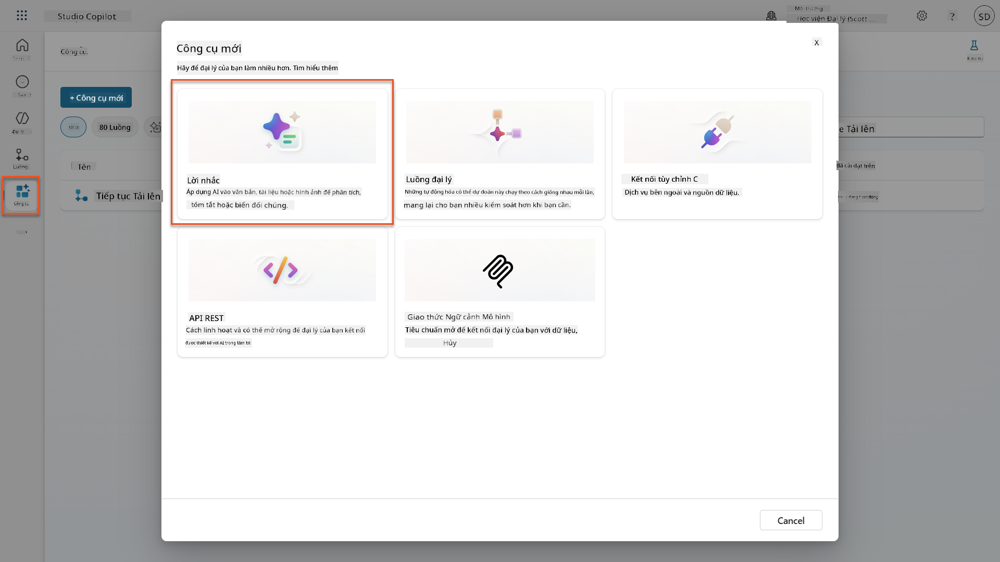

1. **Đổi tên** lời nhắc từ tên mặc định (Ví dụ: *Custom prompt 09/04/2025, 04:59:11 PM*) thành `Summarize Resume`.

1. Trong trường Instructions, thêm lời nhắc này:

    ```text
    You are tasked with extracting key candidate information from a resume and cover letter to facilitate matching with open job roles and creating a summary for application review.
    
    Instructions:
    1. Extract Candidate Details:
        - Identify and extract the candidate’s full name.
        - Extract contact information, specifically the email address.
    2. Create Candidate Summary:
        - Summarize the candidate’s profile as multiline text (max 2000 characters) with the following sections:
            - Candidate name
            - Role(s) applied for if present
            - Contact and location
            - One-paragraph summary
            - Experience snapshot (last 2–3 roles with outcomes)
            - Key projects (1–3 with metrics)
            - Education and certifications
            - Top skills (Top 10)
            - Availability and work authorization
    
    Guidelines:
    - Extract information only from the provided resume and cover letter documents.
    - Ensure accuracy in identifying all details such as contact details and skills.
    - The summary should be concise but informative, suitable for quick application review.
    
    Resume: /document
    CoverLetter: /text
    ```

    !!! tip "Sử dụng hỗ trợ từ Copilot"
        Bạn có thể sử dụng "Get started with Copilot" để tạo lời nhắc của mình bằng ngôn ngữ tự nhiên. Hãy thử yêu cầu Copilot tạo một lời nhắc để tóm tắt hồ sơ!

1. **Cấu hình** các tham số đầu vào:

    | Tham số | Loại | Tên | Dữ liệu mẫu |
    |---------|------|-----|-------------|
    | Resume | Hình ảnh hoặc tài liệu | Resume | Tải lên một hồ sơ mẫu từ thư mục dữ liệu thử nghiệm |
    | CoverLetter | Văn bản | CoverLetter | Đây là một hồ sơ! |

1. Chọn **Test** để xem đầu ra văn bản ban đầu từ lời nhắc của bạn.  
    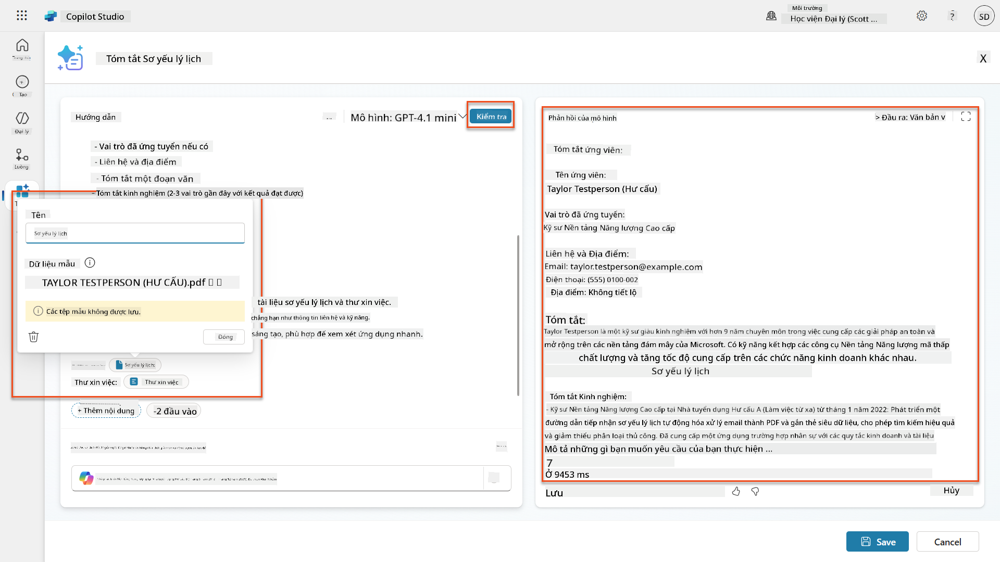

### 7.2 Cấu hình đầu ra JSON

Bây giờ bạn sẽ chuyển đổi lời nhắc để đầu ra dữ liệu có cấu trúc JSON thay vì văn bản thông thường.

1. Thêm định dạng đặc tả JSON này vào cuối hướng dẫn lời nhắc của bạn:

    ```text
    Output Format:
    Provide the output in valid JSON format with the following structure:
    
    {
        "CandidateName": "string",
        "Email": "string",
        "Summary": "string max 2000 characters",
        "Skills": [ {"item": "Skill 1"}, {"item": "Skill 2"}],
        "Experience": [ {"item": "Experience 1"}, {"item": "Experience 2"}],
    }
    ```

1. Thay đổi cài đặt **Output** từ "Text" sang **JSON**.

1. Chọn **Test** một lần nữa để xác minh đầu ra hiện được định dạng dưới dạng JSON.  
    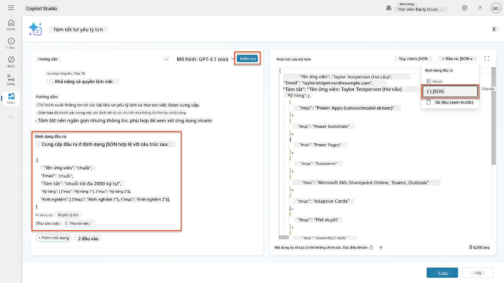

1. **Tùy chọn:** Thử nghiệm với các mô hình AI khác nhau để xem cách đầu ra thay đổi, sau đó quay lại mô hình mặc định.

1. Chọn **Save** để tạo lời nhắc.

1. Trong hộp thoại **Configure for use in Agent**, chọn **Cancel**.

    !!! info "Tại sao chúng ta không thêm điều này như một công cụ ngay bây giờ"
        Bạn sẽ sử dụng lời nhắc này trong một Agent Flow thay vì trực tiếp như một công cụ, điều này mang lại cho bạn nhiều kiểm soát hơn đối với quy trình xử lý dữ liệu.

### 7.3 Thêm lời nhắc vào Agent Flow

Bạn sẽ tạo một Agent Flow sử dụng lời nhắc của bạn để xử lý các hồ sơ được lưu trữ trong Dataverse.

!!! tip "Biểu thức Agent Flow"
    Điều rất quan trọng là bạn phải làm theo hướng dẫn để đặt tên cho các nút và nhập biểu thức chính xác vì các biểu thức tham chiếu đến các nút trước đó bằng tên của chúng! Tham khảo [nhiệm vụ Agent Flow trong Recruit](../../recruit/09-add-an-agent-flow/README.md#you-mentioned-expressions-what-are-expressions) để xem lại nhanh!

1. Điều hướng đến **Hiring Agent** của bạn trong Copilot Studio

1. Chọn tab **Agents**, và chọn **Application Intake Agent** con

1. Bên trong bảng điều khiển **Tools**, chọn **+ Add** → **+ New tool** → **Agent flow**

1. Chọn nút When an agent calls the flow, sử dụng **+ Add an input** để thêm tham số sau:

    | Loại | Tên | Mô tả |
    |------|-----|-------|
    | Text | ResumeNumber | Hãy chắc chắn sử dụng [ResumeNumber]. Điều này phải luôn bắt đầu bằng chữ R |

1. Chọn biểu tượng **+** Insert action bên dưới nút đầu tiên, tìm kiếm **Dataverse**, chọn **See more**, và sau đó tìm hành động **List rows**

1. Chọn **ellipsis (...)** trên nút List rows, và chọn **Rename** thành `Get Resume Record`, sau đó đặt các tham số sau:

    | Thuộc tính | Cách đặt | Giá trị |
    |------------|----------|---------|
    | **Table name** | Chọn | Resumes |
    | **Filter rows** | Dữ liệu động (biểu tượng tia chớp) | `ppa_resumenumber eq 'ResumeNumber'` Thay thế **ResumeNumber** bằng **When an agent calls the flow** → **ResumeNumber** |
    | **Row count** | Nhập | 1 |

    !!! tip "Tối ưu hóa các truy vấn!"
        Khi sử dụng kỹ thuật này trong sản xuất, bạn nên luôn giới hạn các cột được chọn chỉ những cột cần thiết cho Agent Flow.

    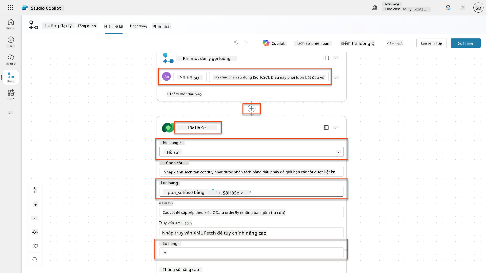

1. Chọn biểu tượng **+** Insert action bên dưới nút Get Resume Record, tìm kiếm **Dataverse**, chọn **See more**, và sau đó tìm hành động **Download a file or an image**.

    !!! tip "Chọn đúng hành động!"
        Hãy chắc chắn không chọn hành động kết thúc bằng "from selected environment"

1. Như trước đây, đổi tên hành động thành `Download Resume`, và sau đó đặt các tham số sau:

    | Thuộc tính | Cách đặt | Giá trị |
    |------------|----------|---------|
    | **Table name** | Chọn | Resumes |
    | **Row ID** | Biểu thức (biểu tượng fx) | `first(body('Get_Resume_Record')?['value'])?['ppa_resumeid']` |
    | **Column name** | Chọn | Resume PDF |

    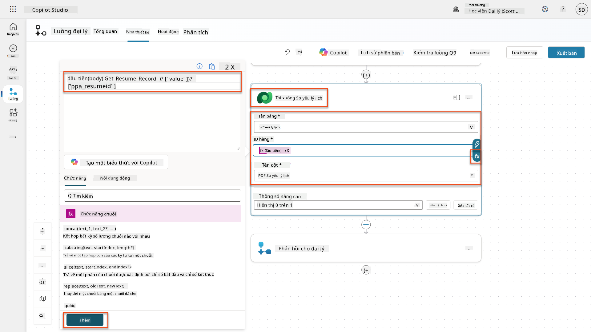

1. Bây giờ, chọn biểu tượng **+** Insert action bên dưới Download Resume, dưới **AI capabilities**, chọn **Run a prompt**,

1. Đổi tên hành động thành `Summarize Resume` và đặt các tham số sau:

    | Thuộc tính | Cách đặt | Giá trị |
    |------------|----------|---------|
| **Nhắc nhở** | Chọn | Tóm tắt Hồ sơ |
| **Thư xin việc** | Biểu thức (biểu tượng fx) | `first(body('Get_Resume_Record')?['value'])?['ppa_coverletter']` |
| **Hồ sơ** | Dữ liệu động (biểu tượng tia chớp) | Tải xuống Hồ sơ → Nội dung tệp hoặc hình ảnh |

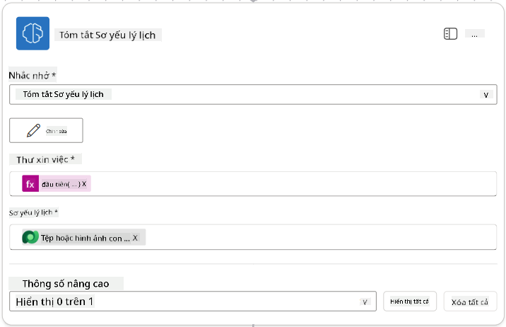

!!! tip "Tham số Nhắc nhở"
    Lưu ý rằng các tham số bạn điền vào giống với các tham số đầu vào mà bạn đã cấu hình khi tạo nhắc nhở.

### 7.4 Tạo hồ sơ ứng viên

Tiếp theo, bạn cần lấy thông tin mà Nhắc nhở cung cấp và tạo một hồ sơ ứng viên mới nếu chưa có.

1. Chọn biểu tượng hành động **+** Chèn bên dưới nút Tóm tắt Hồ sơ, tìm kiếm **Dataverse**, chọn **Xem thêm**, sau đó tìm hành động **Liệt kê hàng**

1. Đổi tên nút thành `Get Existing Candidate`, sau đó đặt các tham số sau:

    | Thuộc tính | Cách đặt | Giá trị |
    |------------|----------|---------|
    | **Tên bảng** | Chọn | Candidates |
    | **Lọc hàng** | Dữ liệu động (biểu tượng tia chớp) | `ppa_email eq 'Email'`  **Thay thế** `Email` bằng **Summarize Resume → Email** |
    | **Số lượng hàng** | Nhập | 1 |

    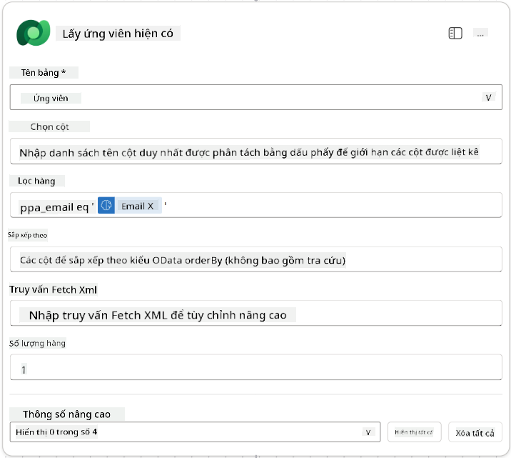

1. Chọn biểu tượng hành động **+** Chèn bên dưới nút Get Existing Candidate, tìm kiếm **Control**, chọn **Xem thêm**, sau đó tìm hành động **Condition**

1. Trong các thuộc tính điều kiện, đặt điều kiện sau:

    | Điều kiện | Toán tử | Giá trị |
    |-----------|---------|---------|
    | Biểu thức (biểu tượng fx): `length(outputs('Get_Existing_Candidate')?['body/value'])` | bằng | 0 |

    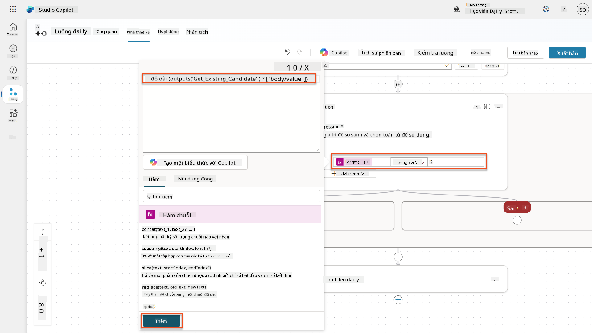

1. Chọn biểu tượng hành động **+** Chèn trong nhánh **True**, tìm kiếm **Dataverse**, chọn **Xem thêm**, sau đó tìm hành động **Thêm một hàng mới**.

1. Đổi tên nút thành `Add a New Candidate`, sau đó đặt các tham số sau:

    | Thuộc tính | Cách đặt | Giá trị |
    |------------|----------|---------|
    | **Tên bảng** | Chọn | Candidates |
    | **Tên ứng viên** | Dữ liệu động (biểu tượng tia chớp) | Summarize Resume → `CandidateName` |
    | **Email** | Dữ liệu động (biểu tượng tia chớp) | Summarize Resume → `Email` |

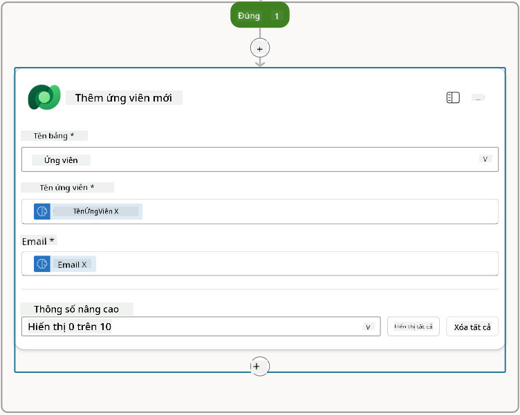

### 7.5 Cập nhật hồ sơ và cấu hình đầu ra luồng

Hoàn thành luồng bằng cách cập nhật hồ sơ và cấu hình dữ liệu trả về cho agent của bạn.

1. Chọn biểu tượng hành động **+** Chèn bên dưới điều kiện, tìm kiếm **Dataverse**, chọn **Xem thêm**, sau đó tìm hành động **Cập nhật một hàng**

1. Chọn tiêu đề để đổi tên nút thành `Update Resume`, chọn **Hiển thị tất cả**, sau đó đặt các tham số sau:

    | Thuộc tính | Cách đặt | Giá trị |
    |------------|----------|---------|
    | **Tên bảng** | Chọn | Resumes |
    | **ID hàng** | Biểu thức (biểu tượng fx) | `first(body('Get_Resume_Record')?['value'])?['ppa_resumeid']` |
    | **Tóm tắt** | Dữ liệu động (biểu tượng tia chớp) | Summarize Resume → Text |
    | **Ứng viên (Candidates)** | Biểu thức (biểu tượng fx) | `if(equals(length(outputs('Get_Existing_Candidate')?['body/value']), 1), first(outputs('Get_Existing_Candidate')?['body/value'])?['ppa_candidateid'], outputs('Add_a_New_Candidate')?['body/ppa_candidateid'])` |

    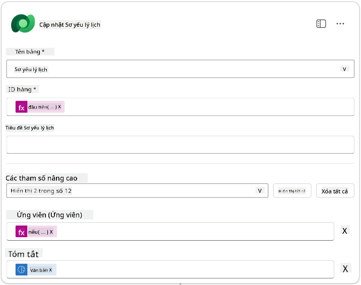

1. Chọn nút **Respond to the agent** và sau đó sử dụng **+ Thêm đầu ra** để cấu hình:

    | Loại | Tên                | Cách đặt                        | Giá trị                                                        | Mô tả                                                |
    |------|--------------------|---------------------------------|----------------------------------------------------------------|-----------------------------------------------------|
    | Text | `CandidateName`    | Dữ liệu động (biểu tượng tia chớp) | Summarize Resume → Xem thêm → CandidateName                  | [CandidateName] được cung cấp trong Hồ sơ          |
    | Text | `CandidateEmail`   | Dữ liệu động (biểu tượng tia chớp) | Summarize Resume → Xem thêm → Email                          | [CandidateEmail] được cung cấp trong Hồ sơ         |
    | Text | `CandidateNumber`  | Biểu thức (biểu tượng fx)        | `concat('ppa_candidates/', if(equals(length(outputs('Get_Existing_Candidate')?['body/value']), 1), first(outputs('Get_Existing_Candidate')?['body/value'])?['ppa_candidateid'], outputs('Add_a_New_Candidate')?['body/ppa_candidateid']) )` | [CandidateNumber] của ứng viên mới hoặc đã tồn tại |
    | Text | `ResumeSummary`    | Dữ liệu động (biểu tượng tia chớp) | Summarize Resume → Xem thêm → body/responsev2/predictionOutput/structuredOutput | Tóm tắt hồ sơ và chi tiết dưới dạng JSON           |

    

1. Chọn **Lưu nháp** ở góc trên bên phải. Luồng Agent của bạn sẽ trông như sau  
    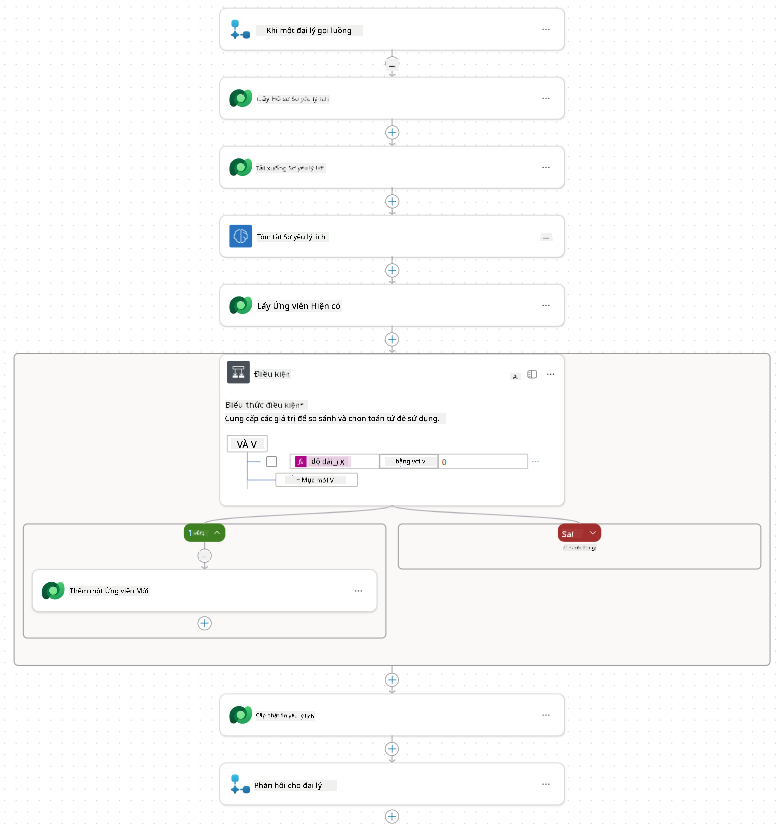

1. Chọn tab **Tổng quan**, chọn **Chỉnh sửa** trên bảng **Chi tiết**

    1. **Tên luồng**:`Summarize Resume`
    1. **Mô tả**:

        ```text
        Summarize an existing Resume stored in Dataverse using a [ResumeNumber] as input, return the [CandidateNumber], and resume summary JSON
        ```

1. Chọn **Lưu**

1. Chọn lại tab **Designer**, và chọn **Xuất bản**.

### 7.6 Kết nối luồng với agent của bạn

Bây giờ bạn sẽ thêm luồng như một công cụ và cấu hình agent của bạn để sử dụng nó.

1. Mở **Hiring Agent** của bạn trong Copilot Studio

1. Chọn tab **Agents**, và mở **Application Intake Agent**

1. Chọn bảng **Tools**, và chọn **+ Thêm một công cụ** - > **Flow** -> **Summarize Resume** **(Agent Flow)**

1. Chọn **Thêm và cấu hình**

1. Cấu hình cài đặt công cụ như sau:

    | Cài đặt | Giá trị |
    |---------|---------|
    | **Mô tả** | Tóm tắt một Hồ sơ hiện có được lưu trữ trong Dataverse bằng [ResumeNumber] làm đầu vào, trả về [CandidateNumber], và tóm tắt hồ sơ dưới dạng JSON |
    | **Khi nào công cụ này có thể được sử dụng** | Chỉ khi được tham chiếu bởi các chủ đề hoặc agent |

1. Chọn **Lưu**  
    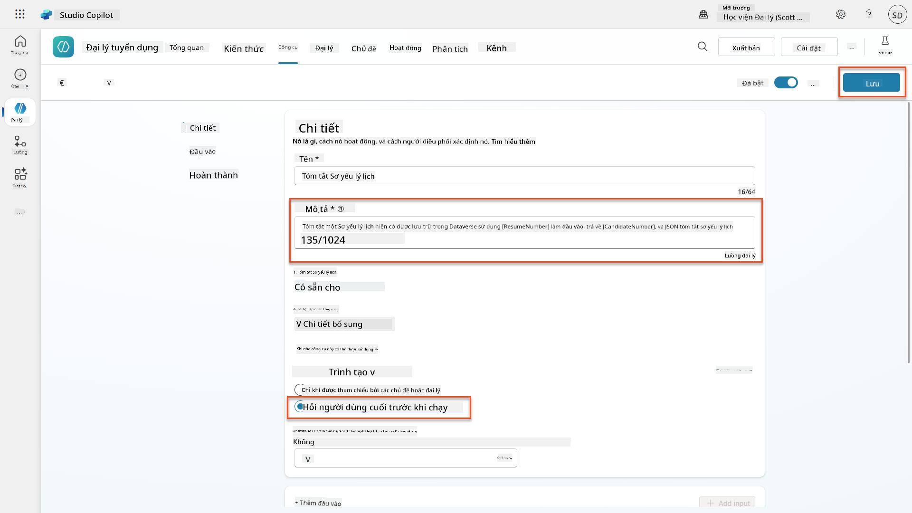

1. Nếu bạn chọn Tools trong Hiring Agent, bạn sẽ thấy cả hai công cụ của chúng ta hiển thị rằng chúng có thể được sử dụng bởi **Application Intake Agent**.  
    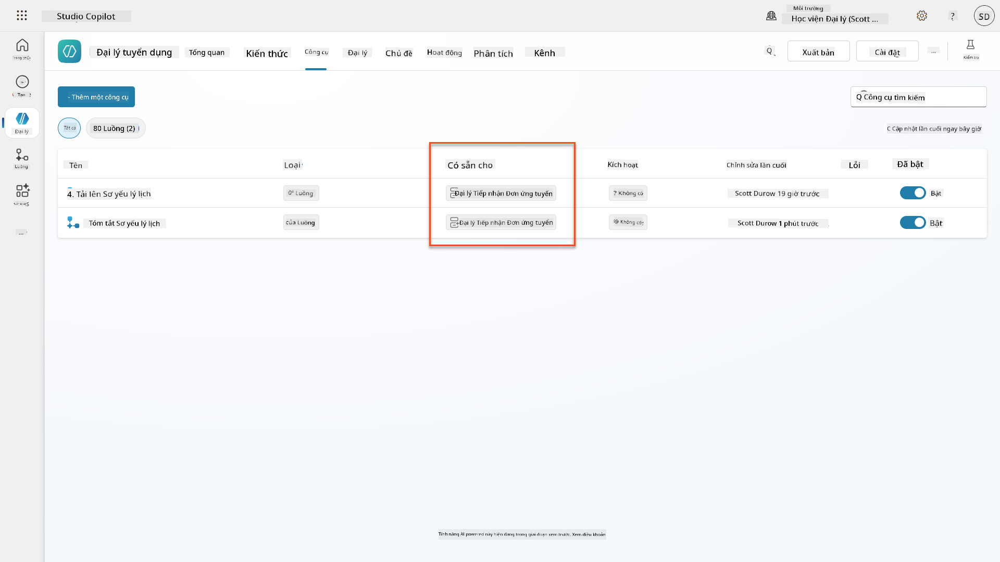

1. Điều hướng đến hướng dẫn của agent **Application Intake Child**, và sửa đổi bước **Post-Upload** thành như sau:

    ```text
    2. Post-Upload Processing  
        - After uploading, be sure to also output the [ResumeNumber] in all messages
        - Pass [ResumeNumber] to /Summarize Resume  - Be sure to use the correct value that will start with the letter R.
        - Be sure to also output the [CandidateNumber] in all messages
        - Use the [ResumeSummary] to output a summary of the processed Resume and candidate
    ```

    Thay thế `/Summarize Resume` bằng cách chèn tham chiếu đến **Summarize Resume agent flow** bằng cách gõ dấu gạch chéo (`/)` hoặc chọn `/Summarize` để chèn tham chiếu.  
    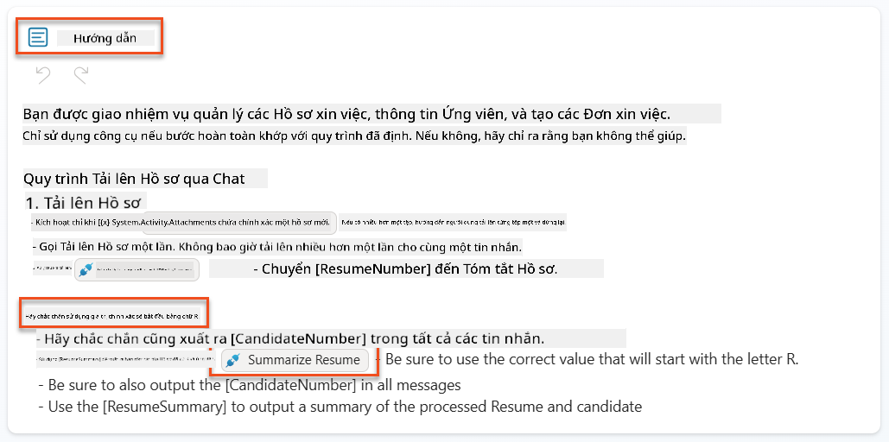

1. Chọn **Lưu**.

### 7.7 Kiểm tra agent của bạn

Kiểm tra hệ thống đa phương thức hoàn chỉnh của bạn để đảm bảo mọi thứ hoạt động chính xác.

1. **Bắt đầu kiểm tra**:

    - Chọn **Test** để mở bảng kiểm tra
    - Gõ: `Đây là Hồ sơ ứng viên`

    - Tải lên một trong các hồ sơ mẫu từ [Test Resumes](https://download-directory.github.io/?url=https://github.com/microsoft/agent-academy/tree/main/operative/sample-data/resumes&filename=operative_sampledata)

1. **Xác minh kết quả**:
    - Sau khi bạn gửi tin nhắn và hồ sơ, kiểm tra rằng bạn nhận được một Resume Number (định dạng: R#####)
    - Xác minh bạn nhận được Candidate Number và tóm tắt
    - Sử dụng bản đồ hoạt động để xem cả công cụ tải lên Hồ sơ và công cụ Tóm tắt Hồ sơ hoạt động, và các đầu ra của Nhắc nhở Tóm tắt được nhận bởi agent:  
        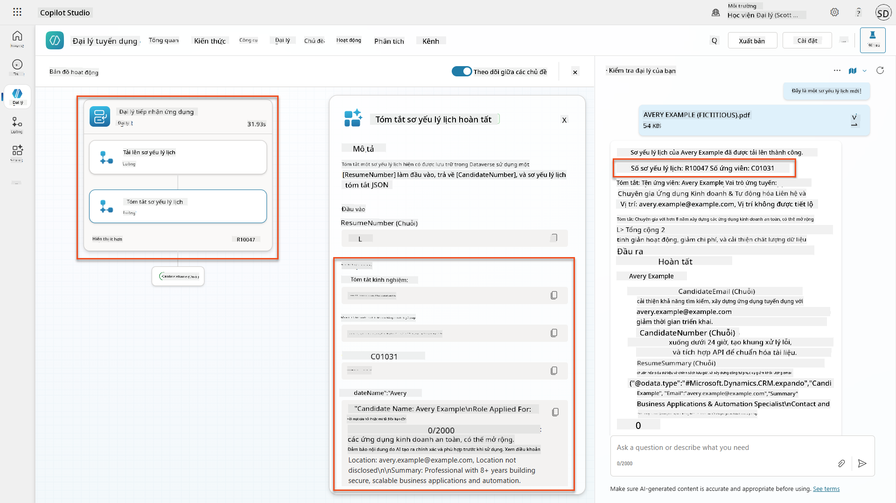

1. **Kiểm tra lưu trữ dữ liệu**:
    - Điều hướng đến [Power Apps](https://make.powerapps.com)
    - Mở **Apps** → **Hiring Hub** → **Play**
    - Đi đến **Resumes** để xác minh hồ sơ đã được tải lên và xử lý. Nó sẽ có cả thông tin tóm tắt và một hồ sơ ứng viên liên kết.
    - Kiểm tra **Candidates** để xem thông tin ứng viên đã được trích xuất  
        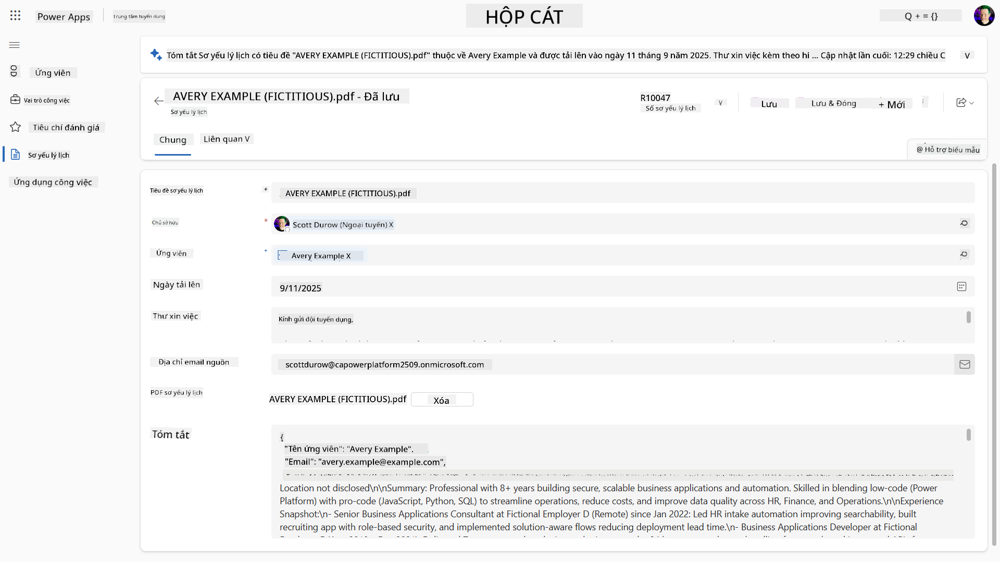
    - Khi bạn chạy lại quy trình, nó sẽ sử dụng ứng viên hiện có (được khớp với email được trích xuất từ hồ sơ) thay vì tạo một ứng viên mới.

!!! tip "Khắc phục sự cố"
    - **Hồ sơ không được xử lý**: Đảm bảo tệp là PDF và dưới giới hạn kích thước
    - **Không tạo ứng viên**: Kiểm tra rằng email đã được trích xuất chính xác từ hồ sơ
    - **Lỗi định dạng JSON**: Xác minh hướng dẫn nhắc nhở của bạn bao gồm cấu trúc JSON chính xác
    - **Lỗi luồng**: Kiểm tra rằng tất cả các kết nối Dataverse và biểu thức được cấu hình chính xác

### Sẵn sàng sản xuất

Mặc dù không phải là một phần của nhiệm vụ này, để làm cho luồng agent này sẵn sàng sản xuất, bạn cũng có thể xem xét các điều sau:

1. **Xử lý lỗi** - Nếu không tìm thấy Resume Number hoặc nhắc nhở không thể phân tích tài liệu, cần thêm xử lý lỗi để trả về lỗi rõ ràng cho agent.
1. **Cập nhật ứng viên hiện có** - Ứng viên được tìm thấy bằng email, sau đó tên có thể được cập nhật để khớp với tên trên hồ sơ.
1. **Tách việc tóm tắt Hồ sơ và tạo ứng viên** - Chức năng này có thể được tách thành các luồng agent nhỏ hơn để dễ dàng duy trì, sau đó agent được hướng dẫn sử dụng chúng lần lượt.

## 🎉 Hoàn thành nhiệm vụ

Làm tốt lắm, Operative! **Document Resume Recon** đã hoàn thành. Bạn đã thành công làm chủ các nhắc nhở đa phương thức và bây giờ có thể trích xuất dữ liệu có cấu trúc từ bất kỳ tài liệu nào một cách chính xác.

Đây là những gì bạn đã đạt được trong nhiệm vụ này:

**✅ Làm chủ nhắc nhở đa phương thức**  
Bạn đã hiểu nhắc nhở đa phương thức là gì và khi nào sử dụng các mô hình AI khác nhau để đạt được kết quả tối ưu.

**✅ Chuyên môn xử lý tài liệu**  
Bạn đã học cách cấu hình nhắc nhở với đầu vào hình ảnh và tài liệu, và định dạng đầu ra dưới dạng JSON để trích xuất dữ liệu có cấu trúc.

**✅ Hệ thống trích xuất hồ sơ**  
Bạn đã xây dựng một hệ thống trích xuất hồ sơ hoàn chỉnh, xử lý tài liệu ứng viên và tích hợp với quy trình tuyển dụng của bạn.

**✅ Áp dụng các thực hành tốt nhất**  
Bạn đã áp dụng các thực hành tốt nhất cho kỹ thuật nhắc nhở với phân tích tài liệu và tích hợp nhắc nhở đa phương thức với Agent Flows.

**✅ Nền tảng cho xử lý nâng cao**  
Khả năng phân tích tài liệu nâng cao của bạn hiện đã sẵn sàng cho các tính năng liên kết dữ liệu nâng cao mà chúng ta sẽ thêm vào các nhiệm vụ tiếp theo.

🚀 **Tiếp theo:** Trong Nhiệm vụ 08, bạn sẽ khám phá cách nâng cao nhắc nhở của mình với dữ liệu thời gian thực từ Dataverse, tạo ra các giải pháp AI động thích ứng với các yêu cầu kinh doanh thay đổi.

⏩ [Chuyển sang Nhiệm vụ 08: Nâng cao nhắc nhở với liên kết Dataverse](../08-dataverse-grounding/README.md)

## 📚 Tài nguyên chiến thuật

📖 [Tạo nhắc nhở](https://learn.microsoft.com/ai-builder/create-a-custom-prompt?WT.mc_id=power-power-182762-scottdurow)

📖 [Thêm đầu vào văn bản, hình ảnh hoặc tài liệu vào nhắc nhở của bạn](https://learn.microsoft.com/ai-builder/add-inputs-prompt?WT.mc_id=power-182762-scottdurow)

📖 [Xử lý phản hồi với đầu ra JSON](https://learn.microsoft.com/ai-builder/process-responses-json-output?WT.mc_id=power-182762-scottdurow)

📖 [Lựa chọn mô hình và cài đặt nhiệt độ](https://learn.microsoft.com/ai-builder/prompt-modelsettings?WT.mc_id=power-182762-scottdurow)

📖 [Sử dụng nhắc nhở của bạn trong Power Automate](https://learn.microsoft.com/ai-builder/use-a-custom-prompt-in-flow?WT.mc_id=power-182762-scottdurow)

📺 [AI Builder: Đầu ra JSON trong trình tạo nhắc nhở](https://www.youtube.com/watch?v=F0fGnWrRY_I)

---

**Tuyên bố miễn trừ trách nhiệm**:  
Tài liệu này đã được dịch bằng dịch vụ dịch thuật AI [Co-op Translator](https://github.com/Azure/co-op-translator). Mặc dù chúng tôi cố gắng đảm bảo độ chính xác, xin lưu ý rằng các bản dịch tự động có thể chứa lỗi hoặc không chính xác. Tài liệu gốc bằng ngôn ngữ bản địa nên được coi là nguồn thông tin chính thức. Đối với thông tin quan trọng, nên sử dụng dịch vụ dịch thuật chuyên nghiệp bởi con người. Chúng tôi không chịu trách nhiệm cho bất kỳ sự hiểu lầm hoặc diễn giải sai nào phát sinh từ việc sử dụng bản dịch này.