<!--
CO_OP_TRANSLATOR_METADATA:
{
  "original_hash": "750f3ea8a94930439ebd8a10871b1d73",
  "translation_date": "2025-10-20T00:59:15+00:00",
  "source_file": "docs/operative-preview/08-dataverse-grounding/README.md",
  "language_code": "vi"
}
-->
# 🚨 Nhiệm vụ 08: Nâng cao lời nhắc với Dataverse grounding

--8<-- "disclaimer.md"

## 🕵️‍♂️ MẬT DANH: `KIỂM SOÁT GROUNDING`

> **⏱️ Thời gian thực hiện nhiệm vụ:** `~60 phút`

## 🎯 Tóm tắt nhiệm vụ

Chào mừng trở lại, Đặc vụ. Hệ thống tuyển dụng đa tác nhân của bạn đã hoạt động, nhưng cần có một cải tiến quan trọng về **grounding dữ liệu** - các mô hình AI của bạn cần truy cập dữ liệu có cấu trúc của tổ chức trong thời gian thực để đưa ra các quyết định thông minh.

Hiện tại, lời nhắc Tóm tắt Hồ sơ của bạn hoạt động với kiến thức tĩnh. Nhưng điều gì sẽ xảy ra nếu nó có thể truy cập động vào cơ sở dữ liệu vai trò công việc của bạn để cung cấp các kết quả phù hợp chính xác và cập nhật? Điều gì sẽ xảy ra nếu nó hiểu các tiêu chí đánh giá của bạn mà không cần bạn phải mã hóa cứng chúng?

Trong nhiệm vụ này, bạn sẽ nâng cao lời nhắc tùy chỉnh của mình với **Dataverse grounding** - kết nối các lời nhắc của bạn trực tiếp với các nguồn dữ liệu trực tiếp. Điều này biến các tác nhân của bạn từ những người phản hồi tĩnh thành các hệ thống dựa trên dữ liệu động, thích ứng với nhu cầu kinh doanh thay đổi.

Nhiệm vụ của bạn: tích hợp dữ liệu vai trò công việc và tiêu chí đánh giá trong thời gian thực vào quy trình phân tích hồ sơ, tạo ra một hệ thống tự cập nhật luôn phù hợp với yêu cầu tuyển dụng của tổ chức bạn.

## 🔎 Mục tiêu

Trong nhiệm vụ này, bạn sẽ học:

1. Cách **Dataverse grounding** nâng cao lời nhắc tùy chỉnh
1. Khi nào nên sử dụng grounding dữ liệu so với hướng dẫn tĩnh
1. Thiết kế lời nhắc tích hợp dữ liệu trực tiếp một cách động
1. Nâng cao quy trình Tóm tắt Hồ sơ với việc khớp vai trò công việc

## 🧠 Hiểu về Dataverse grounding cho lời nhắc

**Dataverse grounding** cho phép các lời nhắc tùy chỉnh của bạn truy cập dữ liệu trực tiếp từ các bảng Dataverse khi xử lý yêu cầu. Thay vì các hướng dẫn tĩnh, các lời nhắc của bạn có thể tích hợp thông tin thời gian thực để đưa ra quyết định thông minh.

### Tại sao Dataverse grounding lại quan trọng

Các lời nhắc truyền thống hoạt động với các hướng dẫn cố định:

```text
Match this candidate to these job roles: Developer, Manager, Analyst
```

Với Dataverse grounding, lời nhắc của bạn truy cập dữ liệu hiện tại:

```text
Match this candidate to available job roles from the Job Roles table, 
considering current evaluation criteria and requirements
```

Cách tiếp cận này mang lại một số lợi ích chính:

- **Cập nhật động:** Vai trò công việc và tiêu chí thay đổi mà không cần sửa đổi lời nhắc
- **Tính nhất quán:** Tất cả các tác nhân sử dụng cùng một nguồn dữ liệu hiện tại
- **Khả năng mở rộng:** Các vai trò và tiêu chí mới tự động có sẵn
- **Độ chính xác:** Dữ liệu thời gian thực đảm bảo các quyết định phản ánh nhu cầu hiện tại

### Cách Dataverse grounding hoạt động

Khi bạn kích hoạt Dataverse grounding cho một lời nhắc tùy chỉnh:

1. **Lựa chọn dữ liệu:** Chọn các bảng và cột Dataverse cụ thể để bao gồm. Bạn cũng có thể chọn các bảng liên quan mà hệ thống sẽ lọc dựa trên các bản ghi cha được truy xuất.
1. **Tiêm ngữ cảnh:** Lời nhắc tự động bao gồm dữ liệu được truy xuất trong ngữ cảnh lời nhắc
1. **Lọc thông minh:** Hệ thống chỉ bao gồm dữ liệu liên quan đến yêu cầu hiện tại nếu bạn cung cấp bất kỳ bộ lọc nào.
1. **Đầu ra có cấu trúc:** Lời nhắc của bạn có thể tham chiếu dữ liệu được truy xuất và suy luận về các bản ghi được truy xuất để tạo đầu ra.

### Từ tĩnh đến động: Lợi thế của grounding

Hãy xem xét quy trình Tóm tắt Hồ sơ hiện tại của bạn từ Nhiệm vụ 07 và xem cách Dataverse grounding biến đổi nó từ trí tuệ tĩnh sang trí tuệ động.

**Cách tiếp cận tĩnh hiện tại:**
Lời nhắc hiện tại của bạn bao gồm các tiêu chí đánh giá được mã hóa cứng và logic khớp được xác định trước. Cách tiếp cận này hoạt động nhưng yêu cầu cập nhật thủ công mỗi khi bạn thêm vai trò công việc mới, thay đổi tiêu chí đánh giá hoặc thay đổi ưu tiên của công ty.

**Biến đổi với Dataverse grounding:**
Bằng cách thêm Dataverse grounding, quy trình Tóm tắt Hồ sơ của bạn sẽ:

- **Truy cập các vai trò công việc hiện tại** từ bảng Vai trò Công việc của bạn
- **Sử dụng tiêu chí đánh giá trực tiếp** thay vì các mô tả tĩnh  
- **Cung cấp các kết quả khớp chính xác** dựa trên yêu cầu thời gian thực

## 🎯 Tại sao nên sử dụng lời nhắc chuyên dụng thay vì hội thoại với tác nhân

Trong Nhiệm vụ 02, bạn đã trải nghiệm cách mà Tác nhân Phỏng vấn có thể khớp ứng viên với các vai trò công việc, nhưng yêu cầu các lời nhắc phức tạp từ người dùng như:

```text
Upload this resume, then show me open job roles,
each with a description of the evaluation criteria, 
then use this to match the resume to at least one suitable
job role even if not a perfect match.
```

Mặc dù điều này hoạt động, nhưng các lời nhắc chuyên dụng với Dataverse grounding mang lại những lợi ích đáng kể cho các nhiệm vụ cụ thể:

### Lợi ích chính của lời nhắc chuyên dụng

| Khía cạnh | Hội thoại với Tác nhân | Lời nhắc chuyên dụng |
|--------|-------------------|------------------|
| **Tính nhất quán** | Kết quả thay đổi dựa trên kỹ năng tạo lời nhắc của người dùng | Xử lý tiêu chuẩn mỗi lần |
| **Chuyên môn hóa** | Lý luận chung có thể bỏ sót các sắc thái kinh doanh | Được xây dựng mục đích với logic kinh doanh tối ưu |
| **Tự động hóa** | Yêu cầu sự tương tác và diễn giải của con người | Kích hoạt tự động với đầu ra JSON có cấu trúc |

## 🧪 Phòng thí nghiệm 8: Thêm Dataverse grounding vào lời nhắc

Đã đến lúc nâng cấp khả năng phân tích hồ sơ của bạn! Bạn sẽ nâng cao quy trình Tóm tắt Hồ sơ hiện tại với việc khớp vai trò công việc động.

### Điều kiện tiên quyết để hoàn thành nhiệm vụ này

1. Bạn cần **hoặc**:

    - **Hoàn thành Nhiệm vụ 07** và có hệ thống phân tích hồ sơ của bạn sẵn sàng, **HOẶC**
    - **Nhập giải pháp khởi đầu Nhiệm vụ 08** nếu bạn bắt đầu từ đầu hoặc cần bắt kịp. [Tải xuống Giải pháp Khởi đầu Nhiệm vụ 08](https://aka.ms/agent-academy)

1. Các tài liệu hồ sơ mẫu từ [test Resumes](https://download-directory.github.io/?url=https://github.com/microsoft/agent-academy/tree/main/operative/sample-data/resumes&filename=operative_sampledata)

!!! note "Nhập Giải pháp và Dữ liệu Mẫu"
    Nếu bạn đang sử dụng giải pháp khởi đầu, hãy tham khảo [Nhiệm vụ 01](../01-get-started/README.md) để biết hướng dẫn chi tiết về cách nhập các giải pháp và dữ liệu mẫu vào môi trường của bạn.

### 8.1 Thêm Dataverse grounding vào lời nhắc của bạn

Bạn sẽ xây dựng dựa trên lời nhắc Tóm tắt Hồ sơ mà bạn đã tạo trong Nhiệm vụ 07. Hiện tại, nó chỉ đơn giản tóm tắt hồ sơ, nhưng bây giờ bạn sẽ grounding nó với các vai trò công việc như hiện tại trong Dataverse, giữ cho nó luôn cập nhật.

Trước tiên, hãy xem xét các bảng Dataverse mà bạn sẽ grounding với:

1. **Điều hướng** đến [Power Apps](https://make.powerapps.com) và chọn môi trường của bạn bằng **Bộ chuyển đổi môi trường** ở góc trên bên phải của thanh điều hướng.

1. Chọn **Tables** và tìm bảng **Job Roles**

1. Xem xét các cột chính mà bạn sẽ sử dụng để grounding:

    | Cột | Mục đích |
    |--------|---------|
    | **Job Role Number** | Định danh duy nhất để khớp vai trò |
    | **Job Title** | Tên hiển thị cho vai trò |
    | **Description** | Yêu cầu chi tiết về vai trò |

1. Tương tự, xem xét các bảng khác như bảng **Evaluation Criteria**.

### 8.2 Thêm dữ liệu Dataverse grounding vào lời nhắc của bạn

1. **Điều hướng** đến Copilot Studio, và chọn môi trường của bạn bằng **Bộ chuyển đổi môi trường** ở góc trên bên phải của thanh điều hướng.

1. Chọn **Tools** từ thanh điều hướng bên trái.

1. Chọn **Prompt** và tìm lời nhắc **Summarize Resume** của bạn từ Nhiệm vụ 07.  
    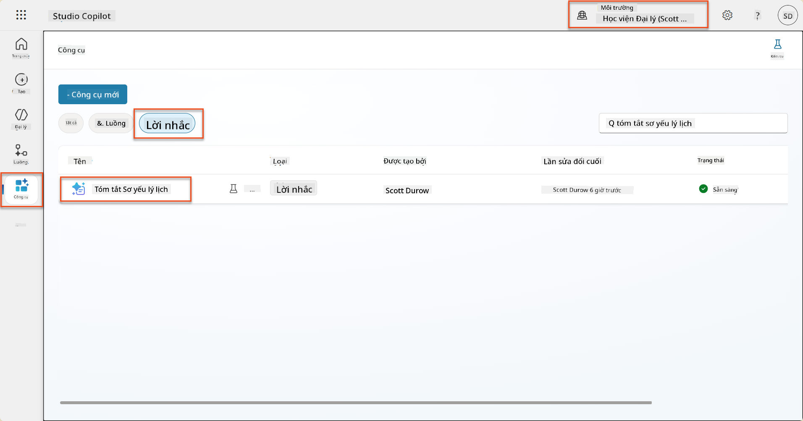

1. Chọn **Edit** để chỉnh sửa lời nhắc, và thay thế bằng phiên bản nâng cao dưới đây:

    !!! important
        Đảm bảo các tham số Resume và Cover Letter vẫn được giữ nguyên.

    ```text
    You are tasked with extracting key candidate information from a resume and cover letter to facilitate matching with open job roles and creating a summary for application review.
    
    ### Instructions:
    1. **Extract Candidate Details:**
       - Identify and extract the candidate's full name.
       - Extract contact information, specifically the email address.
    
    2. **Analyze Resume and Cover Letter:**
       - Review the resume content to identify relevant skills, experience, and qualifications.
       - Review the cover letter to understand the candidate's motivation and suitability for the roles.
    
    3. **Match Against Open Job Roles:**
       - Compare the extracted candidate information with the requirements and descriptions of the provided open job roles.
       - Use the job descriptions to assess potential fit.
       - Identify all roles that align with the candidate's cover letter and profile. You don't need to assess perfect suitability.
       - Provide reasoning for each match based on the specific job requirements.
    
    4. **Create Candidate Summary:**
       - Summarize the candidate's profile as multiline text with the following sections:
          - Candidate name
          - Role(s) applied for if present
          - Contact and location
          - One-paragraph summary
          - Top skills (8–10)
          - Experience snapshot (last 2–3 roles with outcomes)
          - Key projects (1–3 with metrics)
          - Education and certifications
          - Availability and work authorization
    
    ### Output Format
    
    Provide the output in valid JSON format with the following structure:
    
    {
      "CandidateName": "string",
      "Email": "string",
      "MatchedRoles": [
        {
          "JobRoleNumber": "ppa_jobrolenumber from grounded data",
          "RoleName": "ppa_jobtitle from grounded data",
          "Reasoning": "Detailed explanation based on job requirements"
        }
      ],
      "Summary": "string"
    }
    
    ### Guidelines
    
    - Extract information only from the provided resume and cover letter documents.
    - Ensure accuracy in identifying contact details.
    - Use the available job role data for matching decisions.
    - The summary should be concise but informative, suitable for quick application review.
    - If no suitable matches are found, indicate an empty list for MatchedRoles and explain briefly in the summary.
    
    ### Input Data
    Open Job Roles (ppa_jobrolenumber, ppa_jobtitle): /Job Role 
    Resume: {Resume}
    Cover Letter: {CoverLetter}
    ```

1. Trong trình chỉnh sửa lời nhắc, thay thế `/Job Role` bằng cách chọn **+ Add content**, chọn **Dataverse** → **Job Role** và chọn các cột sau, sau đó chọn **Add**:

    1. **Job Role Number**

    1. **Job Title**

    1. **Description**

    !!! tip
        Bạn có thể nhập tên bảng để tìm kiếm.

1. Trong hộp thoại **Job Role**, chọn thuộc tính **Filter**, chọn **Status**, và sau đó nhập **Active** làm giá trị **Filter**.  
    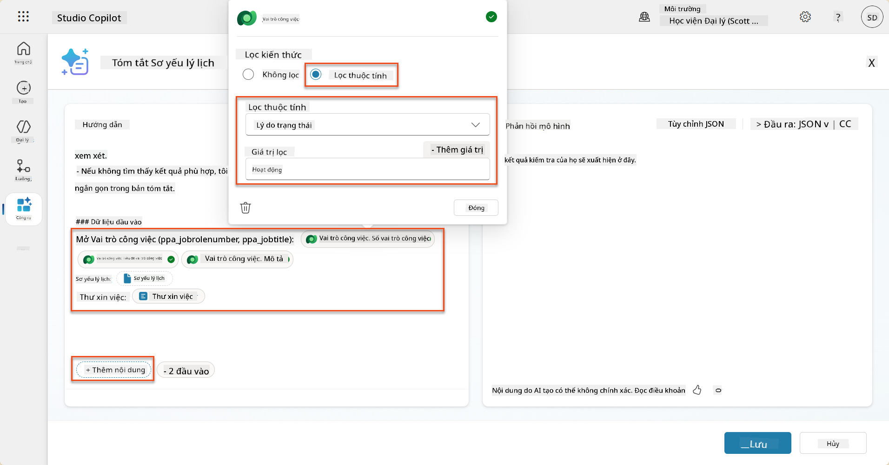

    !!! tip
        Bạn có thể sử dụng **Add value** ở đây để thêm một tham số đầu vào - ví dụ nếu bạn có một lời nhắc để tóm tắt một bản ghi hiện có, bạn có thể cung cấp Số Hồ sơ làm tham số để lọc.

1. Tiếp theo, bạn sẽ thêm bảng Dataverse liên quan **Evaluation Criteria**, bằng cách chọn **+ Add content**, tìm **Job Roles**, và thay vì chọn các cột trên Job Role, mở rộng **Job Role (Evaluation Criteria)** và chọn các cột sau, sau đó chọn **Add**:

    1. **Criteria Name**

    1. **Description**  
        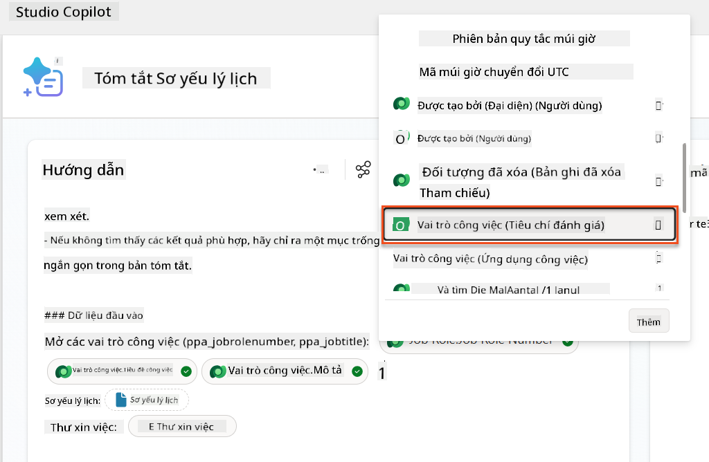

        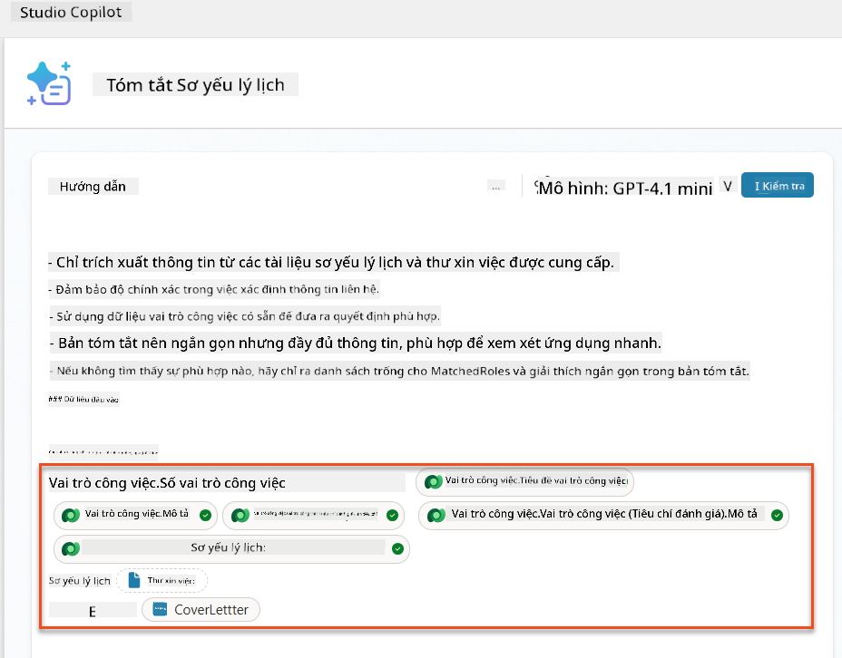

    !!! tip
        Điều quan trọng là chọn tiêu chí đánh giá liên quan bằng cách đầu tiên chọn Vai trò Công việc, và sau đó điều hướng trong menu đến Job Role (Evaluation Criteria). Điều này sẽ đảm bảo rằng chỉ các bản ghi liên quan đến Vai trò Công việc sẽ được tải.

1. Chọn **Settings**, và điều chỉnh **Record retrieval** đến 1000 - điều này sẽ cho phép tối đa các Vai trò Công việc và Tiêu chí đánh giá được bao gồm trong lời nhắc của bạn.  
    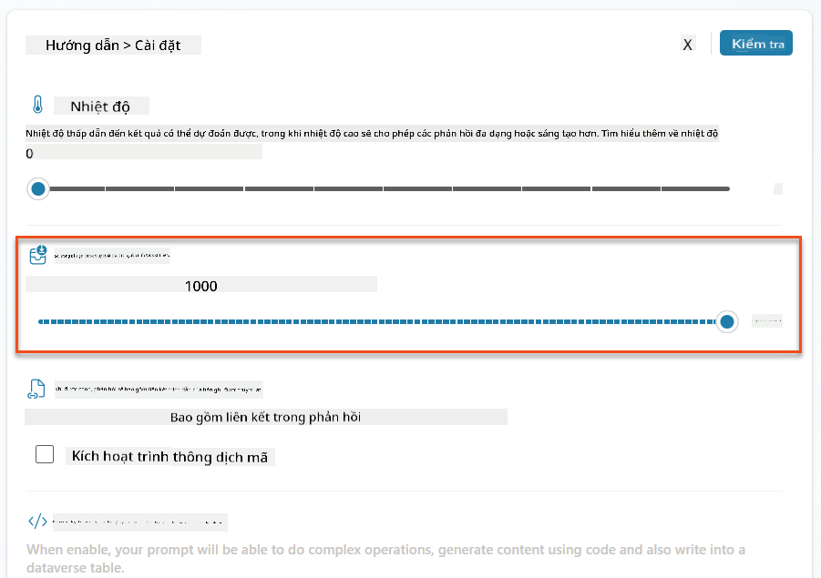

### 8.3 Kiểm tra lời nhắc nâng cao

1. Chọn tham số **Resume**, và tải lên một hồ sơ mẫu mà bạn đã sử dụng trong Nhiệm vụ 07.
1. Chọn **Test**.
1. Sau khi kiểm tra hoàn tất, hãy chú ý rằng đầu ra JSON bây giờ bao gồm **Matched Roles**.
1. Chọn tab **Knowledge used**, để xem dữ liệu Dataverse đã được kết hợp với lời nhắc của bạn trước khi thực thi.
1. **Lưu** lời nhắc đã cập nhật của bạn. Hệ thống bây giờ sẽ tự động bao gồm dữ liệu Dataverse này với lời nhắc của bạn khi quy trình Summarize Resume Agent Flow hiện tại gọi nó.  
    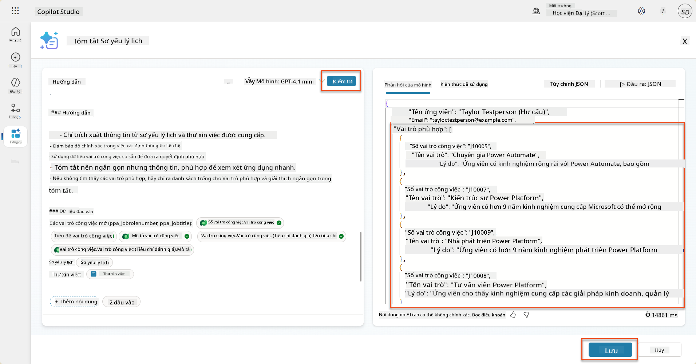

### 8.4 Thêm Agent Flow Ứng tuyển Công việc

Để cho phép Tác nhân Tiếp nhận Ứng tuyển của chúng ta tạo các Vai trò Công việc dựa trên các vai trò được đề xuất mà ứng viên quan tâm, chúng ta cần tạo một Agent Flow. Tác nhân sẽ gọi công cụ này cho mỗi vai trò công việc được đề xuất mà ứng viên quan tâm.

!!! tip "Biểu thức Agent Flow"
    Điều rất quan trọng là bạn phải làm theo hướng dẫn để đặt tên các nút và nhập các biểu thức chính xác vì các biểu thức tham chiếu đến các nút trước đó bằng tên của chúng! Tham khảo [Nhiệm vụ Agent Flow trong Recruit](../../recruit/09-add-an-agent-flow/README.md#you-mentioned-expressions-what-are-expressions) để có một bài ôn tập nhanh!

1. Bên trong **Hiring Agent**, chọn tab **Agents**, và mở tác nhân con **Application Intake Agent**.

1. Bên trong bảng **Tools**, chọn **+ Add** → **+ New tool** → **Agent Flow**

1. Chọn nút **When an agent calls the flow**, sử dụng **+ Add an input** để thêm tham số sau:

    | Loại | Tên            | Mô tả                                                  |
    | ---- | --------------- | ------------------------------------------------------------ |
    | Text | `ResumeNumber`  | Đảm bảo chỉ sử dụng [ResumeNumber] - nó PHẢI bắt đầu bằng chữ R |
    | Text | `JobRoleNumber` | Đảm bảo chỉ sử dụng [JobRoleNumber] - nó PHẢI bắt đầu bằng chữ J |

    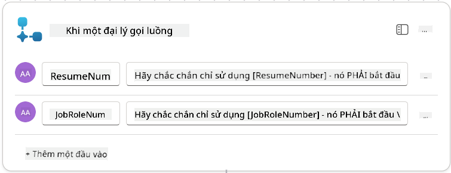

1. Chọn biểu tượng **+** Insert action bên dưới nút đầu tiên, tìm kiếm **Dataverse**, chọn **See more**, và sau đó tìm hành động **List rows**.

1. **Đổi tên** nút thành `Get Resume`, và sau đó đặt các tham số sau:

    | Thuộc tính        | Cách đặt                      | Giá trị                                                        |
    | --------------- | ------------------------------- | ------------------------------------------------------------ |
    | **Table name**  | Chọn                          | Resumes                                                      |
    | **Filter rows** | Dữ liệu động (biểu tượng tia chớp) | `ppa_resumenumber eq 'ResumeNumber'` Chọn và thay thế **ResumeNumber** bằng **When an agent calls the flow** → **ResumeNumber** |
    | **Row count**   | Nhập                           | 1                                                            |

    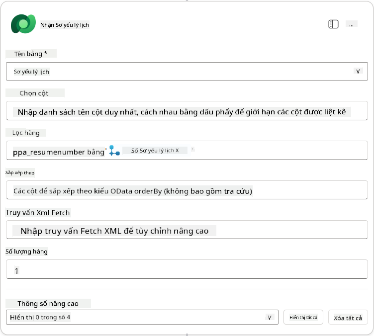

1. Bây giờ, chọn biểu tượng **+** Insert action bên dưới **Get Resume**, tìm kiếm **Dataverse**, chọn **See more**, và sau đó tìm hành động **List rows**.

1. **Đổi tên** nút thành `Get Job Role`, và sau đó đặt các tham số sau:

    | Thuộc tính        | Cách đặt                      | Giá trị                                                        |
    | --------------- | ------------------------------- | ------------------------------------------------------------ |
    | **Table name**  | Chọn                          | Job Roles                                                    |
    | **Filter rows** | Dữ liệu động (biểu tượng tia chớp) | `ppa_jobrolenumber eq 'JobRoleNumber'` Chọn và thay thế **JobRoleNumber** bằng **When an agent calls the flow** → **JobRoleNumber** |
    | **Row count**   | Nhập                           | 1                                                            |

    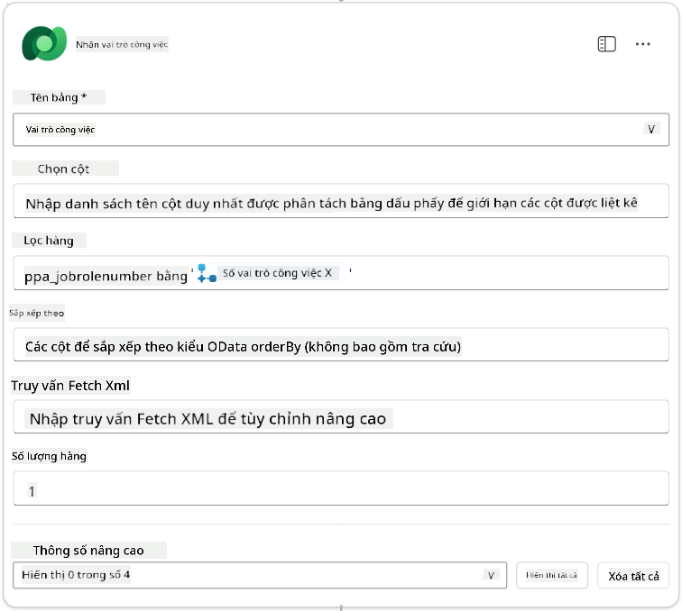

1. Bây giờ, chọn biểu tượng **+** Insert action bên dưới Get Job Role, tìm kiếm **Dataverse**, chọn **See more**, và sau đó tìm hành động **Add a new row**.

1. **Đổi tên** nút thành `Add Application`, và sau đó đặt các tham số sau:

    | Thuộc tính                           | Cách đặt           | Giá trị                                                        |
    | ---------------------------------- | -------------------- | ------------------------------------------------------------ |
    | **Table name**                     | Chọn               | Job Applications                                             |
    | **Candidate (Candidates)**             | Biểu thức (biểu tượng fx) | `concat('ppa_candidates/',first(outputs('Get_Resume')?['body/value'])?['_ppa_candidate_value'])` |
| **Vai trò công việc (Job Roles)**         | Biểu thức (biểu tượng fx) | `concat('ppa_jobroles/',first(outputs('Get_Job_Role')?['body/value'])?['ppa_jobroleid'])` |
| **Hồ sơ (Resumes)**                       | Biểu thức (biểu tượng fx) | `concat('ppa_resumes/', first(outputs('Get_Resume')?['body/value'])?['ppa_resumeid'])` |
| **Ngày ứng tuyển** (sử dụng **Hiển thị tất cả**) | Biểu thức (biểu tượng fx) | `utcNow()`                                                   |

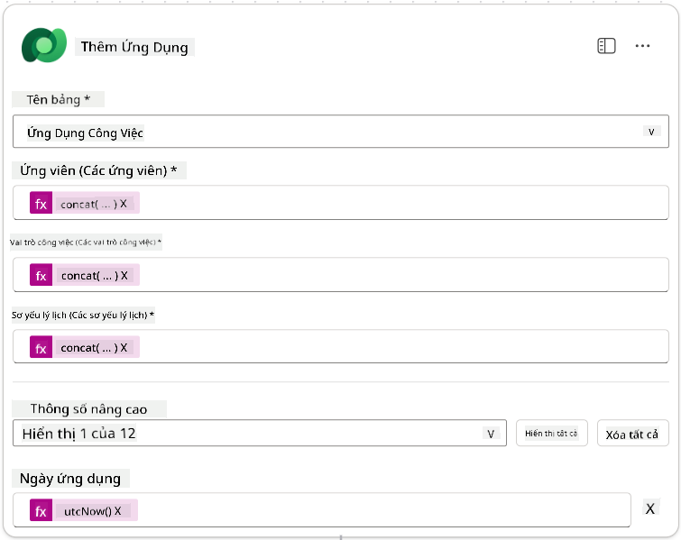

1. Chọn **Phản hồi cho nút đại lý**, sau đó chọn **+ Thêm đầu ra**

     | Thuộc tính      | Cách thiết lập                  | Chi tiết                                         |
     | --------------- | ------------------------------- | ----------------------------------------------- |
     | **Loại**        | Chọn                           | `Text`                                          |
     | **Tên**         | Nhập                           | `ApplicationNumber`                             |
     | **Giá trị**     | Dữ liệu động (biểu tượng tia sét) | *Thêm ứng tuyển → Xem thêm → Số ứng tuyển*      |
     | **Mô tả**       | Nhập                           | `Số [ApplicationNumber] của ứng tuyển công việc đã tạo` |

     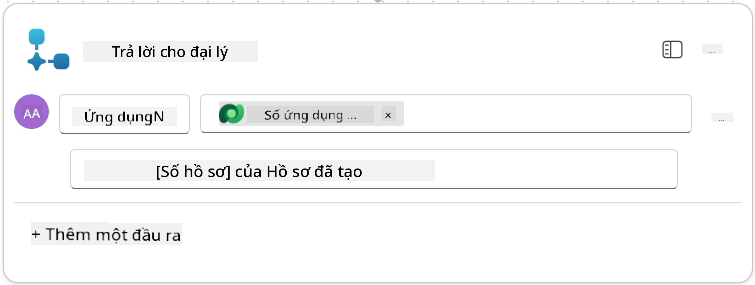

1. Chọn **Lưu nháp** ở góc trên bên phải

1. Chọn tab **Tổng quan**, chọn **Chỉnh sửa** trên bảng **Chi tiết**

      - **Tên luồng**:`Create Job Application`
      - **Mô tả**:`Tạo một ứng tuyển công việc mới khi có [ResumeNumber] và [JobRoleNumber]`
      - **Lưu**

1. Chọn lại tab **Designer**, và chọn **Xuất bản**.

### 8.5 Thêm Tạo ứng tuyển công việc vào đại lý

Bây giờ bạn sẽ kết nối luồng đã xuất bản với Đại lý Tiếp nhận Ứng tuyển của bạn.

1. Quay lại **Hiring Agent** và chọn tab **Agents**. Mở **Application Intake Agent**, sau đó tìm bảng **Tools**.

1. Chọn **+ Thêm**

1. Chọn bộ lọc **Flow**, và tìm kiếm `Create Job Application`. Chọn luồng **Create Job Application**, sau đó **Thêm và cấu hình**.

1. Thiết lập các tham số sau:

    | Tham số                                           | Giá trị                                                        |
    | --------------------------------------------------- | ------------------------------------------------------------ |
    | **Mô tả**                                         | `Tạo một ứng tuyển công việc mới khi có [ResumeNumber] và [JobRoleNumber]` |
    | **Chi tiết bổ sung → Khi nào công cụ này có thể được sử dụng** | `Chỉ khi được tham chiếu bởi các chủ đề hoặc đại lý`          |

1. Chọn **Lưu**  
    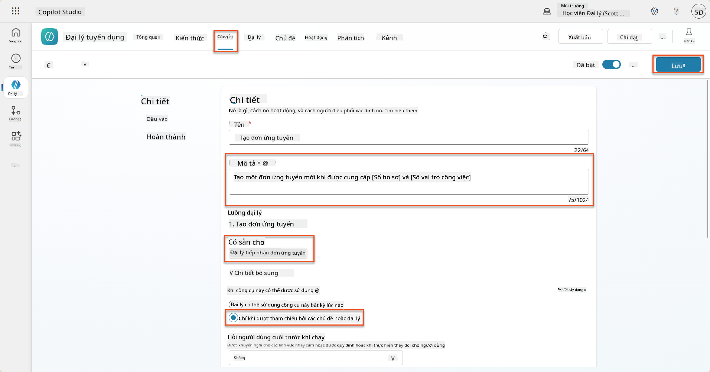

### 8.6 Định nghĩa hướng dẫn cho đại lý

Để tạo ứng tuyển công việc, bạn cần hướng dẫn đại lý khi nào sử dụng công cụ mới. Trong trường hợp này, bạn sẽ yêu cầu người dùng xác nhận các vai trò công việc được đề xuất để ứng tuyển, và hướng dẫn đại lý chạy công cụ cho từng vai trò.

1. Quay lại **Application Intake Agent**, sau đó tìm bảng **Hướng dẫn**.

1. Trong trường **Hướng dẫn**, **thêm** hướng dẫn rõ ràng sau đây cho đại lý con của bạn vào **cuối hướng dẫn hiện có**:

    ```text
    3. Post Resume Upload
       - Respond with a formatted bullet list of [SuggestedJobRoles] the candidate could apply for.  
       - Use the format: [JobRoleNumber] - [RoleDescription]
       - Ask the user to confirm which Job Roles to create applications for the candidate.
       - When the user has confirmed a set of [JobRoleNumber]s, move to the next step.
    
    4. Post Upload - Application Creation
        - After the user confirms which [SuggestedJobRoles] for a specific [ResumeNumber]:
        E.g. "Apply [ResumeNumber] for the Job Roles [JobRoleNumber], [JobRoleNumber], [JobRoleNumber]
        E.g. "apply to all suggested job roles" - this implies use all the [JobRoleNumbers] 
         - Loop over each [JobRoleNumber] and send with [ResumeNumber] to /Create Job Application   
         - Summarize the Job Applications Created
    
    Strict Rules (that must never be broken)
    You must always follow these rules and never break them:
    1. The only valid identifiers are:
      - ResumeNumber (ppa_resumenumber)→ format R#####
      - CandidateNumber (ppa_candidatenumber)→ format C#####
      - ApplicationNumber (ppa_applicationnumber)→ format A#####
      - JobRoleNumber (ppa_jobrolenumber)→ format J#####
    2. Never guess or invent these values.
    3. Always extract identifiers from the current context (conversation, data, or system output). 
    ```

1. Khi hướng dẫn bao gồm dấu gạch chéo (/), chọn văn bản sau dấu / và chọn công cụ **Create Job Application**.

1. Chọn **Lưu**  
    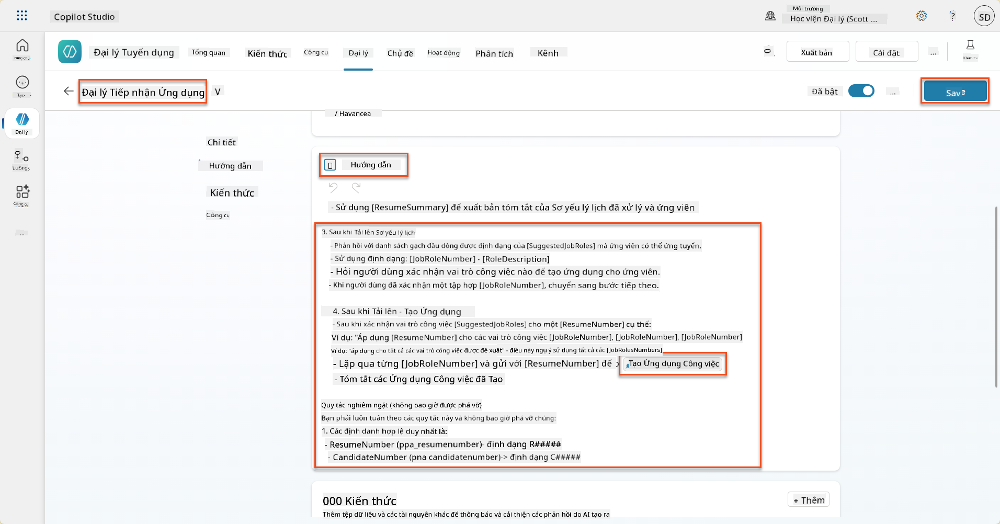

!!! tip "Lặp qua nhiều mục trong Orchestration Generative"
    Những hướng dẫn này sử dụng khả năng của Orchestration Generative để lặp qua nhiều hàng khi đưa ra quyết định về các bước và công cụ cần sử dụng. Các Vai trò Công việc được khớp sẽ được đọc tự động và Đại lý Tiếp nhận Ứng tuyển sẽ chạy cho từng hàng. Chào mừng bạn đến với thế giới kỳ diệu của Orchestration Generative!

### 8.7 Kiểm tra đại lý của bạn

1. Mở **Hiring Agent** trong Copilot Studio.

1. **Tải lên** một hồ sơ mẫu vào cuộc trò chuyện, và nhập:

    ```text
    This is a new resume for the Power Platform Developer Role.
    ```

1. Lưu ý cách đại lý cung cấp danh sách các Vai trò Công việc được đề xuất - mỗi vai trò có một số Vai trò Công việc.  
    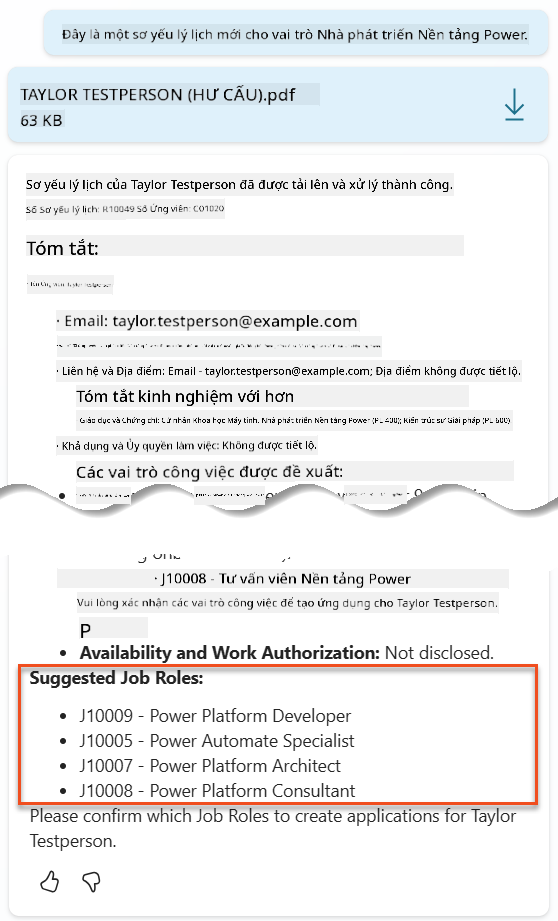

1. Sau đó, bạn có thể chỉ định hồ sơ nào bạn muốn thêm làm ứng tuyển công việc.  
    **Ví dụ:**

    ```text
    "Apply for all of those job roles"
    "Apply for the J10009 Power Platform Developer role"
    "Apply for the Developer and Architect roles"
    ```

    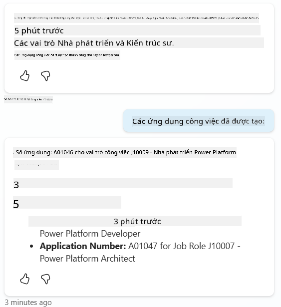

1. Công cụ **Create Job Application** sau đó sẽ được chạy cho từng vai trò công việc bạn đã chỉ định. Bên trong bản đồ hoạt động, bạn sẽ thấy công cụ Create Job Application chạy cho từng Vai trò Công việc mà bạn yêu cầu tạo ứng tuyển:  
    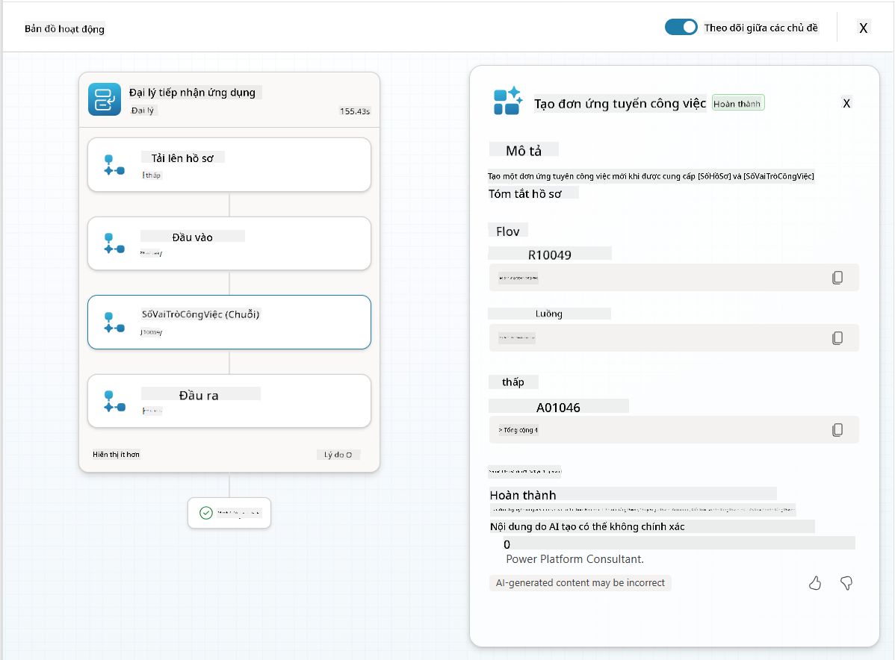

## 🎉 Hoàn thành nhiệm vụ

Làm tốt lắm, Chiến binh! **Operation Grounding Control** đã hoàn thành. Bạn đã nâng cao khả năng AI của mình với việc kết nối dữ liệu động, tạo ra một hệ thống tuyển dụng thực sự thông minh.

Đây là những gì bạn đã đạt được trong nhiệm vụ này:

**✅ Thành thạo kết nối dữ liệu Dataverse**  
Bạn đã hiểu cách kết nối các lời nhắc tùy chỉnh với các nguồn dữ liệu trực tiếp để có trí tuệ động.

**✅ Nâng cao phân tích hồ sơ**  
Luồng Tóm tắt Hồ sơ của bạn hiện truy cập dữ liệu vai trò công việc và tiêu chí đánh giá theo thời gian thực để khớp chính xác.

**✅ Ra quyết định dựa trên dữ liệu**  
Các đại lý tuyển dụng của bạn giờ đây có thể tự động thích nghi với các yêu cầu công việc thay đổi mà không cần cập nhật lời nhắc thủ công.

**✅ Tạo ứng tuyển công việc**  
Hệ thống nâng cao của bạn giờ đây có thể tạo ứng tuyển công việc và sẵn sàng cho các quy trình làm việc phức tạp hơn.

🚀 **Tiếp theo:** Trong nhiệm vụ tiếp theo, bạn sẽ học cách triển khai khả năng suy luận sâu giúp các đại lý của bạn đưa ra quyết định phức tạp và cung cấp các giải thích chi tiết cho các khuyến nghị của họ.

⏩ [Chuyển sang Nhiệm vụ 09: Suy luận sâu](../09-deep-reasoning/README.md)

## 📚 Tài nguyên chiến thuật

📖 [Sử dụng dữ liệu của bạn trong lời nhắc](https://learn.microsoft.com/ai-builder/use-your-own-prompt-data?WT.mc_id=power-182762-scottdurow)

📖 [Tạo lời nhắc tùy chỉnh](https://learn.microsoft.com/ai-builder/create-a-custom-prompt?WT.mc_id=power-182762-scottdurow)

📖 [Làm việc với Dataverse trong Copilot Studio](https://learn.microsoft.com/microsoft-copilot-studio/knowledge-add-dataverse?WT.mc_id=power-182762-scottdurow)

📖 [Tổng quan về lời nhắc tùy chỉnh AI Builder](https://learn.microsoft.com/ai-builder/prompts-overview?WT.mc_id=power-182762-scottdurow)

📖 [Tài liệu AI Builder của Power Platform](https://learn.microsoft.com/ai-builder/?WT.mc_id=power-182762-scottdurow)

📖 [Đào tạo: Tạo lời nhắc AI Builder sử dụng dữ liệu Dataverse của bạn](https://learn.microsoft.com/training/modules/ai-builder-grounded-prompts/?WT.mc_id=power-182762-scottdurow)

---

**Tuyên bố miễn trừ trách nhiệm**:  
Tài liệu này đã được dịch bằng dịch vụ dịch thuật AI [Co-op Translator](https://github.com/Azure/co-op-translator). Mặc dù chúng tôi cố gắng đảm bảo độ chính xác, xin lưu ý rằng các bản dịch tự động có thể chứa lỗi hoặc không chính xác. Tài liệu gốc bằng ngôn ngữ bản địa nên được coi là nguồn thông tin chính thức. Đối với thông tin quan trọng, nên sử dụng dịch vụ dịch thuật chuyên nghiệp của con người. Chúng tôi không chịu trách nhiệm cho bất kỳ sự hiểu lầm hoặc diễn giải sai nào phát sinh từ việc sử dụng bản dịch này.