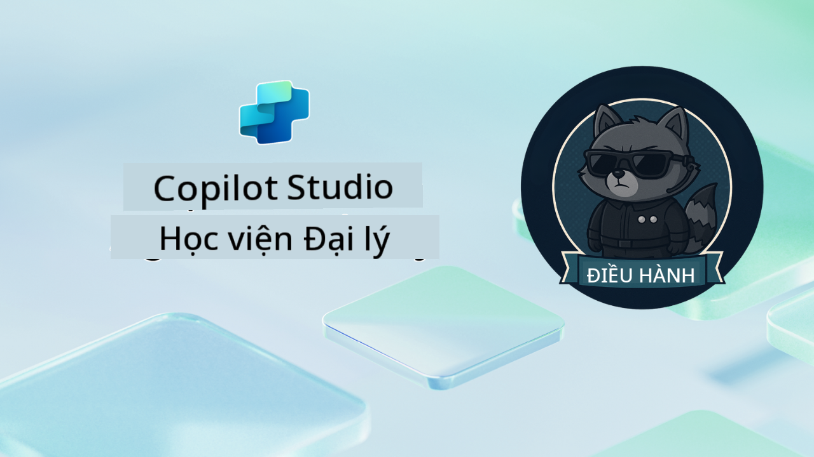

<!--
CO_OP_TRANSLATOR_METADATA:
{
  "original_hash": "24fcbe9a57d3439e05f8866e550c0a84",
  "translation_date": "2025-10-20T00:58:26+00:00",
  "source_file": "docs/operative-preview/README.md",
  "language_code": "vi"
}
-->
# Chào mừng Đặc vụ

**Chào mừng, Đặc vụ.**  
Nhiệm vụ nâng cao của bạn—nếu bạn chọn chấp nhận—là làm chủ nghệ thuật xây dựng **hệ thống đa đặc vụ cấp doanh nghiệp** bằng **Microsoft Copilot Studio**.

Khóa đào tạo chuyên sâu này sẽ đưa bạn vượt qua việc tạo đặc vụ cơ bản để bước vào thế giới phức tạp của **điều phối đa đặc vụ**: từ tự động hóa tuyển dụng đến an toàn AI, bạn sẽ học cách xây dựng, điều phối và triển khai các hệ sinh thái đặc vụ thông minh trong các tình huống thực tế của doanh nghiệp.

--8<-- "disclaimer.md"

---

## 🎯 Mục tiêu Nhiệm vụ

Hoàn thành chương trình Đặc vụ Học viện, bạn sẽ có khả năng:

- Thiết kế và triển khai **hệ thống đa đặc vụ** cho các tình huống kinh doanh phức tạp
- Làm chủ **điều phối đặc vụ** và các mẫu hợp tác
- Triển khai **an toàn AI và kiểm duyệt nội dung** trong hệ thống sản xuất
- Xây dựng **lời nhắc đa phương thức** để xử lý và phân tích tài liệu
- Triển khai **đặc vụ sẵn sàng cho doanh nghiệp** với quản trị và kiểm tra đúng cách

---

## 🧪 Yêu cầu tiên quyết

Để hoàn thành tất cả các nhiệm vụ, bạn cần:

- Hoàn thành khóa đào tạo **Tuyển dụng Học viện Đặc vụ**
- Môi trường Microsoft Power Platform với giấy phép **Copilot Studio**
- Quyền truy cập vào **Microsoft Dataverse**
- Quyền quản trị để tạo giải pháp và đặc vụ

---

## 🧬 Dành cho ai

Khóa học nâng cao này lý tưởng cho:

- **Kiến trúc sư giải pháp** thiết kế hệ thống AI doanh nghiệp
- **Nhà phát triển** xây dựng giải pháp đặc vụ sẵn sàng sản xuất
- **Chuyên gia IT** triển khai quản trị và an toàn AI
- **Nhà phân tích kinh doanh** tạo quy trình tự động hóa phức tạp
- Bất kỳ ai sẵn sàng **nâng cấp** từ đặc vụ cơ bản lên hệ thống doanh nghiệp

---

## 🧭 Tổng quan Chương trình

Học viện này được cấu trúc như một loạt các hoạt động thực địa tiến bộ—mỗi nhiệm vụ xây dựng dựa trên nhiệm vụ trước đó để tạo ra một hệ thống tự động hóa tuyển dụng toàn diện.

| Nhiệm vụ | Tiêu đề | Tóm tắt Hoạt động |
|----------|---------|-------------------|
| `01` | 🚨 [Bắt đầu với Đặc vụ Tuyển dụng](./01-get-started/README.md) | Triển khai cơ sở hạ tầng nền tảng và tạo đặc vụ điều phối trung tâm của bạn |
| `02` | 🎭 [Làm cho đặc vụ của bạn sẵn sàng đa đặc vụ với các đặc vụ kết nối](./02-multi-agent/README.md) | Chuyển đổi đặc vụ đơn thành hệ thống đa đặc vụ phối hợp |
| `03` | ⚡ [Tự động hóa đặc vụ của bạn với Triggers](./03-automate-triggers/README.md) | Triển khai hành vi tự động của đặc vụ với triggers dựa trên sự kiện |
| `04` | 📝 [Soạn thảo Hướng dẫn Đặc vụ](./04-agent-instructions/README.md) | Làm chủ giao tiếp chính xác và kiểm soát hành vi của đặc vụ |
| `05` | 💬 [Cá nhân hóa Phản hồi Đặc vụ](./05-agent-responses/README.md) | Tùy chỉnh phản hồi của đặc vụ để đạt hiệu quả và tương tác tối đa |
| `06` | 🛡️ [Kiểm duyệt Nội dung và Các Yếu tố An toàn AI](./06-ai-safety/README.md) | Triển khai các biện pháp an toàn và tuân thủ cấp doanh nghiệp |
| `07` | 🎨 [Trích xuất Nội dung Hồ sơ với Lời nhắc Đa phương thức](./07-multimodal-prompts/README.md) | Xử lý tài liệu và hình ảnh với khả năng AI tiên tiến |
| `08` | 🗄️ [Lời nhắc - Nền tảng Dataverse](./08-dataverse-grounding/README.md) | Đặt nền tảng cho đặc vụ trong dữ liệu doanh nghiệp để có phản hồi chính xác |
| `09` | 🧠 [Áp dụng Lý luận Sâu để Đánh giá Sự Phù hợp của Ứng viên và Chuẩn bị Phỏng vấn](./09-deep-reasoning/README.md) | Triển khai lý luận AI tinh vi cho các quyết định phức tạp |
| `10` | 📄 [Tạo Tài liệu Phỏng vấn Cụ thể cho Ứng viên với Lời nhắc](./10-generate-documents/README.md) | Tạo tài liệu động dựa trên phân tích của đặc vụ |
| `11` | 📊 [Thu thập Phản hồi Người dùng với Thẻ Thích ứng](./11-obtain-user-feedback/README.md) | Thu thập và xử lý phản hồi của người dùng để cải tiến liên tục |
| `12` | 🌐 [Xuất bản Đặc vụ của Bạn lên Trang Web Demo để Kiểm tra với Các Bên Liên quan](./12-demo-website/README.md) | Triển khai giải pháp hoàn chỉnh để trình diễn và kiểm tra với các bên liên quan |

!!! note
    ✅ Hoàn thành chương trình này sẽ giúp bạn nhận được huy hiệu **Đặc vụ**.  
    🔓 **Chỉ huy** sẽ được mở khóa trong các giai đoạn tiếp theo.

<!-- markdownlint-disable-next-line MD033 -->

---

**Tuyên bố miễn trừ trách nhiệm**:  
Tài liệu này đã được dịch bằng dịch vụ dịch thuật AI [Co-op Translator](https://github.com/Azure/co-op-translator). Mặc dù chúng tôi cố gắng đảm bảo độ chính xác, xin lưu ý rằng các bản dịch tự động có thể chứa lỗi hoặc không chính xác. Tài liệu gốc bằng ngôn ngữ bản địa nên được coi là nguồn thông tin chính thức. Đối với thông tin quan trọng, nên sử dụng dịch vụ dịch thuật chuyên nghiệp bởi con người. Chúng tôi không chịu trách nhiệm cho bất kỳ sự hiểu lầm hoặc diễn giải sai nào phát sinh từ việc sử dụng bản dịch này.