<!--
CO_OP_TRANSLATOR_METADATA:
{
  "original_hash": "d9cd8cd1a4fbd8915171a2ed972cc322",
  "translation_date": "2025-10-20T00:38:11+00:00",
  "source_file": "docs/recruit/00-course-setup/README.md",
  "language_code": "vi"
}
-->
# 🚨 Nhiệm vụ 00: Thiết lập khóa học

## 🕵️‍♂️ MẬT DANH: `SẴN SÀNG TRIỂN KHAI`

> **⏱️ Thời gian thực hiện nhiệm vụ:** `~30 phút`  

## 🎯 Tóm tắt nhiệm vụ

Chào mừng bạn đến với nhiệm vụ đầu tiên trong quá trình đào tạo trở thành một Đặc vụ Copilot Studio.  
Trước khi bắt đầu xây dựng AI agent đầu tiên, bạn cần thiết lập môi trường phát triển **sẵn sàng hoạt động thực tế**.

Bản tóm tắt này sẽ hướng dẫn bạn về hệ thống, thông tin truy cập và các bước thiết lập cần thiết để hoạt động thành công trong hệ sinh thái Microsoft 365.

## 🔎 Mục tiêu

Nhiệm vụ của bạn bao gồm:

1. Có tài khoản Microsoft 365  
1. Truy cập vào Microsoft Copilot Studio  
1. (Tùy chọn) Đăng ký giấy phép Microsoft 365 Copilot để xuất bản sản phẩm  
1. Tạo môi trường phát triển làm môi trường Copilot Studio để xây dựng  
1. Tạo trang SharePoint để làm nguồn dữ liệu cho các nhiệm vụ sau

---

## 🔍 Điều kiện tiên quyết

Trước khi bắt đầu, hãy đảm bảo bạn có:

1. Một **địa chỉ email công việc hoặc trường học** (email cá nhân như @outlook.com, @gmail.com, v.v. không được hỗ trợ).
1. Truy cập internet và trình duyệt hiện đại (khuyến nghị Edge, Chrome hoặc Firefox).  
1. Hiểu biết cơ bản về Microsoft 365 (ví dụ: đăng nhập vào ứng dụng Office hoặc Teams).  
1. (Tùy chọn) Thẻ tín dụng hoặc phương thức thanh toán nếu bạn dự định mua giấy phép trả phí.

---

## Bước 1: Có tài khoản Microsoft 365

Copilot Studio nằm trong Microsoft 365, vì vậy bạn cần tài khoản Microsoft 365 để truy cập. Bạn có thể sử dụng tài khoản hiện có nếu đã có hoặc làm theo các bước sau để đăng ký giấy phép phù hợp:

1. **Đăng ký gói Microsoft 365 Business trả phí**  
   1. Truy cập [Trang giá và gói Microsoft 365 Business](https://www.microsoft.com/microsoft-365/business/microsoft-365-plans-and-pricing)
   1. Lựa chọn rẻ nhất để bắt đầu là gói Microsoft 365 Business Basic. Chọn `Dùng thử miễn phí` và làm theo hướng dẫn để điền thông tin đăng ký, chi tiết tài khoản và thông tin thanh toán.
   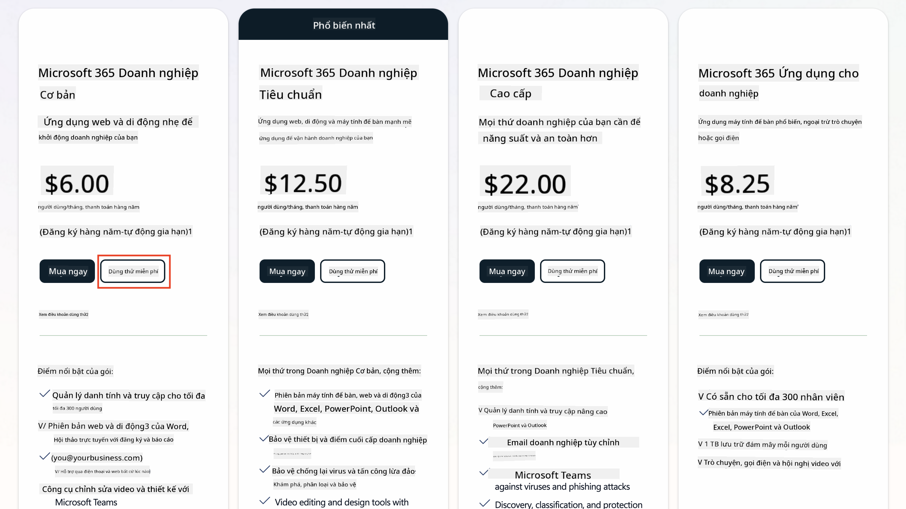
   1. Sau khi có tài khoản mới, đăng nhập.

    !!! Tip
        Nếu bạn dự định xuất bản các agent vào Microsoft 365 Copilot Chat hoặc kết nối với dữ liệu tổ chức (SharePoint, OneDrive, Dataverse), bạn cần giấy phép Microsoft 365 Copilot. Đây là giấy phép bổ sung mà bạn có thể tìm hiểu thêm [trên trang giấy phép](https://www.microsoft.com/microsoft-365/copilot#plans)

---

## Bước 2: Bắt đầu dùng thử Copilot Studio

Sau khi có Microsoft 365 Tenant, bạn cần truy cập Copilot Studio. Bạn có thể nhận bản dùng thử miễn phí 30 ngày bằng cách làm theo các bước sau:

1. Truy cập [aka.ms/TryCopilotStudio](https://aka.ms/TryCopilotStudio).  
1. Nhập địa chỉ email từ tài khoản mới bạn đã cấu hình ở bước trước và chọn `Tiếp theo`.  
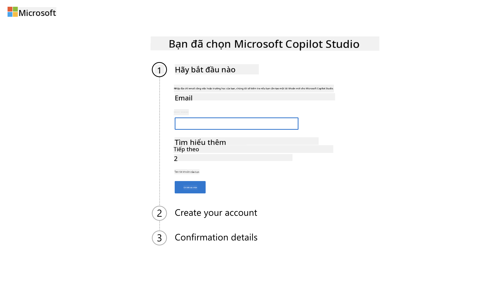
1. Hệ thống sẽ nhận diện tài khoản của bạn. Chọn `Đăng nhập`.
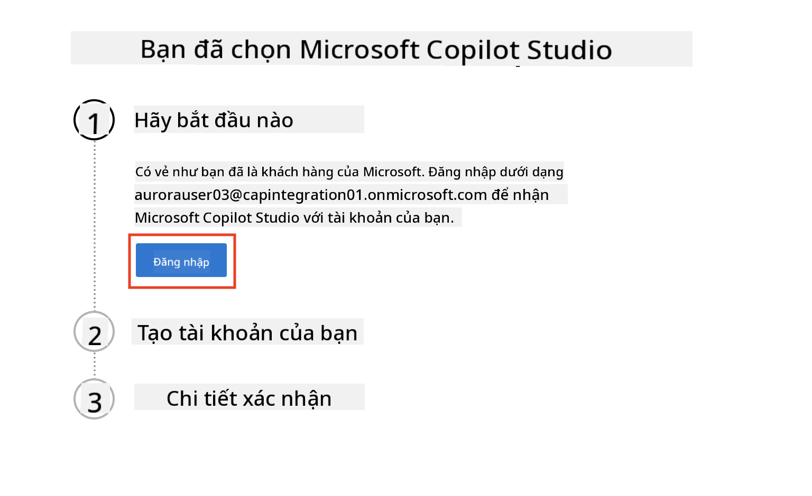  
1. Chọn `Bắt đầu dùng thử miễn phí`.
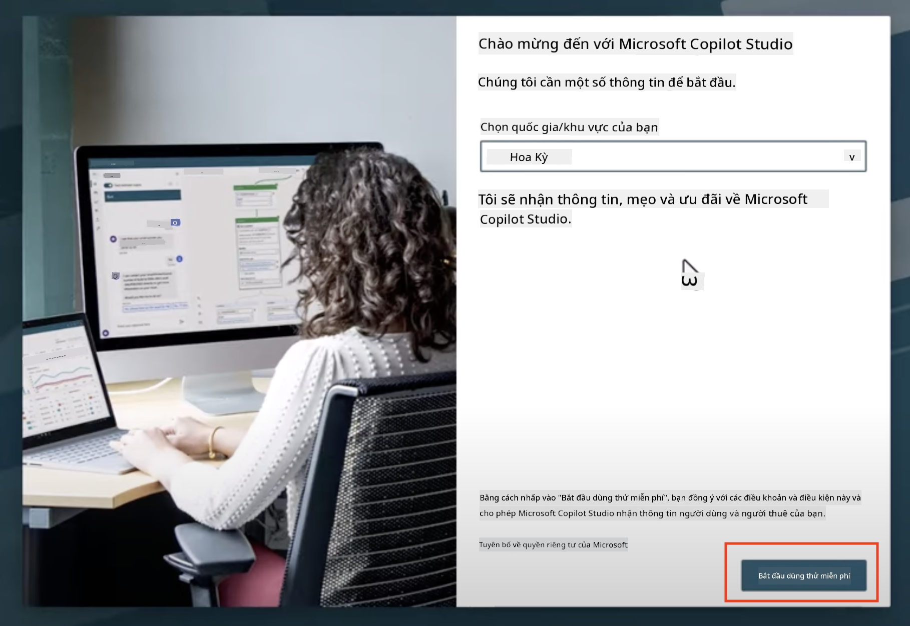

!!! info "Ghi chú về bản dùng thử"  
     1. Bản dùng thử miễn phí cung cấp **đầy đủ các tính năng của Copilot Studio**.
     1. Bạn sẽ nhận được thông báo qua email về thời gian hết hạn của bản dùng thử. Bạn có thể gia hạn bản dùng thử thêm 30 ngày (tối đa 90 ngày sử dụng agent).  
     1. Nếu quản trị viên tenant của bạn đã tắt chức năng tự đăng ký, bạn sẽ thấy lỗi—hãy liên hệ với quản trị viên Microsoft 365 của bạn để kích hoạt lại.

---

## Bước 3: Tạo môi trường phát triển mới

### Đăng ký gói Power Apps Developer Plan

Sử dụng cùng Microsoft 365 tenant ở Bước 1, đăng ký gói Power Apps Developer Plan để tạo môi trường phát triển miễn phí nhằm xây dựng và thử nghiệm với Copilot Studio.

1. Đăng ký tại [Trang web Power Apps Developer Plan](https://aka.ms/PowerAppsDevPlan).

    - Nhập địa chỉ email của bạn
    - Tích vào ô kiểm
    - Chọn **Bắt đầu miễn phí**

    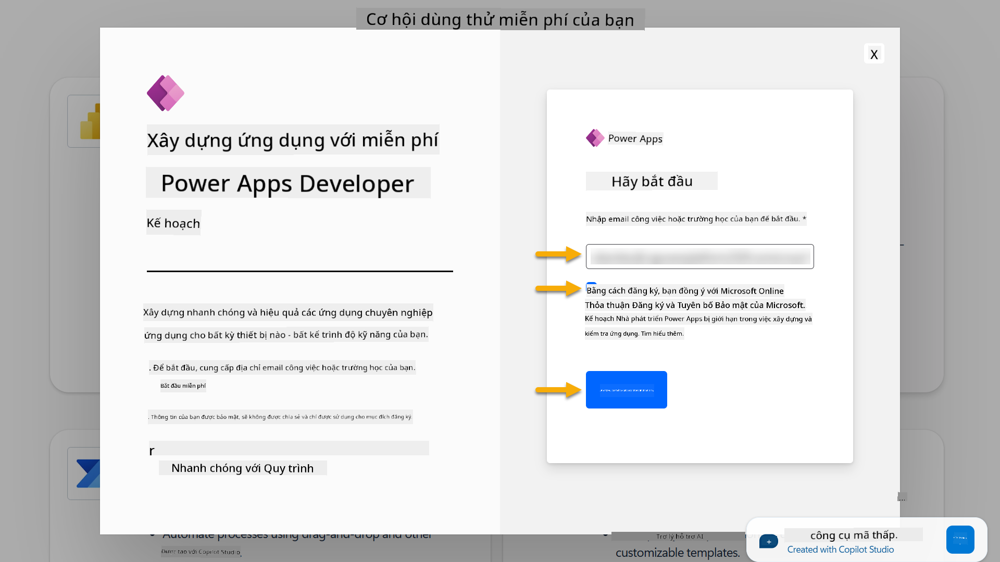

1. Sau khi đăng ký gói Developer Plan, bạn sẽ được chuyển hướng đến [Power Apps](https://make.powerapps.com/). Môi trường sẽ sử dụng tên của bạn, ví dụ **Môi trường của Adele Vance**. Nếu đã có môi trường với tên đó, môi trường mới sẽ được đặt tên là **Môi trường của Adele Vance (1)**.

    Sử dụng môi trường phát triển này trong Copilot Studio khi hoàn thành các bài thực hành.

!!! Note
    Nếu bạn đang sử dụng tài khoản Microsoft 365 hiện có và không tạo tài khoản mới ở Bước 1, ví dụ - sử dụng tài khoản của bạn trong tổ chức làm việc, quản trị viên CNTT (hoặc đội ngũ tương đương) quản lý tenant/môi trường của bạn có thể đã tắt quá trình đăng ký. Trong trường hợp này, vui lòng liên hệ với quản trị viên của bạn hoặc tạo một tenant thử nghiệm như đã hướng dẫn ở Bước 1.

---

## Bước 4: Tạo trang SharePoint mới

Một trang SharePoint mới cần được tạo để sử dụng trong [Bài học 06 - Tạo agent tùy chỉnh bằng trải nghiệm tạo hội thoại với Copilot và liên kết với dữ liệu của bạn](../06-create-agent-from-conversation/README.md#62-add-an-internal-knowledge-source-using-a-sharepoint-site).

1. Chọn biểu tượng waffle ở góc trên bên trái của Microsoft Copilot Studio để xem menu. Chọn SharePoint từ menu.

    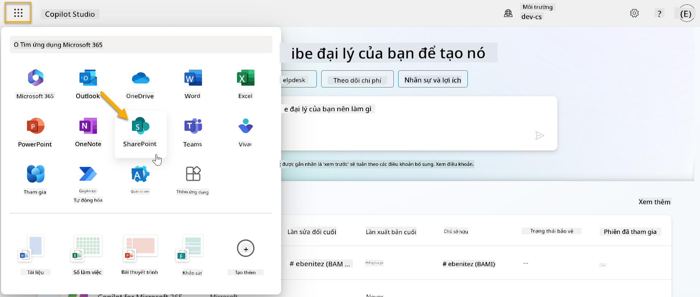

1. SharePoint sẽ tải. Chọn **+ Tạo trang** để tạo trang SharePoint mới.

    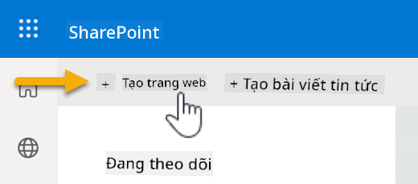

1. Một hộp thoại sẽ xuất hiện để hướng dẫn bạn tạo trang SharePoint mới. Chọn **Trang nhóm**.

    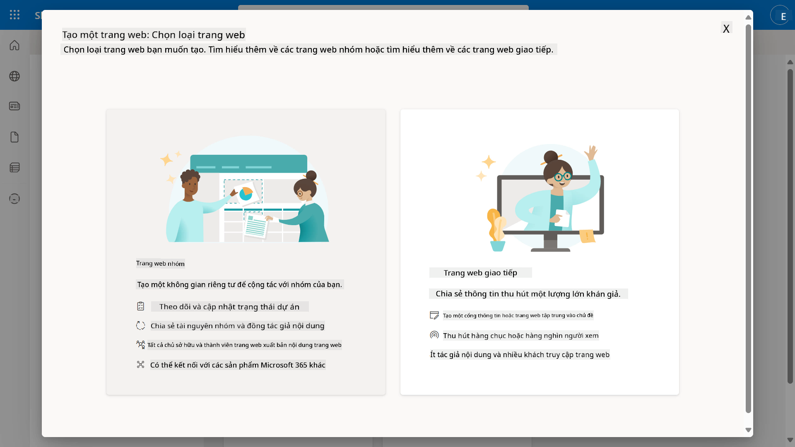

1. Ở bước tiếp theo, danh sách các mẫu Microsoft sẽ được tải mặc định. Cuộn xuống và chọn mẫu **IT help desk**.

    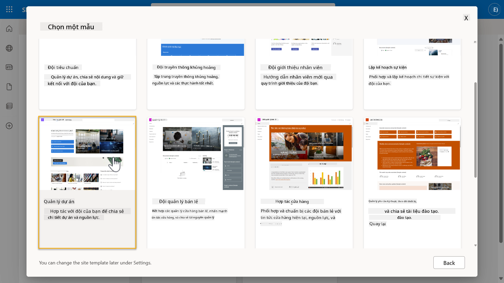

1. Chọn **Sử dụng mẫu** để tạo trang SharePoint mới sử dụng mẫu IT help desk.

    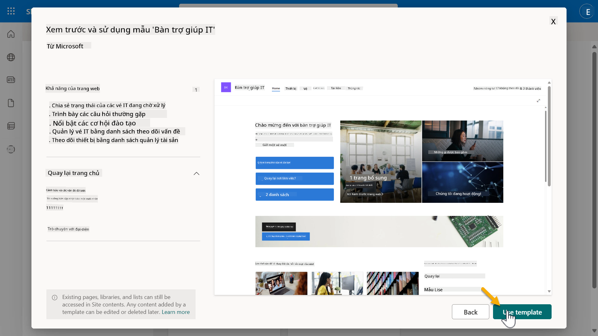

1. Nhập thông tin cho trang của bạn. Ví dụ như sau:

    | Trường | Giá trị |
    | --- | --- |
    | Tên trang | Contoso IT |
    | Mô tả trang | Copilot Studio cho người mới bắt đầu |
    | Địa chỉ trang | ContosoIT |

    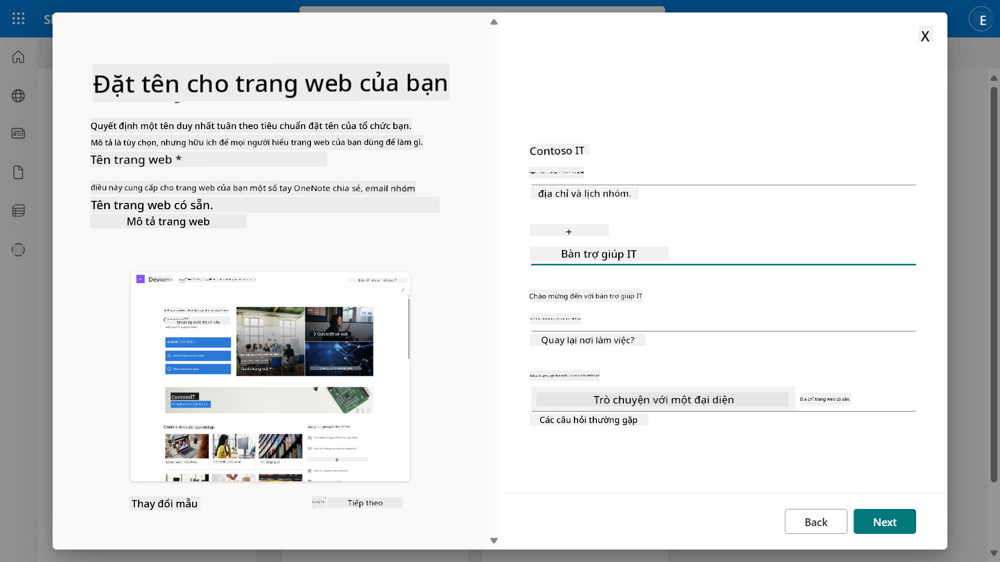

1. Ở bước cuối cùng, bạn có thể chọn ngôn ngữ cho trang SharePoint. Mặc định sẽ là **Tiếng Anh**. Để nguyên ngôn ngữ là **Tiếng Anh** và chọn **Tạo trang**.

    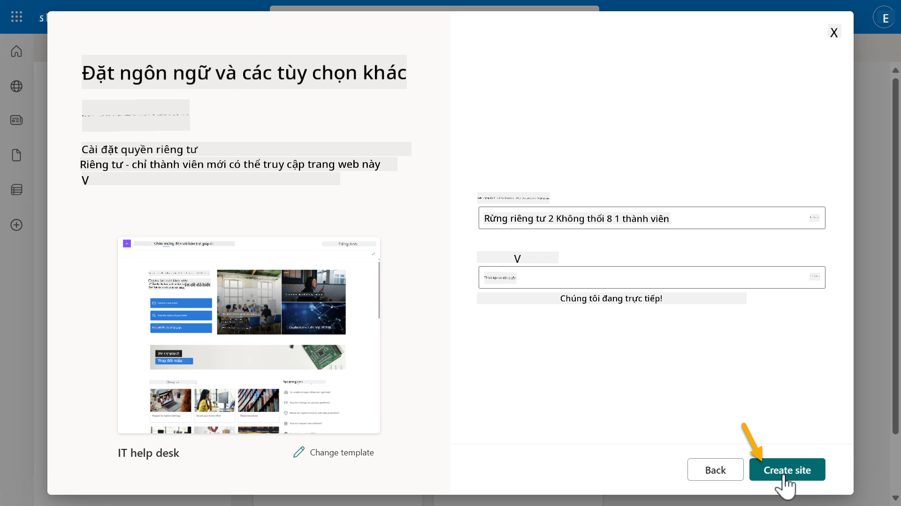

1. Trang SharePoint sẽ được tạo trong vài giây. Trong thời gian chờ, bạn có thể thêm người dùng khác vào trang của mình bằng cách nhập địa chỉ email của họ vào trường **Thêm thành viên**. Khi hoàn tất, chọn **Hoàn tất**.

    

1. Trang chủ của trang SharePoint sẽ được tải. **Sao chép** URL của trang SharePoint.

1. Mẫu này cung cấp các trang với dữ liệu mẫu về các chính sách IT khác nhau và hai danh sách mẫu (Tickets và Devices).

### Sử dụng danh sách Devices trong SharePoint

Chúng ta sẽ sử dụng danh sách **Devices** trong [Nhiệm vụ 07 - Thêm chủ đề mới với trigger và nodes](../07-add-new-topic-with-trigger/README.md#73-add-a-tool-using-a-connector).

### Thêm cột mới

Cuộn sang bên phải trong danh sách và chọn nút **+ Thêm cột**. Chọn loại **hyperlink**, nhập **Hình ảnh** cho tên cột và chọn thêm.

### Tạo dữ liệu mẫu trong danh sách Devices của SharePoint

Bạn cần đảm bảo điền vào danh sách này ít nhất 4 mục dữ liệu mẫu và thêm một cột bổ sung vào danh sách này.  

Khi thêm dữ liệu mẫu, hãy đảm bảo rằng các trường sau được điền:

- Ảnh thiết bị - sử dụng hình ảnh từ [thư mục hình ảnh thiết bị](https://github.com/microsoft/agent-academy/tree/main/docs/recruit/00-course-setup/images/device-images)
- Tiêu đề
- Trạng thái
- Nhà sản xuất
- Mẫu
- Loại tài sản
- Màu sắc
- Số serial
- Ngày mua
- Giá mua,
- Số đơn hàng
- Hình ảnh - sử dụng các liên kết sau

|Thiết bị  |URL  |
|---------|---------|
|Surface Laptop 13     | [https://raw.githubusercontent.com/microsoft/agent-academy/refs/heads/main/docs/recruit/00-course-setup/images/device-images/Surface-Laptop-13.png](https://raw.githubusercontent.com/microsoft/agent-academy/refs/heads/main/docs/recruit/00-course-setup/images/device-images/Surface-Laptop-13.png)        |
|Surface Laptop 15     | [https://raw.githubusercontent.com/microsoft/agent-academy/refs/heads/main/docs/recruit/00-course-setup/images/device-images/Surface-Laptop-15.png](https://raw.githubusercontent.com/microsoft/agent-academy/refs/heads/main/docs/recruit/00-course-setup/images/device-images/Surface-Laptop-15.png)        |
|Surface Pro    | [https://raw.githubusercontent.com/microsoft/agent-academy/refs/heads/main/docs/recruit/00-course-setup/images/device-images/Surface-Pro-12.png](https://raw.githubusercontent.com/microsoft/agent-academy/refs/heads/main/docs/recruit/00-course-setup/images/device-images/Surface-Pro-12.png)        |
|Surface Studio    | [https://raw.githubusercontent.com/microsoft/agent-academy/refs/heads/main/docs/recruit/00-course-setup/images/device-images/Surface-Studio.png](https://raw.githubusercontent.com/microsoft/agent-academy/refs/heads/main/docs/recruit/00-course-setup/images/device-images/Surface-Studio.png)        |

---

## ✅ Hoàn thành nhiệm vụ

Bạn đã thành công:

- Thiết lập môi trường phát triển Microsoft 365  
- Kích hoạt bản dùng thử Copilot Studio  
- Tạo trang SharePoint để liên kết với agent  
- Điền danh sách Devices để sử dụng trong các nhiệm vụ sau

Bạn đã chính thức sẵn sàng bắt đầu **đào tạo cấp độ Tân binh** trong [Bài học 01](../01-introduction-to-agents/README.md).  

<!-- markdownlint-disable-next-line MD033 -->

---

**Tuyên bố miễn trừ trách nhiệm**:  
Tài liệu này đã được dịch bằng dịch vụ dịch thuật AI [Co-op Translator](https://github.com/Azure/co-op-translator). Mặc dù chúng tôi cố gắng đảm bảo độ chính xác, xin lưu ý rằng các bản dịch tự động có thể chứa lỗi hoặc không chính xác. Tài liệu gốc bằng ngôn ngữ bản địa nên được coi là nguồn thông tin chính thức. Đối với thông tin quan trọng, khuyến nghị sử dụng dịch vụ dịch thuật chuyên nghiệp bởi con người. Chúng tôi không chịu trách nhiệm cho bất kỳ sự hiểu lầm hoặc diễn giải sai nào phát sinh từ việc sử dụng bản dịch này.