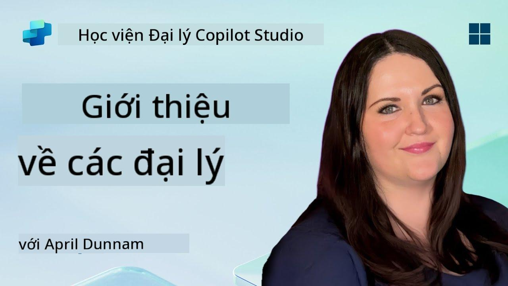

<!--
CO_OP_TRANSLATOR_METADATA:
{
  "original_hash": "d6706e107678264168d77b2e107710b1",
  "translation_date": "2025-10-20T00:53:17+00:00",
  "source_file": "docs/recruit/01-introduction-to-agents/README.md",
  "language_code": "vi"
}
-->
# 🚨 Nhiệm vụ 01: Giới thiệu về Agents

## 🕵️‍♂️ MẬT DANH: `CHIẾN DỊCH GIẢI MÃ AGENT AI`

> **⏱️ Thời gian thực hiện nhiệm vụ:** `~30 phút – chỉ thu thập thông tin, không cần thực địa`

🎥 **Xem video hướng dẫn**

## 🎯 Tóm tắt nhiệm vụ

Chào mừng bạn, Tân binh. Trước khi chúng ta bắt đầu xây dựng các agent, bạn cần nắm vững các khái niệm AI làm nền tảng cho chúng. Nhiệm vụ này sẽ trang bị cho bạn kiến thức cơ bản về AI hội thoại, mô hình ngôn ngữ lớn (LLMs), tạo nội dung dựa trên truy xuất (RAG), và các loại agent mà bạn có thể tạo trong Copilot Studio.

## 🔎 Mục tiêu

Trong nhiệm vụ này, bạn sẽ học:

1. AI hội thoại là gì và tại sao nó quan trọng  
1. Cách Mô hình Ngôn ngữ Lớn (LLMs) hỗ trợ trải nghiệm trò chuyện  
1. Tạo nội dung dựa trên truy xuất (RAG) mang lại lợi ích gì  
1. Sự khác biệt giữa agent hội thoại và agent tự động  
1. Cách các agent trong Copilot Studio tận dụng những khái niệm này  

Hãy bắt đầu nào!

---

## AI Hội thoại là gì?

AI hội thoại là bất kỳ hệ thống nào có thể hiểu, xử lý và phản hồi ngôn ngữ của con người – dù là văn bản hay lời nói – một cách tự nhiên. Hãy nghĩ đến các chatbot trong các trung tâm hỗ trợ hoặc các trợ lý cá nhân ảo trong các ứng dụng yêu thích của bạn. Bên trong, hầu hết các AI hội thoại hiện đại đều dựa vào Mô hình Ngôn ngữ Lớn (LLMs), mà chúng ta sẽ tìm hiểu ngay sau đây.

### Tại sao nó quan trọng

- **Trải nghiệm người dùng:** Giao diện hội thoại thường trực quan hơn so với việc nhấp qua các menu.  
- **Khả năng mở rộng:** Một agent có thể xử lý hàng chục hoặc hàng trăm cuộc trò chuyện đồng thời.  
- **Hiệu quả:** Thay vì xây dựng các kịch bản dựa trên quy tắc tùy chỉnh, các agent sử dụng LLM có thể thích nghi nhanh chóng với đầu vào của người dùng.  
- **Khả năng mở rộng:** Với thiết kế phù hợp, các agent có thể truy cập vào cơ sở kiến thức, kết nối với API hoặc hoạt động như “đồng nghiệp kỹ thuật số” trong các quy trình công việc kinh doanh.

---

## Mô hình Ngôn ngữ Lớn (LLMs) 101

Cốt lõi của hầu hết các hệ thống AI hội thoại là **Mô hình Ngôn ngữ Lớn** – mạng nơ-ron được huấn luyện trên khối lượng lớn văn bản. Chúng học các mẫu thống kê của ngôn ngữ để có thể tạo ra các câu mạch lạc, trả lời câu hỏi hoặc thậm chí đưa ra ý tưởng. Những điểm chính cần hiểu:

1. **Dữ liệu huấn luyện:** LLMs tiếp nhận hàng terabyte văn bản (trang web, sách, bài báo). Kiến thức này giúp chúng trả lời về nhiều chủ đề.  
1. **Phân đoạn:** Văn bản được chia thành các đơn vị nhỏ hơn gọi là token (từ, phần từ hoặc ký tự). Mô hình dự đoán từng token một.  
1. **Cửa sổ ngữ cảnh:** Mỗi LLM có giới hạn về số lượng token mà nó có thể “nhìn thấy” cùng một lúc. Vượt quá giới hạn này, các token trước đó sẽ bị cắt bỏ.  
1. **Gợi ý:** Bạn tương tác với LLM bằng cách gửi cho nó một gợi ý. Gợi ý càng tốt, phản hồi càng tập trung và phù hợp.  
1. **Zero-shot vs. Fine-tuning:** Zero-shot nghĩa là sử dụng LLM như hiện tại (chỉ với trọng số thô). Fine-tuning nghĩa là điều chỉnh mô hình trên dữ liệu chuyên ngành để nó trả lời chính xác hơn cho nhu cầu của bạn.

!!! Tip "Mẹo hay"
    Một phép so sánh phổ biến là LLM giống như một “tính năng tự động hoàn thành siêu thông minh.” Nó không thực sự hiểu ý nghĩa như bộ não con người, nhưng rất giỏi trong việc dự đoán từ (hoặc cụm từ) tiếp theo tốt nhất trong một chuỗi.

---

## Tạo nội dung dựa trên truy xuất (RAG)

Khi LLMs chỉ dựa vào dữ liệu huấn luyện tĩnh, chúng có thể tạo ra thông tin sai lệch hoặc trở nên lỗi thời. RAG giải quyết vấn đề này bằng cách cho phép mô hình “tra cứu” thông tin mới trước khi tạo câu trả lời. Ở mức độ cao, RAG hoạt động như sau:

1. **Truy vấn của người dùng:** Người dùng đặt câu hỏi (ví dụ: “Tin tức mới nhất về doanh thu hàng quý của Contoso là gì?”).  
1. **Bước truy xuất:** Hệ thống truy vấn một nguồn kiến thức (tài liệu, cơ sở dữ liệu nội bộ, thư viện SharePoint, v.v.) để tìm các đoạn liên quan.  
1. **Bổ sung:** Các đoạn được truy xuất sẽ được thêm vào hoặc đặt trước gợi ý của LLM.  
1. **Tạo nội dung:** LLM tiếp nhận cả câu hỏi của người dùng và ngữ cảnh được truy xuất, sau đó tạo ra câu trả lời dựa trên dữ liệu mới nhất.  

Với RAG, agent của bạn có thể truy cập các wiki nội bộ của công ty, plugin API, hoặc tìm kiếm trong cơ sở kiến thức FAQ – và trả về các câu trả lời không bị giới hạn bởi các tham số mô hình tĩnh đã được công bố.

---

## Agent hội thoại vs. Agent tự động

Trong bối cảnh của Copilot Studio, thuật ngữ **agent** có thể đề cập đến nhiều loại trợ lý AI. Hãy phân biệt rõ ràng giữa:

**Agent hội thoại:**

- Tập trung chủ yếu vào đối thoại hai chiều.  
- Duy trì ngữ cảnh qua nhiều lượt trò chuyện.  
- Thường được điều phối thông qua các luồng hoặc kích hoạt được định trước (ví dụ: “Nếu người dùng nói X, trả lời Y”).  
- Lý tưởng cho hỗ trợ khách hàng, FAQ, tương tác hướng dẫn, lập lịch, hoặc Q&A đơn giản.  
  - Ví dụ:  
    - Một chatbot Teams trả lời các câu hỏi về chính sách nhân sự.  
    - Một bot Power Virtual Agents trên trang SharePoint hướng dẫn người dùng điền vào biểu mẫu.  

**Agent tự động:**

- Vượt xa việc trò chuyện qua lại; chúng có thể **thực hiện hành động** thay mặt người dùng.  
- Sử dụng các vòng lặp lý luận của LLM (nghĩa là “lập kế hoạch → hành động → quan sát → lập kế hoạch lại”) để hoàn thành nhiệm vụ.  
- Kết nối với các công cụ hoặc API bên ngoài (ví dụ: gọi luồng Power Automate, gửi lời mời lịch, xử lý dữ liệu trong Dataverse).  
- Hoạt động mà không cần liên tục nhận lệnh từ con người – một khi được kích hoạt, chúng có thể xử lý các quy trình nhiều bước một cách tự động.  
  - Ví dụ:  
    - Một agent tạo lịch trình du lịch, đặt vé máy bay, và gửi email xác nhận.  
    - Một agent “Tóm tắt cuộc họp” tham gia cuộc gọi Teams, ghi lại nội dung theo thời gian thực, và viết bản tóm tắt cho OneNote.  

!!! Info "Sự khác biệt chính"
    Agent hội thoại chờ đầu vào từ người dùng và chỉ tập trung vào đối thoại. Agent tự động chủ động lập kế hoạch và thực hiện một chuỗi các bước sử dụng quyền truy cập công cụ rộng hơn.

---

## Agents trong Copilot Studio

**Copilot Studio** hợp nhất cả các kịch bản hội thoại và tự động trong một khung làm việc. Đây là cách Copilot Studio giúp bạn xây dựng các agent:

1. **Trình thiết kế agent trực quan:** Một canvas mã thấp để định nghĩa gợi ý, bộ nhớ, và công cụ cho cả luồng trò chuyện và hành động.  
1. **Cấu hình LLM:** Lựa chọn từ các mô hình OpenAI khác nhau hoặc GPT cấp doanh nghiệp của Microsoft để phù hợp với nhu cầu hiệu suất và chi phí của bạn.  
1. **Kết nối truy xuất:** Tích hợp sẵn cho SharePoint, OneDrive, Azure Cognitive Search, và Dataverse, cho phép RAG hoạt động ngay lập tức.  
1. **Công cụ & chức năng tùy chỉnh:** Định nghĩa các hành động HTTP tùy chỉnh hoặc luồng Power Automate mà agent của bạn có thể tự động gọi.  
1. **Hỗ trợ đa phương tiện:** Ngoài văn bản, các agent của Copilot Studio có thể tiếp nhận hình ảnh, tệp, hoặc dữ liệu có cấu trúc để làm phong phú ngữ cảnh.  
1. **Xuất bản & phân phối:** Khi agent của bạn đã sẵn sàng, bạn có thể xuất bản nó lên Microsoft 365 Copilot (để người dùng sử dụng trong Teams, SharePoint, Outlook, v.v.) hoặc nhúng nó như một widget trò chuyện độc lập trên trang web.

---

## 🎉 Hoàn thành nhiệm vụ

Bạn đã hoàn thành phần giới thiệu về các agent và các khái niệm cơ bản về AI. Bạn đã hiểu:

1. **LLMs = “Bộ não” của Agent**  
   - Chịu trách nhiệm về hiểu và tạo ngôn ngữ.  
   - Nhiều token hơn = ngữ cảnh phong phú hơn, nhưng cũng tốn chi phí cao hơn cho mỗi lần gọi.  

1. **RAG = Tích hợp kiến thức theo thời gian thực**  
   - Lấp đầy khoảng trống giữa LLM tĩnh và các nguồn dữ liệu thay đổi liên tục.  
   - Truy xuất và chèn các tài liệu hoặc bản ghi liên quan vào gợi ý của LLM.  

1. **Hội thoại vs. Tự động**  
   - **Hội thoại:** Tập trung vào luồng đối thoại và duy trì ngữ cảnh (ví dụ: “Bộ nhớ phiên”).  
   - **Tự động:** Thêm “Khối hành động” cho phép agent gọi các công cụ hoặc dịch vụ bên ngoài.

---
Tiếp theo, bạn sẽ khám phá [các nguyên tắc cơ bản của Copilot Studio](../02-copilot-studio-fundamentals/README.md)!

Hãy luôn tỉnh táo, Tân binh - hành trình AI của bạn chỉ mới bắt đầu!

## 📚 Tài nguyên chiến thuật

🔗 [Trang chủ tài liệu Copilot Studio](https://learn.microsoft.com/microsoft-copilot-studio/)

---

---

**Tuyên bố miễn trừ trách nhiệm**:  
Tài liệu này đã được dịch bằng dịch vụ dịch thuật AI [Co-op Translator](https://github.com/Azure/co-op-translator). Mặc dù chúng tôi cố gắng đảm bảo độ chính xác, xin lưu ý rằng các bản dịch tự động có thể chứa lỗi hoặc không chính xác. Tài liệu gốc bằng ngôn ngữ bản địa nên được coi là nguồn thông tin chính thức. Đối với thông tin quan trọng, nên sử dụng dịch vụ dịch thuật chuyên nghiệp bởi con người. Chúng tôi không chịu trách nhiệm cho bất kỳ sự hiểu lầm hoặc diễn giải sai nào phát sinh từ việc sử dụng bản dịch này.