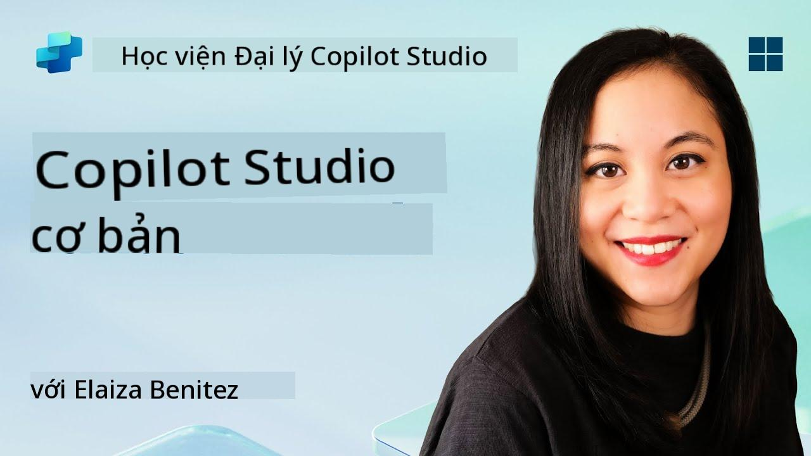
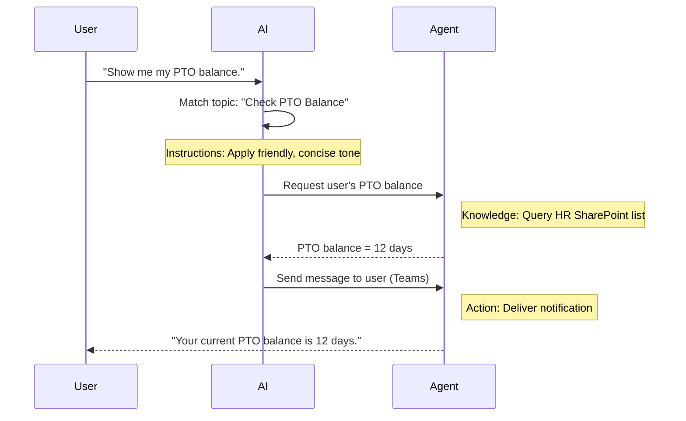

<!--
CO_OP_TRANSLATOR_METADATA:
{
  "original_hash": "90a3c5122f5687bbc8cc819990f175d4",
  "translation_date": "2025-10-20T00:54:17+00:00",
  "source_file": "docs/recruit/02-copilot-studio-fundamentals/README.md",
  "language_code": "vi"
}
-->
# 🚨 Nhiệm vụ 02: Kiến thức cơ bản về Copilot Studio

## 🕵️‍♂️ MẬT DANH: `CHIẾN DỊCH GIAO THỨC CỐT LÕI`

> **⏱️ Thời gian thực hiện chiến dịch:** `~30 phút – chỉ thu thập thông tin, không cần thực địa`  

🎥 **Xem video hướng dẫn**

[](https://www.youtube.com/watch?v=x4OCwDRGeLE "Xem video hướng dẫn trên YouTube")

## 🎯 Tóm tắt nhiệm vụ

Chào mừng, Tân binh. Nhiệm vụ này sẽ cung cấp cho bạn thông tin cơ bản để hiểu cách hoạt động của Copilot Studio và cách xây dựng các tác nhân thông minh mang lại giá trị thực sự cho doanh nghiệp.

Trước khi xây dựng tác nhân đầu tiên của bạn, bạn cần hiểu bốn thành phần chính tạo nên mỗi tác nhân AI tùy chỉnh: Kiến thức, Công cụ, Chủ đề và Hướng dẫn. Bạn cũng sẽ học cách các yếu tố này hoạt động cùng nhau trong bộ điều phối của Copilot Studio.

## 🔎 Mục tiêu

Trong nhiệm vụ này, bạn sẽ:

- **Tìm hiểu Copilot Studio là gì**  
- **Tìm hiểu khi nào và tại sao nên sử dụng các tác nhân**  
- **Khám phá bốn khối xây dựng của các tác nhân**  
      - **Kiến thức**  
      - **Công cụ**  
      - **Chủ đề**  
      - **Hướng dẫn**  
- **Hiểu cách các thành phần này hoạt động cùng nhau** để tạo ra một tác nhân thông minh, tự động

---

## Tác nhân trong Copilot Studio là gì?

Một **tác nhân** là một trợ lý AI chuyên biệt mà bạn thiết kế để xử lý các nhiệm vụ hoặc câu hỏi cụ thể. Không giống như chatbot đa năng, tác nhân của bạn:

- **Hiểu dữ liệu cụ thể của công ty** (chính sách, tài liệu, cơ sở dữ liệu)  
- **Thực hiện các nhiệm vụ thực tế** (gửi tin nhắn, tạo sự kiện lịch, cập nhật hồ sơ)  
- **Duy trì ngữ cảnh hội thoại** để có thể tiếp tục từ các câu hỏi trước đó  

Vì Copilot Studio là nền tảng low-code, bạn có thể kéo và thả các thành phần được xây dựng sẵn—không cần kỹ năng lập trình chuyên sâu. Sau khi tác nhân của bạn được xây dựng, mọi người có thể sử dụng nó trong Teams, Slack, hoặc thậm chí trên một trang web tùy chỉnh để nhận câu trả lời hoặc kích hoạt các quy trình làm việc tự động.

---

## Khi nào và tại sao nên sử dụng Copilot Studio

Trong khi Microsoft 365 Copilot cung cấp hỗ trợ AI chung cho các ứng dụng Office, bạn sẽ cần một tác nhân tùy chỉnh khi:

### Bạn cần kiến thức chuyên ngành

- Copilot mặc định có thể không biết các quy trình nội bộ hoặc dữ liệu của công ty bạn. Một tác nhân có thể truy vấn các trang SharePoint, cơ sở dữ liệu hoặc các nguồn tùy chỉnh để cung cấp câu trả lời chính xác, cập nhật.  

### Bạn muốn tự động hóa các quy trình nhiều bước

- Ví dụ: "Khi ai đó gửi yêu cầu chi tiêu, hãy gửi yêu cầu phê duyệt, cập nhật trình theo dõi tài chính và thông báo cho quản lý." Một tác nhân tùy chỉnh có thể xử lý mọi bước, được kích hoạt bởi một lệnh hoặc sự kiện duy nhất.  

### Bạn cần trải nghiệm ngữ cảnh trong công cụ  

- Hãy tưởng tượng một tác nhân Hướng dẫn Nhân viên Mới trong Teams, hướng dẫn nhân viên HR qua từng chính sách, gửi các biểu mẫu cần thiết và lên lịch các cuộc họp định hướng—ngay trong nền tảng cộng tác hiện có của bạn.  

---

## Bốn khối xây dựng của một tác nhân

Mỗi tác nhân trong Copilot Studio được xây dựng từ bốn thành phần cốt lõi:

1. **Kiến thức**  
1. **Công cụ (Hành động)**  
1. **Chủ đề**  
1. **Hướng dẫn**

Dưới đây, chúng ta sẽ định nghĩa từng khối xây dựng và chỉ ra cách chúng hoạt động cùng nhau để tạo ra một tác nhân hiệu quả.

### 1. Kiến thức

**Kiến thức** là dữ liệu và ngữ cảnh mà tác nhân của bạn sử dụng để trả lời câu hỏi một cách chính xác. Nó có hai phần:

#### Hướng dẫn & Ngữ cảnh Tùy chỉnh

- Bạn viết một mô tả ngắn gọn về mục đích và phong cách của tác nhân. Ví dụ:  

    ```text
    You are an IT support agent. You help employees troubleshoot common software issues, provide troubleshooting steps, and escalate urgent tickets.
    ```

- Trong một cuộc hội thoại, tác nhân nhớ các lượt trước đó để có thể tham chiếu lại những gì đã được thảo luận (ví dụ, nếu người dùng ban đầu nói, "Máy in của tôi không hoạt động," sau đó hỏi, "Bạn đã kiểm tra mức mực chưa?" thì tác nhân sẽ nhớ ngữ cảnh về máy in).

#### Nguồn Kiến thức (Dữ liệu Nền tảng)

- Bạn kết nối tác nhân của mình với nhiều nguồn dữ liệu—thư viện SharePoint, trang tài liệu, wiki hoặc các cơ sở dữ liệu khác.  
- Khi người dùng đặt câu hỏi, tác nhân sẽ trích xuất các đoạn thông tin liên quan từ các nguồn đó để câu trả lời **dựa trên** chính sách, hướng dẫn sản phẩm hoặc bất kỳ thông tin độc quyền nào của tổ chức bạn.  
- Bạn thậm chí có thể yêu cầu tác nhân chỉ trả lời dựa trên thông tin từ các nguồn đó, ngăn chặn việc đoán hoặc "bịa đặt" câu trả lời.

!!! example
    Một tác nhân "Trợ lý Chính sách" có thể kết nối với trang SharePoint của HR. Nếu người dùng hỏi, "Tỷ lệ tích lũy PTO của chúng tôi là bao nhiêu?" tác nhân sẽ lấy chính xác văn bản từ tài liệu chính sách HR thay vì dựa vào câu trả lời AI chung chung.

---

### 2. Công cụ (Hành động)

**Công cụ (Hành động)** xác định những gì tác nhân có thể làm ngoài việc trò chuyện. Mỗi hành động là một nhiệm vụ mà tác nhân thực hiện theo cách lập trình, chẳng hạn như:

- Gửi email hoặc tin nhắn Teams  
- Tạo hoặc cập nhật sự kiện lịch  
- Thêm hoặc chỉnh sửa hồ sơ trong cơ sở dữ liệu (ví dụ: danh sách SharePoint hoặc bảng Dataverse)  
- Gọi luồng Power Automate hoặc REST API  

#### Cách Hành động Hoạt động

- **Xác định Đầu vào & Đầu ra**  
      - Ví dụ, một hành động Gửi Email có thể yêu cầu:  
        - `RecipientEmailAddress`  
        - `SubjectLine`  
        - `EmailBody`  

- **Kết hợp Hành động thành Quy trình làm việc**  
      - Thường thì việc thực hiện yêu cầu của người dùng liên quan đến nhiều bước.  
      - Bạn có thể sắp xếp các hành động để:  
             1. Tác nhân lấy dữ liệu từ danh sách SharePoint.  
             2. Nó tạo một bản tóm tắt bằng LLM.  
             3. Nó gửi một tin nhắn Teams với bản tóm tắt đó.  

- **Kết nối với Hệ thống Bên ngoài**  
      - Nếu bạn cần cập nhật CRM hoặc gọi một API nội bộ, hãy tạo một hành động tùy chỉnh để xử lý điều đó.  
      - Copilot Studio có thể tích hợp với Power Platform hoặc bất kỳ điểm cuối HTTP nào.

!!! example "Một tác nhân "Trợ lý Chi tiêu" có thể:"  
    1. Lắng nghe yêu cầu "Gửi Chi tiêu".  
    2. Lấy chi tiết chi tiêu của người dùng từ một biểu mẫu.  
    3. Sử dụng hành động "Thêm vào Danh sách SharePoint" để lưu trữ dữ liệu.  
    4. Kích hoạt hành động "Gửi Email" để thông báo cho người phê duyệt.  

---

### 3. Chủ đề

**Chủ đề** xác định các kích hoạt hội thoại hoặc điểm bắt đầu cho tác nhân của bạn. Mỗi chủ đề tương ứng với một phần chức năng hoặc một danh mục câu hỏi.

#### Kích hoạt Hội thoại  

- Một chủ đề có thể là "Gửi Yêu cầu IT," "Kiểm tra Số Dư Nghỉ Phép," hoặc "Tạo Báo Cáo Bán Hàng."  
- Bên trong, Copilot Studio sử dụng **điều phối tạo nội dung**: thay vì dựa vào từ khóa chính xác, AI sẽ diễn giải ý định của người dùng và chọn chủ đề phù hợp dựa trên mô tả ngắn gọn mà bạn cung cấp.  

#### Mô tả Chủ đề  

- Trong mỗi chủ đề, bạn viết một mô tả rõ ràng, ngắn gọn về nội dung mà chủ đề đó bao gồm.

!!! example "Ví dụ về mô tả chủ đề"
    Chủ đề này giúp người dùng gửi yêu cầu hỗ trợ IT bằng cách thu thập chi tiết vấn đề, mức độ ưu tiên và thông tin liên hệ.

- AI sử dụng mô tả đó để quyết định khi nào kích hoạt chủ đề này, ngay cả khi cách diễn đạt của người dùng không hoàn toàn khớp.

#### Liên kết Chủ đề với Hành động  

- Mỗi chủ đề được kết nối với một hoặc nhiều hành động hoặc bước truy xuất dữ liệu.  
- Khi AI chọn một chủ đề, nó sẽ hướng dẫn cuộc hội thoại qua trình tự bạn đã định nghĩa (hỏi các câu hỏi tiếp theo, gọi hành động, trả kết quả).

!!! example
    Nếu người dùng nói, "Tôi cần giúp đỡ để thiết lập máy tính xách tay mới của mình," AI có thể khớp ý định đó với chủ đề "Gửi Yêu cầu IT." Sau đó, tác nhân sẽ hỏi về mẫu máy tính xách tay, chi tiết người dùng và tự động gửi yêu cầu vào hệ thống hỗ trợ.

---

### 4. Hướng dẫn

**Hướng dẫn** (đôi khi được gọi là "Lời nhắc" hoặc "Thông điệp Hệ thống") định hình phong cách, giọng điệu và giới hạn của LLM. Chúng định hướng cách tác nhân phản hồi trong mọi tình huống.

#### Vai trò & Nhân vật  

- Bạn nói cho AI biết nó là ai (ví dụ: "Bạn là một nhân viên hỗ trợ khách hàng cho Contoso Retail").  
- Điều này thiết lập giọng điệu—thân thiện, ngắn gọn, trang trọng hoặc thoải mái—tùy thuộc vào trường hợp sử dụng của bạn.

#### Hướng dẫn Phản hồi  

- Chỉ định bất kỳ quy tắc nào mà tác nhân phải tuân theo, chẳng hạn như:  
      - "Luôn tóm tắt thông tin chính sách dưới dạng gạch đầu dòng."  
      - "Nếu bạn không biết câu trả lời, hãy nói ‘Xin lỗi, tôi không có thông tin đó.’"  
      - "Không bao giờ bao gồm dữ liệu bảo mật ngoài ngữ cảnh."

#### Quy tắc Bộ nhớ & Ngữ cảnh

- Bạn có thể hướng dẫn tác nhân nhớ bao nhiêu lượt hội thoại.  
- Ví dụ: "Nhớ chi tiết từ các yêu cầu của người dùng này trong tối đa ba câu hỏi tiếp theo."

!!! example "Trong một tác nhân "Cố vấn Phúc lợi," bạn có thể bao gồm:"
    "Luôn tham khảo sổ tay HR mới nhất khi trả lời câu hỏi. Nếu được hỏi về thời hạn đăng ký, cung cấp các ngày cụ thể từ chính sách. Giữ câu trả lời dưới 150 từ."

---

## Cách bốn khối xây dựng hoạt động cùng nhau

Khi bạn kết hợp **Kiến thức**, **Công cụ**, **Chủ đề**, và **Hướng dẫn**, bộ điều phối AI của Copilot Studio sẽ tạo ra một tác nhân có khả năng:

1. **Lắng nghe một Chủ đề liên quan** (được hướng dẫn bởi các mô tả chủ đề của bạn).  
1. **Áp dụng Hướng dẫn** để thiết lập giọng điệu, quyết định khi nào hỏi các câu hỏi tiếp theo và thực thi các quy tắc.  
1. **Sử dụng Nguồn Kiến thức** để dựa vào dữ liệu của tổ chức bạn để trả lời.  
1. **Gọi Công cụ (Hành động)** khi cần để thực hiện các nhiệm vụ—gửi tin nhắn, cập nhật hồ sơ, hoặc gọi API.  

Bên trong, bộ điều phối sử dụng cách tiếp cận **lập kế hoạch tạo nội dung**: nó quyết định các bước cần thực hiện, theo thứ tự nào, để đáp ứng yêu cầu của người dùng. Nếu một hành động thất bại (ví dụ, email không thể gửi), tác nhân sẽ tuân theo các hướng dẫn xử lý ngoại lệ của bạn (hỏi một câu hỏi làm rõ hoặc báo cáo lỗi). Vì LLM thích nghi với ngữ cảnh hội thoại, tác nhân có thể duy trì bộ nhớ qua nhiều lượt và tích hợp thông tin mới khi cuộc hội thoại diễn ra.

**Ví dụ về luồng trực quan:**  
<!--
1. **Người dùng:** "Hiển thị số dư PTO của tôi."
1. **AI (Chủ đề):** Khớp với chủ đề "Kiểm tra Số Dư PTO."  
1. **AI (Hướng dẫn):** Sử dụng giọng điệu thân thiện, ngắn gọn.  
1. **Tác nhân (Kiến thức):** Truy vấn danh sách SharePoint HR để lấy số dư của người dùng.  
1. **Tác nhân (Hành động):** Lấy giá trị và gửi tin nhắn Teams:  
   > "Số dư PTO hiện tại của bạn là 12 ngày."  
-->



---

## 🎉 Hoàn thành nhiệm vụ

Bạn đã hoàn thành thành công buổi hướng dẫn cơ bản. Bạn đã học được bốn khối xây dựng thiết yếu của bất kỳ tác nhân nào trong Copilot Studio:

1. **Kiến thức** – Nơi tác nhân tra cứu thông tin thực tế và duy trì bộ nhớ hội thoại.  
1. **Công cụ** – Các nhiệm vụ mà tác nhân có thể thực hiện để tự động hóa công việc.  
1. **Chủ đề** – Cách tác nhân nhận biết ý định của người dùng và quyết định quy trình làm việc nào sẽ thực hiện.  
1. **Hướng dẫn** – Các quy tắc, giọng điệu và giới hạn định hướng mọi phản hồi.

Với các thành phần này, bạn có thể xây dựng một tác nhân cơ bản để trả lời câu hỏi và thực hiện các quy trình làm việc đơn giản. Trong bài học tiếp theo, chúng ta sẽ hướng dẫn từng bước để tạo một tác nhân "Dịch vụ Hỗ trợ"—từ việc kết nối nguồn kiến thức đầu tiên đến việc định nghĩa một chủ đề và liên kết một hành động.

Tiếp theo: Bạn sẽ xây dựng [tác nhân khai báo đầu tiên cho M365 Copilot](../03-create-a-declarative-agent-for-M365Copilot/README.md).

<!-- markdownlint-disable-next-line MD033 -->


---

**Tuyên bố miễn trừ trách nhiệm**:  
Tài liệu này đã được dịch bằng dịch vụ dịch thuật AI [Co-op Translator](https://github.com/Azure/co-op-translator). Mặc dù chúng tôi cố gắng đảm bảo độ chính xác, xin lưu ý rằng các bản dịch tự động có thể chứa lỗi hoặc không chính xác. Tài liệu gốc bằng ngôn ngữ bản địa nên được coi là nguồn thông tin chính thức. Đối với thông tin quan trọng, nên sử dụng dịch vụ dịch thuật chuyên nghiệp bởi con người. Chúng tôi không chịu trách nhiệm về bất kỳ sự hiểu lầm hoặc diễn giải sai nào phát sinh từ việc sử dụng bản dịch này.