<!--
CO_OP_TRANSLATOR_METADATA:
{
  "original_hash": "0c51aabca81d6256990caf4c015e6195",
  "translation_date": "2025-10-20T00:45:34+00:00",
  "source_file": "docs/recruit/04-creating-a-solution/README.md",
  "language_code": "vi"
}
-->
# 🚨 Nhiệm vụ 04: Tạo Giải pháp cho Agent của bạn

## 🕵️‍♂️ MẬT DANH: `CHIẾN DỊCH CTRL-ALT-PACKAGE`

> **⏱️ Thời gian thực hiện nhiệm vụ:** `~45 phút`

🎥 **Xem video hướng dẫn**

[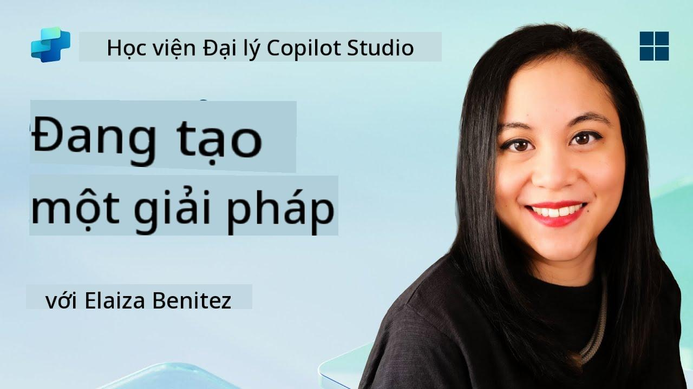](https://www.youtube.com/watch?v=1iATbkgfcpU "Xem video hướng dẫn trên YouTube")

## 🎯 Tóm tắt nhiệm vụ

Nhà sáng tạo Agent, chào mừng bạn đến với nhiệm vụ chiến thuật tiếp theo. Trong nhiệm vụ này, bạn sẽ học cách lắp ráp một Giải pháp - phương tiện triển khai chính thức cho Agent hỗ trợ IT của bạn được xây dựng với Microsoft Copilot Studio. Hãy nghĩ về điều này như việc tạo ra một chiếc cặp kỹ thuật số chứa Agent của bạn và các thành phần của nó.

Mỗi Agent cần một ngôi nhà được tổ chức tốt. Đó chính là điều mà giải pháp Power Platform cung cấp - sự sắp xếp, tính di động và sự sẵn sàng cho sản xuất.

Hãy bắt đầu đóng gói nào.

## 🔎 Mục tiêu

Trong nhiệm vụ này, bạn sẽ học:

1. Hiểu về giải pháp Power Platform và vai trò của nó trong việc phát triển Agent
1. Tìm hiểu lợi ích của việc sử dụng giải pháp để tổ chức và triển khai Agent
1. Khám phá các nhà xuất bản giải pháp và tầm quan trọng của chúng trong quản lý thành phần
1. Hiểu vòng đời của giải pháp Power Platform từ phát triển đến sản xuất
1. Tạo nhà xuất bản giải pháp và giải pháp tùy chỉnh cho Agent hỗ trợ IT của bạn

## 🕵🏻‍♀️ Giải pháp? Là gì vậy?

Trong Microsoft Power Platform, giải pháp giống như các container hoặc gói chứa tất cả các phần của ứng dụng hoặc Agent của bạn - có thể là bảng, biểu mẫu, luồng, và logic tùy chỉnh. Giải pháp rất quan trọng đối với Quản lý Vòng đời Ứng dụng (ALM), cho phép bạn quản lý ứng dụng và Agent từ ý tưởng đến phát triển, kiểm thử, triển khai và cập nhật.

Trong Copilot Studio, mỗi Agent bạn tạo đều được lưu trữ trong một giải pháp Power Platform. Theo mặc định, các Agent được tạo trong giải pháp Mặc định, trừ khi bạn tạo một giải pháp tùy chỉnh mới để tạo Agent của mình. Đây là điều chúng ta sẽ học 🤓 trong bài học này và trong phòng thí nghiệm thực hành.

Các giải pháp truyền thống thường được tạo trong **cổng nhà sáng tạo Power Apps** - một giao diện web nơi bạn có thể xây dựng và tùy chỉnh ứng dụng, Dataverse, luồng, khám phá các thành phần AI và nhiều hơn nữa.

   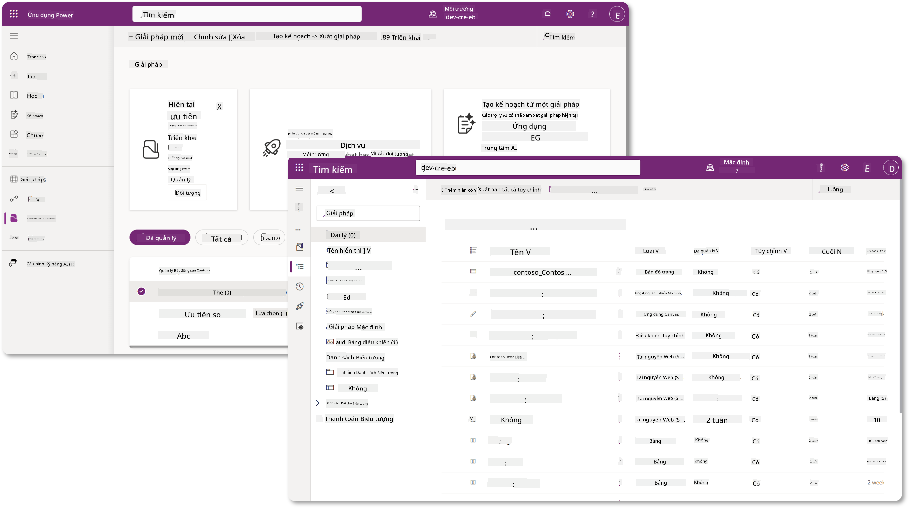

Trong Copilot Studio, hiện đã có **Trình khám phá giải pháp** nơi bạn có thể quản lý các giải pháp của mình trực tiếp. Bạn không cần phải chuyển sang cổng nhà sáng tạo Power Apps để quản lý các giải pháp, mọi thứ đều có thể thực hiện ngay trong Copilot Studio 🪄

Điều này có nghĩa là bạn có thể thực hiện các nhiệm vụ liên quan đến giải pháp thông thường:

- **Tạo giải pháp** - các giải pháp tùy chỉnh cho phép các Agent được xuất và nhập giữa các môi trường.
- **Đặt giải pháp ưa thích của bạn** - chọn giải pháp mà các Agent, ứng dụng, v.v. sẽ được tạo mặc định.
- **Thêm hoặc xóa các thành phần** - Agent của bạn có thể tham chiếu các thành phần khác như biến môi trường hoặc luồng đám mây. Do đó, các thành phần này cần được bao gồm trong giải pháp.
- **Xuất giải pháp** - để di chuyển giải pháp sang môi trường mục tiêu khác.
- **Nhập giải pháp** - nhập các giải pháp được tạo ở nơi khác, bao gồm cả việc nâng cấp hoặc cập nhật giải pháp.
- **Tạo và quản lý các pipeline giải pháp** - tự động hóa việc triển khai các giải pháp giữa các môi trường.
- **Tích hợp Git** - cho phép các nhà phát triển kết nối các giải pháp với kho Git để kiểm soát phiên bản, hợp tác và ALM. Dành riêng cho các môi trường phát triển.

   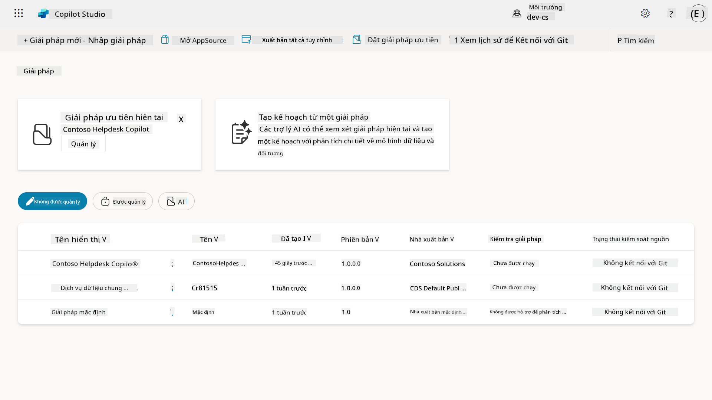

Có hai loại giải pháp:

- **Giải pháp chưa quản lý** - được sử dụng trong quá trình phát triển. Bạn có thể tự do chỉnh sửa và tùy chỉnh theo nhu cầu.
- **Giải pháp đã quản lý** - được sử dụng khi bạn sẵn sàng triển khai ứng dụng của mình để kiểm thử hoặc sản xuất. Những giải pháp này bị khóa để ngăn chặn các thay đổi không mong muốn.

## 🤔 Tại sao _nên_ sử dụng Giải pháp cho Agent của tôi?

Hãy nghĩ về Giải pháp như một _hộp công cụ_. Khi bạn cần sửa chữa hoặc xây dựng một thứ gì đó (Agent) ở một địa điểm khác (môi trường), bạn tập hợp tất cả các công cụ cần thiết (thành phần) và đặt chúng vào hộp công cụ của mình (Giải pháp). Sau đó, bạn có thể mang hộp công cụ này đến địa điểm mới (môi trường) và sử dụng các công cụ (thành phần) để hoàn thành công việc, hoặc thêm các công cụ mới (thành phần) để tùy chỉnh Agent hoặc dự án mà bạn đang xây dựng.

!!! quote "Elaiza, người ủng hộ đám mây thân thiện của bạn đang ghé qua đây 🙋🏻‍♀️ để chia sẻ vài lời:"
    Chúng tôi có một câu nói ở New Zealand, "Hãy là một Kiwi gọn gàng!" - một lời kêu gọi hành động cho người dân New Zealand 🥝 để chịu trách nhiệm về môi trường của họ bằng cách vứt rác đúng cách và giữ cho không gian công cộng sạch sẽ. Chúng ta có thể áp dụng cùng một ngữ cảnh cho các Agent bằng cách giữ mọi thứ liên quan đến Agent của bạn được tổ chức và di động, điều này sẽ giúp bạn duy trì một môi trường gọn gàng.

Việc tạo một Agent trong một giải pháp riêng biệt trong môi trường nguồn (phát triển) là một thói quen tốt. Dưới đây là lý do tại sao giải pháp có giá trị:

🧩 **Phát triển có tổ chức**

- Bạn giữ Agent của mình tách biệt khỏi giải pháp Mặc định, nơi chứa mọi thứ trong môi trường. Tất cả các thành phần của Agent của bạn đều nằm trong một nơi 🎯

- Mọi thứ bạn cần cho Agent của mình đều nằm trong một giải pháp, giúp việc xuất và nhập sang môi trường mục tiêu dễ dàng hơn 👉🏻 đây là một thói quen lành mạnh của ALM.

🧩 **Triển khai an toàn**

- Bạn có thể xuất ứng dụng hoặc Agent của mình dưới dạng giải pháp đã quản lý và triển khai nó sang các môi trường mục tiêu khác (chẳng hạn như kiểm thử hoặc sản xuất) mà không lo rủi ro chỉnh sửa không mong muốn.

🧩 **Kiểm soát phiên bản**

- Bạn có thể tạo các bản vá (sửa lỗi mục tiêu), cập nhật (thay đổi toàn diện hơn) hoặc nâng cấp (thay thế giải pháp - thường là thay đổi lớn và giới thiệu các tính năng mới).

- Giúp bạn triển khai các thay đổi một cách có kiểm soát.

🧩 **Quản lý phụ thuộc**

- Giải pháp theo dõi các phần nào phụ thuộc vào nhau. Điều này ngăn bạn làm hỏng các phần khi thực hiện thay đổi.

🧩 **Hợp tác nhóm**

- Các nhà phát triển và nhà sáng tạo có thể làm việc cùng nhau bằng cách sử dụng các giải pháp chưa quản lý trong quá trình phát triển, sau đó chuyển giao một giải pháp đã quản lý để triển khai.

## 🪪 Hiểu về Nhà xuất bản Giải pháp

Nhà xuất bản Giải pháp trong Power Platform giống như một nhãn hoặc thương hiệu xác định ai đã tạo hoặc sở hữu giải pháp. Đây là một phần nhỏ nhưng quan trọng trong việc quản lý ứng dụng, Agent và tùy chỉnh luồng của bạn, đặc biệt khi làm việc trong nhóm hoặc giữa các môi trường.

Khi bạn tạo một giải pháp, bạn phải chọn một nhà xuất bản. Nhà xuất bản này xác định:

- Một tiền tố được thêm vào tất cả các thành phần tùy chỉnh (như bảng, trường và luồng).

- Tên và thông tin liên hệ của tổ chức hoặc cá nhân sở hữu giải pháp.

### 🤔 Tại sao điều này quan trọng?

1. **Dễ dàng nhận diện** - tiền tố (Ví dụ - `new_` hoặc `abc_`) giúp bạn nhanh chóng nhận diện các thành phần thuộc về giải pháp hoặc nhóm nào.

1. **Tránh xung đột** - nếu hai nhóm tạo một cột có tên trạng thái, tiền tố của họ (`teamA_status`, `teamB_status`) sẽ ngăn chặn xung đột tên.

1. **Hỗ trợ ALM** - khi di chuyển giải pháp giữa các môi trường (Phát triển → Kiểm thử → Sản xuất), nhà xuất bản giúp theo dõi quyền sở hữu và duy trì tính nhất quán.

### ✨ Ví dụ

Giả sử bạn tạo một nhà xuất bản có tên Contoso Solutions với tiền tố `cts_`.

Nếu bạn thêm một cột tùy chỉnh có tên _Priority_, nó sẽ được lưu trữ dưới dạng `cts_Priority` trong giải pháp.

Bất kỳ ai gặp cột này ở cấp độ giải pháp, bất kể họ đang ở môi trường nào, đều có thể dễ dàng nhận diện nó là một cột liên quan đến Contoso Solutions.

## 🧭 Vòng đời Giải pháp Power Platform

Bây giờ bạn đã hiểu mục đích của Giải pháp, hãy tiếp tục tìm hiểu về vòng đời của nó.

**1. Tạo Giải pháp trong môi trường Phát triển** - bắt đầu bằng cách tạo một giải pháp mới trong môi trường Phát triển của bạn.

**2. Thêm Thành phần** - thêm ứng dụng, luồng, bảng và các yếu tố khác vào giải pháp của bạn.

**3. Xuất dưới dạng giải pháp đã quản lý** - đóng gói giải pháp của bạn để triển khai bằng cách xuất nó dưới dạng giải pháp đã quản lý.

**4. Nhập vào môi trường Kiểm thử** - kiểm thử giải pháp của bạn trong một môi trường Kiểm thử riêng biệt để đảm bảo mọi thứ hoạt động như mong đợi.

**5. Nhập vào môi trường Sản xuất** - triển khai giải pháp đã kiểm thử vào môi trường Sản xuất trực tiếp.

**6. Áp dụng Bản vá, Cập nhật hoặc Nâng cấp** - thực hiện cải tiến hoặc sửa lỗi bằng cách sử dụng bản vá, cập nhật hoặc nâng cấp. 🔁 Lặp lại chu trình!

### ✨ Ví dụ

Hãy tưởng tượng bạn đang xây dựng một Agent hỗ trợ IT để giúp nhân viên giải quyết các vấn đề như sự cố thiết bị, khắc phục sự cố mạng, cài đặt máy in và nhiều hơn nữa.

- Bạn bắt đầu trong môi trường Phát triển bằng cách sử dụng một giải pháp chưa quản lý.

- Khi đã sẵn sàng, bạn xuất nó dưới dạng giải pháp đã quản lý và nhập nó vào môi trường mục tiêu như Kiểm thử Hệ thống hoặc Kiểm thử Chấp nhận Người dùng (UAT).

- Sau khi kiểm thử, bạn chuyển nó sang môi trường Sản xuất - tất cả mà không chạm vào phiên bản phát triển ban đầu.

## 🧪 Phòng thí nghiệm 04: Tạo một Giải pháp mới

Bây giờ chúng ta sẽ học

- [4.1 Cách tạo nhà xuất bản Giải pháp](../../../../../docs/recruit/04-creating-a-solution)
- [4.2 Cách tạo một Giải pháp](../../../../../docs/recruit/04-creating-a-solution)

Chúng ta sẽ tiếp tục với ví dụ từ trước, nơi chúng ta sẽ tạo một giải pháp trong môi trường Copilot Studio chuyên dụng để xây dựng Agent hỗ trợ IT của mình.

Hãy bắt đầu!

### Yêu cầu trước

#### Vai trò bảo mật

Trong Copilot Studio, những gì bạn _có thể làm_ trong trình khám phá giải pháp phụ thuộc vào vai trò bảo mật người dùng của bạn. Nếu bạn không có quyền quản lý các giải pháp trong trung tâm quản trị Power Apps, bạn cũng sẽ không thể thực hiện các nhiệm vụ đó trong Copilot Studio.

Để đảm bảo mọi thứ hoạt động trơn tru, hãy kiểm tra xem bạn có đúng vai trò bảo mật và quyền hay không. Hoặc nếu bạn không quản lý các môi trường trong tổ chức của mình, hãy hỏi quản trị viên IT của bạn (hoặc đội ngũ tương đương) người quản lý tenant/môi trường của bạn.

Dưới đây là các vai trò bảo mật cho phép người dùng tạo một giải pháp trong môi trường của họ.

| Vai trò bảo mật    | Mô tả |
| ---------- | ---------- |
| Nhà sáng tạo môi trường | Cung cấp các quyền cần thiết để tạo, tùy chỉnh và quản lý tài nguyên trong một môi trường cụ thể, bao gồm các giải pháp  |
| Người tùy chỉnh hệ thống  | Quyền rộng hơn Nhà sáng tạo môi trường, bao gồm khả năng tùy chỉnh môi trường và quản lý vai trò bảo mật |
| Quản trị viên hệ thống   | Mức quyền cao nhất và có thể quản lý tất cả các khía cạnh của môi trường, bao gồm việc tạo và gán vai trò bảo mật     |

#### Môi trường phát triển

Hãy đảm bảo bạn chuyển sang môi trường phát triển chuyên dụng của mình, tham khảo [Bài học 00 - Thiết lập khóa học - Bước 3: Tạo môi trường phát triển mới](../00-course-setup/README.md#step-3-create-new-developer-environment).

1. Ở góc trên bên phải, chọn biểu tượng **Bánh răng** và chuyển từ môi trường mặc định sang môi trường của bạn, ví dụ **Môi trường của Adele Vance**.

    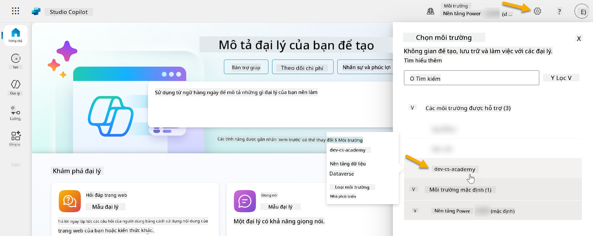

### 4.1 Tạo nhà xuất bản Giải pháp

1. Sử dụng cùng môi trường Copilot Studio đã sử dụng trong bài học trước, chọn biểu tượng **ba dấu chấm (. . .)** ở menu bên trái trong Copilot Studio. Chọn **Solutions** dưới tiêu đề **Explore**.

    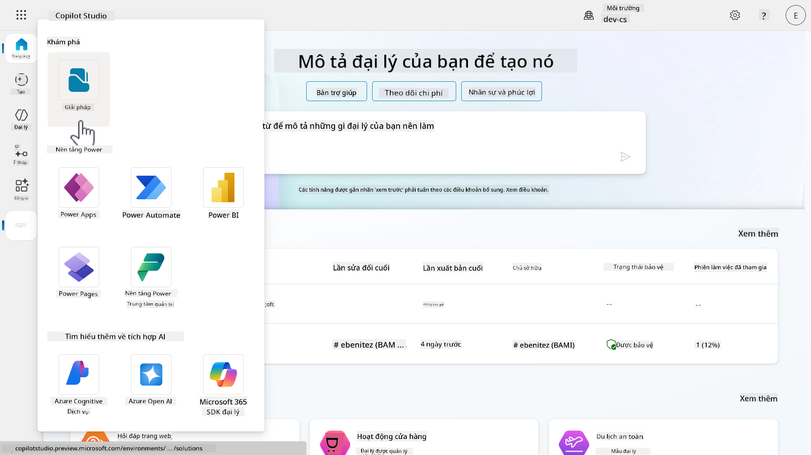

1. Trình **Solution Explorer** trong Copilot Studio sẽ tải. Chọn **+ New solution**

    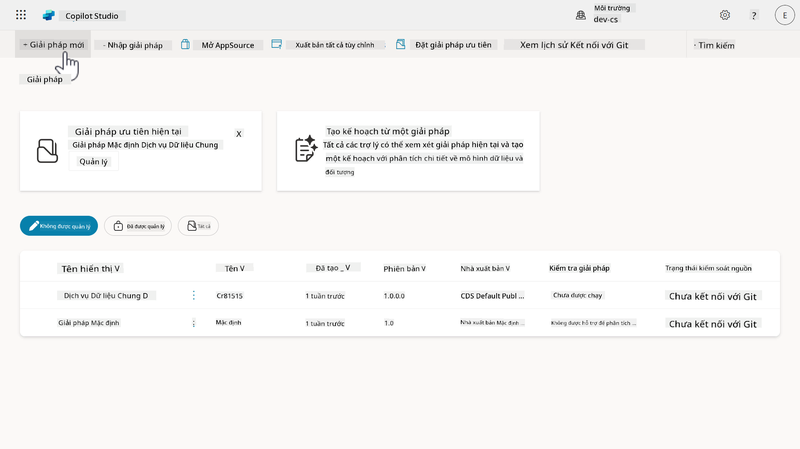

1. Bảng **New solution** sẽ xuất hiện nơi chúng ta có thể định nghĩa chi tiết cho giải pháp của mình. Đầu tiên, chúng ta cần tạo một nhà xuất bản mới. Chọn **+ New publisher**.

    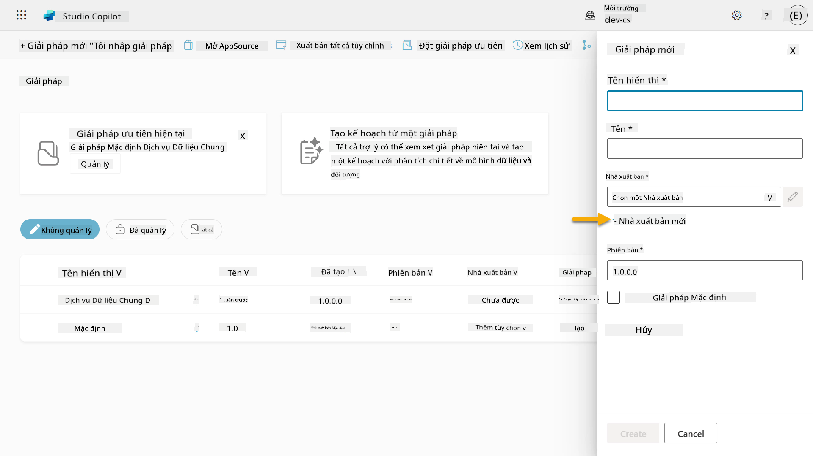  

1. Tab **Properties** của bảng **New publisher** sẽ xuất hiện với các trường bắt buộc và không bắt buộc cần được điền trong tab **Properties**. Đây là nơi chúng ta có thể phác thảo chi tiết của nhà xuất bản sẽ được sử dụng như nhãn hoặc thương hiệu xác định ai đã tạo hoặc sở hữu giải pháp.

    | Thuộc tính    | Mô tả | Bắt buộc |
    | ---------- | ---------- | :----------: |
    | Tên hiển thị | Tên hiển thị cho nhà xuất bản | Có   |
    | Tên  | Tên duy nhất và tên schema cho nhà xuất bản  | Có    |
    | Mô tả   | Phác thảo mục đích của giải pháp    | Không     |
    | Tiền tố    | Tiền tố nhà xuất bản sẽ được áp dụng cho các thành phần mới được tạo   | Có      |
    | Tiền tố giá trị lựa chọn   | Tạo một số dựa trên tiền tố nhà xuất bản. Số này được sử dụng khi bạn thêm tùy chọn vào các lựa chọn và cung cấp một chỉ báo về giải pháp nào đã được sử dụng để thêm tùy chọn.   | Có      |

    Sao chép và dán nội dung sau làm **Tên hiển thị**,

    ```text
    Contoso Solutions
    ```

    Sao chép và dán nội dung sau làm **Tên**,

    ```text
    ContosoSolutions
    ```

    Sao chép và dán nội dung sau làm **Mô tả**,

    ```text
    Copilot Studio Agent Academy
    ```

    Sao chép và dán nội dung sau cho **Tiền tố**,

    ```text
    cts
    ```

    Theo mặc định, tiền tố **Giá trị lựa chọn** sẽ hiển thị một giá trị số nguyên. Cập nhật giá trị số nguyên này lên gần nhất với hàng nghìn. Ví dụ, trong ảnh chụp màn hình của tôi bên dưới, ban đầu là `77074`. Cập nhật từ `77074` thành `77000`.

    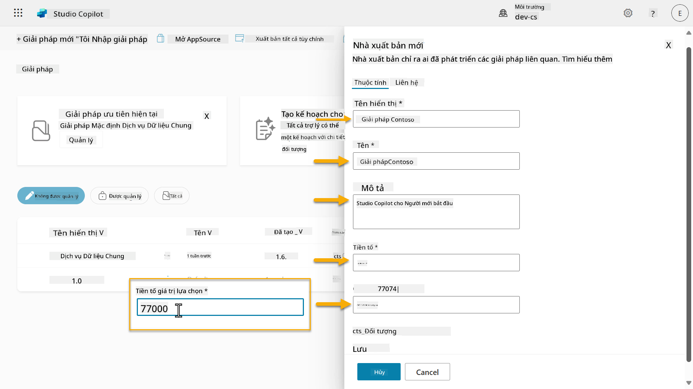  

1. Nếu bạn muốn cung cấp thông tin liên hệ cho Giải pháp, chọn tab **Contact** và điền các cột hiển thị.

    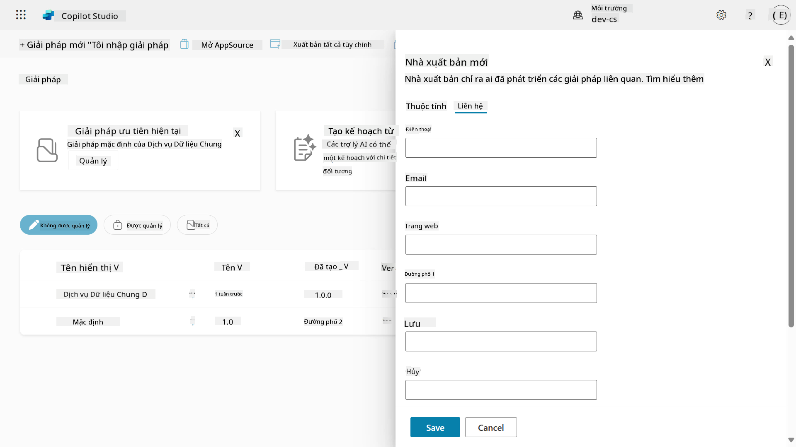

1. Chọn tab **Properties** và chọn **Save** để tạo Nhà xuất bản.

    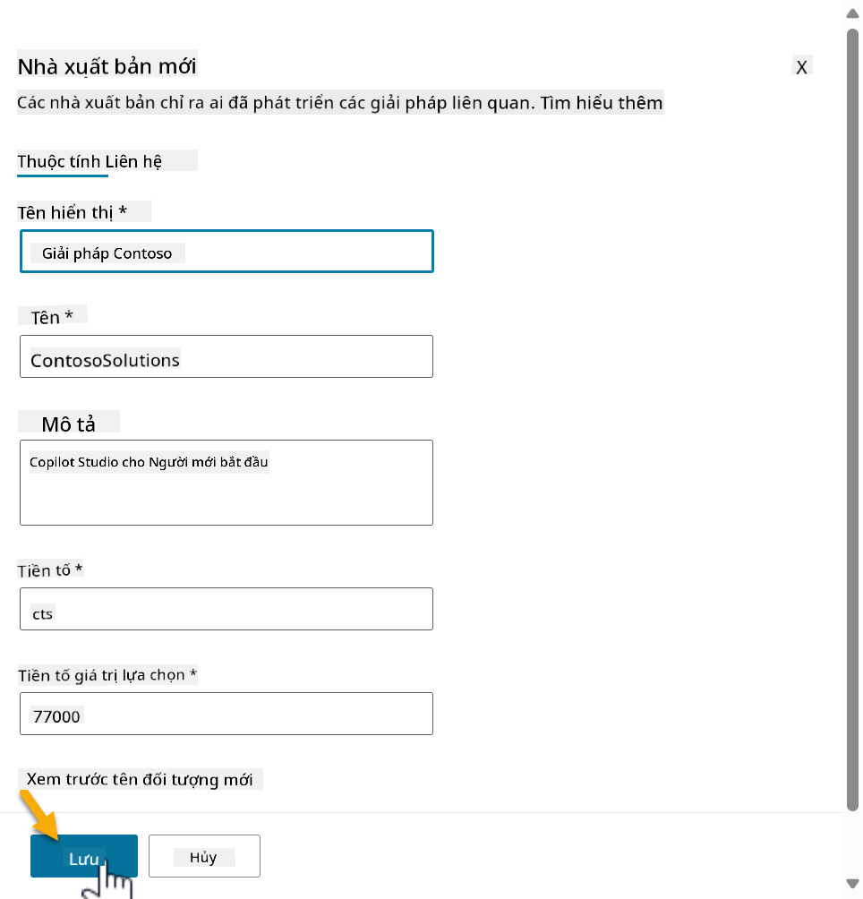
1. Bảng điều khiển Nhà xuất bản mới sẽ đóng lại và bạn sẽ được đưa trở lại bảng điều khiển **Giải pháp mới** với Nhà xuất bản vừa tạo được chọn.

    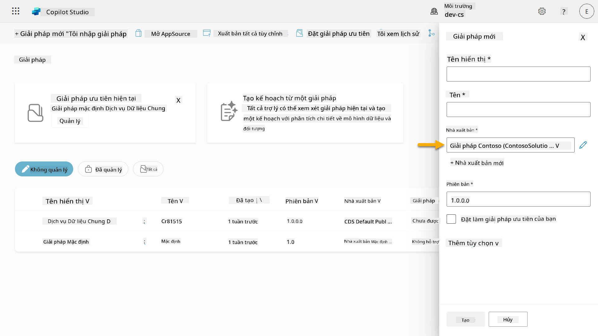  

Tuyệt vời, bạn đã tạo xong Nhà xuất bản Giải pháp! 🙌🏻 Tiếp theo, chúng ta sẽ học cách tạo một giải pháp tùy chỉnh mới.

### 4.2 Tạo một Giải pháp mới

1. Bây giờ chúng ta đã tạo xong các giải pháp, hãy hoàn thành phần còn lại của biểu mẫu trong bảng điều khiển **Giải pháp mới**.

    Sao chép và dán nội dung sau làm **Tên hiển thị**,

    ```text
    Contoso Helpdesk Agent
    ```

    Sao chép và dán nội dung sau làm **Tên**,

    ```text
    ContosoHelpdeskAgent
    ```

    Vì chúng ta đang tạo một giải pháp mới, [**Số phiên bản**](https://learn.microsoft.com/power-apps/maker/data-platform/update-solutions#understanding-version-numbers-for-updates/?WT.mc_id=power-172615-ebenitez) mặc định sẽ là `1.0.0.0`.

    Tích vào ô **Đặt làm giải pháp ưu tiên của bạn**.

    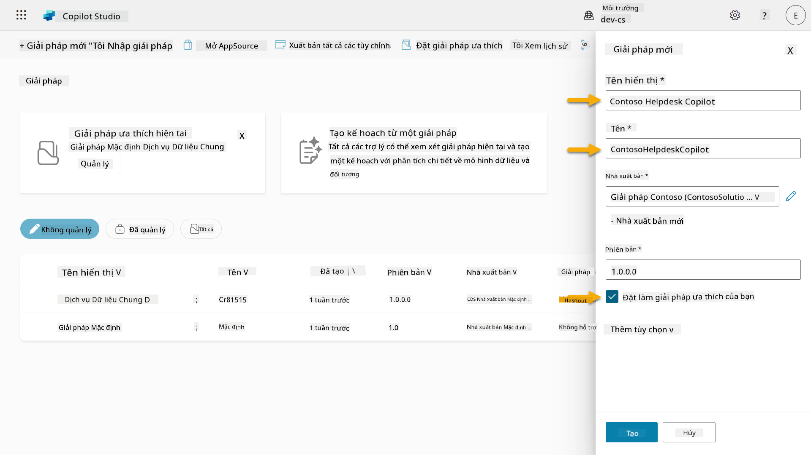  

1. Mở rộng **Thêm tùy chọn** để xem các chi tiết bổ sung có thể được cung cấp trong một giải pháp.

    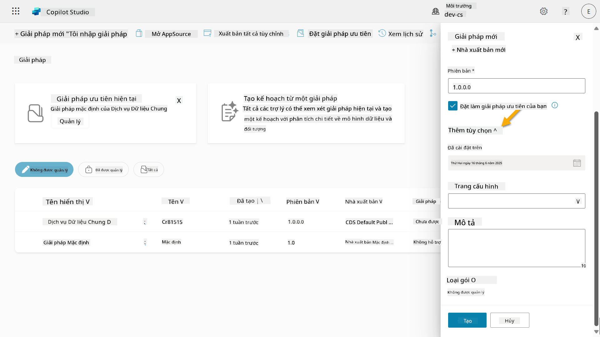

1. Bạn sẽ thấy các mục sau,

    - **Được cài đặt vào** - ngày mà Giải pháp được cài đặt.

    - **Trang cấu hình** - các nhà phát triển thiết lập một tài nguyên web HTML để giúp người dùng tương tác với ứng dụng, tác nhân hoặc công cụ của họ, nơi nó sẽ xuất hiện dưới dạng một trang web trong phần Thông tin với hướng dẫn hoặc nút. Nó chủ yếu được sử dụng bởi các công ty hoặc nhà phát triển xây dựng và chia sẻ giải pháp với người khác.

    - **Mô tả** - mô tả giải pháp hoặc mô tả tổng quan về trang cấu hình.

    Chúng ta sẽ để trống các mục này trong bài thực hành này.

    Chọn **Tạo**.

    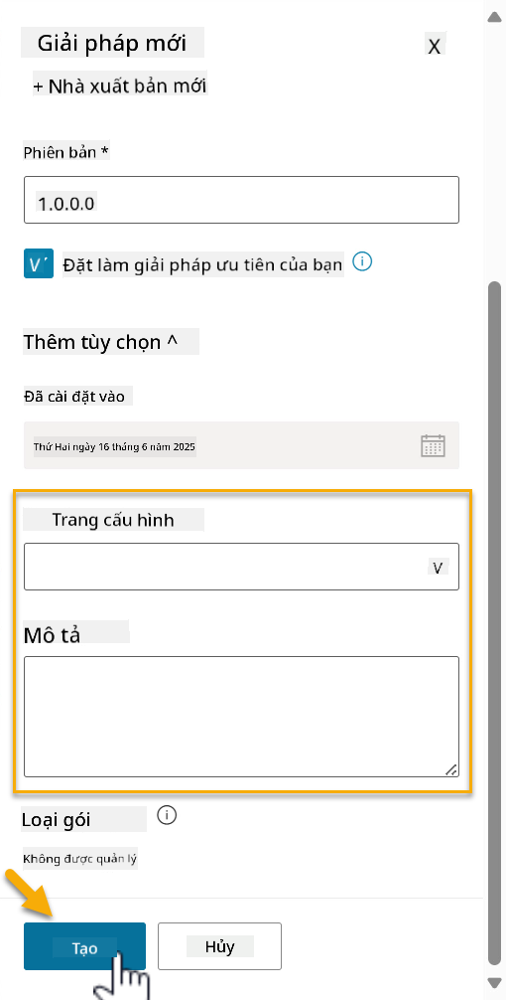

1. Giải pháp cho Contoso Helpdesk Agent đã được tạo. Sẽ không có thành phần nào cho đến khi chúng ta tạo một tác nhân trong Copilot Studio.

    Chọn biểu tượng **mũi tên quay lại** để trở về Solution Explorer.

    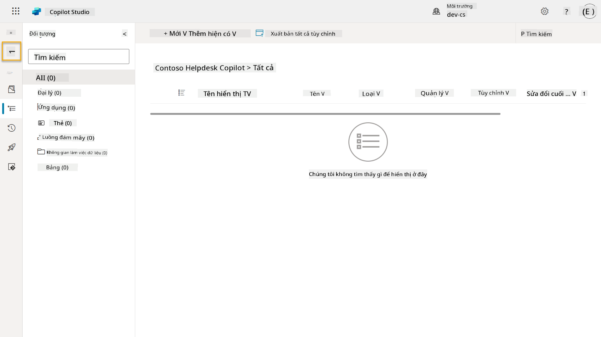

1. Lưu ý rằng Contoso Helpdesk Agent hiện hiển thị là **Giải pháp ưu tiên hiện tại** vì chúng ta đã tích vào ô **Đặt làm giải pháp ưu tiên của bạn** trước đó.

    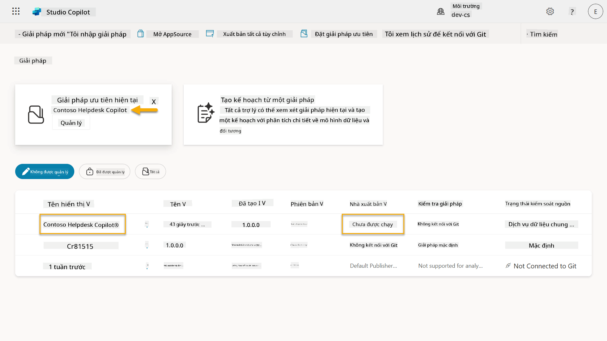

## ✅ Hoàn thành nhiệm vụ

Chúc mừng! 👏🏻 Bạn đã tạo một Nhà xuất bản và sử dụng nó trong Giải pháp mới tạo để xây dựng tác nhân của mình!

Làm tốt lắm, Nhà tạo tác nhân. Một dấu chân kỹ thuật số gọn gàng là bước đầu tiên hướng tới khả năng vận hành quy mô lớn. Bây giờ bạn đã có công cụ và tư duy để phát triển tác nhân sẵn sàng cho doanh nghiệp một cách bền vững.

Đây là phần kết thúc của **Bài thực hành 04 - Tạo một Giải pháp**, hãy chọn liên kết dưới đây để chuyển sang bài học tiếp theo. Giải pháp bạn đã tạo trong bài thực hành này sẽ được sử dụng trong bài thực hành của bài học tiếp theo.

⏭️ [Chuyển sang bài học **Bắt đầu nhanh với các tác nhân được xây dựng sẵn**](../05-using-prebuilt-agents/README.md)

## 📚 Tài nguyên chiến thuật

🔗 [Tạo một giải pháp](https://learn.microsoft.com/power-apps/maker/data-platform/create-solution/?WT.mc_id=power-172615-ebenitez)

🔗 [Tạo và quản lý giải pháp trong Copilot Studio](https://learn.microsoft.com/microsoft-copilot-studio/authoring-solutions-overview/?WT.mc_id=power-172615-ebenitez)

🔗 [Chia sẻ tác nhân với người dùng khác](https://learn.microsoft.com/microsoft-copilot-studio/admin-share-bots/?WT.mc_id=power-172615-ebenitez)

🔗 [Tóm tắt các tài nguyên có sẵn cho các vai trò bảo mật được định nghĩa trước](https://learn.microsoft.com/power-platform/admin/database-security#summary-of-resources-available-to-predefined-security-roles/?WT.mc_id=power-172615-ebenitez)

🔗 [Nâng cấp hoặc cập nhật một giải pháp](https://learn.microsoft.com/power-apps/maker/data-platform/update-solutions/?WT.mc_id=power-172615-ebenitez)

🔗 [Tổng quan về các pipeline trong Power Platform](https://learn.microsoft.com/power-platform/alm/pipelines/?WT.mc_id=power-172615-ebenitez)

🔗 [Tổng quan về tích hợp Git trong Power Platform](https://learn.microsoft.com/power-platform/alm/git-integration/overview/?WT.mc_id=power-172615-ebenitez)


---

**Tuyên bố miễn trừ trách nhiệm**:  
Tài liệu này đã được dịch bằng dịch vụ dịch thuật AI [Co-op Translator](https://github.com/Azure/co-op-translator). Mặc dù chúng tôi cố gắng đảm bảo độ chính xác, xin lưu ý rằng các bản dịch tự động có thể chứa lỗi hoặc không chính xác. Tài liệu gốc bằng ngôn ngữ bản địa nên được coi là nguồn thông tin chính thức. Đối với thông tin quan trọng, chúng tôi khuyến nghị sử dụng dịch vụ dịch thuật chuyên nghiệp bởi con người. Chúng tôi không chịu trách nhiệm cho bất kỳ sự hiểu lầm hoặc diễn giải sai nào phát sinh từ việc sử dụng bản dịch này.