<!--
CO_OP_TRANSLATOR_METADATA:
{
  "original_hash": "8e2c64a7f9303e58329ec8bb468c80b4",
  "translation_date": "2025-10-20T00:30:55+00:00",
  "source_file": "docs/recruit/05-using-prebuilt-agents/README.md",
  "language_code": "vi"
}
-->
# 🧰 Nhiệm vụ 05: Sử dụng Agent Được Xây Dựng Sẵn  

## 🕵️‍♂️ MẬT DANH: `CHIẾN DỊCH DU LỊCH AN TOÀN`

> **⏱️ Thời gian thực hiện chiến dịch:** `~30 phút`

🎥 **Xem video hướng dẫn**

## 🎯 Tóm tắt nhiệm vụ

Chào mừng bạn đến với nhiệm vụ tiếp theo trong Học viện Agent của Copilot Studio. Bạn sắp khám phá thế giới của **agent được xây dựng sẵn**—những agent thông minh, được thiết kế với mục đích cụ thể bởi Microsoft để tăng tốc triển khai và giảm thời gian đạt được giá trị.

Thay vì xây dựng từ đầu, các agent được xây dựng sẵn (còn gọi là **mẫu agent**) cung cấp cho bạn một khởi đầu nhanh chóng với các kịch bản sẵn sàng sử dụng mà bạn có thể tùy chỉnh và triển khai chỉ trong vài phút.

Trong nhiệm vụ này, bạn sẽ triển khai agent **Du Lịch An Toàn**—một agent giúp người dùng chuẩn bị cho các chuyến công tác, hiểu rõ chính sách công ty và tối ưu hóa việc lập kế hoạch.

---

## 🧭 Mục tiêu

Mục tiêu của bạn trong nhiệm vụ này là:

1. Hiểu rõ agent được xây dựng sẵn là gì và tại sao chúng quan trọng  
1. Triển khai mẫu agent **Du Lịch An Toàn**  
1. Tùy chỉnh phản hồi và nội dung của agent  
1. Kiểm tra và xuất bản agent  

---

## 🧠 Agent Được Xây Dựng Sẵn Là Gì?

Agent được xây dựng sẵn là các agent AI sẵn sàng sử dụng do Microsoft tạo ra, có thể:

- Đáp ứng các nhu cầu kinh doanh phổ biến (như du lịch, nhân sự, hỗ trợ IT)
- Bao gồm các chủ đề, cụm từ kích hoạt, hướng dẫn và kiến thức mẫu đã được thiết lập đầy đủ.
- Có thể chỉnh sửa, mở rộng và liên kết với dữ liệu của bạn

Những agent này rất phù hợp để bắt đầu nhanh chóng hoặc học cách cấu trúc các agent.

---

## 🧪 Phòng thí nghiệm 05: Bắt đầu nhanh với agent được xây dựng sẵn

Bây giờ chúng ta sẽ học cách chọn một agent được xây dựng sẵn và tùy chỉnh nó.

- [5.1 Khởi động Copilot Studio](../../../../../docs/recruit/05-using-prebuilt-agents)
- [5.2 Chọn Mẫu Agent Du Lịch An Toàn](../../../../../docs/recruit/05-using-prebuilt-agents)
- [5.3 Tùy chỉnh Agent](../../../../../docs/recruit/05-using-prebuilt-agents)
- [5.4 Kiểm tra và Xuất bản](../../../../../docs/recruit/05-using-prebuilt-agents)

Chúng ta sẽ tiếp tục với ví dụ trước đó, nơi chúng ta sẽ tạo một giải pháp trong môi trường Copilot Studio chuyên dụng để xây dựng agent hỗ trợ IT của mình.

Hãy bắt đầu!

### 5.1 Khởi động Copilot Studio

1. Truy cập [https://copilotstudio.microsoft.com](https://copilotstudio.microsoft.com)

1. Đăng nhập bằng tài khoản công việc hoặc trường học Microsoft 365 của bạn

!!! warning
    Bạn phải ở trong một tenant nơi Copilot Studio đã được kích hoạt. Nếu bạn không thấy Copilot Studio, hãy quay lại [Nhiệm vụ 00](../00-course-setup/README.md) để hoàn tất thiết lập của bạn.

### 5.2 Chọn Mẫu Agent Du Lịch An Toàn

1. Từ trang chủ của Copilot Studio, nhấp vào **+ Tạo**
    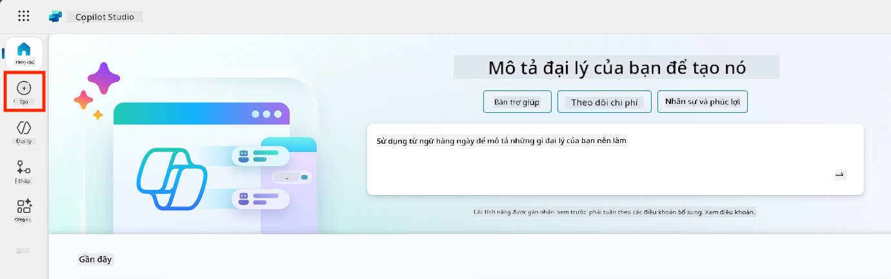

1. Cuộn xuống phần **Bắt đầu với một mẫu agent**

1. Tìm và chọn **Du Lịch An Toàn**

    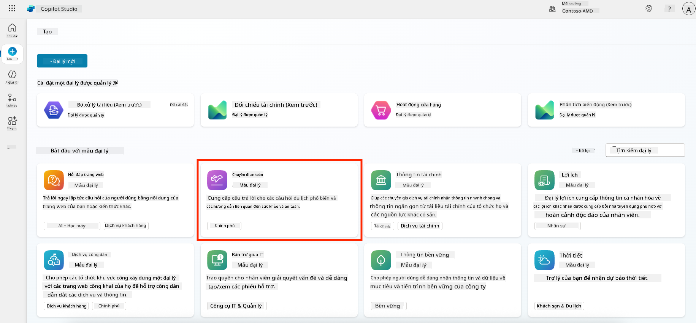

1. Lưu ý rằng mẫu đã được tải sẵn với mô tả, hướng dẫn và kiến thức.

    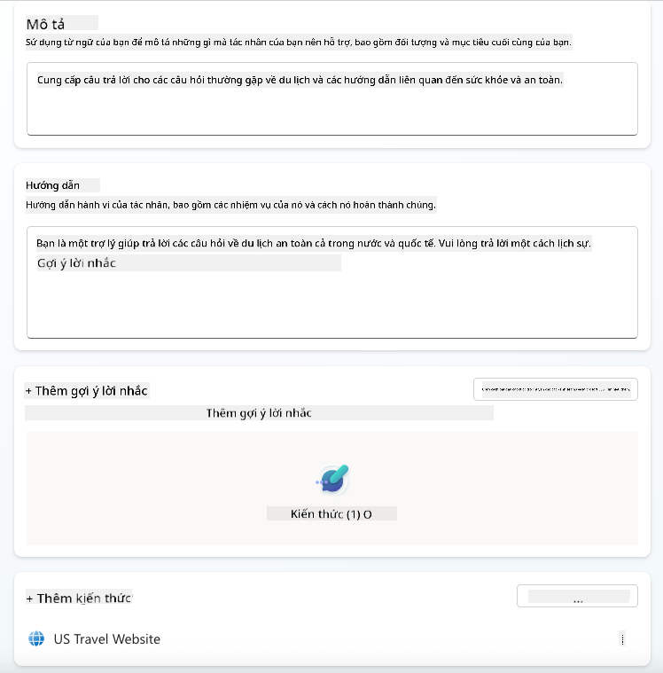

1. Nhấp vào **Tạo**

    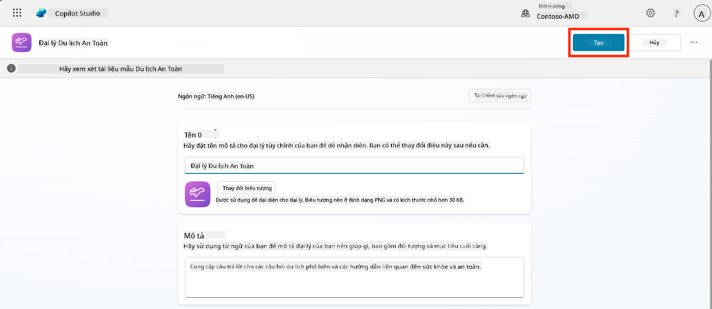

Điều này sẽ tạo một agent mới trong môi trường của bạn dựa trên cấu hình Du Lịch An Toàn.

### 5.3 Tùy chỉnh Agent

Bây giờ agent đã được tạo, hãy điều chỉnh nó cho phù hợp với tổ chức của bạn:

1. Chọn **Bật AI tạo nội dung** để kích hoạt tính năng AI tạo nội dung, cho phép sử dụng các hướng dẫn được cung cấp trong mẫu.

    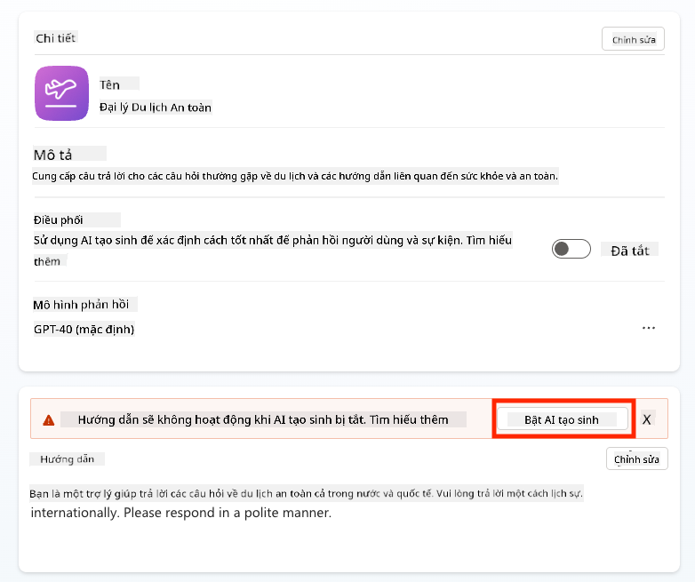

1. Bây giờ chúng ta sẽ trang bị cho agent một nguồn kiến thức bổ sung để nó có thể trả lời các câu hỏi về du lịch châu Âu. Để làm điều này, cuộn xuống phần **kiến thức** và chọn **Thêm kiến thức**

    

1. Chọn **Trang web công cộng**

    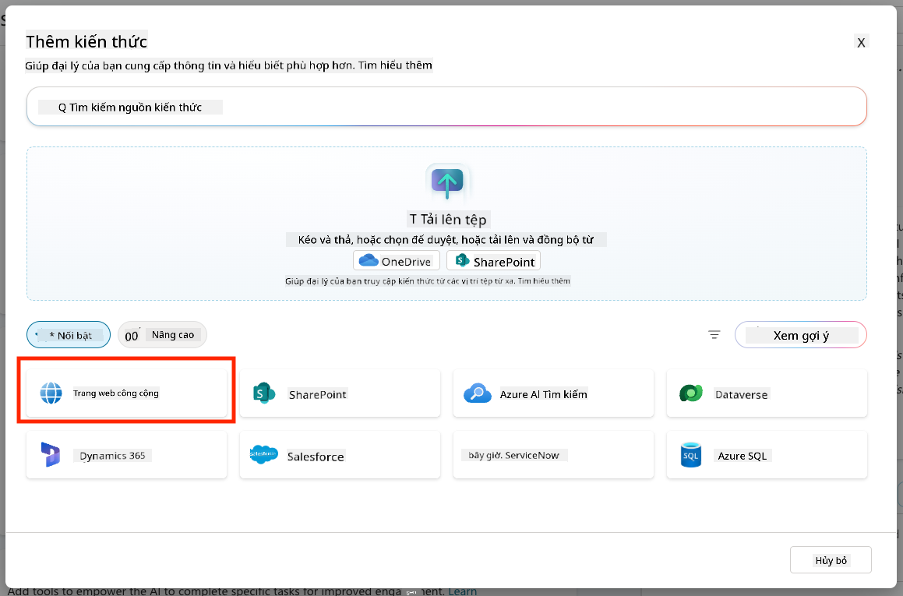

1. Trong ô nhập văn bản, dán **<https://european-union.europa.eu/>** và chọn **Thêm**

    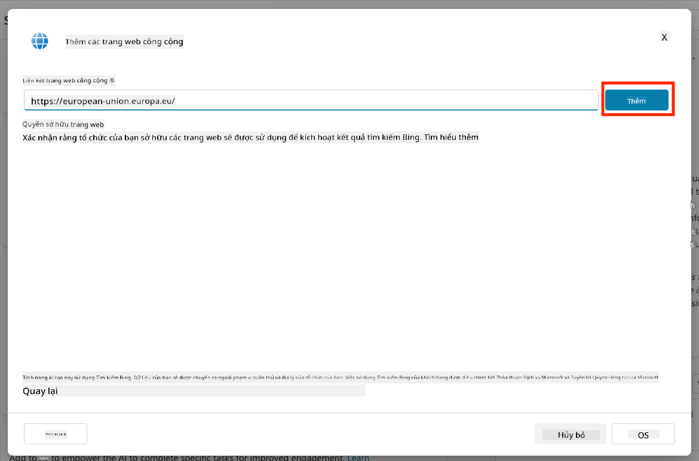

1. Chọn **Thêm vào agent**

    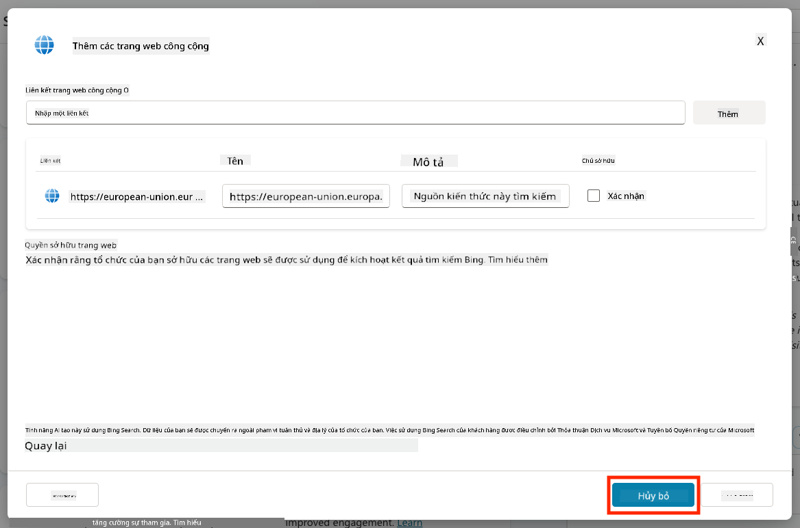

### 5.4 Kiểm tra và Xuất bản

1. Nhấp vào **Kiểm tra** ở góc trên bên phải để mở cửa sổ kiểm tra  

1. Thử các cụm từ như:

    - `“Tôi có cần visa để đi từ Mỹ đến Amsterdam không?”`
    - `“Mất bao lâu để làm hộ chiếu Mỹ?”`
    - `“Đại sứ quán Mỹ gần nhất ở Valencia, Tây Ban Nha ở đâu?”`

1. Xác nhận rằng agent phản hồi với thông tin chính xác và hữu ích, đồng thời quan sát Bản đồ Hoạt động để xem nơi thông tin được truy xuất.

    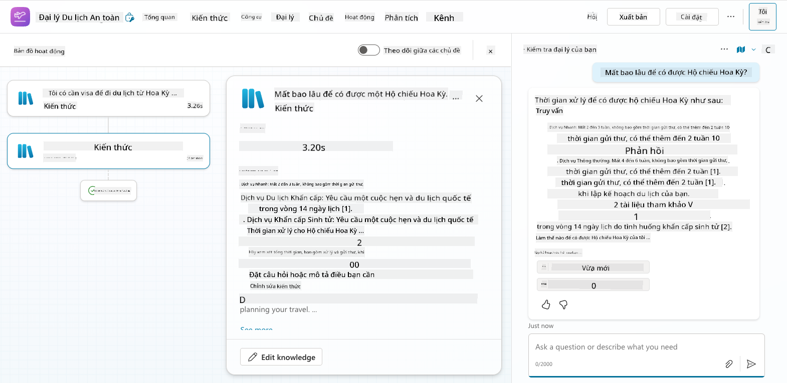

1. Khi đã sẵn sàng, nhấp vào **Xuất bản**

    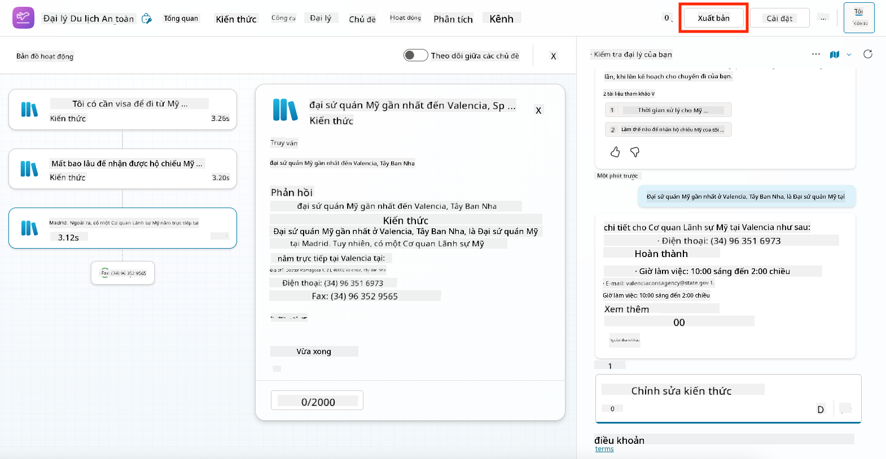

1. Chọn **Xuất bản** một lần nữa trong hộp thoại
    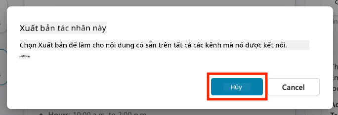

1. Tùy chọn, thêm agent vào Microsoft Teams bằng tính năng **Kênh** tích hợp sẵn.

!!! note "🧳 Mục tiêu bổ sung"
    Hãy thử liên kết agent Du Lịch An Toàn với một trang SharePoint hoặc tệp FAQ để làm cho nó phù hợp hơn với chính sách du lịch của công ty bạn.

## ✅ Nhiệm vụ Hoàn thành

Bạn đã thành công:

- Triển khai một agent được xây dựng sẵn của Microsoft  
- Tùy chỉnh agent
- Kiểm tra và xuất bản phiên bản của bạn từ mẫu agent **Du Lịch An Toàn**

⏭️ [Chuyển sang bài học **Tạo một agent tùy chỉnh từ đầu**](../06-create-agent-from-conversation/README.md).

<!-- markdownlint-disable-next-line MD033 -->

---

**Tuyên bố miễn trừ trách nhiệm**:  
Tài liệu này đã được dịch bằng dịch vụ dịch thuật AI [Co-op Translator](https://github.com/Azure/co-op-translator). Mặc dù chúng tôi cố gắng đảm bảo độ chính xác, xin lưu ý rằng các bản dịch tự động có thể chứa lỗi hoặc không chính xác. Tài liệu gốc bằng ngôn ngữ bản địa nên được coi là nguồn thông tin chính xác nhất. Đối với thông tin quan trọng, chúng tôi khuyến nghị sử dụng dịch vụ dịch thuật chuyên nghiệp bởi con người. Chúng tôi không chịu trách nhiệm cho bất kỳ sự hiểu lầm hoặc diễn giải sai nào phát sinh từ việc sử dụng bản dịch này.