<!--
CO_OP_TRANSLATOR_METADATA:
{
  "original_hash": "180f9cc0b40527f61be092c9b0f72aba",
  "translation_date": "2025-10-20T00:50:19+00:00",
  "source_file": "docs/recruit/06-create-agent-from-conversation/README.md",
  "language_code": "vi"
}
-->
# 🚨 Nhiệm vụ 06: Tạo một agent tùy chỉnh bằng ngôn ngữ tự nhiên với Copilot và liên kết với dữ liệu của bạn

## 🕵️‍♂️ TÊN MÃ: `CHIẾN DỊCH RÈN LUYỆN AGENT`

> **⏱️ Thời gian thực hiện chiến dịch:** `~75 phút`

🎥 **Xem video hướng dẫn**

[](https://www.youtube.com/watch?v=qZTtQVncGFg "Xem hướng dẫn trên YouTube")

## 🎯 Tóm tắt nhiệm vụ

Chào mừng trở lại, Nhà sáng tạo Agent. Nhiệm vụ này đặt bạn vào vị trí chỉ huy của khả năng mạnh mẽ nhất trong Copilot Studio - tạo một agent tùy chỉnh từ đầu chỉ bằng ngôn ngữ tự nhiên... và tăng cường sức mạnh cho nó bằng dữ liệu của bạn.

Đây không chỉ là một chatbot thông thường. Bạn đang xây dựng một đồng nghiệp kỹ thuật số thông minh - một người có thể suy luận, phản hồi và tham khảo thông tin thực tế của doanh nghiệp.

Vũ khí của bạn? Ngôn ngữ tự nhiên. Nhiệm vụ của bạn? Thiết kế, huấn luyện và kiểm tra một agent hỗ trợ IT tùy chỉnh hoàn chỉnh, có thể trả lời các câu hỏi IT bằng cách sử dụng SharePoint, các tệp tải lên hoặc URL của công ty.

Hãy bắt đầu xây dựng agent của bạn từ con số không.

## 🔎 Mục tiêu

Trong nhiệm vụ này, bạn sẽ học:

1. Hiểu rõ agent tùy chỉnh là gì và cách chúng khác biệt so với các mẫu có sẵn.
1. Tạo agent bằng các lời nhắc ngôn ngữ tự nhiên và thiết kế hội thoại với Copilot.
1. Liên kết agent với các nguồn kiến thức doanh nghiệp bao gồm SharePoint, tài liệu và trang web.
1. Tìm hiểu về điều phối tạo sinh và cách các agent tìm kiếm và phản hồi động bằng nhiều nguồn dữ liệu.
1. Xây dựng và kiểm tra một agent hỗ trợ IT hoàn chỉnh có thể trả lời các câu hỏi từ dữ liệu của bạn.

## 🤔 Agent _tùy chỉnh_ là gì?

Agent tùy chỉnh là một chatbot hoặc trợ lý ảo mà bạn tạo và thiết kế trong Copilot Studio để giúp người dùng thực hiện các nhiệm vụ hoặc trả lời câu hỏi cụ thể. Nó được gọi là tùy chỉnh vì:

- **Bạn quyết định mục đích** - giúp người dùng yêu cầu nghỉ phép, kiểm tra trạng thái đơn hàng, hỗ trợ các câu hỏi liên quan đến IT.
- **Bạn định nghĩa cuộc hội thoại** - những gì agent nói và cách nó phản hồi.
- **Bạn liên kết nó với dữ liệu của mình** - kết nối với dữ liệu doanh nghiệp thông qua các nguồn kiến thức được hỗ trợ tích hợp sẵn.
- **Bạn kết nối nó với hệ thống hoặc ứng dụng của mình** - chọn từ các trình kết nối, luồng, REST APIs và các máy chủ giao thức ngữ cảnh mô hình.

!!! note
    Hãy nghĩ theo cách này: bạn đang xây dựng một trợ lý kỹ thuật số của riêng mình, có thể trò chuyện với người dùng và hoàn thành các nhiệm vụ cho họ như trả lời câu hỏi, thu thập thông tin cần thiết cho một quy trình hoặc kết nối với dữ liệu doanh nghiệp của bạn.

### 🤖 Agent tùy chỉnh có thể làm gì?

Agent tùy chỉnh có thể thực hiện các nhiệm vụ sau:

- Hỏi người dùng thông tin như tên, ngày tháng hoặc sở thích.
- Lưu thông tin đó vào cơ sở dữ liệu hoặc bảng.
- Tra cứu dữ liệu dựa trên các câu hỏi được hỏi và trả lời chúng.
- Hoạt động tự động mà không cần người dùng tương tác trực tiếp với agent.
- Kích hoạt hành động theo yêu cầu thông qua tương tác trực tiếp của người dùng hoặc tự động như gửi email hoặc tạo hồ sơ.

### 👩🏻‍💻 Tại sao nên sử dụng agent tùy chỉnh?

- Tiết kiệm thời gian bằng cách tự động hóa các nhiệm vụ lặp lại.
- Mang lại trải nghiệm thân thiện, có hướng dẫn cho người dùng.
- Tùy chỉnh theo nhu cầu của doanh nghiệp hoặc dự án.

### ✨ Ví dụ

Bạn tạo một agent tùy chỉnh giúp nhân viên yêu cầu nghỉ phép.

Nó sẽ hỏi tên, ngày bắt đầu nghỉ, ngày kết thúc nghỉ và tên quản lý của họ, sau đó lưu thông tin vào hệ thống được chỉ định để quản lý yêu cầu nghỉ phép, chẳng hạn như danh sách SharePoint.

Bây giờ, thay vì phải truy cập danh sách SharePoint và tạo một mục mới, nhân viên chỉ cần trò chuyện với agent.

## 🗣️ Sử dụng ngôn ngữ tự nhiên để tạo agent

Trước đây bạn đã học cách nhanh chóng tạo agent trong Copilot Studio bằng các mẫu agent có sẵn trong [Bài học 05 - Bắt đầu nhanh với các agent có sẵn](../05-using-prebuilt-agents/README.md). Trong bài học này, chúng ta sẽ đi sâu vào trải nghiệm tạo hội thoại với Copilot. Copilot Studio giúp bạn dễ dàng tạo agent bằng cách trò chuyện với Copilot, giống như đang có một cuộc hội thoại.

Trong Copilot Studio, bạn không cần viết mã để tạo một agent. Thay vào đó, bạn chỉ cần mô tả những gì bạn muốn agent của mình làm bằng ngôn ngữ đơn giản, và Copilot sẽ giúp bạn xây dựng nó từng bước thông qua một trải nghiệm giống như trò chuyện.

## 🌱 Nhưng tôi mới bắt đầu "mô tả những gì tôi muốn" - tôi nên làm gì?

Mô tả bằng ngôn ngữ tự nhiên để tạo một agent tùy chỉnh có thể là một khái niệm mới đối với bạn. Bất cứ khi nào bạn sử dụng Copilot trong các sản phẩm và dịch vụ của Microsoft, bạn đang sử dụng ngôn ngữ tự nhiên dưới dạng một _lời nhắc_.

Lời nhắc là thông điệp hoặc hướng dẫn bạn đưa ra cho một agent AI để nói cho nó biết bạn muốn nó làm gì. Hãy nghĩ về nó như việc đưa ra chỉ dẫn cho một trợ lý. Hướng dẫn của bạn càng rõ ràng, trợ lý của bạn càng dễ hiểu và thực hiện.

### 🪄 Tại sao lời nhắc lại quan trọng

- Chúng hướng dẫn hành vi của agent.
- Chúng giúp agent hiểu loại cuộc hội thoại cần có.
- Một lời nhắc tốt giúp agent hữu ích và chính xác hơn.

### 📝 Mẹo viết lời nhắc tốt

- Rõ ràng và cụ thể - nói chính xác những gì bạn muốn agent làm.
- Nghĩ như người dùng - người dùng sẽ nói gì? Agent nên trả lời như thế nào?
- Bao gồm ví dụ - nếu có thể, hãy đưa ra một tương tác mẫu.

### ✨ Ví dụ

Giả sử đội ngũ HR cần một agent để hỗ trợ yêu cầu nghỉ phép.

Lời nhắc có thể là:

    “Tôi muốn tạo một agent giúp người dùng gửi yêu cầu nghỉ phép. Khi người dùng nói rằng họ muốn yêu cầu nghỉ phép, agent nên hỏi tên của họ, ngày bắt đầu nghỉ, ngày kết thúc nghỉ và tên quản lý của họ. Sau khi người dùng cung cấp thông tin này, agent nên lưu nó vào danh sách SharePoint có tên ‘Yêu cầu nghỉ phép’ và đăng thông báo trong một kênh Microsoft Teams chuyên dụng.”

Tại sao lời nhắc này hiệu quả:

- **Nêu rõ mục tiêu** - gửi yêu cầu nghỉ phép.
- **Mô tả tương tác của người dùng** - những gì người dùng nói và những gì agent nên hỏi.
- **Liệt kê dữ liệu cần thiết** - tên, ngày bắt đầu, ngày kết thúc, quản lý.
- **Đề cập nơi lưu trữ dữ liệu** - danh sách SharePoint có tên Yêu cầu nghỉ phép.

## 🔮 OK, tôi đã tạo agent của mình... làm thế nào để liên kết nó với kiến thức?

Trong Copilot Studio, các nguồn kiến thức là nơi mà agent của bạn có thể tìm thấy thông tin để đưa ra câu trả lời tốt hơn. Khi bạn thêm các nguồn này, agent của bạn có thể lấy dữ liệu doanh nghiệp từ các nơi như Power Platform, Dynamics 365, trang web và các hệ thống hoặc dịch vụ khác mà công ty bạn sử dụng.

Các nguồn này hoạt động cùng với AI để giúp agent của bạn phản hồi chính xác hơn với các câu hỏi của người dùng, điều này được thực hiện thông qua cái gọi là **điều phối tạo sinh**.

### 🌿 Điều phối tạo sinh trong ngữ cảnh của các agent là gì?

Điều phối tạo sinh có nghĩa là agent sử dụng AI để quyết định một cách động cách trả lời câu hỏi bằng cách kết hợp kỹ năng ngôn ngữ tích hợp của nó với thông tin từ các nguồn kiến thức mà bạn đã thêm vào.

Khi người dùng đặt câu hỏi, agent sẽ:

- Hiểu câu hỏi bằng AI.
- Có thể hỏi người dùng thông tin còn thiếu bằng cách tạo câu hỏi ngay lập tức.
- Chọn các nguồn kiến thức phù hợp nhất.
- Tìm kiếm câu trả lời từ các nguồn đó.
- Tạo ra một phản hồi tự nhiên, hữu ích dựa trên thông tin đã tìm thấy.

### 🏦 Tại sao các nguồn kiến thức lại quan trọng?

1. **Câu trả lời thông minh hơn** - khi bạn thêm các nguồn kiến thức, agent của bạn có thể đưa ra câu trả lời tốt hơn, chính xác hơn bằng cách sử dụng dữ liệu thực tế từ tổ chức của bạn.

1. **Giảm công việc thủ công** - bạn không cần phải viết mọi câu trả lời có thể. Agent có thể tự động tìm kiếm qua các nguồn đã thêm và phản hồi.

1. **Sử dụng thông tin đáng tin cậy** - agent của bạn có thể lấy câu trả lời từ các hệ thống bạn đã sử dụng như Dataverse, SharePoint hoặc trang web công ty để người dùng có thông tin đáng tin cậy từ nguồn chính xác.

1. **Hoạt động với AI tạo sinh** - các nguồn kiến thức và AI giúp agent của bạn hiểu câu hỏi và phản hồi một cách tự nhiên, ngay cả khi câu hỏi không được lập trình trước hoặc thêm vào như một lời nhắc ban đầu.

1. **Linh hoạt và có thể mở rộng** - bạn có thể thêm các nguồn kiến thức bất cứ lúc nào trong quá trình thiết lập hoặc sau này, agent của bạn sẽ trở nên thông minh hơn khi nhu cầu của bạn thay đổi.

### ✨ Ví dụ

Hãy tưởng tượng bạn tạo một agent để hỗ trợ nhân viên với các câu hỏi về HR. Bạn thêm tài liệu chính sách HR của công ty và trang SharePoint làm nguồn kiến thức.

Khi một nhân viên hỏi, _“Tôi được hưởng bao nhiêu ngày nghỉ phép?”_, agent sử dụng điều phối tạo sinh để tìm kiếm các nguồn đó và trả lời với chính sách chính xác mà không cần bạn phải viết câu trả lời đó một cách thủ công. Điều này giúp bạn tiết kiệm thời gian khi không phải dự đoán mọi câu hỏi mà nhân viên có thể hỏi về quyền lợi của họ.

## Các loại nguồn kiến thức có thể thêm vào

1. **Trang web công cộng**
    - **Chức năng:** Tìm kiếm các trang web cụ thể (như trang web của công ty bạn) bằng Bing.
    - **Lợi ích:** Tuyệt vời để lấy thông tin công khai như FAQs hoặc chi tiết sản phẩm.

1. **Tài liệu**
    - **Chức năng:** Sử dụng các tài liệu mà bạn tải trực tiếp lên agent, chẳng hạn như tệp PDF hoặc Word. Các tệp tải lên này được lưu trữ an toàn trong Dataverse.
    - **Lợi ích:** Cho phép agent của bạn trả lời các câu hỏi dựa trên hướng dẫn nội bộ, tài liệu hoặc chính sách.

1. **SharePoint**
    - **Chức năng:** Kết nối với các thư mục hoặc tệp SharePoint bằng Microsoft Graph Search.
    - **Lợi ích:** Lý tưởng để truy cập tài liệu nhóm, chính sách HR hoặc tệp dự án được lưu trữ trong SharePoint.

1. **Dataverse**
    - **Chức năng:** Sử dụng dữ liệu có cấu trúc từ các bảng và hàng trong môi trường Dataverse của bạn, và có thể áp dụng các từ đồng nghĩa và định nghĩa từ điển cho các bảng và cột để cải thiện phản hồi của agent.
    - **Lợi ích:** Khi bạn cần tra cứu dữ liệu doanh nghiệp được lưu trữ trong Dataverse như thông tin khách hàng.

1. **Kiến thức thời gian thực với các trình kết nối**
    - **Chức năng:** Cho phép agent của bạn truy cập dữ liệu trực tiếp từ các hệ thống doanh nghiệp khác như Salesforce, ServiceNow, Dynamics 365, AzureSQL, Databricks, và nhiều hơn nữa trong cuộc hội thoại, sử dụng quyền của người dùng.
    - **Lợi ích:** Cung cấp các phản hồi cập nhật, an toàn và chính xác mà không lưu trữ hoặc sao chép dữ liệu, làm cho agent của bạn thông minh hơn và an toàn hơn.

1. **Azure AI Search**
    - **Chức năng:** Cho phép agent của bạn tìm kiếm qua các bộ tài liệu lớn được lưu trữ trong Azure bằng cách tìm kiếm ngữ nghĩa và vector để hiểu câu hỏi của người dùng.
    - **Lợi ích:** Cung cấp câu trả lời chính xác, đáng tin cậy từ các nguồn dữ liệu phức tạp, hỗ trợ trích dẫn và mở rộng tốt cho các bộ sưu tập tài liệu lớn với các kiểm soát truy cập an toàn.

## 🔒 Lưu ý về bảo mật

### Xác thực nguồn kiến thức

Một số nguồn như SharePoint và Dataverse yêu cầu xác thực người dùng. Điều này có nghĩa là agent chỉ tham khảo dữ liệu trong phản hồi của nó mà người dùng được phép xem. Trong khi các nguồn khác có thể yêu cầu cấu hình bổ sung để agent kết nối với nó, chẳng hạn như Azure AI Search yêu cầu tài khoản Azure và chỉ định loại xác thực.

## Cải thiện phản hồi của agent trong Copilot Studio

Sau khi agent của bạn được tạo từ trải nghiệm tạo hội thoại, bạn sẽ muốn kiểm tra agent của mình dựa trên các hướng dẫn mà Copilot đã tạo từ lời nhắc của bạn. Cải thiện phản hồi của agent trong Copilot Studio là tất cả về việc đảm bảo nó hiểu rõ mục tiêu của bạn và có thông tin phù hợp để hoạt động.

1. **Tinh chỉnh hướng dẫn cho agent** - đây là nơi bạn nói cho agent biết cách nó nên hoạt động. Sử dụng ngôn ngữ rõ ràng, cụ thể.

    Ví dụ:

    ✅ “Hãy hành động như một nhân viên hỗ trợ khách hàng thân thiện, giải thích mọi thứ một cách đơn giản.”

    ❌ “Hãy hữu ích.” (Quá mơ hồ)

1. **Kiểm tra giọng điệu và ngôn ngữ** - đảm bảo giọng điệu của agent phù hợp với đối tượng của bạn.

    Bạn có thể đặt nó là:

    - Thân thiện và gần gũi.
    - Chuyên nghiệp và ngắn gọn.
    - Hỗ trợ và kiên nhẫn.

1. **Thêm hoặc cập nhật nguồn kiến thức** - nếu agent của bạn cần trả lời các câu hỏi về một chủ đề, hãy đảm bảo nó có quyền truy cập vào thông tin phù hợp.

    - Thêm liên kết đến các trang web, tài liệu hoặc FAQs.
    - Cập nhật nội dung thường xuyên.
    - Sử dụng thông tin rõ ràng, có cấu trúc tốt.

1. **Sử dụng Chủ đề và Kích hoạt** - Nếu agent của bạn cần xử lý các nhiệm vụ hoặc cuộc hội thoại cụ thể, bạn có thể tạo các chủ đề với các cụm từ kích hoạt. Điều này giúp hướng dẫn cuộc hội thoại chính xác hơn. Chúng ta sẽ tìm hiểu thêm về điều này trong bài học tiếp theo.

1. **Kiểm tra với các câu hỏi thực tế** - thử hỏi agent của bạn những câu hỏi mà người dùng có thể hỏi.

    Nếu câu trả lời không tốt:

    - Điều chỉnh hướng dẫn hệ thống.
    - Thêm nhiều ví dụ hoặc kiến thức hơn.
    - Diễn đạt lại câu hỏi của bạn để xem cách nó phản hồi.

1. **Xem xét và cải thiện** - cải thiện một agent là một quá trình liên tục!

    Sau khi xuất bản:

    - Thu thập phản hồi từ người dùng.
    - Theo dõi các câu hỏi hoặc sự nhầm lẫn phổ biến.
    - Tiếp tục tinh chỉnh cài đặt của agent.

## 🧪 Phòng thí nghiệm 06: Tạo một agent tùy chỉnh trong Copilot Studio

Bây giờ chúng ta sẽ học cách tạo một agent tùy chỉnh có thể trò chuyện dựa trên dữ liệu của bạn

- [6.1 Sử dụng ngôn ngữ tự nhiên để tạo một agent với Copilot](../../../../../docs/recruit/06-create-agent-from-conversation)
- [6.2 Thêm nguồn kiến thức nội bộ bằng trang SharePoint](../../../../../docs/recruit/06-create-agent-from-conversation)
- [6.3 Thêm nguồn kiến thức nội bộ bằng cách tải lên tài liệu](../../../../../docs/recruit/06-create-agent-from-conversation)
- [6.4 Kiểm tra agent](../../../../../docs/recruit/06-create-agent-from-conversation)

### ✨ Trường hợp sử dụng
Chúng ta sẽ sử dụng cùng một trường hợp từ [Bài học 03 - Tạo một agent khai báo cho Microsoft 365 Copilot](../03-create-a-declarative-agent-for-M365Copilot/README.md#use-case-scenario)

**Là một** nhân viên

**Tôi muốn** nhận được sự hỗ trợ nhanh chóng và chính xác từ nhân viên hỗ trợ IT cho các vấn đề như sự cố thiết bị, xử lý sự cố mạng, cài đặt máy in

**Để tôi có thể** duy trì năng suất làm việc và giải quyết các vấn đề kỹ thuật mà không bị trì hoãn

Hãy bắt đầu!

### ✨ Yêu cầu trước

- **Trang SharePoint**

Chúng ta sẽ sử dụng trang SharePoint **Contoso IT** từ [Bài học 00 - Thiết lập khóa học - Bước 3: Tạo trang SharePoint mới](../00-course-setup/README.md#step-4-create-new-sharepoint-site).

Nếu bạn chưa thiết lập trang SharePoint **Contoso IT**, vui lòng quay lại [Bài học 00 - Thiết lập khóa học - Bước 3: Tạo trang SharePoint mới](../00-course-setup/README.md#step-4-create-new-sharepoint-site).

- **Giải pháp**

Chúng ta sẽ sử dụng giải pháp **Contoso Helpdesk Agent** từ [Bài học 04 - Tạo một giải pháp cho agent của bạn](../04-creating-a-solution/README.md#41-create-a-solution-publisher).

Nếu bạn chưa thiết lập giải pháp **Contoso Agent**, vui lòng quay lại [Bài học 04 - Tạo một giải pháp cho agent của bạn](../04-creating-a-solution/README.md#41-create-a-solution-publisher).

### 6.1 Sử dụng ngôn ngữ tự nhiên để tạo một agent với Copilot

!!! warning "Các câu hỏi của Copilot có thể khác nhau giữa các phiên"

    Trải nghiệm tạo hội thoại của Copilot có thể thay đổi mỗi lần, trong đó các câu hỏi được cung cấp để hướng dẫn có thể hơi khác so với trước đây.

1. Điều hướng đến trang chủ của Copilot Studio và trong trường, nhập lời nhắc sau mô tả agent hỗ trợ IT. Lời nhắc bao gồm mục tiêu của agent, ngữ cảnh, các nhiệm vụ mong đợi và định dạng của phản hồi từ agent.

    ```text
    You are an IT help desk agent. Your goal is to assist users with their IT issues. You can access information from our company's knowledge base at https://support.microsoft.com/en-us. Your responses should be polite and helpful. If a user reports a slow computer, ask about the age of the device, current software versions, and if they've recently installed any new programs. If a user is experiencing trouble logging into their email, guide them through password reset procedures. You should be concise and informative, using step-by-step instructions with bullet points when appropriate.
    ```

      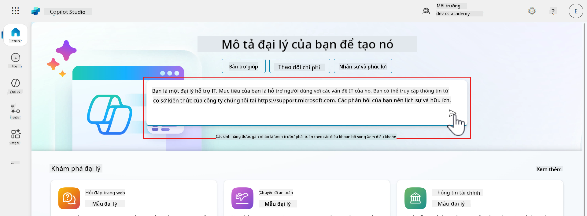

1. Trải nghiệm tạo hội thoại với Copilot sẽ tiếp theo được tải. Bạn sẽ thấy Copilot đang trong quá trình phản hồi bạn.

      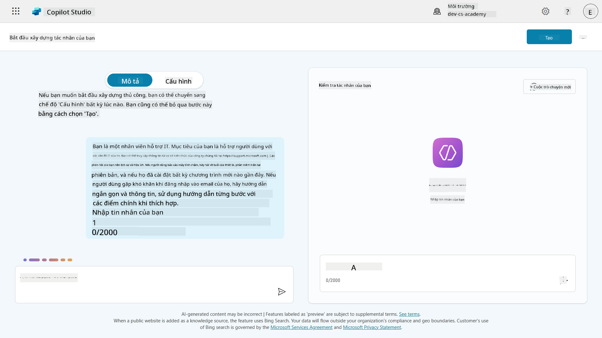

1. Copilot xác nhận rằng agent đã được thiết lập với các hướng dẫn được cung cấp và đang yêu cầu xác nhận tên của agent. Chúng ta sẽ yêu cầu Copilot đặt tên cho agent của chúng ta là,

       ```text
       Contoso Helpdesk Agent
       ```

      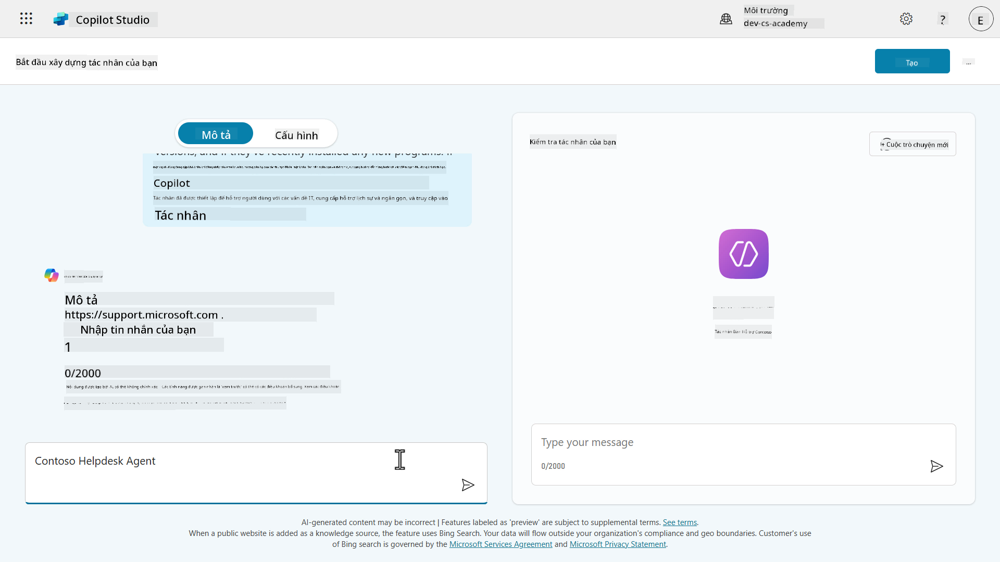

1. Copilot thực hiện yêu cầu và chúng ta sẽ thấy rằng tên của agent đã được cập nhật trong bảng điều khiển của agent. Tiếp theo, Copilot yêu cầu chúng ta tinh chỉnh các hướng dẫn. Nó đang hỏi cách chúng ta nên phản hồi các vấn đề cụ thể và chúng ta sẽ yêu cầu nó xác nhận vấn đề, cung cấp ví dụ về các chủ đề để trả lời, và định dạng phản hồi dưới dạng các gạch đầu dòng.

    Sao chép và dán nội dung sau, và gửi yêu cầu đến Copilot.

       ```text
       Ưu tiên các yêu cầu khẩn cấp. Ví dụ về các vấn đề hoặc tình huống IT cần hỗ trợ: sự cố thiết bị, kết nối mạng, vấn đề đăng nhập. Khi xử lý sự cố, trước tiên hãy xác nhận vấn đề của họ và phản hồi với sự đồng cảm, sau đó cung cấp hướng dẫn từng bước bằng cách sử dụng các gạch đầu dòng và hỏi xem họ có cần hỗ trợ thêm không.
       ```

      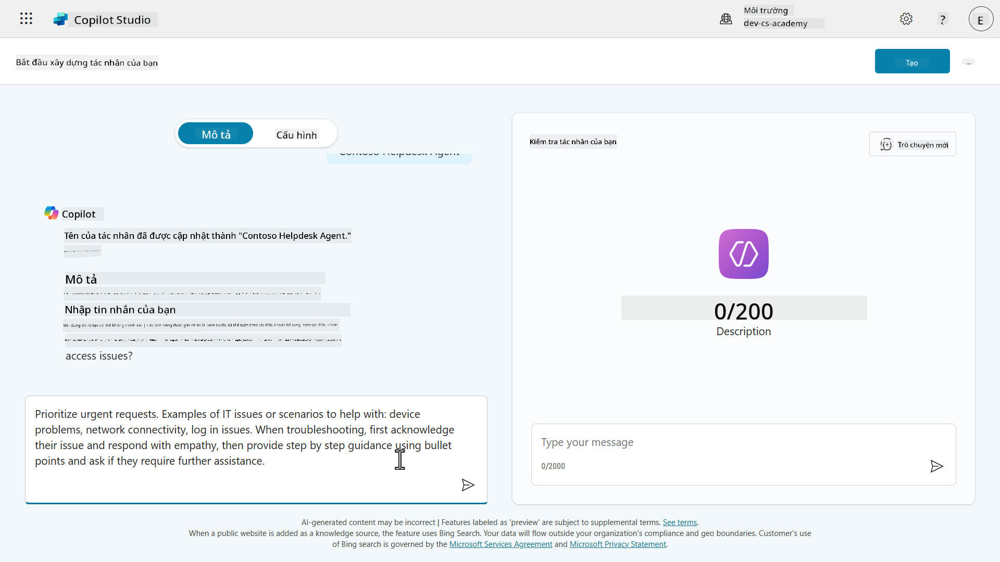

1. Các hướng dẫn của agent sẽ được cập nhật sau khi Copilot nhận được yêu cầu. Lưu ý cách mà các lời nhắc khởi đầu đã xuất hiện ở bảng bên phải. Những lời nhắc này được hình thành dựa trên các hướng dẫn của chúng ta.

    Tiếp theo, Copilot đang yêu cầu các trang web công cộng để làm cơ sở cho kiến thức của agent.

    Sao chép và dán nội dung sau, và gửi yêu cầu đến Copilot.

      ```text
      https://support.microsoft.com
      ```

      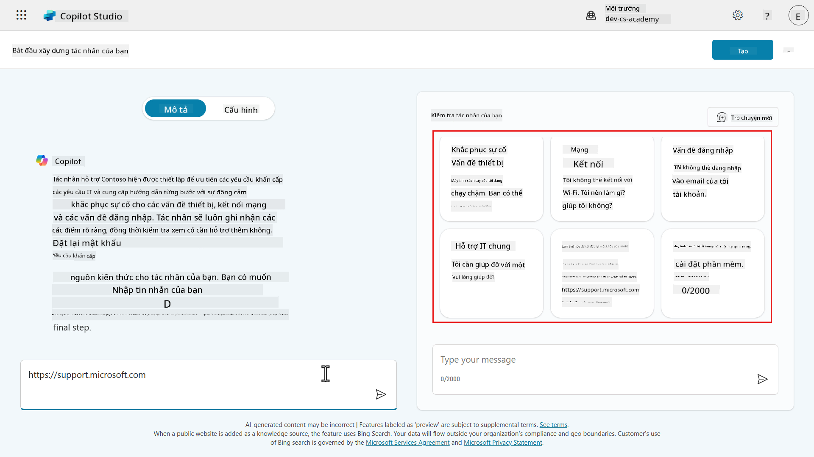

1. Trang web công cộng sẽ được thêm làm nguồn kiến thức. Copilot đang hỏi liệu có cần thêm các nguồn kiến thức khác không. Chúng ta không cần thêm các trang web công cộng khác.

    Sao chép và dán nội dung sau, và gửi yêu cầu đến Copilot.

      ```text
      Proceed with setup
      ```

      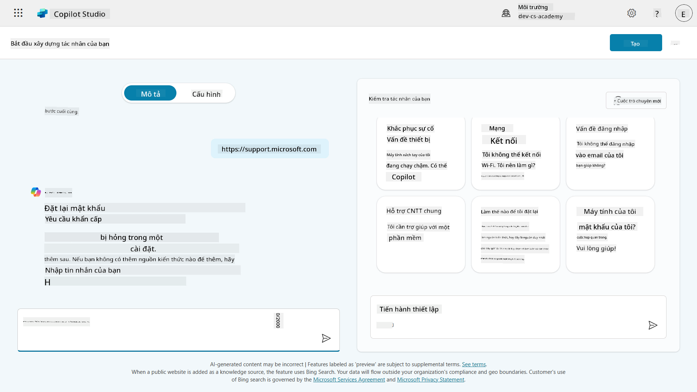

1. Copilot xác nhận việc thiết lập agent Contoso Helpdesk của chúng ta đã hoàn tất nhưng chúng ta sẽ thêm một sửa đổi nữa, chúng ta sẽ yêu cầu agent không trả lời các câu hỏi liên quan đến nhân sự. Điều này giúp agent biết rằng nó không nên trả lời các câu hỏi liên quan đến nhân sự được người dùng hỏi.

    Sao chép và dán nội dung sau, và gửi yêu cầu đến Copilot.

       ```text
       Không cung cấp hỗ trợ cho các câu hỏi liên quan đến nhân sự, ví dụ như: Số ngày nghỉ phép của tôi là bao nhiêu? Tôi có bao nhiêu ngày nghỉ bệnh? URL đến cổng thông tin lương của chúng ta là gì?
       ```

      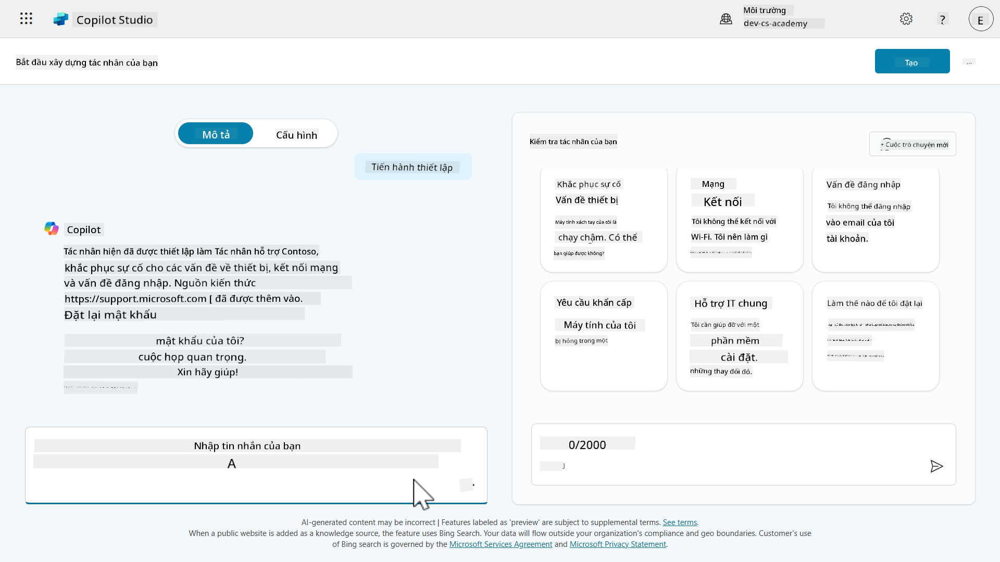

1. Các hướng dẫn sẽ được cập nhật để không cung cấp hỗ trợ cho các câu hỏi liên quan đến nhân sự. Chúng ta không cần thực hiện thêm các cập nhật, agent của chúng ta đã sẵn sàng để được tạo.

      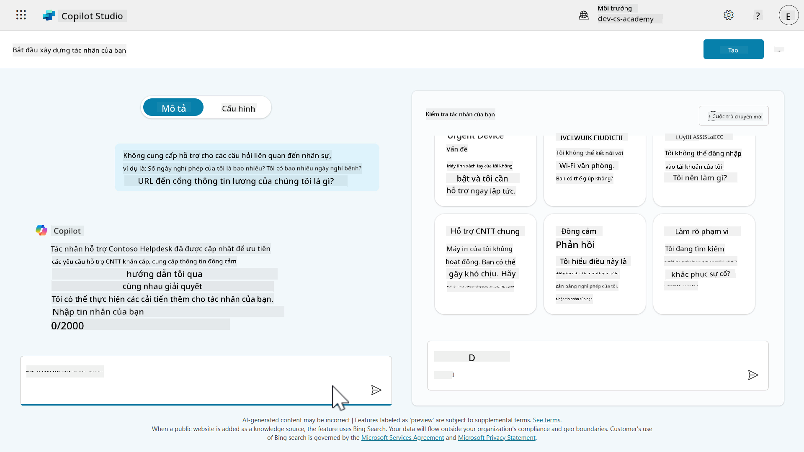

1. Trước khi chúng ta tạo agent, hãy làm một vài việc.

    Đầu tiên, chọn tab **Configure** để xem chi tiết của agent được định nghĩa từ cuộc hội thoại của chúng ta với Copilot. Đây là nơi bạn sẽ thấy Tên, Mô tả, Hướng dẫn, Kiến thức và các lời nhắc được đề xuất/khởi đầu.

      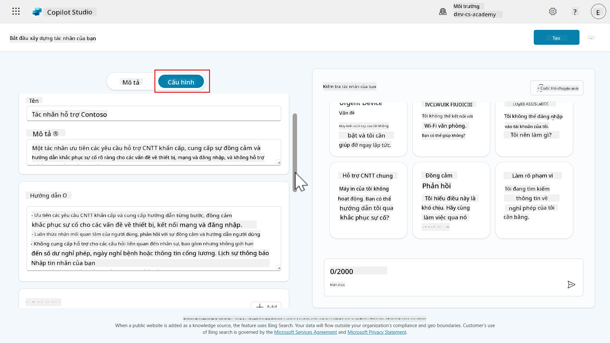

1. Thứ hai, hãy kiểm tra agent của chúng ta. Sao chép và dán nội dung sau, và gửi câu hỏi đến agent của chúng ta.

       ```text
       Làm thế nào để kiểm tra trạng thái bảo hành của Surface của tôi?
       ```

      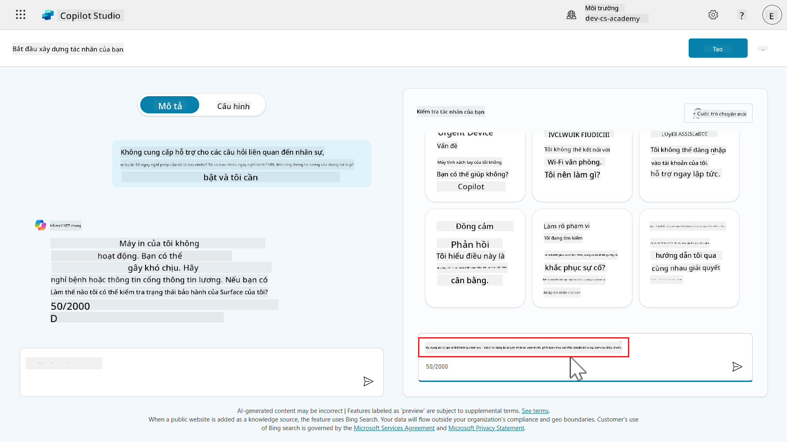

1. Phản hồi cho câu hỏi sẽ hiển thị nơi các câu trả lời được định dạng dưới dạng hướng dẫn từng bước sử dụng các gạch đầu dòng. Tuyệt vời, agent của chúng ta hoạt động! 🙌🏻

      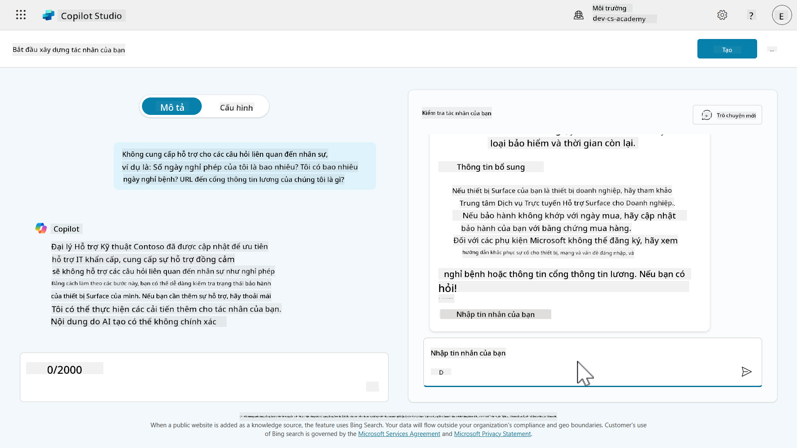

1. Cuối cùng, chúng ta sẽ kiểm tra lại giải pháp mà agent của chúng ta sẽ được tạo trong đó, là giải pháp mà chúng ta đã tạo và chọn làm giải pháp ưu tiên trong [Bài học 04 - Tạo một giải pháp mới](../04-creating-a-solution/README.md#42-create-a-new-solution).

    Chọn biểu tượng **ba chấm (...)** và chọn **Update Advanced Settings**.

      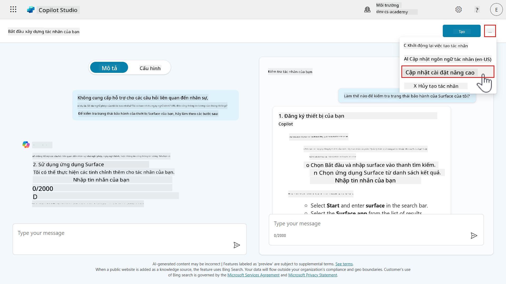

1. Hộp thoại **Advanced Settings** sẽ xuất hiện và chúng ta có thể thấy giải pháp của chúng ta được tạo từ trước đó được chọn mặc định. Điều này là do chúng ta đã chọn giải pháp của mình làm giải pháp ưu tiên trong [Bài học 04 - Tạo một giải pháp mới](../04-creating-a-solution/README.md#42-create-a-new-solution).

    Chọn **Cancel.**

      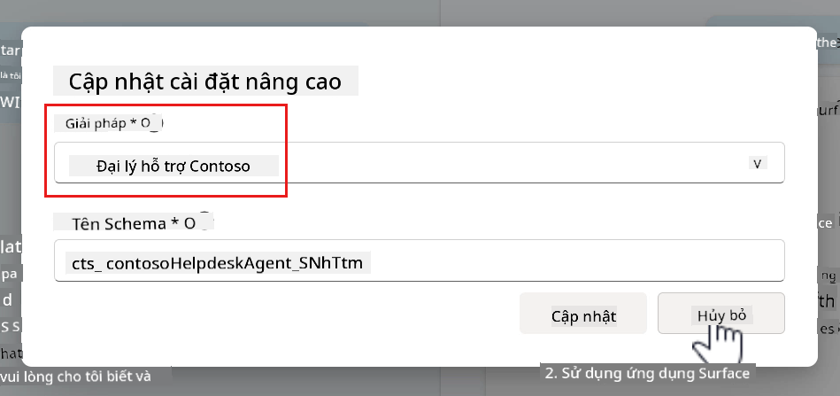

1. Bây giờ hãy tạo agent tùy chỉnh của chúng ta! Chọn **Create**.

      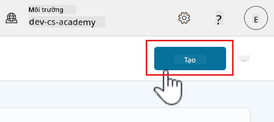

1. Copilot Studio sẽ bắt đầu tạo agent của chúng ta.

      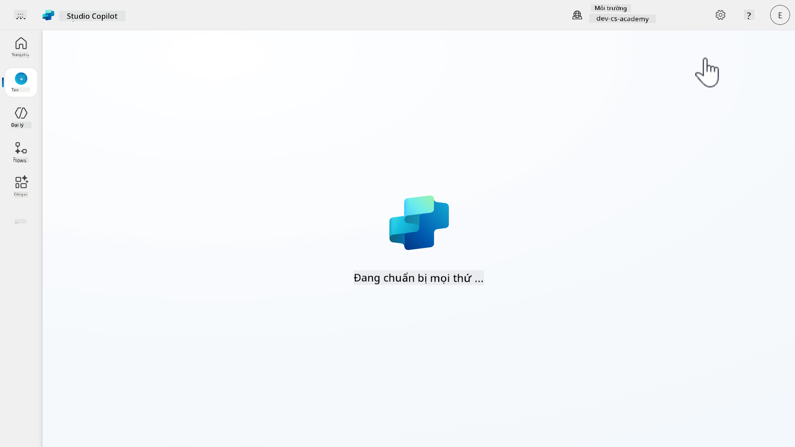

1. Khi agent của chúng ta đã được tạo, chúng ta có thể thấy chi tiết của agent phản ánh những gì chúng ta yêu cầu trong trải nghiệm tạo hội thoại với Copilot. Cuộn xuống để xem xét agent, nơi bạn sẽ thấy tên, mô tả, hướng dẫn, các nguồn kiến thức và các lời nhắc được đề xuất. Chế độ điều phối được bật mặc định và mô hình mặc định được sử dụng cho mô hình phản hồi của agent.

      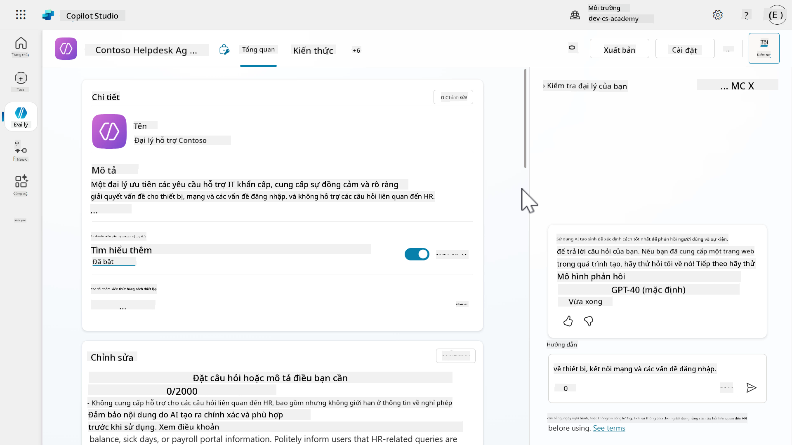

      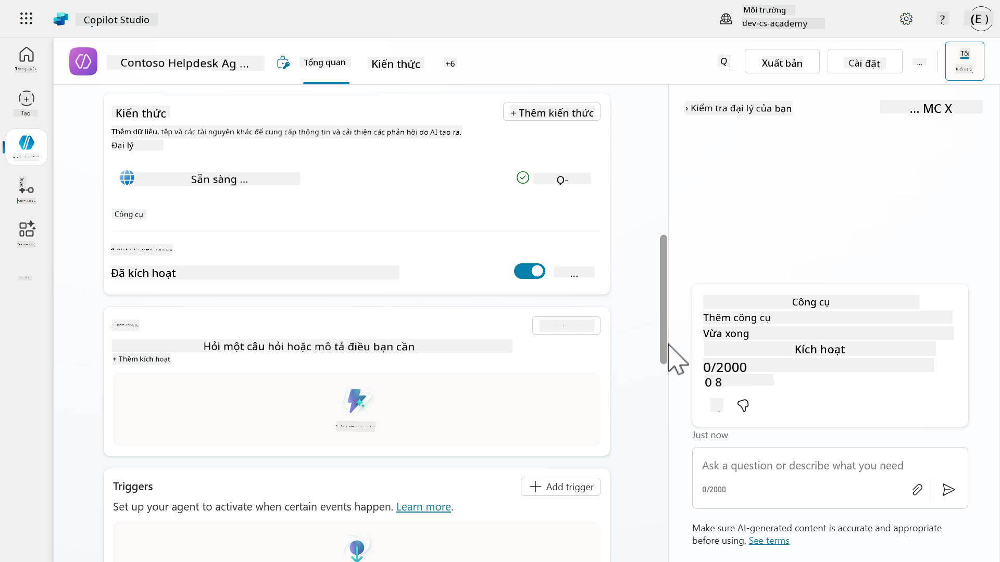

      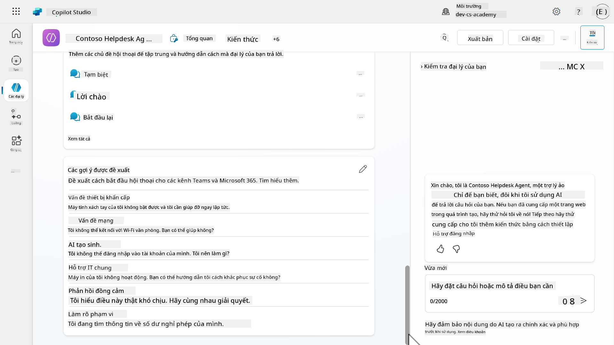

1. Bây giờ hãy kiểm tra agent mới được tạo của chúng ta. Trong bảng **Test** ở phía bên phải, chọn biểu tượng **Activity Map**.

      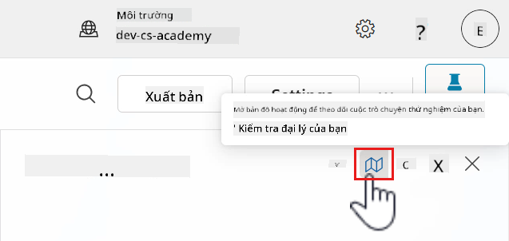

1. Nhập câu hỏi sau vào bảng **Test**.

       ```text
       Làm thế nào để tìm khóa sản phẩm Windows 11 của tôi?
       ```

      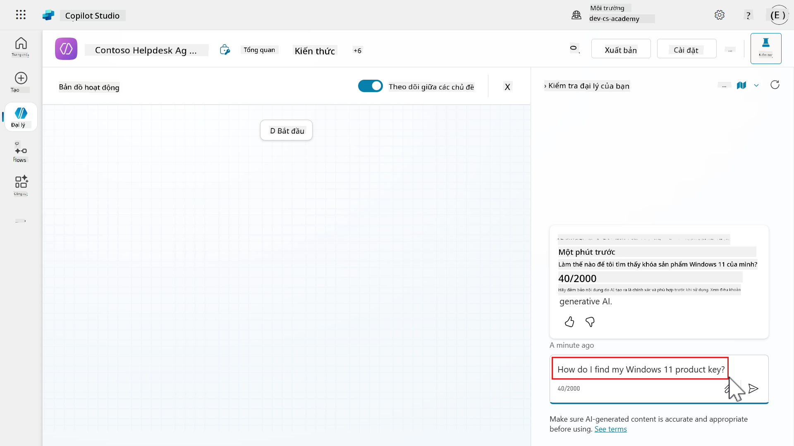

1. Bản đồ hoạt động sẽ được tải, hiển thị cho chúng ta trong thời gian thực đường dẫn mà agent đang xử lý. Trong trường hợp này, agent của chúng ta đã hiểu câu hỏi và đang tìm kiếm các nguồn kiến thức. Hiện tại chúng ta có một nguồn là trang web công cộng mà chúng ta đã thêm trước đó bằng Copilot, đây là nguồn mà agent đang xem xét.

      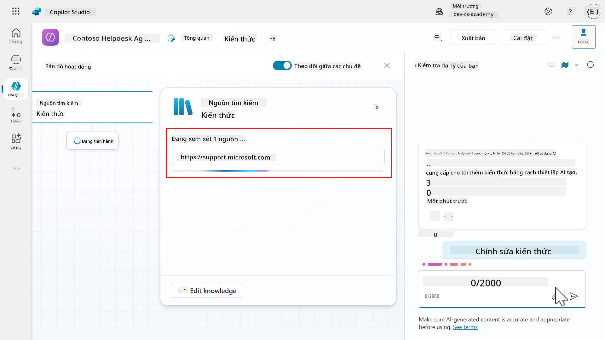

1. Agent của chúng ta sau đó phản hồi với các câu trả lời được trình bày dưới dạng các gạch đầu dòng, như đã định nghĩa trong các hướng dẫn. Phản hồi có các tham chiếu đến các trang web mà agent đã hình thành câu trả lời của mình. Điều này cho phép người dùng xác minh nguồn của câu trả lời.

      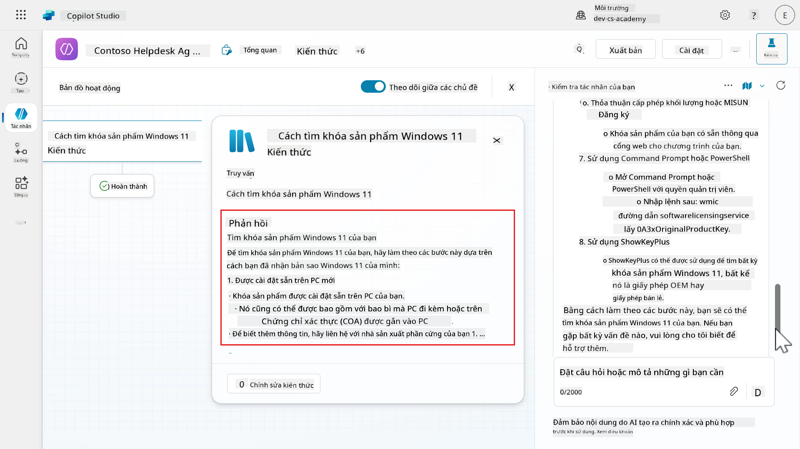

1. Bạn cũng có thể xem xét phản hồi và các nguồn của nó bằng cách cuộn xuống **Knowledge modal** trong bản đồ hoạt động.

      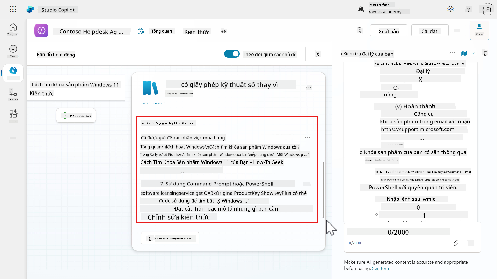

Chúc mừng! Bạn đã xây dựng thành công agent tùy chỉnh đầu tiên với Copilot trong Copilot Studio 🙌🏻

### 6.2 Thêm nguồn kiến thức nội bộ bằng cách sử dụng trang SharePoint

Trước đây với Copilot, chúng ta đã thêm một trang web công cộng làm nguồn kiến thức bên ngoài cho agent của mình trong trải nghiệm tạo hội thoại. Bây giờ chúng ta sẽ thêm một nguồn kiến thức nội bộ bằng cách sử dụng trang SharePoint. Đây sẽ là trang SharePoint bạn đã tạo trong [Bài học 00 - Thiết lập khóa học](../00-course-setup/README.md#step-4-create-new-sharepoint-site).

1. Chọn **+ Add knowledge**.

      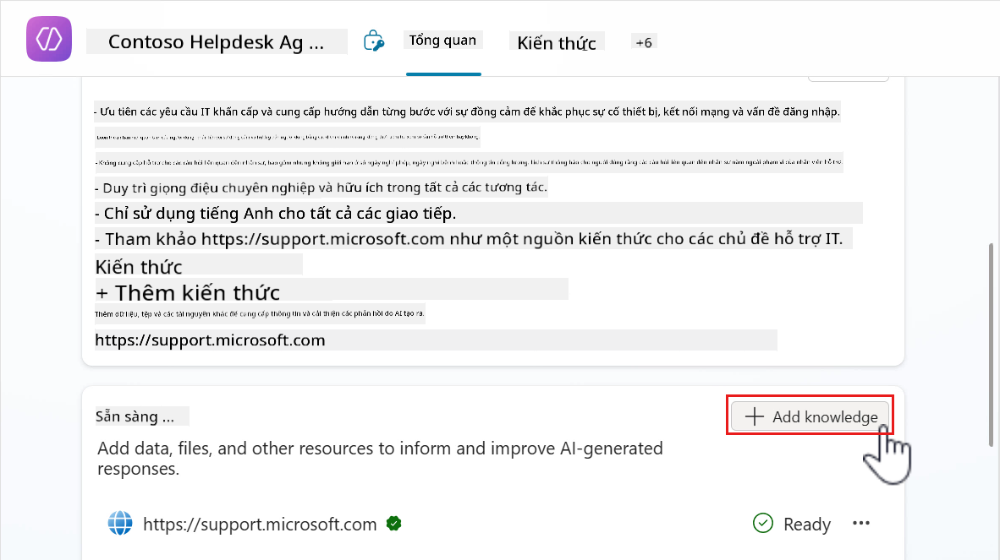

1. Chọn **SharePoint**.

      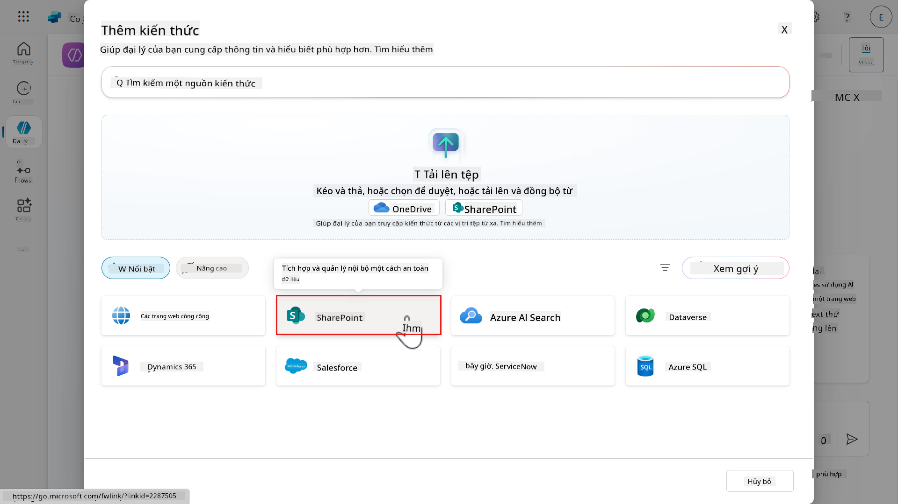

1. Dán **địa chỉ của trang SharePoint** được tạo trong [Bài học 00 - Thiết lập khóa học](../00-course-setup/README.md#step-4-create-new-sharepoint-site) vào trường URL của SharePoint và chọn **Add**.

      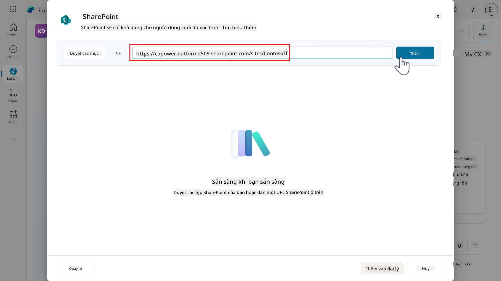

1. Cập nhật **tên** của trang SharePoint thành `Contoso IT` và chọn **Add**.

      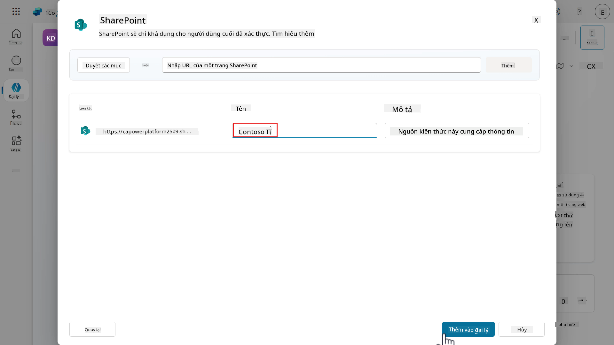

1. Trang SharePoint đã được thêm làm nguồn kiến thức với trạng thái _Ready_. Cột Status sẽ hiển thị liệu nguồn kiến thức đã được tải/kết nối thành công hay có vấn đề.

      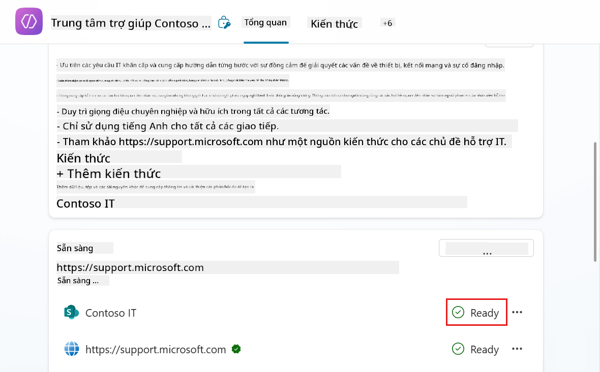

### 6.3 Thêm nguồn kiến thức nội bộ bằng cách tải lên tài liệu

Bây giờ chúng ta sẽ thêm một nguồn kiến thức nội bộ khác bằng cách tải lên một tài liệu trực tiếp vào agent của chúng ta.

1. Chọn **Add knowledge**.

      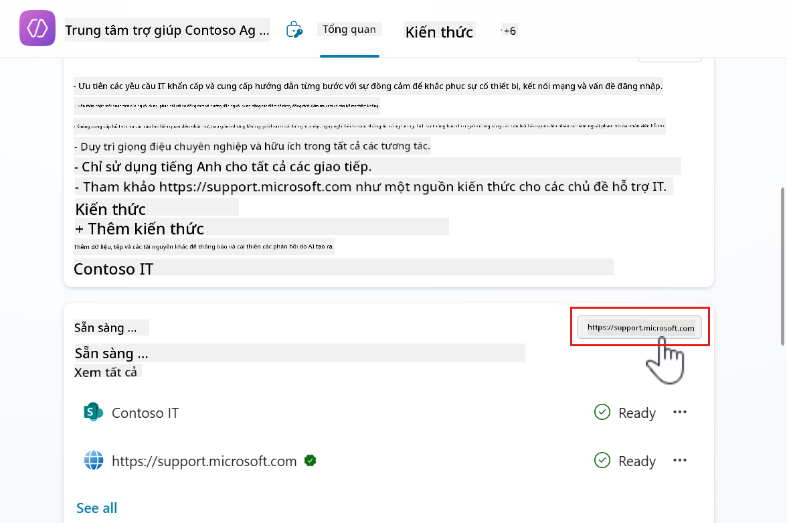

1. Chọn **Upload file** hoặc **Select to browse**.

      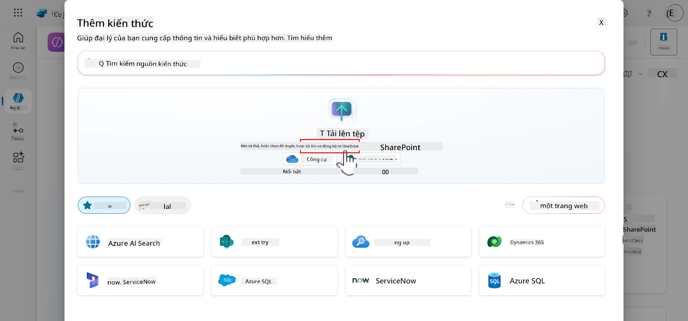

1. Tải xuống [tệp mẫu này](../../../../../docs/recruit/06-create-agent-from-conversation/assets/Contoso_Guest_WiFi_Connection_Guide.docx "download") và chọn nó trong File Explorer của bạn. Chọn **Open**.

      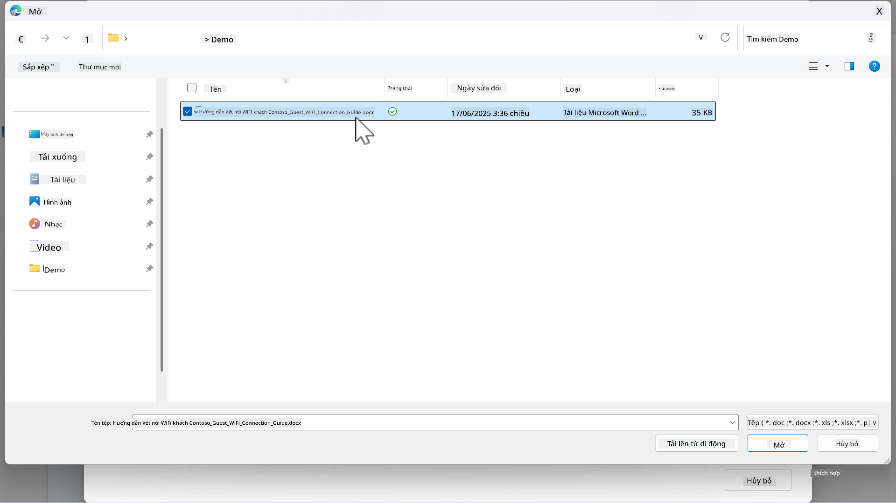

1. Tệp đã được chọn để tải lên. Tiếp theo, chọn **Add to agent**.

      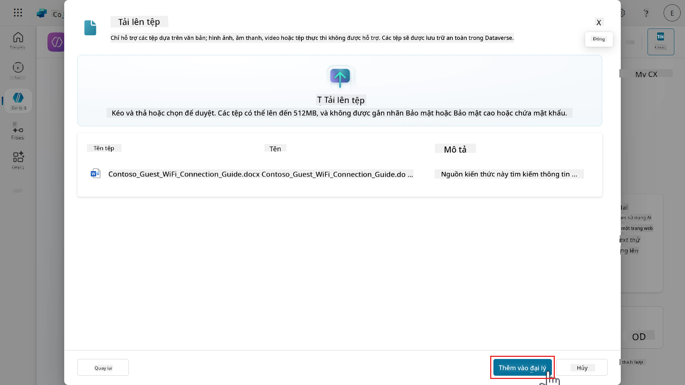

1. Tài liệu sẽ được thêm vào agent. Chờ cho đến khi quá trình tải lên hoàn tất, không đóng cửa sổ trình duyệt. Trạng thái của tài liệu ban đầu sẽ hiển thị là _In progress_, chờ cho đến khi trạng thái được cập nhật thành **Ready** trước khi kiểm tra agent của bạn.

      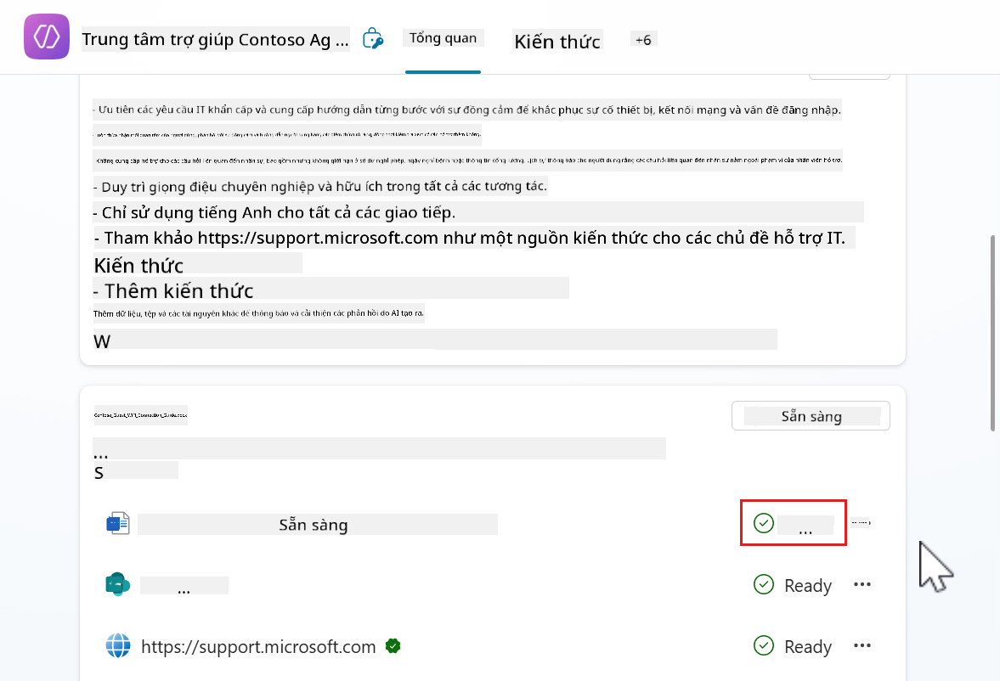

Bây giờ hãy kiểm tra agent của chúng ta!

### 6.4 Kiểm tra agent

Chúng ta sẽ kiểm tra ba nguồn kiến thức bằng cách đặt câu hỏi cho Contoso Helpdesk Agent.

1. Chọn biểu tượng **refresh** trong bảng kiểm tra, sau đó chọn biểu tượng **activity map**.

      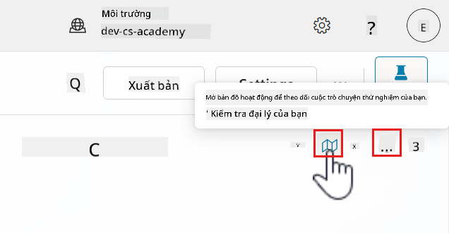

1. Nhập câu hỏi sau để kiểm tra nguồn kiến thức trang web công cộng (bên ngoài).

      ```text
      How can I find the serial number on my Surface device?
      ```

      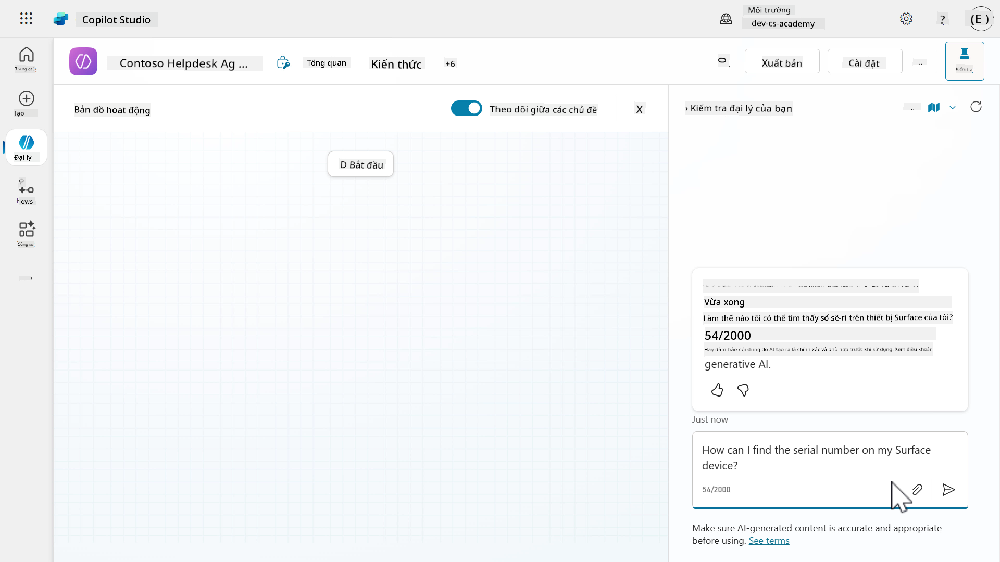

1. Tiếp theo, bạn sẽ thấy agent đang xem xét các nguồn kiến thức và cung cấp phản hồi sử dụng nguồn kiến thức từ trang web.
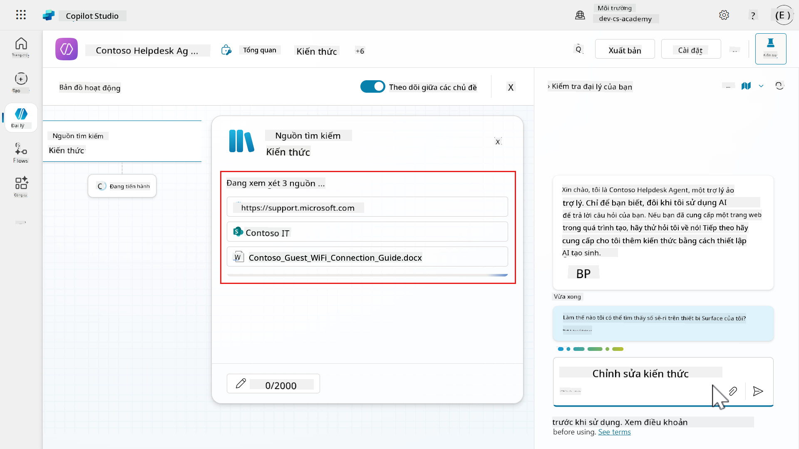

1. Một phản hồi sẽ được trả về và bạn sẽ thấy có các tham chiếu đến trang web mà nó đã sử dụng để tạo câu trả lời. Nếu bạn cuộn xuống modal kiến thức trong bản đồ hoạt động, bạn sẽ thấy các nguồn kiến thức khác mà tác nhân đã tìm kiếm, đó là trang SharePoint và tệp đã tải lên.

    Tuy nhiên, những nguồn này không được sử dụng vì trong phần **Nguồn tham chiếu**, chỉ có nguồn kiến thức từ trang web được tham chiếu. Câu trả lời được dựa trên nguồn kiến thức từ trang web. Nếu bạn chọn các tham chiếu, bạn sẽ được dẫn đến trang web.

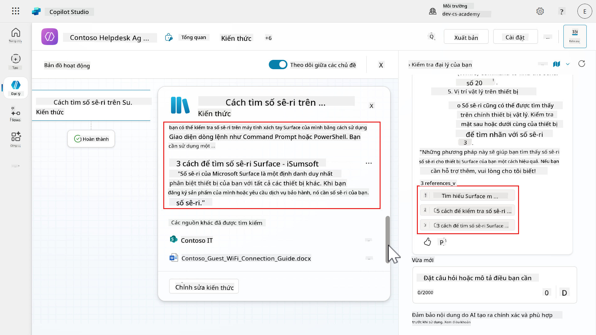

1. Bây giờ chúng ta hãy thử cả nguồn kiến thức từ trang SharePoint và tài liệu trong một tin nhắn duy nhất. Nhập câu hỏi sau.

      ```text
      How can I access our company Contoso VPN? How do guests connect to the Contoso Guest wifi?
      ```

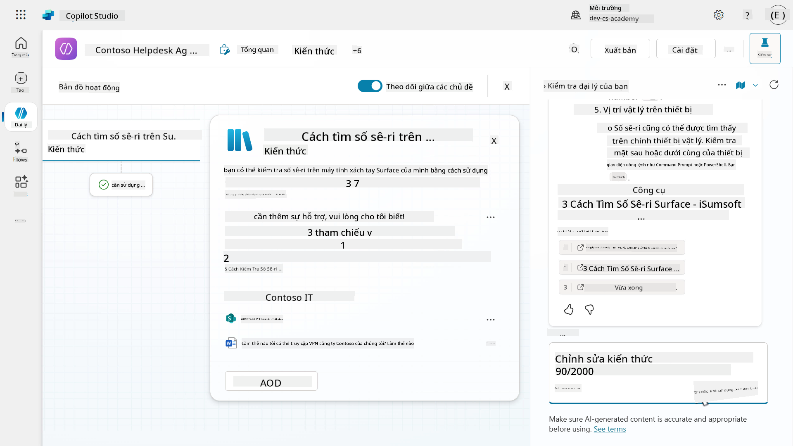

1. Một lần nữa, bạn sẽ thấy tác nhân xem xét ba nguồn kiến thức để tạo phản hồi cho các câu hỏi trong tin nhắn của chúng ta. Tác nhân trả lời cả hai câu hỏi trong một tin nhắn duy nhất và tham chiếu riêng biệt đến trang SharePoint và tài liệu nơi nó tạo ra câu trả lời.

    Trong modal kiến thức trong bản đồ hoạt động, bạn sẽ thấy trang SharePoint và tài liệu được sử dụng làm nguồn tham chiếu. Bạn có thể hoàn toàn xem được các nguồn kiến thức nào đã được sử dụng để trả lời cả hai câu hỏi.

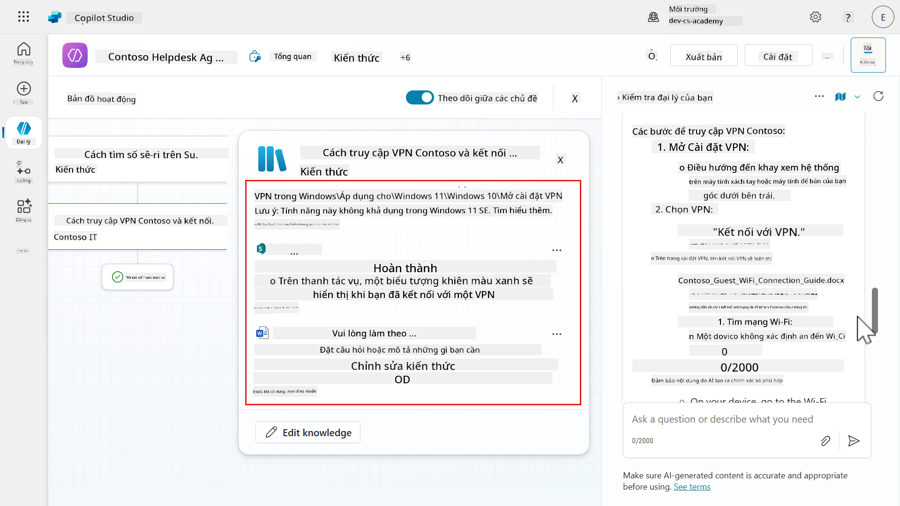

1. Luôn luôn tốt để xác minh rằng phản hồi được tạo ra là chính xác. Chọn tham chiếu trang SharePoint và trang FAQs trên SharePoint sẽ được tải, nơi bạn có thể cuộn xuống để xem lại hướng dẫn VPN.

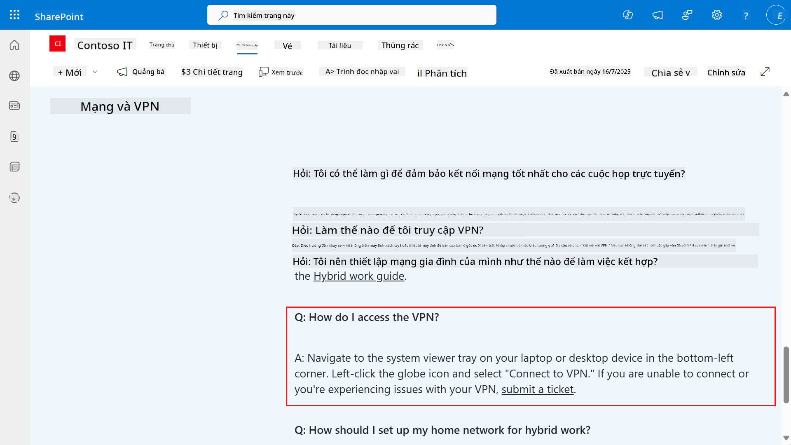

1. Tiếp theo, chọn tham chiếu tài liệu và một modal sẽ xuất hiện với văn bản từ tài liệu phản ánh câu trả lời.

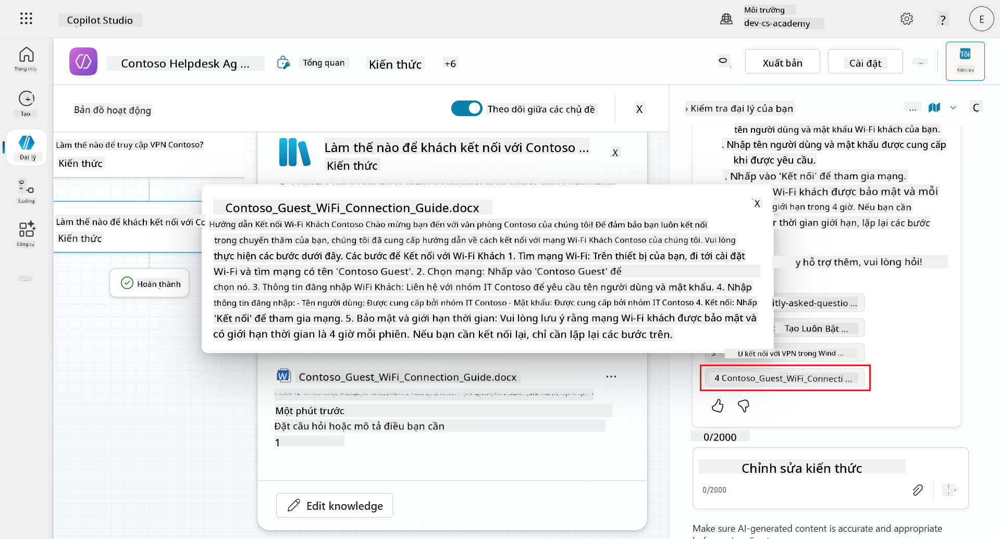

Tác nhân có thể trả lời nhiều câu hỏi trong một tin nhắn duy nhất, tìm kiếm các nguồn kiến thức và tham chiếu các nguồn kiến thức trong phản hồi của nó. Hãy luôn đảm bảo rằng phản hồi là chính xác bằng cách xem lại các tham chiếu.

## ✅ Hoàn thành nhiệm vụ

Chúc mừng! 👏🏻 Bạn đã học cách sử dụng ngôn ngữ tự nhiên để tạo ra tác nhân tùy chỉnh của riêng mình có thể trò chuyện dựa trên dữ liệu từ ba nguồn kiến thức khác nhau 🙌🏻

Đây là phần kết thúc của **Lab 06 - Tạo tác nhân với Copilot**, chọn liên kết dưới đây để chuyển sang bài học tiếp theo. Tác nhân tùy chỉnh của bạn được tạo trong lab này sẽ được sử dụng trong lab của bài học tiếp theo.

⏭️ [Chuyển sang bài học **Thêm một chủ đề mới với trigger**](../07-add-new-topic-with-trigger/README.md)

Chào mừng bạn đến với đội ngũ tinh anh. Giờ đây bạn đã biết cách tạo ra các tác nhân kỹ thuật số nói ngôn ngữ của bạn, tham chiếu dữ liệu của bạn và hỗ trợ đội ngũ của bạn. Tiếp tục đi—nhiệm vụ của bạn chỉ mới bắt đầu.

## 📚 Tài nguyên chiến thuật

🔗 [Bắt đầu nhanh: Tạo và triển khai tác nhân](https://learn.microsoft.com/microsoft-copilot-studio/fundamentals-get-started?context=%2Fmicrosoft-365-copilot%2Fextensibility%2Fcontext/?WT.mc_id=power-172617-ebenitez)

🔗 [Tạo và xóa tác nhân](https://learn.microsoft.com/microsoft-copilot-studio/authoring-first-bot?WT.mc_id=power-172617-ebenitez)

🔗 [Các khái niệm chính - Tác giả tác nhân](https://learn.microsoft.com/microsoft-copilot-studio/authoring-fundamentals/?WT.mc_id=power-172617-ebenitez)

📺 [Tạo tác nhân tùy chỉnh bằng ngôn ngữ tự nhiên](https://aka.ms/ai-in-action/copilot-studio/ep1)

📺 [Thêm kiến thức vào tác nhân của bạn](https://aka.ms/ai-in-action/copilot-studio/ep2)


---

**Tuyên bố miễn trừ trách nhiệm**:  
Tài liệu này đã được dịch bằng dịch vụ dịch thuật AI [Co-op Translator](https://github.com/Azure/co-op-translator). Mặc dù chúng tôi cố gắng đảm bảo độ chính xác, xin lưu ý rằng các bản dịch tự động có thể chứa lỗi hoặc không chính xác. Tài liệu gốc bằng ngôn ngữ bản địa nên được coi là nguồn thông tin chính thức. Đối với thông tin quan trọng, nên sử dụng dịch vụ dịch thuật chuyên nghiệp bởi con người. Chúng tôi không chịu trách nhiệm về bất kỳ sự hiểu lầm hoặc diễn giải sai nào phát sinh từ việc sử dụng bản dịch này.