<!--
CO_OP_TRANSLATOR_METADATA:
{
  "original_hash": "c04b3587170139bc23e3b5cfc24c89ac",
  "translation_date": "2025-10-20T00:34:55+00:00",
  "source_file": "docs/recruit/07-add-new-topic-with-trigger/README.md",
  "language_code": "vi"
}
-->
# 🚨 Nhiệm vụ 07: Thêm chủ đề mới với trigger và các node

## 🕵️‍♂️ MẬT DANH: `CHIẾN DỊCH GIỮ VỮNG CHỦ ĐỀ`

> **⏱️ Thời gian thực hiện chiến dịch:** `~60 phút`

🎥 **Xem video hướng dẫn**

[](https://www.youtube.com/watch?v=7iPAZaA8nJs "Xem hướng dẫn trên YouTube")

## 🎯 Tóm tắt nhiệm vụ

Bạn đã xây dựng một agent. Nó lắng nghe, học hỏi và trả lời câu hỏi - nhưng bây giờ là lúc để trở nên chiến lược hơn. Trong nhiệm vụ này, bạn sẽ đi sâu vào bên trong và dạy cho agent của mình cách phản hồi các yêu cầu cụ thể một cách chính xác.

Với Chủ đề và Trigger, agent của bạn có thể:

- Nhận diện ý định

- Điều hướng cuộc trò chuyện bằng logic

- Thu thập và lưu trữ biến

- Kích hoạt các luồng và thực hiện hành động

Bạn không chỉ xây dựng cuộc đối thoại, mà còn kết nối nó với trung tâm quyết định. Chào mừng bạn đến với Neural Nexus.

## 🔎 Mục tiêu

Trong nhiệm vụ này, bạn sẽ học:

1. Hiểu chủ đề là gì và vai trò của nó trong việc tạo ra các cuộc trò chuyện có cấu trúc cho agent của bạn
1. Tìm hiểu cấu trúc của chủ đề bao gồm các cụm từ kích hoạt và các node trong cuộc trò chuyện
1. Khám phá các loại node trong cuộc trò chuyện và cách sử dụng Power Fx để tạo logic động
1. Tạo các chủ đề tùy chỉnh từ đầu để xử lý các yêu cầu và nhiệm vụ cụ thể của người dùng
1. Xây dựng một chủ đề hoạt động kết nối với dữ liệu SharePoint bằng các công cụ và kết nối

## 🤔 Chủ đề là gì?

Chủ đề là một cuộc trò chuyện có cấu trúc giúp agent của bạn phản hồi các câu hỏi hoặc nhiệm vụ cụ thể của người dùng. Hãy nghĩ về một chủ đề như một cuộc trò chuyện nhỏ hoặc nhiệm vụ mà agent của bạn có thể xử lý. Mỗi chủ đề được thiết kế để phản hồi một câu hỏi hoặc yêu cầu cụ thể của người dùng.

### 🌌 Mục đích của chủ đề

Có ba mục đích phổ biến của các chủ đề dựa trên nhu cầu của người dùng:

**Thông tin** - trả lời các câu hỏi như:

- `Cái gì là …?`
- `Khi nào thì …?`
- `Tại sao …?`
- `Bạn có thể cho tôi biết …?`

**Hoàn thành nhiệm vụ** - giúp người dùng _thực hiện_ điều gì đó:

- `"Tôi muốn …"`
- `"Làm thế nào để tôi …?"`
- `"Tôi cần …?"`

**Khắc phục sự cố** - giải quyết vấn đề:

- `Có gì đó không hoạt động …`
- `Tôi gặp lỗi …`
- `Tôi thấy điều gì đó không mong đợi …?`

Bạn cũng có thể tạo các chủ đề cho các câu hỏi mơ hồ như `Tôi cần giúp đỡ`, yêu cầu người dùng cung cấp thêm chi tiết trước khi tiếp tục.

## 🐦 Tại sao các chủ đề hữu ích?

Chủ đề giúp bạn:

- Tổ chức kiến thức của agent.

- Làm cho cuộc trò chuyện trở nên tự nhiên.

- Giải quyết vấn đề của người dùng một cách hiệu quả.

## 🪺 Các loại chủ đề

1. **Chủ đề hệ thống** - được tích hợp sẵn và xử lý các sự kiện phổ biến như:
    - Bắt đầu cuộc trò chuyện
    - Kết thúc cuộc trò chuyện
    - Xử lý lỗi
    - Yêu cầu người dùng đăng nhập
    - Chuyển tiếp đến nhân viên hỗ trợ

1. **Chủ đề tùy chỉnh** - bạn tạo ra để xử lý các nhiệm vụ hoặc câu hỏi cụ thể như:
    - Yêu cầu nghỉ phép của nhân viên
    - Yêu cầu thiết bị mới hoặc thay thế

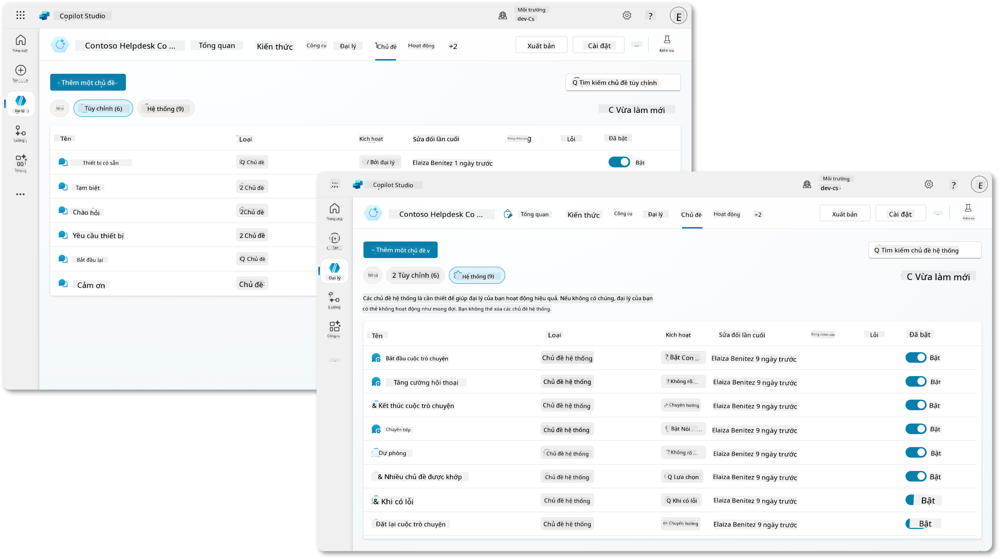

## 🧬 Cấu trúc của một chủ đề

Mỗi chủ đề thường bao gồm các thành phần sau.

### 🗣️ Cụm từ kích hoạt

Đây là những từ hoặc câu mà người dùng có thể nói để bắt đầu chủ đề.

**Ví dụ:**

Đối với chủ đề yêu cầu nghỉ phép, các cụm từ kích hoạt có thể là:

- `Tôi muốn xin nghỉ phép`
- `Yêu cầu nghỉ phép`
- `Đăng ký nghỉ`
- `Làm thế nào để tôi gửi yêu cầu nghỉ phép?`

Đối với chủ đề yêu cầu thiết bị, các cụm từ kích hoạt có thể là:

- `Tôi cần một thiết bị mới`
- `Tôi có thể yêu cầu một thiết bị không?`
- `Bạn có thể giúp tôi yêu cầu thiết bị không?`

### 💬 Các node trong cuộc trò chuyện

Một chủ đề được tạo thành từ các node, là các bước mà agent thực hiện khi chủ đề được kích hoạt. Bạn kết nối các bước này để xây dựng luồng cuộc trò chuyện mà agent của bạn sẽ theo khi tương tác với người dùng.

Hãy nghĩ về chúng như các hướng dẫn hoặc hành động như:

- Hỏi người dùng câu hỏi
- Gửi tin nhắn
- Gọi dịch vụ bên ngoài như hệ thống quản lý nghỉ phép
- Thiết lập hoặc kiểm tra các biến
- Sử dụng điều kiện để phân nhánh cuộc trò chuyện
- Chuyển hướng đến một chủ đề khác

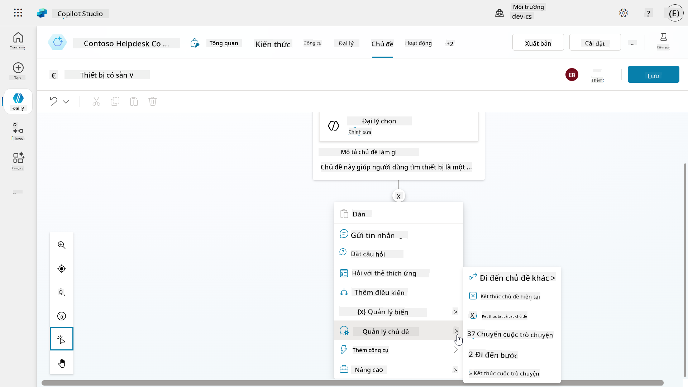

Dưới đây là các loại node chính mà bạn có thể thêm vào agent:

#### Gửi tin nhắn

- **Mục đích** - gửi tin nhắn đến người dùng.
- **Ví dụ** - `Cảm ơn bạn đã gửi yêu cầu! Tôi sẽ giúp bạn với điều đó.`

Node này cho phép agent của bạn gửi tin nhắn đến người dùng, có thể là văn bản đơn giản hoặc nội dung phong phú như hình ảnh, video, thẻ, trả lời nhanh và thẻ thích ứng.

Bạn có thể cá nhân hóa tin nhắn bằng cách sử dụng biến, thêm nhiều biến thể tin nhắn để tạo sự đa dạng, và thậm chí tùy chỉnh đầu ra giọng nói cho các kênh hỗ trợ giọng nói.

!!! tip
    Hãy nghĩ về nó như một khối "nói điều gì đó" giúp agent của bạn giao tiếp rõ ràng và tương tác với người dùng.

#### Hỏi một câu hỏi

- **Mục đích** - hỏi người dùng một câu hỏi và chờ câu trả lời của họ.
- **Ví dụ** - `Ngày nghỉ của bạn là ngày nào?`

Node này được sử dụng để hỏi người dùng thông tin cụ thể trong cuộc trò chuyện và lưu trữ câu trả lời của họ vào các biến để sử dụng sau này.

Bạn có thể tùy chỉnh loại câu hỏi như nhập văn bản hoặc sử dụng các thực thể cho danh sách giá trị được định nghĩa mà người dùng chọn, và xác định cách agent nên phản ứng nếu người dùng đưa ra câu trả lời không hợp lệ hoặc bỏ qua câu hỏi.

Nó cũng hỗ trợ nội dung phong phú như hình ảnh và trả lời nhanh, và cho phép bạn tinh chỉnh cài đặt xác thực, nhắc lại và gián đoạn để làm cho luồng cuộc trò chuyện diễn ra suôn sẻ.

!!! tip
    Hãy nghĩ về nó như một khối "hỏi và lắng nghe" giúp agent của bạn tương tác với người dùng một cách có cấu trúc mà bạn định nghĩa.

#### Hỏi với thẻ thích ứng

- **Mục đích** - gửi một thẻ tương tác phong phú bằng JSON.
- **Ví dụ** - một thẻ hiển thị bộ chọn ngày trên lịch để người dùng chọn ngày.

Node này hiển thị các thẻ tương tác phong phú mà người dùng có thể điền và gửi, chẳng hạn như biểu mẫu với hộp văn bản, nút và hình ảnh. Nó thu thập thông tin đầu vào của người dùng và lưu trữ trong các biến, mà agent của bạn có thể sử dụng sau này trong cuộc trò chuyện.

!!! tip
    Hãy nghĩ về nó như một khối "xây dựng biểu mẫu tùy chỉnh" giúp agent của bạn trở nên hấp dẫn hơn và có khả năng thu thập thông tin chi tiết từ người dùng.

#### Thêm điều kiện

- **Mục đích** - thêm logic vào cuộc trò chuyện. Nó kiểm tra điều gì đó và quyết định bước tiếp theo.
- **Ví dụ** - nếu người dùng nói `Có`, chuyển sang bước tiếp theo. Nếu `Không`, kết thúc cuộc trò chuyện.

Node này tạo các điểm quyết định trong luồng cuộc trò chuyện của agent bằng cách kiểm tra xem một biến có đáp ứng tiêu chí nhất định hay không. Dựa trên việc điều kiện đúng hay sai, agent sẽ theo các đường dẫn khác nhau.

!!! tip
    Hãy nghĩ về nó như một khối "nếu-thì" giúp agent của bạn đưa ra quyết định dựa trên đầu vào của người dùng hoặc dữ liệu được lưu trữ trong các biến.

#### Quản lý biến

- **Mục đích** - lưu trữ hoặc xóa thông tin (gọi là biến) trong cuộc trò chuyện.
- **Ví dụ** - lưu ngày mà người dùng đã chọn trong node Hỏi một câu hỏi hiển thị thẻ thích ứng.

Node này cho phép bạn lưu trữ và quản lý thông tin trong cuộc trò chuyện, có thể là tên, câu trả lời hoặc sở thích của người dùng. Bạn có thể sử dụng các loại biến khác nhau như văn bản, số hoặc ngày, và chúng có thể được áp dụng cho một chủ đề duy nhất, chia sẻ giữa các chủ đề (toàn cục), hoặc thậm chí được lấy từ hệ thống hoặc môi trường.

!!! tip
    Hãy nghĩ về nó như một "hộp ký ức" giúp agent của bạn nhớ thông tin và sử dụng chúng khi cuộc trò chuyện tiếp tục với người dùng.

#### Quản lý chủ đề

- **Mục đích** - chuyển cuộc trò chuyện sang một chủ đề khác hoặc bước trong chủ đề, chuyển tiếp cuộc trò chuyện, hoặc kết thúc chủ đề hoặc cuộc trò chuyện.
- **Ví dụ** - chuyển hướng đến chủ đề "Chính sách nghỉ phép".

Node này cho phép agent của bạn chuyển từ một chủ đề sang chủ đề khác mà không cần khởi động lại cuộc trò chuyện, kết thúc chủ đề, chuyển tiếp hoặc kết thúc cuộc trò chuyện, hoặc đi đến một bước khác trong cùng một chủ đề. Nó giúp hướng dẫn người dùng qua các phần khác nhau của luồng cuộc trò chuyện bằng cách chuyển đổi mượt mà giữa các chủ đề, và bạn có thể truyền biến giữa chúng để giữ ngữ cảnh.

!!! tip
    Hãy nghĩ về nó như một khối "đi đến phần/bước khác" giúp agent của bạn linh hoạt trong việc trò chuyện với người dùng.

#### Thêm công cụ

- **Mục đích** - kết nối với các công cụ như connectors, agent flows, prompts, custom search, search query, skills, model context protocol.
- **Ví dụ** - Luồng agent được thực hiện sau khi người dùng gửi yêu cầu nghỉ phép.

Node này cung cấp cho agent của bạn khả năng tương tác với các hệ thống bên ngoài hoặc thực hiện các nhiệm vụ cụ thể, chẳng hạn như gửi email, kiểm tra thời tiết, hoặc truy cập cơ sở dữ liệu. Bạn có thể thêm các công cụ bằng cách sử dụng các connectors tích hợp sẵn, API tùy chỉnh, agent flows, prompts, hoặc kết nối với các máy chủ Model Context Protocol (MCP), và thậm chí là tự động hóa giao diện người dùng đồ họa cho các ứng dụng máy tính.

!!! tip
    Hãy nghĩ về các công cụ như các "khối hành động" giúp agent của bạn có siêu năng lực để thực hiện các việc ngoài _trò chuyện_, chẳng hạn như gọi API, chạy quy trình, hoặc tự động thu thập thông tin từ người dùng.

#### Node trả lời tự động

- **Mục đích** - sử dụng mô hình ngôn ngữ lớn để tạo ra các phản hồi tự nhiên, giống con người dựa trên câu hỏi của người dùng và bất kỳ dữ liệu nào được kết nối.
- **Ví dụ** - sử dụng nguồn kiến thức được kết nối chứa thông tin về quyền nghỉ phép để trả lời câu hỏi của người dùng liên quan đến yêu cầu nghỉ phép.

Node này cho phép agent của bạn phản hồi câu hỏi của người dùng bằng cách sử dụng thông tin từ các nguồn kiến thức khác nhau, như trang web, tài liệu, SharePoint, hoặc dữ liệu tùy chỉnh. Nó có thể được sử dụng như một phương án dự phòng khi không tìm thấy chủ đề phù hợp, hoặc trong một chủ đề để cung cấp các câu trả lời chi tiết, động dựa trên các nguồn cụ thể mà bạn đã cấu hình cho agent sử dụng.

!!! tip
    Hãy nghĩ về nó như một khối "trả lời thông minh" giúp agent của bạn cung cấp các phản hồi hữu ích, chính xác bằng cách tìm kiếm nội dung đáng tin cậy mà bạn đã định nghĩa.

#### Node yêu cầu HTTP

- **Mục đích** - kết nối agent của bạn với các hệ thống bên ngoài bằng cách gửi các yêu cầu API (ví dụ `GET` hoặc `POST`) để lấy hoặc cập nhật dữ liệu.
- **Ví dụ** - khi người dùng hỏi về số ngày nghỉ còn lại, agent thực hiện yêu cầu `GET` đến hệ thống quản lý nghỉ phép và trích xuất `remainingLeaveDays` từ phản hồi API và trả lời người dùng với giá trị đó.

Node này cho phép agent của bạn kết nối với các hệ thống bên ngoài bằng cách gửi các yêu cầu REST API, như `GET` hoặc `POST`. Bạn có thể tùy chỉnh yêu cầu với các header, nội dung body, và thậm chí sử dụng Power Fx để bao gồm dữ liệu động, sau đó lưu trữ phản hồi trong các biến để sử dụng sau này trong cuộc trò chuyện.

!!! tip
    Hãy nghĩ về nó như một khối "tìm kiếm và lấy thông tin" giúp agent của bạn giao tiếp với các dịch vụ khác như truy xuất thông tin người dùng hoặc gửi dữ liệu đến hệ thống khác.

#### Gửi một sự kiện

- **Mục đích** - cho phép agent của bạn gửi các hành động không phải tin nhắn, chẳng hạn như cập nhật hệ thống hoặc kích hoạt công cụ - đến client hoặc kênh, giúp nó thực hiện các nhiệm vụ.
- **Ví dụ** - phản ứng khi người dùng tham gia cuộc trò chuyện bằng cách hiển thị một tin nhắn chào mừng.

Node này cho phép agent của bạn gửi các hành động không phải tin nhắn đến các hệ thống hoặc kênh bên ngoài, sau đó quyết định cách phản hồi. Bạn đặt tên cho mỗi sự kiện và gắn giá trị, có thể là một số hoặc văn bản đơn giản, một biến, hoặc một công thức Power Fx, và nó được gửi dưới dạng một đối tượng JSON.

!!! tip
    Hãy nghĩ về nó như một khối "kích hoạt âm thầm" giúp agent của bạn thực hiện các việc phía sau hoặc giao tiếp với các công cụ bên ngoài mà không cần người dùng nói gì.

## 🏋🏻‍♀️ Sử dụng Power Fx trong các node của bạn

Trong Copilot Studio, Power Fx là một ngôn ngữ lập trình low-code được sử dụng để thêm logic và hành vi động vào agent của bạn. Đây là ngôn ngữ tương tự được sử dụng trong Microsoft Power Apps, và được thiết kế đơn giản và giống như Excel, giúp dễ dàng cho cả nhà phát triển và người không chuyên.

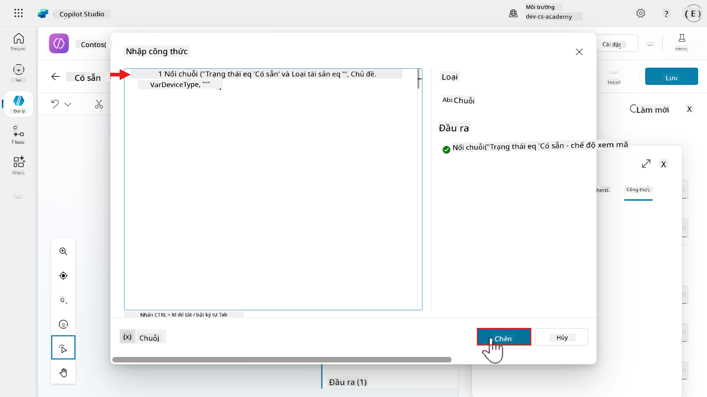

### Những gì Power Fx có thể làm trong các chủ đề

- Thiết lập và thao tác biến
      - Ví dụ: `Set(userName, "Adele Vance")`
- Tạo điều kiện
      - Ví dụ: `If(score > 80, "Pass", "Fail")`
- Định dạng và chuyển đổi dữ liệu
      - Ví dụ: `Text(DateValue, "dd/mm/yyyy")`

### Tại sao sử dụng Power Fx?

- **Linh hoạt:** bạn có thể xây dựng logic mà không cần viết toàn bộ dòng mã.

- **Quen thuộc:** nếu bạn đã sử dụng công thức Excel, nó sẽ rất giống.

- **Mạnh mẽ:** nó cho phép bạn cá nhân hóa cuộc trò chuyện, xác thực đầu vào, và kiểm soát cách agent của bạn hoạt động dựa trên dữ liệu người dùng.

## 🏗️ Làm thế nào để tạo và chỉnh sửa chủ đề?

Có hai cách bạn có thể tạo và chỉnh sửa các chủ đề cho agent của mình.

### 1. Tạo từ đầu

Điều này cho phép bạn xây dựng các luồng cuộc trò chuyện tùy chỉnh từ đầu, và bạn có thể thêm hoặc xóa các node khi chỉnh sửa chủ đề.

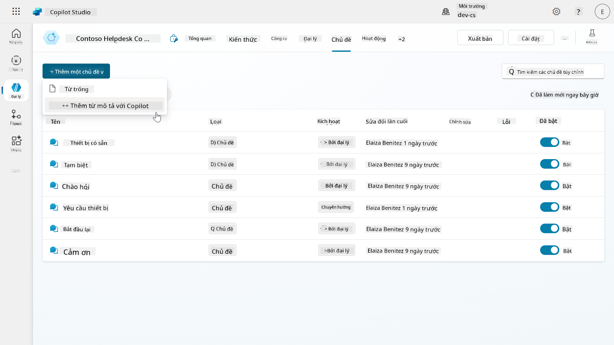

#### Tại sao điều này hữu ích

- Nó cho bạn toàn quyền kiểm soát cách agent của bạn phản hồi.
- Bạn có thể tùy chỉnh logic bằng cách sử dụng biến, Power Fx, và điều kiện.
- Nó hoàn hảo để xây dựng các trải nghiệm được thiết kế riêng cho các nhu cầu kinh doanh cụ thể.

### 2. Tạo với Copilot
Điều này cho phép bạn mô tả những gì bạn muốn bằng ngôn ngữ tự nhiên, và Copilot sẽ xây dựng cuộc hội thoại cho bạn. Điều tương tự cũng áp dụng khi chỉnh sửa chủ đề của bạn, sử dụng ngôn ngữ tự nhiên và Copilot sẽ xem xét và chỉnh sửa chủ đề cho bạn.

#### Những gì Copilot hỗ trợ

- Có thể tạo và chỉnh sửa:
      - Nút tin nhắn
      - Nút câu hỏi
      - Nút điều kiện
- Không hỗ trợ các cài đặt nâng cao như cách nhắc lại người dùng nếu họ không phản hồi hoặc cách quản lý gián đoạn trong quá trình hỏi. Bạn vẫn có thể điều chỉnh các cài đặt đó thủ công nếu cần.

#### Tại sao điều này hữu ích

- Tăng tốc phát triển với sự hỗ trợ của AI.
- Giúp bạn tập trung vào logic và trải nghiệm người dùng thay vì thiết lập lặp đi lặp lại.
- Dễ dàng cải thiện và điều chỉnh luồng hội thoại với ít nỗ lực.

#### ✨ Ví dụ về lời nhắc

- **Tạo một chủ đề**
      - `Chấp nhận tên, tuổi và ngày sinh của người dùng, sau đó lặp lại câu trả lời của họ`
      - `Thu thập địa chỉ đường phố, tiểu bang và mã bưu điện của người dùng. Người dùng nên có thể thử lại mỗi câu hỏi tối đa 4 lần`

- **Chỉnh sửa một chủ đề**
      - `Thêm một câu hỏi hỏi ngày sinh của người dùng`
      - `Tóm tắt thông tin đã thu thập trong một Adaptive Card.`

## 👩🏻‍🎨 Được rồi, làm thế nào để tôi thiết kế các chủ đề cho trợ lý của mình?

### 🧙🏻‍♂️ Bước 1 - Hiểu nhu cầu của người dùng

Bắt đầu bằng cách xác định các câu hỏi hoặc nhiệm vụ phổ biến mà người dùng sẽ hỏi trợ lý của bạn. Những điều này có thể là:

- Các câu hỏi mà người dùng thường hỏi như, `quyền lợi nghỉ ốm của tôi là gì?`
- Các nhiệm vụ phổ biến mà người dùng muốn hoàn thành như gửi một biểu mẫu
- Các vấn đề mà người dùng thường gặp phải như vấn đề đăng nhập

### 📦 Bước 2 - Nhóm các kịch bản

Tổ chức nhu cầu của người dùng thành ba loại dựa trên những gì chúng ta đã học trước đó - mục đích của một chủ đề:

- Thông tin - người dùng muốn biết điều gì đó
- Hoàn thành nhiệm vụ - người dùng muốn làm điều gì đó
- Khắc phục sự cố - người dùng cần giúp đỡ để giải quyết một vấn đề

### 🗺️ Bước 3 - Lập bản đồ cuộc hội thoại

Phác thảo một luồng hội thoại đơn giản về cách trợ lý nên phản hồi

- Bắt đầu bằng lời chào hoặc xác nhận
- Đặt câu hỏi tiếp theo để lấy thông tin chi tiết
- Cung cấp câu trả lời hoặc thực hiện hành động

!!! tip
    Giữ cuộc hội thoại ngắn gọn và tập trung. Chỉ hỏi những gì cần thiết.

### 🔀 Bước 4 - Xử lý các loại hội thoại khác nhau

Thiết kế cho cả:

- **Một lượt** - một câu hỏi, một câu trả lời

- **Nhiều lượt** - một cuộc hội thoại qua lại với các câu hỏi tiếp theo

Ví dụ:

- Người dùng: `Tôi muốn xin nghỉ phép.`

- Trợ lý: `Được thôi! Bạn muốn nghỉ từ ngày nào?`

- Người dùng: `Ngày 15 tháng 7`

- Trợ lý: `Hiểu rồi. Và bạn sẽ nghỉ đến ngày nào?`

- Người dùng: `Ngày 22 tháng 7.`

- Trợ lý: `Cảm ơn! Lý do nghỉ phép của bạn là gì?`

- Người dùng: `Kỳ nghỉ gia đình.`

- Trợ lý: `Cảm ơn thông tin chi tiết. Tôi đã gửi yêu cầu nghỉ phép của bạn từ ngày 15 tháng 7 đến ngày 22 tháng 7 cho kỳ nghỉ gia đình. Bạn sẽ nhận được xác nhận sớm.`

### 🤖 Bước 5 - Sử dụng AI cho các câu hỏi không mong đợi

Ngay cả khi bạn đã thiết kế một chủ đề cho yêu cầu nghỉ phép, người dùng có thể hỏi những câu hỏi không được bao phủ trực tiếp. Đây là lúc các tính năng AI như chủ đề hệ thống _Tăng cường hội thoại_ trở nên hữu ích.

Chủ đề này bao gồm một nút câu trả lời sinh động, cho phép trợ lý của bạn bắt đầu sử dụng các nguồn kiến thức được kết nối ngay lập tức. Bất kỳ nguồn kiến thức nào được thêm vào ở cấp độ trợ lý đều tự động được bao gồm trong nút câu trả lời sinh động trong chủ đề hệ thống _Tăng cường hội thoại_.

#### Ví dụ

- Người dùng: `Tôi có thể chuyển ngày nghỉ chưa sử dụng sang năm sau không?`

Câu hỏi này có thể không nằm trong luồng chủ đề được định trước của bạn, đặc biệt nếu chủ đề của bạn chỉ xử lý việc gửi yêu cầu nghỉ phép.

#### Cách AI giúp đỡ

Nếu trợ lý của bạn được kết nối với các tài liệu chính sách nhân sự của công ty hoặc trang web nội bộ, AI có thể:

- Tìm kiếm chính sách nghỉ phép liên quan
- Hiểu và tóm tắt các quy định
- Trợ lý phản hồi: `Theo chính sách nhân sự, bạn có thể chuyển ngày nghỉ chưa sử dụng sang năm tiếp theo. Để biết thêm chi tiết, hãy kiểm tra phần chính sách nghỉ phép trên cổng thông tin nhân sự.`

#### Tại sao điều này hữu ích

- Bạn không cần phải tạo thủ công một chủ đề cho mọi câu hỏi liên quan đến chính sách.
- AI có thể lấy câu trả lời chính xác từ các nguồn kiến thức đáng tin cậy.
- Cải thiện trải nghiệm người dùng bằng cách làm cho trợ lý trở nên thông minh và phản hồi nhanh hơn.

### 🔬 Bước 6 - Kiểm tra chủ đề, luồng hội thoại

Trước khi xuất bản chủ đề của bạn:

- Kiểm tra bằng các câu hỏi thực tế hoặc các đầu vào mẫu thực tế.
- Đảm bảo rằng nó nghe tự nhiên và hữu ích.

!!! tip
    Áp dụng các cải tiến cho chủ đề của bạn khi kiểm tra, chẳng hạn như thêm nhiều nút hoặc loại bỏ các nút để chuyển hướng sang một chủ đề khác.

### ⚠️ Bước 7 - Tránh sao chép nội dung trang web

Đừng sao chép những gì đã có trên trang web của bạn.

- Tập trung vào các chủ đề mà người dùng thường hỏi.
- Thêm các chủ đề mới dựa trên lịch sử trò chuyện hoặc yêu cầu hỗ trợ.

### ✨ Ví dụ về luồng hội thoại

Dưới đây là một ví dụ về một chủ đề xử lý yêu cầu nghỉ phép.

#### Bước 1: Cụm từ kích hoạt

Người dùng nhập,

`Tôi muốn yêu cầu nghỉ phép`

#### Bước 2: Trợ lý yêu cầu thông tin chi tiết bằng một Adaptive card

Trợ lý hỏi,

`Được thôi! Bạn muốn nghỉ từ ngày nào đến ngày nào?`

Adaptive card có bộ chọn ngày bắt đầu và ngày kết thúc.

#### Bước 3: Người dùng cung cấp ngày

Người dùng chọn ngày bắt đầu là ngày 5 tháng 8 năm 2025 và ngày kết thúc là ngày 10 tháng 8 năm 2025, sau đó gửi thẻ. Các giá trị ngày được lưu trữ trong đầu ra của Adaptive card dưới dạng biến.

#### Bước 4: Thực hiện luồng đám mây

Một luồng đám mây Power Automate đã được thực hiện để tạo một yêu cầu mới trong hệ thống quản lý nghỉ phép và gửi email thông báo cho quản lý về yêu cầu nghỉ phép.

#### Bước 5: Gửi tin nhắn xác nhận cho người dùng

Trợ lý phản hồi,

`Yêu cầu nghỉ phép của bạn từ ngày 5 tháng 8 đến ngày 10 tháng 8 đã được gửi. Quản lý của bạn sẽ xem xét và phản hồi lại cho bạn sớm.`

## 🧪 Bài thực hành 07 - Thêm một chủ đề mới với các nút hội thoại

Bây giờ chúng ta sẽ học cách thêm một chủ đề mới với một cụm từ kích hoạt và các công cụ. Bài thực hành này sẽ bao gồm việc tạo một chủ đề từ đầu để bạn hiểu cách tùy chỉnh chủ đề theo nhu cầu của mình.

- [7.1 Thêm một chủ đề mới từ đầu](../../../../../docs/recruit/07-add-new-topic-with-trigger)
- [7.2 Xác định các đầu vào và đầu ra của cụm từ kích hoạt](../../../../../docs/recruit/07-add-new-topic-with-trigger)
- [7.3 Thêm một công cụ bằng cách sử dụng connector](../../../../../docs/recruit/07-add-new-topic-with-trigger)

### ✨ Trường hợp sử dụng

**Là một** nhân viên

**Tôi muốn** biết những thiết bị nào có sẵn

**Để tôi** có danh sách các thiết bị có sẵn

Hãy bắt đầu nào!

### Yêu cầu trước

1. **Danh sách SharePoint**

    Chúng ta sẽ sử dụng danh sách **Devices** trên SharePoint từ [Bài học 00 - Thiết lập khóa học - Bước 3: Tạo trang SharePoint mới](../00-course-setup/README.md#step-4-create-new-sharepoint-site).

    Nếu bạn chưa thiết lập danh sách **Devices** trên SharePoint, vui lòng quay lại [Bài học 00 - Thiết lập khóa học - Bước 3: Tạo trang SharePoint mới](../00-course-setup/README.md#step-4-create-new-sharepoint-site).

1. **Trợ lý hỗ trợ Contoso**

    Chúng ta sẽ sử dụng cùng trợ lý đã được tạo trước đó trong [Bài học 06 - Tạo một trợ lý tùy chỉnh bằng ngôn ngữ tự nhiên với Copilot và kết nối với dữ liệu của bạn](../06-create-agent-from-conversation/README.md).

### 7.1 Thêm một chủ đề mới từ đầu

1. Chọn **tab Chủ đề** gần tên của trợ lý. Nếu bạn không thấy nó hiển thị, chọn **+6** và bạn sẽ thấy **Chủ đề** được liệt kê.

    

1. Tab **Chủ đề** sẽ tải và mặc định hiển thị các chủ đề _Tùy chỉnh_. Bạn có thể lọc các chủ đề theo Tất cả, Tùy chỉnh và Hệ thống. Các chủ đề tùy chỉnh và hệ thống mà bạn hiện thấy đã được tạo tự động khi trợ lý được cung cấp.

    Chọn **+ Thêm một chủ đề** và chọn **Từ đầu**.

    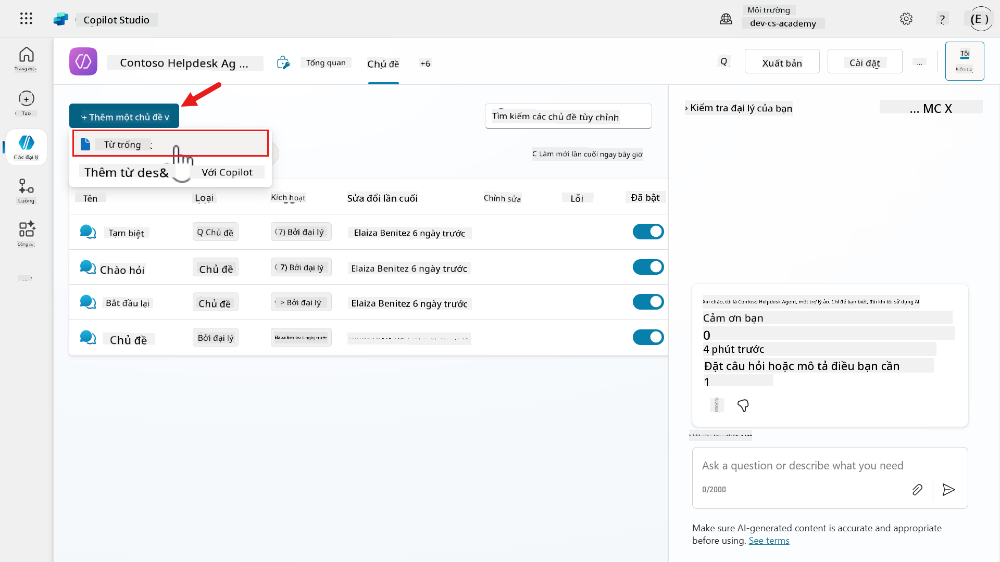

1. Nhập tên cho chủ đề. Sao chép và dán nội dung sau.

    ```text
    Available devices
    ```

    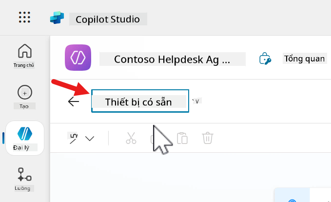

1. Nhập mô tả cụm từ kích hoạt để nêu rõ chủ đề làm gì. Sao chép và dán nội dung sau.

    ```text
    This topic helps users find devices that are available from our SharePoint Devices list. User can ask to see available devices and it will return a list of devices that are available which can include laptops, smartphones, accessories and more.
    ```

    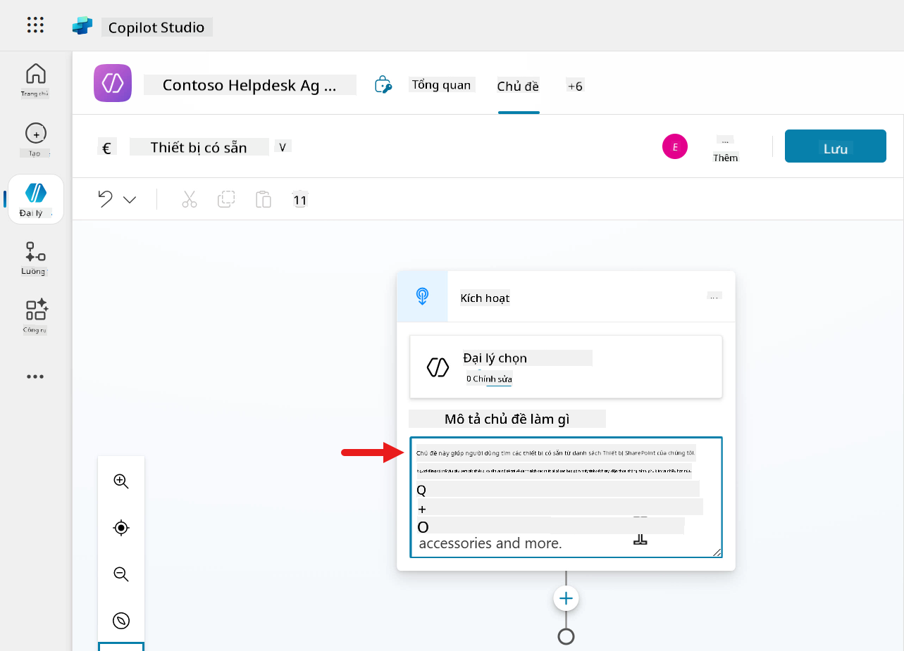

### 7.2 Xác định các đầu vào và đầu ra của cụm từ kích hoạt

1. Tiếp theo, chúng ta sẽ thêm một biến đầu vào mới mà AI sinh động sẽ sử dụng trong việc điều phối để trích xuất giá trị loại thiết bị từ tin nhắn của người dùng. Chọn **Dấu ba chấm (...)** trong chủ đề và chọn **Chi tiết** để xem bảng chi tiết chủ đề.

    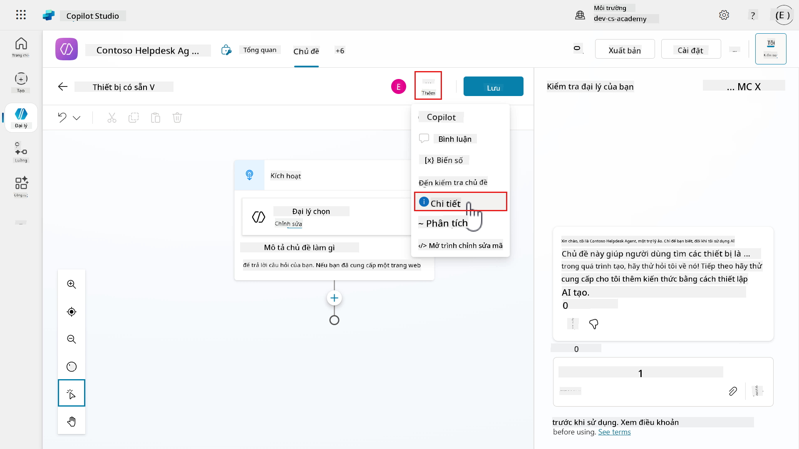

1. Bảng **Chi tiết Chủ đề** đã được tải. Chọn tab **Đầu vào**.

    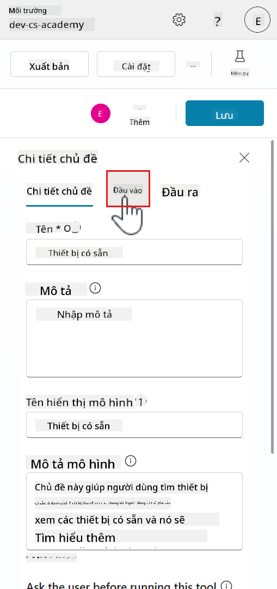

1. Chọn **Tạo một biến mới**.

    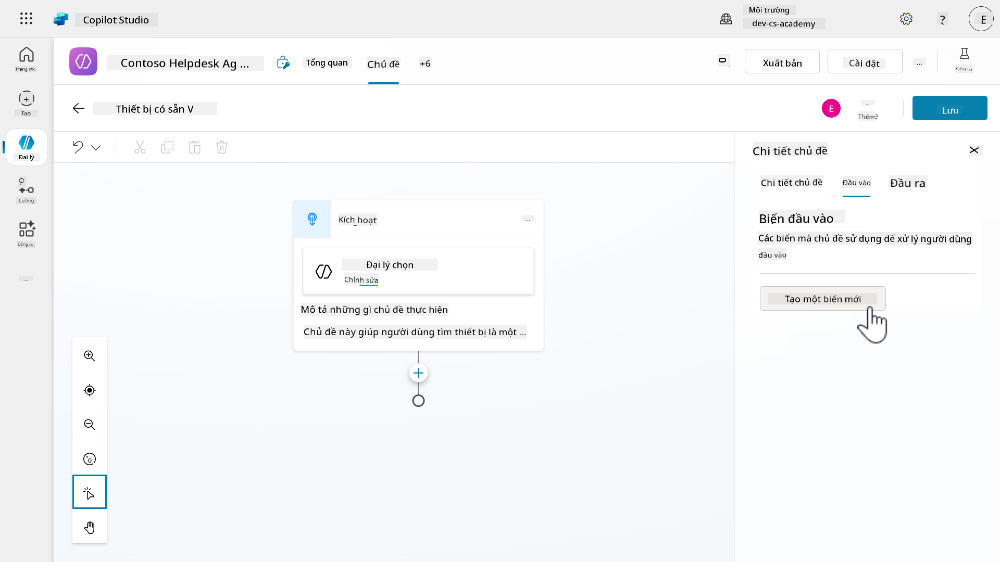

1. Nhập tên cho biến. Sao chép và dán nội dung sau.

    ```text
    VarDeviceType
    ```

    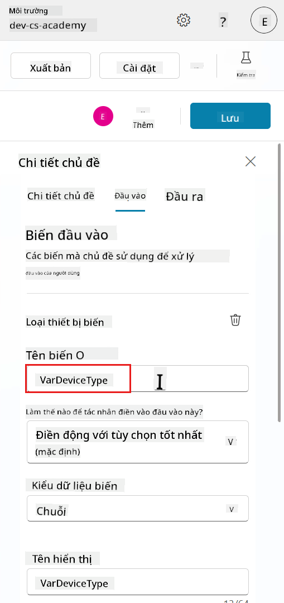

1. Bây giờ chúng ta cần xác định các biến đầu vào và đầu ra. Dưới đây là các thuộc tính có thể được xác định cho các đầu vào và đầu ra của chủ đề.

    | Trường    | Giá trị |
    | ---------- | :--------- |
    | Làm thế nào để trợ lý điền vào đầu vào này? | Xác định cách trợ lý điền vào biến này với một giá trị trước khi chạy chủ đề. Mặc định được đặt là _Điền động với tùy chọn tốt nhất_. Nếu không, bạn có thể ghi đè đầu vào bằng một giá trị thay vì hỏi người dùng|
    | Loại dữ liệu biến  | Loại dữ liệu của biến. Các loại dữ liệu được hỗ trợ là `String`, `Boolean`, `Number`, `Date`, `DateTime`, `DateTimeNoTimeZone`, `Time`, `Record`, `Table`, `Unspecified`, `From sample data` |
    | Tên hiển thị   | Tên của biến   |
    | Xác định là  | Loại thực thể để trợ lý thu thập đúng loại giá trị  |
    | Mô tả    | Mô tả giúp trợ lý tự động điền đầu vào trước khi chạy chủ đề hoặc tạo câu hỏi để hỏi giá trị   |

    Các thuộc tính _Làm thế nào để trợ lý điền vào đầu vào này?_, _Loại dữ liệu biến_ và _Tên hiển thị_ có thể giữ nguyên. Cập nhật thuộc tính **Xác định là** thành **Toàn bộ phản hồi của người dùng**.

    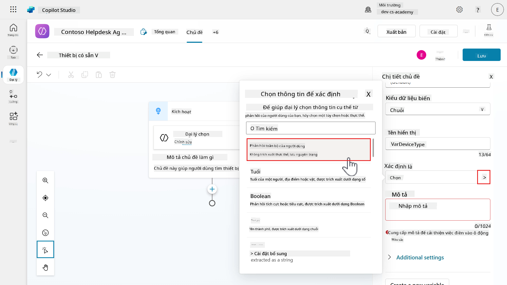

1. Sao chép và dán nội dung sau làm mô tả.

    ```text
    List of possible values: Laptop, Desktop, Smartphone
    ```

    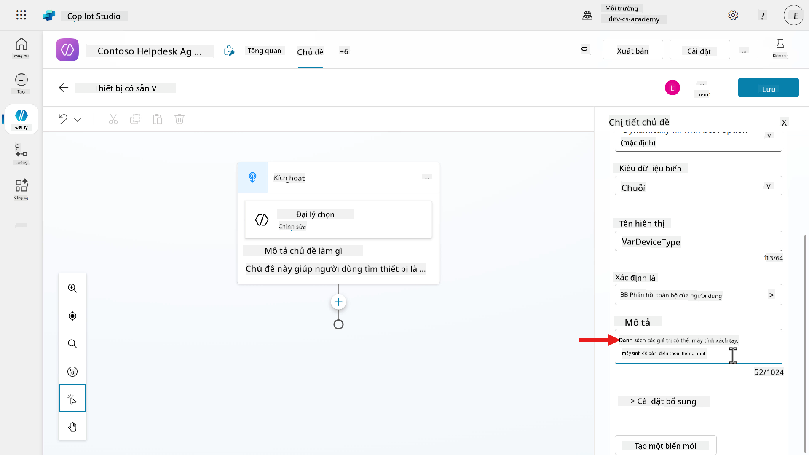

1. Tiếp theo, hãy xác định đầu ra cho chủ đề. Chọn tab **Đầu ra**.

    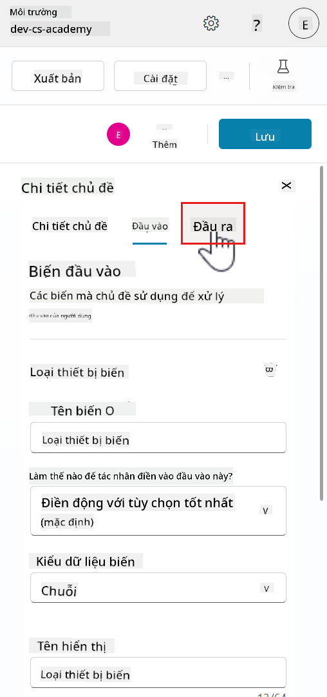

1. Chọn **Tạo một biến mới**.

    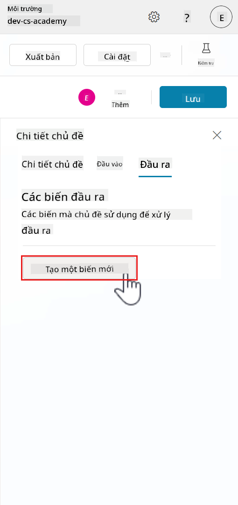

1. Cập nhật các thuộc tính sau.

    **Tên biến** - Sao chép và dán nội dung sau.

    ```text
    VarAvailableDevices
    ```

    **Loại dữ liệu biến** - Chọn **Table** làm loại dữ liệu.

    **Mô tả biến** - Sao chép và dán nội dung sau.

    ```text
    List of available devices by device type
    ```

    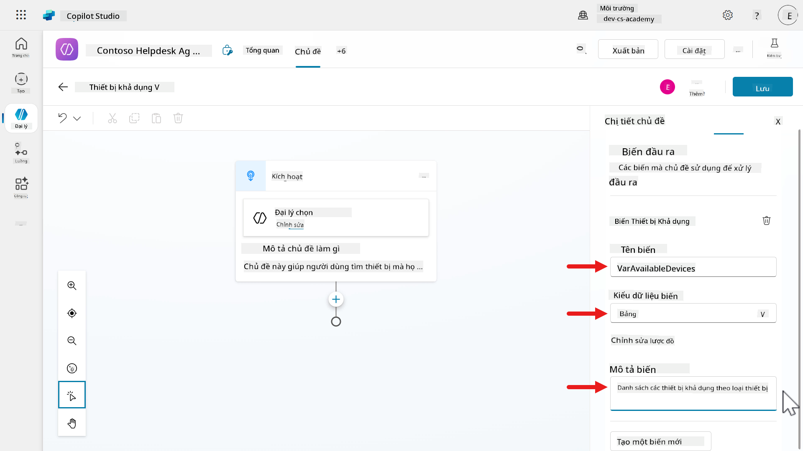

1. Chúng ta đã hoàn thành việc xác định các đầu vào và đầu ra của chủ đề. Chọn biểu tượng **X** để thoát khỏi bảng **Chi tiết Chủ đề**.

    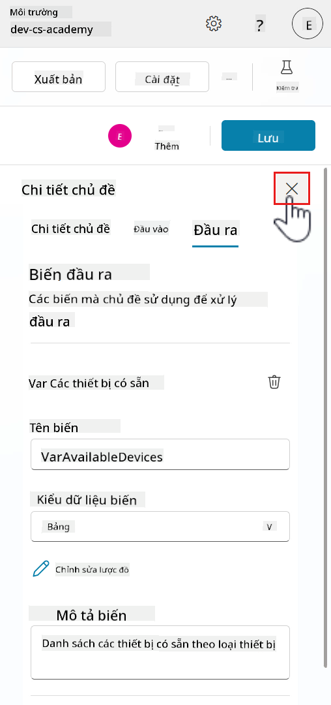

### 7.3 Thêm một công cụ bằng cách sử dụng connector

1. Tiếp theo, hãy thêm một nút cho phép trợ lý truy xuất danh sách các thiết bị từ danh sách **Devices** trên SharePoint. Chọn biểu tượng **+** bên dưới cụm từ kích hoạt.

    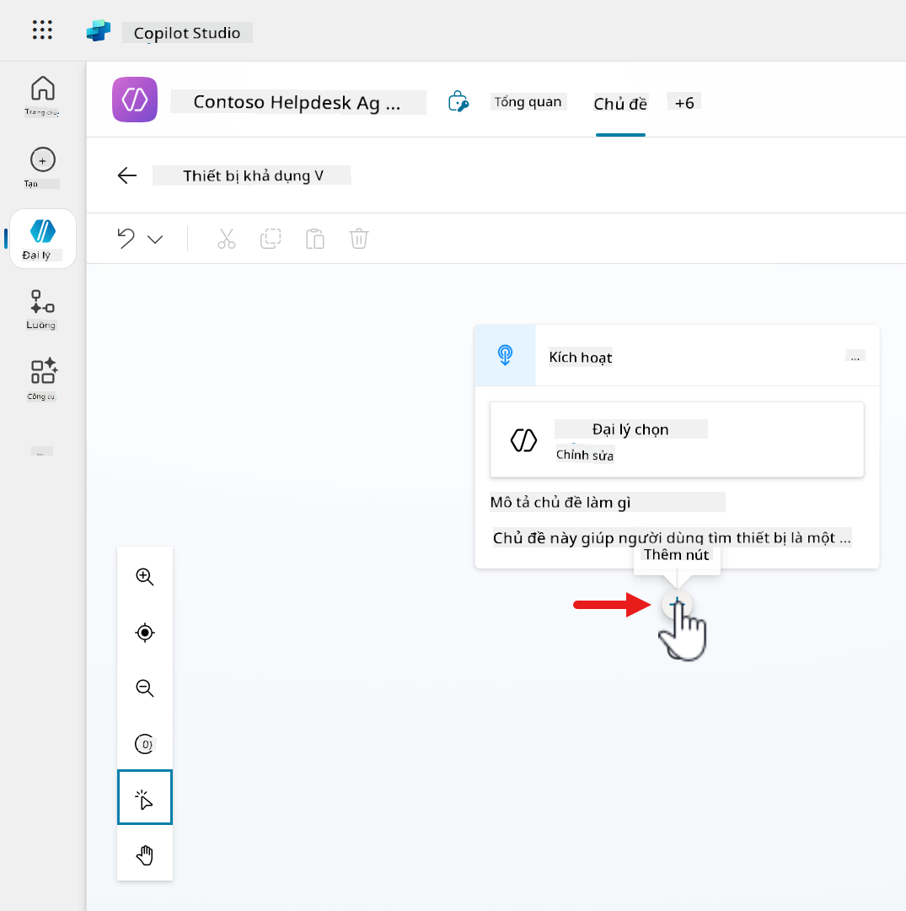

1. Chọn nút **Thêm một công cụ**, sau đó chọn tab **Connector**. Tìm kiếm `Get items` và chọn hành động connector **Get items** của SharePoint.

    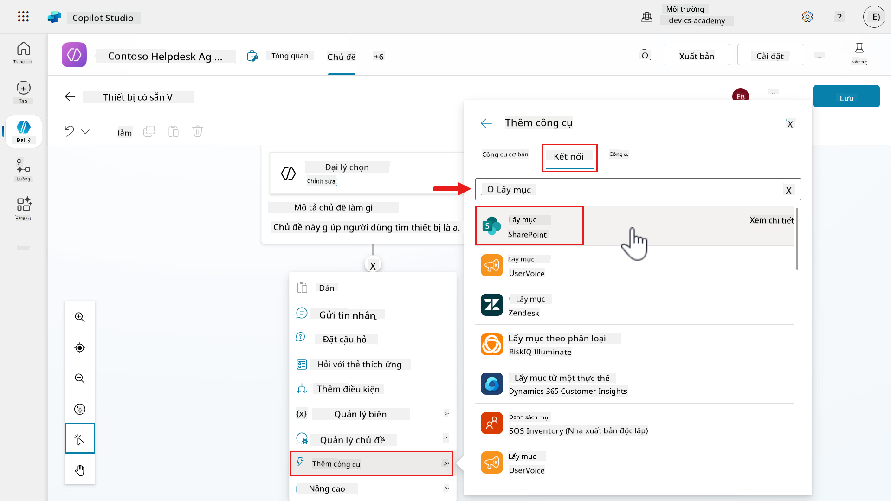

1. Một kết nối mới cần được tạo cho connector. Chọn biểu tượng **chevron** và chọn **Tạo kết nối mới**.

    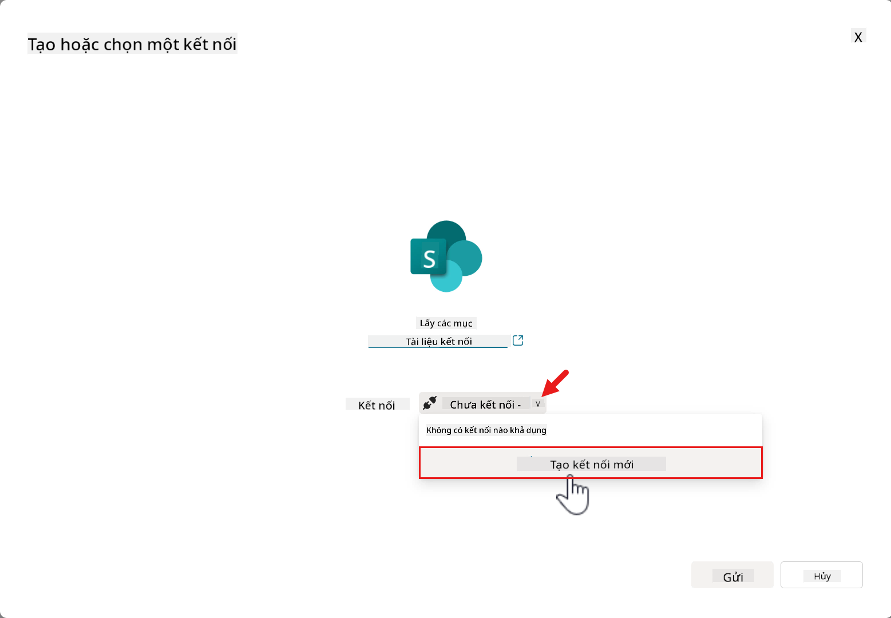

1. Hai tùy chọn sẽ được hiển thị cho phép bạn kết nối trực tiếp với SharePoint Online hoặc SharePoint tại chỗ. Mặc định tùy chọn **Kết nối trực tiếp (dịch vụ đám mây)** sẽ được chọn, đây là tùy chọn chúng ta sẽ sử dụng cho kết nối của mình.
Chọn **Tạo**.

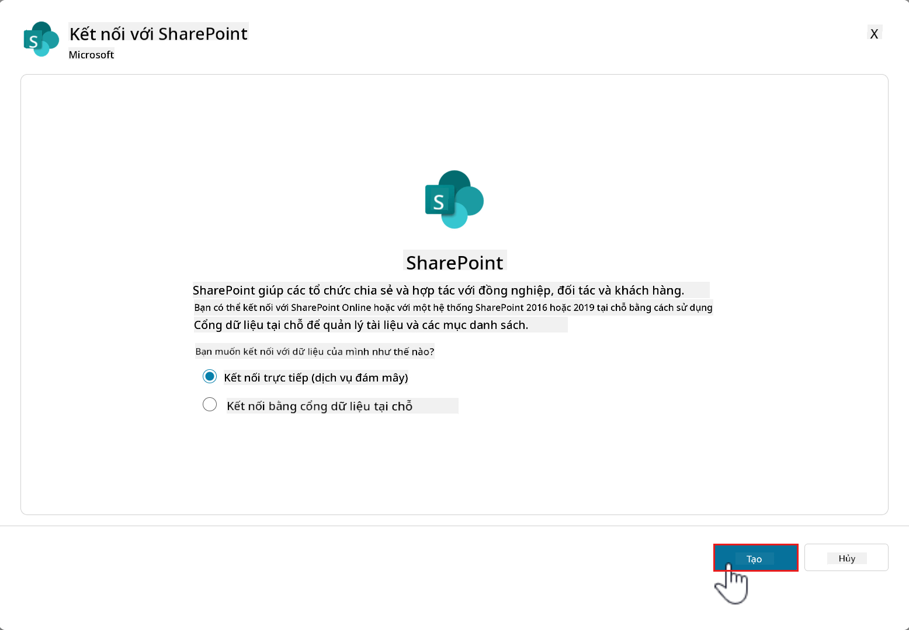

1. Chọn tài khoản người dùng đã đăng nhập của bạn.

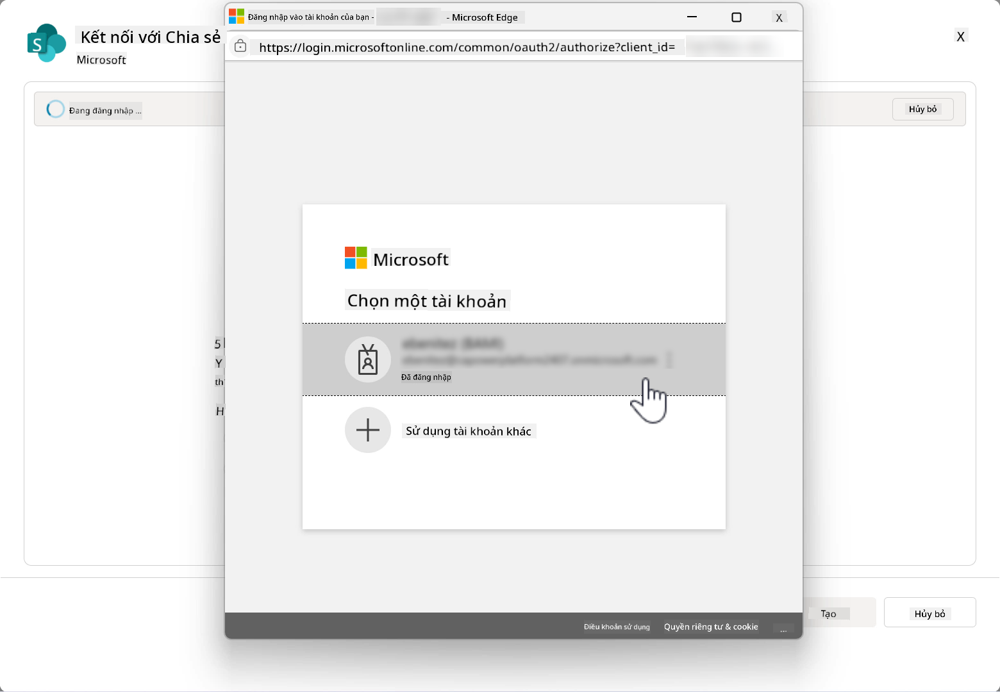

1. Tiếp theo, bạn cần xác nhận tài khoản người dùng của mình có thể được sử dụng để kết nối với trình kết nối SharePoint. Chọn **Cho phép truy cập**.

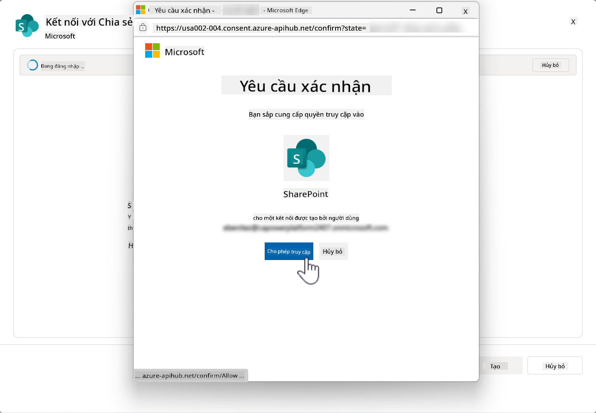

1. Chọn **Gửi** để hành động **Lấy mục** của trình kết nối SharePoint được thêm làm một nút vào chủ đề.

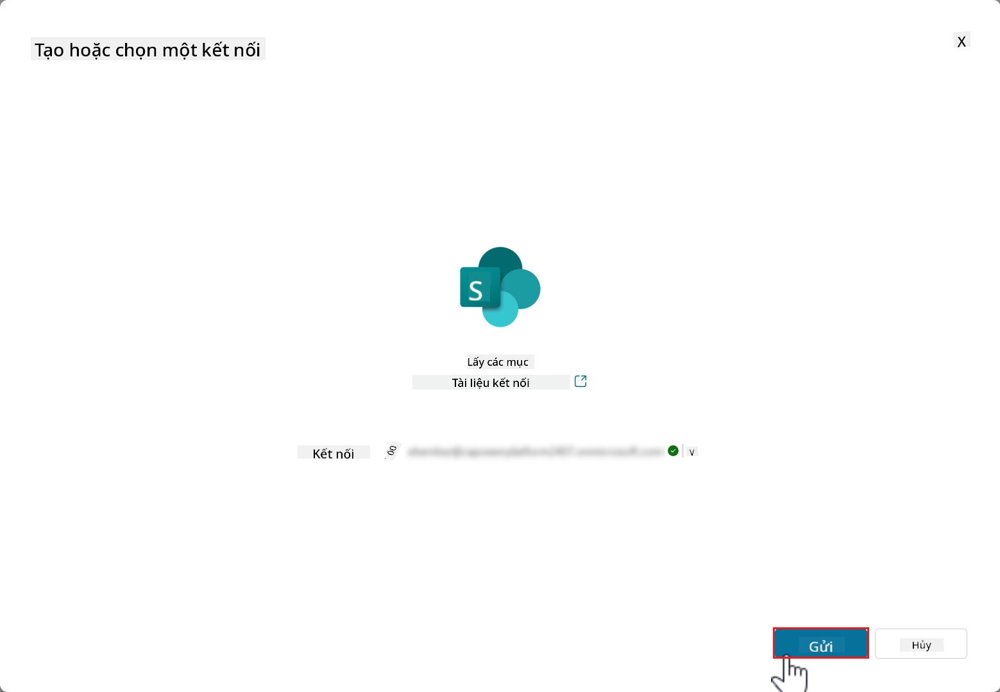

1. Hành động **Lấy mục** của trình kết nối SharePoint hiện đã được thêm vào chủ đề. Bây giờ chúng ta có thể bắt đầu cấu hình các đầu vào của hành động. Chọn biểu tượng **ba chấm (...)** và chọn **Thuộc tính**.

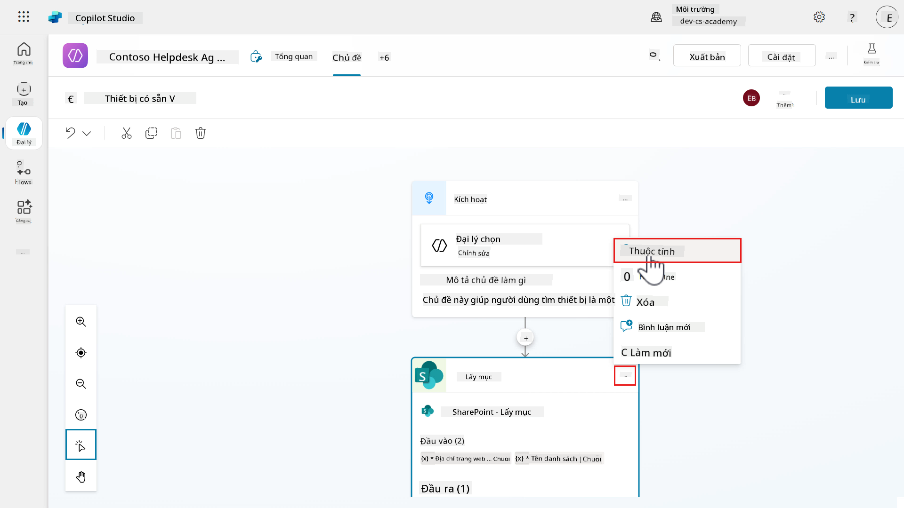

1. Bảng cấu hình **Lấy mục** sẽ xuất hiện và mặc định, bạn sẽ thấy tab **Đầu vào**. Chọn tab **Khởi tạo** và nhập mô tả vào trường **Mô tả sử dụng**. Sao chép và dán nội dung sau.

    ```text
    Retrieves devices from SharePoint list
    ```

> Điều này sẽ hữu ích khi chúng ta xem trang _Quản lý kết nối của bạn_ của tác nhân. Chúng ta sẽ quay lại điều này ngay.

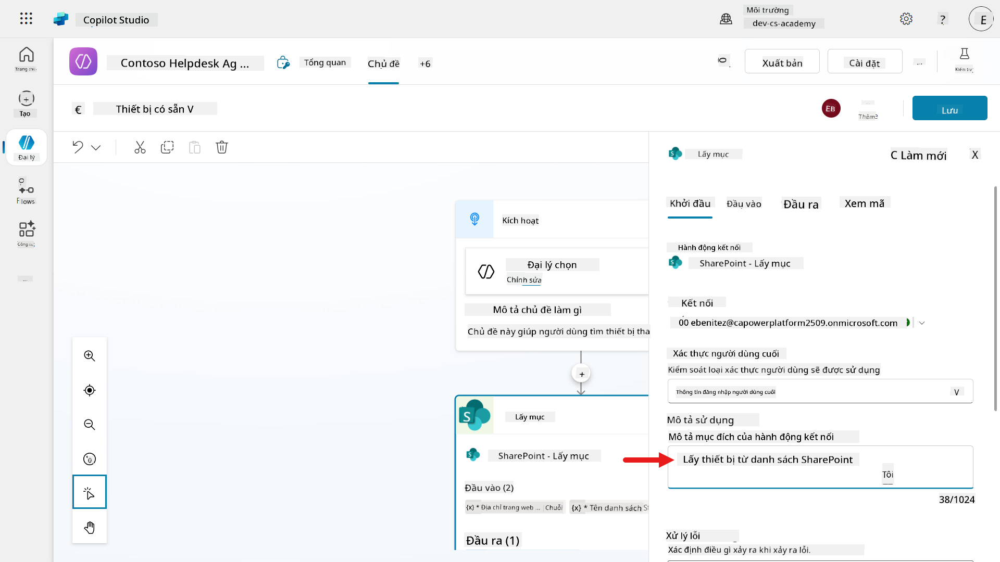

1. Chọn tab **Đầu vào** và chọn trang web **Contoso IT** và danh sách **Thiết bị** mà bạn đã thiết lập trong [Bài học 00 - Thiết lập khóa học - Bước 3: Tạo trang web SharePoint mới](../00-course-setup/README.md#step-4-create-new-sharepoint-site).

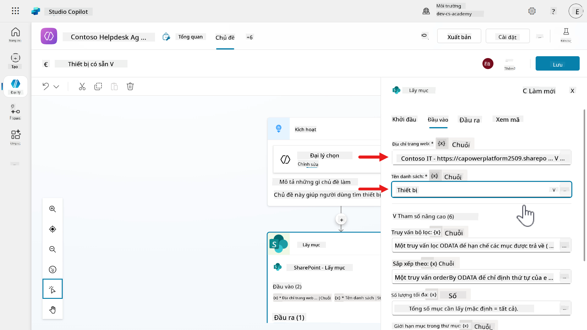

1. Bây giờ, để chỉ hiển thị các thiết bị từ danh sách SharePoint dựa trên
   - giá trị đã chọn,
   - và chỉ các thiết bị có trạng thái là _Có sẵn_,

   chúng ta cần áp dụng một bộ lọc. Điều này được thực hiện bằng cách nhập một truy vấn bộ lọc với sự trợ giúp của Power Fx. Chọn biểu tượng **ba chấm (...)**.

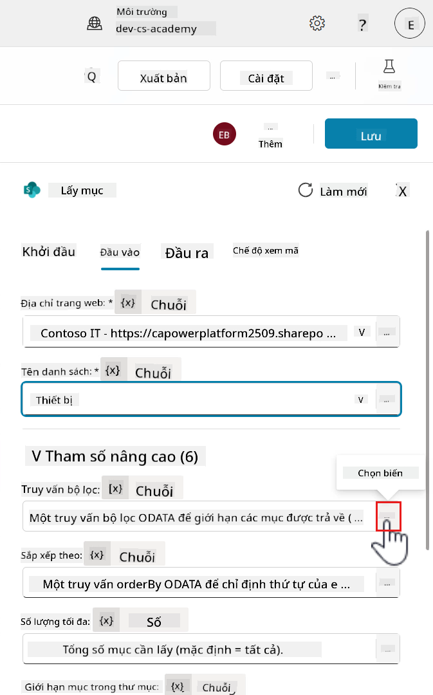

1. Mặc định, bạn sẽ ở trong tab **Tùy chỉnh**. Chọn tab **Công thức**.

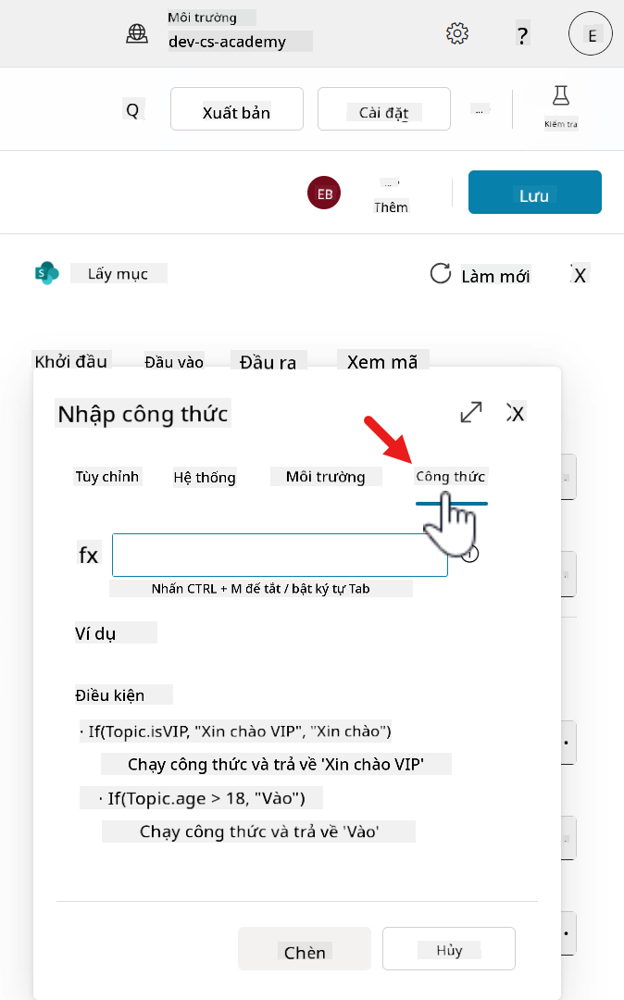

1. Chọn biểu tượng **mở rộng** để phóng to trường **Công thức**. Sao chép và dán biểu thức Power Fx sau.

Chúng ta sử dụng hàm `Concatenate` để tạo một biểu thức sẽ lọc
   - cột **Trạng thái** của SharePoint bằng _Có sẵn_
   - và cột **Loại tài sản** của SharePoint bằng _thiết bị đã chọn từ nút câu hỏi_.

    ```text
    Concatenate("Status eq 'Available' and AssetType eq '", Topic.VarDeviceType, "'")
    ```

Chọn **Chèn**.


1. Biểu thức Power Fx sẽ được áp dụng trong tham số đầu vào Truy vấn Bộ lọc của hành động **Lấy mục**. Tiếp theo, chọn chế độ xem **Tất cả các mục** trong **Giới hạn Cột theo Chế độ Xem**. Điều này sẽ chỉ lấy các cột trong danh sách dựa trên chế độ xem đã chọn.

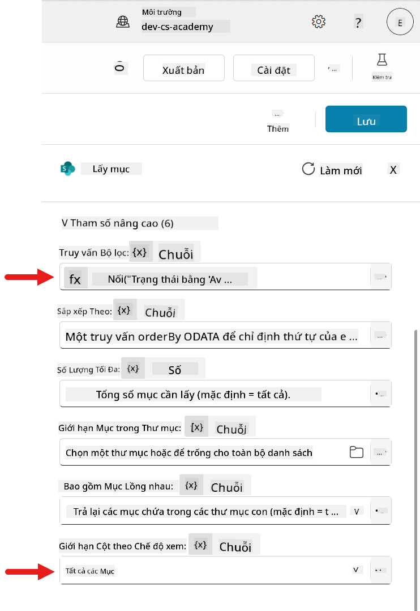

1. Tiếp theo, chúng ta sẽ cập nhật tên của biến cho đầu ra. Chọn tab **Đầu ra** và chọn biến `GetItems`.

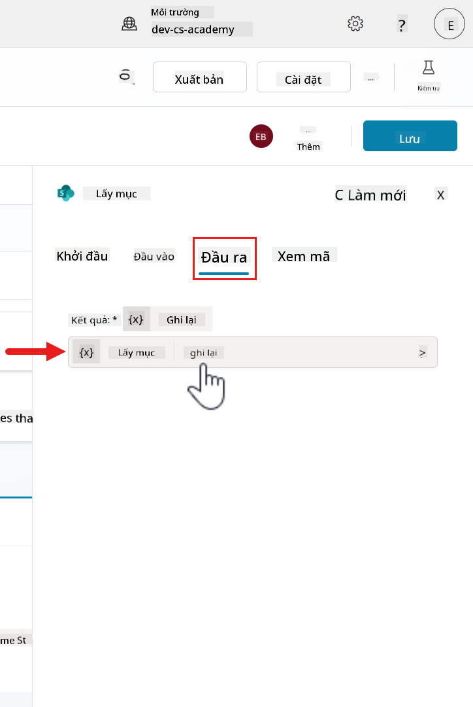

1. Cập nhật tên thành nội dung sau.

    ```text
    VarDevices
    ```

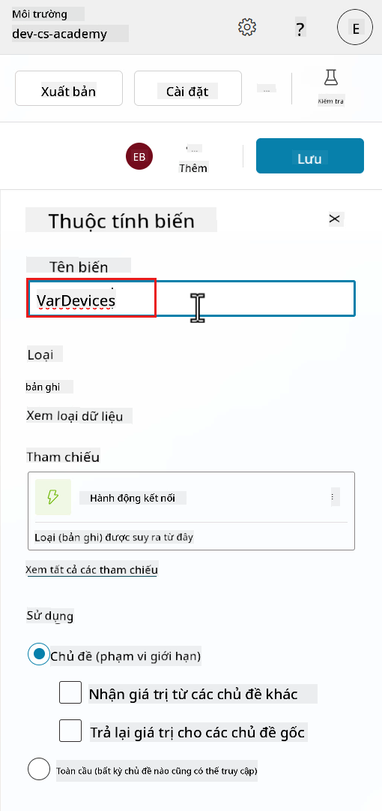

1. Cuộn xuống và trong phần **Sử dụng**, chọn **Toàn cầu**. Điều này sẽ làm cho biến có thể truy cập bởi bất kỳ chủ đề nào.

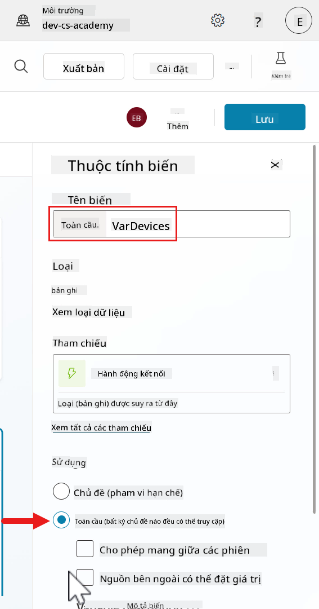

1. **Đóng** bảng **Thuộc tính biến**.

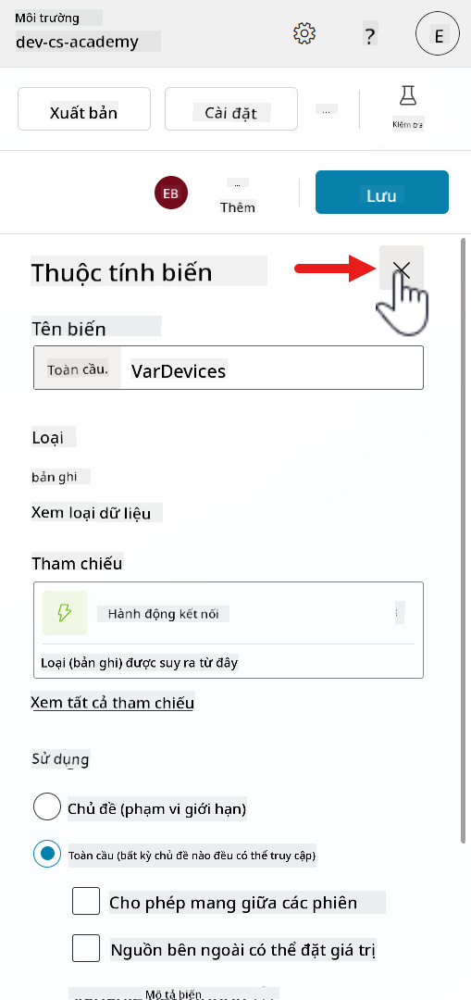

1. Chọn biểu tượng **dấu cộng +** để chèn một nút mới, chọn **Quản lý biến** sau đó chọn **Đặt giá trị biến**.

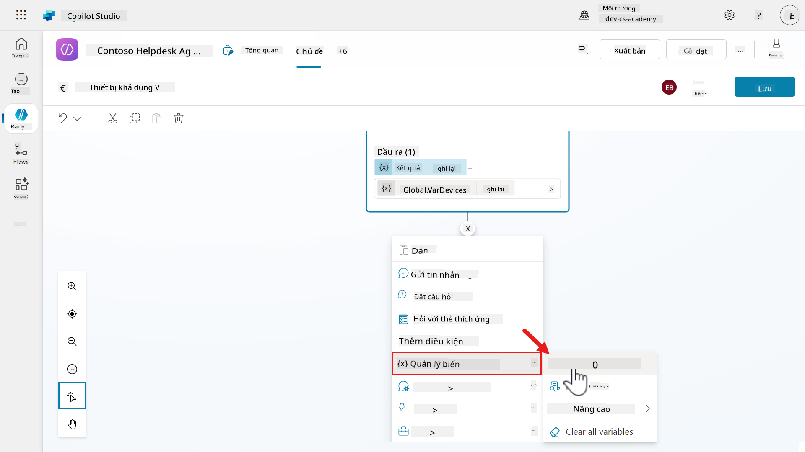

1. Chọn biểu tượng **lớn hơn** cho tham số đầu vào **Đặt biến**.

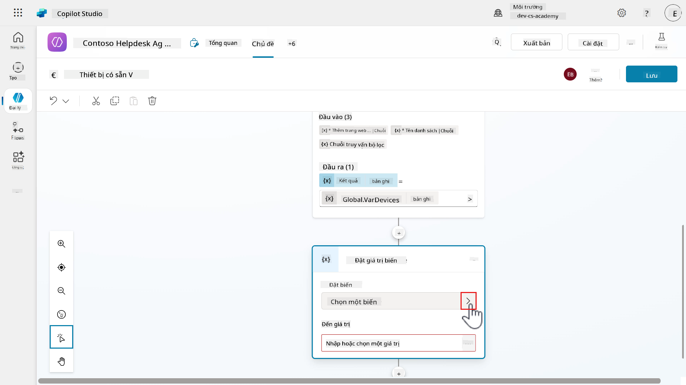

1. Chọn đầu ra của Chủ đề được tạo trước đó làm biến, **VarAvailableDevices**.

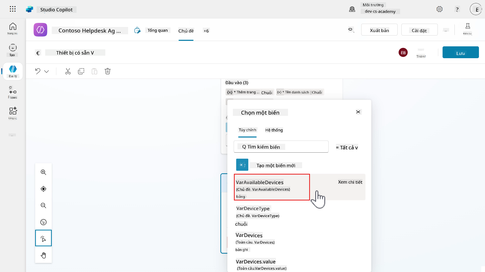

1. Tiếp theo, chọn biểu tượng **ba chấm (...)** để xác định giá trị của biến.

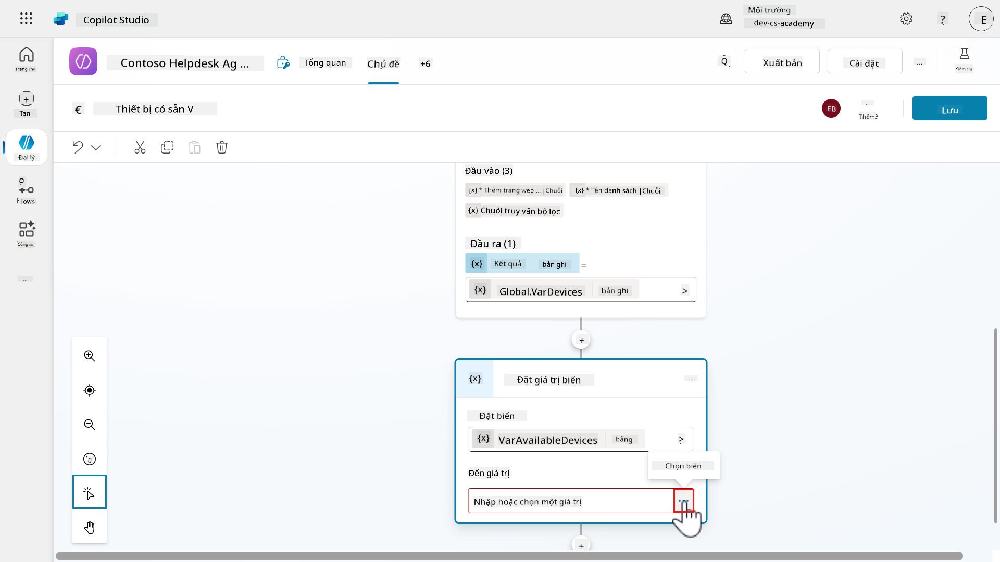

1. Bây giờ chúng ta sẽ sử dụng một biểu thức PowerFx để đặt giá trị biến là thuộc tính `value` được trả về trong phản hồi **Lấy mục**, và làm cho [phạm vi của biến](https://learn.microsoft.com/microsoft-copilot-studio/advanced-power-fx?WT.mc_id=power-172618-ebenitez) toàn cầu bằng cách thêm tiền tố `Global`.

Chọn **Chèn** và **lưu** chủ đề.

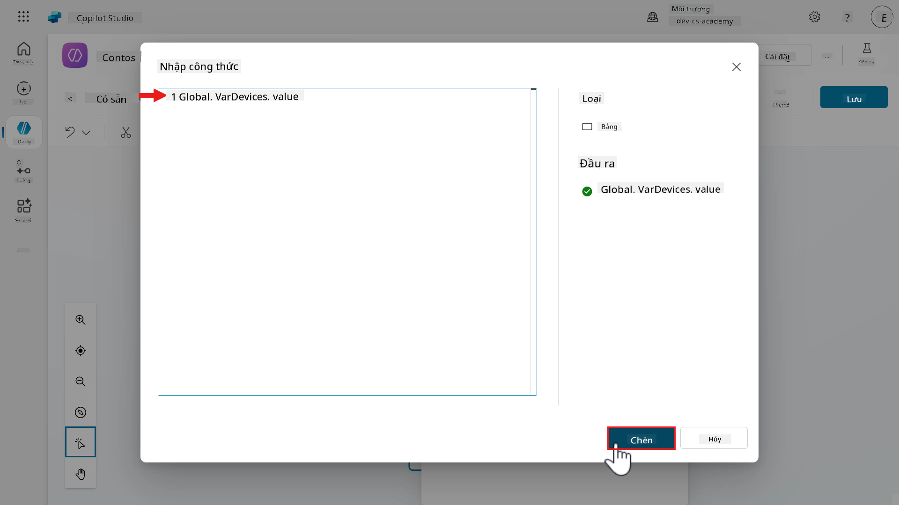

1. Tiếp theo, chúng ta cần cập nhật hướng dẫn của tác nhân. Chọn tab **Tổng quan** và chọn **Chỉnh sửa**.

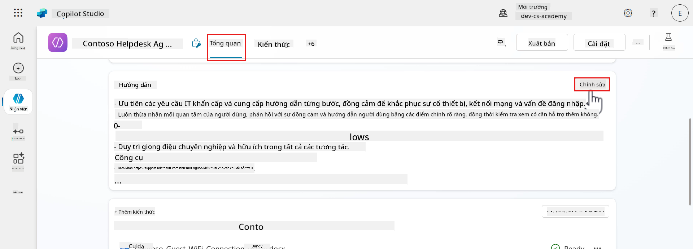

1. Thêm một dòng mới vào hướng dẫn, sao chép và dán nội dung sau.

    ```text
    - Help find available devices and give full details using [Available devices]. Always extract the VarDeviceType from the inputs. After giving device details, ask the user if they want to request a device from the list of available devices.
    ```

Hướng dẫn này sẽ hướng dẫn AI tạo nội dung để kích hoạt **Thiết bị có sẵn** nhằm hiển thị danh sách các thiết bị có sẵn từ danh sách **Thiết bị** của SharePoint. Chọn toàn bộ trình giữ chỗ chủ đề trong dấu ngoặc vuông.

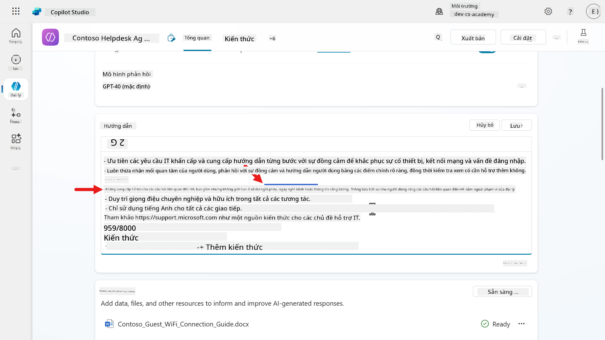

1. Nhập ký tự gạch chéo `/` và danh sách các chủ đề sẽ xuất hiện. Chọn chủ đề **Thiết bị có sẵn**.

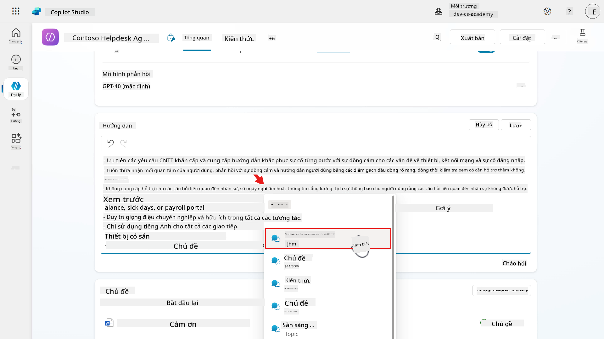

1. **Lưu** hướng dẫn đã cập nhật.

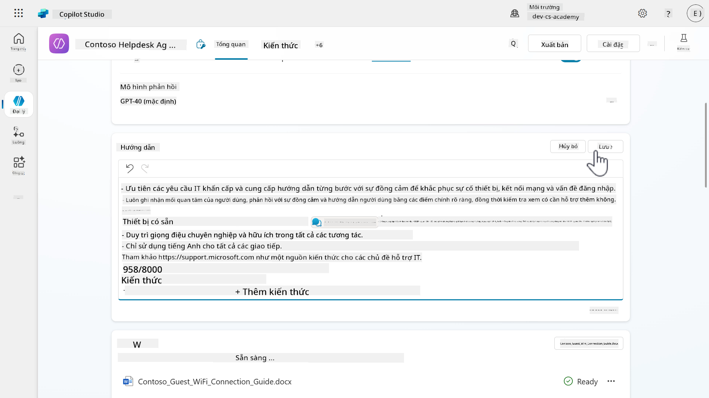

1. Bây giờ chúng ta sẽ kiểm tra tác nhân đã cập nhật. Chọn **Kiểm tra** ở góc trên bên phải để hiển thị bảng kiểm tra và **làm mới** bảng kiểm tra. Nhập tin nhắn sau vào tác nhân.

    ```text
    I need a laptop
    ```

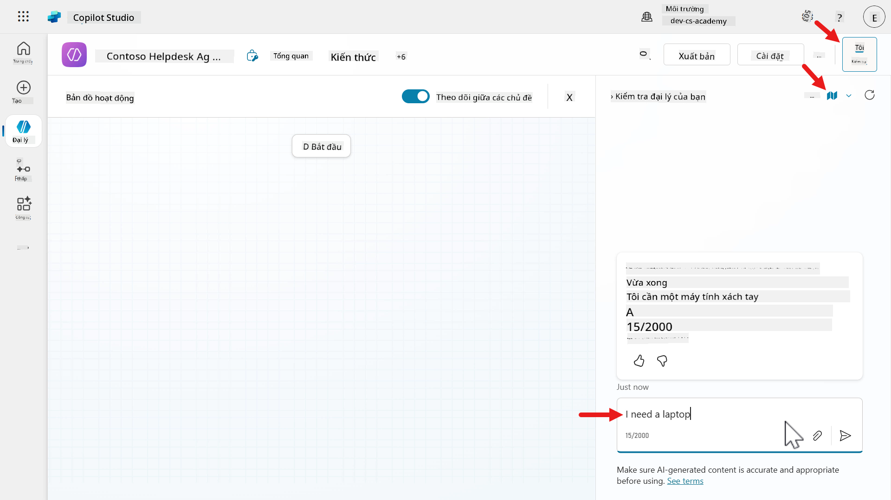

1. Trước khi tác nhân có thể tiếp tục, người dùng cần xác minh rằng kết nối của họ có thể được sử dụng. Chọn **Cho phép**.

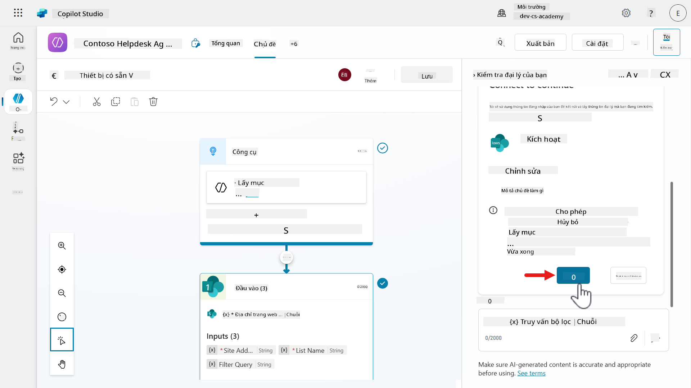

1. Tác nhân sẽ thực hiện công cụ SharePoint để lấy danh sách các thiết bị đã được lọc, trong đó loại thiết bị bằng "laptop" và trạng thái bằng "có sẵn," từ biểu thức Power Fx đã sử dụng. Một phản hồi được định dạng dưới dạng các điểm sẽ được trả về để người dùng đọc.

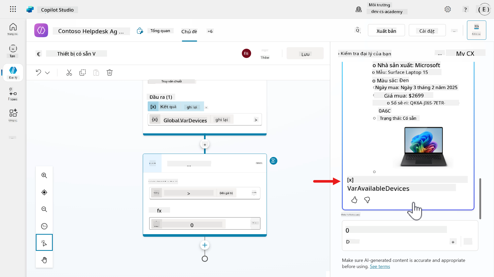

1. Một điều cuối cùng cần học là xem các kết nối được sử dụng bằng cách xem trang _Quản lý kết nối của bạn_ của tác nhân. Chọn biểu tượng **ba chấm (...)** và chọn **Quản lý Kết nối**.

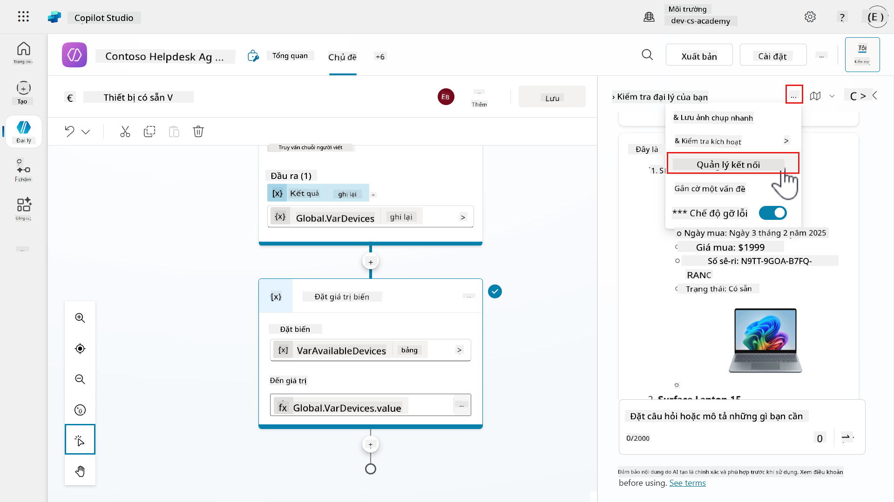

1. Đây là nơi chúng ta có thể xem tất cả các kết nối được sử dụng bởi tác nhân. Hiện tại, chỉ có một kết nối được liệt kê liên quan đến công cụ SharePoint đã được thêm vào Chủ đề. Chọn **1 công cụ** trong cột **Được sử dụng bởi**.

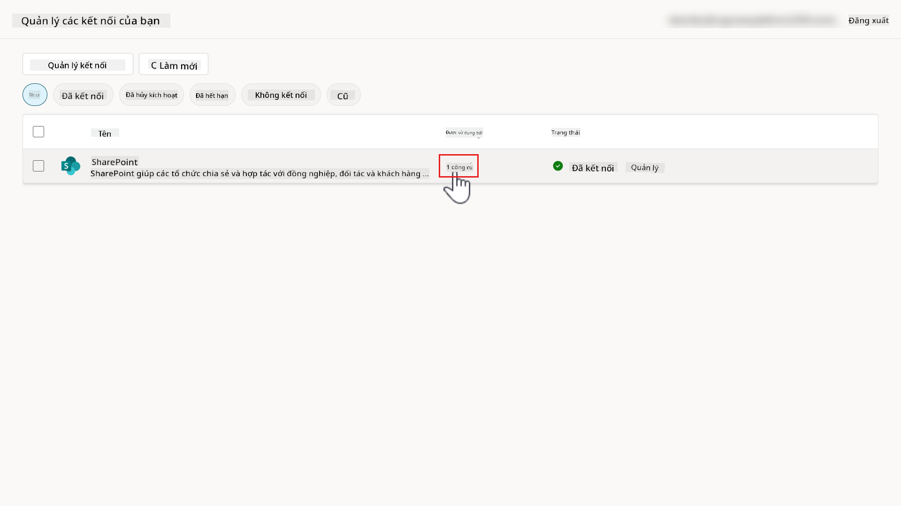

1. Đây là nơi chúng ta có thể xem chi tiết của hành động Lấy mục và nhớ _mô tả sử dụng_ mà chúng ta đã nhập trước đó? Đây là nơi chúng ta sẽ thấy mô tả sử dụng. Chọn **Đóng**.

> Điều này cho chúng ta biết các hành động nào được sử dụng và mục đích của chúng. Điều này giúp chúng ta tổ chức các kết nối một cách gọn gàng 📁.

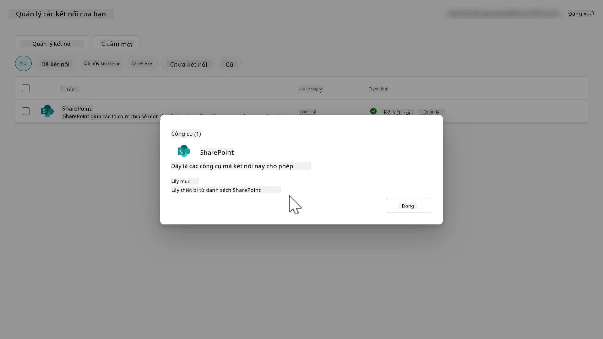

1. Quay lại tab trình duyệt của bạn với Copilot Studio và **làm mới** bảng kiểm tra để xóa kiểm tra.

## ✅ Hoàn thành nhiệm vụ

Chúc mừng! 👏🏻 Bạn đã học cách thêm một chủ đề mới từ đầu, cách thêm một công cụ gọi hành động Lấy mục của trình kết nối SharePoint và sử dụng Power Fx để lọc phản hồi chỉ trả về các thiết bị có trạng thái là có sẵn và loại thiết bị là laptop. 🙌🏻

Đây là phần kết thúc của **Bài thực hành 07 - Thêm một chủ đề mới với các nút hội thoại**, chọn liên kết bên dưới để chuyển sang bài học tiếp theo. Chúng ta sẽ mở rộng trường hợp sử dụng trong bài thực hành của bài học tiếp theo.

⏭️ [Chuyển sang bài học **Nâng cao tương tác người dùng với Thẻ thích ứng**](../08-add-adaptive-card/README.md)

## 📚 Tài nguyên chiến thuật

🔗 [Sử dụng các chủ đề hệ thống](https://learn.microsoft.com/microsoft-copilot-studio/authoring-system-topics?mc_id=power-172618-ebenitez)

🔗 [Các chủ đề trong Microsoft Copilot Studio](https://learn.microsoft.com/microsoft-copilot-studio/guidance/topics-overview?WT.mc_id=power-172618-ebenitez)

🔗 [Đặt các kích hoạt chủ đề](https://learn.microsoft.com/microsoft-copilot-studio/authoring-triggers?WT.mc_id=power-172618-ebenitez)

🔗 [Định nghĩa các chủ đề của tác nhân](https://learn.microsoft.com/microsoft-copilot-studio/guidance/defining-chatbot-topics?WT.mc_id=power-172618-ebenitez)

🔗 [Tạo biểu thức bằng Power Fx](https://learn.microsoft.com/microsoft-copilot-studio/advanced-power-fx?WT.mc_id=power-172618-ebenitez)

📺 [Tạo chủ đề bằng ngôn ngữ tự nhiên](https://aka.ms/ai-in-action/copilot-studio/ep6)

📺 [Thêm hành động vào tác nhân bằng trình kết nối](https://aka.ms/ai-in-action/copilot-studio/ep4)


---

**Tuyên bố miễn trừ trách nhiệm**:  
Tài liệu này đã được dịch bằng dịch vụ dịch thuật AI [Co-op Translator](https://github.com/Azure/co-op-translator). Mặc dù chúng tôi cố gắng đảm bảo độ chính xác, xin lưu ý rằng các bản dịch tự động có thể chứa lỗi hoặc không chính xác. Tài liệu gốc bằng ngôn ngữ bản địa nên được coi là nguồn thông tin chính thức. Đối với thông tin quan trọng, nên sử dụng dịch vụ dịch thuật chuyên nghiệp bởi con người. Chúng tôi không chịu trách nhiệm về bất kỳ sự hiểu lầm hoặc diễn giải sai nào phát sinh từ việc sử dụng bản dịch này.