<!--
CO_OP_TRANSLATOR_METADATA:
{
  "original_hash": "cc4afa4a5a11c9d03896decfbcbd4060",
  "translation_date": "2025-10-20T00:39:10+00:00",
  "source_file": "docs/recruit/09-add-an-agent-flow/README.md",
  "language_code": "vi"
}
-->
# 🚨 Nhiệm vụ 09: Thêm luồng tác vụ vào Chủ đề của bạn để tự động hóa

## 🕵️‍♂️ MẬT DANH: `CHIẾN DỊCH SIÊU CƯỜNG TỰ ĐỘNG HÓA`

> **⏱️ Thời gian thực hiện chiến dịch:** `~30 phút`  

🎥 **Xem video hướng dẫn**

[](https://www.youtube.com/watch?v=vtLZJT3eBXg "Xem hướng dẫn trên YouTube")

## 🎯 Tóm tắt nhiệm vụ

Agent của bạn hiện có thể trò chuyện với người dùng và cung cấp thông tin, nhưng để đạt được sự xuất sắc trong vận hành thực sự, agent của bạn cần phải hành động. Nhiệm vụ này sẽ biến agent trò chuyện của bạn thành một siêu cường tự động hóa bằng cách trang bị cho nó các luồng tác vụ.

Kết thúc nhiệm vụ, bạn sẽ tạo được một quy trình tự động yêu cầu thiết bị từ đầu đến cuối, bao gồm việc thu thập thông tin người dùng qua thẻ thích ứng, truy xuất dữ liệu từ SharePoint, gửi thông báo qua email cho quản lý, và cung cấp phản hồi liền mạch cho người dùng - tất cả được điều phối bởi agent của bạn thông qua tự động hóa quy trình thông minh.

## 🔎 Mục tiêu

Trong nhiệm vụ này, bạn sẽ học:

1. Hiểu luồng tác vụ là gì và cách chúng khác biệt so với luồng đám mây Power Automate trong tự động hóa.
1. Tìm hiểu các tính năng chính làm cho luồng tác vụ trở nên mạnh mẽ, bao gồm hành động AI và viết ngôn ngữ tự nhiên.
1. Khám phá công cụ thiết kế luồng tác vụ và cách sử dụng biểu thức để xử lý dữ liệu động.
1. Tạo một quy trình tự động yêu cầu thiết bị hoàn chỉnh tích hợp dữ liệu SharePoint và thông báo email.

## 🤔 Luồng tác vụ là gì?

Luồng tác vụ là một cách mạnh mẽ để tự động hóa các nhiệm vụ lặp đi lặp lại và tích hợp ứng dụng cũng như dịch vụ của bạn. Hãy nghĩ về chúng như các quy trình làm việc có cấu trúc, từng bước mà agent của bạn có thể thực hiện để tự động hóa nhiệm vụ hoặc kết nối với các ứng dụng và dịch vụ khác. Bạn có thể coi chúng như các quy trình nhỏ giúp agent của bạn thực hiện các công việc như gửi thông báo, cập nhật hồ sơ, hoặc phản hồi các sự kiện.

Không giống như các agent tự động sử dụng AI để đưa ra quyết định ngay lập tức, luồng tác vụ là **quy trình làm việc xác định** - nghĩa là chúng luôn đi theo cùng một lộ trình, đảm bảo kết quả nhất quán và đáng tin cậy.

Nói một cách đơn giản:

- Chúng giúp agent của bạn _thực hiện công việc_, không chỉ _nói chuyện_ với người dùng.
- Chúng có thể tái sử dụng trên các chủ đề và agent, và có thể được kích hoạt bởi tin nhắn người dùng, sự kiện, hoặc các ứng dụng và dịch vụ khác.

## 🙋🏽 Vâng, nhưng nó khác gì so với luồng đám mây Power Automate?

Cả luồng tác vụ và luồng đám mây Power Automate đều giúp tự động hóa nhiệm vụ. Chúng được thiết kế cho các mục đích khác nhau và hoạt động theo cách khác nhau.

### 🤖 Luồng tác vụ trong Copilot Studio

**Dùng để làm gì:**

- Được xây dựng cho các agent trò chuyện và tự động (thông qua hướng dẫn agent) trong Copilot Studio.
- Tập trung vào tự động hóa thông minh, dựa trên AI, tương tác với các hệ thống kinh doanh.

**Tại sao hữu ích:**

- Dễ dàng xây dựng và quản lý trực tiếp trong Copilot Studio.
- Tuyệt vời để tự động hóa các nhiệm vụ diễn ra _trong cuộc trò chuyện_ với người dùng như gửi yêu cầu nghỉ phép.
- Không cần giấy phép Power Automate riêng vì chi phí được tính dựa trên mức sử dụng trong Copilot Studio. Điều này có thể tiết kiệm thời gian và chi phí cho các nhóm doanh nghiệp.

**Hạn chế:**

- Không thể chia sẻ, sao chép hoặc chỉ định đồng sở hữu.
- Luồng tác vụ chỉ hiển thị và sử dụng được trong Copilot Studio.
- Hiện tại, các trình kích hoạt sự kiện cho agent có thể được chỉnh sửa trong cổng tạo Power Automate.

### ☁️ Luồng đám mây Power Automate

**Dùng để làm gì:**

- Được thiết kế cho tự động hóa mục đích chung trên nhiều ứng dụng và dịch vụ.
- Có thể chạy độc lập hoặc hoạt động cùng với luồng tác vụ.

**Tại sao hữu ích:**

- Cung cấp một loạt các kết nối.
- Lý tưởng để tự động hóa các quy trình bên ngoài agent.
- Có thể chia sẻ, tái sử dụng và quản lý trên các nhóm.

**Yêu cầu:**

- Bạn cần có giấy phép Power Automate để sử dụng.

### 📗 Tóm tắt

| Sử dụng cái này | Khi bạn muốn |
| :- | :- |
| Luồng tác vụ | Tự động hóa nhiệm vụ bên trong agent, sử dụng AI, và giữ mọi thứ trong Copilot Studio |  
| Luồng đám mây Power Automate | Tự động hóa trên các ứng dụng và dịch vụ, hoặc xây dựng quy trình làm việc bên ngoài agent |

## 👍🏻 Tại sao nên sử dụng luồng tác vụ

Luồng tác vụ luôn tuân theo một lộ trình cố định - chúng thực hiện cùng một công việc mỗi lần khi nhận được cùng một đầu vào.

Điều này làm cho chúng:

- **Đáng tin cậy** - bạn có thể tin tưởng rằng chúng sẽ hoạt động giống nhau mỗi lần.
- **Dễ dự đoán** - bạn biết kết quả sẽ như thế nào khi luồng chạy.
- **Dựa trên quy tắc** - chúng tuân theo các bước mà bạn đã định nghĩa.

Các lợi ích khác bao gồm:

- **Tự động hóa** - giúp agent của bạn xử lý các nhiệm vụ lặp đi lặp lại như gửi biểu mẫu hoặc thông báo.
- **Kết nối** - kết nối với hơn 1400+ kết nối như ServiceNow, SharePoint, Salesforce. Hoặc bạn có thể tự xây dựng kết nối tùy chỉnh.
- **Tích hợp chặt chẽ** - luồng tác vụ là một phần của logic của agent, được kích hoạt trực tiếp bởi tin nhắn người dùng hoặc hành động trong cuộc trò chuyện.
- **Khả năng mở rộng** - tái sử dụng luồng trên nhiều agent hoặc kịch bản.
- **Không cần mã hoặc ít mã** - bạn có thể xây dựng luồng bằng ngôn ngữ tự nhiên hoặc công cụ thiết kế trực quan.
- **Nền tảng tất cả trong một** - bạn có thể thiết kế, kiểm tra và triển khai luồng tác vụ tại một nơi - Copilot Studio. Không cần chuyển đổi giữa các nền tảng.

## 🏄🏻‍♂️ Luồng tác vụ cải thiện agent của bạn như thế nào?

Luồng tác vụ mở rộng khả năng của agent vượt ra ngoài việc "trò chuyện" với người dùng. Chúng cho phép agent thực hiện hành động và tương tác với các hệ thống.

Hãy tưởng tượng bạn đang làm việc trong phòng tài chính và nhận được rất nhiều hóa đơn từ các nhà cung cấp. Thông thường, ai đó phải đọc từng hóa đơn, lấy ra các thông tin quan trọng - số tiền, ngày tháng, người gửi, và kiểm tra xem mọi thứ có khớp với hồ sơ của bạn không. Sau đó gửi nó đến đúng người để phê duyệt. Điều này tốn thời gian và công sức.

Với luồng tác vụ trong Copilot Studio, bạn có thể tự động hóa quy trình này. Ngay khi hóa đơn được gửi đến, agent sẽ:

1. Đọc tài liệu bằng xử lý tài liệu thông minh để tìm thông tin chính.
1. Kiểm tra chi tiết với dữ liệu doanh nghiệp của bạn để đảm bảo mọi thứ đều chính xác.
1. Chuyển hóa đơn đến người phù hợp để phê duyệt.

Điều này giúp tiết kiệm thời gian, giảm sai sót và làm cho quy trình trở nên mượt mà hơn.

### Hãy nghĩ theo cách này

- **Agent**: người ra quyết định thông minh.
- **Luồng tác vụ**: người thực hiện đáng tin cậy.

### Tại sao điều này quan trọng

- Bạn có được sự kết hợp tốt nhất giữa tự động hóa đáng tin cậy và AI linh hoạt.
- Dễ dàng xây dựng và cập nhật luồng khi nhu cầu kinh doanh thay đổi.
- Bạn có thể mở rộng tự động hóa trên các nhóm.

## 🔌 Các tính năng chính làm cho luồng tác vụ trở nên mạnh mẽ

1. **Viết ngôn ngữ tự nhiên**
    - Bạn có thể mô tả những gì bạn muốn luồng thực hiện bằng tiếng Anh đơn giản.
    - Copilot hiểu ý định của bạn và xây dựng luồng cho bạn.
    - Không cần viết mã - chỉ cần giải thích ý tưởng của bạn.

1. **Hành động AI**

    Sử dụng AI để:

    - Đọc và hiểu tài liệu hoặc hình ảnh.
    - Tóm tắt nội dung dài thành câu trả lời ngắn, hữu ích.
    - Đưa ra các gợi ý hoặc quyết định thông minh.

1. **Hành động tạo**
    - Những hành động này cho phép luồng thích ứng theo thời gian thực.
    - Agent có thể lập kế hoạch và điều chỉnh các bước dựa trên thông tin thay đổi.

1. **Hành động tích hợp**
    - Kết nối luồng của bạn với các công cụ khác như Outlook, Microsoft Teams, ServiceNow, SharePoint và các ứng dụng, dịch vụ khác, thông qua hơn 1400+ kết nối tích hợp sẵn hoặc từ kết nối tùy chỉnh của bạn.
    - Điều này giúp agent của bạn làm việc với các ứng dụng mà nhóm của bạn đã sử dụng.

1. **Con người trong vòng lặp**
    - Thêm các bước phê duyệt nơi một người cần xem xét hoặc xác nhận điều gì đó.
    - [Phê duyệt nâng cao](https://learn.microsoft.com/microsoft-copilot-studio/flows-advanced-approvals?WT.mc_id=power-172621-ebenitez) hỗ trợ nhắc nhở, ủy quyền, và phê duyệt nhiều giai đoạn.

## ⚙️ Cách chúng hoạt động

1. **Kích hoạt**

    Một sự kiện bắt đầu luồng - chẳng hạn như người dùng đặt câu hỏi, kích hoạt luồng từ một chủ đề, một thời gian được lên lịch, hoặc một sự kiện xảy ra trong hệ thống khác.

1. **Hành động**

    Đây là các bước mà agent thực hiện tiếp theo - gửi email, gọi API, cập nhật ticket trong ServiceNow.

## 🧶 Cách tạo luồng tác vụ

1. **Ngôn ngữ tự nhiên**: mô tả những gì bạn muốn agent thực hiện, và Copilot sẽ xây dựng nó cho bạn.
1. **Canvas thiết kế**: kéo và thả các hành động, điều kiện, và vòng lặp trong công cụ thiết kế luồng tác vụ để xây dựng luồng của bạn.

## 🎨 Công cụ thiết kế luồng tác vụ là gì?

Đây là một công cụ trực quan trong Copilot Studio giúp bạn xây dựng, chỉnh sửa, và quản lý các luồng tác vụ cung cấp hướng dẫn từng bước mà agent của bạn thực hiện để hoàn thành nhiệm vụ. Nó được thiết kế để dễ sử dụng, ngay cả khi bạn mới làm quen với luồng tác vụ.

### Các tính năng chính của công cụ thiết kế luồng tác vụ

1. **Canvas trực quan**
    - Bạn có thể thấy toàn bộ luồng của mình được hiển thị như một sơ đồ.
    - Dễ dàng phóng to/thu nhỏ, điều chỉnh khung nhìn hoặc sử dụng bản đồ nhỏ để điều hướng các luồng lớn.

1. **Thêm và xóa hành động**
    - Nhấp vào nút _dấu cộng (+)_ để thêm một hành động mới như gửi tin nhắn hoặc cập nhật một mục trong danh sách SharePoint.
    - Bạn có thể tìm kiếm các hành động từ các kết nối, và cấu hình chúng thông qua cài đặt của nó.
    - Để xóa một hành động, nhấp vào _ba chấm (⋮)_ và chọn _Xóa_.

1. **Kiểm tra tham số**
    - Nhấp vào bất kỳ hành động nào để xem hoặc chỉnh sửa cài đặt của nó gọi là _tham số_.
    - Bạn có thể nhập giá trị thủ công hoặc sử dụng _biểu thức_ để làm cho chúng trở nên động.

1. **Lịch sử phiên bản**
    - Mỗi lần bạn lưu luồng của mình, một phiên bản sẽ được ghi lại.
    - Bạn có thể quay lại và xem hoặc khôi phục phiên bản trước nếu cần.

1. **Kiểm tra lỗi**
    - Công cụ _Kiểm tra Luồng_ sẽ làm nổi bật bất kỳ lỗi nào.
    - Tất cả các lỗi cần được giải quyết trước khi xuất bản luồng của bạn.

1. **Xuất bản và kiểm tra**
    - Khi luồng của bạn không có lỗi, hãy xuất bản để làm cho nó hoạt động.
    - Sử dụng tính năng _Kiểm tra_ để chạy luồng của bạn một cách thủ công hoặc tự động, và kiểm tra xem nó có hoạt động như mong đợi không.

### Tại sao sử dụng công cụ thiết kế luồng tác vụ?

- **Trực quan và dễ hiểu** - bạn có thể xây dựng luồng bằng cách kéo và nhấp.
- **An toàn để thử nghiệm** - lịch sử phiên bản cho phép bạn hoàn tác thay đổi.
- **Kiểm tra tích hợp sẵn** - giúp bạn đảm bảo mọi thứ hoạt động trước khi đưa vào sử dụng.

## 🔤 Bạn đã đề cập đến _biểu thức_ - biểu thức là gì?

Biểu thức là các công thức hoặc lệnh nhỏ giúp luồng tác vụ của bạn xử lý dữ liệu. Bạn sử dụng chúng để tính toán giá trị, định dạng văn bản, đưa ra quyết định, hoặc lấy thông tin cụ thể từ các đầu vào.

### Tại sao sử dụng biểu thức?

Biểu thức cho phép bạn:

- **Tùy chỉnh cách xử lý dữ liệu** - kết hợp tên, định dạng ngày tháng.
- **Đưa ra quyết định** - nếu một giá trị lớn hơn 10, thực hiện một hành động nào đó.
- **Chuyển đổi dữ liệu** - thay đổi văn bản thành chữ thường, trích xuất một phần của chuỗi.
- **Tự động hóa logic** - mà không cần viết mã đầy đủ.

### Biểu thức trông như thế nào?

Biểu thức sử dụng các hàm. Tôi sẽ mượn lời giải thích về hàm từ cựu Microsoft MVP, Jerry Weinstock.

!!! quote
    Hàm là logic tích hợp để chuyển đổi dữ liệu của bạn thông qua các thao tác đơn giản hoặc phức tạp trong biểu thức.

Các hàm cho phép bạn xây dựng biểu thức mà không cần phải viết bất kỳ mã nào.

Cách tôi thích mô tả nó là một hàm trong luồng tác vụ tương tự như các hàm trong Excel. Bạn có thể thực hiện một thao tác trên dữ liệu để chuyển đổi nó thành kết quả mong muốn. Khi xây dựng công thức trong Excel, bạn chọn giá trị đầu vào từ các ô trong bảng hoặc một phạm vi, sau đó áp dụng các hàm để xử lý kết quả dữ liệu. Một ví dụ là sử dụng hàm `COUNT` để tính số ô chứa số từ một phạm vi.

Trong luồng tác vụ, thay vì tham chiếu dữ liệu từ các ô trong bảng, bạn đang tham chiếu dữ liệu đầu ra từ trình kích hoạt hoặc các hành động khi xây dựng biểu thức của mình. Tiếp tục với ví dụ trước, sử dụng hàm `length` để lấy số lượng mục được trả về từ hành động kết nối _Get items_ của SharePoint.

### Tại sao các hàm lại quan trọng?

Sử dụng hàm làm cho luồng tác vụ của bạn:

- **Thông minh hơn** - chúng có thể phản ứng với các đầu vào hoặc điều kiện khác nhau.
- **Linh hoạt** - bạn có thể tùy chỉnh cách xử lý dữ liệu.
- **Hiệu quả hơn** - bạn tránh được các bước thủ công bằng cách tự động hóa logic.

### Các hàm hữu ích nhất

Dưới đây là các hàm phổ biến được sử dụng trong luồng tác vụ. Để xem danh sách đầy đủ các hàm, hãy truy cập [hướng dẫn tham khảo](https://learn.microsoft.com/azure/logic-apps/workflow-definition-language-functions-reference?WT.mc_id=power-172621-ebenitez).

#### 🔡 Văn bản

- `concat()` - Kết hợp hai hoặc nhiều đoạn văn bản lại với nhau.
      - Ví dụ: `concat('Xin chào ', firstName)` → “Xin chào John”

- `toLower()` / `toUpper()` - Chuyển đổi văn bản thành chữ thường hoặc chữ hoa.
      - Hữu ích để chuẩn hóa đầu vào.

- `substring()` - Trích xuất một phần của chuỗi.
      - Ví dụ: Lấy 3 chữ cái đầu tiên của một tên.

- `trim()` - Loại bỏ khoảng trắng ở đầu và cuối văn bản.

#### 🔢 Toán học và số

- `add()`, `sub()`, `mul()`, `div()` - Các phép toán cơ bản.
      - Ví dụ: `add(5, 3)` - kết quả là 8

#### 📅 Ngày và giờ

- `utcNow()` - Lấy ngày và giờ hiện tại theo UTC.
      - Tuyệt vời để tạo dấu thời gian.

- `addDays()`, `addHours()` - Thêm thời gian vào một ngày.
- Ví dụ: `addDays(utcNow(), 7)` đầu ra là 7 ngày kể từ bây giờ.

- `formatDateTime()` - Định dạng ngày thành chuỗi dễ đọc.
      - Ví dụ: Thứ Hai, ngày 7 tháng 7 năm 2025

#### ✅ Logic

- `if()` - Chạy một giá trị nếu đúng, giá trị khác nếu sai.
      - Ví dụ: `if(score > 50, 'Pass', 'Fail')`

- `equals()` - Kiểm tra xem hai giá trị có giống nhau không.

- `and()`, `or()`, `not()` - Kết hợp nhiều điều kiện.

#### 🪣 Các hàm tiện ích khác

- `coalesce()` - Trả về giá trị đầu tiên không rỗng.
      - Hữu ích cho giá trị dự phòng/mặc định.

- `guid()` - Tạo một ID duy nhất.
      - Hữu ích cho việc theo dõi hoặc ghi nhật ký.

- `length()` - Đếm số ký tự hoặc mục trong chuỗi hoặc mảng.

## ⭐ Các phương pháp tốt nhất

Dưới đây là một số phương pháp tốt nhất để xây dựng luồng tác nhân trong Copilot Studio.

1. **Bắt đầu đơn giản và xây dựng dần dần**

    - Bắt đầu với một nhiệm vụ nhỏ, rõ ràng như gửi tin nhắn.
    - Thêm các bước sau khi kiểm tra cơ bản tự động hóa của bạn.

1. **Sử dụng tên hành động rõ ràng và mô tả**

    - Gắn nhãn từng bước rõ ràng để bạn và nhóm của bạn hiểu được nó làm gì.
    - Ví dụ: thay vì tên mặc định "Cập nhật mục" cho hành động kết nối SharePoint, hãy đổi tên nó thành nội dung mà nó đang cập nhật, chẳng hạn như "Cập nhật trạng thái thiết bị."

1. **Kiểm tra lỗi trước khi xuất bản**

    - Sử dụng **trình kiểm tra luồng** để tìm và sửa bất kỳ vấn đề nào.
    - Bạn không thể xuất bản luồng nếu có lỗi, vì vậy hãy cố gắng khắc phục chúng khi xảy ra.

1. **Kiểm tra luồng của bạn kỹ lưỡng**

    - Chỉ vì nó được lưu và xuất bản không có nghĩa là nó hoạt động như mong đợi.
    - Sử dụng tính năng _Test_ để chạy luồng của bạn thủ công hoặc tự động và kiểm tra kết quả.

1. **Sử dụng Lịch sử Phiên bản**

    - Lưu luồng của bạn thường xuyên để bạn có thể quay lại các phiên bản trước đó nếu cần.
    - Bạn có thể xem và khôi phục các phiên bản trước đó bằng bảng điều khiển _Lịch sử Phiên bản_.

1. **Sử dụng các tham số và biểu thức một cách khôn ngoan**

    - Khi cấu hình các hành động, sử dụng tham số để làm cho luồng của bạn linh hoạt.
    - Bạn có thể nhập giá trị thủ công hoặc sử dụng biểu thức để tính toán chúng, hoặc kết hợp với các giá trị từ các hành động trước đó bằng cách sử dụng công cụ chọn _dynamic content_.

1. **Xóa các hành động không sử dụng**

    - Nếu bạn thêm một hành động và sau đó quyết định không cần nó, hãy xóa nó để giữ cho luồng của bạn gọn gàng.

## 🧪 Bài thực hành 09 - Thêm luồng tác nhân để tự động hóa và nâng cao khả năng của chủ đề

Bây giờ chúng ta sẽ học cách nâng cao chủ đề của mình với các thẻ thích ứng và sử dụng các chức năng nâng cao của chủ đề và nút.

- [9.1 Tạo luồng tác nhân](../../../../../docs/recruit/09-add-an-agent-flow)
- [9.2 Thêm luồng tác nhân vào chủ đề](../../../../../docs/recruit/09-add-an-agent-flow)
- [9.3 Cập nhật chủ đề Yêu cầu thiết bị với nhiều nút để cải thiện trải nghiệm người dùng](../../../../../docs/recruit/09-add-an-agent-flow)
- [9.4 Kiểm tra tác nhân bằng nhiều kịch bản](../../../../../docs/recruit/09-add-an-agent-flow)

### ✨ Trường hợp sử dụng

**Là một** quản lý nhân viên

**Tôi muốn** nhận yêu cầu thiết bị

**Để tôi có thể** xem xét thiết bị mà nhân viên yêu cầu.

Hãy bắt đầu!

### Yêu cầu trước

1. **Danh sách SharePoint**

    Chúng ta sẽ sử dụng danh sách SharePoint **Devices** từ [Bài học 00 - Thiết lập khóa học - Bước 3: Tạo trang SharePoint mới](../00-course-setup/README.md#step-4-create-new-sharepoint-site).

    Nếu bạn chưa thiết lập danh sách SharePoint **Devices**, vui lòng quay lại [Bài học 00 - Thiết lập khóa học - Bước 3: Tạo trang SharePoint mới](../00-course-setup/README.md#step-4-create-new-sharepoint-site).

1. **Tác nhân hỗ trợ Contoso**

    Chúng ta sẽ sử dụng cùng một tác nhân đã tạo trước đó trong [Bài học 06 - Tạo một tác nhân tùy chỉnh sử dụng ngôn ngữ tự nhiên với Copilot và liên kết nó với dữ liệu của bạn](../06-create-agent-from-conversation/README.md).

### 9.1 Tạo luồng tác nhân

Trong bài thực hành này, chúng ta sẽ tạo một luồng tác nhân để lấy mục SharePoint của thiết bị đã chọn và gửi email cho quản lý với chi tiết thiết bị.

1. Trong chủ đề **Yêu cầu thiết bị**, cuộn xuống nút **Hỏi với thẻ thích ứng** và thêm một nút mới. Chọn **Thêm công cụ** và trong tab **Công cụ cơ bản** của bảng điều khiển, chọn **Luồng tác nhân mới**.

    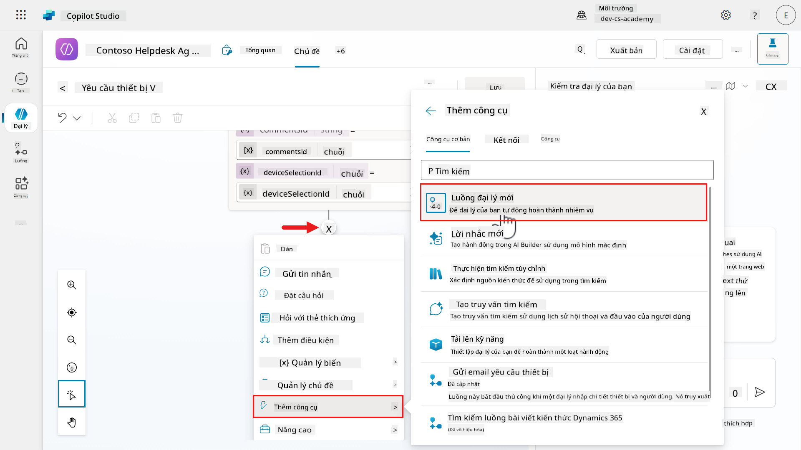

1. **Nhà thiết kế Luồng Tác nhân** sẽ tải với một trigger và một hành động.

    - **Trigger** - Khi một tác nhân gọi luồng
        - Điều này sẽ kích hoạt một luồng từ tác nhân Copilot Studio.

    - **Hành động** - Phản hồi tác nhân
        - Điều này gửi một phản hồi có thể chứa các giá trị đầu ra trở lại tác nhân Copilot Studio.

    Chọn trigger.

    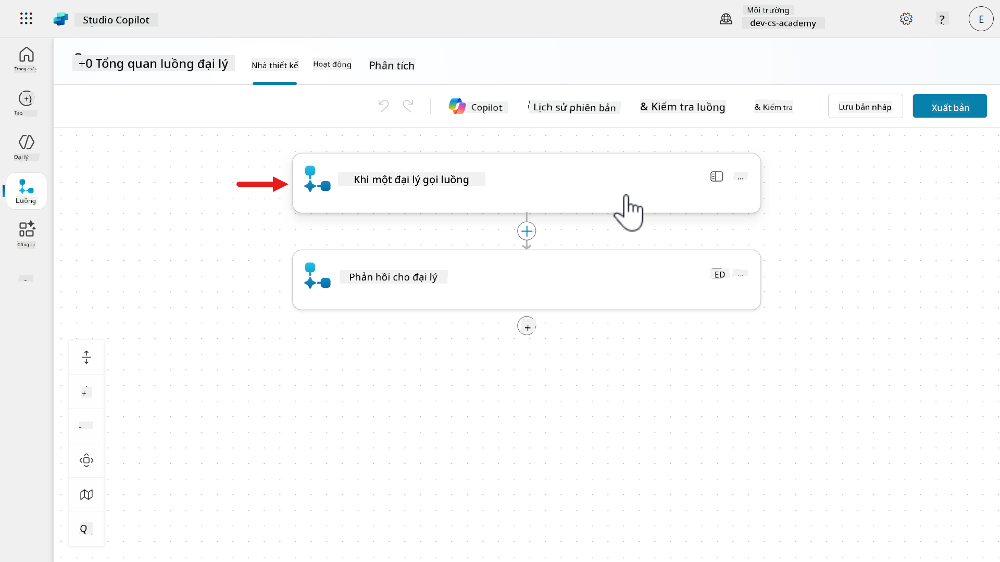

1. Tiếp theo, chúng ta sẽ thêm một số đầu vào cho luồng tác nhân.

    - `DeviceSharePointId` - điều này sẽ lưu trữ giá trị, ID, của mục SharePoint. Giá trị ID này là đầu ra từ nút Hỏi với thẻ thích ứng nơi người dùng đã chọn thiết bị.

    - `User` - đây sẽ là tên của người dùng, được lấy từ biến hệ thống của tác nhân.

    - `AdditionalComments` - đây sẽ là nhận xét do người dùng nhập, là đầu ra từ nút Hỏi với thẻ thích ứng.

    Đầu tiên, chúng ta sẽ thêm `DeviceSharePointId` làm đầu vào cho trigger của chúng ta. Chọn **+ Thêm đầu vào**.

    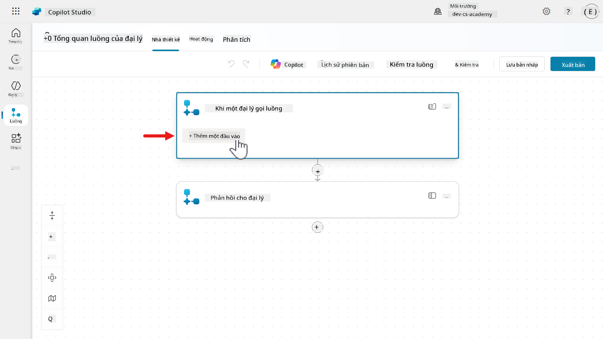

1. Đối với loại đầu vào của người dùng, chọn **Text**.

    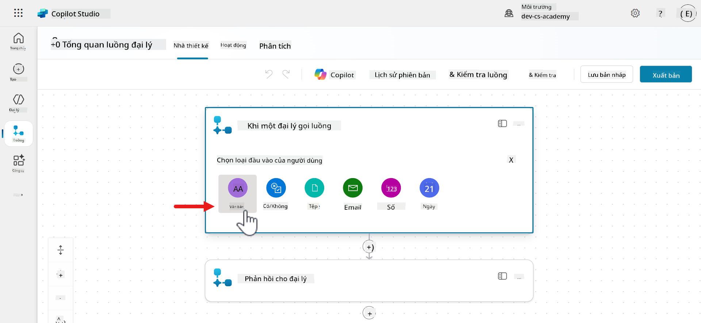

1. Đối với tên của đầu vào, nhập như sau.

    ```text
    DeviceSharePointId
    ```

    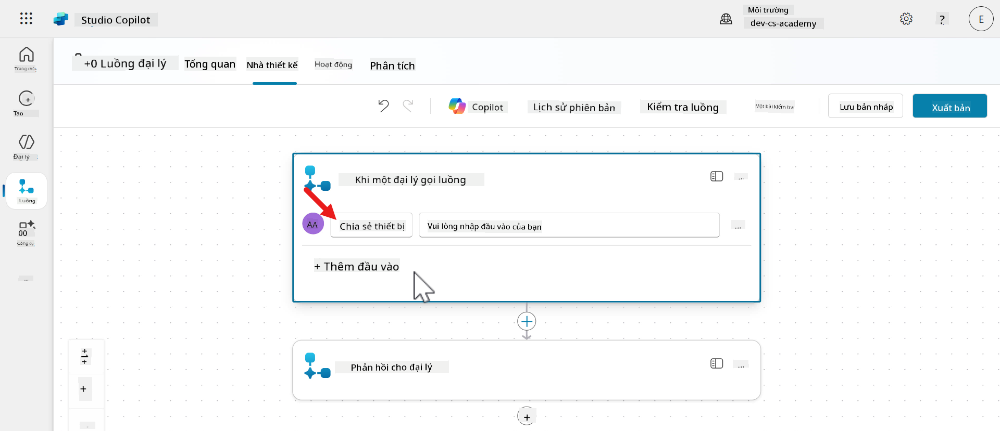

1. Bây giờ chúng ta sẽ thêm đầu vào thứ hai, `User`. Lặp lại các bước tương tự, chọn **+ Thêm đầu vào** và chọn **Text**.

    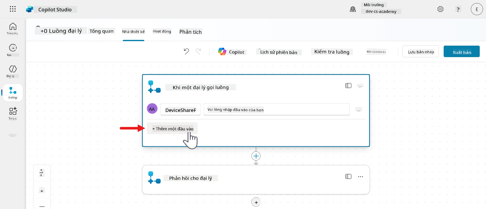

1. Đối với tên của đầu vào, nhập như sau.

    ```text
    User
    ```

    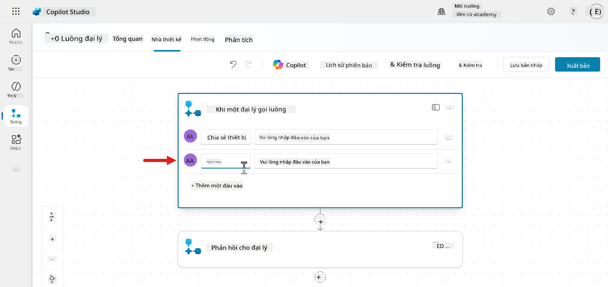

1. Bây giờ chúng ta sẽ thêm đầu vào thứ ba, `AdditionalComments`. Lặp lại các bước tương tự, chọn **+ Thêm đầu vào** và chọn **Text**.

    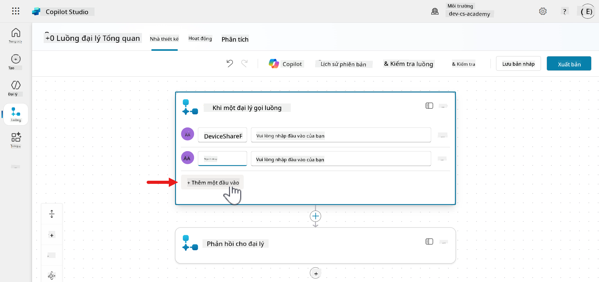

1. Đối với tên của đầu vào, nhập như sau.

    ```text
    AdditionalComments
    ```

    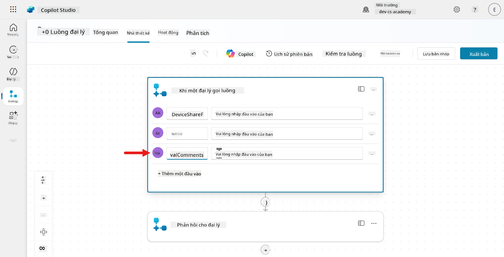

1. Đối với đầu vào `AdditionalComments`, chúng ta sẽ cập nhật để làm cho nó tùy chọn. Chọn **biểu tượng dấu ba chấm (...)** và chọn **Làm cho trường tùy chọn**.

    

1. Làm tốt lắm! Trigger đã được cấu hình, hãy tiếp tục. Chọn **biểu tượng cộng +** dưới trigger để chèn một hành động mới.

    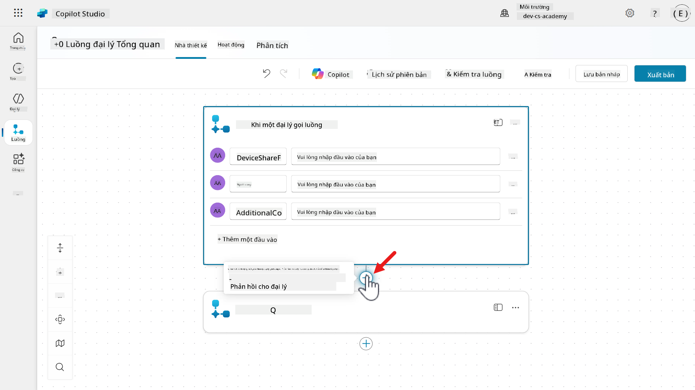

1. Bảng **Hành động** sẽ xuất hiện nơi bạn có thể xem các hành động từ hơn 1400+ kết nối tích hợp với Microsoft và các dịch vụ bên thứ ba. Trong **trường tìm kiếm**, nhập như sau,

    ```text
    Get item
    ```

    Một danh sách các hành động sẽ hiển thị trong kết quả tìm kiếm. Chọn hành động **Get item** từ kết nối **SharePoint**.

    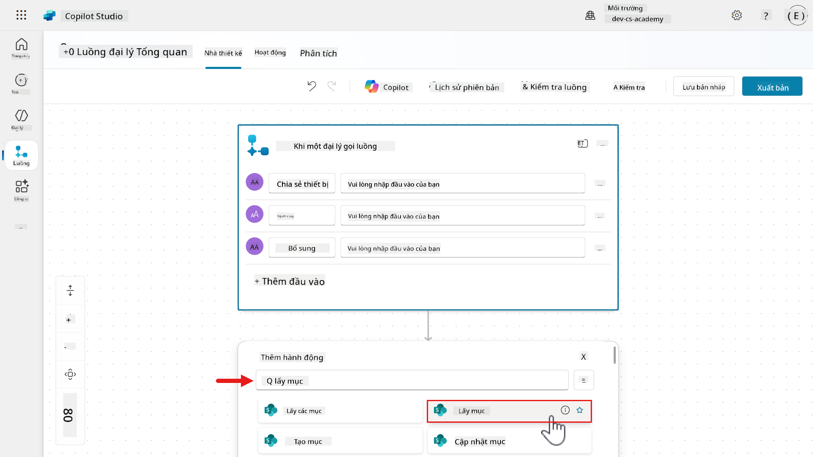

1. Bây giờ chúng ta có thể bắt đầu cấu hình hành động **Get item**.

    Chọn **biểu tượng dấu ba chấm (...)** trong hành động **Get item**.

    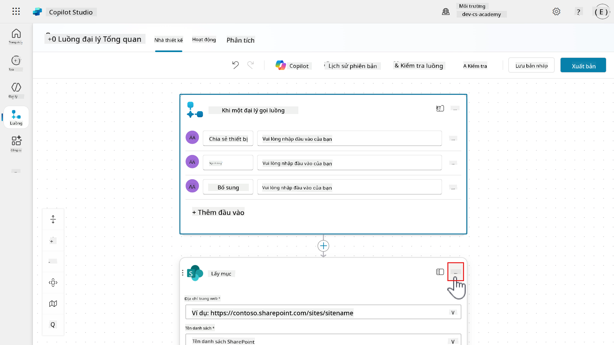

1. Chọn **Đổi tên**.

    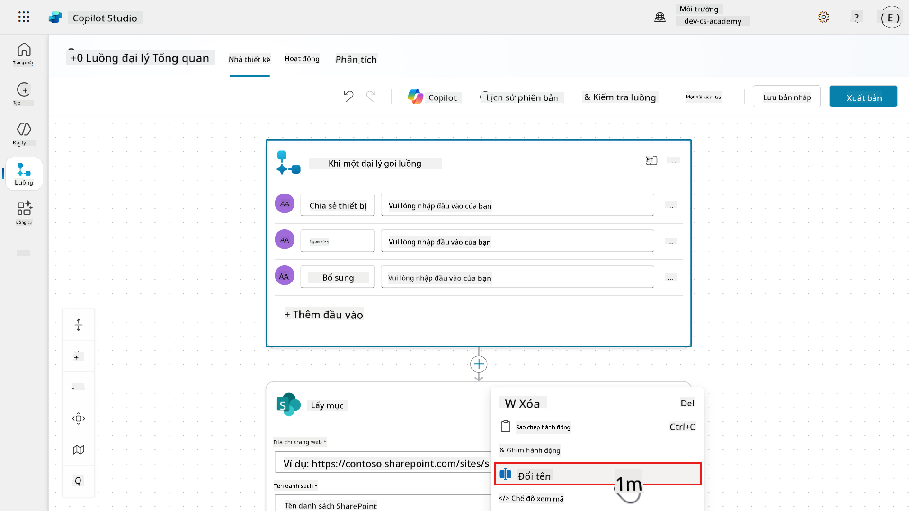

1. Đổi tên hành động thành,

    ```text
    Get Device
    ```

    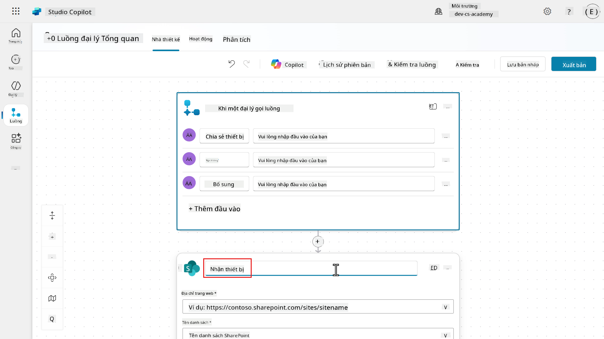

1. Trong trường **Địa chỉ trang web**, chọn **Địa chỉ trang web** của trang SharePoint Contoso IT được tạo trong [Bài học 00 - Thiết lập khóa học - Bước 3: Tạo trang SharePoint mới](../00-course-setup/README.md#step-4-create-new-sharepoint-site).

    Trong trường **Tên danh sách**, chọn danh sách SharePoint **Devices**.

    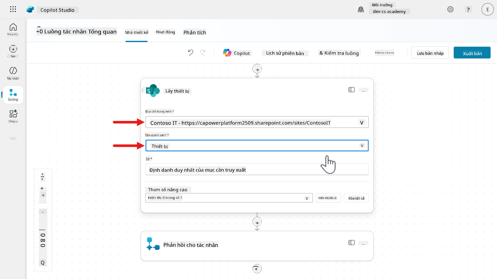

1. Trong trường **Id**, chọn **biểu tượng tia sét** hoặc **biểu tượng fx** ở bên phải.

    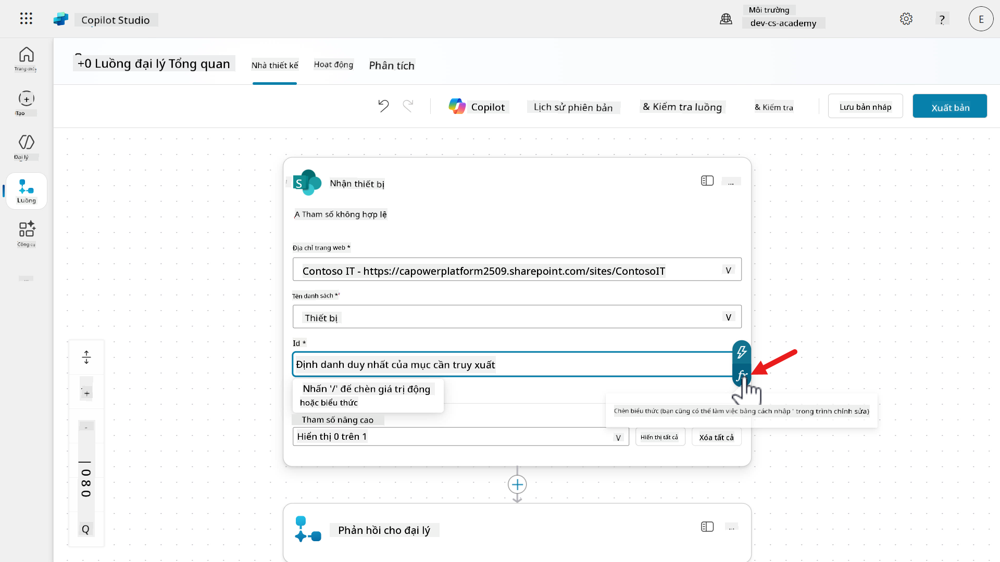

1. Trong tab **Nội dung động** của bảng điều khiển, nhập như sau,

    ```text
    sharepoint
    ```

    Kết quả tìm kiếm sẽ hiển thị các tham số đầu vào khớp với giá trị đã tìm kiếm. Chọn tham số **DeviceSharePointId** từ trigger.

    Tiếp theo, chọn **Thêm** để thêm đầu vào nội dung động vào tham số **Id** của hành động.

    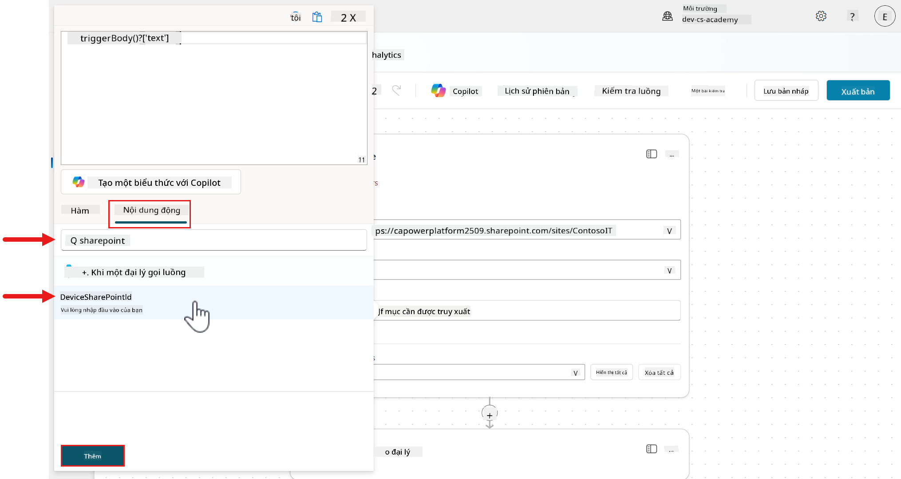

1. Đầu vào nội dung động từ trigger hiện đã được tham chiếu trong tham số **Id** của hành động. Chúng ta sẽ cập nhật một trong các tham số nâng cao tiếp theo. Chọn **Hiển thị tất cả** để xem các tham số nâng cao.

    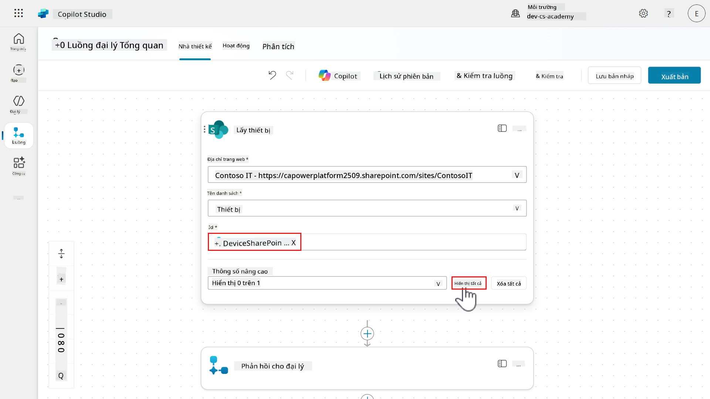

1. Tham số **Giới hạn Cột theo Chế độ xem** sẽ được hiển thị và mặc định được đặt là **Sử dụng tất cả các cột (Không giới hạn)**. Chúng ta sẽ cập nhật giá trị này thành một chế độ xem để giới hạn các cột được trả về trong phản hồi của hành động. Chọn tham số **Giới hạn Cột theo Chế độ xem** để xem danh sách các chế độ xem.

    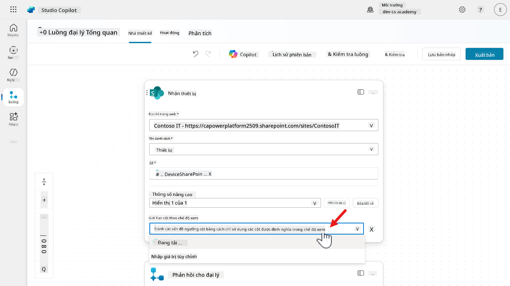

1. Chọn chế độ xem **Tất cả các mục**.

    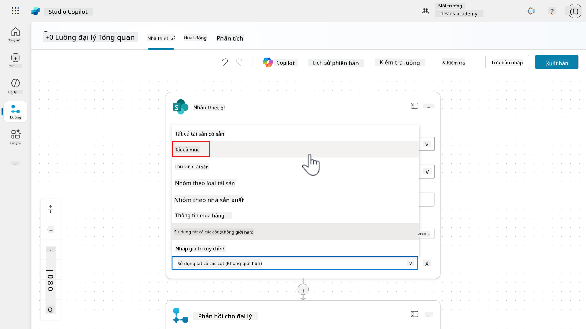

1. Chọn **biểu tượng cộng +** dưới hành động _Get Device_ để chèn một hành động mới.

    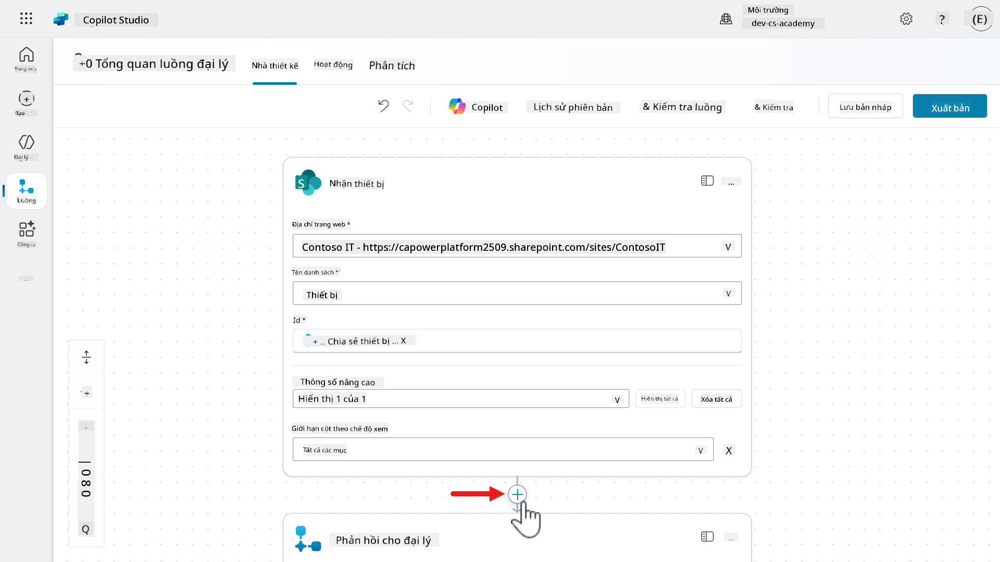

1. Trong trường tìm kiếm, nhập như sau,

    ```text
    send an email
    ```

    Một danh sách các hành động sẽ hiển thị trong kết quả tìm kiếm. Chọn hành động **Send an email (V2)** từ kết nối **Office 365 Outlook**.

    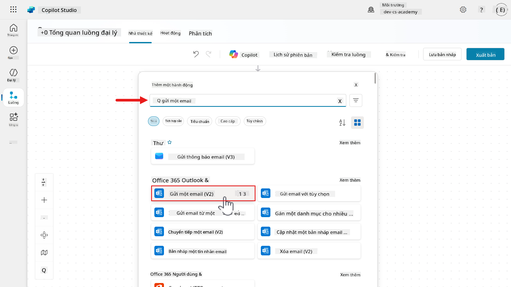

1. Tiếp theo, chúng ta cần tạo một kết nối cho hành động kết nối. Chọn **Đăng nhập**.

    

1. Chọn tài khoản người dùng đã đăng nhập của bạn.

    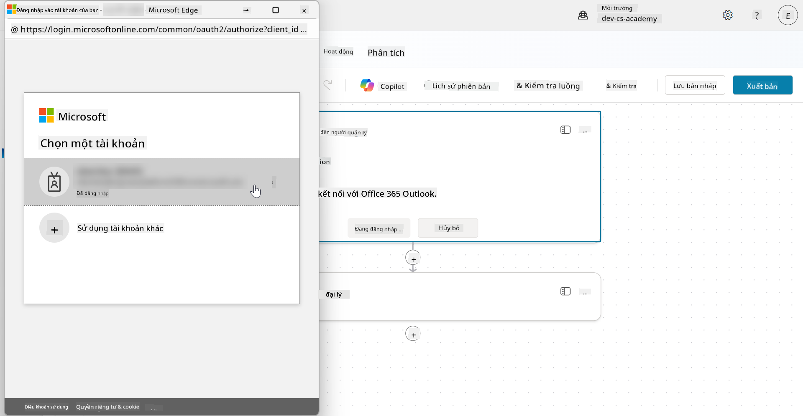

1. Chọn **Cho phép truy cập**. Một kết nối đã được tạo.

    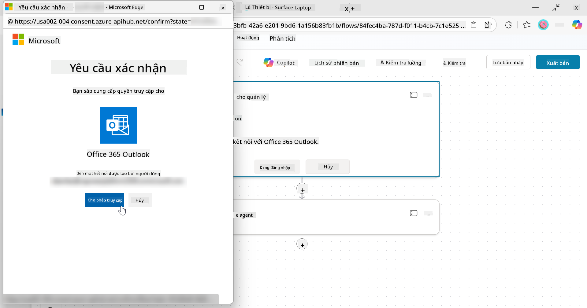

1. Đổi tên hành động thành,

    ```text
    Send an email to manager
    ```

    Tiếp theo, chúng ta sẽ định nghĩa các tham số đầu vào của hành động.

    Đối với tham số đầu vào **Đến**, chọn chính bạn. Thông thường, đây sẽ là quản lý của bạn hoặc chúng ta sẽ sử dụng một hành động khác để lấy thông tin quản lý của bạn dựa trên hồ sơ Entra ID của bạn, nhưng cho mục đích của bài học này, hãy chọn chính bạn.

    Đối với tham số đầu vào **Chủ đề**, nhập như sau,

    ```text
    Request type: new device
    ```

    Đối với tham số đầu vào **Nội dung**, nhập như sau,

    ```text
    Hi,

    New device requested from

    Manufacturer:
    Model:
    Link to item in SharePoint
    Additional comments from:

    This is an automated email from Contoso Helpdesk Copilot
    ```

    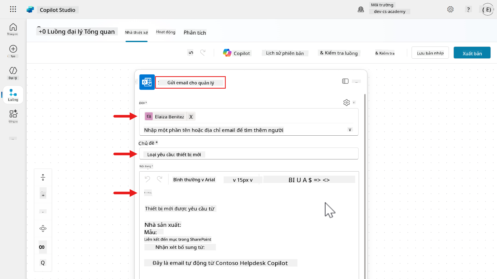

1. Tiếp theo, chúng ta sẽ cập nhật tham số đầu vào **Nội dung** với các tham chiếu đến đầu vào nội dung động từ **trigger** hoặc hành động **Get item**. Nhập một khoảng trắng sau dòng thứ hai vì chúng ta sẽ chèn tên của người dùng từ đầu vào trigger, **User**.

    Chọn **biểu tượng tia sét** hoặc **biểu tượng fx** ở bên phải.

    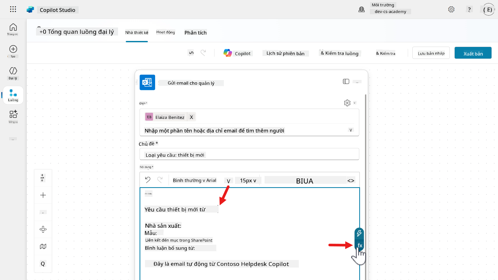

1. Trong tab **Nội dung động** của bảng điều khiển, chọn đầu vào **User** từ trigger.

    Chọn **Thêm** để thêm đầu vào nội dung động **User** vào tham số **Nội dung** của hành động.

    
1. Nội dung động từ trigger hiện được tham chiếu trong tham số **Body** của hành động. Chúng ta sẽ lặp lại tương tự cho các dòng còn lại trong nội dung email.

    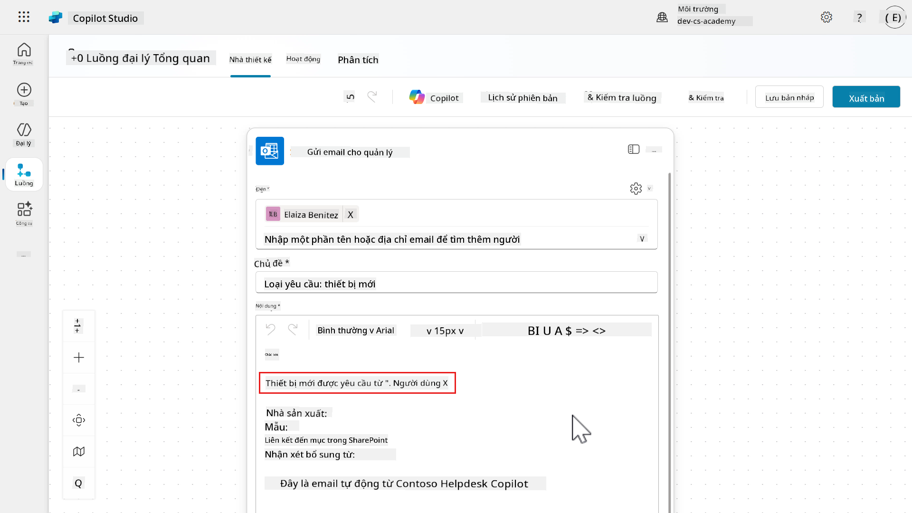

1. Nhấp vào khoảng trống bên cạnh `Manufacturer:`. Chọn biểu tượng **tia sét** hoặc biểu tượng **fx** ở bên phải.

    Trong tab **Dynamic content** của bảng điều khiển, nhập nội dung sau vào trường tìm kiếm,

    ```text
    manufacturer
    ```

    Chọn đầu vào **Manufacturer value** từ trigger và nhấn **Add**.

    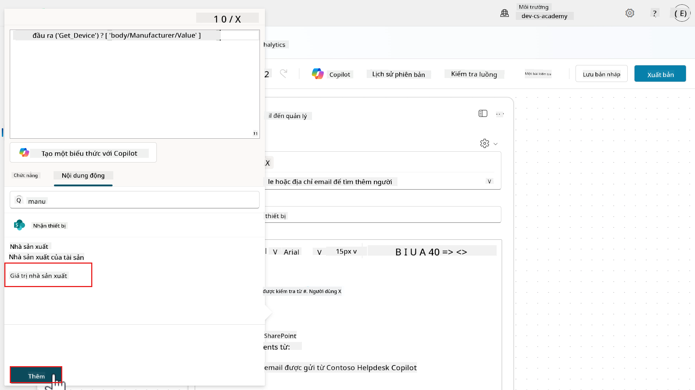

1. Nhấp vào khoảng trống bên cạnh `Model:`. Chọn biểu tượng **tia sét** hoặc biểu tượng **fx** ở bên phải.

    Trong tab **Dynamic content** của bảng điều khiển, nhập nội dung sau vào trường tìm kiếm,

    ```text
    model
    ```

    Chọn đầu vào **Model** từ hành động **Get item** và nhấn **Add**.

    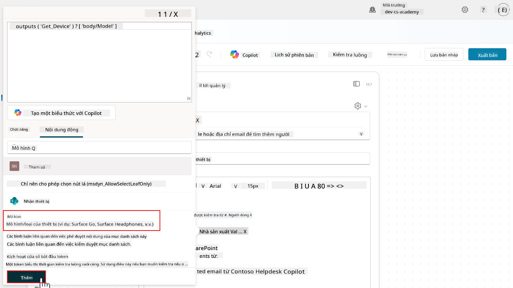

1. Đối với văn bản `Link to item in SharePoint`, chúng ta sẽ cập nhật thành một liên kết trong nội dung email. Nhấp vào đầu dòng và chọn biểu tượng **tia sét** hoặc biểu tượng **fx** ở bên phải.

    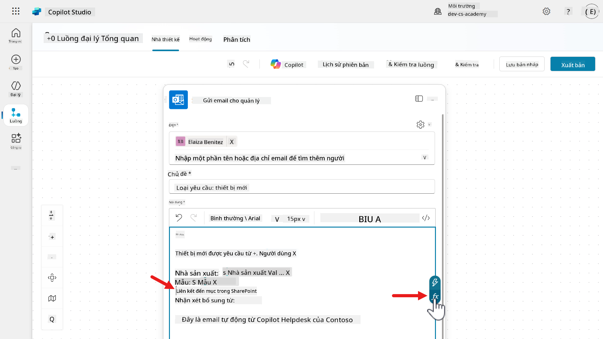

1. Nhấp sau thẻ HTML anchor và chọn biểu tượng **tia sét** hoặc biểu tượng **fx** ở bên phải.

    Trong tab **Dynamic content** của bảng điều khiển, nhập nội dung sau vào trường tìm kiếm,

    ```text
    link to item
    ```

    Chọn đầu vào **Link to item** từ hành động **Get item** và nhấn **Add**.

    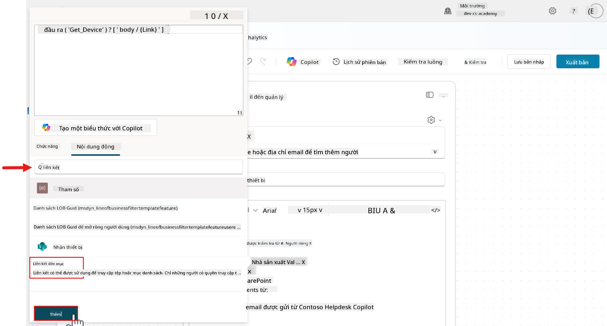

1. Chúng ta cần chuyển sang trình chỉnh sửa HTML bằng cách chọn biểu tượng **&lt;/&gt;**.

    

1. Trình chỉnh sửa HTML hiện đã được kích hoạt. Nhấp trước văn bản `Link to item in SharePoint`, thêm thẻ HTML anchor để tạo liên kết. Sao chép và dán nội dung sau.

    ```text
    <a href="
    ```

    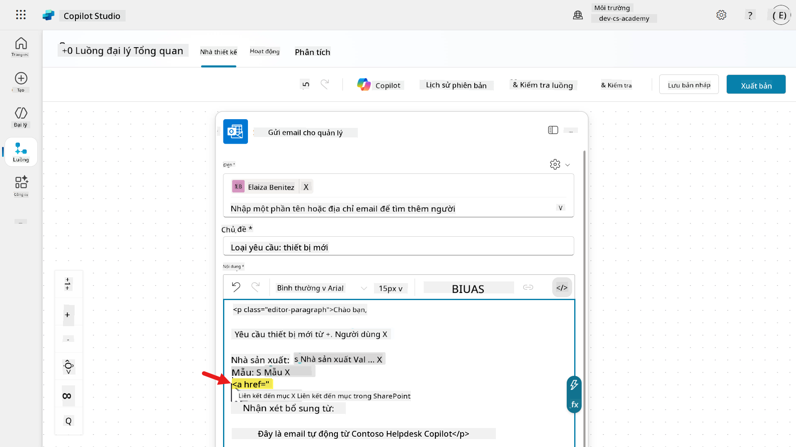

1. Đầu vào nội dung động của **Link to item** hiện được tham chiếu trong tham số **Body**. Nhấp sau đầu vào **Link to item**, sao chép và dán nội dung sau.

    ```text
    ">
    ```

    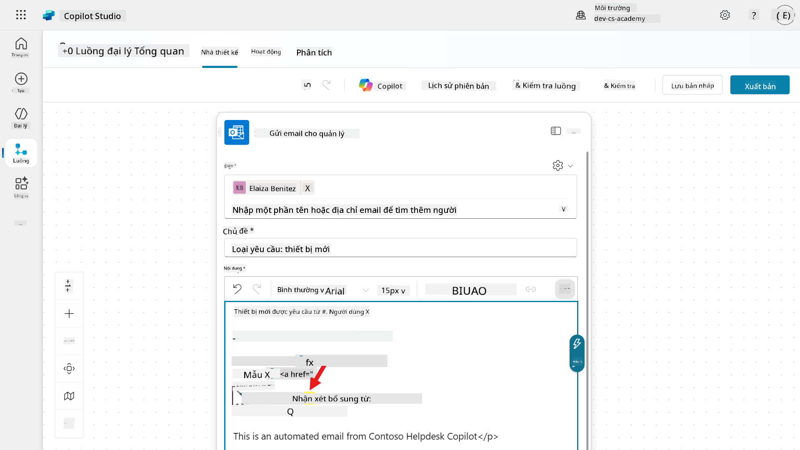

1. Nhấp sau văn bản `Link to item in SharePoint`, đóng thẻ HTML anchor. Sao chép và dán nội dung sau.

    ```text
    </a>
    ```

    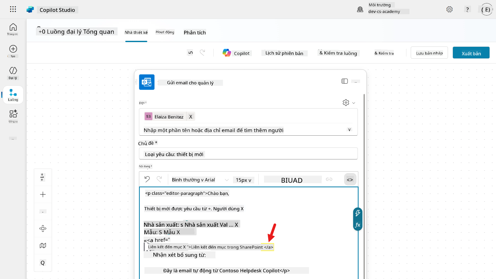

1. Chọn biểu tượng **&lt;/&gt;** để chuyển đổi chế độ xem mã.

    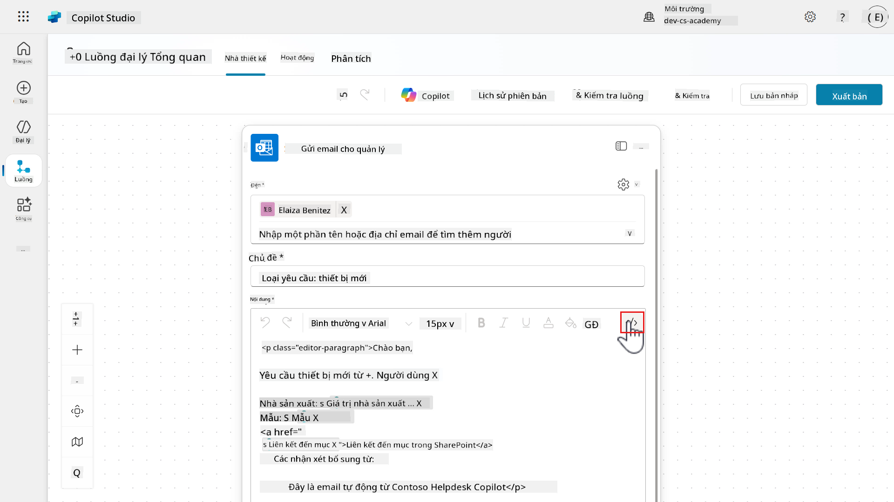

1. Sau đó chọn lại biểu tượng **&lt;/&gt;** để chuyển đổi chế độ xem mã một lần nữa.

    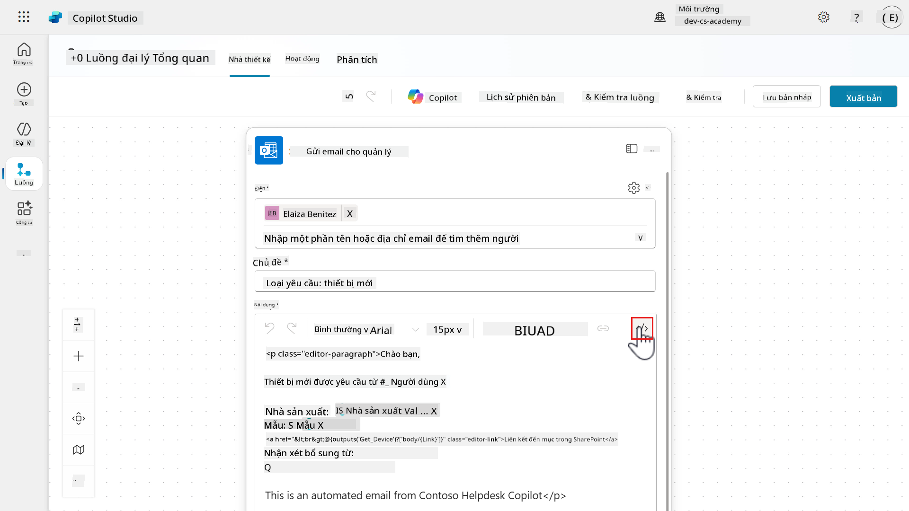

1. Lưu ý rằng có một số ký tự thừa `&lt;br&gt;`. Xóa các ký tự này.

    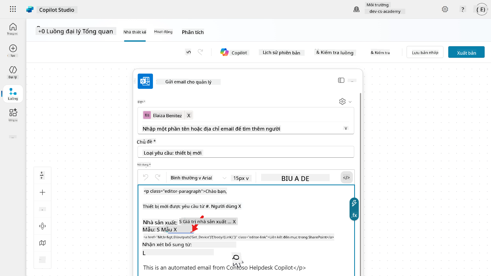

1. Chúng ta đã hoàn thành việc thêm liên kết vào nội dung email 😎 Chọn biểu tượng **&lt;/&gt;** để chuyển đổi chế độ xem mã.

    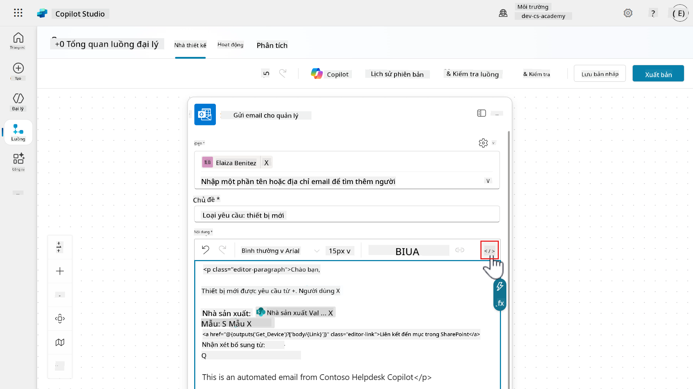

1. Nhấp sau văn bản `Additional comments from` trước ký tự dấu hai chấm và chọn biểu tượng **tia sét** hoặc biểu tượng **fx** ở bên phải.

    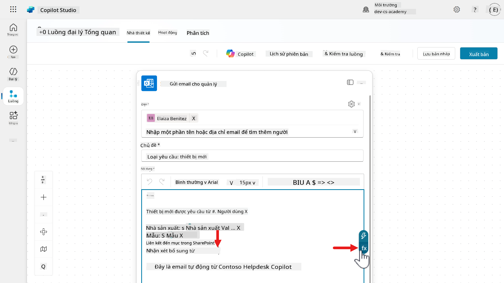

1. Trong tab **Dynamic content** của bảng điều khiển, nhập nội dung sau vào trường tìm kiếm,

    ```text
    user
    ```

    Chọn tham số **User** từ trigger và nhấn **Add**.

    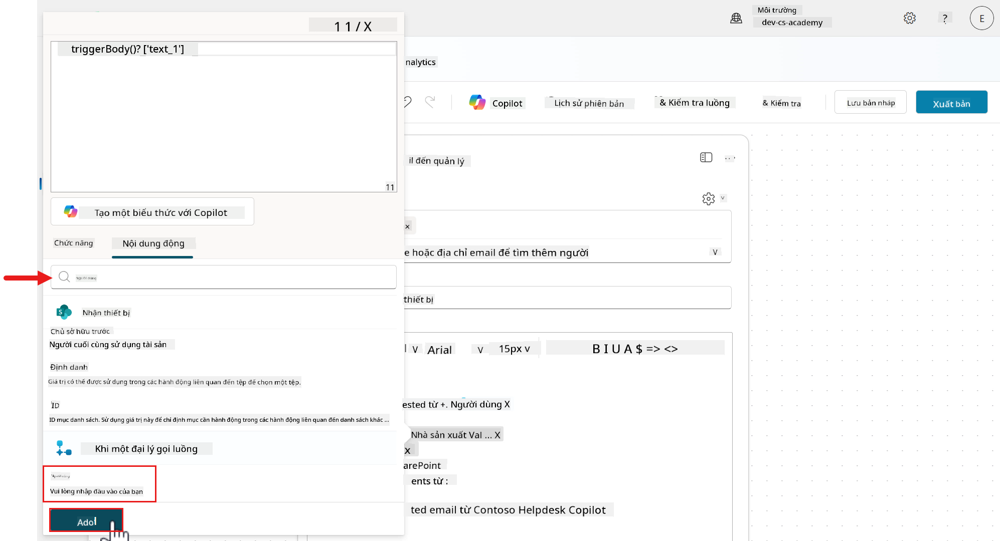

1. Bây giờ chúng ta sẽ chèn một biểu thức hiển thị giá trị của Additional Comments nếu người dùng cung cấp trong nút **Ask an adaptive card**, nếu không sẽ hiển thị "None" nếu người dùng không cung cấp bất kỳ nhận xét nào.

    Nhấp sau dấu hai chấm và chọn biểu tượng **tia sét** hoặc biểu tượng **fx** ở bên phải.

    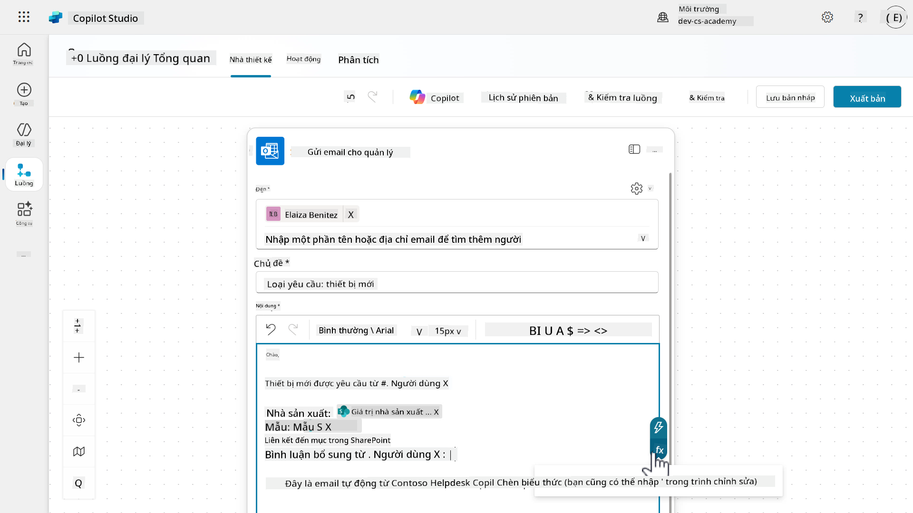

1. Trong tab **Function** của bảng điều khiển và trong trường biểu thức phía trên, nhập nội dung sau,

    ```text
    if(empty())
    ```

    Biểu thức này sử dụng hàm `if` cho câu lệnh if-else.

    Hàm tiếp theo được sử dụng là `empty` kiểm tra xem một giá trị có tồn tại hay không trong tham số chuỗi. Tham số chuỗi được tham chiếu là giá trị tham số đầu vào `AdditionalComments` từ trigger.

    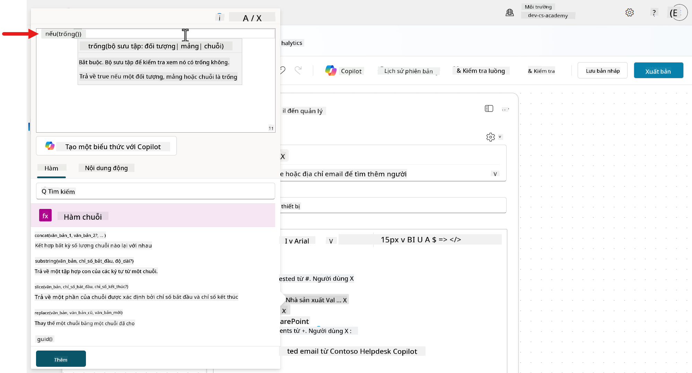

1. Tiếp theo, nhấp **bên trong dấu ngoặc** sau hàm `empty`. Chúng ta sẽ chèn tham số đầu vào `AdditionalComments` từ trigger.

    Chọn tab **Dynamic content**. Nhập nội dung sau vào trường tìm kiếm,

    ```text
    Additional
    ```

    Cuộn xuống bảng điều khiển và chọn đầu vào **AdditionalComments** từ trigger. Tham số này sẽ được thêm làm tham số chuỗi trong biểu thức.

    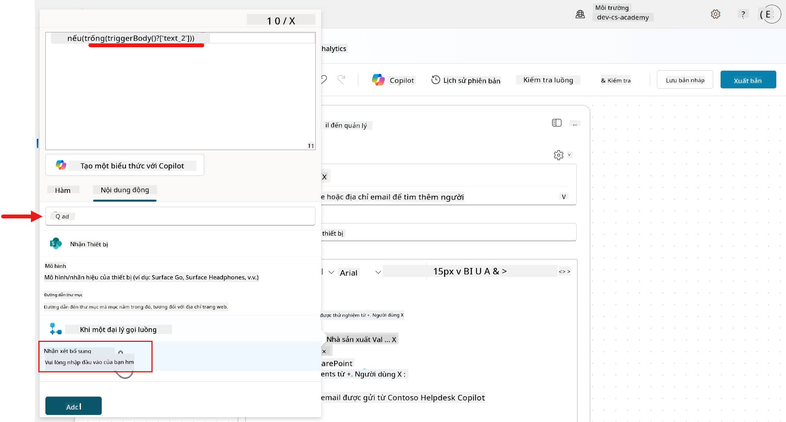

1. Tiếp theo, chúng ta sẽ định nghĩa logic **_true_**, nơi nếu tham số chuỗi `AdditionalComments` trống, thì chúng ta muốn hiển thị một chuỗi (văn bản) là `None`.

    Sau dấu ngoặc bao quanh tham số chuỗi, nhập nội dung sau,

    ```text
    , 'None',
    ```

    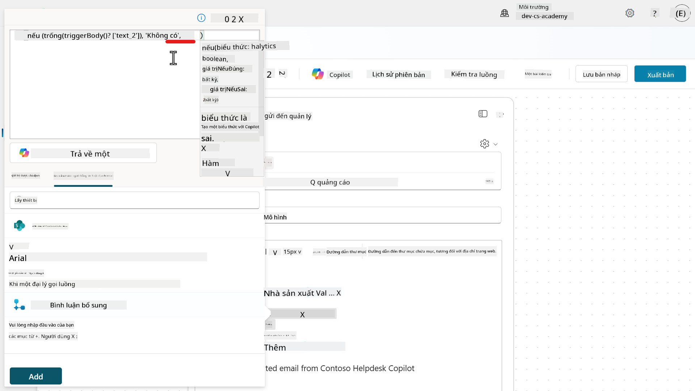

1. Cuối cùng, chúng ta sẽ định nghĩa logic **_false_**, nơi nếu tham số chuỗi `AdditionalComments` không trống, thì chúng ta muốn hiển thị giá trị của tham số đầu vào **AdditionalComments** từ trigger của chúng ta.

    > Nhắc nhở rằng giá trị này sẽ từ trường Additional Comments của thẻ thích ứng trong nút **Ask with adaptive card** trong chủ đề **Request device**.

    Sau dấu phẩy sau logic **_true_**, chọn tab **Dynamic content**. Nhập nội dung sau vào trường tìm kiếm,

    ```text
    Additional
    ```

    Cuộn xuống bảng điều khiển và chọn đầu vào **AdditionalComments** từ trigger. Tham số này sẽ được thêm làm tham số chuỗi trong biểu thức.

    Bây giờ thêm nó vào tham số **Body** của chúng ta bằng cách chọn **Add**.

    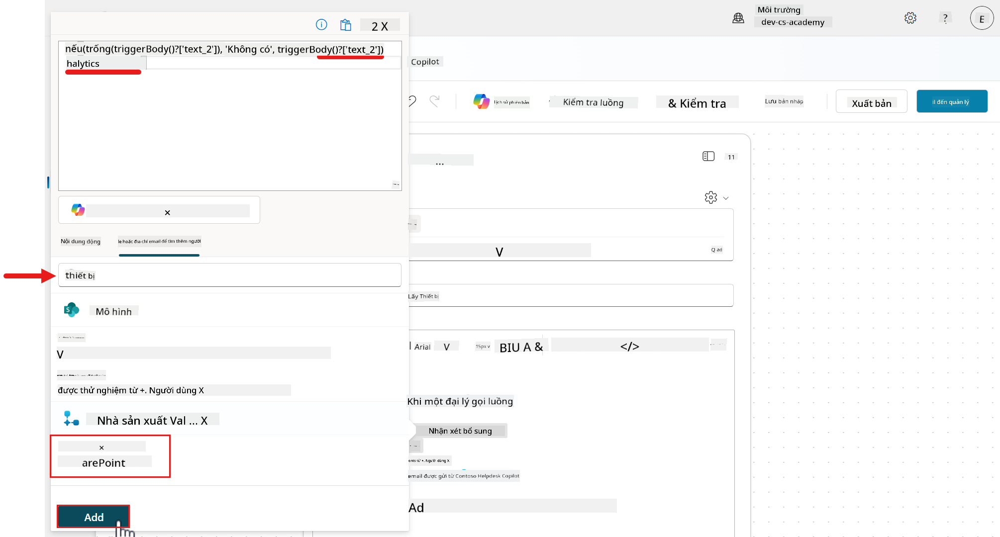

1. Tuyệt vời, biểu thức của chúng ta đã hoàn thành! Biểu thức hiện đã được thêm vào tham số **Body**. Cuối cùng, định dạng dòng cuối cùng bằng chữ nghiêng.

    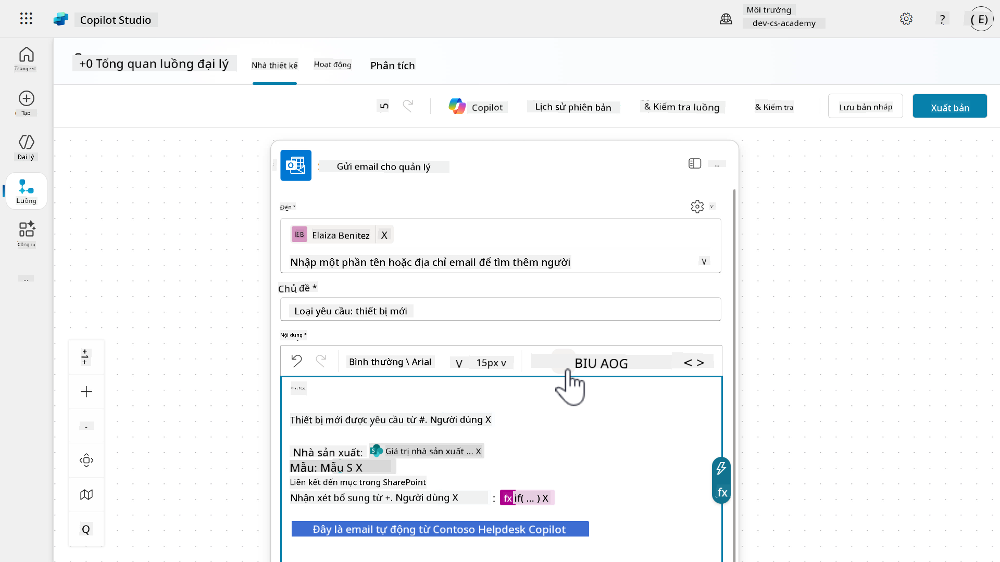

1. Bây giờ chúng ta sẽ cập nhật hành động **Respond to the agent** để gửi giá trị của tham số **Model value** từ hành động **Get item** trở lại cho nhân viên.

    Nhấn giữ phím trái chuột và di chuyển lên trên trong trình thiết kế để xem hành động **Respond to the agent**.

    Chọn hành động **Respond to the agent** và chọn đầu ra **Text** làm loại.

    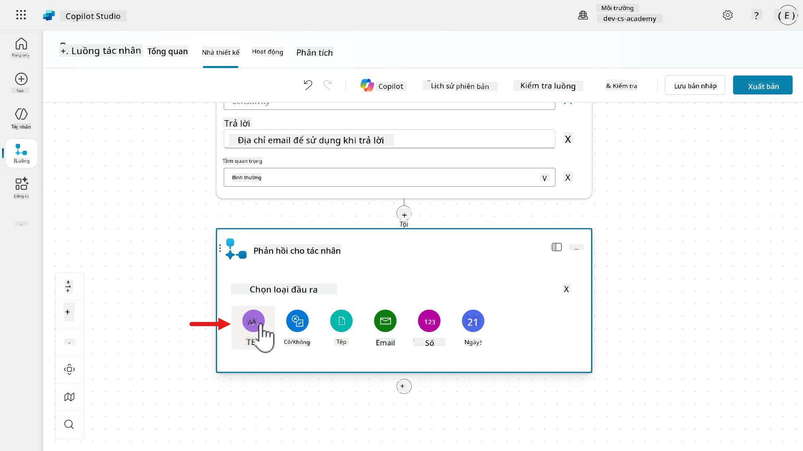

1. Nhập nội dung sau làm tên của đầu ra.

    ```text
    ModelValue
    ```

    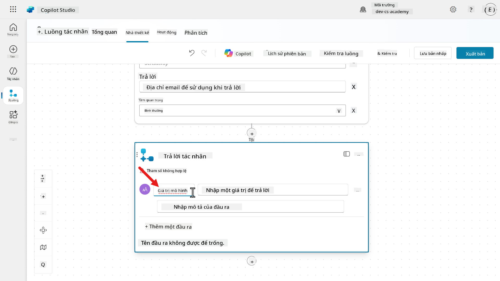

1. Chọn trường giá trị và chọn biểu tượng **tia sét** hoặc biểu tượng **fx** ở bên phải.

    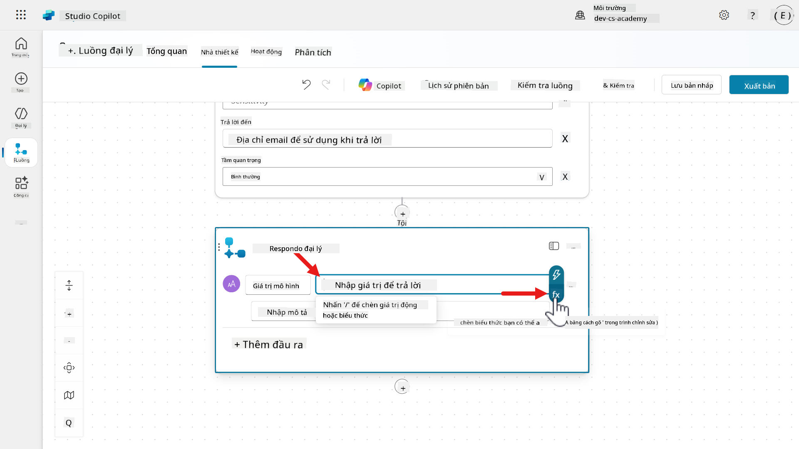

1. Trong tab **Dynamic content** của bảng điều khiển, nhập nội dung sau vào trường tìm kiếm,

    ```text
    model
    ```

    Chọn tham số **Model** từ hành động **Get item** và nhấn **Add**.

    

1. Tham số **Model** hiện là giá trị của đầu ra văn bản. Chọn **Save draft** để lưu luồng nhân viên của chúng ta.

    Chúng ta đã hoàn thành luồng nhân viên 👏🏻

    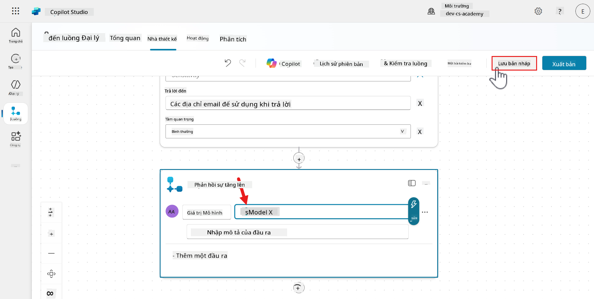

1. Hãy thực hiện một cập nhật cuối cùng cho luồng nhân viên trước khi xuất bản. Chọn tab **Overview** và chọn **Edit**.

    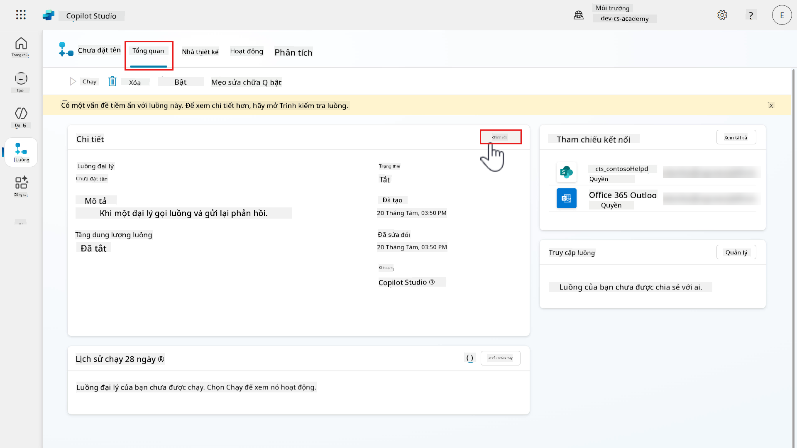

1. Đối với **Flow name**, sao chép và dán nội dung sau.

    ```text
    Send device request email
    ```

    Đối với **Description**, chọn biểu tượng **refresh** để sử dụng AI tự động tạo mô tả cho bạn dựa trên trigger và các hành động trong luồng nhân viên.

    Chọn **Save** để lưu tên và mô tả đã cập nhật của luồng nhân viên.

    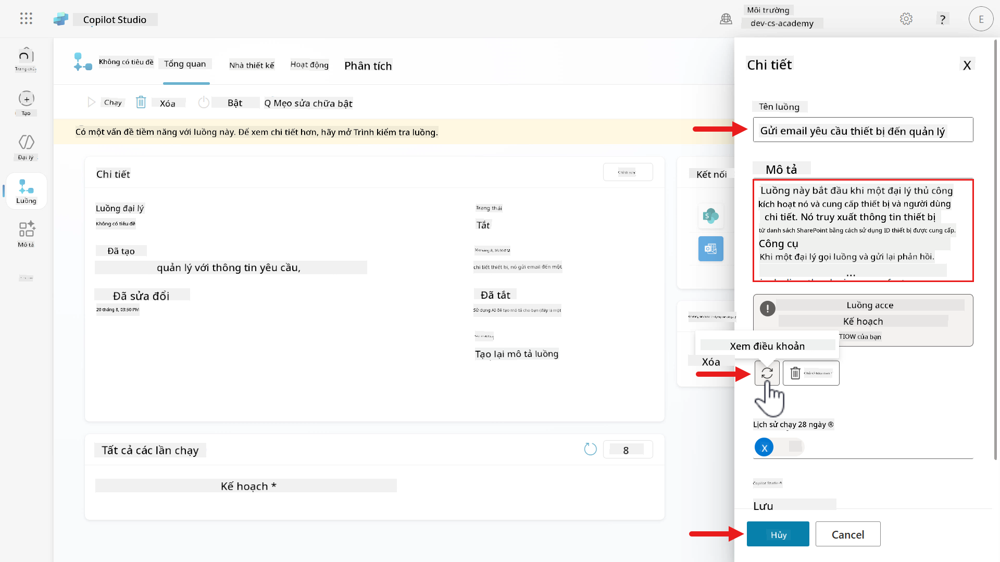

1. Chọn tab **Designer** và chọn **Publish** để xuất bản luồng nhân viên để nó có thể được thêm làm nút trong chủ đề **Request device**.

    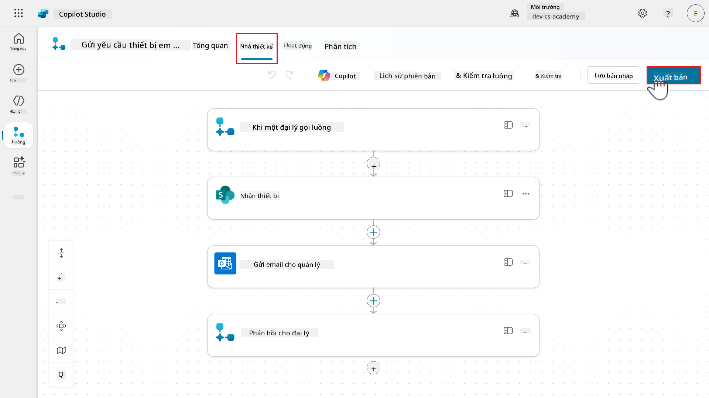

1. Một thông báo xác nhận sẽ xuất hiện ngay sau đó để xác nhận luồng nhân viên đã được xuất bản.

    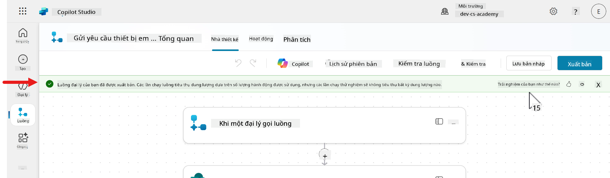

### 9.2 Thêm luồng nhân viên vào chủ đề

Bây giờ chúng ta hãy thêm luồng nhân viên vào chủ đề **Request device**.

1. Chọn **Agents** trong menu bên trái và chọn **Contoso Helpdesk Agent**.

    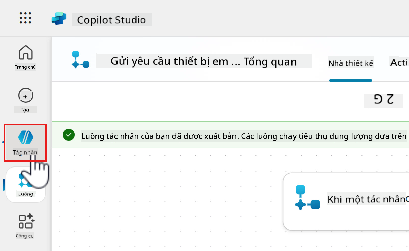

1. Chọn tab **Topics**.

    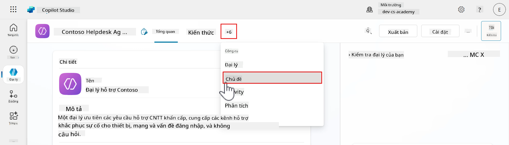

1. Chọn chủ đề **Request device**.

    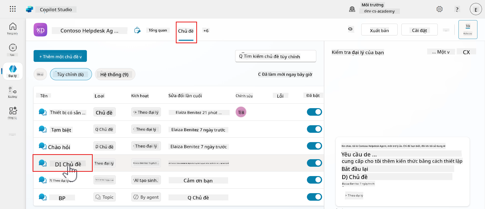

1. Cuộn xuống nút **Ask with adaptive card** và thêm một nút mới.

    Chọn **Add a tool** và trong tab **Basic tools** của bảng điều khiển, chọn luồng nhân viên **Send device request email** mà chúng ta vừa tạo và xuất bản.

    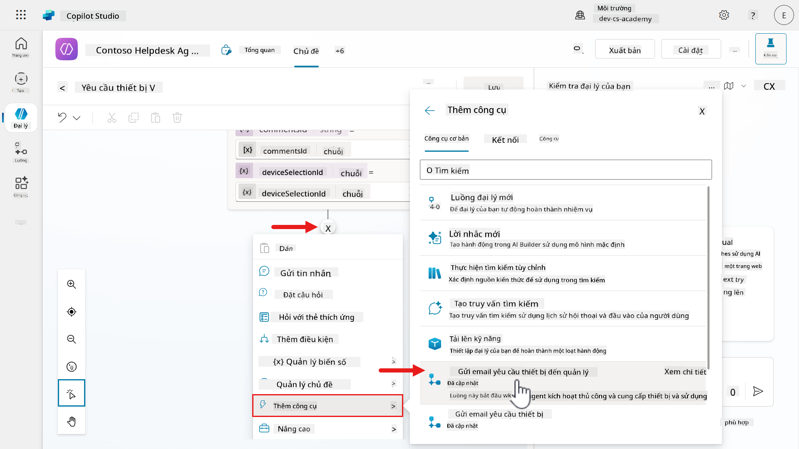

1. Đối với đầu vào trigger của luồng nhân viên, chúng ta cần chọn các đầu ra biến từ nút **Ask with adaptive card**.

    Chọn biểu tượng **ellipsis (...)** cho đầu vào **DeviceSharePointId**.

    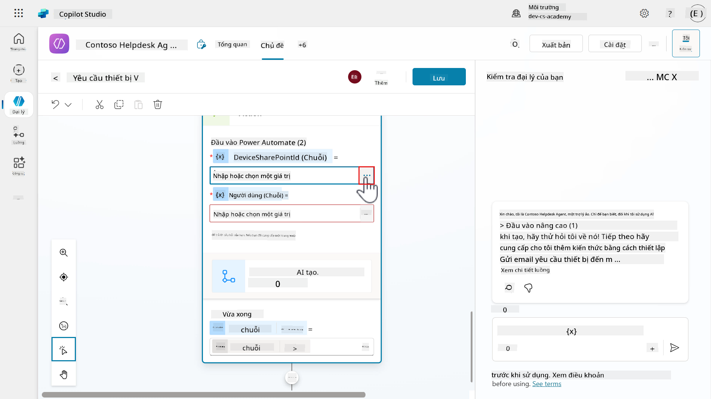

1. Chọn biến **deviceSelectionId** là một trong các đầu ra được định nghĩa trong nút **Ask with adaptive card**.

    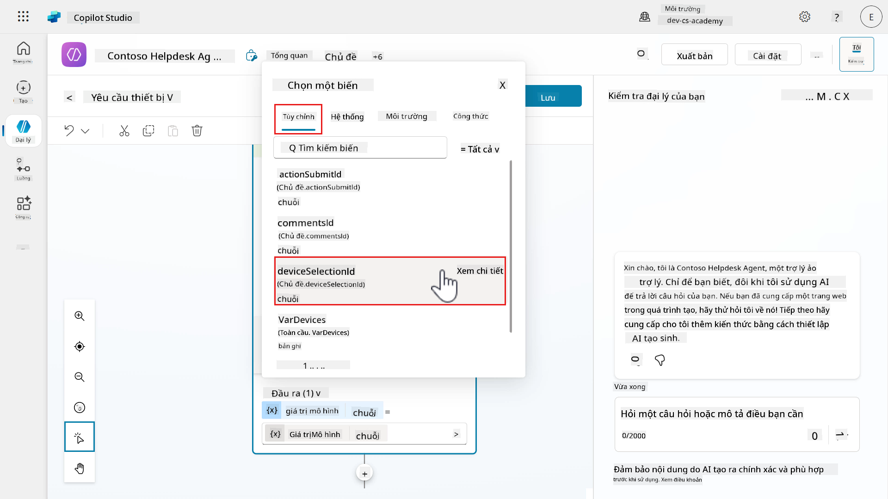

1. Tiếp theo, chọn biểu tượng **ellipsis (...)** cho đầu vào **User**.

    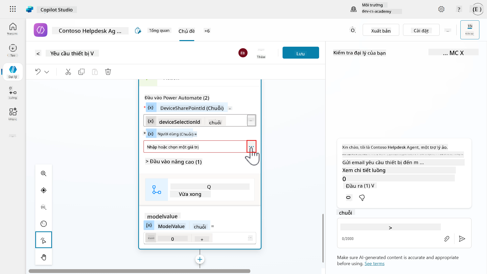

1. Chọn tab **System** trong bảng điều khiển biến và chọn **User.DisplayName**. Biến này lưu trữ tên hiển thị của người dùng nội bộ tương tác với nhân viên.

    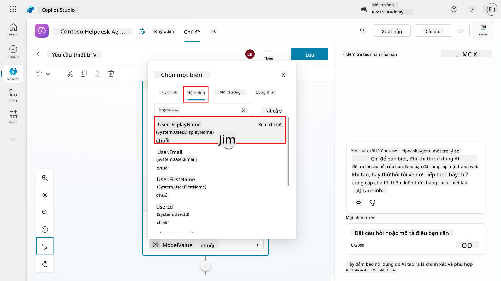

1. Tiếp theo, chọn biểu tượng **greater than** cho **Advanced inputs** để mở rộng và xem đầu vào **AdditionalComments**.

    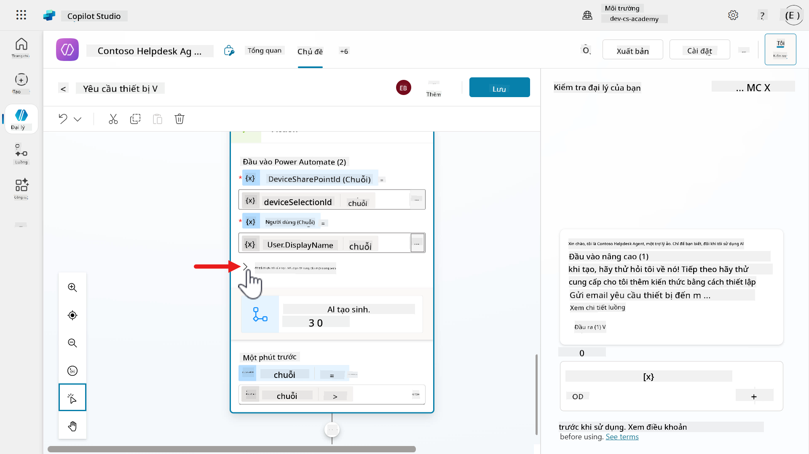

1. Chọn biểu tượng **ellipsis (...)** cho đầu vào AdditionalComments.

    

1. Chọn tab **Formula** và biểu tượng mở rộng trong bảng điều khiển biến vì chúng ta sẽ sử dụng biểu thức Power Fx.

    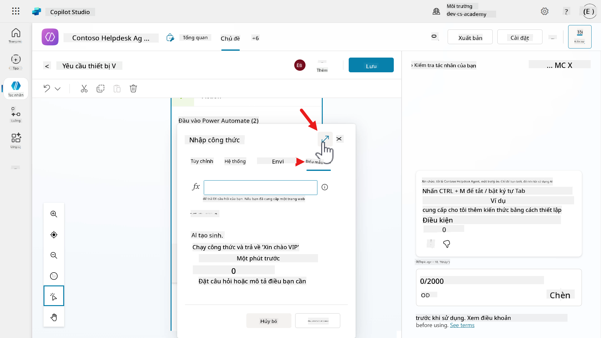

1. Tương tự như biểu thức trong luồng nhân viên thực hiện kiểm tra điều kiện bằng hàm _if_, nhưng lần này
    - sử dụng các hàm Power Fx,
    - và chèn hoặc không có giá trị, hoặc giá trị của biến đầu ra `commentsId` từ nút **Ask with adaptive card**.

    Nhập các hàm sau vào trường Power Fx,

    ```text
    If(IsBlank())
    ```

Biểu thức này sử dụng hàm `If` cho câu lệnh if-else.

Hàm tiếp theo được sử dụng là `IsBlank`, kiểm tra xem một giá trị có tồn tại hay không trong tham số chuỗi. Tham số chuỗi được tham chiếu là biến đầu ra `commentsId` từ nút **Ask with adaptive card**.

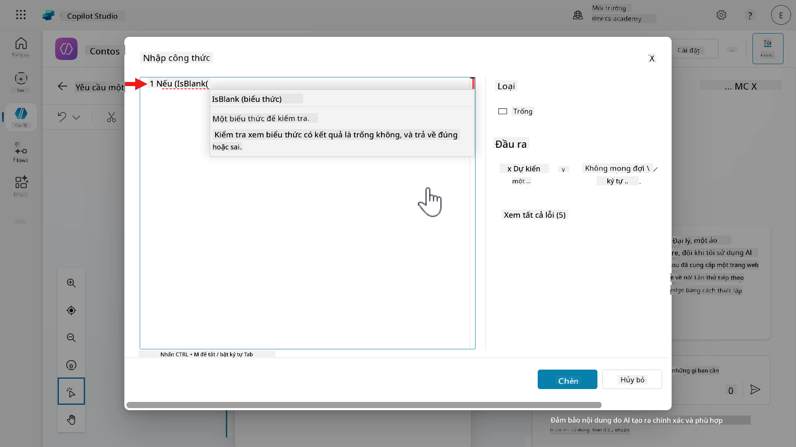

1. Tiếp theo, nhấp **bên trong dấu ngoặc** sau hàm `IsBlank`. Chúng ta sẽ chèn biến đầu ra `commentsId` từ nút **Ask with adaptive card**.

   Nhập nội dung sau vào bên trong dấu ngoặc,

    ```text
    Topic.commentsId
    ```

   Và thêm dấu phẩy sau dấu ngoặc.

   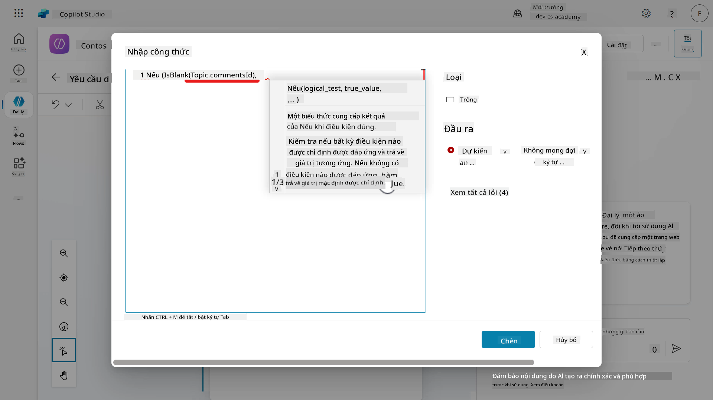

1. Tiếp theo, chúng ta sẽ định nghĩa logic

   - khi **_true_** - nếu tham số chuỗi `Topic.commentsId` trống, thì chúng ta sẽ không chèn giá trị nào.
   - khi **_false_** - nếu tham số chuỗi `Topic.commentsId` không trống, thì chèn giá trị của biến commentsId.

   Sau dấu ngoặc bao quanh tham số chuỗi, nhập nội dung sau,

    ```text
    "", Topic.commentsId)
    ```

   Biểu thức Power Fx sẽ như sau,

    ```text
    If(IsBlank(Topic.commentsId), "", Topic.commentsId)
    ```

   Làm tốt lắm, biểu thức của chúng ta đã hoàn thành! 🙌🏻 Bây giờ hãy chọn **Insert** để thiết lập tham số đầu vào của luồng agent với biểu thức Power Fx.

   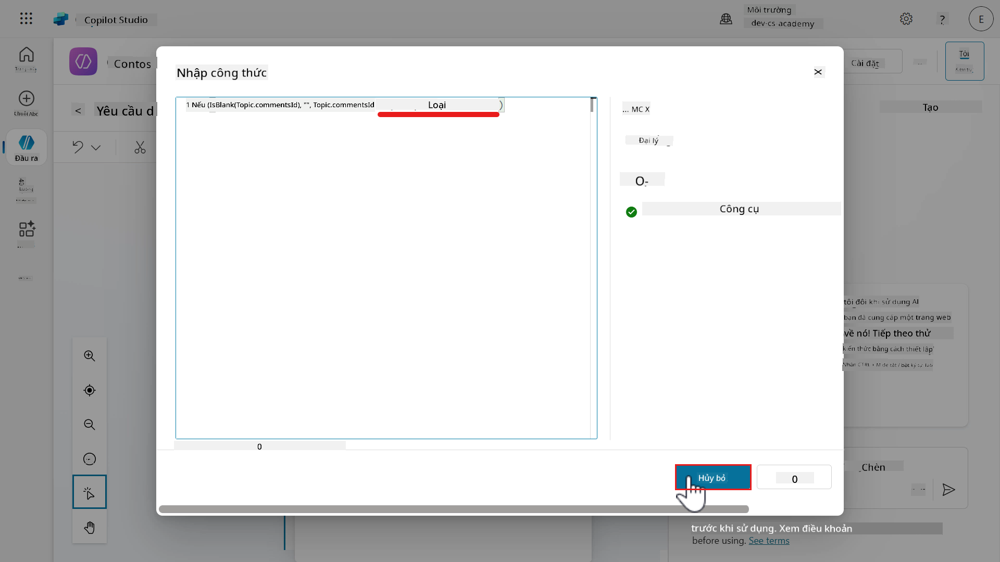

1. **Lưu** chủ đề.

### 9.3 Cập nhật chủ đề Yêu cầu thiết bị với nhiều nút để cải thiện trải nghiệm người dùng

Tiếp theo, chúng ta sẽ thêm hai nút nữa:

- **Send a message** - nút này sẽ hoạt động như một thông báo xác nhận, tham chiếu đến thiết bị đã chọn và yêu cầu của họ đã được gửi đi.

- **Topic management** - để kết thúc cuộc trò chuyện, chúng ta sẽ chuyển hướng đến nút **End of conversation**.

Bắt đầu nào!

1. Chọn **biểu tượng dấu cộng +** bên dưới nút luồng agent và chọn nút **Send a message**.

   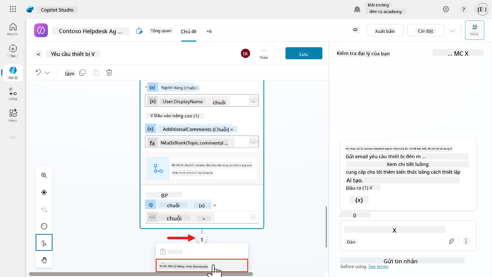

1. Nhập nội dung sau vào trường tin nhắn,

    ```text
    Thanks
    ```

   Sau đó chọn **Insert variable** vì chúng ta sẽ tham chiếu đến tên của người dùng.

   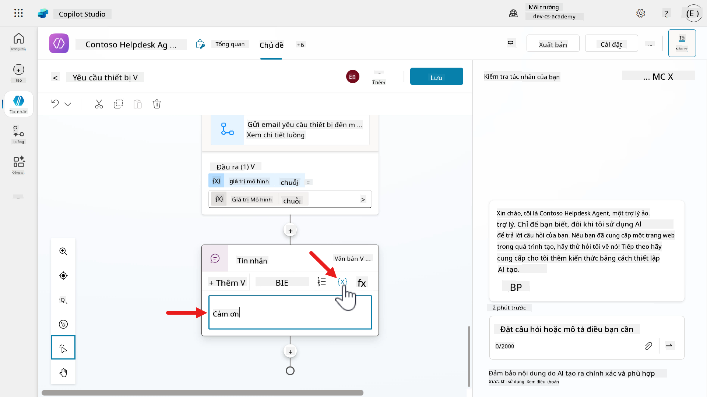

1. Chọn tab **System** và tìm kiếm `User` trong trường tìm kiếm. Chọn biến **User.DisplayName**.

   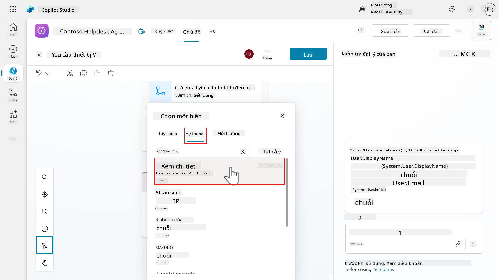

1. Nhập nội dung sau vào trường tin nhắn,

    ```text
    . Your selected device,
    ```

   Sau đó chọn **Insert variable** và lần này trong tab **Custom**, chọn biến **ModelValue**.

   Sau đó nhập nội dung sau để hoàn thành tin nhắn.

    ```text
    , has been submitted and will be reviewed by your manager.
    ```

   Tin nhắn sẽ trông như sau.

   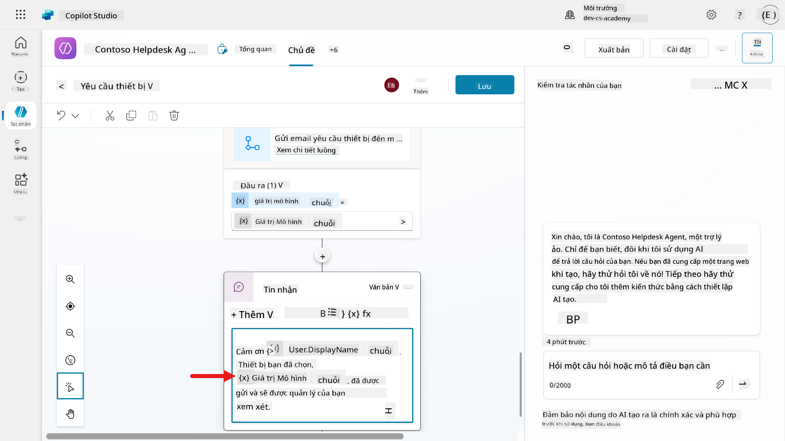

1. Cuối cùng, chọn **biểu tượng dấu cộng +** bên dưới nút **Send a message** và chọn **Topic management**, sau đó chọn **Go to another topic** và chọn **End of Conversation**.

   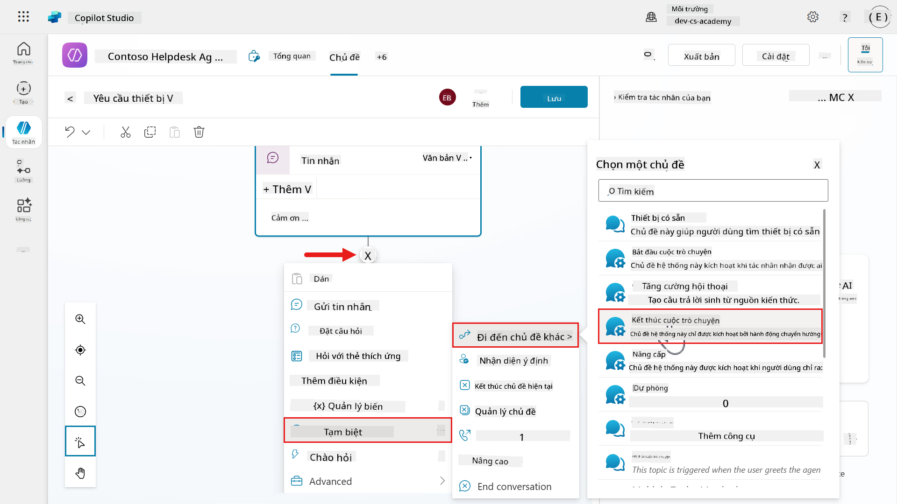

1. **Lưu** chủ đề.

   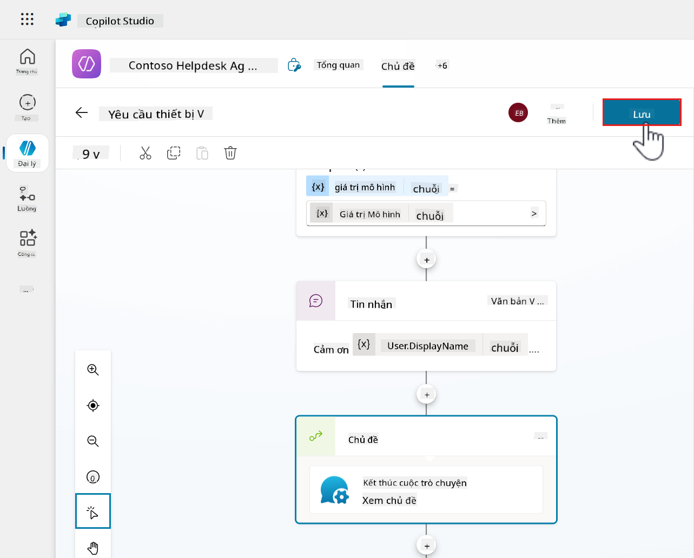

### 9.4 Kiểm tra agent với nhiều kịch bản

Làm tốt lắm!!! 😁 Bây giờ chúng ta có thể kiểm tra agent của mình.

#### 9.4.1 Yêu cầu một thiết bị và nhập bình luận trong adaptive card

1. **Làm mới** bảng kiểm tra, chọn biểu tượng **activity map** và nhập nội dung sau làm tin nhắn cho agent.

    ```text
    I need a laptop
    ```

   

1. Agent kích hoạt **Available devices** và phản hồi với danh sách các thiết bị có sẵn. Chúng ta sẽ nhập nội dung sau làm câu trả lời cho câu hỏi liệu chúng ta có muốn yêu cầu một thiết bị hay không.

    ```text
    Yes
    ```

   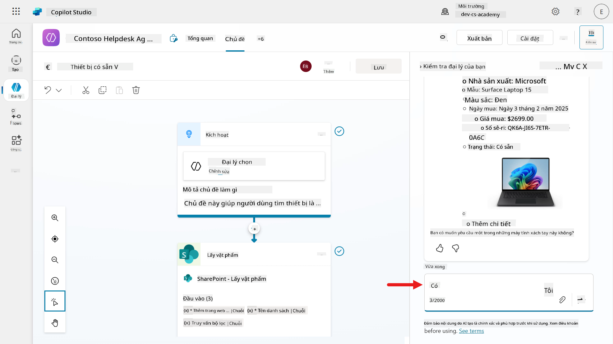

1. Lưu ý cách agent kích hoạt **Request device** theo hướng dẫn của agent và thẻ adaptive card hiện đang được hiển thị trong tin nhắn của agent.

   Chọn thiết bị **Surface Laptop 15** và thêm nội dung sau làm bình luận.

    ```text
    I need 16GB of RAM please
    ```

   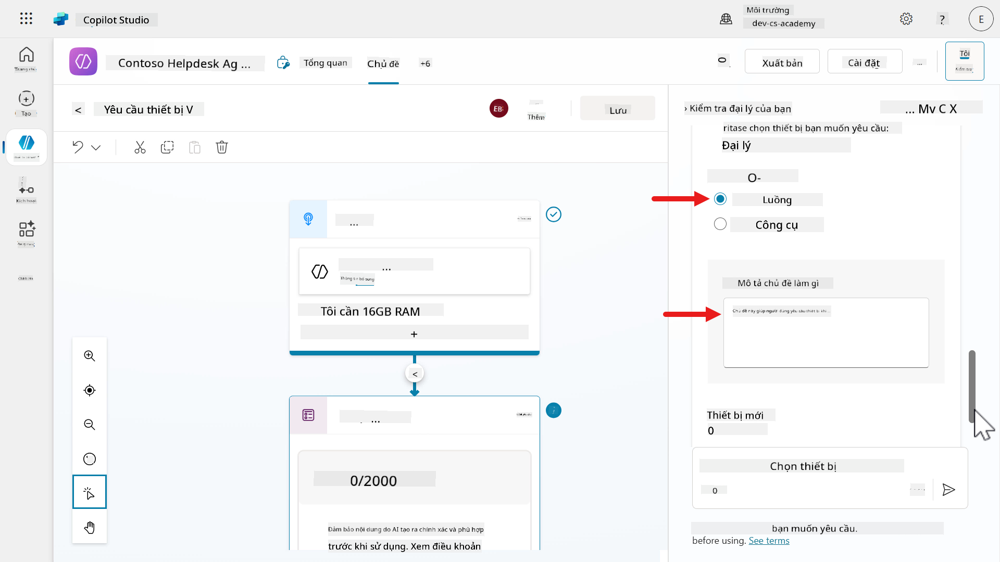

1. Cuộn xuống cho đến khi bạn thấy nút **Submit Request** và chọn nó để gửi thẻ adaptive card đến agent.

   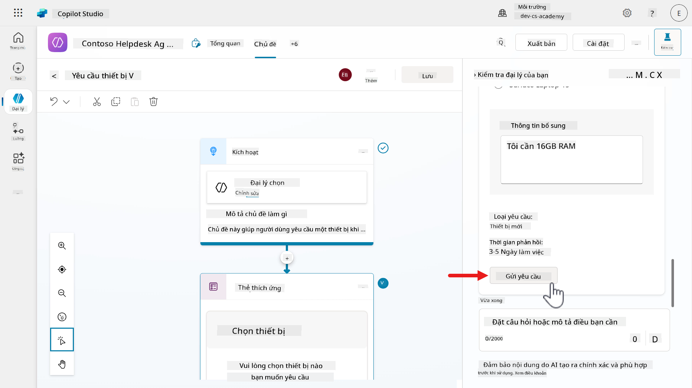

1. Chọn **Allow** để agent sử dụng thông tin xác thực của bạn cho việc xác thực kết nối của hai hành động kết nối.

   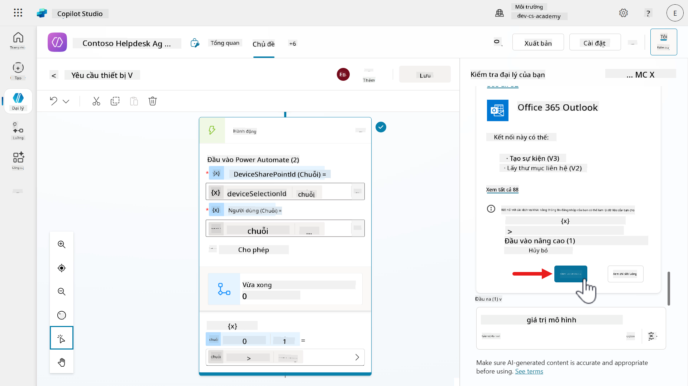

1. Sau đó, agent sẽ hiển thị thông báo xác nhận bao gồm model đã chọn, sau đó chuyển hướng đến chủ đề **End of Conversation**. Tuyệt vời!

   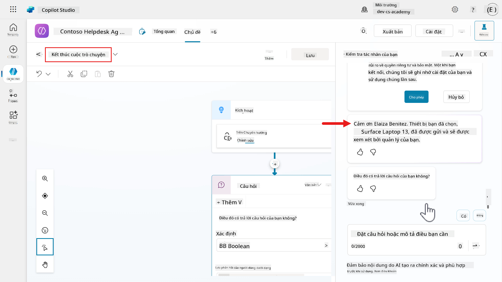

1. Chọn **Yes** để xác minh phần còn lại của chủ đề **End of Conversation**.

   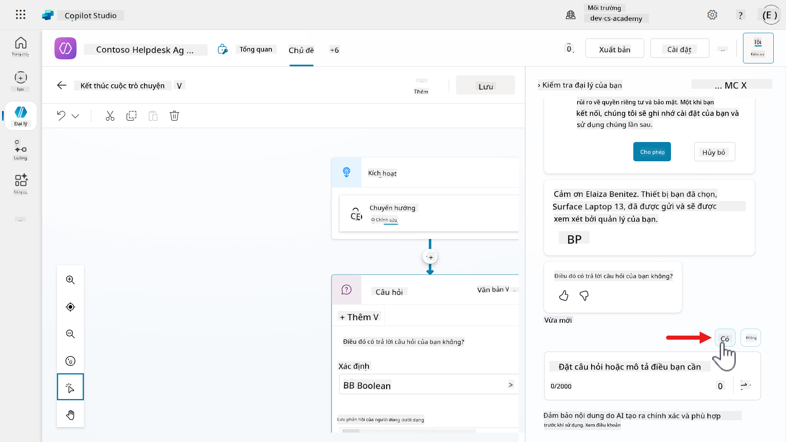

1. Tiếp theo, đánh giá trải nghiệm bằng cách chọn bất kỳ ngôi sao nào trong thẻ đánh giá.

   Sau đó, agent sẽ tiếp tục đến nút **Question** cuối cùng trong chủ đề **End of Conversation**. Chọn **No**.

   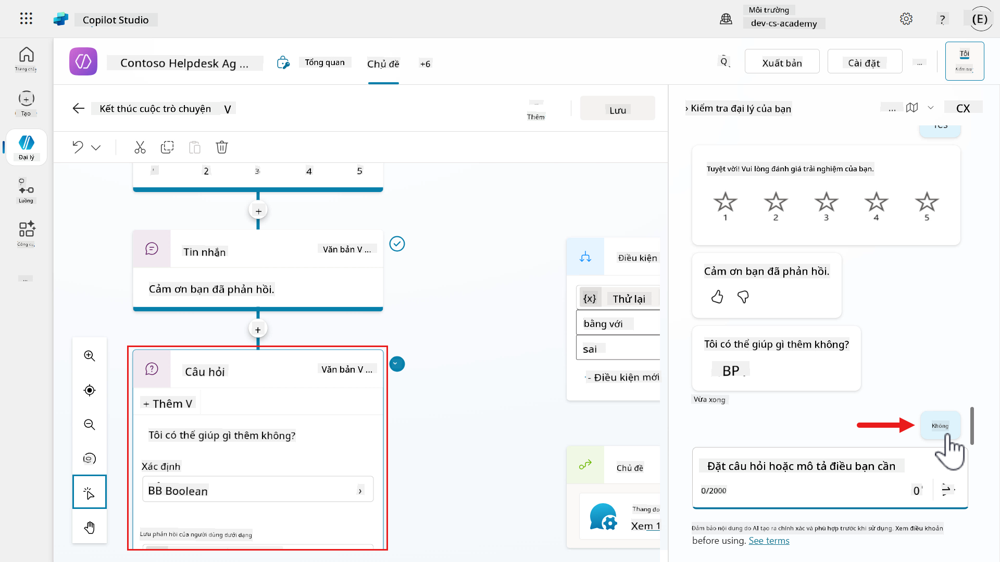

1. Chủ đề sau đó sẽ hoàn tất khi một tin nhắn cuối cùng được hiển thị trong bảng kiểm tra.

   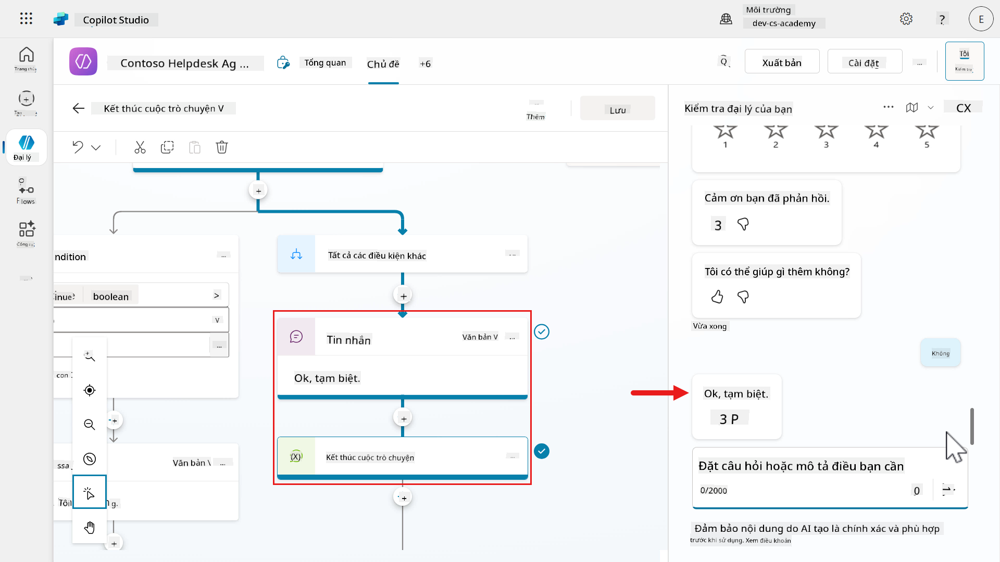

1. Kiểm tra hộp thư đến của tài khoản email của bạn để xem email được gửi đến quản lý bởi luồng agent. Bạn có thể thấy chi tiết của thiết bị đã chọn và ghi chú được nhập trong thẻ adaptive card.

   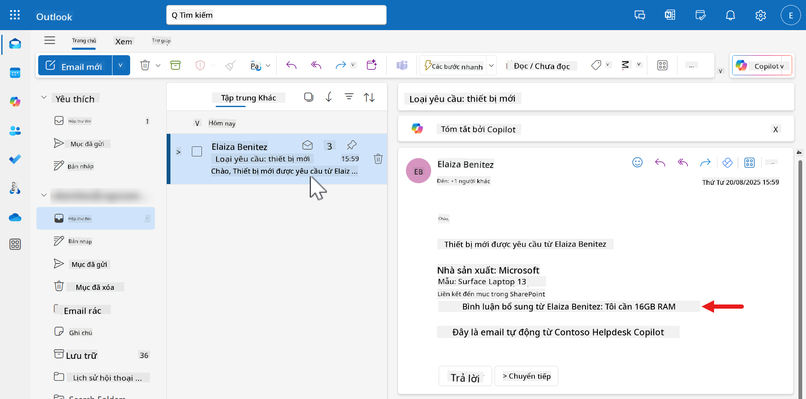

1. Nhấp vào liên kết và trình duyệt sẽ tải mục SharePoint của thiết bị. Tuyệt vời!

   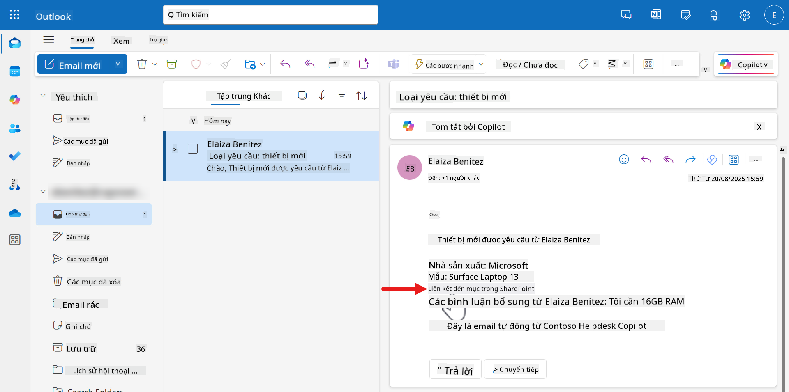

#### 9.4.2 Yêu cầu một thiết bị và không nhập bình luận trong adaptive card

Bây giờ hãy kiểm tra kịch bản khi không nhập bình luận.

1. Lặp lại các bước

   - **Làm mới** bảng kiểm tra và chọn biểu tượng **activity map**
   - Nhập tin nhắn, `I need a laptop`
   - Phản hồi với `Yes` cho câu hỏi về việc yêu cầu một thiết bị

   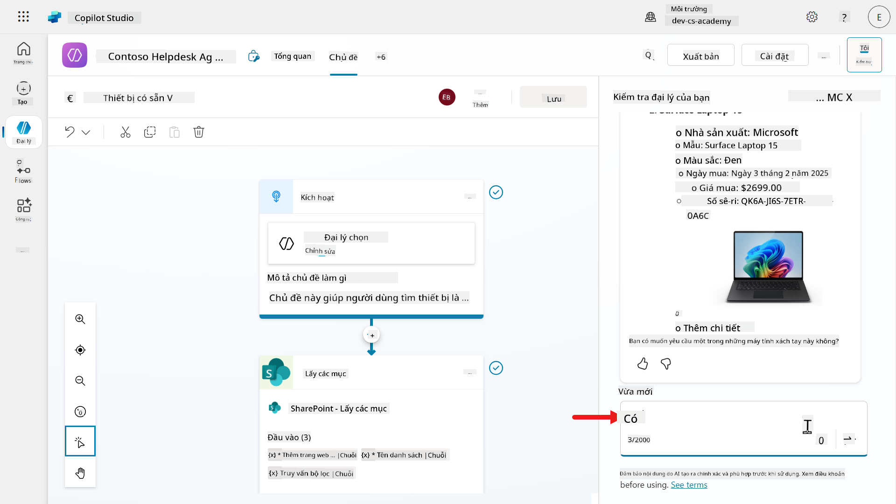

1. Lần này chọn **Surface Laptop 13** làm thiết bị và không nhập bình luận.

   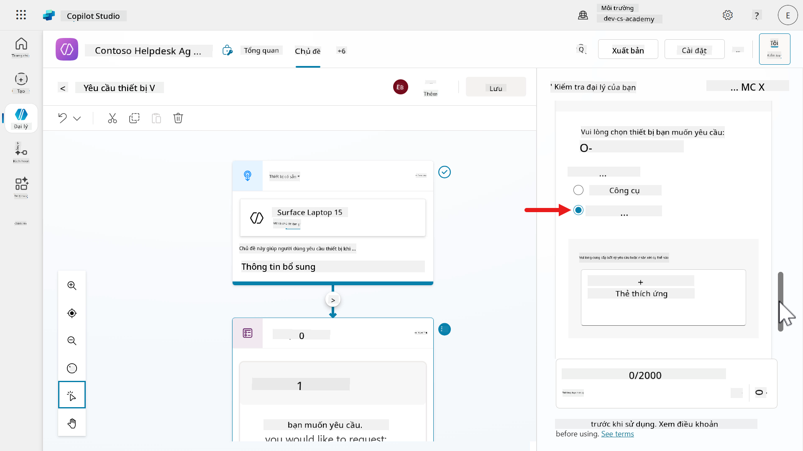

1. **Gửi** yêu cầu bằng cách chọn nút **Submit Request**.

   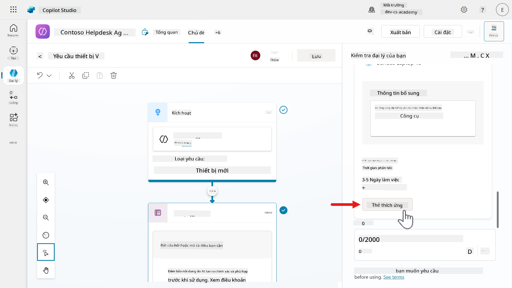

1. Lần này email nhận được trong hộp thư đến của bạn sẽ hiển thị **None** làm bình luận.

   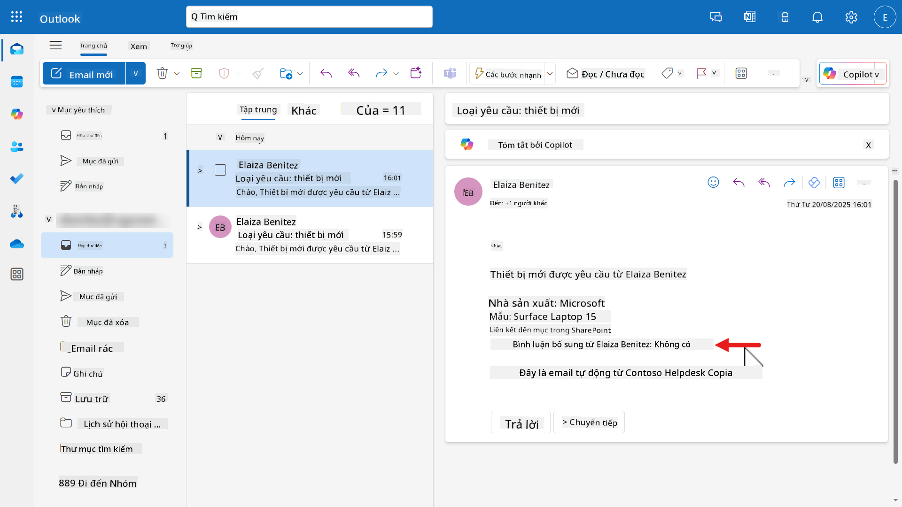

#### 9.4.3 Không yêu cầu thiết bị

Hãy kiểm tra kịch bản cuối cùng là không yêu cầu thiết bị, và chủ đề **Goodbye** sẽ được kích hoạt theo hướng dẫn của agent.

1. Lặp lại các bước

   - **Làm mới** bảng kiểm tra và chọn biểu tượng **activity map**
   - Nhập tin nhắn, `I need a laptop`
   - Lần này phản hồi với `No` cho câu hỏi về việc yêu cầu một thiết bị

   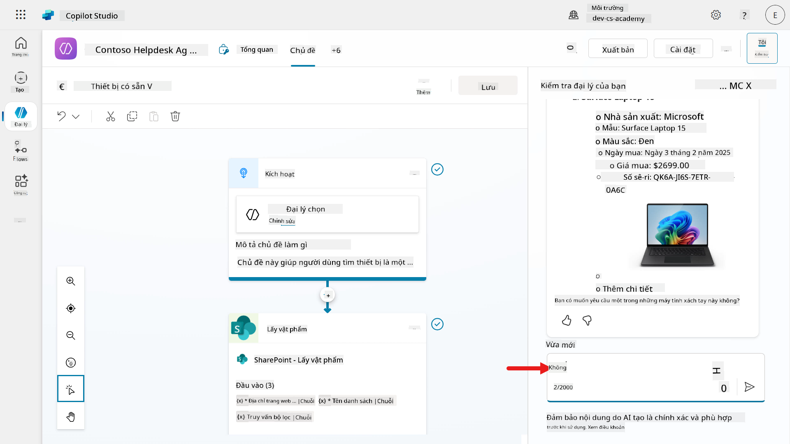

1. Agent kích hoạt chủ đề **Goodbye** và câu hỏi được định nghĩa trong chủ đề được hỏi.

   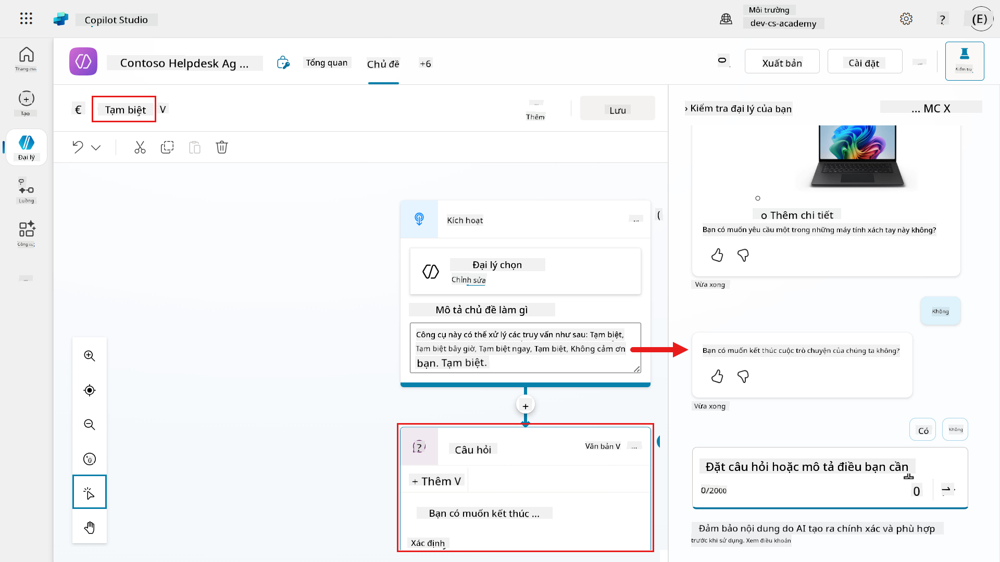

## ✅ Hoàn thành nhiệm vụ

Chúc mừng! 👏🏻 Bạn đã học cách xây dựng luồng agent và thêm nó vào chủ đề **Request device** hiện có, cũng như cách chuyển hướng agent đến một chủ đề khác.

Đây là phần kết thúc của **Lab 09 - Thêm luồng agent để tự động hóa và nâng cao khả năng của chủ đề**, chọn liên kết dưới đây để chuyển sang bài học tiếp theo. Chúng ta sẽ mở rộng trường hợp sử dụng trong bài học tiếp theo.

⏭️ [Chuyển đến bài học **Thêm Trình kích hoạt Sự kiện - Kích hoạt khả năng tự động của agent**](../10-add-event-triggers/README.md)

## 📚 Tài nguyên chiến thuật

🔗 [Giới thiệu về luồng agent: Biến đổi tự động hóa với quy trình làm việc ưu tiên AI](https://www.microsoft.com/microsoft-copilot/blog/copilot-studio/introducing-agent-flows-transforming-automation-with-ai-first-workflows/)

🔗 [Tổng quan về luồng agent](https://learn.microsoft.com/microsoft-copilot-studio/flows-overview?WT.mc_id=power-172621-ebenitez)

🔗 [Sử dụng luồng agent với agent của bạn](https://learn.microsoft.com/microsoft-copilot-studio/advanced-flow?WT.mc_id=power-172621-ebenitez)

🔗 [Danh sách các hàm trong hướng dẫn tham khảo](https://learn.microsoft.com/azure/logic-apps/workflow-definition-language-functions-reference?WT.mc_id=power-172621-ebenitez)

📺 [Luồng Agent trong Copilot Studio](https://www.youtube.com/watch?v=VJTKyk3Pr7s)


---

**Tuyên bố miễn trừ trách nhiệm**:  
Tài liệu này đã được dịch bằng dịch vụ dịch thuật AI [Co-op Translator](https://github.com/Azure/co-op-translator). Mặc dù chúng tôi cố gắng đảm bảo độ chính xác, xin lưu ý rằng các bản dịch tự động có thể chứa lỗi hoặc không chính xác. Tài liệu gốc bằng ngôn ngữ bản địa nên được coi là nguồn thông tin chính thức. Đối với thông tin quan trọng, nên sử dụng dịch vụ dịch thuật chuyên nghiệp bởi con người. Chúng tôi không chịu trách nhiệm về bất kỳ sự hiểu lầm hoặc diễn giải sai nào phát sinh từ việc sử dụng bản dịch này.