<!--
CO_OP_TRANSLATOR_METADATA:
{
  "original_hash": "cd99a76bcb7372ac2771b6ae178b023d",
  "translation_date": "2025-10-20T00:55:41+00:00",
  "source_file": "docs/recruit/10-add-event-triggers/README.md",
  "language_code": "vi"
}
-->
# 🚨 Nhiệm vụ 10: Thêm Trình kích hoạt sự kiện - Kích hoạt khả năng tác nhân tự động

## 🕵️‍♂️ MẬT DANH: `CHIẾN DỊCH THÓI QUEN MA QUÁI`

> **⏱️ Thời gian thực hiện chiến dịch:** `~45 phút`

🎥 **Xem video hướng dẫn**

[](https://www.youtube.com/watch?v=ZgwHL8PQ1nY "Xem hướng dẫn trên YouTube")

## 🎯 Tóm tắt nhiệm vụ

Đã đến lúc nâng cấp tác nhân của bạn từ trợ lý hội thoại lên thành một tác nhân tự động. Nhiệm vụ của bạn là cho phép tác nhân của mình hành động mà không cần được triệu hồi - phản hồi các tín hiệu từ khắp miền kỹ thuật số của bạn một cách chính xác và nhanh chóng.

Với Trình kích hoạt sự kiện, bạn sẽ huấn luyện tác nhân của mình để theo dõi các hệ thống bên ngoài như SharePoint, Teams và Outlook, và thực hiện các hành động thông minh ngay khi nhận được tín hiệu. Chiến dịch này sẽ biến tác nhân của bạn thành một tài sản hoạt động hoàn chỉnh - im lặng, nhanh nhẹn và luôn theo dõi.

Thành công có nghĩa là xây dựng các tác nhân khởi tạo giá trị - không chỉ phản hồi lại nó.

## 🔎 Mục tiêu

📖 Bài học này sẽ bao gồm:

- Hiểu về Trình kích hoạt sự kiện và cách chúng cho phép hành vi tác nhân tự động
- Tìm hiểu sự khác biệt giữa trình kích hoạt sự kiện và trình kích hoạt chủ đề, bao gồm quy trình làm việc và tải trọng của trình kích hoạt
- Khám phá các kịch bản phổ biến của Trình kích hoạt sự kiện
- Hiểu về xác thực, bảo mật và các cân nhắc khi xuất bản cho các tác nhân dựa trên sự kiện
- Xây dựng một tác nhân hỗ trợ IT tự động phản hồi các sự kiện từ SharePoint và gửi email xác nhận

## 🤔 Trình kích hoạt sự kiện là gì?

**Trình kích hoạt sự kiện** là một cơ chế cho phép tác nhân của bạn hành động tự động để phản hồi các sự kiện bên ngoài mà không cần sự nhập liệu trực tiếp từ người dùng. Hãy nghĩ về nó như việc làm cho tác nhân của bạn "theo dõi" các sự kiện cụ thể và tự động thực hiện hành động khi các sự kiện đó xảy ra.

Không giống như trình kích hoạt chủ đề, yêu cầu người dùng nhập nội dung để kích hoạt cuộc trò chuyện, trình kích hoạt sự kiện được kích hoạt dựa trên những gì xảy ra trong các hệ thống được kết nối của bạn. Ví dụ:

- Khi một tệp mới được tạo trong SharePoint hoặc OneDrive for Business
- Khi một bản ghi được tạo trong Dataverse
- Khi một nhiệm vụ được hoàn thành trong Planner
- Khi một phản hồi mới từ Microsoft Form được gửi
- Khi một tin nhắn mới được thêm vào Microsoft Teams
- Dựa trên lịch trình định kỳ (như nhắc nhở hàng ngày)  
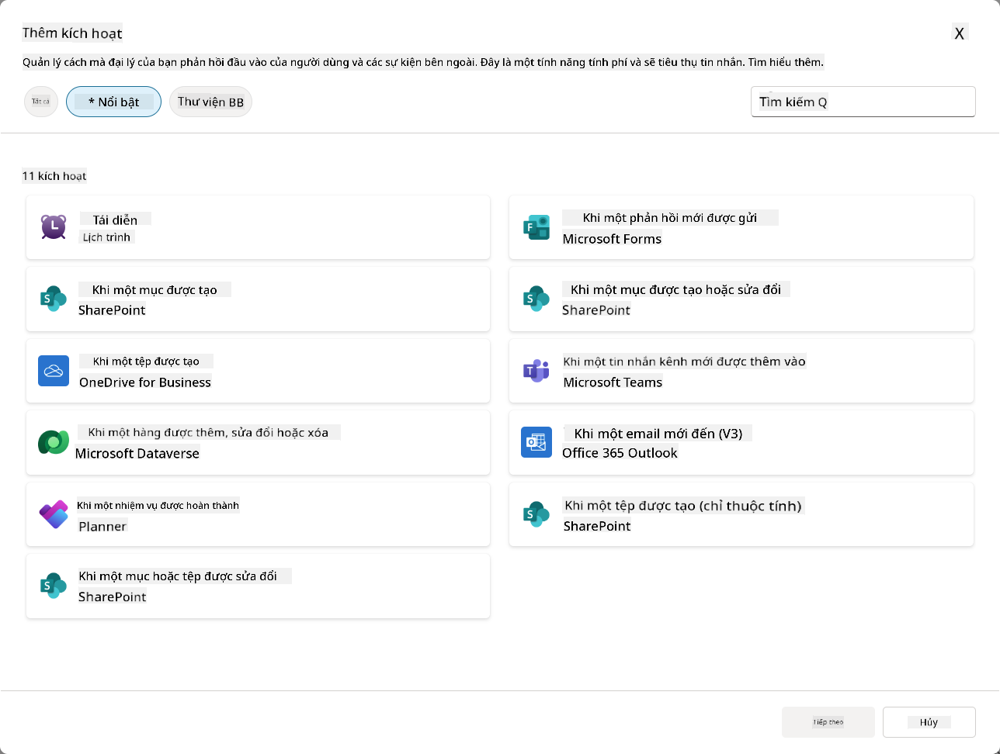

### Tại sao Trình kích hoạt sự kiện quan trọng đối với các tác nhân tự động

Trình kích hoạt sự kiện biến đổi tác nhân của bạn từ một trợ lý phản ứng thành một người trợ giúp tự động, chủ động:

1. **Hoạt động tự động** - tác nhân của bạn có thể làm việc 24/7 mà không cần sự can thiệp của con người, phản hồi các sự kiện ngay khi chúng xảy ra.
    - *Ví dụ:* Tự động chào mừng các thành viên mới khi họ được thêm vào nhóm.

1. **Phản hồi thời gian thực** - thay vì chờ người dùng đặt câu hỏi, tác nhân của bạn phản hồi ngay lập tức với các sự kiện liên quan.
    - *Ví dụ*: Cảnh báo đội IT khi một tài liệu SharePoint bị sửa đổi.

1. **Tự động hóa quy trình làm việc** - kết nối nhiều hành động dựa trên một sự kiện kích hoạt duy nhất.
    - *Ví dụ:* Khi một yêu cầu hỗ trợ mới được tạo, tạo một nhiệm vụ, thông báo cho quản lý và cập nhật bảng điều khiển theo dõi.

1. **Quy trình nhất quán** - đảm bảo các bước quan trọng không bị bỏ sót bằng cách tự động hóa phản hồi với các sự kiện chính.
    - *Ví dụ:* Mỗi nhân viên mới tự động nhận được tài liệu hướng dẫn và yêu cầu truy cập.

1. **Hành động dựa trên dữ liệu** - sử dụng thông tin từ sự kiện kích hoạt để đưa ra quyết định thông minh và thực hiện các hành động phù hợp.
    - *Ví dụ:* Chuyển các yêu cầu khẩn cấp đến nhân viên cấp cao dựa trên mức độ ưu tiên trong tải trọng kích hoạt.

## ⚙️ Trình kích hoạt sự kiện hoạt động như thế nào?

Trình kích hoạt sự kiện hoạt động thông qua một quy trình ba bước cho phép tác nhân của bạn phản hồi tự động với các sự kiện bên ngoài:

### Quy trình làm việc của trình kích hoạt

1. **Phát hiện sự kiện** - Một sự kiện cụ thể xảy ra trong hệ thống được kết nối (SharePoint, Teams, Outlook, v.v.)
1. **Kích hoạt trình kích hoạt** - Trình kích hoạt sự kiện phát hiện sự kiện này và gửi tải trọng đến tác nhân của bạn thông qua Power Automate Cloud Flow.
1. **Phản hồi của tác nhân** - Tác nhân của bạn nhận tải trọng và thực hiện các hướng dẫn mà bạn đã định nghĩa.

### Trình kích hoạt sự kiện vs Trình kích hoạt chủ đề

Hiểu sự khác biệt giữa hai loại trình kích hoạt này là rất quan trọng:

| **Trình kích hoạt sự kiện** | **Trình kích hoạt chủ đề** |
|-----------------------------|-----------------------------|
| Kích hoạt bởi các sự kiện hệ thống bên ngoài | Kích hoạt bởi nhập liệu/cụm từ của người dùng |
| Cho phép hành vi tác nhân tự động | Cho phép phản hồi hội thoại |
| Sử dụng xác thực của người tạo | Tùy chọn xác thực của người dùng |
| Hoạt động mà không cần tương tác của người dùng | Yêu cầu người dùng bắt đầu cuộc trò chuyện |
| Ví dụ: Tệp được tạo, email được nhận | Ví dụ: "Thời tiết hôm nay thế nào?" |

## 📦 Hiểu về tải trọng của trình kích hoạt

Khi một sự kiện xảy ra, trình kích hoạt sẽ gửi một **tải trọng** đến tác nhân của bạn, chứa thông tin về sự kiện và hướng dẫn cách phản hồi.

### Tải trọng mặc định vs tùy chỉnh

Mỗi loại trình kích hoạt đi kèm với một cấu trúc tải trọng mặc định, nhưng bạn có thể tùy chỉnh nó:

**Tải trọng mặc định** - Sử dụng định dạng tiêu chuẩn như `Sử dụng nội dung từ {Body}`

- Chứa thông tin sự kiện cơ bản
- Sử dụng hướng dẫn xử lý chung
- Tốt cho các kịch bản đơn giản

**Tải trọng tùy chỉnh** - Thêm hướng dẫn cụ thể và định dạng dữ liệu

- Bao gồm các hướng dẫn chi tiết cho tác nhân của bạn
- Chỉ định chính xác dữ liệu nào cần sử dụng và cách sử dụng
- Tốt hơn cho các quy trình làm việc phức tạp

### Hướng dẫn cho tác nhân vs hướng dẫn tải trọng tùy chỉnh

Bạn có hai nơi để hướng dẫn hành vi của tác nhân với trình kích hoạt sự kiện:

**Hướng dẫn cho tác nhân** (Chung)

- Hướng dẫn rộng áp dụng cho tất cả các trình kích hoạt
- Ví dụ: "Khi xử lý các yêu cầu, luôn kiểm tra trùng lặp trước"
- Tốt cho các mẫu hành vi chung

**Hướng dẫn tải trọng** (Cụ thể cho trình kích hoạt)

- Hướng dẫn cụ thể cho từng loại trình kích hoạt  
- Ví dụ: "Đối với cập nhật SharePoint này, gửi một bản tóm tắt đến kênh dự án"
- Tốt cho các tác nhân phức tạp với nhiều trình kích hoạt

💡 **Mẹo chuyên nghiệp**: Tránh các hướng dẫn mâu thuẫn giữa hai cấp độ này, vì điều này có thể gây ra hành vi không mong muốn.

## 🎯 Các kịch bản phổ biến của Trình kích hoạt sự kiện

Dưới đây là các ví dụ thực tế về cách trình kích hoạt sự kiện có thể cải thiện tác nhân của bạn:

### Tác nhân hỗ trợ IT

- **Trình kích hoạt**: Mục danh sách mới trong SharePoint (yêu cầu hỗ trợ)
- **Hành động**: Tự động phân loại, xác định mức độ ưu tiên và thông báo cho các thành viên đội ngũ phù hợp

### Tác nhân hướng dẫn nhân viên mới

- **Trình kích hoạt**: Người dùng mới được thêm vào Dataverse
- **Hành động**: Gửi tin nhắn chào mừng, tạo nhiệm vụ hướng dẫn và cấp quyền truy cập

### Tác nhân quản lý dự án

- **Trình kích hoạt**: Nhiệm vụ hoàn thành trong Planner
- **Hành động**: Cập nhật bảng điều khiển dự án, thông báo cho các bên liên quan và kiểm tra các trở ngại

### Tác nhân quản lý tài liệu

- **Trình kích hoạt**: Tệp được tải lên thư mục SharePoint cụ thể
- **Hành động**: Trích xuất siêu dữ liệu, áp dụng thẻ và thông báo cho chủ sở hữu tài liệu

### Tác nhân hỗ trợ cuộc họp

- **Trình kích hoạt**: Sự kiện lịch được tạo
- **Hành động**: Gửi nhắc nhở trước cuộc họp và chương trình nghị sự, đặt tài nguyên

## ⚠️ Các cân nhắc về xuất bản và xác thực

Trước khi tác nhân của bạn có thể sử dụng trình kích hoạt sự kiện trong sản xuất, bạn cần hiểu các tác động của xác thực và bảo mật.

### Xác thực của người tạo

Trình kích hoạt sự kiện sử dụng **thông tin đăng nhập của người tạo tác nhân** cho tất cả các xác thực:

- Tác nhân của bạn truy cập hệ thống bằng quyền của bạn
- Người dùng có thể truy cập dữ liệu thông qua thông tin đăng nhập của bạn
- Tất cả các hành động được thực hiện "dưới danh nghĩa của bạn" ngay cả khi người dùng tương tác với tác nhân

### Các thực hành tốt nhất về bảo vệ dữ liệu

Để duy trì bảo mật khi xuất bản các tác nhân với trình kích hoạt sự kiện:

1. **Đánh giá quyền truy cập dữ liệu** - Xem xét các hệ thống và dữ liệu mà trình kích hoạt của bạn có thể truy cập
1. **Kiểm tra kỹ lưỡng** - Hiểu thông tin mà trình kích hoạt bao gồm trong tải trọng
1. **Giới hạn phạm vi trình kích hoạt** - Sử dụng các tham số cụ thể để giới hạn các sự kiện kích hoạt trình kích hoạt
1. **Xem xét dữ liệu tải trọng** - Đảm bảo trình kích hoạt không tiết lộ thông tin nhạy cảm
1. **Theo dõi sử dụng** - Theo dõi hoạt động của trình kích hoạt và tiêu thụ tài nguyên

## ⚠️ Khắc phục sự cố và hạn chế

Hãy lưu ý những cân nhắc quan trọng này khi làm việc với trình kích hoạt sự kiện:

### Tác động đến hạn mức và chi phí

- Mỗi lần kích hoạt trình kích hoạt đều tính vào tiêu thụ tin nhắn của bạn
- Các trình kích hoạt thường xuyên (như lặp lại mỗi phút) có thể nhanh chóng tiêu thụ hạn mức
- Theo dõi sử dụng để tránh bị giới hạn

### Yêu cầu kỹ thuật

- Chỉ khả dụng cho các tác nhân có kích hoạt tạo nội dung
- Yêu cầu bật chia sẻ luồng đám mây nhận thức giải pháp trong môi trường của bạn

### Ngăn ngừa mất dữ liệu (DLP)

- Chính sách DLP của tổ chức bạn xác định các trình kích hoạt nào có sẵn
- Quản trị viên có thể chặn hoàn toàn các trình kích hoạt sự kiện
- Liên hệ với quản trị viên của bạn nếu các trình kích hoạt mong đợi không khả dụng

## 🧪 Phòng thí nghiệm 10 - Thêm Trình kích hoạt sự kiện cho hành vi tác nhân tự động

### 🎯 Trường hợp sử dụng

Bạn sẽ nâng cấp tác nhân hỗ trợ IT của mình để tự động phản hồi các yêu cầu hỗ trợ mới. Khi ai đó tạo một mục mới trong danh sách yêu cầu hỗ trợ SharePoint của bạn, tác nhân của bạn sẽ:

1. Tự động kích hoạt khi yêu cầu SharePoint được tạo
1. Cung cấp chi tiết yêu cầu và hướng dẫn về các bước mà bạn muốn nó thực hiện
1. Tự động xác nhận yêu cầu với người gửi thông qua email được tạo bởi AI

Phòng thí nghiệm này minh họa cách trình kích hoạt sự kiện cho phép hành vi tác nhân thực sự tự động.

### Điều kiện tiên quyết

Trước khi bắt đầu phòng thí nghiệm này, hãy đảm bảo bạn đã:

- ✅ Hoàn thành các phòng thí nghiệm trước đó (đặc biệt là Phòng thí nghiệm 6-8 cho tác nhân hỗ trợ IT)
- ✅ Có quyền truy cập vào trang SharePoint với danh sách yêu cầu hỗ trợ IT
- ✅ Môi trường Copilot Studio với trình kích hoạt sự kiện được bật
- ✅ Tác nhân của bạn đã bật kích hoạt tạo nội dung
- ✅ Quyền phù hợp trong SharePoint và môi trường Copilot Studio của bạn

### 10.1 Bật Generative AI và tạo trình kích hoạt tạo mục SharePoint

1. Mở **tác nhân hỗ trợ IT** của bạn trong **Copilot Studio**

1. Đầu tiên, đảm bảo **Generative AI** được bật cho tác nhân của bạn:
   - Điều hướng đến tab **Tổng quan**
   - Dưới phần Điều phối, bật **Generative orchestration** sang **Bật** nếu nó chưa được bật  
     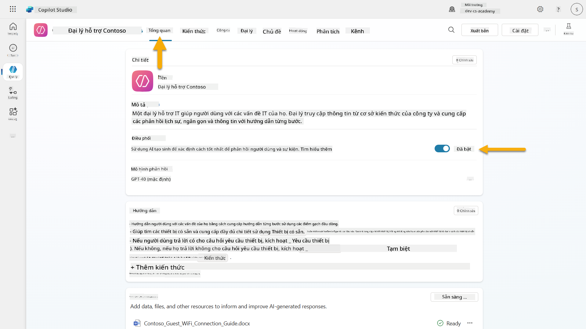

1. Điều hướng đến tab **Tổng quan** và tìm phần **Trình kích hoạt**

1. Nhấp vào **+ Thêm trình kích hoạt** để mở thư viện trình kích hoạt  
    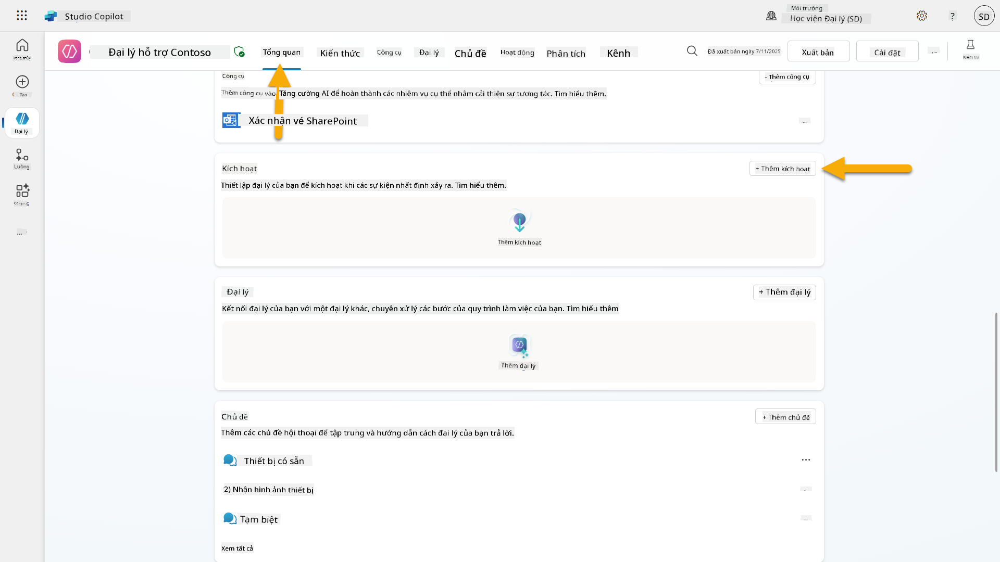

1. Tìm kiếm và chọn **Khi một mục được tạo** (SharePoint)  
    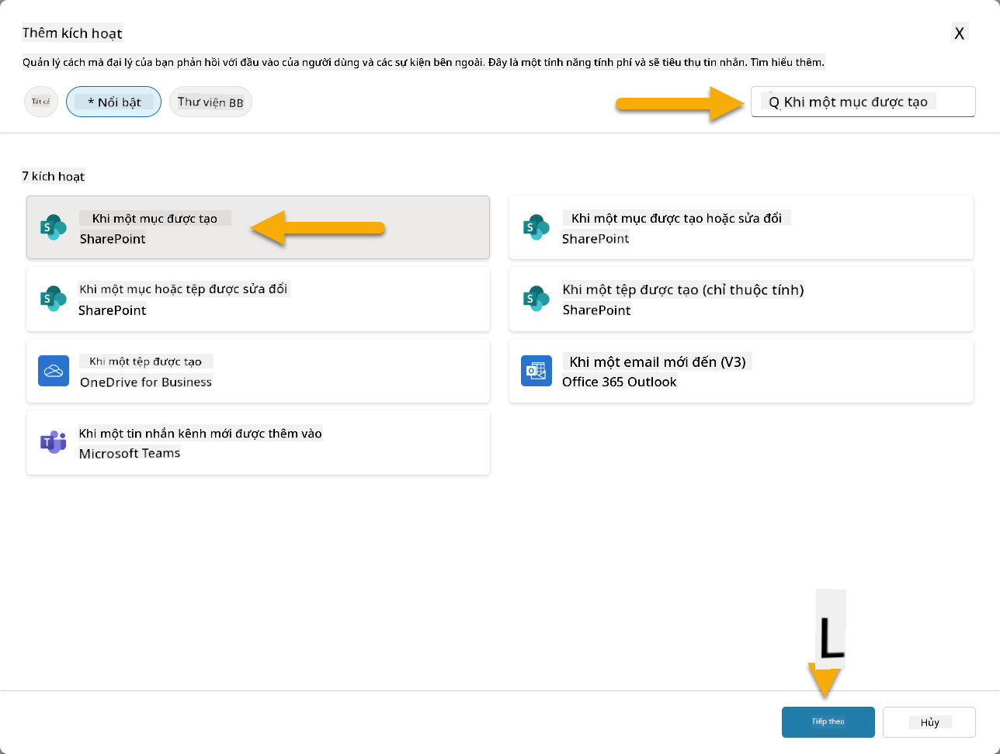

1. Cấu hình tên trình kích hoạt và kết nối:

   - **Tên trình kích hoạt:** Yêu cầu hỗ trợ mới được tạo trong SharePoint

1. Chờ kết nối được cấu hình, và chọn **Tiếp theo** để tiếp tục.  
   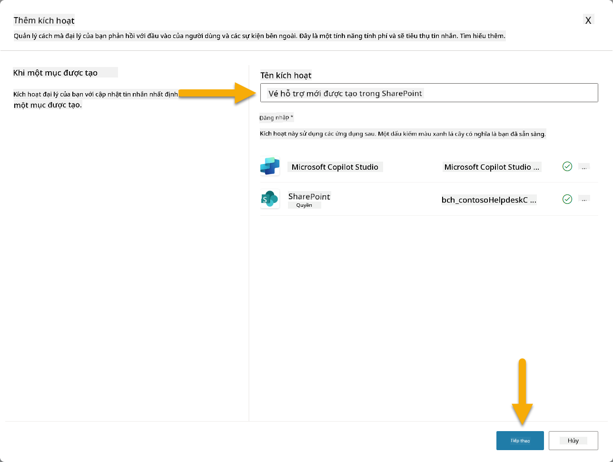

1. Cấu hình các tham số trình kích hoạt:

   - **Địa chỉ trang web**: Chọn trang SharePoint "Contoso IT" của bạn

   - **Tên danh sách**: Chọn danh sách "Tickets" của bạn

   - **Hướng dẫn bổ sung cho tác nhân khi nó được kích hoạt bởi trình kích hoạt:**

     ```text
     New Support Ticket Created in SharePoint: {Body}
     
     Use the 'Acknowledge SharePoint Ticket' tool to generate the email body automatically and respond.
     
     IMPORTANT: Do not wait for any user input. Work completely autonomously.
     ```

     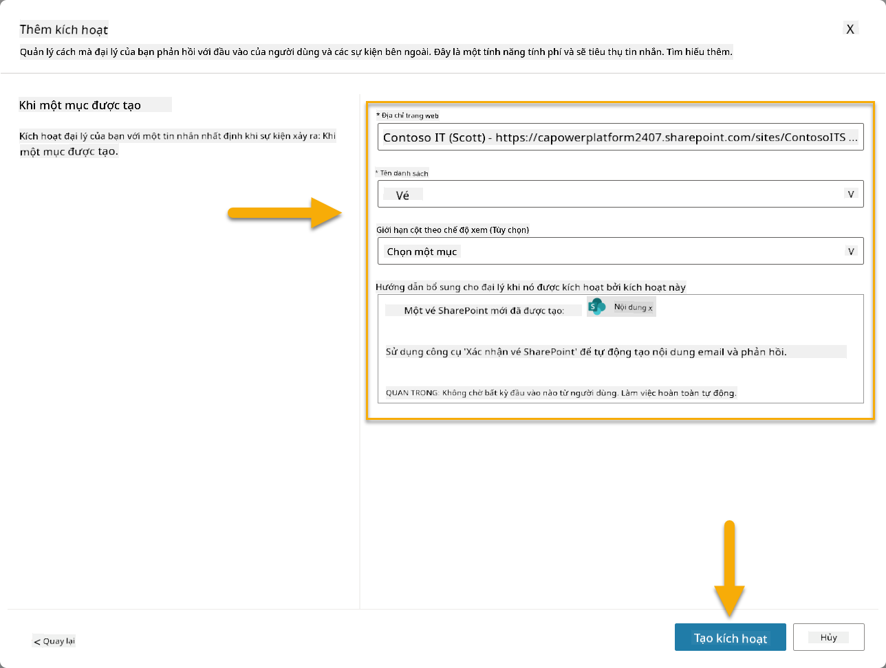

1. Chọn **Tạo trình kích hoạt** để hoàn tất việc tạo trình kích hoạt. Một Power Automate Cloud Flow sẽ tự động được tạo để kích hoạt tác nhân tự động.

1. Chọn **Đóng**.

### 10.2 Chỉnh sửa Trình kích hoạt

1. Bên trong phần **Trình kích hoạt** của tab **Tổng quan**, chọn menu **...** trên trình kích hoạt **Yêu cầu hỗ trợ mới được tạo trong SharePoint**

1. Chọn **Chỉnh sửa trong Power Automate**  
   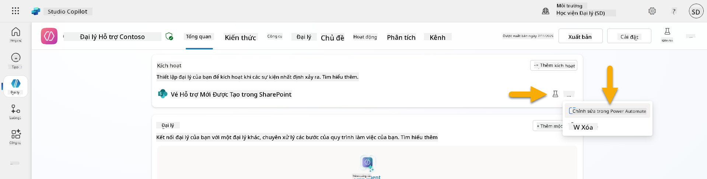

1. Chọn nút **Gửi một lời nhắc đến copilot được chỉ định để xử lý**

1. Trong trường **Nội dung/Tin nhắn**, xóa nội dung trong trường Nội dung, **nhấn phím gạch chéo** (/) và chọn **Chèn Biểu thức**  
   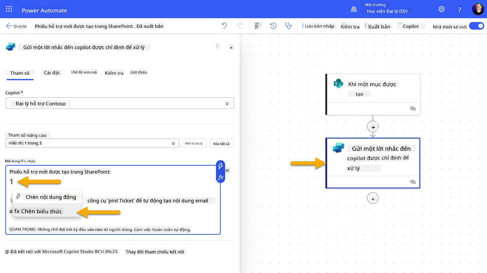

1. Nhập biểu thức sau để cung cấp cho tác nhân thông tin chi tiết về yêu cầu:

    ```text
    concat('Submitted By Name: ', first(triggerOutputs()?['body/value'])?['Author/DisplayName'], '\nSubmitted By Email: ', first(triggerOutputs()?['body/value'])?['Author/Email'], '\nTitle: ', first(triggerOutputs()?['body/value'])?['Title'], '\nIssue Description: ', first(triggerOutputs()?['body/value'])?['Description'], '\nPriority: ', first(triggerOutputs()?['body/value'])?['Priority/Value'],'\nTicket ID : ', first(triggerOutputs()?['body/value'])?['ID'])
    ```

1. Chọn **Thêm**  
   

1. Chọn **Xuất bản** trên thanh công cụ phía trên bên phải.

### 10.3 Tạo công cụ để xác nhận email

1. **Quay lại** Tác nhân của bạn trong Copilot Studio

1. Điều hướng đến tab **Công cụ** trong tác nhân của bạn

1. Nhấp vào **+ Thêm một công cụ** và chọn **Kết nối**

1. Tìm kiếm và chọn kết nối **Gửi email (V2)**  
    

1. Chờ kết nối được cấu hình, sau đó chọn **Thêm và cấu hình**

1. Cấu hình cài đặt công cụ:

   - **Tên**: Xác nhận yêu cầu SharePoint
   - **Mô tả**: Công cụ này gửi email xác nhận rằng yêu cầu đã được nhận.

1. Chọn **Tùy chỉnh** bên cạnh các tham số đầu vào và cấu hình như sau:

    **Đến**:

    - **Mô tả**: Địa chỉ email của người gửi yêu cầu SharePoint
    - **Xác định là**: Email

    **Nội dung**:

    - **Mô tả**: Một xác nhận rằng yêu cầu đã được nhận và chúng tôi sẽ phản hồi trong vòng 3 ngày làm việc.

    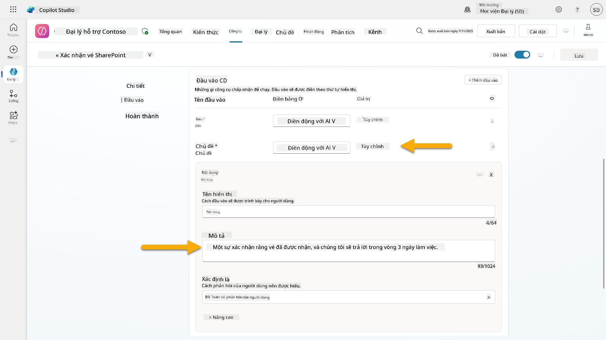

1. Chọn **Lưu**

### 10.4 Kiểm tra trình kích hoạt

1. Bên trong **Tác nhân hỗ trợ Help Desk**, chọn tab **Tổng quan**
1. Nhấp vào biểu tượng **Kiểm tra Trình kích hoạt** bên cạnh trình kích hoạt **Yêu cầu hỗ trợ mới được tạo trong SharePoint**. Điều này sẽ mở cửa sổ **Kiểm tra trình
1. Mở một tab trình duyệt mới và truy cập vào **Danh sách vé hỗ trợ IT SharePoint** của bạn  
1. Nhấp vào **+ Thêm mục mới** để tạo một vé thử nghiệm:  
   - **Tiêu đề**: "Không thể kết nối VPN"  
   - **Mô tả**: "Không thể kết nối mạng WIFI công ty sau khi cập nhật gần đây"  
   - **Ưu tiên**: "Bình thường"  

1. **Lưu** mục SharePoint  
    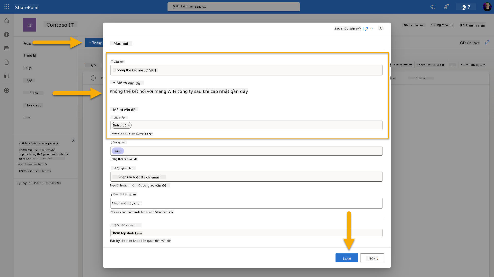  
1. Quay lại **Copilot Studio** và theo dõi bảng điều khiển **Kiểm tra kích hoạt của bạn** để xem kích hoạt được thực hiện. Sử dụng biểu tượng **Làm mới** để tải sự kiện kích hoạt, việc này có thể mất vài phút.  
    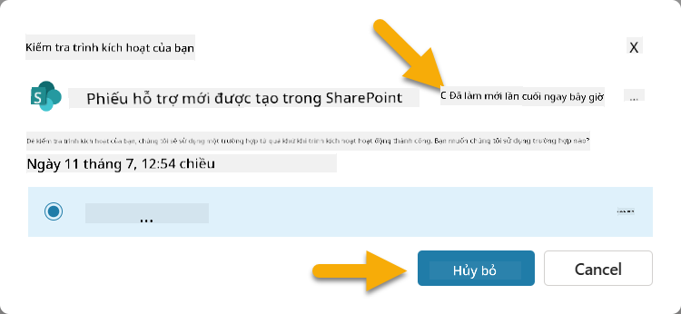  
1. Khi kích hoạt xuất hiện, chọn **Bắt đầu kiểm tra**  
1. Chọn biểu tượng **Bản đồ hoạt động** ở đầu bảng điều khiển **Kiểm tra tác nhân của bạn**  
1. Xác minh rằng tác nhân của bạn:  
   - Đã nhận được payload kích hoạt  
   - Đã gọi công cụ "Xác nhận vé SharePoint"  
     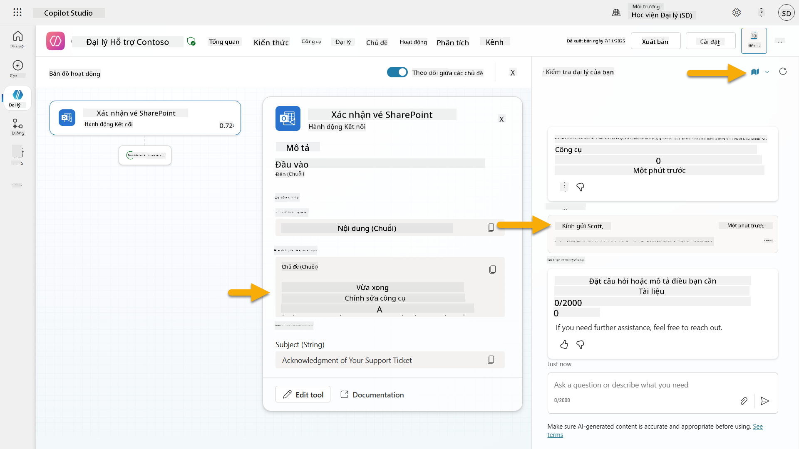  
1. Kiểm tra hộp thư email của người gửi để xác nhận email xác nhận đã được gửi  
    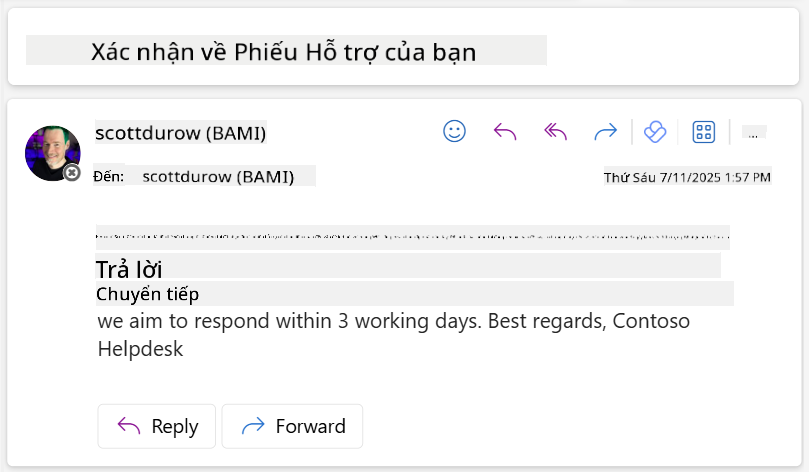  
1. Xem lại tab **Hoạt động** trong Copilot Studio để thấy toàn bộ quá trình kích hoạt và thực thi công cụ  

## ✅ Hoàn thành nhiệm vụ  

🎉 **Chúc mừng!** Bạn đã triển khai thành công các kích hoạt sự kiện với các công cụ kết nối, cho phép tác nhân của bạn hoạt động tự động, tự động gửi email xác nhận và xử lý vé hỗ trợ mà không cần sự can thiệp của người dùng. Khi tác nhân của bạn được xuất bản, nó sẽ hoạt động tự động thay mặt bạn.  

🚀 **Tiếp theo**: Trong bài học tiếp theo, bạn sẽ học cách [xuất bản tác nhân của mình](../11-publish-your-agent/README.md) lên Microsoft Teams và Microsoft 365 Copilot, giúp nó có sẵn cho toàn bộ tổ chức của bạn!  

⏭️ [Chuyển đến bài học **Xuất bản tác nhân của bạn**](../11-publish-your-agent/README.md)  

## 📚 Tài nguyên chiến thuật  

Sẵn sàng tìm hiểu sâu hơn về kích hoạt sự kiện và tác nhân tự động? Xem các tài nguyên này:  

- **Microsoft Learn**: [Làm cho tác nhân của bạn tự động trong Copilot Studio](https://learn.microsoft.com/training/modules/autonomous-agents-online-workshop/?WT.mc_id=power-177340-scottdurow)  
- **Tài liệu**: [Thêm một kích hoạt sự kiện](https://learn.microsoft.com/microsoft-copilot-studio/authoring-trigger-event?WT.mc_id=power-177340-scottdurow)  
- **Thực hành tốt nhất**: [Giới thiệu về kích hoạt Power Automate](https://learn.microsoft.com/power-automate/triggers-introduction?WT.mc_id=power-177340-scottdurow)  
- **Kịch bản nâng cao**: [Sử dụng luồng Power Automate với các tác nhân](https://learn.microsoft.com/microsoft-copilot-studio/advanced-flow-create?WT.mc_id=power-177340-scottdurow)  
- **Bảo mật**: [Ngăn ngừa mất dữ liệu cho Copilot Studio](https://learn.microsoft.com/microsoft-copilot-studio/admin-data-loss-prevention?WT.mc_id=power-177340-scottdurow)  

  

---

**Tuyên bố miễn trừ trách nhiệm**:  
Tài liệu này đã được dịch bằng dịch vụ dịch thuật AI [Co-op Translator](https://github.com/Azure/co-op-translator). Mặc dù chúng tôi cố gắng đảm bảo độ chính xác, xin lưu ý rằng các bản dịch tự động có thể chứa lỗi hoặc không chính xác. Tài liệu gốc bằng ngôn ngữ bản địa nên được coi là nguồn thông tin chính thức. Đối với thông tin quan trọng, khuyến nghị sử dụng dịch vụ dịch thuật chuyên nghiệp bởi con người. Chúng tôi không chịu trách nhiệm cho bất kỳ sự hiểu lầm hoặc diễn giải sai nào phát sinh từ việc sử dụng bản dịch này.