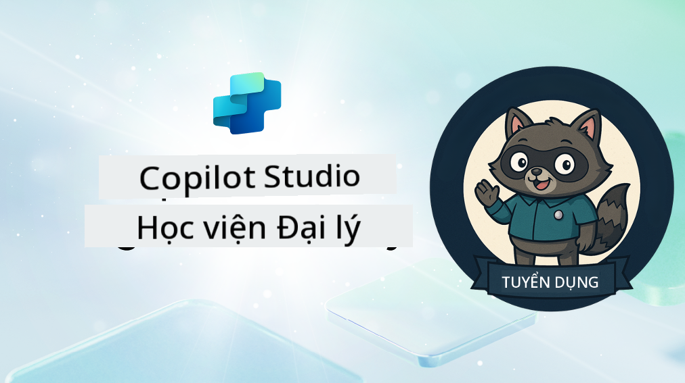

<!--
CO_OP_TRANSLATOR_METADATA:
{
  "original_hash": "8b5ecad9d5d073ea3f4c2b844e80f2e5",
  "translation_date": "2025-10-20T00:30:21+00:00",
  "source_file": "docs/recruit/README.md",
  "language_code": "vi"
}
-->
# Chào mừng Tân Binh

**Chào mừng, Tân Binh.**  
Nhiệm vụ của bạn—nếu bạn chọn chấp nhận—là làm chủ nghệ thuật xây dựng các đặc vụ bằng **Microsoft Copilot Studio**.

Khóa đào tạo thực hành này là điểm khởi đầu của bạn vào **thế giới đặc vụ**: từ các lời nhắc cơ bản đến Adaptive Cards và luồng đặc vụ, bạn sẽ học cách xây dựng, mở rộng và triển khai các đặc vụ thông minh bằng các công cụ và trường hợp sử dụng thực tế.

---

## 🎯 Mục tiêu Nhiệm vụ

Khi hoàn thành Học Viện Đặc Vụ, bạn sẽ có thể:

- Hiểu đặc vụ là gì trong ngữ cảnh của Microsoft Copilot Studio
- Khám phá cách các Mô hình Ngôn ngữ Lớn (LLMs), tạo nội dung tăng cường truy xuất (RAG), và điều phối kết hợp trong một đặc vụ
- Xây dựng cả **đặc vụ khai báo** và **đặc vụ tùy chỉnh**
- Nâng cao đặc vụ với **Chủ đề**, **Adaptive Cards**, và **Luồng Đặc Vụ**
- Triển khai đặc vụ lên **Microsoft Teams** và **Microsoft 365 Copilot**

---

## 🧪 Yêu cầu trước

Để hoàn thành tất cả các nhiệm vụ, bạn sẽ cần:

- Một tài khoản nhà phát triển Microsoft 365 (đã kích hoạt SharePoint)
- Quyền truy cập vào **Microsoft Copilot Studio** (phiên bản dùng thử hoặc có giấy phép)
- Tùy chọn: Kiến thức cơ bản về SharePoint, Power Platform, hoặc Power Fx

---

## 🧬 Dành cho ai

Khóa học này lý tưởng cho:

- Những nhà sáng tạo và nhà phát triển khám phá **Copilot Studio**
- Chuyên gia IT xây dựng các tiện ích mở rộng **Microsoft 365 Copilot**
- Những người đam mê Power Platform muốn **nâng cao kỹ năng** với các đặc vụ thông minh
- Bất kỳ ai thích học thông qua **thực hành**

---

## 🧭 Tổng quan Chương trình

Học viện này được chia thành các bài học tiến bộ—mỗi bài học được thiết kế như một nhiệm vụ thực địa để nâng cao kỹ năng xây dựng đặc vụ của bạn.

| Bài học | Tiêu đề | Tóm tắt Nhiệm vụ |
|--------|---------|------------------|
| `00` | 🧰 [Thiết lập Khóa học](./00-course-setup/README.md) | Thiết lập môi trường phát triển, phiên bản dùng thử Copilot Studio, và trang SharePoint |
| `01` | 🧠 [Giới thiệu về Đặc vụ](./01-introduction-to-agents/README.md) | Hiểu các khái niệm AI hội thoại, LLMs, và đặc vụ tự động so với đặc vụ khai báo |
| `02` | 🛠️ [Những điều cơ bản về Copilot Studio](./02-copilot-studio-fundamentals/README.md) | Tìm hiểu các khối xây dựng: kiến thức, kỹ năng, tự động hóa |
| `03` | 👩‍💻 [Tạo Đặc vụ Khai báo](./03-create-a-declarative-agent-for-M365Copilot/README.md) | Thêm đặc vụ của bạn vào Microsoft 365 Copilot, dựa trên một lời nhắc |
| `04` | 🧩 [Tạo một Giải pháp](./04-creating-a-solution/README.md) | Đóng gói đặc vụ của bạn thành một giải pháp có thể tái sử dụng để quản lý môi trường |
| `05` | 🚀 [Bắt đầu với Đặc vụ Được Xây dựng Sẵn](./05-using-prebuilt-agents/README.md) | Sử dụng và tùy chỉnh một đặc vụ mẫu để tăng tốc thiết lập |
| `06` | ✍️ [Xây dựng Đặc vụ Tùy chỉnh](./06-create-agent-from-conversation/README.md) | Tạo một Copilot mới dựa trên các nguồn kiến thức |
| `07` | 🧠 [Thêm Chủ đề với Kích hoạt](./07-add-new-topic-with-trigger/README.md) | Sử dụng Chủ đề để định nghĩa các đường dẫn câu hỏi/trả lời tùy chỉnh |
| `08` | 🪪 [Nâng cao với Adaptive Cards](./08-add-adaptive-card/README.md) | Xây dựng một Adaptive Card bằng Power Fx và SharePoint |
| `09` | 🔁 [Tự động hóa với Luồng Đặc vụ](./09-add-an-agent-flow/README.md) | Sử dụng đầu vào Adaptive Card để kích hoạt các luồng phía sau |
| `10` | 🧭 [Thêm Kích hoạt Sự kiện](./10-add-event-triggers/README.md) | Cho phép đặc vụ của bạn hoạt động tự động bằng logic dựa trên sự kiện |
| `11` | 📢 [Xuất bản Đặc vụ của bạn](./11-publish-your-agent/README.md) | Triển khai đặc vụ của bạn lên Microsoft Teams và Microsoft 365 Copilot |
| `12` | 🪪 [Hiểu về Giấy phép](./12-understanding-licensing/README.md) | Tìm hiểu cách hoạt động của giấy phép và thanh toán với Copilot Studio |
| `13` | 🚨 [Đạt Huy hiệu Tân Binh của bạn](./course-completion-badges-recruit/README.md) | Nhận huy hiệu của bạn và đánh dấu thành tựu của mình! |

!!! note
    ✅ Hoàn thành chương trình này sẽ giúp bạn nhận được huy hiệu **Tân Binh**.  
    🔓 **Đặc Vụ** và **Chỉ Huy** sẽ được mở khóa trong các giai đoạn tiếp theo.

<!-- markdownlint-disable-next-line MD033 -->

---

**Tuyên bố miễn trừ trách nhiệm**:  
Tài liệu này đã được dịch bằng dịch vụ dịch thuật AI [Co-op Translator](https://github.com/Azure/co-op-translator). Mặc dù chúng tôi cố gắng đảm bảo độ chính xác, xin lưu ý rằng các bản dịch tự động có thể chứa lỗi hoặc không chính xác. Tài liệu gốc bằng ngôn ngữ bản địa nên được coi là nguồn thông tin chính thức. Đối với thông tin quan trọng, chúng tôi khuyến nghị sử dụng dịch vụ dịch thuật chuyên nghiệp bởi con người. Chúng tôi không chịu trách nhiệm cho bất kỳ sự hiểu lầm hoặc diễn giải sai nào phát sinh từ việc sử dụng bản dịch này.