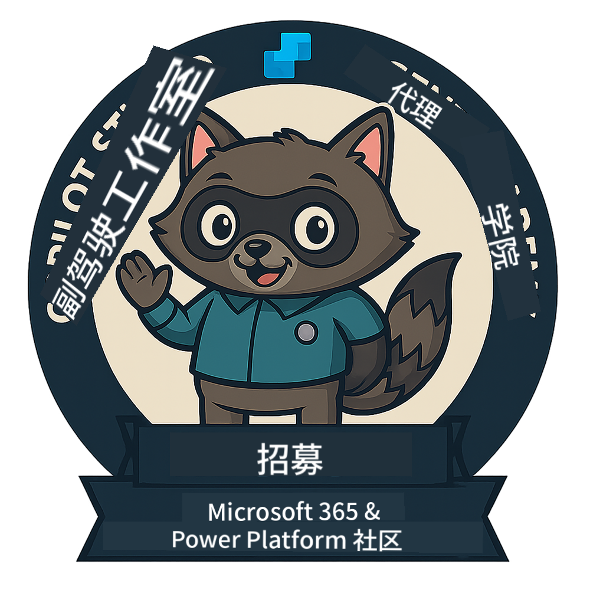
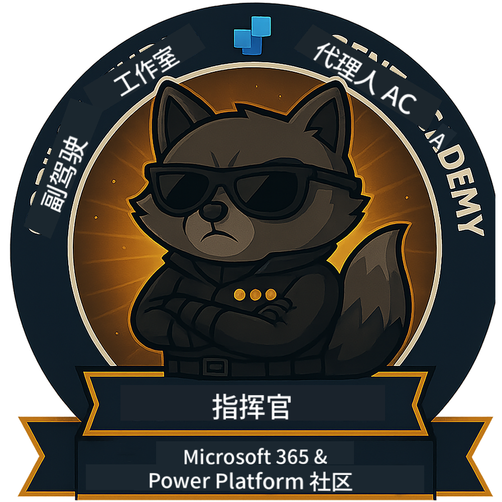

<!--
CO_OP_TRANSLATOR_METADATA:
{
  "original_hash": "15e57e059ce7689d602d7853187235cd",
  "translation_date": "2025-10-18T02:42:17+00:00",
  "source_file": "docs/index.md",
  "language_code": "zh"
}
-->
---
hide:
- navigation
---

# Copilot Studio Agent Academy

**欢迎来到 Copilot Studio Agent Academy。**

您的任务——如果您愿意接受——是掌握使用 **Microsoft Copilot Studio** 构建智能代理的艺术。

这次实践培训是您进入**代理世界**的起点：从基础提示到自适应卡片和代理流程，您将学习如何使用真实世界的工具和案例构建、扩展和部署智能代理。

---

## 🏅 等级进阶

**Copilot Studio Agent Academy** 是一个多阶段的培训项目，旨在提升您的技能，涵盖三个代理等级。每个等级都包含一个徽章和逐步增加的责任：

| 等级             | 级别 | 图示 |
|------------------|:-----:|--------|
| 🟢 **新兵**  [🚀 开始学习](https://aka.ms/agent-academy-recruit){ .md-button .md-button--primary }     | •     | { width="300" }     |
| 🔵 **特工** (即将推出)   | ••    | { width="300" } |
| 🟡 **指挥官** (即将推出)    | •••   | { width="300" } |

每个等级都建立在前一个等级的基础上。完成您的新兵任务，并关注后续内容以提升您的代理资质。

---

## 🎒 其他课程

查看以下其他课程，继续学习有关 AI 和代理的知识：

- [Microsoft Copilot Studio <3 MCP Lab](https://aka.ms/mcsmcplab)
- [Copilot Developer Camp](https://microsoft.github.io/copilot-camp/)
- [AI Agents for Beginners](https://microsoft.github.io/ai-agents-for-beginners/)
- [Model Context Protocol (MCP) For Beginners](https://github.com/microsoft/mcp-for-beginners)

---

## 🚑 问题反馈

我们非常感谢您的反馈！请使用 [问题列表](https://github.com/microsoft/agent-academy/issues) 分享您的意见和问题。谢谢！

---

## 📜 行为准则

本项目采用了 [Microsoft 开源行为准则](https://opensource.microsoft.com/codeofconduct/)。

!!! info "资源："

    - [Microsoft 开源行为准则](https://opensource.microsoft.com/codeofconduct/)
    - [Microsoft 行为准则常见问题](https://opensource.microsoft.com/codeofconduct/faq/)
    - 如有问题或疑虑，请联系 [opencode@microsoft.com](mailto:opencode@microsoft.com)

---

[⭐️ 收藏我们的仓库](https://github.com/microsoft/agent-academy){ .md-button .md-button--primary }

<!-- markdownlint-disable-next-line MD033 -->

---

**免责声明**：  
本文档使用AI翻译服务[Co-op Translator](https://github.com/Azure/co-op-translator)进行翻译。尽管我们努力确保翻译的准确性，但请注意，自动翻译可能包含错误或不准确之处。原始语言的文档应被视为权威来源。对于关键信息，建议使用专业人工翻译。我们对因使用此翻译而产生的任何误解或误读不承担责任。