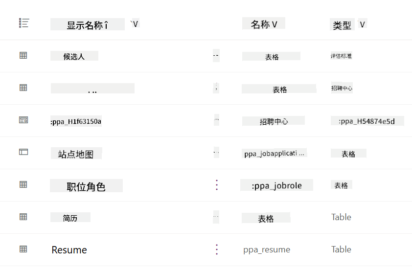
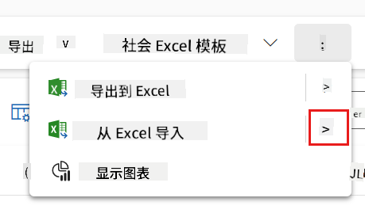
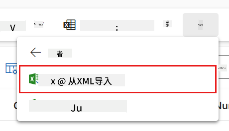
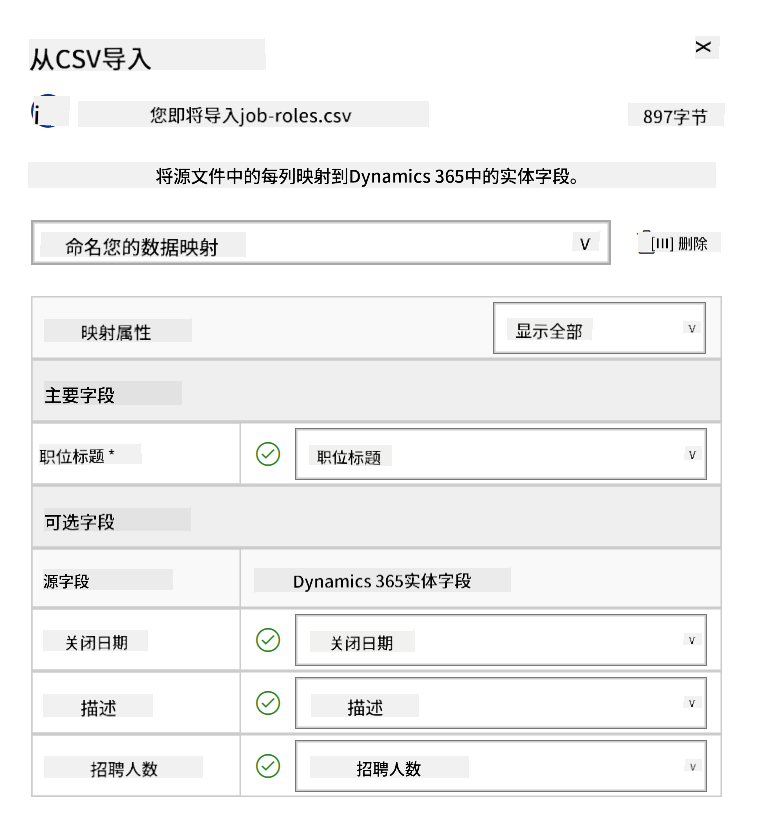
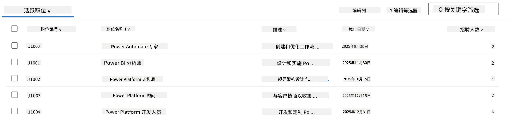
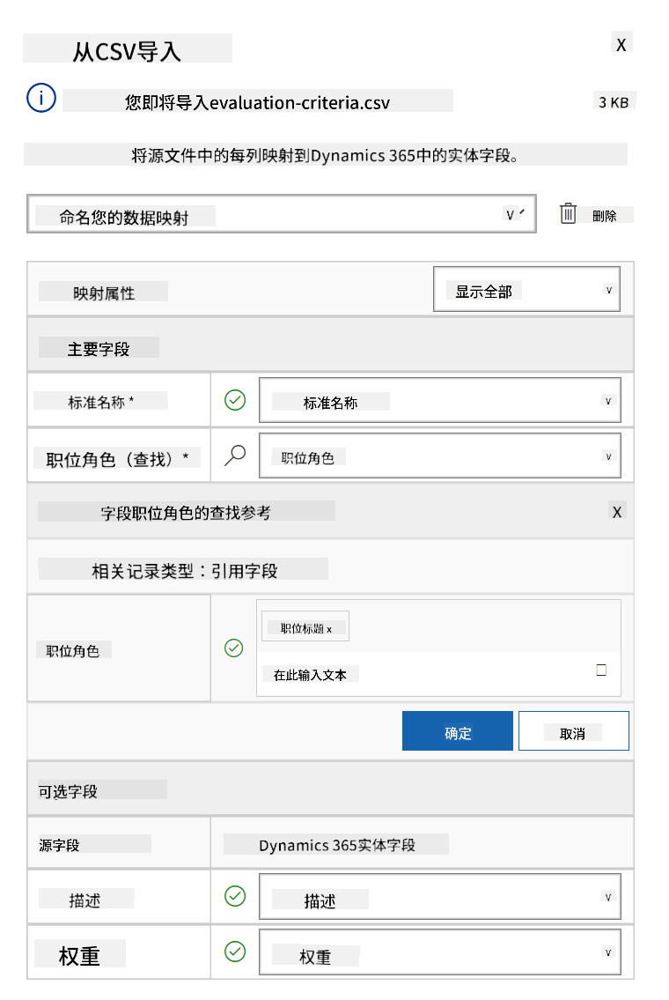
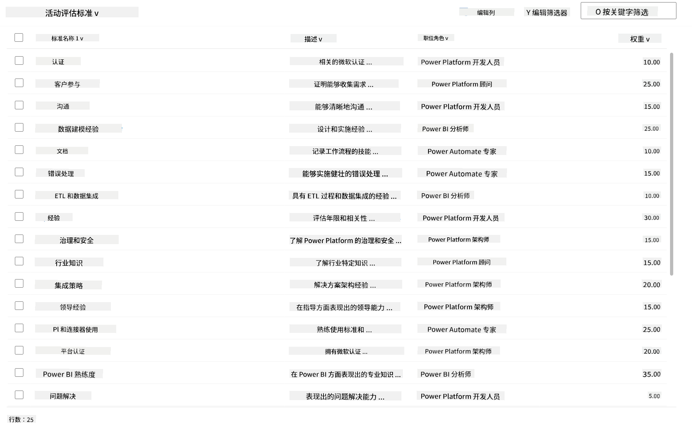

<!--
CO_OP_TRANSLATOR_METADATA:
{
  "original_hash": "2620cf9eaf09a3fc6be7fa31a3a62956",
  "translation_date": "2025-10-18T03:14:02+00:00",
  "source_file": "docs/operative-preview/01-get-started/README.md",
  "language_code": "zh"
}
-->
# 🚨 任务01：开始使用招聘代理

--8<-- "disclaimer.md"

## 🕵️‍♂️ 代号：`人才侦察行动`

> **⏱️ 行动时间窗口：** `~45分钟`

## 🎯 任务简报

欢迎，特工。您的第一个任务是**人才侦察行动**——建立一个以人工智能为驱动的招聘系统的基础设施，从而彻底改变组织识别和招聘顶尖人才的方式。

如果您选择接受任务，您的目标是使用 Microsoft Copilot Studio 部署并配置一个全面的招聘管理系统。您将导入一个包含所有必要数据结构的预构建解决方案，然后创建您的第一个人工智能代理——**招聘代理**，它将成为未来所有招聘操作的核心协调者。

这次初始部署将建立指挥中心，您将在整个代理学院行动计划中不断增强它。将其视为您的行动基地——在后续任务中，您将在此基础上构建一个由专业代理组成的完整网络。

---

## 🔎 目标

完成此任务后，您将能够：

- **场景理解**：全面了解招聘自动化的挑战和解决方案
- **解决方案部署**：成功导入并配置招聘管理系统的基础
- **代理创建**：构建一个招聘代理，作为您在代理学院行动中将要构建的场景的起点

---

## 🔍 先决条件

在开始此任务之前，请确保您已具备以下条件：

- Copilot Studio 许可证
- 访问 Microsoft Power Platform 环境的权限
- 创建解决方案和代理的管理员权限

---

## 🏢 了解招聘自动化场景

此场景展示了公司如何使用 Microsoft Copilot Studio 改善和自动化其招聘流程。它引入了一套代理系统，这些代理协同工作，处理简历审阅、推荐职位、准备面试材料以及评估候选人等任务。

### 商业价值

该解决方案帮助人力资源团队节省时间并做出更好的决策：

- 自动处理通过电子邮件收到的简历。
- 根据候选人资料推荐合适的职位。
- 为每位候选人创建量身定制的职位申请和面试指南。
- 通过内置的安全和审核功能确保公平和合规的招聘实践。
- 收集反馈以改进解决方案。

### 工作原理

- 一个核心的**招聘代理**协调整个流程，并将数据存储在 Microsoft Dataverse 中。
- 一个**申请接收代理**读取简历并创建职位申请。
- 一个**面试准备代理**根据候选人的背景生成面试问题和文档。
- 系统可以发布到演示网站，允许利益相关者与之互动。

此场景非常适合希望通过人工智能驱动的自动化来现代化其招聘工作流程，同时保持透明、公平和高效的组织。

---

## 🧪 实验：设置招聘代理

在这个动手实验中，您将为招聘自动化系统建立基础。首先，您将导入一个预配置的解决方案，其中包含管理候选人、职位和招聘工作流程所需的所有 Dataverse 表和数据结构。接下来，您将用样本数据填充这些表，这些数据将支持您在整个模块中的学习，并为测试提供真实的场景。最后，您将在 Copilot Studio 中创建招聘代理，设置基本的对话界面，这将成为您在未来任务中添加所有其他功能的基石。

### 🧪 实验1.1：导入解决方案

1. 访问 **[Copilot Studio](https://copilotstudio.microsoft.com)**
1. 在左侧导航中选择 **...**，然后选择 **Solutions**
1. 点击顶部的 **Import Solution** 按钮
1. **[下载](https://raw.githubusercontent.com/microsoft/agent-academy/refs/heads/main/docs/operative-preview/01-get-started/assets/Operative_1_0_0_0.zip)** 预先准备好的解决方案
1. 点击 **Browse**，选择上一步下载的解决方案
1. 点击 **Next**
1. 点击 **Import**

!!! success
    成功后，您会看到一个绿色通知栏，显示以下消息：  
    "解决方案 "Operative" 已成功导入。"

解决方案导入完成后，点击解决方案的显示名称（`Operative`）查看您导入的内容。



以下组件已导入：

| 显示名称 | 类型 | 描述 |
|-------------|------|-------------|
| 候选人 | 表 | 候选人信息 |
| 评估标准 | 表 | 职位的评估标准 |
| 招聘中心 | 基于模型的应用 | 用于管理招聘流程的应用 |
| 招聘中心 | 网站地图 | 招聘中心应用的导航结构 |
| 职位申请 | 表 | 职位申请 |
| 职位 | 表 | 职位 |
| 简历 | 表 | 候选人的简历 |

作为本实验的最后一步，点击页面顶部的 **Publish all customizations** 按钮。

### 🧪 实验1.2：导入样本数据

在本实验中，您将向实验1.1中导入的一些表中添加样本数据。

#### 下载要导入的文件

1. **[下载](https://raw.githubusercontent.com/microsoft/agent-academy/refs/heads/main/docs/operative-preview/01-get-started/assets/evaluation-criteria.csv)** 包含评估标准的CSV文件
1. **[下载](https://raw.githubusercontent.com/microsoft/agent-academy/refs/heads/main/docs/operative-preview/01-get-started/assets/job-roles.csv)** 包含职位的CSV文件

#### 导入职位样本数据

1. 返回您在上一个实验中导入的解决方案
1. 在行前选择 **招聘中心** 基于模型的应用
1. 点击顶部的 **Play** 按钮

    !!! warning
        您可能会被提示重新登录，请确保完成登录。登录后，您应该会看到招聘中心应用。

1. 在左侧导航中选择 **职位**
1. 在命令栏中点击 **更多** 图标（三个竖着排列的点）
1. 点击 *Import from Excel* 旁边的 **右箭头**

    

1. 点击 **Import from CSV**

    

1. 点击 **选择文件** 按钮，选择您刚刚下载的 **job-roles.csv** 文件，然后点击 **打开**
1. 点击 **Next**
1. 保持下一步设置不变，点击 **Review Mapping**

    

1. 确保映射正确，点击 **Finish Import**

    !!! info
        这将启动导入，您可以通过点击 **完成** 按钮跟踪进度或立即完成该过程。

1. 点击 **完成**

这可能需要一些时间，但您可以点击 **刷新** 按钮查看导入是否成功。



#### 导入评估标准样本数据

1. 在左侧导航中选择 **评估标准**
1. 在命令栏中点击 **更多** 图标（三个竖着排列的点）
1. 点击 *Import from Excel* 旁边的 **右箭头**

    

1. 点击 **Import from CSV**

    

1. 点击 **选择文件** 按钮，选择您刚刚下载的 **evaluation-criteria.csv** 文件，然后点击 **打开**
1. 点击 **Next**
1. 保持下一步设置不变，点击 **Review Mapping**

    

1. 现在我们需要对映射进行一些调整。点击职位字段旁边的放大镜(🔎图标)
1. 确保这里选择了 **职位名称**，如果没有，请添加
1. 点击 **确定**
1. 确保其他映射也正确，点击 **Finish Import**

    !!! info
        这将再次启动导入，您可以通过点击 **完成** 按钮跟踪进度或立即完成该过程。

1. 点击 **完成**

这可能需要一些时间，但您可以点击 **刷新** 按钮查看导入是否成功。



### 🧪 实验1.3：创建招聘代理

现在您已经完成了前提条件的设置，是时候开始实际工作了！让我们先添加我们的招聘代理！

1. 访问 **[Copilot Studio](https://copilotstudio.microsoft.com)**，确保您处于与导入解决方案和数据相同的环境中
1. 在左侧导航中选择 **Agents**
1. 点击 **New Agent**
1. 点击 **Configure**
1. 在 **Name** 中输入：

    ```text
    Hiring Agent
    ```

1. 在 **Description** 中输入：

    ```text
    Central orchestrator for all hiring activities
    ```

1. 点击右上角 *Create* 按钮旁边的 **...**
1. 点击 **Update advanced settings**
1. 在 **Solution** 中选择 `Operative`
1. 点击 **Update**
1. 点击右上角的 **Create**

这将为您创建招聘代理，您将在整个行动课程中使用它。

---

## 🎉 任务完成

任务01已完成！您现在掌握了以下技能：

✅ **场景理解**：全面了解招聘自动化的挑战和解决方案  
✅ **解决方案部署**：成功导入并配置招聘管理系统的基础  
✅ **代理创建**：构建了一个招聘代理，作为您在代理学院行动中将要构建的场景的起点  

接下来是 [任务02](../02-multi-agent/README.md)：让您的代理具备多代理功能并与其他代理连接。

---

## 📚 战术资源

📖 [Microsoft Copilot Studio - 创建代理](https://learn.microsoft.com/microsoft-copilot-studio/authoring-first-bot)  
📖 [Microsoft Dataverse 文档](https://learn.microsoft.com/power-apps/maker/data-platform)

---

**免责声明**：  
本文档使用AI翻译服务[Co-op Translator](https://github.com/Azure/co-op-translator)进行翻译。尽管我们努力确保翻译的准确性，但请注意，自动翻译可能包含错误或不准确之处。原始语言的文档应被视为权威来源。对于重要信息，建议使用专业人工翻译。我们对因使用此翻译而产生的任何误解或误读不承担责任。