<!--
CO_OP_TRANSLATOR_METADATA:
{
  "original_hash": "616d142d4fb5f45d2a168fad6c1f9545",
  "translation_date": "2025-10-18T03:26:43+00:00",
  "source_file": "docs/operative-preview/07-multimodal-prompts/README.md",
  "language_code": "zh"
}
-->
# 🚨 任务07：使用多模态提示提取简历内容

--8<-- "disclaimer.md"

## 🕵️‍♂️ 代号：`文档简历侦查`

> **⏱️ 操作时间窗口：** `约45分钟`

## 🎯 任务简报

欢迎，特工。之前的任务已经让你掌握了强大的代理编排技能，现在是时候解锁一个改变游戏规则的能力：**多模态文档分析**。

你的任务，如果你选择接受的话，就是**文档简历侦查**——精准地从任何文档中提取结构化数据。虽然你的代理可以轻松处理文本，但现实世界每天都需要处理PDF、图片和复杂文档。简历堆积如山，发票需要处理，表格需要即时数字化。

这个任务将把你从一个仅处理文本的代理构建者转变为**多模态专家**。你将学习如何配置AI，使其像人类分析师一样阅读和理解文档——但具有AI的速度和一致性。任务结束时，你将构建一个完整的简历提取系统，并将其集成到你的招聘工作流程中。

你在这里学到的技术将是下一次任务中高级数据基础操作的关键。

## 🔎 目标

在本任务中，你将学习：

1. 什么是多模态提示以及何时使用不同的AI模型
1. 如何配置带有图像和文档输入的提示
1. 如何将提示输出格式化为JSON以进行结构化数据提取
1. 文档分析提示工程的最佳实践
1. 如何将多模态提示与Agent Flows集成

## 🧠 理解多模态提示

### 什么使提示成为“多模态”？

传统提示仅处理文本。但多模态提示可以处理多种类型的内容：

- **文本**：书面指令和内容
- **图像**：照片、截图、图表和示意图（.PNG, .JPG, .JPEG）  
- **文档**：发票、简历、表格（.PDF）

这种能力开启了强大的场景，例如分析简历、处理发票或从表格中提取数据。

### 为什么多模态对你的工作流程很重要

每天，你的组织都会面临以下文档处理挑战：

- **简历筛选**：手动阅读数百份简历耗费宝贵时间
- **发票处理**：从各种文档格式中提取供应商信息、金额和日期
- **表格分析**：将纸质表格转换为数字数据

多模态提示通过结合AI的语言理解和视觉分析能力消除了这些瓶颈。这使你的AI能够像处理文本一样有效地处理文档。

### 常见业务场景

以下是多模态提示的应用示例：

| 场景                  | 任务                                                                                                                                      | 示例输出字段                                                                                   |
|-----------------------|-------------------------------------------------------------------------------------------------------------------------------------------|------------------------------------------------------------------------------------------------|
| **简历筛选**          | 提取候选人姓名、邮箱、电话、当前职位、工作经验年限和关键技能。                                                 | 候选人姓名、邮箱地址、电话号码、当前职位、工作经验年限、关键技能                               |
| **发票处理**          | 从发票中提取供应商信息、发票日期、总金额和明细项目。                                                 | 供应商名称、发票日期、总金额、发票明细项目                                                   |
| **表格分析**          | 分析此申请表并提取所有填写的字段。                                                                              | 字段名称（例如申请人姓名）、填写值（例如John Doe）、...                                        |
| **身份证件验证**      | 从身份证件中提取姓名、身份证号、有效期和地址。验证所有文本是否清晰可读，并标记任何不清晰的部分。 | 全名、身份证号、有效期、地址、不清晰部分标记                                                  |

## ⚙️ AI Builder中的模型选择

AI Builder提供了针对特定任务优化的不同模型。了解使用哪个模型对于成功至关重要。

!!! note "截至2025年9月的准确信息"
    AI Builder模型会定期更新，请查看最新的[AI Builder模型设置文档](https://learn.microsoft.com/ai-builder/prompt-modelsettings)以获取当前模型的可用性。

### 模型比较

以下所有模型都支持视觉和文档处理：

| 模型 | 💰成本 | ⚡速度 | ✅最佳用途 |
|-----|-------|-------|----------|
| **GPT-4.1 mini** | 基础（最经济实惠） | 快速 | 标准文档处理、摘要、预算有限的项目 |
| **GPT-4.1** | 标准 | 中等 | 复杂文档、高级内容创建、高精度需求 |
| **o3** | 高级 | 慢（优先分析） | 数据分析、批判性思维、复杂问题解决 |
| **GPT-5 chat** | 标准 | 增强 | 最新文档理解、最高响应准确性 |
| **GPT-5 reasoning** | 高级 | 慢（复杂分析） | 最复杂的分析、规划、高级推理 |

### 温度设置解释

温度控制AI响应的创造性或可预测性：

- **温度0**：最可预测，结果一致（适合数据提取）
- **温度0.5**：创造性与一致性平衡  
- **温度1**：最大创造性（适合内容生成）

对于文档分析，使用**温度0**以确保数据提取的一致性。

## 📊 输出格式：文本与JSON

选择正确的输出格式对于后续处理至关重要。

### 何时使用文本输出

文本输出适用于：

- 人类可读的摘要
- 简单分类
- 不需要结构化处理的内容

### 何时使用JSON输出

JSON输出对于以下情况至关重要：

- 结构化数据提取
- 与数据库或系统集成
- Power Automate流程处理
- 一致的字段映射

### JSON最佳实践

1. **定义清晰的字段名称**：使用描述性、一致的命名
1. **提供示例**：为每个字段包含示例输出和值
1. **指定数据类型**：为日期、数字和文本提供示例
1. **处理缺失数据**：规划空值或缺失值
1. **验证结构**：使用各种文档类型进行测试

### 文档质量注意事项

- **分辨率**：确保图像清晰可读
- **方向**：在处理前将文档旋转到正确方向
- **格式支持**：使用你的特定文档类型（PDF, JPG, PNG）进行测试
- **大小限制**：注意环境中的文件大小限制

### 性能优化

- **选择合适的模型**：仅在需要时升级模型
- **优化提示**：通常，简短、清晰的指令表现更好
- **错误处理**：规划无法处理的文档
- **监控成本**：不同模型消耗不同数量的AI Builder积分

## 🧪 实验7：构建简历提取系统

是时候将你的多模态知识付诸实践了。你将构建一个全面的简历提取系统，分析候选人文档并将其转换为结构化数据以用于招聘工作流程。

### 完成此任务的前提条件

1. 你需要**以下之一**：

    - **完成任务06**并准备好你的多代理招聘系统，**或者**
    - **导入任务07的起始解决方案**，如果你是从头开始或需要赶上进度。[下载任务07起始解决方案](https://aka.ms/agent-academy)

1. 从[Test Resumes](https://download-directory.github.io/?url=https://github.com/microsoft/agent-academy/tree/main/operative/sample-data/resumes&filename=operative_sampledata)下载样本简历文档

!!! note "解决方案导入和样本数据"
    如果你使用起始解决方案，请参考[任务01](../01-get-started/README.md)以获取有关如何将解决方案和样本数据导入到你的环境中的详细说明。

### 7.1 创建多模态提示

你的第一个目标：创建一个能够分析简历文档并提取结构化数据的提示。

1. 登录[Copilot Studio](https://copilotstudio.microsoft.com)，从左侧导航中选择**工具**。

1. 选择**+ 新工具**，然后选择**提示**。  
    

1. **重命名**提示，将默认时间戳名称（例如*Custom prompt 09/04/2025, 04:59:11 PM*）更改为`Summarize Resume`。

1. 在指令字段中添加以下提示：

    ```text
    You are tasked with extracting key candidate information from a resume and cover letter to facilitate matching with open job roles and creating a summary for application review.
    
    Instructions:
    1. Extract Candidate Details:
        - Identify and extract the candidate’s full name.
        - Extract contact information, specifically the email address.
    2. Create Candidate Summary:
        - Summarize the candidate’s profile as multiline text (max 2000 characters) with the following sections:
            - Candidate name
            - Role(s) applied for if present
            - Contact and location
            - One-paragraph summary
            - Experience snapshot (last 2–3 roles with outcomes)
            - Key projects (1–3 with metrics)
            - Education and certifications
            - Top skills (Top 10)
            - Availability and work authorization
    
    Guidelines:
    - Extract information only from the provided resume and cover letter documents.
    - Ensure accuracy in identifying all details such as contact details and skills.
    - The summary should be concise but informative, suitable for quick application review.
    
    Resume: /document
    CoverLetter: /text
    ```

    !!! tip "使用Copilot协助"
        你可以使用“从Copilot开始”通过自然语言生成你的提示。尝试让Copilot创建一个总结简历的提示！

1. **配置**输入参数：

    | 参数 | 类型 | 名称 | 样本数据 |
    |------|------|------|---------|
    | Resume | 图像或文档 | Resume | 从测试数据文件夹上传一个样本简历 |
    | CoverLetter | 文本 | CoverLetter | 这是一个简历！ |

1. 选择**测试**以查看提示的初始文本输出。  
    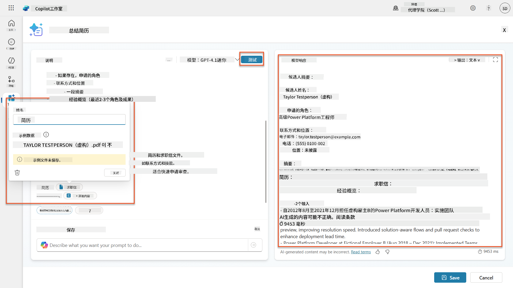

### 7.2 配置JSON输出

现在你将把提示转换为输出结构化的JSON数据，而不是纯文本。

1. 在提示指令的末尾添加以下JSON格式规范：

    ```text
    Output Format:
    Provide the output in valid JSON format with the following structure:
    
    {
        "CandidateName": "string",
        "Email": "string",
        "Summary": "string max 2000 characters",
        "Skills": [ {"item": "Skill 1"}, {"item": "Skill 2"}],
        "Experience": [ {"item": "Experience 1"}, {"item": "Experience 2"}],
    }
    ```

1. 将**输出**设置从“文本”更改为**JSON**。

1. 再次选择**测试**以验证输出现在是否格式化为JSON。  
    

1. **可选：**尝试使用不同的AI模型以查看输出的变化，然后返回默认模型。

1. 选择**保存**以创建提示。

1. 在**配置为代理使用**对话框中，选择**取消**。

    !!! info "为什么我们现在不将其添加为工具"
        你将使用此提示在Agent Flow中，而不是直接作为工具使用，这样可以更好地控制数据处理工作流程。

### 7.3 将提示添加到Agent Flow

你将创建一个Agent Flow，使用你的提示处理存储在Dataverse中的简历。

!!! tip "Agent Flow表达式"
    非常重要的是，你需要严格按照指示命名节点并输入表达式，因为表达式通过名称引用前一个节点！有关快速复习，请参考[招聘中的Agent Flow任务](../../recruit/09-add-an-agent-flow/README.md#you-mentioned-expressions-what-are-expressions)。

1. 进入Copilot Studio中的**招聘代理**

1. 选择**代理**标签，然后选择子代理**申请接收代理**

1. 在**工具**面板中，选择**+ 添加** → **+ 新工具** → **代理流**

1. 在“当代理调用流节点时”，使用**+ 添加输入**添加以下参数：

    | 类型 | 名称 | 描述 |
    |------|------|------|
    | 文本 | ResumeNumber | 请确保使用[ResumeNumber]。它必须始终以字母R开头 |

1. 选择第一个节点下的**+**插入操作图标，搜索**Dataverse**，选择**查看更多**，然后找到**列出行**操作。

1. 选择列出行节点上的**省略号（...）**，然后选择**重命名**为`Get Resume Record`，并设置以下参数：

    | 属性 | 设置方式 | 值 |
    |------|---------|----|
    | **表名** | 选择 | Resumes |
    | **过滤行** | 动态数据（闪电图标） | `ppa_resumenumber eq 'ResumeNumber'` 将**ResumeNumber**替换为**当代理调用流** → **ResumeNumber** |
    | **行数** | 输入 | 1 |

    !!! tip "优化查询！"
        在生产中使用此技术时，你应始终将选择的列限制为仅代理流所需的列。

    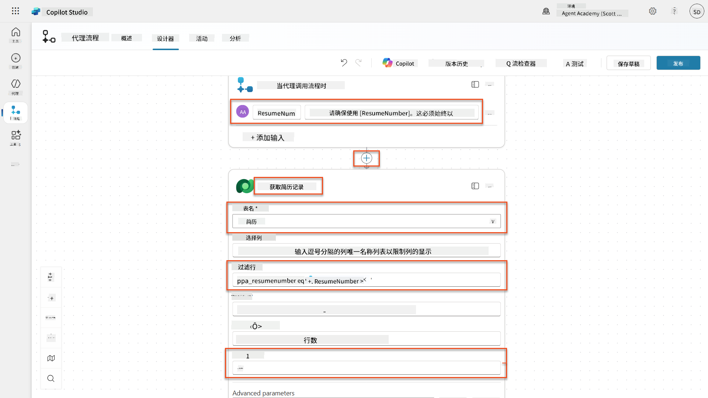

1. 选择获取简历记录节点下的**+**插入操作图标，搜索**Dataverse**，选择**查看更多**，然后找到**下载文件或图像**操作。

    !!! tip "选择正确的操作！"
        请确保不要选择以“从选定环境”结尾的操作。

1. 如前所述，将操作重命名为`Download Resume`，然后设置以下参数：

    | 属性 | 设置方式 | 值 |
    |------|---------|----|
    | **表名** | 选择 | Resumes |
    | **行ID** | 表达式（fx图标） | `first(body('Get_Resume_Record')?['value'])?['ppa_resumeid']` |
    | **列名** | 选择 | Resume PDF |

    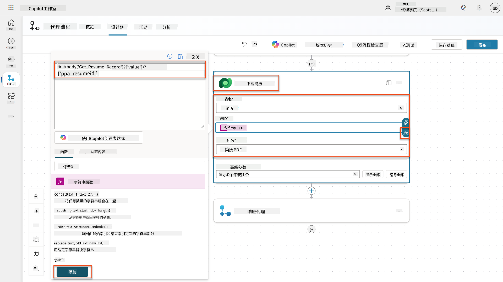

1. 现在，选择下载简历节点下的**+**插入操作图标，在**AI功能**下选择**运行提示**。

1. 将操作重命名为`Summarize Resume`并设置以下参数：

    | 属性 | 设置方式 | 值 |
    |------|---------|----|
| **提示** | 选择 | 摘要简历 |
| **求职信** | 表达式 (fx 图标) | `first(body('Get_Resume_Record')?['value'])?['ppa_coverletter']` |
| **简历** | 动态数据 (闪电图标) | 下载简历 → 文件或图片内容 |

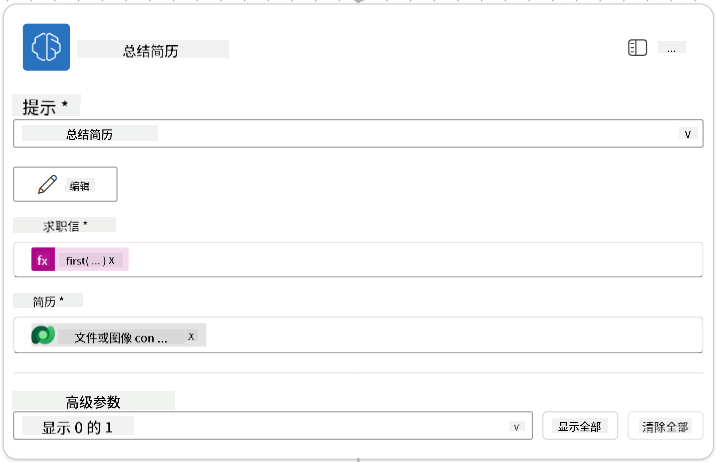

!!! tip "提示参数"
    注意，您填写的参数与创建提示时配置的输入参数是相同的。

### 7.4 创建候选人记录

接下来，您需要将提示提供的信息用于创建新的候选人记录（如果尚不存在）。

1. 在“摘要简历”节点下选择 **+** 插入操作图标，搜索 **Dataverse**，选择 **查看更多**，然后找到 **列出行** 操作。

1. 将节点重命名为 `获取现有候选人`，然后设置以下参数：

    | 属性 | 设置方式 | 值 |
    |------|----------|-----|
    | **表名** | 选择 | 候选人 |
    | **筛选行** | 动态数据 (闪电图标) | `ppa_email eq 'Email'`  **替换** `Email` 为 **摘要简历 → Email** |
    | **行数** | 输入 | 1 |

    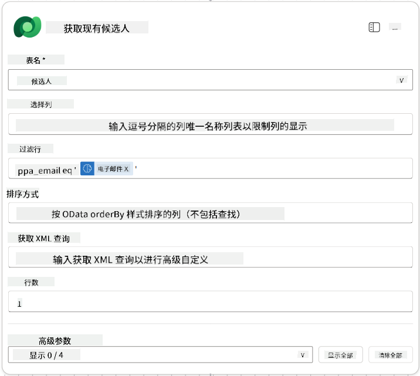

1. 在“获取现有候选人”节点下选择 **+** 插入操作图标，搜索 **控制**，选择 **查看更多**，然后找到 **条件** 操作。

1. 在条件属性中，设置以下条件：

    | 条件 | 运算符 | 值 |
    |------|--------|-----|
    | 表达式 (fx 图标): `length(outputs('Get_Existing_Candidate')?['body/value'])` | 等于 | 0 |

    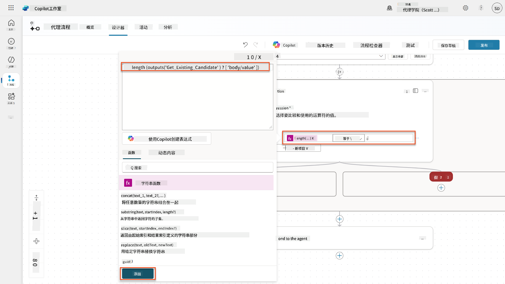

1. 在 **True** 分支中选择 **+** 插入操作图标，搜索 **Dataverse**，选择 **查看更多**，然后找到 **添加新行** 操作。

1. 将节点重命名为 `添加新候选人`，然后设置以下参数：

    | 属性 | 设置方式 | 值 |
    |------|----------|-----|
    | **表名** | 选择 | 候选人 |
    | **候选人姓名** | 动态数据 (闪电图标) | 摘要简历 → `CandidateName` |
    | **电子邮件** | 动态数据 (闪电图标) | 摘要简历 → `Email` |

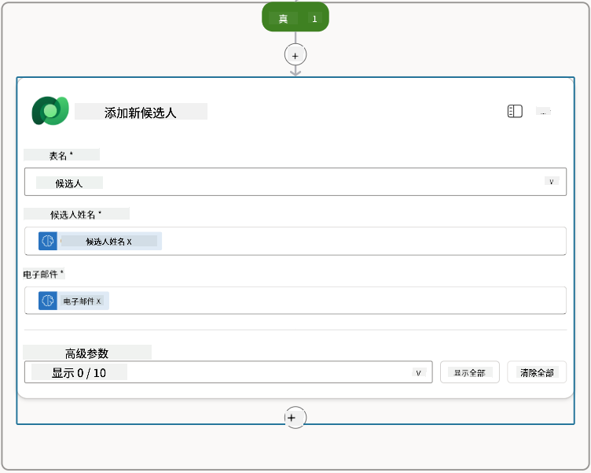

### 7.5 更新简历并配置流程输出

通过更新简历记录并配置返回给代理的数据来完成流程。

1. 在条件节点下选择 **+** 插入操作图标，搜索 **Dataverse**，选择 **查看更多**，然后找到 **更新行** 操作。

1. 选择标题将节点重命名为 `更新简历`，选择 **显示全部**，然后设置以下参数：

    | 属性 | 设置方式 | 值 |
    |------|----------|-----|
    | **表名** | 选择 | 简历 |
    | **行 ID** | 表达式 (fx 图标) | `first(body('Get_Resume_Record')?['value'])?['ppa_resumeid']` |
    | **摘要** | 动态数据 (闪电图标) | 摘要简历 → 文本 |
    | **候选人 (候选人)** | 表达式 (fx 图标) | `if(equals(length(outputs('Get_Existing_Candidate')?['body/value']), 1), first(outputs('Get_Existing_Candidate')?['body/value'])?['ppa_candidateid'], outputs('Add_a_New_Candidate')?['body/ppa_candidateid'])` |

    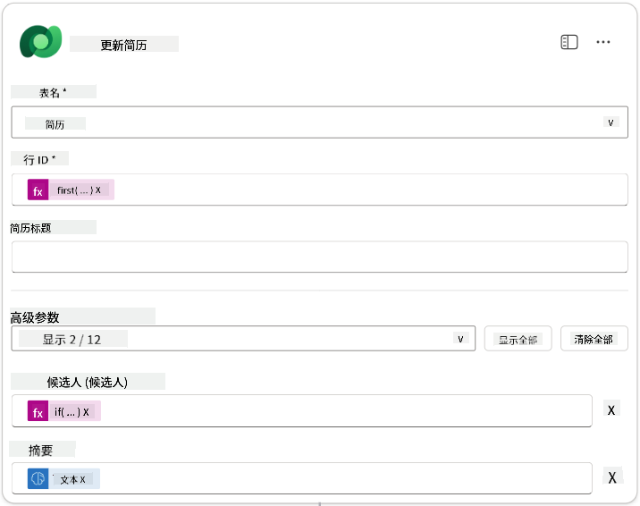

1. 选择 **响应代理** 节点，然后使用 **+ 添加输出** 配置：

    | 类型 | 名称              | 设置方式                      | 值                                                        | 描述                                            |
    | ---- | ----------------- | ----------------------------- | --------------------------------------------------------- | ------------------------------------------------ |
    | 文本 | `CandidateName`   | 动态数据 (闪电图标)           | 摘要简历 → 查看更多 → CandidateName                      | 简历中提供的 [候选人姓名]                        |
    | 文本 | `CandidateEmail`  | 动态数据 (闪电图标)           | 摘要简历 → 查看更多 → Email                              | 简历中提供的 [候选人电子邮件]                    |
    | 文本 | `CandidateNumber` | 表达式 (fx 图标)              | `concat('ppa_candidates/', if(equals(length(outputs('Get_Existing_Candidate')?['body/value']), 1), first(outputs('Get_Existing_Candidate')?['body/value'])?['ppa_candidateid'], outputs('Add_a_New_Candidate')?['body/ppa_candidateid']) )` | 新或现有候选人的 [候选人编号] |
    | 文本 | `ResumeSummary`   | 动态数据 (闪电图标)           | 摘要简历 → 查看更多 → body/responsev2/predictionOutput/structuredOutput | 简历摘要和详细信息的 JSON 格式                  |

    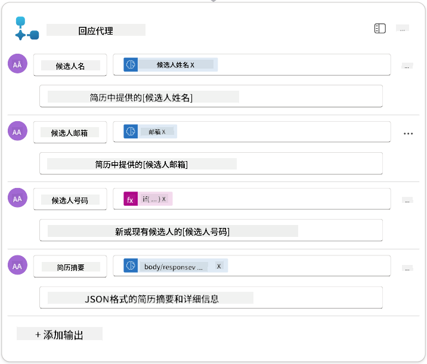

1. 在右上角选择 **保存草稿**。您的代理流程应如下所示  
    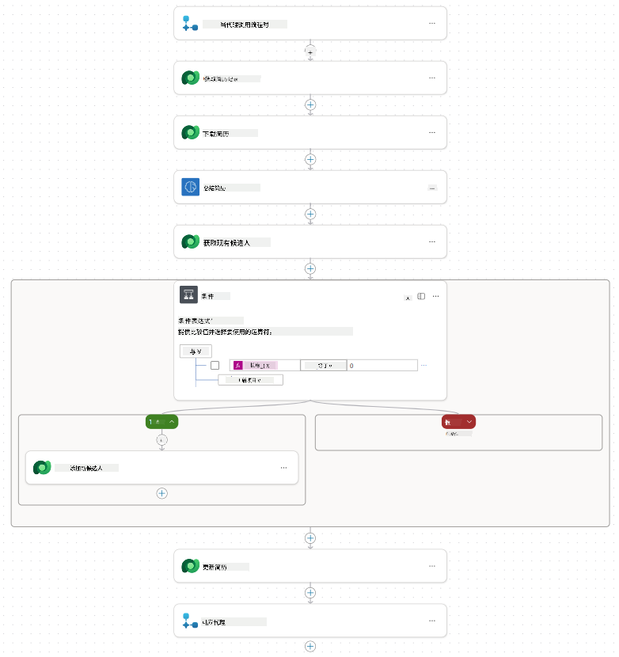

1. 选择 **概览** 标签，选择 **编辑** 在 **详细信息** 面板中

    1. **流程名称**：`摘要简历`
    1. **描述**：

        ```text
        Summarize an existing Resume stored in Dataverse using a [ResumeNumber] as input, return the [CandidateNumber], and resume summary JSON
        ```

1. 选择 **保存**

1. 再次选择 **设计器** 标签，然后选择 **发布**。

### 7.6 将流程连接到您的代理

现在您将添加流程作为工具，并配置您的代理使用它。

1. 在 Copilot Studio 中打开您的 **招聘代理**

1. 选择 **代理** 标签，打开 **申请接收代理**

1. 选择 **工具** 面板，选择 **+ 添加工具** - > **流程** -> **摘要简历** **(代理流程)**

1. 选择 **添加并配置**

1. 按以下方式配置工具设置：

    | 设置 | 值 |
    |------|-----|
    | **描述** | 使用 [简历编号] 作为输入，摘要存储在 Dataverse 中的现有简历，返回 [候选人编号] 和简历摘要 JSON |
    | **此工具何时可用** | 仅当由主题或代理引用时 |

1. 选择 **保存**  
    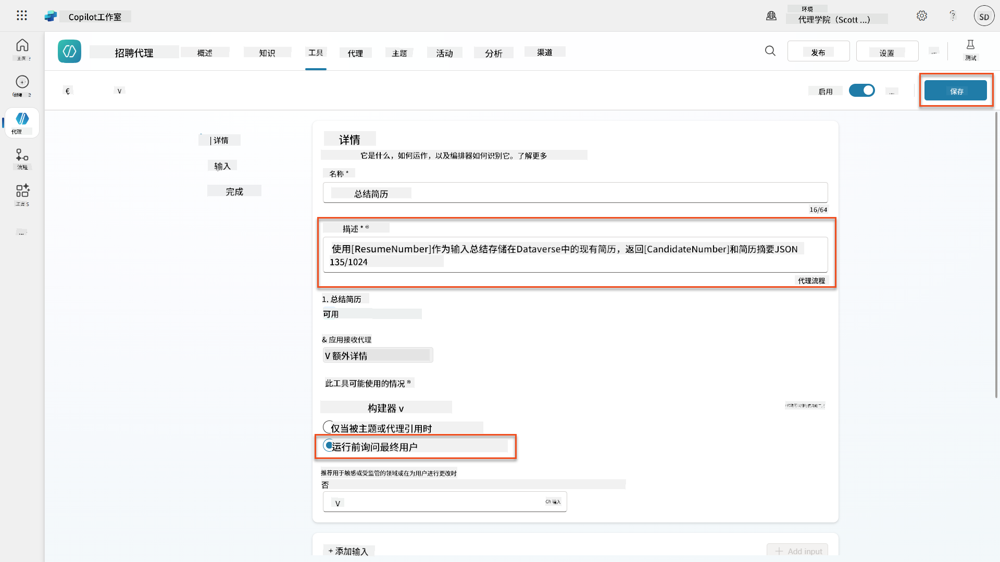

1. 如果您在招聘代理中选择工具，现在会看到两个工具显示它们可被 **申请接收代理** 使用。  
    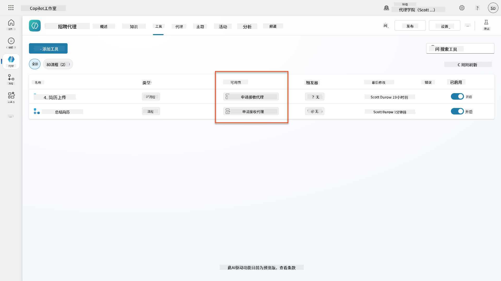

1. 导航到 **申请接收子代理** 指令，并修改 **上传后** 步骤如下：

    ```text
    2. Post-Upload Processing  
        - After uploading, be sure to also output the [ResumeNumber] in all messages
        - Pass [ResumeNumber] to /Summarize Resume  - Be sure to use the correct value that will start with the letter R.
        - Be sure to also output the [CandidateNumber] in all messages
        - Use the [ResumeSummary] to output a summary of the processed Resume and candidate
    ```

    替换 `/摘要简历`，通过输入斜杠 (`/)`) 或选择 `/摘要` 插入对 **摘要简历代理流程** 的引用。  
    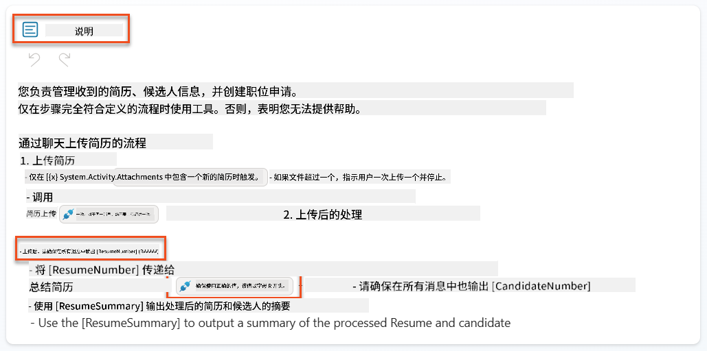

1. 选择 **保存**。

### 7.7 测试您的代理

测试您的完整多模态系统以确保一切正常运行。

1. **开始测试**：

    - 选择 **测试** 打开测试面板
    - 输入：`这是一个候选人的简历`

    - 上传 [测试简历](https://download-directory.github.io/?url=https://github.com/microsoft/agent-academy/tree/main/operative/sample-data/resumes&filename=operative_sampledata) 中的一个样本简历

1. **验证结果**：
    - 发送消息和简历后，检查是否收到简历编号（格式：R#####）
    - 验证是否收到候选人编号和摘要
    - 使用活动地图查看简历上传工具和摘要简历工具的操作，以及代理接收到的摘要提示输出：  
        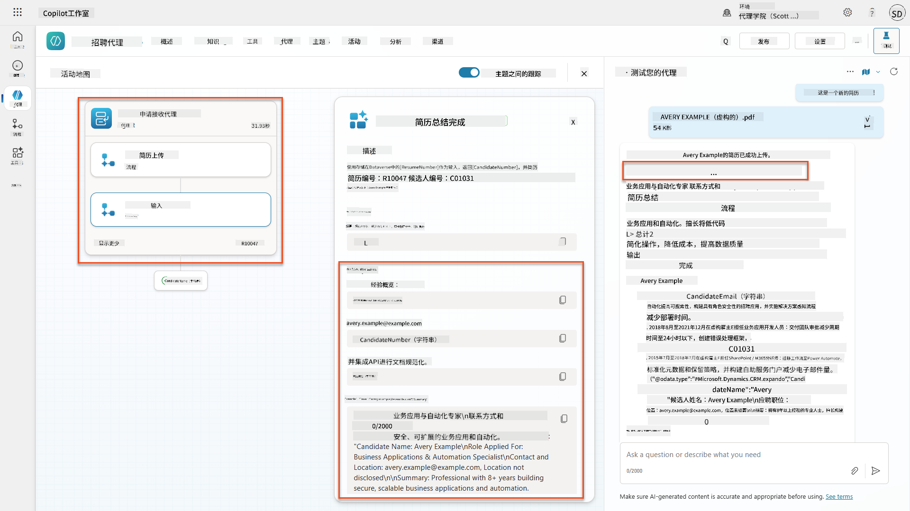

1. **检查数据持久性**：
    - 导航到 [Power Apps](https://make.powerapps.com)
    - 打开 **应用** → **招聘中心** → **播放**
    - 转到 **简历** 验证简历是否已上传并处理。它应包含摘要信息和相关的候选人记录。
    - 检查 **候选人** 查看提取的候选人信息  
        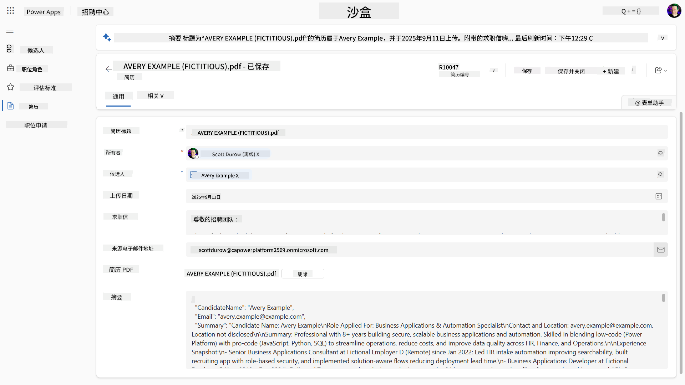
    - 再次运行流程时，它应使用现有候选人（根据从简历中提取的电子邮件匹配），而不是创建新的候选人。

!!! tip "故障排除"
    - **简历未处理**：确保文件是 PDF 格式且大小在限制范围内
    - **未创建候选人**：检查简历中是否正确提取了电子邮件
    - **JSON 格式错误**：验证您的提示指令是否包含确切的 JSON 结构
    - **流程错误**：检查所有 Dataverse 连接和表达式是否配置正确

### 生产准备

虽然这不是任务的一部分，但为了使此代理流程达到生产准备状态，您可能还需要考虑以下内容：

1. **错误处理** - 如果未找到简历编号，或者提示未能解析文档，应添加错误处理以向代理返回明确的错误。
1. **更新现有候选人** - 如果通过电子邮件找到候选人，则可以更新姓名以匹配简历中的信息。
1. **拆分简历摘要和候选人创建** - 可以将此功能拆分为更小的代理流程，以便更容易维护，然后为代理提供指令依次使用它们。

## 🎉 任务完成

干得好，特工！**简历文档侦查**任务现已完成。您已经成功掌握了多模态提示，并能够精确地从任何文档中提取结构化数据。

以下是您在本次任务中完成的内容：

**✅ 多模态提示掌握**  
您现在了解了什么是多模态提示，以及何时使用不同的 AI 模型以获得最佳结果。

**✅ 文档处理专业知识**  
您已经学会了如何配置带有图像和文档输入的提示，并以 JSON 格式输出结果以进行结构化数据提取。

**✅ 简历提取系统**  
您已经构建了一个完整的简历提取系统，可以处理候选人文档并与您的招聘工作流程集成。

**✅ 实施最佳实践**  
您已经应用了文档分析的提示工程最佳实践，并将多模态提示与代理流程集成。

**✅ 高级处理的基础**  
您的增强型文档分析能力现在已准备好迎接我们即将开展的任务中添加的高级数据基础功能。

🚀 **接下来：** 在任务 08 中，您将发现如何使用来自 Dataverse 的实时数据增强您的提示，创建适应不断变化的业务需求的动态 AI 解决方案。

⏩ [前往任务 08：使用 Dataverse 数据增强提示](../08-dataverse-grounding/README.md)

## 📚 战术资源

📖 [创建提示](https://learn.microsoft.com/ai-builder/create-a-custom-prompt?WT.mc_id=power-power-182762-scottdurow)

📖 [向提示添加文本、图像或文档输入](https://learn.microsoft.com/ai-builder/add-inputs-prompt?WT.mc_id=power-182762-scottdurow)

📖 [使用 JSON 输出处理响应](https://learn.microsoft.com/ai-builder/process-responses-json-output?WT.mc_id=power-182762-scottdurow)

📖 [模型选择和温度设置](https://learn.microsoft.com/ai-builder/prompt-modelsettings?WT.mc_id=power-182762-scottdurow)

📖 [在 Power Automate 中使用您的提示](https://learn.microsoft.com/ai-builder/use-a-custom-prompt-in-flow?WT.mc_id=power-182762-scottdurow)

📺 [AI Builder: 提示构建器中的 JSON 输出](https://www.youtube.com/watch?v=F0fGnWrRY_I)

---

**免责声明**：  
本文档使用AI翻译服务[Co-op Translator](https://github.com/Azure/co-op-translator)进行翻译。尽管我们努力确保翻译的准确性，但请注意，自动翻译可能包含错误或不准确之处。应以原始语言的文档作为权威来源。对于重要信息，建议使用专业人工翻译。我们不对因使用此翻译而产生的任何误解或误读承担责任。