<!--
CO_OP_TRANSLATOR_METADATA:
{
  "original_hash": "750f3ea8a94930439ebd8a10871b1d73",
  "translation_date": "2025-10-18T03:08:36+00:00",
  "source_file": "docs/operative-preview/08-dataverse-grounding/README.md",
  "language_code": "zh"
}
-->
# 🚨 任务08：通过Dataverse数据源增强提示

--8<-- "disclaimer.md"

## 🕵️‍♂️ 代号：`地基控制行动`

> **⏱️ 行动时间窗口：** `~60分钟`

## 🎯 任务简报

欢迎回来，特工。您的多代理招聘系统已经启动，但还需要一个关键的增强功能——**数据基础**。您的AI模型需要实时访问组织的结构化数据，以做出智能决策。

目前，您的“简历总结”提示是基于静态知识运行的。但如果它能够动态访问您的职位数据库，提供准确、最新的匹配结果呢？如果它能够理解您的评估标准，而无需您手动硬编码呢？

在本次任务中，您将通过**Dataverse数据源**增强您的自定义提示——将提示直接连接到实时数据源。这将使您的代理从静态响应者转变为动态、数据驱动的系统，能够适应不断变化的业务需求。

您的任务是：将实时职位和评估标准数据集成到您的简历分析工作流中，创建一个能够实时更新的系统，以满足组织的招聘需求。

## 🔎 目标

在本次任务中，您将学习：

1. **Dataverse数据源**如何增强自定义提示
1. 何时使用数据基础与静态指令
1. 设计动态整合实时数据的提示
1. 通过职位匹配增强简历总结流程

## 🧠 理解提示的Dataverse数据源

**Dataverse数据源**允许您的自定义提示在处理请求时访问Dataverse表中的实时数据。通过这种方式，您的提示可以整合实时信息以做出更明智的决策，而不是依赖静态指令。

### 为什么Dataverse数据源很重要

传统的提示使用固定指令：

```text
Match this candidate to these job roles: Developer, Manager, Analyst
```

通过Dataverse数据源，您的提示可以访问当前数据：

```text
Match this candidate to available job roles from the Job Roles table, 
considering current evaluation criteria and requirements
```

这种方法提供了几个关键优势：

- **动态更新：**职位和标准可以在不修改提示的情况下进行更改
- **一致性：**所有代理使用相同的当前数据源
- **可扩展性：**新职位和标准会自动可用
- **准确性：**实时数据确保决策反映当前需求

### Dataverse数据源的工作原理

启用自定义提示的Dataverse数据源时：

1. **数据选择：**选择要包含的特定Dataverse表和列。您还可以选择相关表，系统将根据检索到的父记录进行过滤。
1. **上下文注入：**提示会自动将检索到的数据包含在提示上下文中。
1. **智能过滤：**如果您提供任何过滤条件，系统将仅包含与当前请求相关的数据。
1. **结构化输出：**您的提示可以引用检索到的数据并对记录进行推理以生成输出。

### 从静态到动态：数据基础的优势

让我们来看看任务07中的当前简历总结流程，并了解Dataverse数据源如何将其从静态转变为动态智能。

**当前静态方法：**
现有的提示包含硬编码的评估标准和预定的匹配逻辑。这种方法有效，但每次添加新职位、更改评估标准或调整公司优先级时都需要手动更新。

**Dataverse数据源的转变：**
通过添加Dataverse数据源，您的简历总结流程将：

- **访问当前职位**，来自您的职位表
- **使用实时评估标准**，而不是静态描述  
- **提供准确匹配**，基于实时需求

## 🎯 为什么选择专用提示而不是代理对话

在任务02中，您体验了面试代理如何将候选人与职位匹配，但需要复杂的用户提示，例如：

```text
Upload this resume, then show me open job roles,
each with a description of the evaluation criteria, 
then use this to match the resume to at least one suitable
job role even if not a perfect match.
```

虽然这种方法有效，但对于特定任务，带有Dataverse数据源的专用提示提供了显著优势：

### 专用提示的关键优势

| 方面 | 代理对话 | 专用提示 |
|------|----------|----------|
| **一致性** | 结果因用户的提示编写技能而异 | 每次处理都标准化 |
| **专业化** | 通用推理可能忽略业务细节 | 专为优化业务逻辑而设计 |
| **自动化** | 需要人工交互和解释 | 通过结构化JSON输出自动触发 |

## 🧪 实验8：为提示添加Dataverse数据源

是时候升级您的简历分析功能了！您将通过动态职位匹配增强现有的简历总结流程。

### 完成任务的前提条件

1. 您需要**以下之一**：

    - **完成任务07**并准备好您的简历分析系统，**或者**
    - **导入任务08的起始解决方案**，如果您是从头开始或需要补课。[下载任务08起始解决方案](https://aka.ms/agent-academy)

1. 从[test Resumes](https://download-directory.github.io/?url=https://github.com/microsoft/agent-academy/tree/main/operative/sample-data/resumes&filename=operative_sampledata)下载样本简历文档

!!! note "解决方案导入和样本数据"
    如果您使用起始解决方案，请参考[任务01](../01-get-started/README.md)了解如何将解决方案和样本数据导入您的环境的详细说明。

### 8.1 为提示添加Dataverse数据源

您将基于任务07中创建的简历总结提示进行构建。目前它只是简单地总结简历，现在您将通过Dataverse中的职位数据进行基础化，使其始终保持最新。

首先，让我们检查您将用于基础化的Dataverse表：

1. **导航**到[Power Apps](https://make.powerapps.com)，并使用导航栏右上角的**环境切换器**选择您的环境。

1. 选择**表**并找到**职位**表。

1. 查看您将用于基础化的关键列：

    | 列名 | 用途 |
    |------|------|
    | **职位编号** | 用于职位匹配的唯一标识符 |
    | **职位名称** | 职位的显示名称 |
    | **描述** | 职位要求的详细信息 |

1. 同样，查看其他表，例如**评估标准**表。

### 8.2 将Dataverse数据源添加到您的提示中

1. **导航**到Copilot Studio，并使用导航栏右上角的**环境切换器**选择您的环境。

1. 从左侧导航中选择**工具**。

1. 选择**提示**并找到您在任务07中创建的**简历总结**提示。  
    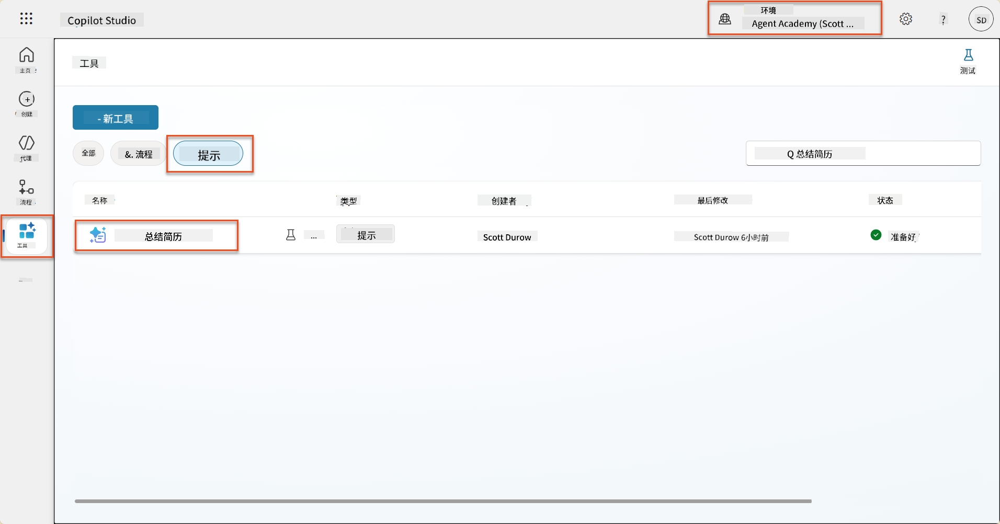

1. 选择**编辑**以修改提示，并替换为以下增强版本：

    !!! important
        确保简历和求职信参数保持为参数。

    ```text
    You are tasked with extracting key candidate information from a resume and cover letter to facilitate matching with open job roles and creating a summary for application review.
    
    ### Instructions:
    1. **Extract Candidate Details:**
       - Identify and extract the candidate's full name.
       - Extract contact information, specifically the email address.
    
    2. **Analyze Resume and Cover Letter:**
       - Review the resume content to identify relevant skills, experience, and qualifications.
       - Review the cover letter to understand the candidate's motivation and suitability for the roles.
    
    3. **Match Against Open Job Roles:**
       - Compare the extracted candidate information with the requirements and descriptions of the provided open job roles.
       - Use the job descriptions to assess potential fit.
       - Identify all roles that align with the candidate's cover letter and profile. You don't need to assess perfect suitability.
       - Provide reasoning for each match based on the specific job requirements.
    
    4. **Create Candidate Summary:**
       - Summarize the candidate's profile as multiline text with the following sections:
          - Candidate name
          - Role(s) applied for if present
          - Contact and location
          - One-paragraph summary
          - Top skills (8–10)
          - Experience snapshot (last 2–3 roles with outcomes)
          - Key projects (1–3 with metrics)
          - Education and certifications
          - Availability and work authorization
    
    ### Output Format
    
    Provide the output in valid JSON format with the following structure:
    
    {
      "CandidateName": "string",
      "Email": "string",
      "MatchedRoles": [
        {
          "JobRoleNumber": "ppa_jobrolenumber from grounded data",
          "RoleName": "ppa_jobtitle from grounded data",
          "Reasoning": "Detailed explanation based on job requirements"
        }
      ],
      "Summary": "string"
    }
    
    ### Guidelines
    
    - Extract information only from the provided resume and cover letter documents.
    - Ensure accuracy in identifying contact details.
    - Use the available job role data for matching decisions.
    - The summary should be concise but informative, suitable for quick application review.
    - If no suitable matches are found, indicate an empty list for MatchedRoles and explain briefly in the summary.
    
    ### Input Data
    Open Job Roles (ppa_jobrolenumber, ppa_jobtitle): /Job Role 
    Resume: {Resume}
    Cover Letter: {CoverLetter}
    ```

1. 在提示编辑器中，通过选择**+ 添加内容**，选择**Dataverse** → **职位**并选择以下列，然后选择**添加**：

    1. **职位编号**

    1. **职位名称**

    1. **描述**

    !!! tip
        您可以输入表名进行搜索。

1. 在**职位**对话框中，选择**过滤器**属性，选择**状态**，然后输入**活动**作为**过滤器**值。  
    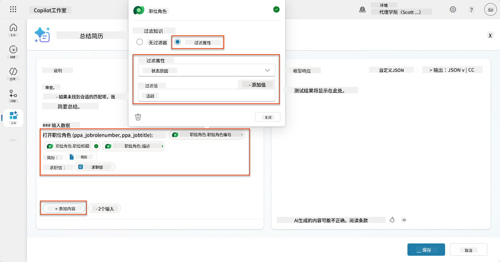

    !!! tip
        您还可以在此处使用**添加值**来添加输入参数——例如，如果您有一个提示用于总结现有记录，您可以提供简历编号作为过滤器参数。

1. 接下来，您将添加相关的Dataverse表**评估标准**，再次选择**+ 添加内容**，找到**职位**，然后不是选择职位的列，而是展开**职位（评估标准）**并选择以下列，然后选择**添加**：

    1. **标准名称**

    1. **描述**  
        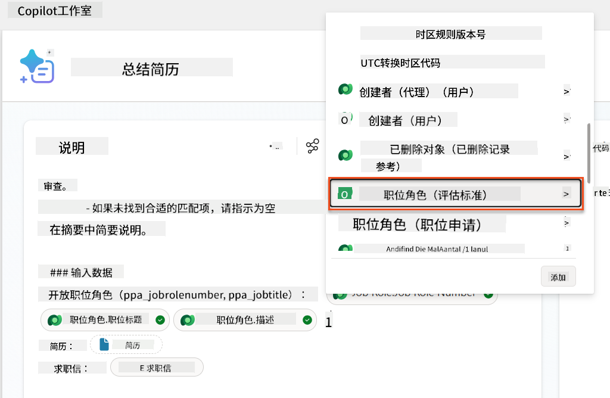

        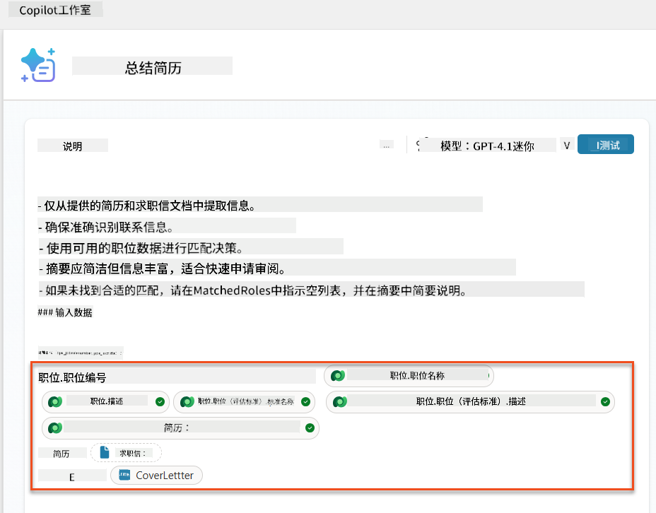

    !!! tip
        首先选择职位，然后在菜单中导航到职位（评估标准）以选择相关评估标准非常重要。这将确保仅加载与职位相关的记录。

1. 选择**设置**，并将**记录检索**调整为1000——这将允许提示中包含最多的职位和评估标准。  
    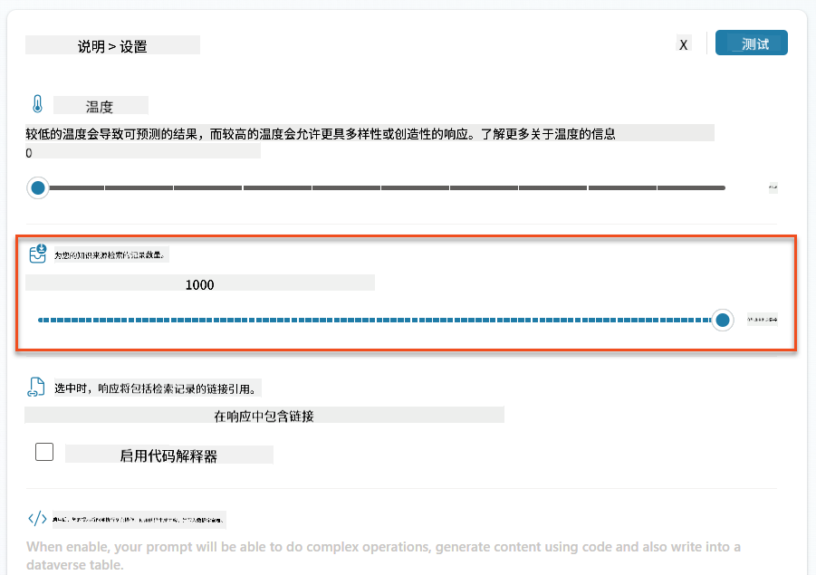

### 8.3 测试增强提示

1. 选择**简历**参数，并上传您在任务07中使用的样本简历。
1. 选择**测试**。
1. 测试运行后，注意JSON输出现在包括**匹配的职位**。
1. 选择**使用的知识**选项卡，查看在执行提示之前与提示合并的Dataverse数据。
1. **保存**您的更新提示。系统现在将在现有的简历总结代理流程调用提示时自动包含此Dataverse数据。  
    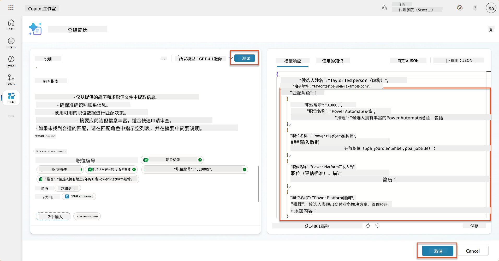

### 8.4 添加职位申请代理流程

为了让我们的申请接收代理根据建议的职位创建职位申请，我们需要创建一个代理流程。代理将为候选人感兴趣的每个建议职位调用此工具。

!!! tip "代理流程表达式"
    请务必严格按照指示命名节点并准确输入表达式，因为表达式会通过节点名称引用之前的节点！有关快速复习，请参考[招聘中的代理流程任务](../../recruit/09-add-an-agent-flow/README.md#you-mentioned-expressions-what-are-expressions)。

1. 在**招聘代理**中，选择**代理**选项卡，并打开**申请接收代理**子代理。

1. 在**工具**面板中，选择**+ 添加** → **+ 新工具** → **代理流程**

1. 选择**当代理调用流程时**节点，使用**+ 添加输入**添加以下参数：

    | 类型 | 名称            | 描述                                                  |
    |------|-----------------|------------------------------------------------------|
    | 文本 | `简历编号`      | 确保仅使用[简历编号] - 它必须以字母R开头             |
    | 文本 | `职位编号`      | 确保仅使用[职位编号] - 它必须以字母J开头             |

    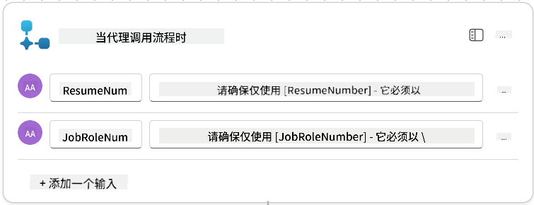

1. 选择第一个节点下的**+**插入操作图标，搜索**Dataverse**，选择**查看更多**，然后找到**列出行**操作。

1. **重命名**节点为`获取简历`，然后设置以下参数：

    | 属性            | 设置方式                    | 值                                                          |
    |-----------------|----------------------------|------------------------------------------------------------|
    | **表名**        | 选择                       | 简历                                                        |
    | **过滤行**      | 动态数据（闪电图标）        | `ppa_resumenumber eq '简历编号'` 选择并替换**简历编号**为**当代理调用流程时** → **简历编号** |
    | **行数**        | 输入                       | 1                                                           |

    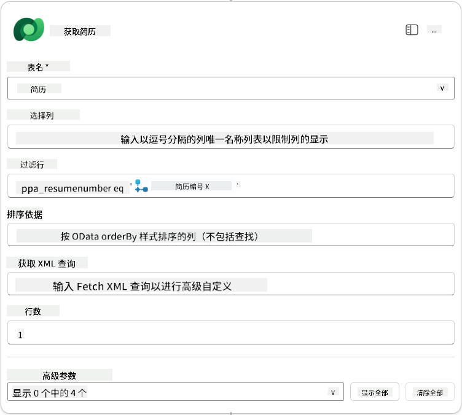

1. 现在，选择**获取简历**下的**+**插入操作图标，搜索**Dataverse**，选择**查看更多**，然后找到**列出行**操作。

1. **重命名**节点为`获取职位`，然后设置以下参数：

    | 属性            | 设置方式                    | 值                                                          |
    |-----------------|----------------------------|------------------------------------------------------------|
    | **表名**        | 选择                       | 职位                                                        |
    | **过滤行**      | 动态数据（闪电图标）        | `ppa_jobrolenumber eq '职位编号'` 选择并替换**职位编号**为**当代理调用流程时** → **职位编号** |
    | **行数**        | 输入                       | 1                                                           |

    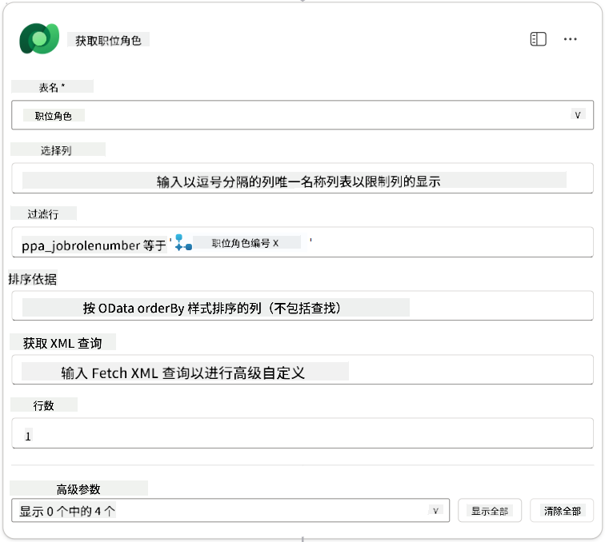

1. 现在，选择**获取职位**下的**+**插入操作图标，搜索**Dataverse**，选择**查看更多**，然后找到**添加新行**操作。

1. **重命名**节点为`添加申请`，然后设置以下参数：

    | 属性                           | 设置方式           | 值                                                          |
    |--------------------------------|--------------------|------------------------------------------------------------|
    | **表名**                       | 选择               | 职位申请                                                   |
    | **候选人（候选人）**           | 表达式（fx图标）   | `concat('ppa_candidates/',first(outputs('获取简历')?['body/value'])?['_ppa_candidate_value'])` |
| **职位角色 (Job Roles)**               | 表达式 (fx 图标) | `concat('ppa_jobroles/',first(outputs('Get_Job_Role')?['body/value'])?['ppa_jobroleid'])` |
| **简历 (Resumes)**                   | 表达式 (fx 图标) | `concat('ppa_resumes/', first(outputs('Get_Resume')?['body/value'])?['ppa_resumeid'])` |
| **申请日期** (使用 **显示全部**)       | 表达式 (fx 图标) | `utcNow()`                                                   |

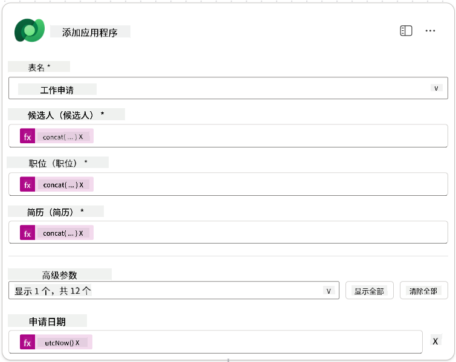

1. 选择 **响应代理节点**，然后选择 **+ 添加输出**

     | 属性            | 设置方式                      | 详情                                         |
     | --------------- | ----------------------------- | ------------------------------------------- |
     | **类型**        | 选择                          | `Text`                                      |
     | **名称**        | 输入                          | `ApplicationNumber`                         |
     | **值**          | 动态数据 (闪电图标)           | *添加申请 → 查看更多 → 申请编号*            |
     | **描述**        | 输入                          | `创建的职位申请的 [ApplicationNumber]`      |

     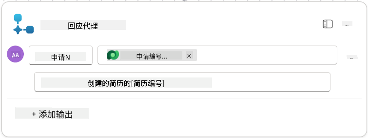

1. 在右上角选择 **保存草稿**

1. 选择 **概览** 标签，点击 **详情** 面板中的 **编辑**

      - **流程名称**:`Create Job Application`
      - **描述**:`根据 [ResumeNumber] 和 [JobRoleNumber] 创建新的职位申请`
      - **保存**

1. 再次选择 **设计器** 标签，然后选择 **发布**。

### 8.5 将创建职位申请添加到代理

现在您将把已发布的流程连接到您的申请接收代理。

1. 返回到 **招聘代理**，选择 **代理** 标签。打开 **申请接收代理**，然后找到 **工具** 面板。

1. 选择 **+ 添加**

1. 选择 **流程** 筛选器，并搜索 `Create Job Application`。选择 **Create Job Application** 流程，然后点击 **添加并配置**。

1. 设置以下参数：

    | 参数                                               | 值                                                          |
    | --------------------------------------------------- | ----------------------------------------------------------- |
    | **描述**                                           | `根据 [ResumeNumber] 和 [JobRoleNumber] 创建新的职位申请`   |
    | **附加详情 → 何时使用此工具**                      | `仅在主题或代理引用时使用`                                  |

1. 选择 **保存**  
    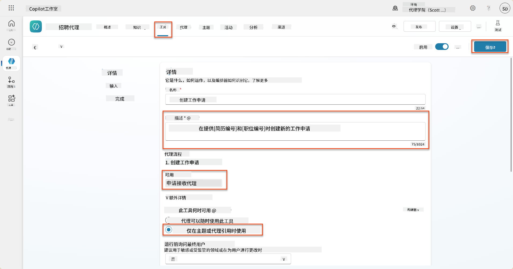

### 8.6 定义代理指令

为了创建职位申请，您需要告诉代理何时使用新工具。在这种情况下，您将要求用户确认要申请的建议职位角色，并指示代理为每个角色运行工具。

1. 返回到 **申请接收代理**，然后找到 **指令** 面板。

1. 在 **指令** 字段中，**添加** 以下清晰的指导到现有指令的**末尾**：

    ```text
    3. Post Resume Upload
       - Respond with a formatted bullet list of [SuggestedJobRoles] the candidate could apply for.  
       - Use the format: [JobRoleNumber] - [RoleDescription]
       - Ask the user to confirm which Job Roles to create applications for the candidate.
       - When the user has confirmed a set of [JobRoleNumber]s, move to the next step.
    
    4. Post Upload - Application Creation
        - After the user confirms which [SuggestedJobRoles] for a specific [ResumeNumber]:
        E.g. "Apply [ResumeNumber] for the Job Roles [JobRoleNumber], [JobRoleNumber], [JobRoleNumber]
        E.g. "apply to all suggested job roles" - this implies use all the [JobRoleNumbers] 
         - Loop over each [JobRoleNumber] and send with [ResumeNumber] to /Create Job Application   
         - Summarize the Job Applications Created
    
    Strict Rules (that must never be broken)
    You must always follow these rules and never break them:
    1. The only valid identifiers are:
      - ResumeNumber (ppa_resumenumber)→ format R#####
      - CandidateNumber (ppa_candidatenumber)→ format C#####
      - ApplicationNumber (ppa_applicationnumber)→ format A#####
      - JobRoleNumber (ppa_jobrolenumber)→ format J#####
    2. Never guess or invent these values.
    3. Always extract identifiers from the current context (conversation, data, or system output). 
    ```

1. 如果指令中包含斜杠 (/) ，选择斜杠后的文本并选择 **Create Job Application** 工具。

1. 选择 **保存**  
    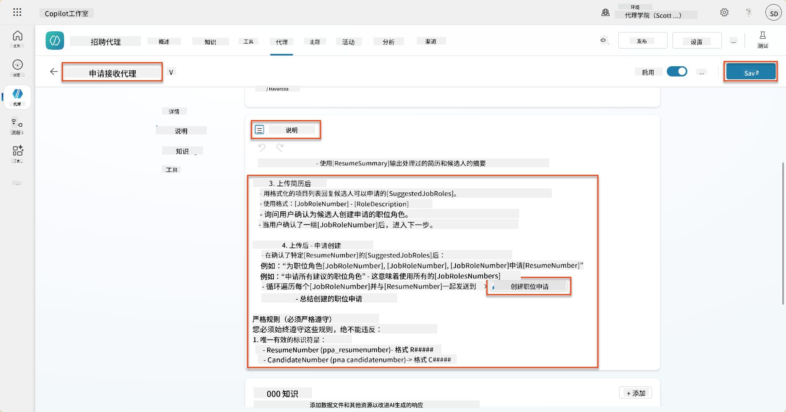

!!! tip "在生成编排中迭代多个项目"
    这些指令利用生成编排的能力，在决定使用哪些步骤和工具时可以迭代多个行。匹配的职位角色将被自动读取，申请接收代理将针对每一行运行。欢迎来到生成编排的神奇世界！

### 8.7 测试您的代理

1. 在 Copilot Studio 中打开您的 **招聘代理**。

1. **上传** 一个样本简历到聊天中，并输入：

    ```text
    This is a new resume for the Power Platform Developer Role.
    ```

1. 注意代理如何提供建议职位角色列表 - 每个角色都有一个职位角色编号。  
    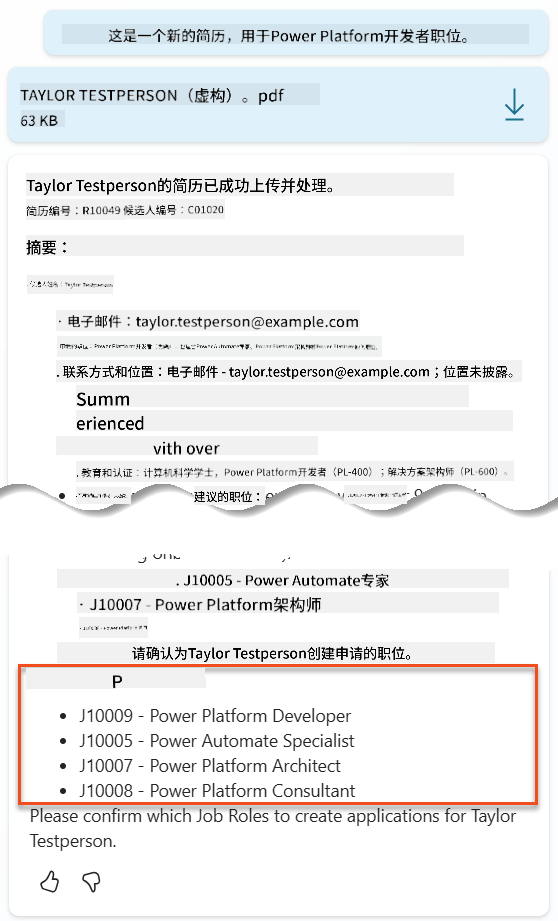

1. 然后您可以指定希望将简历添加为职位申请的角色。
    **示例：**

    ```text
    "Apply for all of those job roles"
    "Apply for the J10009 Power Platform Developer role"
    "Apply for the Developer and Architect roles"
    ```

    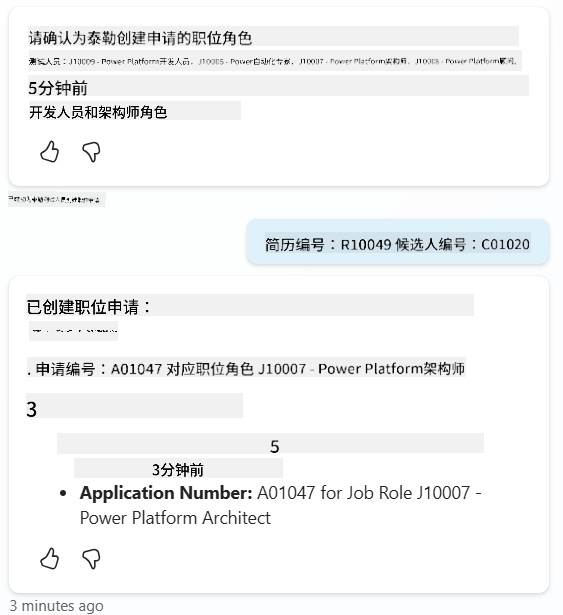

1. **创建职位申请工具** 将针对您指定的每个职位角色运行。在活动地图中，您将看到创建职位申请工具针对您要求创建申请的每个职位角色运行：  
    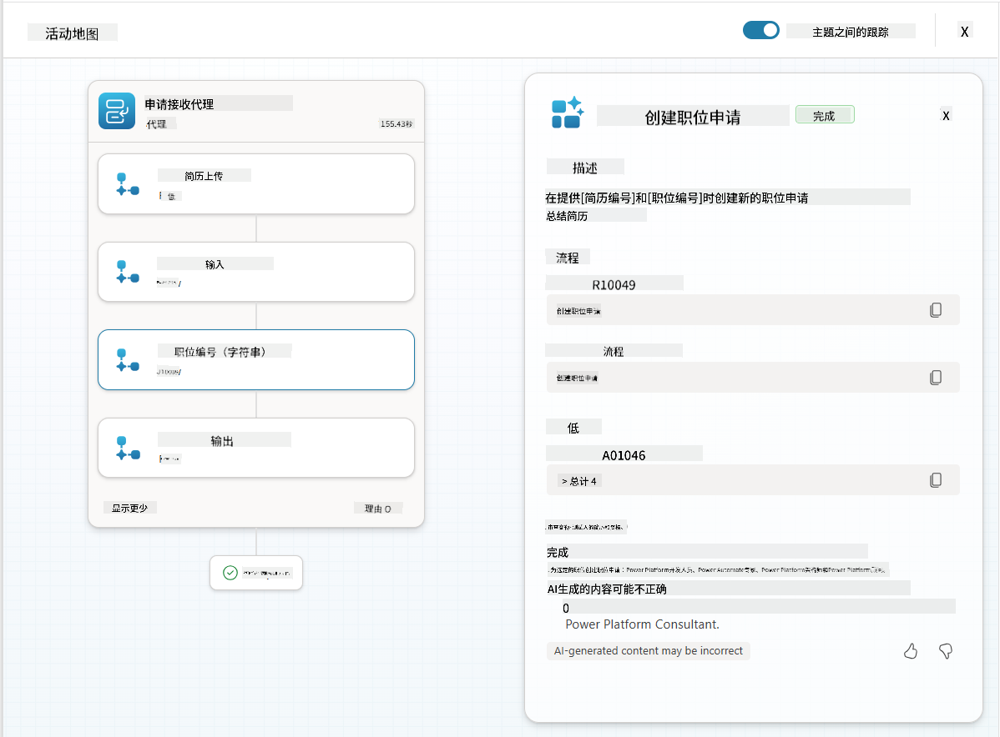

## 🎉 任务完成

干得好，行动者！**地面控制行动**现已完成。您已成功通过动态数据基础增强了您的 AI 能力，创建了一个真正智能的招聘系统。

以下是您在本次任务中完成的内容：

**✅ Dataverse 数据基础掌握**  
您现在了解如何将自定义提示连接到实时数据源以实现动态智能。

**✅ 增强简历分析**  
您的简历总结流程现在可以访问实时职位角色数据和评估标准以实现准确匹配。

**✅ 数据驱动决策**  
您的招聘代理现在可以自动适应不断变化的职位要求，无需手动更新提示。

**✅ 职位申请创建**  
您的增强系统现在可以创建职位申请，并准备好进一步复杂的工作流程编排。

🚀 **接下来：** 在您的下一个任务中，您将学习如何实现深度推理能力，帮助您的代理做出复杂决策并为其推荐提供详细解释。

⏩ [进入任务 09：深度推理](../09-deep-reasoning/README.md)

## 📚 战术资源

📖 [在提示中使用您自己的数据](https://learn.microsoft.com/ai-builder/use-your-own-prompt-data?WT.mc_id=power-182762-scottdurow)

📖 [创建自定义提示](https://learn.microsoft.com/ai-builder/create-a-custom-prompt?WT.mc_id=power-182762-scottdurow)

📖 [在 Copilot Studio 中使用 Dataverse](https://learn.microsoft.com/microsoft-copilot-studio/knowledge-add-dataverse?WT.mc_id=power-182762-scottdurow)

📖 [AI Builder 自定义提示概述](https://learn.microsoft.com/ai-builder/prompts-overview?WT.mc_id=power-182762-scottdurow)

📖 [Power Platform AI Builder 文档](https://learn.microsoft.com/ai-builder/?WT.mc_id=power-182762-scottdurow)

📖 [培训：使用您自己的 Dataverse 数据创建 AI Builder 提示](https://learn.microsoft.com/training/modules/ai-builder-grounded-prompts/?WT.mc_id=power-182762-scottdurow)

---

**免责声明**：  
本文档使用AI翻译服务[Co-op Translator](https://github.com/Azure/co-op-translator)进行翻译。尽管我们努力确保翻译的准确性，但请注意，自动翻译可能包含错误或不准确之处。原始语言的文档应被视为权威来源。对于重要信息，建议使用专业人工翻译。我们不对因使用此翻译而产生的任何误解或误读承担责任。