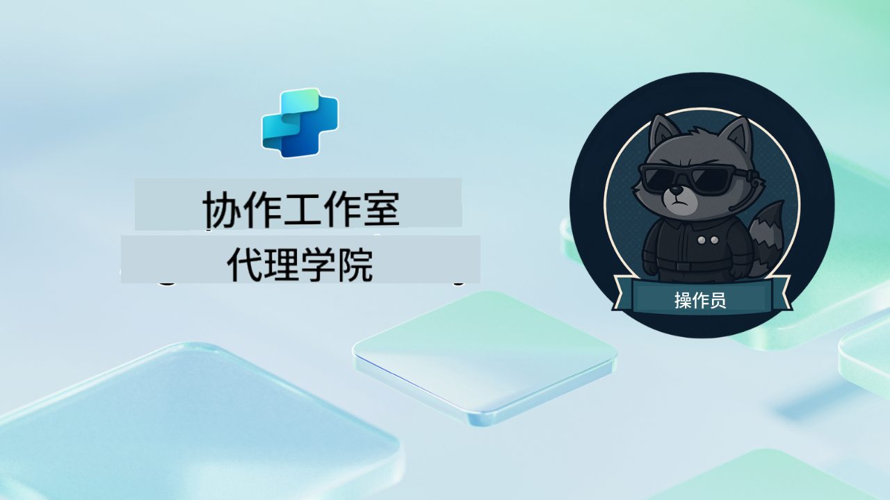

<!--
CO_OP_TRANSLATOR_METADATA:
{
  "original_hash": "24fcbe9a57d3439e05f8866e550c0a84",
  "translation_date": "2025-10-18T03:07:29+00:00",
  "source_file": "docs/operative-preview/README.md",
  "language_code": "zh"
}
-->
# 欢迎，特工

**欢迎，特工。**  
如果你选择接受这个高级任务，你将掌握使用 **Microsoft Copilot Studio** 构建 **企业级多代理系统** 的艺术。

这项强化培训将带你超越基础代理创建，进入 **多代理编排** 的复杂世界：从招聘自动化到 AI 安全，你将学习如何使用真实的企业场景来构建、协调和部署智能代理生态系统。

--8<-- "disclaimer.md"

---

## 🎯 任务目标

完成特工学院特工计划后，你将能够：

- 设计并实施适用于复杂业务场景的 **多代理系统**
- 掌握 **代理编排** 和协作模式
- 在生产系统中实施 **AI 安全和内容审核**
- 构建用于文档处理和分析的 **多模态提示**
- 部署具有适当治理和测试的 **企业级代理**

---

## 🧪 先决条件

完成所有任务需要：

- 完成 **Agent Academy Recruit** 培训
- 拥有 Microsoft Power Platform 环境以及 **Copilot Studio** 许可证
- 访问 **Microsoft Dataverse**
- 拥有创建解决方案和代理的管理员权限

---

## 🧬 适合人群

这门高级课程非常适合：

- 设计企业 AI 系统的 **解决方案架构师**
- 构建生产级代理解决方案的 **开发人员**
- 实施 AI 治理和安全的 **IT 专业人员**
- 创建复杂自动化工作流的 **业务分析师**
- 准备从基础代理升级到企业系统的任何人

---

## 🧭 课程概览

本学院课程以一系列渐进的实地任务为结构，每个任务都基于前一个任务，最终创建一个全面的招聘自动化系统。

| 任务 | 标题 | 操作简报 |
|------|------|----------|
| `01` | 🚨 [开始使用招聘代理](./01-get-started/README.md) | 部署基础设施并创建你的核心编排代理 |
| `02` | 🎭 [让你的代理具备多代理功能并连接其他代理](./02-multi-agent/README.md) | 将单一代理转变为协调的多代理系统 |
| `03` | ⚡ [使用触发器自动化你的代理](./03-automate-triggers/README.md) | 使用事件驱动的触发器实现自主代理行为 |
| `04` | 📝 [编写代理指令](./04-agent-instructions/README.md) | 掌握精准的代理沟通和行为控制 |
| `05` | 💬 [个性化代理响应](./05-agent-responses/README.md) | 定制代理响应以实现最大影响力和参与度 |
| `06` | 🛡️ [内容审核和 AI 安全基础](./06-ai-safety/README.md) | 实施企业级安全和合规措施 |
| `07` | 🎨 [使用多模态提示提取简历内容](./07-multimodal-prompts/README.md) | 使用高级 AI 功能处理文档和图像 |
| `08` | 🗄️ [提示 - Dataverse 数据基础](./08-dataverse-grounding/README.md) | 将代理与企业数据结合以提供准确的响应 |
| `09` | 🧠 [应用深度推理评估候选人匹配度和面试准备](./09-deep-reasoning/README.md) | 实施复杂决策的高级 AI 推理 |
| `10` | 📄 [使用提示生成候选人专属面试文档](./10-generate-documents/README.md) | 基于代理分析创建动态文档 |
| `11` | 📊 [使用自适应卡片获取用户反馈](./11-obtain-user-feedback/README.md) | 收集并处理用户反馈以实现持续改进 |
| `12` | 🌐 [将你的代理发布到演示网站供利益相关者测试](./12-demo-website/README.md) | 部署完整解决方案供利益相关者演示和测试 |

!!! note
    ✅ 完成此课程将获得 **特工** 徽章。  
    🔓 **指挥官** 将在未来阶段解锁。

<!-- markdownlint-disable-next-line MD033 -->

---

**免责声明**：  
本文档使用AI翻译服务[Co-op Translator](https://github.com/Azure/co-op-translator)进行翻译。尽管我们努力确保翻译的准确性，但请注意，自动翻译可能包含错误或不准确之处。原始语言的文档应被视为权威来源。对于重要信息，建议使用专业人工翻译。我们对因使用此翻译而产生的任何误解或误读不承担责任。