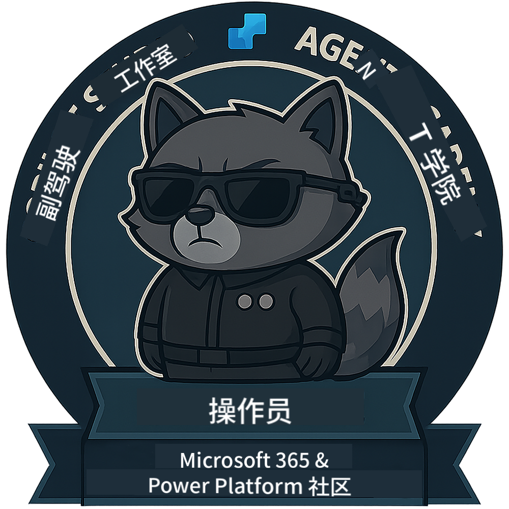

<!--
CO_OP_TRANSLATOR_METADATA:
{
  "original_hash": "1c5c8f18a1c1ec8fcbbb271403cf2ac6",
  "translation_date": "2025-10-18T03:07:12+00:00",
  "source_file": "docs/operative/README.md",
  "language_code": "zh"
}
-->
---
hide:
- navigation
---

# 特工（即将推出）

这门课程仍然是高度机密的内容。未来将会解锁！🔓

{ width="300" }

<!-- markdownlint-disable-next-line MD033 -->

---

**免责声明**：  
本文档使用AI翻译服务[Co-op Translator](https://github.com/Azure/co-op-translator)进行翻译。尽管我们努力确保翻译的准确性，但请注意，自动翻译可能包含错误或不准确之处。原始语言的文档应被视为权威来源。对于重要信息，建议使用专业人工翻译。我们对因使用此翻译而产生的任何误解或误读不承担责任。