<!--
CO_OP_TRANSLATOR_METADATA:
{
  "original_hash": "d9cd8cd1a4fbd8915171a2ed972cc322",
  "translation_date": "2025-10-18T02:49:33+00:00",
  "source_file": "docs/recruit/00-course-setup/README.md",
  "language_code": "zh"
}
-->
# 🚨 任务 00：课程设置

## 🕵️‍♂️ 代号：`部署准备行动`

> **⏱️ 行动时间窗口：** `~30分钟`  

## 🎯 任务简报

欢迎来到您作为Copilot Studio特工培训的第一项任务。  
在开始构建您的第一个AI代理之前，您需要建立一个**现场准备好的开发环境**。

本简报概述了成功操作Microsoft 365生态系统所需的系统、访问凭证和设置步骤。

## 🔎 目标

您的任务包括：

1. 获取一个Microsoft 365账户  
1. 获得Microsoft Copilot Studio的访问权限  
1. （可选）获取Microsoft 365 Copilot许可证以进行生产发布  
1. 创建一个开发环境作为您的Copilot Studio环境进行构建  
1. 创建一个SharePoint站点，作为后续任务中的数据源

---

## 🔍 前提条件

在开始之前，请确保您拥有：

1. 一个**工作或学校电子邮件地址**（不支持个人的@outlook.com、@gmail.com等）。  
1. 可访问互联网和现代浏览器（推荐使用Edge、Chrome或Firefox）。  
1. 对Microsoft 365有基本的了解（例如，登录Office应用或Teams）。  
1. （可选）如果您计划购买付费许可证，需要一张信用卡或支付方式。

---

## 第一步：获取Microsoft 365账户

Copilot Studio位于Microsoft 365中，因此您需要一个Microsoft 365账户才能访问它。您可以使用现有账户，也可以按照以下步骤获取适当的许可证：

1. **获取付费的Microsoft 365商业订阅**  
   1. 访问[Microsoft 365商业计划和定价页面](https://www.microsoft.com/microsoft-365/business/microsoft-365-plans-and-pricing)。  
   1. 最经济实惠的选项是Microsoft 365 Business Basic计划。选择`免费试用`并按照引导表单填写订阅、账户详情和支付信息。  
   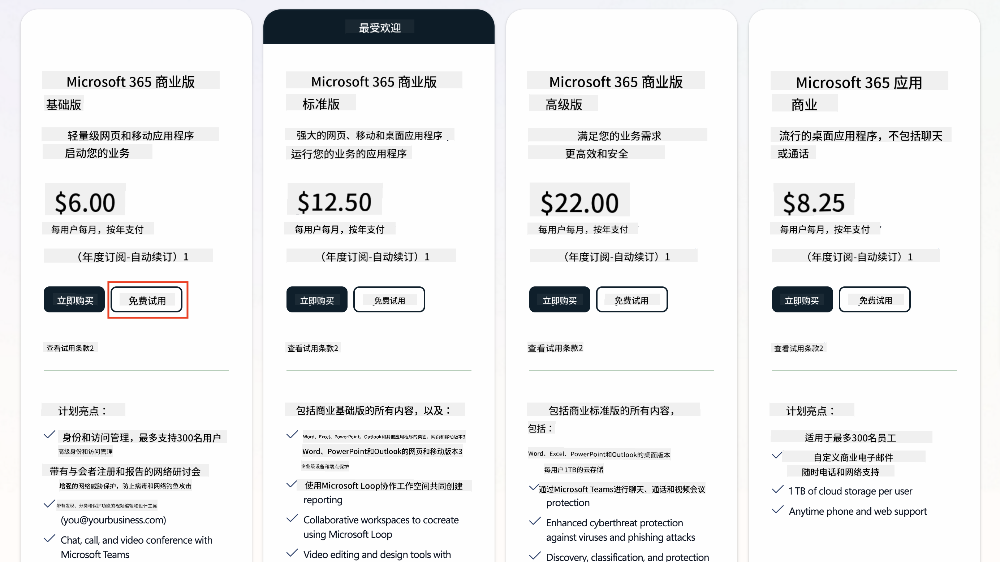  
   1. 完成账户创建后，登录。

    !!! 提示
        如果您计划将代理发布到Microsoft 365 Copilot Chat或连接到组织数据（如SharePoint、OneDrive、Dataverse），需要一个Microsoft 365 Copilot许可证。这是一个附加许可证，您可以在[许可证网站](https://www.microsoft.com/microsoft-365/copilot#plans)了解更多信息。

---

## 第二步：开始Copilot Studio试用

完成Microsoft 365租户设置后，您需要获取Copilot Studio的访问权限。您可以通过以下步骤获得30天的免费试用：

1. 访问[aka.ms/TryCopilotStudio](https://aka.ms/TryCopilotStudio)。  
1. 输入您在上一步中配置的新账户的电子邮件地址，然后选择`下一步`。  
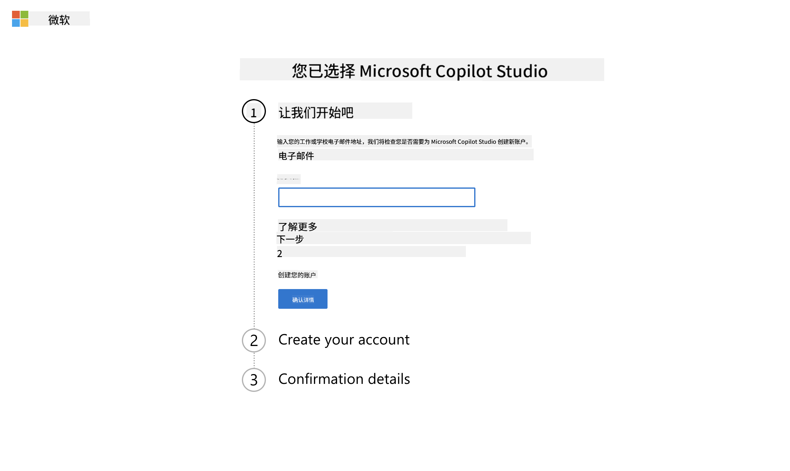  
1. 系统会识别您的账户。选择`登录`。  
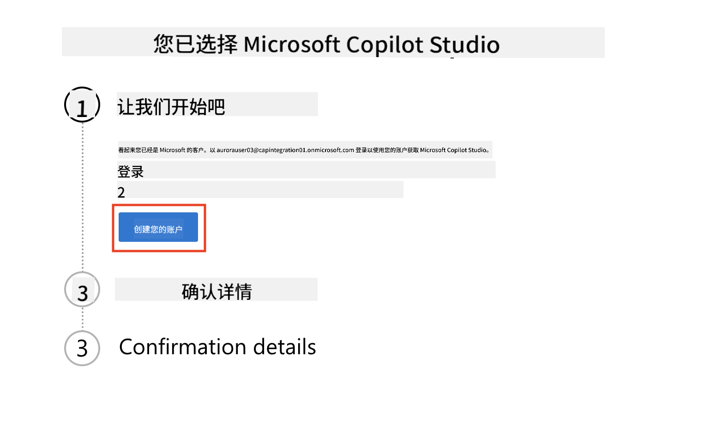  
1. 选择`开始免费试用`。  
  

!!! 信息 "试用说明"  
     1. 免费试用提供**完整的Copilot Studio功能**。  
     1. 您将收到有关试用到期的电子邮件通知。您可以每次延长试用30天（最多可运行代理90天）。  
     1. 如果您的租户管理员禁用了自助注册，您会看到错误提示——请联系您的Microsoft 365管理员重新启用。

---

## 第三步：创建新的开发环境

### 注册Power Apps开发者计划

使用第一步中创建的Microsoft 365租户，注册Power Apps开发者计划以创建一个免费的开发环境，用于在Copilot Studio中进行构建和测试。

1. 在[Power Apps开发者计划网站](https://aka.ms/PowerAppsDevPlan)上注册。

    - 输入您的电子邮件地址  
    - 勾选复选框  
    - 选择**开始免费**

    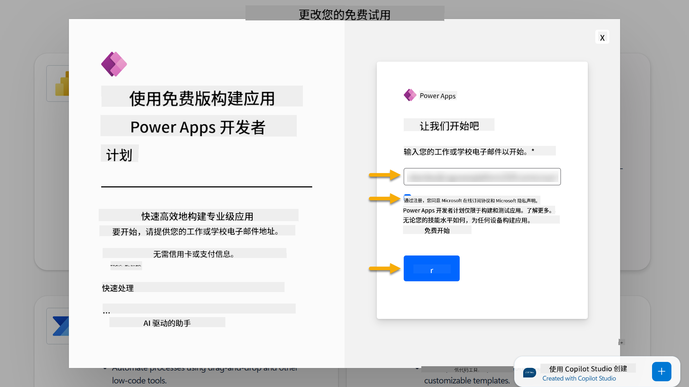

1. 注册开发者计划后，您将被重定向到[Power Apps](https://make.powerapps.com/)。环境会使用您的名字，例如**Adele Vance的环境**。如果已经有一个同名环境，新开发环境将命名为**Adele Vance的(1)**环境。

    在完成实验时，请使用此开发环境作为Copilot Studio的环境。

!!! 注意
    如果您使用现有的Microsoft 365账户，而不是在第一步中创建的账户，例如使用您工作组织中的账户，您的IT管理员（或相应团队）可能已关闭注册流程。在这种情况下，请联系您的管理员，或者按照第一步创建一个测试租户。

---

## 第四步：创建新的SharePoint站点

需要创建一个新的SharePoint站点，该站点将在[第六课 - 使用Copilot的对话创建体验创建自定义代理并基于您的数据进行支持](../06-create-agent-from-conversation/README.md#62-add-an-internal-knowledge-source-using-a-sharepoint-site)中使用。

1. 在Microsoft Copilot Studio的左上角选择华夫饼图标以查看菜单。从菜单中选择SharePoint。

    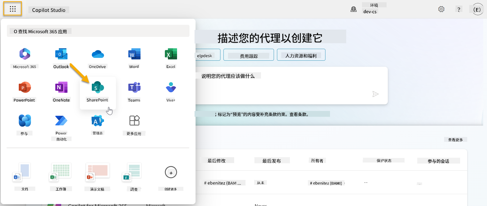

1. SharePoint将加载。选择**+ 创建站点**以创建一个新的SharePoint站点。

    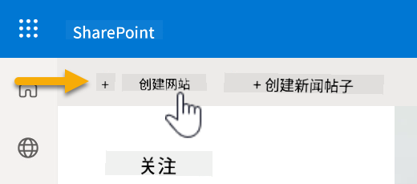

1. 将出现一个对话框，引导您创建新的SharePoint站点。选择**团队站点**。

    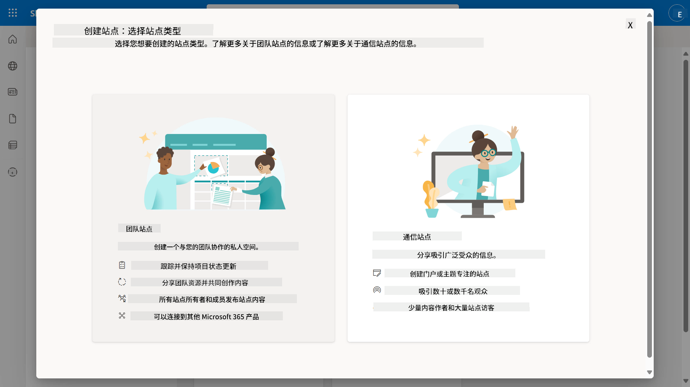

1. 在下一步中，默认情况下会加载Microsoft模板列表。向下滚动并选择**IT服务台**模板。

    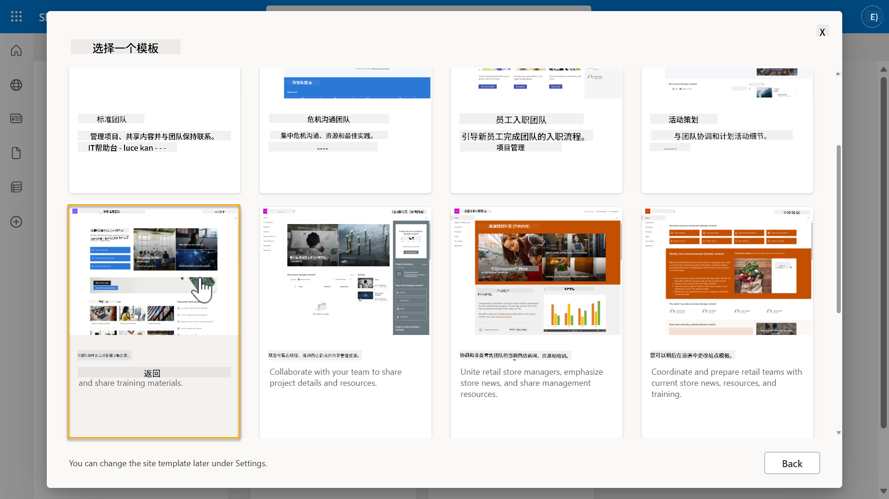

1. 选择**使用模板**以使用IT服务台模板创建新的SharePoint站点。

    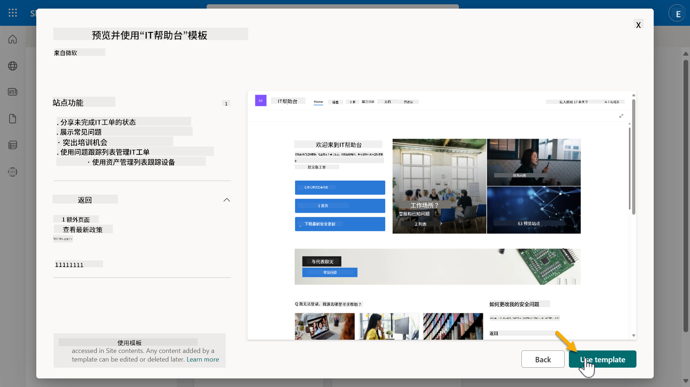

1. 输入您的站点信息。以下是一个示例：

    | 字段 | 值 |
    | --- | --- |
    | 站点名称 | Contoso IT |
    | 站点描述 | Copilot Studio入门 |
    | 站点地址 | ContosoIT |

    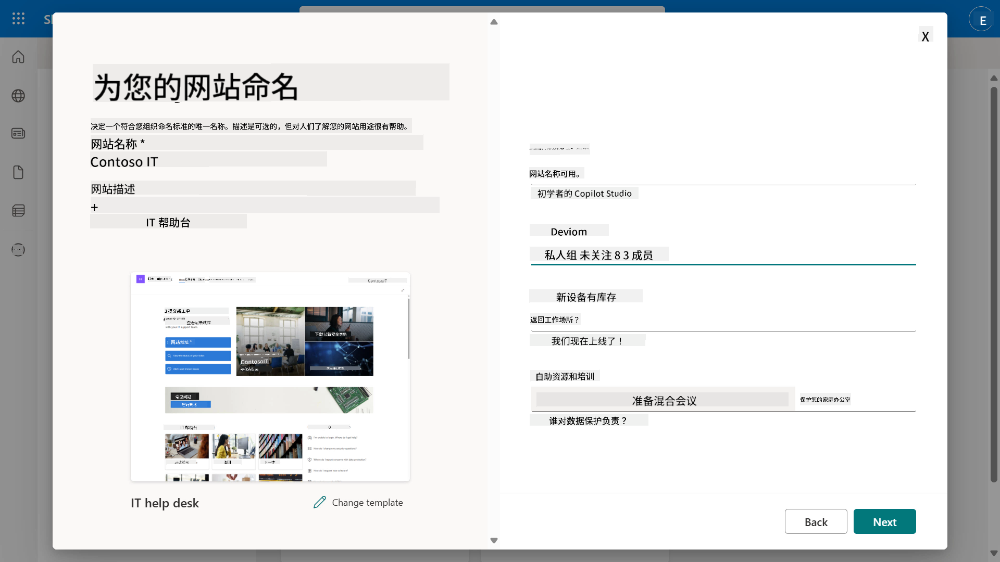

1. 在最后一步，可以为SharePoint站点选择语言。默认情况下为**英语**。保持语言为**英语**，然后选择**创建站点**。

    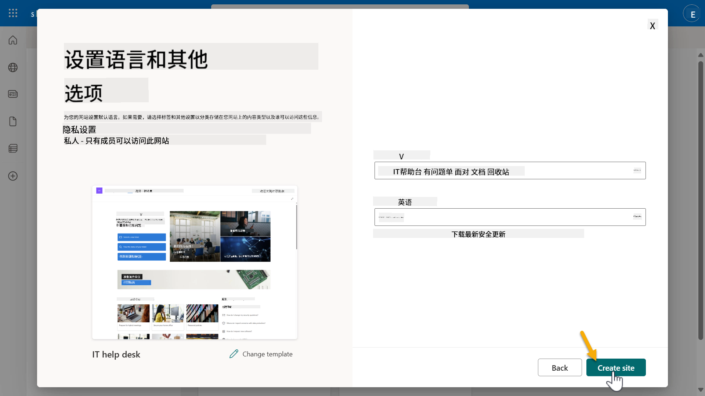

1. SharePoint站点将在接下来的几秒钟内完成配置。在此期间，您可以选择通过在**添加成员**字段中输入他们的电子邮件地址来向您的站点添加其他用户。完成后，选择**完成**。

    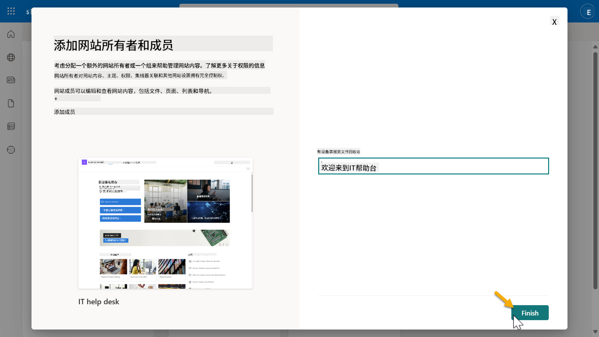

1. 接下来将加载SharePoint站点主页。**复制**SharePoint站点URL。

1. 此模板提供了包含各种IT政策示例数据的页面以及两个示例列表（Tickets和Devices）。

### 使用Devices SharePoint列表

我们将在[任务07 - 使用连接器添加新主题和节点](../07-add-new-topic-with-trigger/README.md#73-add-a-tool-using-a-connector)中使用**Devices**列表。

### 添加新列

在列表中向右滚动，选择**+ 添加列**按钮。选择**超链接**类型，输入**图片**作为列名，然后选择添加。

### 在Devices SharePoint列表中创建示例数据

您需要确保在此列表中填充至少4个示例数据项，并向此列表添加一个额外的列。

在添加示例数据时，请确保填写以下字段：

- 设备照片 - 使用[设备图片文件夹](https://github.com/microsoft/agent-academy/tree/main/docs/recruit/00-course-setup/images/device-images)中的图片  
- 标题  
- 状态  
- 制造商  
- 型号  
- 资产类型  
- 颜色  
- 序列号  
- 购买日期  
- 购买价格  
- 订单号  
- 图片 - 使用以下链接  

|设备  |URL  |
|---------|---------|
|Surface Laptop 13     | [https://raw.githubusercontent.com/microsoft/agent-academy/refs/heads/main/docs/recruit/00-course-setup/images/device-images/Surface-Laptop-13.png](https://raw.githubusercontent.com/microsoft/agent-academy/refs/heads/main/docs/recruit/00-course-setup/images/device-images/Surface-Laptop-13.png)        |
|Surface Laptop 15     | [https://raw.githubusercontent.com/microsoft/agent-academy/refs/heads/main/docs/recruit/00-course-setup/images/device-images/Surface-Laptop-15.png](https://raw.githubusercontent.com/microsoft/agent-academy/refs/heads/main/docs/recruit/00-course-setup/images/device-images/Surface-Laptop-15.png)        |
|Surface Pro    | [https://raw.githubusercontent.com/microsoft/agent-academy/refs/heads/main/docs/recruit/00-course-setup/images/device-images/Surface-Pro-12.png](https://raw.githubusercontent.com/microsoft/agent-academy/refs/heads/main/docs/recruit/00-course-setup/images/device-images/Surface-Pro-12.png)        |
|Surface Studio    | [https://raw.githubusercontent.com/microsoft/agent-academy/refs/heads/main/docs/recruit/00-course-setup/images/device-images/Surface-Studio.png](https://raw.githubusercontent.com/microsoft/agent-academy/refs/heads/main/docs/recruit/00-course-setup/images/device-images/Surface-Studio.png)        |

---

## ✅ 任务完成

您已成功完成以下操作：

- 设置了Microsoft 365开发环境  
- 激活了您的Copilot Studio试用版  
- 创建了一个用于支持代理的SharePoint站点  
- 为未来任务填充了Devices列表  

您已正式获得开始[第一课](../01-introduction-to-agents/README.md) **新手级代理培训**的资格。  

<!-- markdownlint-disable-next-line MD033 -->

---

**免责声明**：  
本文档使用AI翻译服务[Co-op Translator](https://github.com/Azure/co-op-translator)进行翻译。尽管我们努力确保翻译的准确性，但请注意，自动翻译可能包含错误或不准确之处。原始语言的文档应被视为权威来源。对于重要信息，建议使用专业人工翻译。我们不对因使用此翻译而产生的任何误解或误读承担责任。