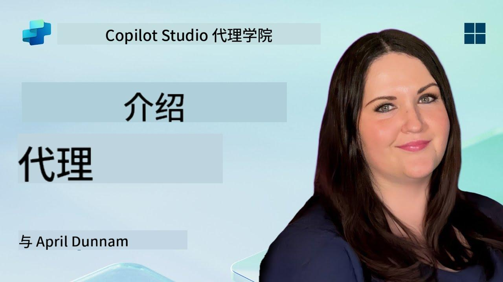

<!--
CO_OP_TRANSLATOR_METADATA:
{
  "original_hash": "d6706e107678264168d77b2e107710b1",
  "translation_date": "2025-10-18T03:03:17+00:00",
  "source_file": "docs/recruit/01-introduction-to-agents/README.md",
  "language_code": "zh"
}
-->
# 🚨 任务 01：代理简介

## 🕵️‍♂️ 代号：`AI代理解码行动`

> **⏱️ 行动时间窗口：** `~30分钟 – 仅限情报，无需实地工作`

🎥 **观看操作指南**

## 🎯 任务简报

欢迎，招募者。在我们深入构建代理之前，你需要牢牢掌握支持它们的AI概念。本次任务将为你提供对话式AI、大型语言模型（LLMs）、检索增强生成（RAG）以及你可以在Copilot Studio中创建的代理类型的基础知识。

## 🔎 目标

在本次任务中，你将学习：

1. 什么是对话式AI以及它的重要性  
1. 大型语言模型（LLMs）如何支持聊天体验  
1. 检索增强生成（RAG）的作用  
1. 对话式代理和自主代理的区别  
1. Copilot Studio中的代理如何利用这些概念  

让我们开始吧！

---

## 什么是对话式AI？

对话式AI指的是任何能够理解、处理并以自然方式响应人类语言（无论是文本还是语音）的系统。比如帮助台中的聊天机器人或你最喜欢的应用中的虚拟个人助理。在其背后，大多数现代对话式AI依赖于大型语言模型（LLMs），我们将在接下来进行介绍。

### 为什么重要

- **用户体验：** 对话式界面通常比点击菜单更直观。  
- **可扩展性：** 一个代理可以同时处理几十甚至上百个对话。  
- **效率：** 不需要构建定制的基于规则的脚本，LLM驱动的代理可以根据用户输入动态调整。  
- **可扩展性：** 通过合理的设计，代理可以访问知识库、连接API，或在业务流程中充当“数字同事”。

---

## 大型语言模型（LLMs）基础知识

大多数对话式AI系统的核心是**大型语言模型**——基于海量文本语料库训练的神经网络。它们学习语言的统计模式，从而能够生成连贯的句子、回答问题，甚至提出创意。以下是一些关键点：

1. **训练数据：** LLMs会摄取海量文本数据（网页、书籍、文章）。这种“世界知识”使它们能够在许多主题上进行响应。  
1. **分词：** 文本被分解为称为“token”的小单位（单词、子词或字符）。模型一次预测一个token。  
1. **上下文窗口：** 每个LLM对它能同时“看到”的token数量有限制。超过这个限制，之前的token会被截断。  
1. **提示：** 你通过发送提示与LLM交互。提示越好，响应越集中且相关。  
1. **零样本与微调：** 零样本指直接使用LLM（仅使用原始权重）。微调则是根据领域特定数据调整模型，使其更准确地回答你的需求。

!!! Tip "专业提示"
    一个常见的比喻是，LLM就像一个“超级智能的自动补全”。它不像人类大脑那样真正理解意义，但它非常擅长预测序列中的下一个最佳单词（或短语）。

---

## 检索增强生成（RAG）

当LLMs仅依赖静态训练数据时，它们可能会出现幻觉或信息过时的情况。RAG通过让模型在生成答案之前“查找”最新信息来解决这个问题。RAG的工作原理如下：

1. **用户查询：** 用户提出问题（例如，“Contoso最新的季度收益情况如何？”）。  
1. **检索步骤：** 系统查询知识源（文档、内部数据库、SharePoint库等）以找到相关内容。  
1. **增强：** 检索到的内容会被附加或预先添加到LLM提示中。  
1. **生成：** LLM同时处理用户问题和检索到的上下文，然后生成基于最新数据的响应。  

通过RAG，你的代理可以调用内部公司维基、插件API或搜索FAQ知识库，并返回不受限于静态模型参数的答案。

---

## 对话式代理与自主代理

在Copilot Studio的上下文中，**代理**一词可以指多种类型的AI助手。区分以下两种类型是很有帮助的：

**对话式代理：**

- 主要专注于双向对话。  
- 在对话的多个回合中保持上下文。  
- 通常通过预定义的流程或触发器进行编排（例如，“如果用户说X，则回应Y”）。  
- 适用于客户支持、FAQ、引导式交互、日程安排或简单的问答。  
  - 示例：  
    - 一个回答HR政策问题的Teams聊天机器人。  
    - 一个嵌入SharePoint页面的Power Virtual Agents机器人，引导用户填写表单。  

**自主代理：**

- 超越简单的对话；它们可以**代表用户采取行动**。  
- 使用LLM推理循环（类似“计划→行动→观察→重新计划”）完成任务。  
- 接入外部工具或API（例如，调用Power Automate流程、发送日历邀请、操作Dataverse中的数据）。  
- 无需持续的人工提示——一旦触发，它们可以自主处理多步骤流程。  
  - 示例：  
    - 一个生成旅行行程、预订航班并发送确认邮件的代理。  
    - 一个“会议总结”代理，加入Teams通话，实时转录并将执行摘要写入OneNote。  

!!! Info "关键区别"
    对话式代理等待用户输入并专注于对话。自主代理则主动规划并使用更广泛的工具访问执行一系列步骤。

---

## Copilot Studio中的代理

**Copilot Studio**将对话式和自主场景统一在一个框架下。以下是Copilot Studio如何帮助你构建代理：

1. **可视化代理设计器：** 一个低代码画布，用于定义提示、记忆和聊天及操作工作流的工具。  
1. **LLM配置：** 可从多种OpenAI模型或Microsoft企业级GPT中选择，以满足性能和成本需求。  
1. **检索连接器：** 为SharePoint、OneDrive、Azure Cognitive Search和Dataverse提供预构建集成，支持开箱即用的RAG。  
1. **自定义工具和功能：** 定义自定义HTTP操作或Power Automate流程，供你的代理自主调用。  
1. **多模态支持：** 除了文本，Copilot Studio代理还可以摄取图像、文件或结构化数据以丰富上下文。  
1. **发布与分发：** 一旦你的代理准备就绪，你可以将其发布到Microsoft 365 Copilot（用户可以在Teams、SharePoint、Outlook等中调用它），或将其嵌入到网页上的独立聊天窗口中。

---

## 🎉 任务完成

你已经完成了代理和基础AI概念的介绍。你了解了：

1. **LLMs = 代理的“大脑”**  
   - 负责语言理解和生成。  
   - 更多token = 更丰富的上下文，但每次调用的成本也更高。  

1. **RAG = 实时知识整合**  
   - 弥合静态LLM与不断变化的数据源之间的差距。  
   - 检索并将相关文档或记录注入到LLM提示中。  

1. **对话式与自主代理**  
   - **对话式：** 专注于对话流程和保持上下文（例如，“会话记忆”）。  
   - **自主：** 添加“操作模块”，使代理能够调用外部工具或服务。

---
接下来，你将探索[Copilot Studio基础知识](../02-copilot-studio-fundamentals/README.md)！

保持警觉，招募者——你的AI旅程才刚刚开始！

## 📚 战术资源

🔗 [Copilot Studio文档主页](https://learn.microsoft.com/microsoft-copilot-studio/)

---

<!-- markdownlint-disable-next-line MD033 -->

---

**免责声明**：  
本文档使用AI翻译服务[Co-op Translator](https://github.com/Azure/co-op-translator)进行翻译。尽管我们努力确保翻译的准确性，但请注意，自动翻译可能包含错误或不准确之处。应以原始语言的文档作为权威来源。对于重要信息，建议使用专业人工翻译。我们不对因使用此翻译而产生的任何误解或误读承担责任。