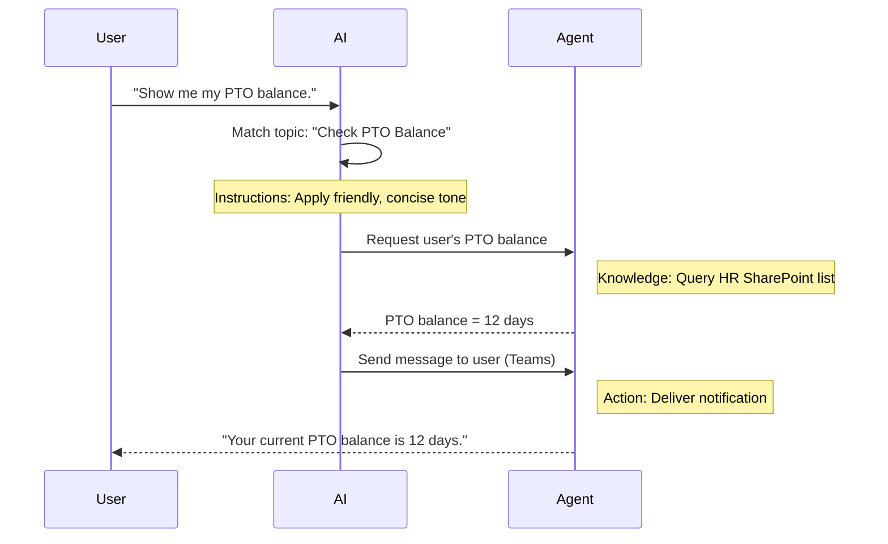

<!--
CO_OP_TRANSLATOR_METADATA:
{
  "original_hash": "90a3c5122f5687bbc8cc819990f175d4",
  "translation_date": "2025-10-18T03:04:15+00:00",
  "source_file": "docs/recruit/02-copilot-studio-fundamentals/README.md",
  "language_code": "zh"
}
-->
# 🚨 任务 02：Copilot Studio 基础知识

## 🕵️‍♂️ 代号：`核心协议行动`

> **⏱️ 行动时间窗口：** `~30分钟 – 仅限情报，无需实地操作`  

🎥 **观看操作指南**

[](https://www.youtube.com/watch?v=x4OCwDRGeLE "在 YouTube 上观看操作指南")

## 🎯 任务简报

欢迎，招募者。本次任务将为您提供基础情报，帮助您了解 Copilot Studio 的工作原理，以及如何构建能够带来实际业务价值的智能代理。

在构建您的第一个代理之前，您需要了解构成每个定制 AI 代理的四个关键组件：知识、工具、主题和指令。您还将学习这些元素如何在 Copilot Studio 的编排器中协同工作。

## 🔎 目标

在本次任务中，您将：

- **了解什么是 Copilot Studio**
- **了解何时以及为何使用代理**
- **探索代理的四个构建模块**
      - **知识**
      - **工具**
      - **主题**
      - **指令**
- **理解这些组件如何协同工作**以创建一个智能化、自动化的代理

---

## 什么是 Copilot Studio 中的代理？

**代理**是您设计的专门用于处理特定任务或查询的 AI 助手。与通用聊天机器人不同，您的代理：

- **了解公司特定数据**（政策、文档、数据库）  
- **执行实际任务**（发送消息、创建日历事件、更新记录）  
- **保持对话上下文**，能够对之前的问题进行跟进  

由于 Copilot Studio 是低代码平台，您可以拖放预构建组件——无需深厚的编码技能。一旦构建完成，用户可以在 Teams、Slack 或自定义网页中调用代理，以自动获取答案或触发工作流。

---

## 何时以及为何使用 Copilot Studio

虽然 Microsoft 365 Copilot 提供了跨 Office 应用的通用 AI 支持，但当以下情况发生时，您可能需要一个定制代理：

### 您需要领域特定的知识

- 开箱即用的 Copilot 可能不了解您公司的内部流程或数据。代理可以查询您的 SharePoint 网站、数据库或自定义数据源，以提供准确、最新的答案。  

### 您希望自动化多步骤工作流

- 例如：“当有人提交费用时，将其发送审批，更新财务跟踪器，并通知经理。”定制代理可以通过单一命令或事件触发来处理每一步。  

### 您需要上下文相关的工具内体验  

- 想象一个 Teams 中的新员工入职代理，它可以引导 HR 员工了解每项政策，发送必要的表格，并安排入职会议——直接在您现有的协作平台内完成。  

---

## 代理的四个构建模块

每个 Copilot Studio 代理由四个核心组件构成：

1. **知识**  
1. **工具（操作）**  
1. **主题**  
1. **指令**

以下我们将定义每个构建模块，并展示它们如何协同工作以创建一个有效的代理。

### 1. 知识

**知识**是代理用来准确回答问题的数据和上下文。它包括两个部分：

#### 自定义指令和上下文

- 您编写一段简短的描述，说明代理的目的和语气。例如：  

    ```text
    You are an IT support agent. You help employees troubleshoot common software issues, provide troubleshooting steps, and escalate urgent tickets.
    ```

- 在对话中，代理记住之前的对话内容，以便参考已经讨论过的内容（例如，如果用户先说“我的打印机离线了”，然后再问“你检查过墨水了吗？”，代理会记住打印机的上下文）。

#### 知识来源（基础数据）

- 您可以将代理连接到多个数据源——如 SharePoint 库、文档网站、维基或其他数据库。  
- 当用户提出问题时，代理会从这些来源中提取相关内容，以确保答案**基于**您组织的实际政策、产品手册或任何专有信息。  
- 您甚至可以强制代理仅使用这些来源的信息进行回答，防止其猜测或“虚构”答案。

!!! example
    一个“政策助手”代理可以连接到您的 HR SharePoint 网站。如果用户问“我们的带薪休假累积率是多少？”，代理会从 HR 政策文档中检索确切的文本，而不是依赖通用 AI 响应。

---

### 2. 工具（操作）

**工具（操作）**定义了代理除了聊天之外可以执行的任务。每个操作都是代理以编程方式执行的任务，例如：

- 发送电子邮件或 Teams 消息  
- 创建或更新日历事件  
- 添加或编辑数据库中的记录（例如 SharePoint 列表或 Dataverse 表）  
- 调用 Power Automate 流程或 REST API  

#### 操作如何工作

- **定义输入和输出**  
      - 例如，发送电子邮件操作可能需要：  
        - `RecipientEmailAddress`  
        - `SubjectLine`  
        - `EmailBody`  

- **将操作组合成工作流**  
      - 通常，满足用户请求涉及多个步骤。  
      - 您可以将操作按顺序排列，例如：  
             1. 代理从 SharePoint 列表中检索数据。  
             2. 使用 LLM 生成摘要。  
             3. 通过 Teams 消息发送该摘要。  

- **连接到外部系统**  
      - 如果您需要更新 CRM 或调用内部 API，可以创建自定义操作来处理。  
      - Copilot Studio 可以与 Power Platform 或任何基于 HTTP 的端点集成。

!!! example "一个“费用助手”代理可以："
    1. 监听“提交费用”请求。  
    2. 从表单中获取用户的费用详情。  
    3. 使用“添加到 SharePoint 列表”操作存储数据。  
    4. 触发“发送电子邮件”操作通知审批人。  

---

### 3. 主题

**主题**定义了代理的对话触发点或入口。每个主题对应于一个功能或问题类别。

#### 对话触发点  

- 一个主题可能是“提交 IT 工单”、“查看休假余额”或“创建销售报告”。  
- 在后台，Copilot Studio 使用**生成式编排**：与依赖精确关键词不同，AI 会根据您提供的简短描述来解释用户意图并选择正确的主题。  

#### 主题描述  

- 在每个主题中，您需要编写一个清晰简洁的描述，说明该主题涵盖的内容。

!!! example "主题描述示例"
    此主题帮助用户提交 IT 支持工单，收集问题详情、优先级和联系信息。

- AI 使用该描述来决定何时激活此主题，即使用户的措辞不完全匹配。

#### 将主题映射到操作  

- 每个主题都连接到一个或多个操作或数据检索步骤。  
- 当 AI 选择一个主题时，它会根据您定义的顺序引导对话（询问后续问题、调用操作、返回结果）。

!!! example
    如果用户说“我需要帮助设置我的新笔记本电脑”，AI 可能会将该意图匹配到“提交 IT 工单”主题。然后代理会询问笔记本型号、用户详情，并自动将工单推送到帮助台系统。

---

### 4. 指令

**指令**（有时称为“提示”或“系统消息”）指导 LLM 的语气、风格和边界。它们决定了代理在任何情况下的响应方式。

#### 角色和个性  

- 您告诉 AI 它的角色是什么（例如，“你是 Contoso 零售的客户服务代理”）。  
- 根据您的使用场景设置语气——友好、简洁、正式或随意。

#### 响应指南  

- 指定代理必须遵守的任何规则，例如：  
      - “始终以项目符号总结政策信息。”  
      - “如果你不知道答案，请说‘抱歉，我没有相关信息。’”  
      - “永远不要在上下文之外包含机密数据。”

#### 记忆和上下文规则

- 您可以指示代理记住多少轮对话内容。  
- 例如：“记住此用户请求的详细信息，最多三次后续问题。”

!!! example "在一个“福利顾问”代理中，您可能包括："
    “回答问题时始终参考最新的 HR 手册。如果被问及注册截止日期，请提供政策中的具体日期。将答案控制在150字以内。”

---

## 四个构建模块如何协同工作

当您将**知识**、**工具**、**主题**和**指令**组合在一起时，Copilot Studio 的 AI 编排器会创建一个代理，该代理能够：

1. **监听相关主题**（根据您的主题描述进行指导）。  
1. **应用指令**以设置语气、决定何时询问后续问题并执行规则。  
1. **利用知识来源**以确保答案基于您组织的数据。  
1. **调用工具（操作）**以执行任务——发送消息、更新记录或调用 API。  

在后台，编排器使用**生成式规划**方法：它决定采取哪些步骤以及以何种顺序来满足用户请求。如果某个操作失败（例如，无法发送电子邮件），代理会遵循您的异常处理指南（询问澄清问题或报告错误）。由于 LLM 能够适应对话上下文，代理可以在多轮对话中保持记忆，并在对话展开时整合新信息。

**可视化流程示例：**  
<!--
1. **用户：** “显示我的带薪休假余额。”
1. **AI（主题）：** 匹配“查看带薪休假余额”主题。  
1. **AI（指令）：** 使用友好、简洁的语气。  
1. **代理（知识）：** 查询 HR SharePoint 列表以获取用户的余额。  
1. **代理（操作）：** 检索值并发送 Teams 消息：  
   > “您当前的带薪休假余额为12天。”  
-->



---

## 🎉 任务完成

您已成功完成基础知识简报。您现在已经了解了 Copilot Studio 中任何代理的四个基本构建模块：

1. **知识** – 代理查找事实信息并保持对话记忆的地方。  
1. **工具** – 代理可以执行的任务，用于自动化操作。  
1. **主题** – 代理识别用户意图并决定运行哪个工作流的方式。  
1. **指令** – 指导每个响应的规则、语气和边界。

通过这些组件，您可以构建一个基本代理来回答问题并执行简单工作流。在下一课中，我们将通过逐步教程创建一个“服务台”代理——从连接您的第一个知识来源到定义主题并连接操作。

接下来：您将构建 [第一个用于 M365 Copilot 的声明式代理](../03-create-a-declarative-agent-for-M365Copilot/README.md)。

<!-- markdownlint-disable-next-line MD033 -->


---

**免责声明**：  
本文档使用AI翻译服务[Co-op Translator](https://github.com/Azure/co-op-translator)进行翻译。尽管我们努力确保翻译的准确性，但请注意，自动翻译可能包含错误或不准确之处。原始语言的文档应被视为权威来源。对于重要信息，建议使用专业人工翻译。我们不对因使用此翻译而产生的任何误解或误读承担责任。