<!--
CO_OP_TRANSLATOR_METADATA:
{
  "original_hash": "0c51aabca81d6256990caf4c015e6195",
  "translation_date": "2025-10-18T02:56:13+00:00",
  "source_file": "docs/recruit/04-creating-a-solution/README.md",
  "language_code": "zh"
}
-->
# 🚨 任务 04：为您的代理创建解决方案

## 🕵️‍♂️ 代号：`操作 CTRL-ALT-PACKAGE`

> **⏱️ 操作时间窗口：** `~45 分钟`

🎥 **观看操作指南**

[](https://www.youtube.com/watch?v=1iATbkgfcpU "在 YouTube 上观看操作指南")

## 🎯 任务简报

代理制造者，欢迎来到您的下一次战术行动。在本次任务中，您将学习如何组装一个解决方案——这是为您的 IT 帮助台代理部署的官方工具包，由 Microsoft Copilot Studio 构建。可以将其视为一个数字公文包，存放您的代理及其相关组件。

每个代理都需要一个结构良好的家。这就是 Power Platform 解决方案的作用——提供秩序、便携性以及生产准备。

让我们开始打包吧。

## 🔎 目标

在本次任务中，您将学习：

1. 了解 Power Platform 解决方案是什么及其在代理开发中的作用
1. 学习使用解决方案组织和部署代理的好处
1. 探索解决方案发布者及其在组件管理中的重要性
1. 了解 Power Platform 解决方案生命周期，从开发到生产
1. 为您的 IT 帮助台代理创建自己的解决方案发布者和自定义解决方案

## 🕵🏻‍♀️ 什么是解决方案？

在 Microsoft Power Platform 中，解决方案就像容器或包，包含您的应用或代理的所有部分——这些部分可能包括表单、流程和自定义逻辑。解决方案对于应用生命周期管理（ALM）至关重要，它使您能够从构思到开发、测试、部署和更新管理您的应用和代理。

在 Copilot Studio 中，您创建的每个代理都存储在一个 Power Platform 解决方案中。默认情况下，代理会创建在默认解决方案中，除非您创建一个新的自定义解决方案来存放您的代理。这就是我们将在本课和动手实验中学习的内容 🤓。

解决方案传统上是在 **Power Apps 制作门户** 中创建的——这是一个基于网页的界面，您可以在其中构建和自定义应用、Dataverse、流程、探索 AI 组件等。

   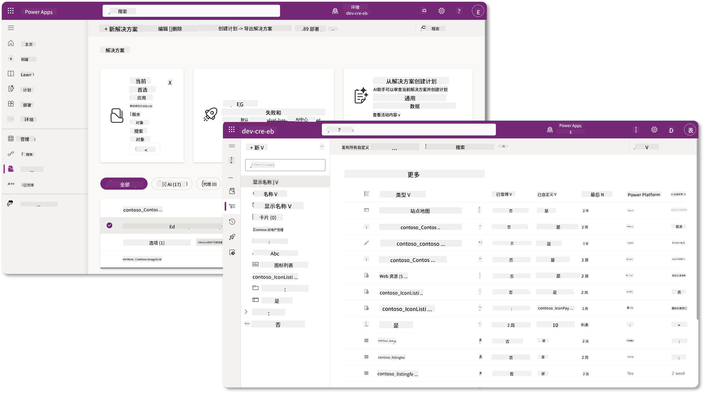

在 Copilot Studio 中，现在有了 **解决方案资源管理器**，您可以直接管理您的解决方案。您不再需要切换到 Power Apps 制作门户来管理解决方案，所有操作都可以在 Copilot Studio 中完成 🪄。

这意味着您可以执行常见的解决方案相关任务：

- **创建解决方案** - 自定义解决方案使代理可以在不同环境之间导出和导入。
- **设置首选解决方案** - 选择默认情况下创建代理、应用等的解决方案。
- **添加或移除组件** - 您的代理可能引用了其他组件，例如环境变量或云流程。因此，这些组件需要包含在解决方案中。
- **导出解决方案** - 将解决方案移动到另一个目标环境。
- **导入解决方案** - 导入其他地方创建的解决方案，包括升级或更新解决方案。
- **创建和管理解决方案管道** - 自动化解决方案在环境之间的部署。
- **Git 集成** - 使开发人员能够将解决方案连接到 Git 仓库，以进行版本控制、协作和 ALM。仅用于开发环境。

   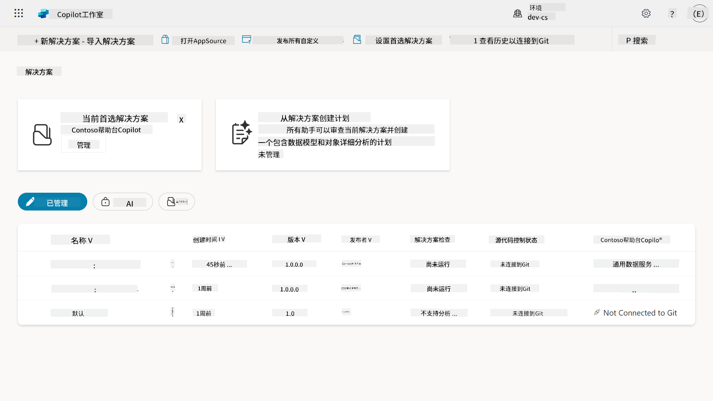

解决方案有两种类型：

- **未管理解决方案** - 用于开发阶段。您可以根据需要自由编辑和自定义。
- **已管理解决方案** - 当您准备将应用部署到测试或生产环境时使用。这些解决方案被锁定以防止意外更改。

## 🤔 为什么我应该为我的代理使用解决方案？

将解决方案视为一个工具箱。当您需要在不同位置（环境）修复或构建某些东西（代理）时，您会收集所有必要的工具（组件）并将它们放入工具箱（解决方案）。然后，您可以将这个工具箱带到新位置（环境），使用工具（组件）完成工作，或者添加新工具（组件）以自定义您的代理或项目。

!!! quote "Elaiza，您的友好云倡导者在此分享一些话："
    我们在新西兰有一句话，“做一个整洁的 Kiwi！” 这是号召新西兰人 🥝 通过正确处理垃圾并保持公共空间清洁来对环境负责的行动呼吁。我们可以将同样的理念应用到代理上，通过保持与代理相关的所有内容的组织和便携性，帮助您维护一个整洁的环境。

在源（开发）环境中创建一个专用解决方案来存放代理是一个良好的实践。以下是解决方案的价值所在：

🧩 **有序开发**

- 您将代理与默认解决方案分开，默认解决方案包含环境中的所有内容。所有代理组件都集中在一个地方 🎯。

- 您需要的所有代理内容都在解决方案中，使其更容易导出和导入到目标环境 👉🏻 这是 ALM 的健康习惯。

🧩 **安全部署**

- 您可以将应用或代理导出为已管理解决方案，并将其部署到其他目标环境（例如测试或生产），而无需担心意外编辑。

🧩 **版本控制**

- 您可以创建补丁（目标修复）、更新（更全面的更改）或升级（替换解决方案——通常是重大更改并引入新功能）。

- 帮助您以受控方式推出更改。

🧩 **依赖管理**

- 解决方案会跟踪哪些部分相互依赖。这可以防止您在进行更改时破坏其他部分。

🧩 **团队协作**

- 开发人员和制作人员可以在开发阶段使用未管理解决方案协作，然后交付已管理解决方案进行部署。

## 🪪 了解解决方案发布者

Power Platform 中的解决方案发布者就像一个标签或品牌，用于标识谁创建或拥有解决方案。它是管理您的应用、代理和流程自定义的重要组成部分，尤其是在团队或跨环境工作时。

当您创建解决方案时，必须选择一个发布者。发布者定义了：

- 一个前缀，该前缀会添加到所有自定义组件（例如表、字段和流程）中。

- 一个名称和联系信息，用于标识拥有解决方案的组织或个人。

### 🤔 为什么重要？

1. **便于识别** - 前缀（例如 `new_` 或 `abc_`）帮助您快速识别哪些组件属于哪个解决方案或团队。

1. **避免冲突** - 如果两个团队创建了一个名为 status 的列，它们的前缀（`teamA_status`，`teamB_status`）可以防止命名冲突。

1. **支持 ALM** - 在解决方案在环境之间移动（开发 → 测试 → 生产）时，发布者有助于跟踪所有权并保持一致性。

### ✨ 示例

假设您创建了一个名为 Contoso Solutions 的发布者，前缀为 `cts_`。

如果您添加了一个名为 _Priority_ 的自定义列，它将在解决方案中存储为 `cts_Priority`。

无论在哪个环境中，任何人看到该列时都可以轻松识别它与 Contoso Solutions 相关联。

## 🧭 Power Platform 解决方案生命周期

现在您了解了解决方案的用途，接下来我们学习生命周期。

**1. 在开发环境中创建解决方案** - 从开发环境中创建一个新解决方案开始。

**2. 添加组件** - 向解决方案中添加应用、流程、表和其他元素。

**3. 导出为已管理解决方案** - 通过导出为已管理解决方案来打包解决方案以进行部署。

**4. 导入到测试环境** - 在单独的测试环境中测试解决方案，确保一切正常。

**5. 导入到生产环境** - 将测试过的解决方案部署到您的实时生产环境。

**6. 应用补丁、更新或升级** - 使用补丁、更新或升级进行改进或修复。🔁 重复周期！

### ✨ 示例

假设您正在构建一个 IT 帮助台代理，帮助员工解决设备问题、网络故障排除、打印机设置等问题。

- 您从开发环境中的未管理解决方案开始。

- 准备好后，您将其导出为已管理解决方案，并导入到目标环境，例如系统测试或用户验收测试（UAT）环境。

- 测试完成后，您将其移动到生产环境——无需触碰原始开发版本。

## 🧪 实验 04：创建新解决方案

我们现在将学习：

- [4.1 如何创建解决方案发布者](../../../../../docs/recruit/04-creating-a-solution)
- [4.2 如何创建解决方案](../../../../../docs/recruit/04-creating-a-solution)

我们将继续之前的示例，在专用的 Copilot Studio 环境中创建一个解决方案，用于构建我们的 IT 帮助台代理。

让我们开始吧！

### 前提条件

#### 安全角色

在 Copilot Studio 中，您在解决方案资源管理器中可以执行的操作取决于您的用户安全角色。
如果您没有权限在 Power Apps 管理中心管理解决方案，那么您也无法在 Copilot Studio 中执行这些任务。

为了确保一切顺利，请检查您是否拥有正确的安全角色和权限。如果您不管理组织中的环境，请询问您的 IT 管理员（或同等团队）谁负责管理您的租户/环境。

以下是允许用户在其环境中创建解决方案的安全角色。

| 安全角色    | 描述 |
| ---------- | ---------- |
| 环境创建者 | 提供必要权限以在特定环境中创建、定制和管理资源，包括解决方案  |
| 系统定制者  | 比环境创建者权限更广，包括定制环境和管理安全角色 |
| 系统管理员   | 最高权限级别，可以管理环境的所有方面，包括创建和分配安全角色     |

#### 开发环境

确保您切换到专用的开发环境，参考 [课程 00 - 课程设置 - 步骤 3：创建新开发环境](../00-course-setup/README.md#step-3-create-new-developer-environment)。

1. 在右上角，选择 **齿轮图标**，从默认环境切换到您的环境，例如 **Adele Vance 的环境**。

    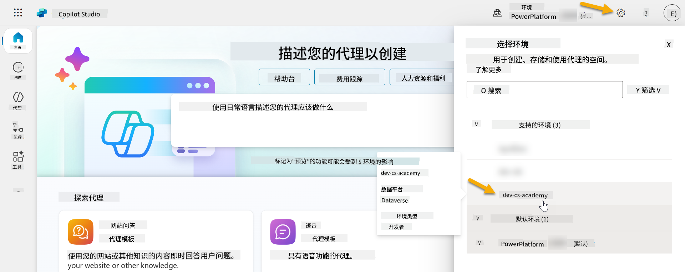

### 4.1 创建解决方案发布者

1. 使用上一课中使用的同一 Copilot Studio 环境，选择 Copilot Studio 左侧菜单中的 **省略号图标 (. . .)**。在 **探索** 标题下选择 **解决方案**。

    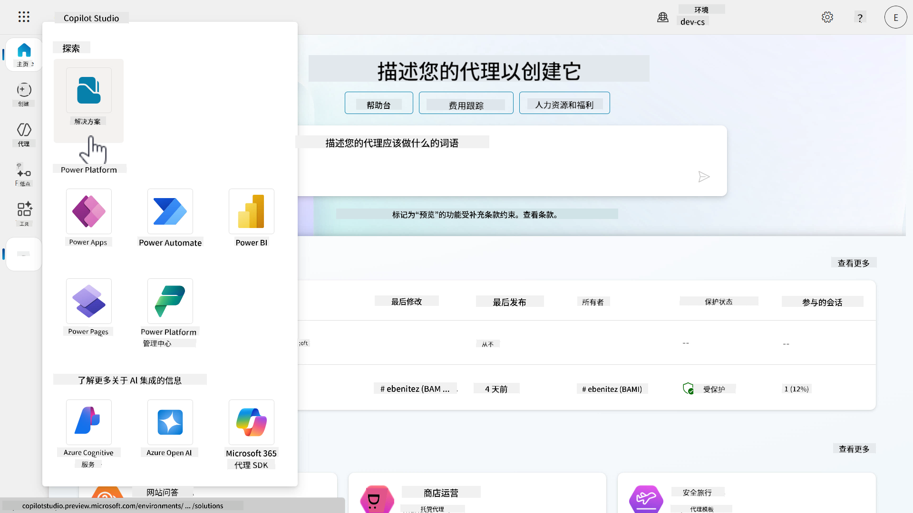

1. Copilot Studio 中的 **解决方案资源管理器** 将加载。选择 **+ 新解决方案**。

    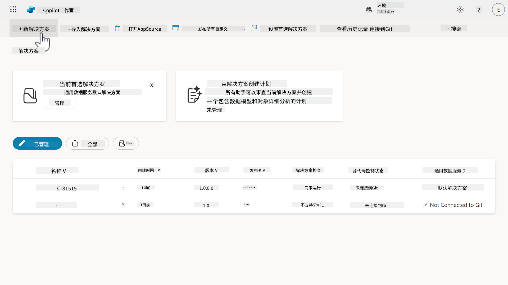

1. **新解决方案** 面板将出现，我们可以在其中定义解决方案的详细信息。首先，我们需要创建一个新的发布者。选择 **+ 新发布者**。

    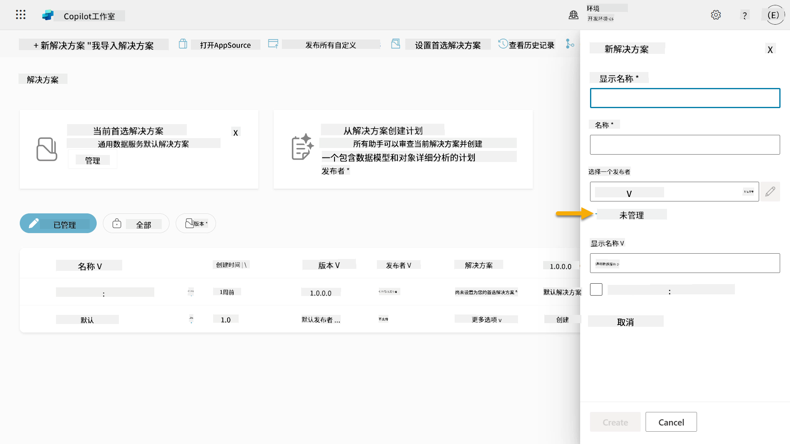  

1. **新发布者** 面板的 **属性** 选项卡将出现，其中包含需要填写的必填和非必填字段。在 **属性** 选项卡中，我们可以概述发布者的详细信息，该发布者将用作标识谁创建或拥有解决方案的标签或品牌。

    | 属性    | 描述 | 必填 |
    | ---------- | ---------- | :----------: |
    | 显示名称 | 发布者的显示名称 | 是   |
    | 名称  | 发布者的唯一名称和架构名称  | 是    |
    | 描述   | 概述解决方案的用途    | 否     |
    | 前缀    | 发布者前缀，将应用于新创建的组件   | 是      |
    | 选项值前缀   | 根据发布者前缀生成一个数字。此数字用于添加选项到选项集，并提供一个指示器，显示使用哪个解决方案添加了选项。   | 是      |

    将以下内容复制并粘贴为 **显示名称**，

    ```text
    Contoso Solutions
    ```

    将以下内容复制并粘贴为 **名称**，

    ```text
    ContosoSolutions
    ```

    将以下内容复制并粘贴为 **描述**，

    ```text
    Copilot Studio Agent Academy
    ```

    将以下内容复制并粘贴为 **前缀**，

    ```text
    cts
    ```

    默认情况下，**选项值前缀** 将显示一个整数值。将此整数值更新为最接近的千位数。例如，在我的截图中，最初是 `77074`。将其从 `77074` 更新为 `77000`。

    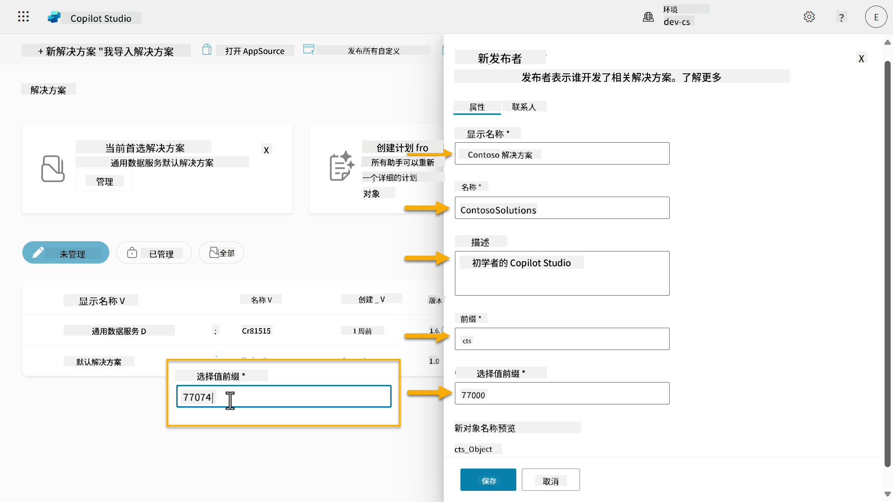  

1. 如果您希望为解决方案提供联系信息，请选择 **联系** 选项卡并填写显示的列。

    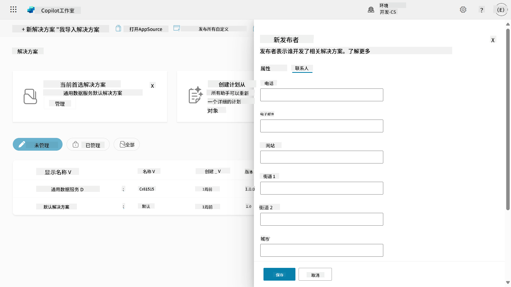

1. 选择 **属性** 选项卡并点击 **保存** 以创建发布者。

    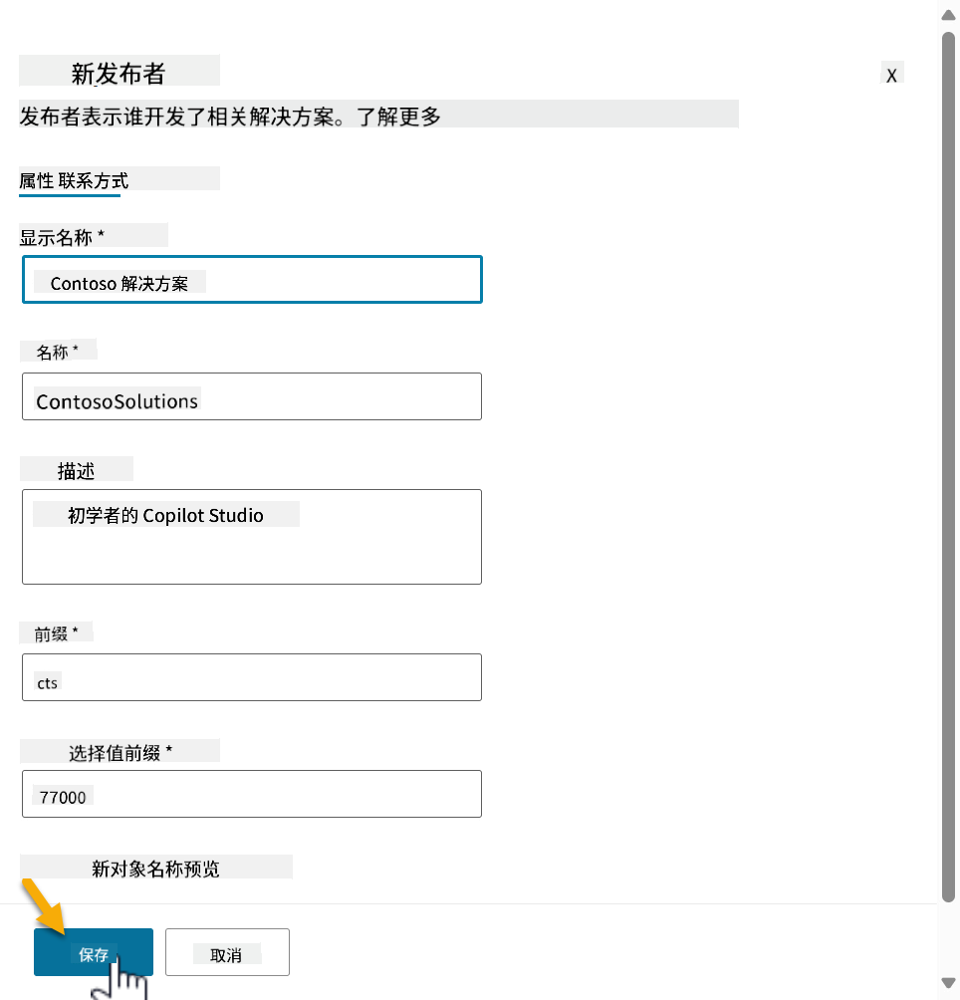
1. 新建发布者窗格将关闭，您将返回到 **新解决方案** 窗格，并且新创建的发布者已被选中。

    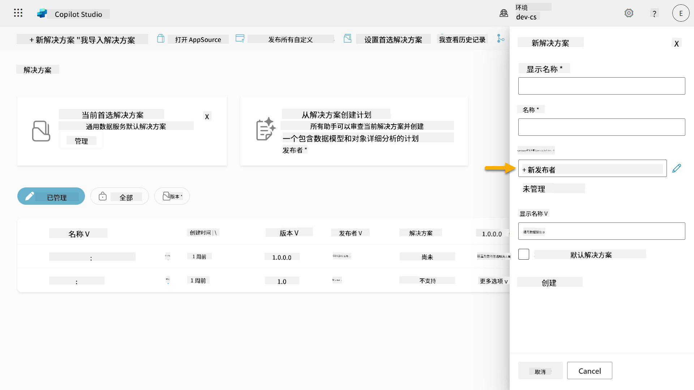  

太棒了，您现在已经创建了一个解决方案发布者！🙌🏻 接下来我们将学习如何创建一个新的自定义解决方案。

### 4.2 创建新解决方案

1. 现在我们已经创建了发布者，可以完成 **新解决方案** 窗格中的其余表单。

    将以下内容复制并粘贴为 **显示名称**，

    ```text
    Contoso Helpdesk Agent
    ```

    将以下内容复制并粘贴为 **名称**，

    ```text
    ContosoHelpdeskAgent
    ```

    由于我们正在创建一个新解决方案，[**版本**号](https://learn.microsoft.com/power-apps/maker/data-platform/update-solutions#understanding-version-numbers-for-updates/?WT.mc_id=power-172615-ebenitez) 默认将为 `1.0.0.0`。

    勾选 **设置为您的首选解决方案** 复选框。

    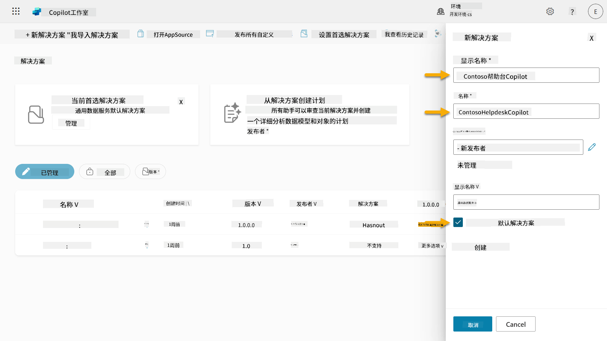  

1. 展开 **更多选项** 以查看解决方案中可以提供的其他详细信息。

    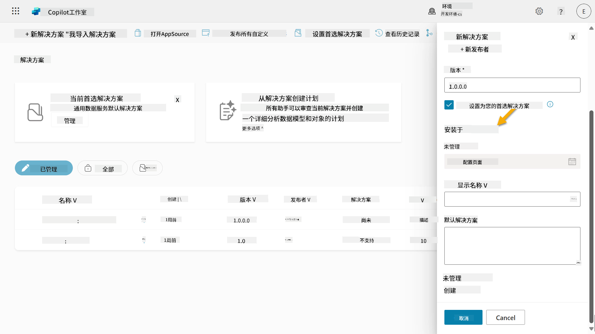

1. 您将看到以下内容：

    - **安装日期** - 解决方案安装的日期。

    - **配置页面** - 开发人员设置一个 HTML 网页资源，帮助用户与其应用、代理或工具交互，该页面将作为信息部分中的网页出现，包含说明或按钮。通常由构建并与他人共享解决方案的公司或开发人员使用。

    - **描述** - 描述解决方案或配置页面的高级概述。

    在本实验中，我们将这些字段留空。

    选择 **创建**。

    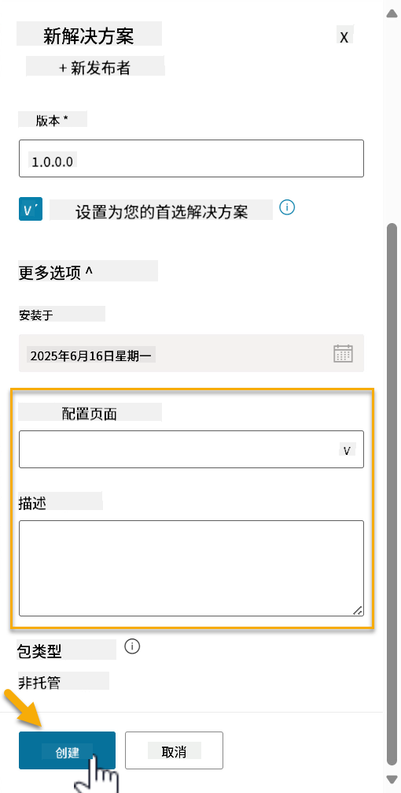

1. Contoso Helpdesk Agent 的解决方案现已创建。在我们在 Copilot Studio 中创建代理之前，组件数量为零。

    选择 **返回箭头** 图标返回到解决方案资源管理器。

    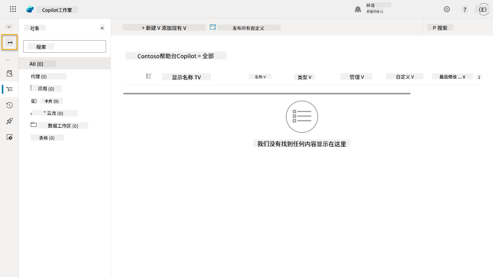

1. 请注意，由于我们之前勾选了 **设置为您的首选解决方案** 复选框，Contoso Helpdesk Agent 现在显示为 **当前首选解决方案**。

    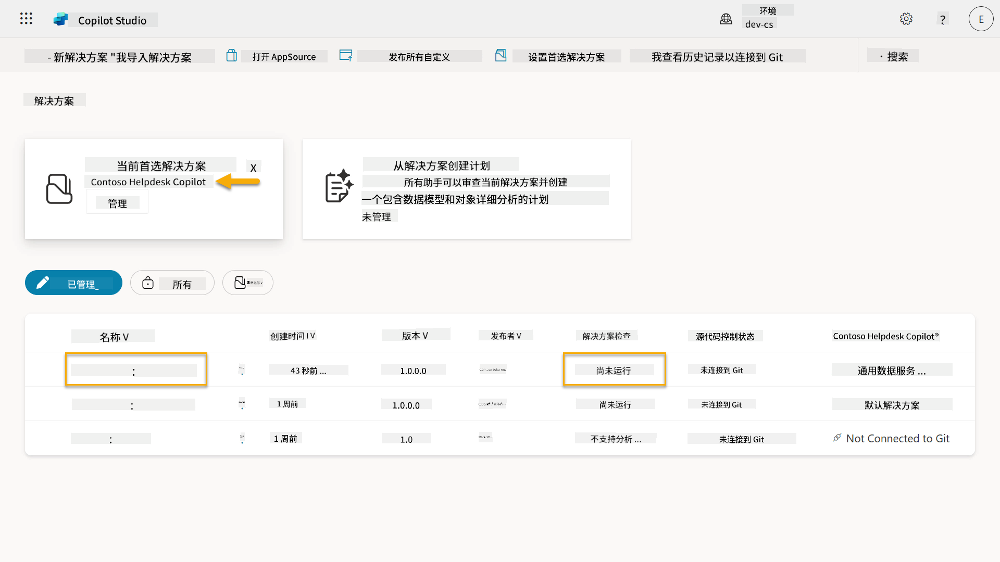

## ✅ 任务完成

恭喜！👏🏻 您已经创建了一个发布者，并在新创建的解决方案中使用它来构建您的代理！

干得好，代理创建者。整洁的数字足迹是实现规模化操作的第一步。现在，您已经掌握了可持续、企业级代理开发的工具和思维方式。

这就是 **实验室 04 - 创建解决方案** 的结束，点击下面的链接进入下一课。您在本实验中创建的解决方案将在下一课的实验中使用。

⏭️ [进入 **快速开始使用预构建代理** 课程](../05-using-prebuilt-agents/README.md)

## 📚 战术资源

🔗 [创建解决方案](https://learn.microsoft.com/power-apps/maker/data-platform/create-solution/?WT.mc_id=power-172615-ebenitez)

🔗 [在 Copilot Studio 中创建和管理解决方案](https://learn.microsoft.com/microsoft-copilot-studio/authoring-solutions-overview/?WT.mc_id=power-172615-ebenitez)

🔗 [与其他用户共享代理](https://learn.microsoft.com/microsoft-copilot-studio/admin-share-bots/?WT.mc_id=power-172615-ebenitez)

🔗 [预定义安全角色可用资源摘要](https://learn.microsoft.com/power-platform/admin/database-security#summary-of-resources-available-to-predefined-security-roles/?WT.mc_id=power-172615-ebenitez)

🔗 [升级或更新解决方案](https://learn.microsoft.com/power-apps/maker/data-platform/update-solutions/?WT.mc_id=power-172615-ebenitez)

🔗 [Power Platform 中管道概述](https://learn.microsoft.com/power-platform/alm/pipelines/?WT.mc_id=power-172615-ebenitez)

🔗 [Power Platform 中 Git 集成概述](https://learn.microsoft.com/power-platform/alm/git-integration/overview/?WT.mc_id=power-172615-ebenitez)


---

**免责声明**：  
本文档使用AI翻译服务[Co-op Translator](https://github.com/Azure/co-op-translator)进行翻译。尽管我们努力确保翻译的准确性，但请注意，自动翻译可能包含错误或不准确之处。原始语言的文档应被视为权威来源。对于重要信息，建议使用专业人工翻译。我们对因使用此翻译而产生的任何误解或误读不承担责任。