<!--
CO_OP_TRANSLATOR_METADATA:
{
  "original_hash": "8e2c64a7f9303e58329ec8bb468c80b4",
  "translation_date": "2025-10-18T02:43:15+00:00",
  "source_file": "docs/recruit/05-using-prebuilt-agents/README.md",
  "language_code": "zh"
}
-->
# 🧰 任务 05：使用预构建代理  

## 🕵️‍♂️ 代号：`安全出行行动`

> **⏱️ 行动时间窗口：** `~30分钟`

🎥 **观看操作演示**

## 🎯 任务简报

欢迎来到Copilot Studio代理学院的下一项任务。您将探索**预构建代理**的世界——这些是由Microsoft创建的智能、目标驱动的代理，旨在加速您的部署并缩短实现价值的时间。

与从头开始构建不同，预构建代理（也称为**代理模板**）为您提供了一个起点，包含可定制和快速部署的现成场景。

在本次任务中，您将部署**安全出行**代理——一个帮助用户准备商务旅行、了解公司政策并简化规划的代理。

---

## 🧭 目标

本次任务的目标是：

1. 了解什么是预构建代理以及它们的重要性  
1. 部署**安全出行**代理模板  
1. 定制代理的响应和内容  
1. 测试并发布代理  

---

## 🧠 什么是预构建代理？

预构建代理是由Microsoft创建的即用型AI代理，它们：

- 满足常见的业务需求（如旅行、人力资源、IT支持）
- 包含完整的主题、触发短语、说明和示例知识
- 可以根据您的数据进行编辑、扩展和定制

这些代理非常适合快速入门或学习代理的结构。

---

## 🧪 实验 05：快速开始使用预构建代理

现在我们将学习如何选择预构建代理并进行定制。

- [5.1 启动Copilot Studio](../../../../../docs/recruit/05-using-prebuilt-agents)
- [5.2 选择安全出行代理模板](../../../../../docs/recruit/05-using-prebuilt-agents)
- [5.3 定制代理](../../../../../docs/recruit/05-using-prebuilt-agents)
- [5.4 测试并发布](../../../../../docs/recruit/05-using-prebuilt-agents)

我们将继续之前的示例，在专用的Copilot Studio环境中创建一个解决方案来构建我们的IT帮助台代理。

让我们开始吧！

### 5.1 启动Copilot Studio

1. 访问 [https://copilotstudio.microsoft.com](https://copilotstudio.microsoft.com)

1. 使用您的Microsoft 365工作或学校账户登录

!!! warning
    您必须在启用了Copilot Studio的租户中。如果您没有看到Copilot Studio，请返回[任务00](../00-course-setup/README.md)完成设置。

### 5.2 选择安全出行代理模板

1. 在Copilot Studio主页中，点击 **+ 创建**
    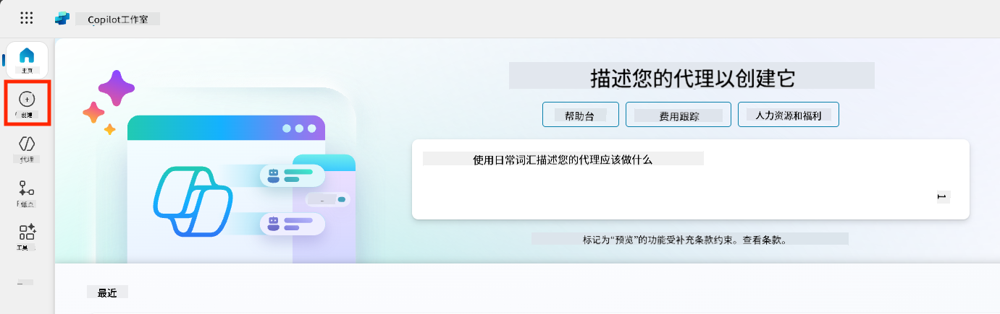

1. 向下滚动到**从代理模板开始**部分

1. 找到并选择**安全出行**

    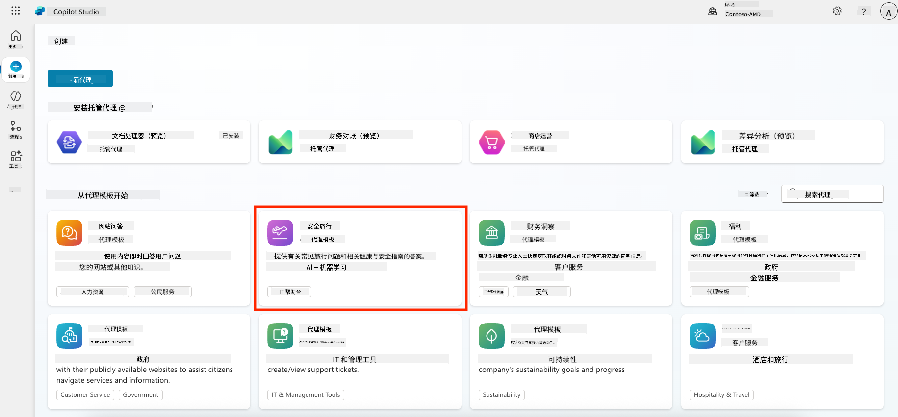

1. 注意模板已预加载了描述、说明和知识。

    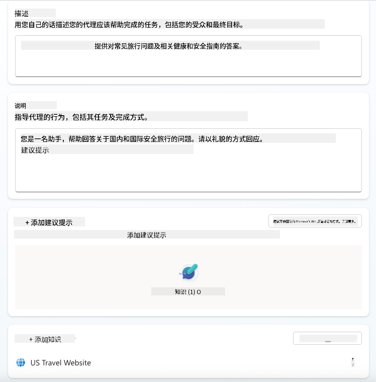

1. 点击 **创建**

    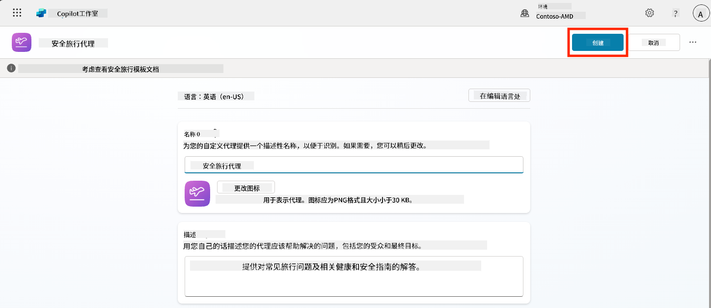

这将根据安全出行配置在您的环境中创建一个新的代理。

### 5.3 定制代理

现在代理已经创建，让我们根据您的组织需求进行定制：

1. 选择**启用生成式AI**以开启生成式AI功能，使其能够使用模板中提供的说明。

    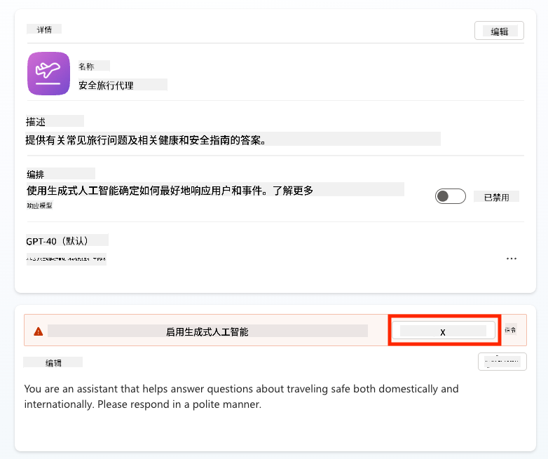

1. 现在我们将为代理添加一个额外的知识来源，使其能够回答关于欧洲旅行的问题。为此，向下滚动到**知识**部分并选择**添加知识**

    

1. 选择**公共网站**

    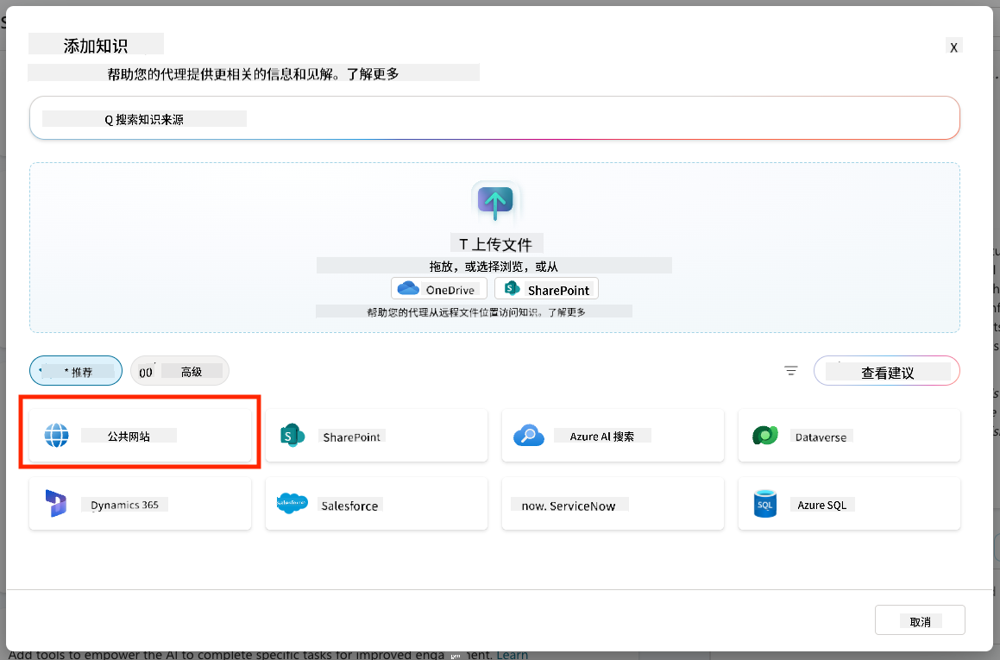

1. 在文本输入框中粘贴 **<https://european-union.europa.eu/>** 并选择 **添加**

    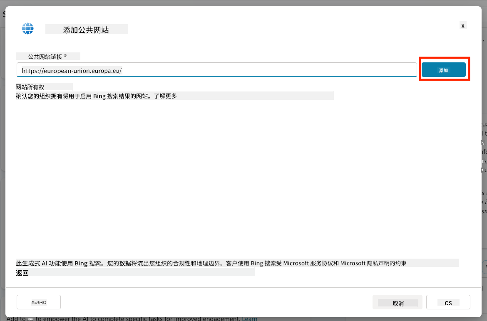

1. 选择 **添加到代理**

    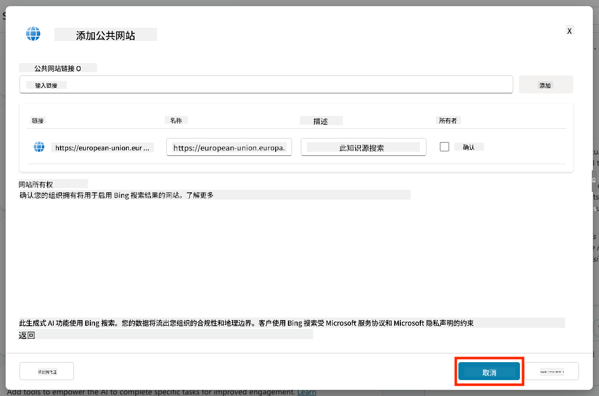

### 5.4 测试并发布

1. 点击右上角的**测试**以启动测试窗口  

1. 尝试以下短语：

    - `“我需要签证才能从美国去阿姆斯特丹吗？”`
    - `“办理美国护照需要多长时间？”`
    - `“西班牙瓦伦西亚最近的美国大使馆在哪里？”`

1. 确认代理能够提供准确且有用的信息，并观察活动地图以查看信息的来源。

    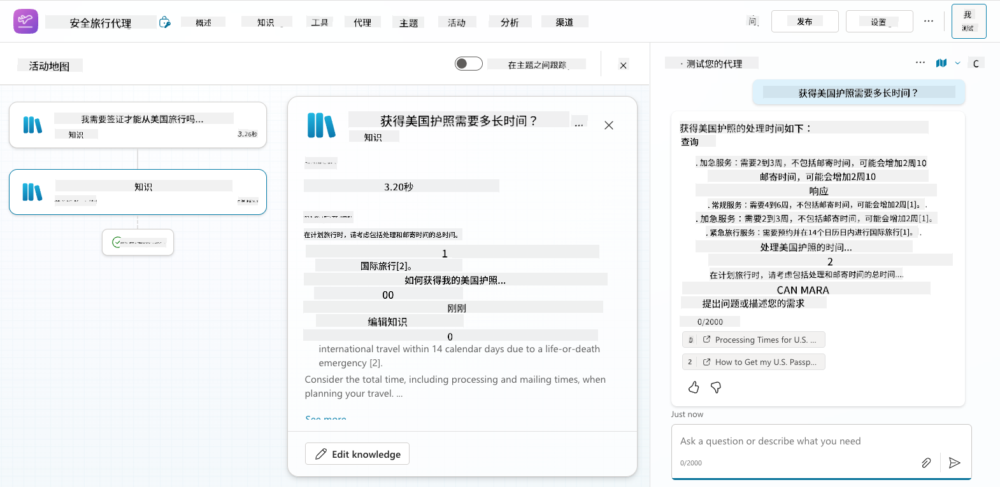

1. 准备好后，点击**发布**

    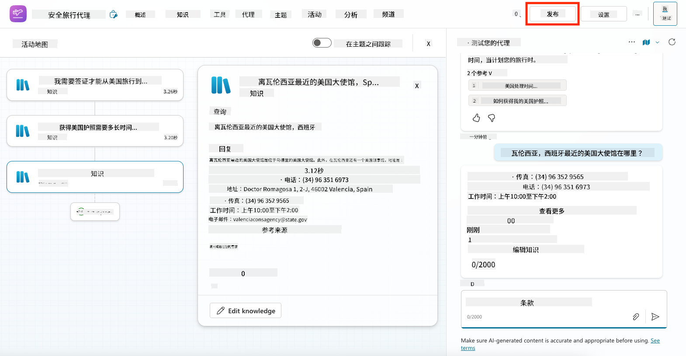

1. 在对话框中再次选择**发布**
    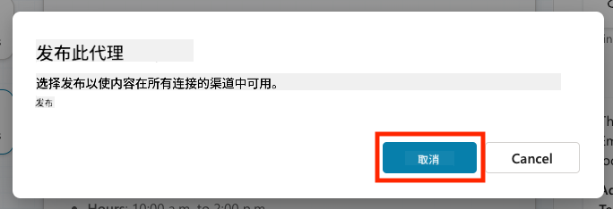

1. 可选：使用内置的**频道**功能将代理添加到Microsoft Teams中。

!!! note "🧳 额外目标"
    尝试将安全出行代理与SharePoint站点或FAQ文件结合，使其更符合您公司的旅行政策。

## ✅ 任务完成

您现在已经成功：

- 部署了一个Microsoft预构建代理  
- 定制了代理
- 测试并发布了您自己的**安全出行**代理模板版本

⏭️ [进入**从零开始创建自定义代理**课程](../06-create-agent-from-conversation/README.md)。

<!-- markdownlint-disable-next-line MD033 -->

---

**免责声明**：  
本文档使用AI翻译服务[Co-op Translator](https://github.com/Azure/co-op-translator)进行翻译。尽管我们努力确保翻译的准确性，但请注意，自动翻译可能包含错误或不准确之处。原始语言的文档应被视为权威来源。对于重要信息，建议使用专业人工翻译。我们不对因使用此翻译而产生的任何误解或误读承担责任。