<!--
CO_OP_TRANSLATOR_METADATA:
{
  "original_hash": "cd99a76bcb7372ac2771b6ae178b023d",
  "translation_date": "2025-10-18T03:05:33+00:00",
  "source_file": "docs/recruit/10-add-event-triggers/README.md",
  "language_code": "zh"
}
-->
# 🚨 任务10：添加事件触发器 - 启用自主代理功能

## 🕵️‍♂️ 代号：`幽灵行动`

> **⏱️ 行动时间窗口：** `~45分钟`

🎥 **观看操作演示**

[](https://www.youtube.com/watch?v=ZgwHL8PQ1nY "在YouTube上观看操作演示")

## 🎯 任务简报

是时候将你的代理从对话助手提升为自主操作员了。你的任务是让你的代理能够在无需召唤的情况下行动——以精准和快速的方式响应数字领域中的信号。

通过事件触发器，你将训练你的代理监控外部系统，如SharePoint、Teams和Outlook，并在接收到信号的瞬间执行智能操作。这次行动将你的代理转变为一个完全自主的现场资产——沉默、迅速、时刻关注。

成功意味着构建能够主动创造价值的代理，而不仅仅是被动响应。

## 🔎 目标

📖 本课程将涵盖：

- 了解事件触发器及其如何启用自主代理行为
- 学习事件触发器与主题触发器的区别，包括触发器工作流和负载
- 探索常见的事件触发器场景
- 了解事件驱动代理的认证、安全性和发布注意事项
- 构建一个自主的IT帮助台代理，响应SharePoint事件并发送邮件确认

## 🤔 什么是事件触发器？

**事件触发器**是一种机制，允许你的代理在无需直接用户输入的情况下响应外部事件。可以将其视为让你的代理“监视”特定事件，并在事件发生时自动采取行动。

与需要用户输入以激活对话的主题触发器不同，事件触发器是基于连接系统中发生的事情来激活的。例如：

- 当在SharePoint或OneDrive for Business中创建新文件时
- 当在Dataverse中创建记录时
- 当在Planner中完成任务时
- 当提交新的Microsoft Form响应时
- 当添加新的Microsoft Teams消息时
- 基于定期计划（如每日提醒）  
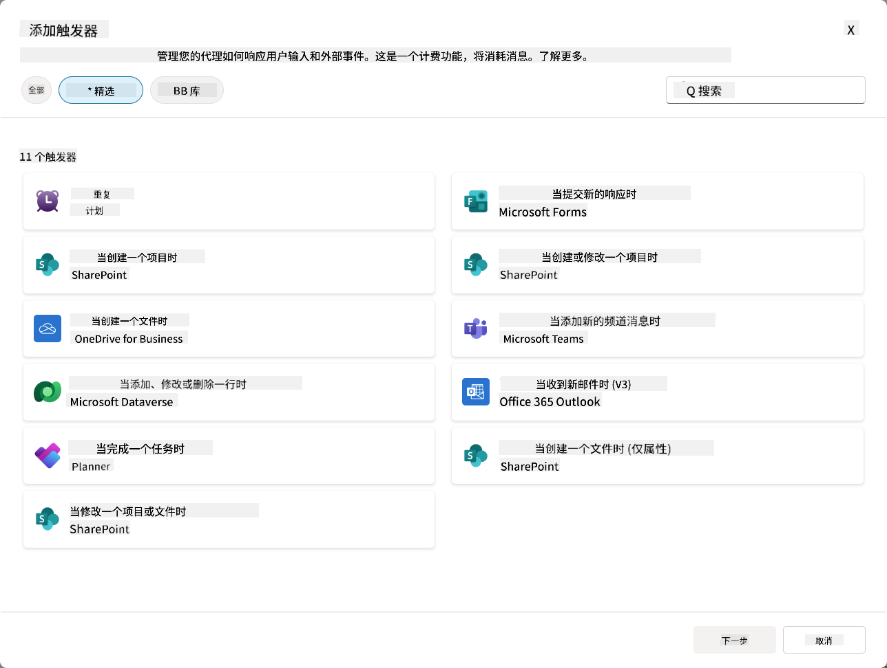

### 为什么事件触发器对自主代理很重要

事件触发器将你的代理从一个被动的助手转变为一个主动的、自主的助手：

1. **自主操作** - 你的代理可以在没有人工干预的情况下全天候工作，实时响应事件。
    - *示例：* 当新团队成员被添加到团队时，自动欢迎他们。

1. **实时响应** - 你的代理无需等待用户提问，而是立即对相关事件做出响应。
    - *示例：* 当SharePoint文档被修改时，向IT团队发出警报。

1. **工作流自动化** - 基于单个触发事件串联多个操作。
    - *示例：* 当创建新的支持工单时，创建任务、通知经理并更新跟踪仪表板。

1. **流程一致性** - 通过自动响应关键事件，确保重要步骤不会被遗漏。
    - *示例：* 每位新员工自动获得入职材料和访问权限。

1. **数据驱动的操作** - 使用触发事件中的信息做出智能决策并采取适当行动。
    - *示例：* 根据触发负载中的优先级，将紧急工单分配给高级员工。

## ⚙️ 事件触发器如何工作？

事件触发器通过三步工作流操作，使你的代理能够自主响应外部事件：

### 触发器工作流

1. **事件检测** - 在连接的系统（如SharePoint、Teams、Outlook等）中发生特定事件
1. **触发器激活** - 事件触发器检测到此事件，并通过Power Automate云流向你的代理发送负载。
1. **代理响应** - 你的代理接收到负载并执行你定义的指令

### 事件触发器与主题触发器的区别

理解这两种触发器类型的区别至关重要：

| **事件触发器** | **主题触发器** |
|-------------------|-------------------|
| 由外部系统事件激活 | 由用户输入/短语激活 |
| 启用自主代理行为 | 启用对话响应 |
| 使用创建者的认证 | 可选择用户认证 |
| 无需用户交互即可运行 | 需要用户启动对话 |
| 示例：文件创建、收到邮件 | 示例：“天气怎么样？” |

## 📦 了解触发器负载

当事件发生时，触发器会向你的代理发送一个包含事件信息和响应指令的**负载**。

### 默认负载与自定义负载

每种触发器类型都有一个默认负载结构，但你可以对其进行自定义：

**默认负载** - 使用标准格式，如`使用{Body}中的内容`

- 包含基本事件信息
- 使用通用处理指令
- 适用于简单场景

**自定义负载** - 添加具体指令和数据格式

- 包括详细的代理指令
- 明确指定要使用的数据及其处理方式
- 更适合复杂工作流

### 代理指令与自定义负载指令

你可以通过两种方式为事件触发器指导代理的行为：

**代理指令**（全局）

- 适用于所有触发器的广泛指导
- 示例：“在处理工单时，始终先检查是否有重复项”
- 最适合一般行为模式

**负载指令**（特定触发器）

- 针对单个触发器类型的具体指令  
- 示例：“对于此SharePoint更新，将摘要发送到项目频道”
- 最适合具有多个触发器的复杂代理

💡 **专业提示**：避免在这两个层级之间出现冲突的指令，否则可能导致意外行为。

## 🎯 常见事件触发器场景

以下是事件触发器如何增强代理功能的一些实际示例：

### IT帮助台代理

- **触发器**：新的SharePoint列表项（支持工单）
- **操作**：自动分类、分配优先级，并通知相关团队成员

### 员工入职代理

- **触发器**：Dataverse中添加新用户
- **操作**：发送欢迎消息，创建入职任务，并分配访问权限

### 项目管理代理

- **触发器**：Planner中完成任务
- **操作**：更新项目仪表板，通知相关人员，并检查是否有阻碍

### 文档管理代理

- **触发器**：上传文件到特定的SharePoint文件夹
- **操作**：提取元数据，应用标签，并通知文档所有者

### 会议助手代理

- **触发器**：创建日历事件
- **操作**：发送会议前提醒和议程，预订资源

## ⚠️ 发布和认证注意事项

在你的代理可以在生产环境中使用事件触发器之前，你需要了解认证和安全性方面的影响。

### 创建者认证

事件触发器使用**代理创建者的凭据**进行所有认证：

- 你的代理使用你的权限访问系统
- 用户可能通过你的凭据访问数据
- 所有操作均以“你的身份”执行，即使用户与代理交互

### 数据保护最佳实践

为了在发布带有事件触发器的代理时维护安全性：

1. **评估数据访问** - 审查触发器可以访问的系统和数据
1. **彻底测试** - 了解触发器在负载中包含哪些信息
1. **缩小触发器范围** - 使用特定参数限制触发器激活的事件
1. **审查负载数据** - 确保触发器不会暴露敏感信息
1. **监控使用情况** - 跟踪触发器活动和资源消耗

## ⚠️ 故障排除和限制

在使用事件触发器时，请注意以下重要事项：

### 配额和计费影响

- 每次触发器激活都会计入消息消耗
- 频繁触发（如每分钟触发）可能会迅速消耗配额
- 监控使用情况以避免限流

### 技术要求

- 仅适用于启用了生成式编排的代理
- 需要在环境中启用解决方案感知的云流共享

### 数据丢失防护（DLP）

- 组织的DLP策略决定了哪些触发器可用
- 管理员可以完全阻止事件触发器
- 如果预期触发器不可用，请联系管理员

## 🧪 实验10 - 添加事件触发器以实现自主代理行为

### 🎯 使用场景

你将增强你的IT帮助台代理以自动响应新的支持请求。当有人在你的SharePoint支持工单列表中创建新项时，你的代理将：

1. 在创建SharePoint工单时自动触发
1. 提供工单详细信息和你希望其执行的步骤指令
1. 通过AI生成的电子邮件自动向提交者确认工单

此实验演示了事件触发器如何实现真正的自主代理行为。

### 前提条件

在开始此实验之前，请确保你已完成以下内容：

- ✅ 完成之前的实验（特别是IT帮助台代理的实验6-8）
- ✅ 访问包含IT支持工单列表的SharePoint站点
- ✅ 启用了事件触发器的Copilot Studio环境
- ✅ 你的代理已启用生成式编排
- ✅ 在SharePoint和Copilot Studio环境中拥有适当权限

### 10.1 启用生成式AI并创建SharePoint项创建触发器

1. 在**Copilot Studio**中打开你的**IT帮助台代理**

1. 首先，确保你的代理已启用**生成式AI**：
   - 导航到**概览**选项卡
   - 在编排部分，将**生成式编排**切换为**开启**（如果尚未开启）  
     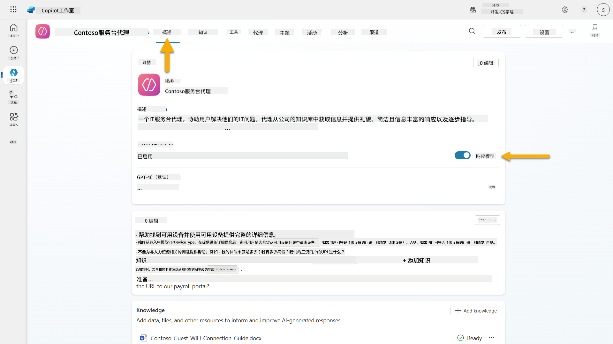

1. 导航到**概览**选项卡并找到**触发器**部分

1. 点击**+ 添加触发器**以打开触发器库  
    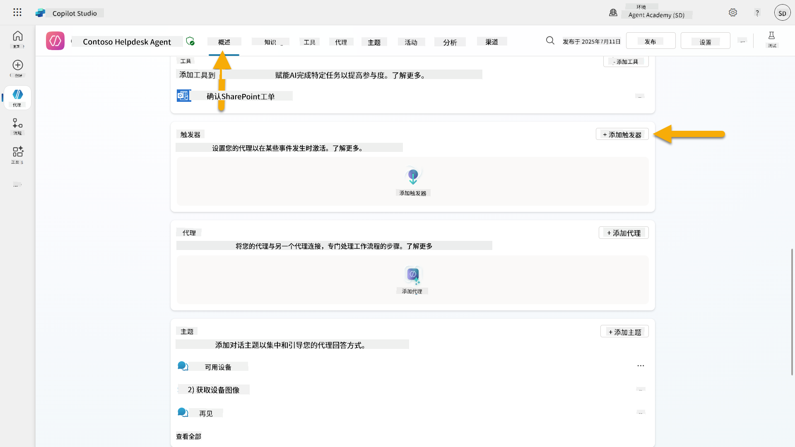

1. 搜索并选择**创建项时**（SharePoint）  
    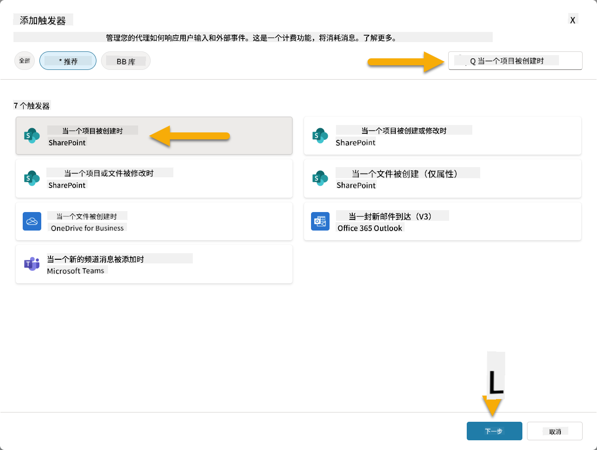

1. 配置触发器名称和连接：

   - **触发器名称：** 在SharePoint中创建新的支持工单

1. 等待连接配置完成，然后选择**下一步**继续。  
   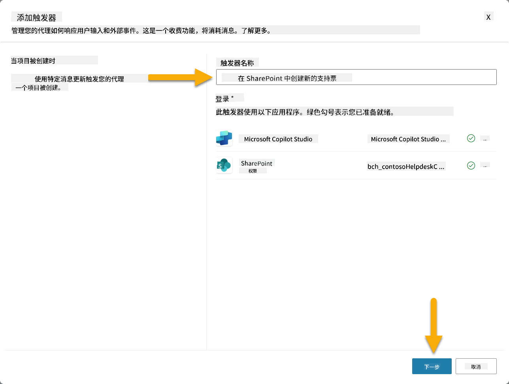

1. 配置触发器参数：

   - **站点地址**：选择你的“Contoso IT” SharePoint站点

   - **列表名称**：选择你的“工单”列表

   - **触发器调用时向代理提供的额外指令：**

     ```text
     New Support Ticket Created in SharePoint: {Body}
     
     Use the 'Acknowledge SharePoint Ticket' tool to generate the email body automatically and respond.
     
     IMPORTANT: Do not wait for any user input. Work completely autonomously.
     ```

     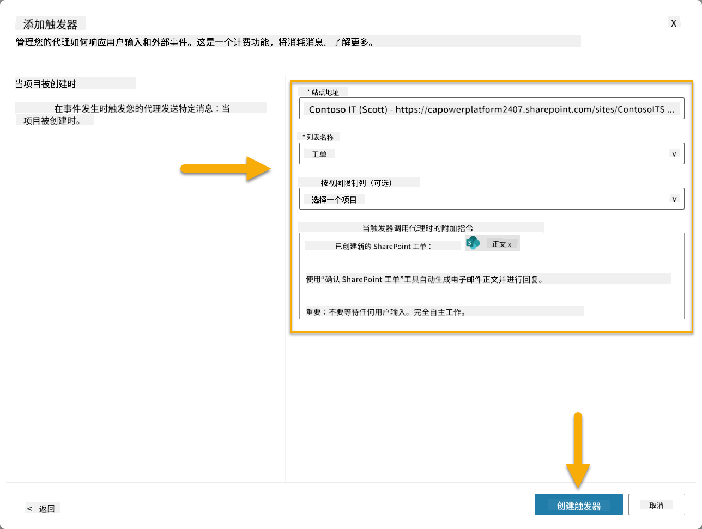

1. 选择**创建触发器**以完成触发器创建。一个Power Automate云流会自动创建以自主触发代理。

1. 选择**关闭**。

### 10.2 编辑触发器

1. 在**概览**选项卡的**触发器**部分，选择**新支持工单在SharePoint中创建**触发器旁的**...**菜单

1. 选择**在Power Automate中编辑**  
   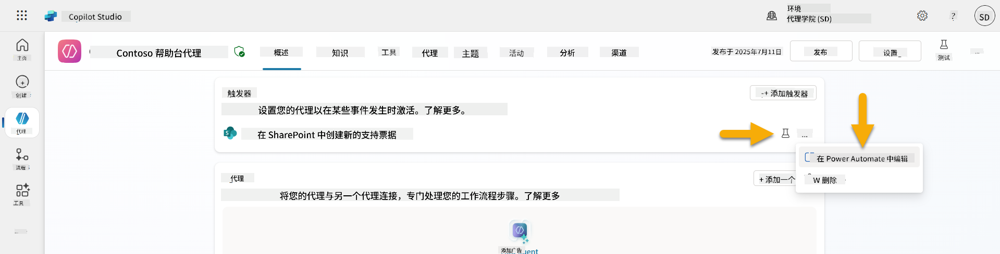

1. 选择**发送提示到指定的Copilot进行处理**节点

1. 在**正文/消息**字段中，删除正文内容，**按下斜杠键**（/）并选择**插入表达式**  
   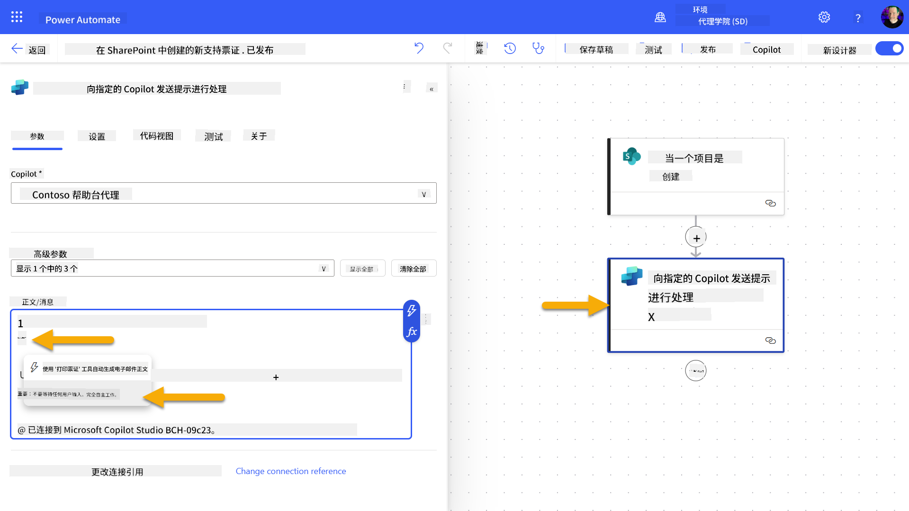

1. 输入以下表达式以向代理提供有关工单的具体详细信息：

    ```text
    concat('Submitted By Name: ', first(triggerOutputs()?['body/value'])?['Author/DisplayName'], '\nSubmitted By Email: ', first(triggerOutputs()?['body/value'])?['Author/Email'], '\nTitle: ', first(triggerOutputs()?['body/value'])?['Title'], '\nIssue Description: ', first(triggerOutputs()?['body/value'])?['Description'], '\nPriority: ', first(triggerOutputs()?['body/value'])?['Priority/Value'],'\nTicket ID : ', first(triggerOutputs()?['body/value'])?['ID'])
    ```

1. 选择**添加**  
   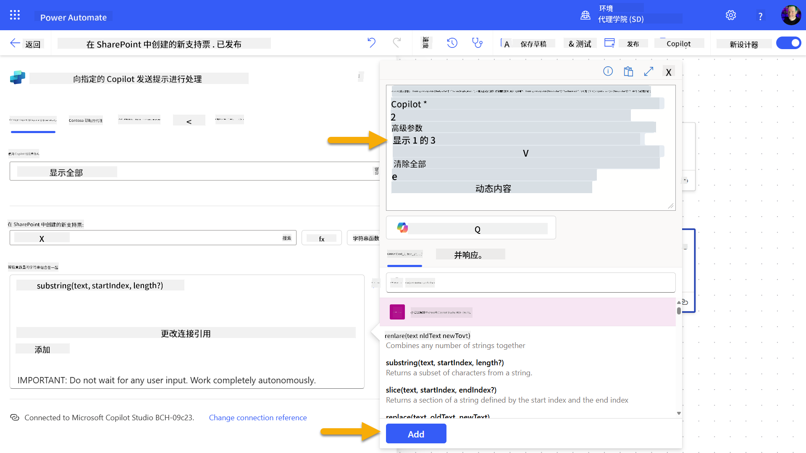

1. 在右上工具栏中选择**发布**。

### 10.3 创建用于邮件确认的工具

1. **返回**到你的代理在Copilot Studio中

1. 导航到代理的**工具**选项卡

1. 点击**+ 添加工具**并选择**连接器**

1. 搜索并选择**发送邮件（V2）**连接器  
    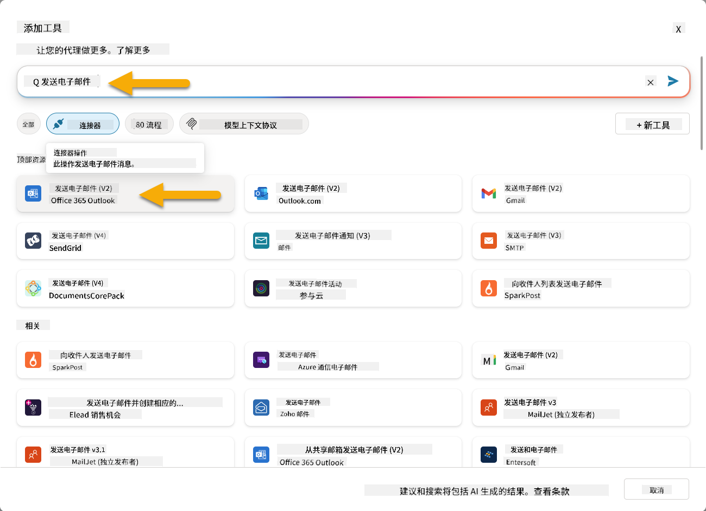

1. 等待连接配置完成，然后选择**添加并配置**

1. 配置工具设置：

   - **名称**：确认SharePoint工单
   - **描述**：此工具发送邮件确认，表示已收到工单。

1. 选择**自定义**旁边的输入参数并按以下方式配置：

    **收件人**：

    - **描述**：提交SharePoint工单的人的电子邮件地址
    - **标识为**：电子邮件

    **正文**：

    - **描述**：确认已收到工单，我们将在3个工作日内回复。

    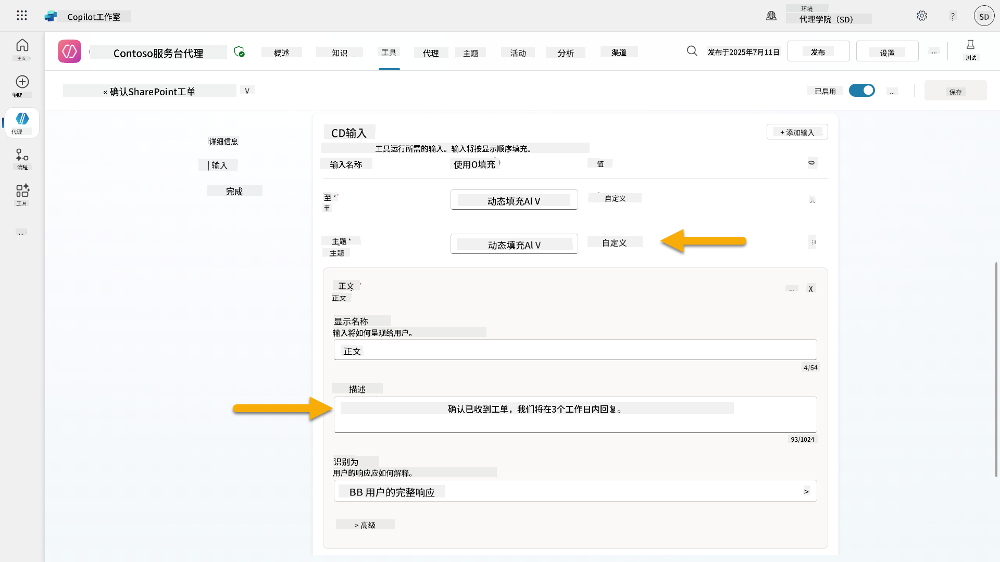

1. 选择**保存**

### 10.4 测试触发器

1. 在你的**帮助台代理**中，选择**概览**选项卡
1. 点击**测试触发器**图标，位于**新支持工单在SharePoint中创建**触发器旁。这将加载**测试触发器**窗口。
1. 打开一个新的浏览器标签页，导航到您的 **SharePoint IT支持工单列表**  
1. 点击 **+ 添加新项目** 来创建一个测试工单：  
   - **标题**: "无法连接到VPN"  
   - **描述**: "最近更新后无法连接到公司WIFI网络"  
   - **优先级**: "普通"  

1. **保存** SharePoint项目  
    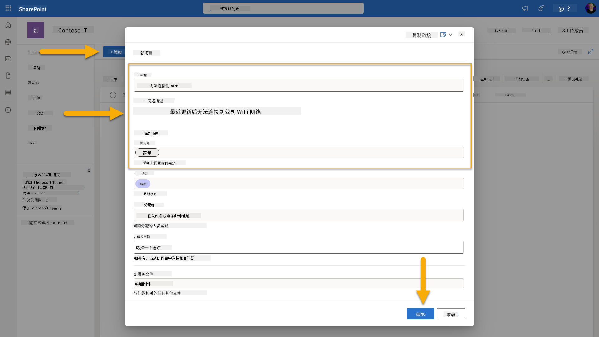  
1. 返回 **Copilot Studio** 并在 **测试触发器** 面板中监控触发器激活情况。使用 **刷新** 图标加载触发事件，这可能需要几分钟。  
    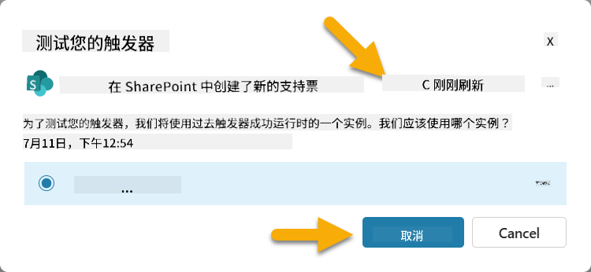  
1. 触发器出现后，选择 **开始测试**  
1. 点击 **活动地图图标**，位于 **测试您的代理** 面板顶部  
1. 验证您的代理：  
   - 收到了触发器的有效负载  
   - 调用了 "确认SharePoint工单" 工具  
     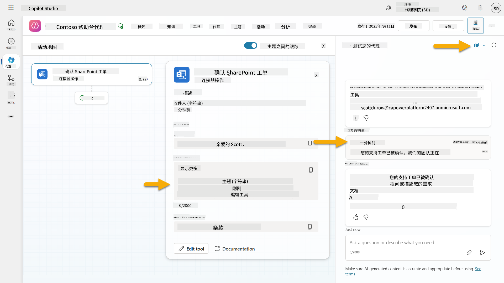  
1. 检查提交者的电子邮件收件箱，确认已发送确认邮件  
    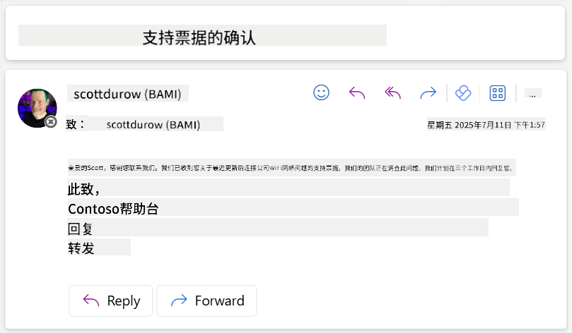  
1. 在 Copilot Studio 的 **活动** 标签中查看完整的触发器和工具执行记录  

## ✅ 任务完成  

🎉 **恭喜！** 您已成功实现了使用连接器工具的事件触发器，使您的代理能够自主运行，自动发送邮件确认并处理支持工单，无需用户干预。一旦您的代理发布，它将代表您自主行动。  

🚀 **接下来**: 在下一课中，您将学习如何将您的代理 [发布到 Microsoft Teams 和 Microsoft 365 Copilot](../11-publish-your-agent/README.md)，让整个组织都能使用它！  

⏭️ [进入 **发布您的代理** 课程](../11-publish-your-agent/README.md)  

## 📚 战术资源  

准备深入了解事件触发器和自主代理吗？查看以下资源：  

- **Microsoft Learn**: [在Copilot Studio中让您的代理自主运行](https://learn.microsoft.com/training/modules/autonomous-agents-online-workshop/?WT.mc_id=power-177340-scottdurow)  
- **文档**: [添加事件触发器](https://learn.microsoft.com/microsoft-copilot-studio/authoring-trigger-event?WT.mc_id=power-177340-scottdurow)  
- **最佳实践**: [Power Automate触发器介绍](https://learn.microsoft.com/power-automate/triggers-introduction?WT.mc_id=power-177340-scottdurow)  
- **高级场景**: [将Power Automate流与代理结合使用](https://learn.microsoft.com/microsoft-copilot-studio/advanced-flow-create?WT.mc_id=power-177340-scottdurow)  
- **安全性**: [Copilot Studio的数据丢失防护](https://learn.microsoft.com/microsoft-copilot-studio/admin-data-loss-prevention?WT.mc_id=power-177340-scottdurow)  


---

**免责声明**：  
本文档使用AI翻译服务[Co-op Translator](https://github.com/Azure/co-op-translator)进行翻译。尽管我们努力确保翻译的准确性，但请注意，自动翻译可能包含错误或不准确之处。原始语言的文档应被视为权威来源。对于关键信息，建议使用专业人工翻译。我们不对因使用此翻译而产生的任何误解或误读承担责任。