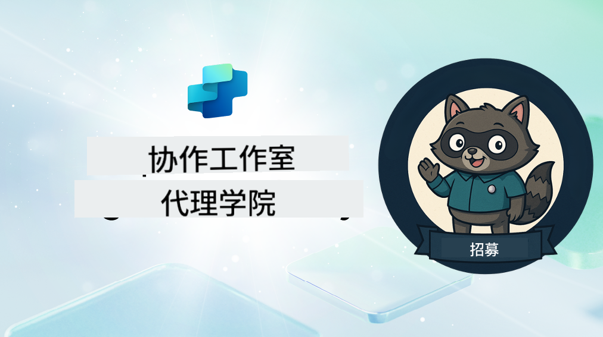

<!--
CO_OP_TRANSLATOR_METADATA:
{
  "original_hash": "8b5ecad9d5d073ea3f4c2b844e80f2e5",
  "translation_date": "2025-10-18T02:42:42+00:00",
  "source_file": "docs/recruit/README.md",
  "language_code": "zh"
}
-->
# 欢迎新兵

**欢迎，新兵。**  
你的任务——如果你选择接受——是掌握使用 **Microsoft Copilot Studio** 构建智能代理的艺术。

这次实践培训是你进入**智能代理世界**的起点：从基础提示到自适应卡片和代理流程，你将学习如何使用真实世界的工具和用例来构建、扩展和部署智能代理。

---

## 🎯 任务目标

完成代理学院后，你将能够：

- 了解在 Microsoft Copilot Studio 中代理的定义和作用
- 探索大型语言模型（LLMs）、检索增强生成（RAG）和编排如何在代理中协同工作
- 构建**声明式**和**自定义代理**
- 使用**主题**、**自适应卡片**和**代理流程**增强代理功能
- 将代理部署到 **Microsoft Teams** 和 **Microsoft 365 Copilot**

---

## 🧪 前置条件

完成所有任务需要：

- 一个 Microsoft 365 开发者租户（启用 SharePoint）
- 访问 **Microsoft Copilot Studio**（试用版或授权版）
- 可选：对 SharePoint、Power Platform 或 Power Fx 的基础知识

---

## 🧬 适合人群

本课程适合以下人群：

- 探索 **Copilot Studio** 的创作者和开发者
- 构建 **Microsoft 365 Copilot 扩展**的 IT 专业人士
- 希望通过智能代理**提升技能**的 Power Platform 爱好者
- 喜欢通过**实践学习**的任何人

---

## 🧭 课程概览

本学院分为循序渐进的课程——每节课都设计为一个实战任务，帮助你提升构建代理的技能。

| 课程 | 标题 | 任务简报 |
|------|------|----------|
| `00` | 🧰 [课程设置](./00-course-setup/README.md) | 设置开发环境、Copilot Studio 试用版和 SharePoint 站点 |
| `01` | 🧠 [代理简介](./01-introduction-to-agents/README.md) | 了解对话式 AI 概念、LLMs，以及自主代理与声明式代理的区别 |
| `02` | 🛠️ [Copilot Studio 基础](./02-copilot-studio-fundamentals/README.md) | 学习构建模块：知识、技能、自治 |
| `03` | 👩‍💻 [创建声明式代理](./03-create-a-declarative-agent-for-M365Copilot/README.md) | 在 Microsoft 365 Copilot 中添加基于提示的代理 |
| `04` | 🧩 [创建解决方案](./04-creating-a-solution/README.md) | 将你的代理打包成可重复使用的解决方案以便环境管理 |
| `05` | 🚀 [使用预构建代理入门](./05-using-prebuilt-agents/README.md) | 使用并自定义模板代理以加速设置 |
| `06` | ✍️ [构建自定义代理](./06-create-agent-from-conversation/README.md) | 创建一个基于知识源的新 Copilot |
| `07` | 🧠 [添加带触发器的主题](./07-add-new-topic-with-trigger/README.md) | 使用主题定义自定义问答路径 |
| `08` | 🪪 [使用自适应卡片增强功能](./08-add-adaptive-card/README.md) | 使用 Power Fx 和 SharePoint 构建自适应卡片 |
| `09` | 🔁 [通过代理流程实现自动化](./09-add-an-agent-flow/README.md) | 使用自适应卡片输入触发后端流程 |
| `10` | 🧭 [添加事件触发器](./10-add-event-triggers/README.md) | 使你的代理能够通过基于事件的逻辑自主行动 |
| `11` | 📢 [发布你的代理](./11-publish-your-agent/README.md) | 将你的代理部署到 Microsoft Teams 和 Microsoft 365 Copilot |
| `12` | 🪪 [了解授权](./12-understanding-licensing/README.md) | 了解 Copilot Studio 的授权和计费方式 |
| `13` | 🚨 [获取新兵徽章](./course-completion-badges-recruit/README.md) | 领取你的徽章并标记你的成就！ |

!!! note
    ✅ 完成此课程后可获得 **新兵** 徽章。  
    🔓 **特工** 和 **指挥官** 徽章将在未来阶段解锁。

<!-- markdownlint-disable-next-line MD033 -->

---

**免责声明**：  
本文档使用AI翻译服务[Co-op Translator](https://github.com/Azure/co-op-translator)进行翻译。尽管我们努力确保翻译的准确性，但请注意，自动翻译可能包含错误或不准确之处。原始语言的文档应被视为权威来源。对于重要信息，建议使用专业人工翻译。我们对因使用此翻译而产生的任何误解或误读不承担责任。